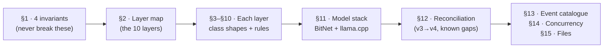
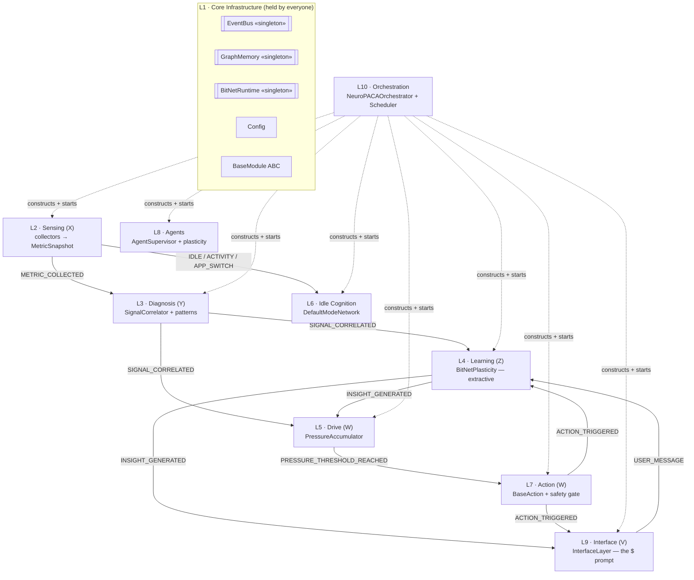
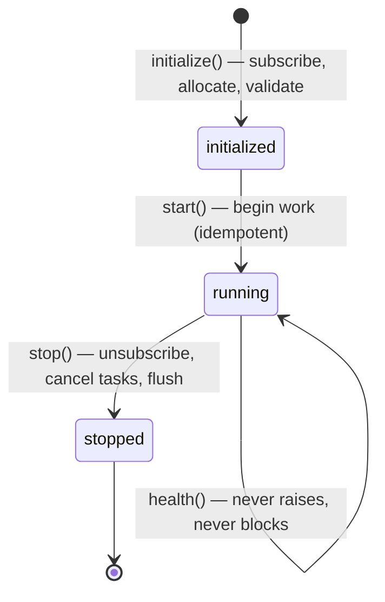
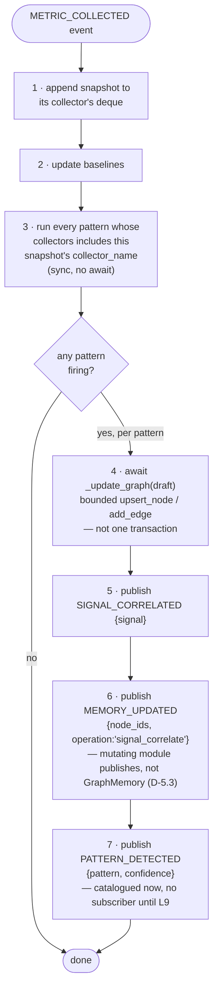
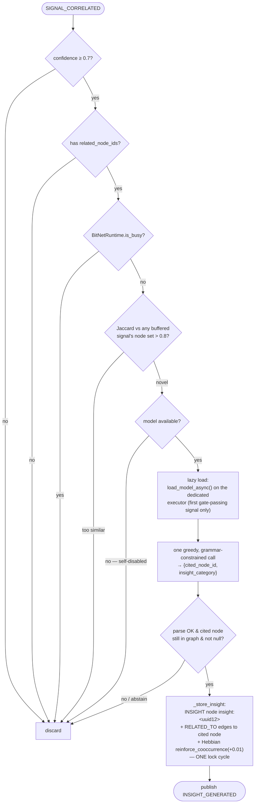
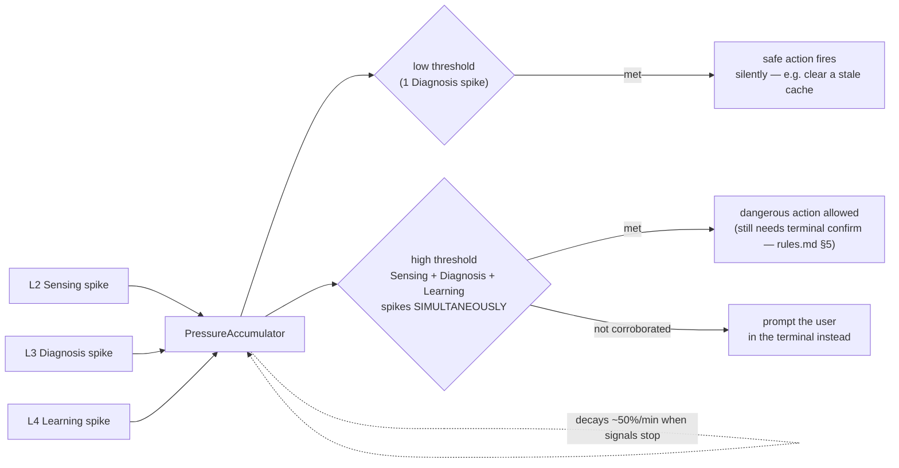
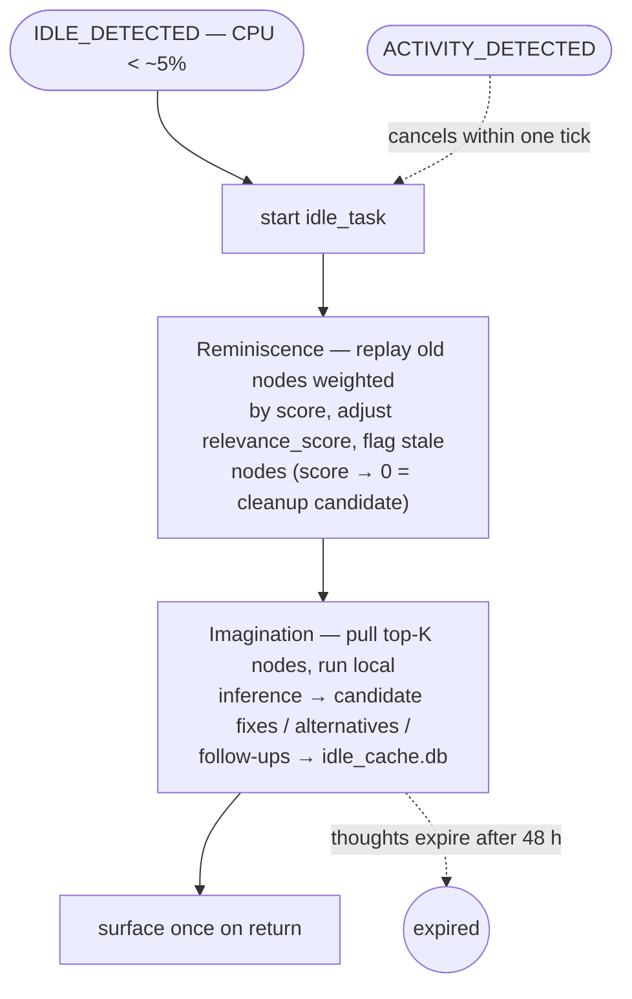
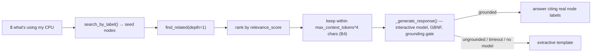
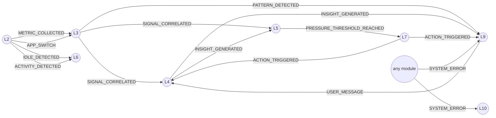

```mermaid
flowchart TD
    subgraph startup["Startup"]
        A1[load + validate Config] --> A2["GraphMemory.load()"]
        A2 --> A3["BitNetRuntime.load_model()<br/>(lazy option)"]
        A3 --> A4["EventBus.start()"]
        A4 --> A5["construct all 8 modules<br/>with injected references"]
        A5 --> A6["initialize() each"]
        A6 --> A7["start() in dependency order:<br/>L2 → L3 → L4 → L5 → L7 → L6 → L9"]
        A7 --> A8["start background timers:<br/>graph save · pressure decay · score recalc"]
    end
    subgraph shutdown["Shutdown (SIGTERM)"]
        B1[stop collectors] --> B2["cancel idle_task"]
        B2 --> B3[drain queue]
        B3 --> B4["stop() each module"]
        B4 --> B5["EventBus.stop()"]
        B5 --> B6["GraphMemory.save()"]
        B6 --> B7["unload_model()"]
    end
```

# Architecture — NeuroPACA v4

| | |
| --- | --- |
| **Status** | Blueprint |
| **Authoritative source** | the v4 class diagram (`1000071408.png`), supported by `neuropaca-v4.html` (full concept) and `neuropaca-overview.html` (overview + tech-fix) |
| **Supersedes** | the X/Y/Z/W/V manager model — see §12 |

### Reading guide



---

## 1. The four critical invariants

These are on the blueprint. **Violating any of them is a defect.**

| # | Invariant | The trap it prevents |
| --- | --- | --- |
| 1 | **Services are held, not inherited.** `EventBus`, `GraphMemory`, `BitNetRuntime` are singletons. Modules hold *references* — they do **not** inherit from them. | Hidden god-objects; broken test isolation |
| 2 | **`GraphMemory` uses `asyncio.Lock`, not `threading.Lock`.** | Mixing the two silently deadlocks |
| 3 | **`BitNetRuntime.infer()` is blocking.** Always wrap it in `loop.run_in_executor()` (`infer_async()`). | The event loop freezes for seconds |
| 4 | **`SignalCorrelator` produces `SIGNAL_CORRELATED`; `PressureAccumulator` and `BitNetPlasticity` consume it — independently.** They never call each other directly. | Direct module coupling; ordering bugs |

**Derived principle:** modules communicate only by publishing and subscribing on the `EventBus`. **No module imports another module.** Intelligence is emergent — no single "brain" decides; behaviour emerges from which modules fire together.

---

## 2. Layer map



| Layer | Name | Legacy | Primary classes |
| --- | --- | --- | --- |
| **L1** | Core Infrastructure | — | `EventBus`, `GraphMemory`, `BitNetRuntime`, `Config`, `Node`/`Edge`, enums, `BaseModule` |
| **L2** | Sensing | X | `XMetricCollector`, `BaseCollector`, `SystemMetricCollector`, `FileSystemCollector`, `ActivityCollector`, `MetricSnapshot` |
| **L3** | Diagnosis | Y | `SignalCorrelator`, `BasePattern`, `HighLoadPattern`/`IdlePattern`/`FocusSessionPattern`/`DistractionPattern`, `Signal`, `Insight` |
| **L4** | Learning | Z | `BitNetPlasticity` |
| **L5** | Drive | W | `PressureAccumulator`, `PressureEntry` |
| **L6** | Idle Cognition | — | `DefaultModeNetwork` |
| **L7** | Action | W | `BaseAction`, `NotificationAction`, `FileWriteAction`, `RunCommandAction`, `ApiCallAction`, `MemoryWriteAction` *(reconstructed — §11b)* |
| **L8** | Agents | — | `AgentSupervisor` *(reconstructed — §11b)* |
| **L9** | Interface | V | `InterfaceLayer`, `Message`, `InterfaceChannel` |
| **L10** | Orchestration | — | `NeuroPACAOrchestrator`, `BaseModule` |

`BaseModule` is the abstract base shared by **all 8 modules** (L2–L9). `NeuroPACAOrchestrator` manages `modules: List[BaseModule]`. The lifecycle contract is *not detailed* in the blueprint — §3.7 defines the binding version.

---

## 3. L1 · Core Infrastructure

### 3.1 `EventBus` «singleton»

```
- _instance      : EventBus                      (class-level)
- subscribers    : Dict[EventType, List[Callable]]
- event_queue    : asyncio.Queue(maxsize=1000)   (B1 decision — bounded)
- loop           : asyncio.AbstractEventLoop
- is_running     : bool
- _dropped_count : int                           (surfaced in SystemHealth)

+ get_instance()                              : EventBus  (static)
+ subscribe(event_type: EventType, callback: Callable)   : None
+ unsubscribe(event_type: EventType, callback: Callable) : None
+ publish(event: Event)                       : None
+ start() / stop()                            : None
- _dispatch_loop()                            : None  «async»
```

| Behaviour | Rule |
| --- | --- |
| `publish()` | Enqueues and returns immediately — publishers never wait on subscribers. |
| Full queue | **Bounded queue, drop-on-full** (B1 decision, approved 2026-08-29). `publish()` is `put_nowait()` wrapped in `try/except asyncio.QueueFull`: on full it drops the incoming event, increments `_dropped_count`, and logs one `ERROR` (`"EventBus queue full — dropped {event_type}"`). It does **not** enqueue a `SYSTEM_ERROR` *event* (the queue is full — that would drop too); the drop is a logged SYSTEM_ERROR-severity condition and `_dropped_count` shows in `SystemHealth`. **A full queue means the dispatch loop is wedged — that is the real bug to fix, not the drop.** |
| Per-subscriber isolation | `_dispatch_loop` wraps each callback; a handler that raises is caught and reported as a `SYSTEM_ERROR` event, siblings still run. A failure inside a `SYSTEM_ERROR` handler is logged only — never re-published. |
| Coupling | Signals are published async; all modules subscribe; no direct coupling. |
| Persistence | None across restarts. Anything needing durability writes to the graph. |

### 3.2 `GraphMemory` «singleton»

```
- graph            : networkx.MultiDiGraph          (B1 decision — see below)
- persistence_path : str
- last_save        : datetime
- dirty            : bool
- _lock            : asyncio.Lock

+ get_instance()                              : GraphMemory  (static)
+ add_node(node_id: str, node_type: NodeType, attributes) : Node
+ upsert_node(node_id: str, node_type: NodeType, attributes) : Node   (B3 decision — get-or-create)
+ add_edge(source: str, target: str, relation: RelationType, weight) : Edge
+ reinforce_edge(a: str, b: str, delta=0.01)  : int   (B4 — Hebbian; existing edges only, both directions)
+ reinforce_cooccurrence(node_ids, delta=0.01) : int  (B4 — one episode's pairwise Hebbian, single lock)
+ get_node(node_id: str)                      : Optional[Node]
+ query(node_type: NodeType, filters)         : List[Node]
+ find_related(node_id: str, depth, *, traverse_hubs=False) : List[Node]
+ search_by_label(query: str, limit=10)       : List[Node]   (B5 — L9 retrieval seed; O(N) substring + exact hub-slug match, zero embeddings)
+ get_edges(node_id: str)                     : List[Edge]
+ update_node(node_id: str, attributes)       : None
+ delete_node(node_id: str)                   : None
+ recalculate_importance()                    : None
+ consolidate()                               : None
+ prune(older_than, min_importance)           : int
+ save() / load()                             : None
```

Score-management surface (from the concept): `get_top_k(domain, k, filters)`, `decay_scores(factor, min_val)`, `prune_low_score(threshold, domain)`, `export_subgraph(domain)`.

| Rule | Detail |
| --- | --- |
| `graph` is private | Nothing outside `GraphMemory` touches the `networkx` object. |
| **`MultiDiGraph`, not `DiGraph`** (B1, 2026-08-29) | A plain `DiGraph` collapses every relation between the same ordered pair into one edge — `pytest CAUSED_BY crash` and `pytest FOLLOWED_BY commit` between the same two nodes cannot coexist. Edge identity is `(source, target, relation)`; the `RelationType` is the networkx edge **key**. `get_edges()` returns every parallel edge. On-disk form (`nx.node_link_data`, `multigraph: true`) gains a `key` per link. |
| **Node / Edge IDs are `str` everywhere** (B1) | `file:/abs/path`, `app:code`, `domain:engineering`, `YOU` — stable and deterministic (rules.md §3). No `UUID` for anything that identifies or references a node; every node-reference field (`Message.related_node_ids`, `Insight.context_nodes`, …) is `List[str]`. `Event.id` stays a `UUID` — it identifies an event, not a node. |
| **Routing skeleton is a hard-coded protected set** (B1) | The 11 hub IDs — `YOU` plus `domain:{engineering, research, tools, system, habits, projects, meetings, comms, mental_models, learning}` (PRD §F3). `prune()` and `prune_low_score()` skip any ID in this set regardless of age or score — low-score cleanup must never collapse the routing layer. Created once at `load()` when the store is empty. |
| **`find_related()` does not traverse through hubs** (B1) | The `YOU` hub and the 10 domain hubs connect to nearly everything; a depth-2 BFS through one of them fans out to the whole graph and blows the < 50 ms target. BFS never expands a hub node's neighbours (`traverse_hubs=False` default); a hub still appears in the result if it is directly adjacent to the seed. |
| One lock, lock-free workers | All writes serialise through the single `_lock`. Public methods acquire the lock and call **lock-free `_*_locked` workers**; compound operations (`consolidate`, `prune`) take the lock **once** and call several workers. |
| **`upsert_node()` is the only sanctioned get-or-create** (B3, 2026-08-30) | `add_node()` on an existing id *overwrites every attribute* — wiping `relevance_score` / `access_count` / `created_at`; a module that touches the same entity every poll must use `upsert_node()`. On an existing node it merges only the supplied `attributes`, bumps `access_count`, refreshes `last_accessed`, and **preserves** `created_at` and `relevance_score`; on a missing node it creates it like `add_node()`. One `_lock` acquisition, so the check-and-create is race-free against the scheduler and (from B4) L4. Callers must `upsert_node()` both endpoints **before** `add_edge()` — networkx `add_edge` silently creates attribute-less phantom nodes that then crash `get_node()` and serialisation. |
| Reentrancy | `asyncio.Lock` is not reentrant — a public method calling another public method while holding `_lock` deadlocks the loop forever (problems.md 1.10). |
| Atomic save | `save()` is atomic: temp file → `fsync` → `os.replace` → `fsync` the directory. |

**`relevance_score`** (0–10 composite, recomputed on a schedule, never per-event):

```
score = normalize(
      frequency        * 3.0
    + decay(last_seen) * 3.0
    + log(connections) * 2.0
    + bridge_value     * 2.0
)
```

### 3.3 `BitNetRuntime` «singleton»

```
- model             : Any
- tokenizer         : Any
- model_path        : str
- max_context_tokens: int
- is_loaded         : bool
- _inference_lock   : asyncio.Lock
- temperature       : float
- is_busy           : bool

+ get_instance()                                          : BitNetRuntime  (static)
+ load_model() / unload_model()                           : None        ← load_model BLOCKING
+ load_model_async()                                      : Awaitable[bool]  «async»  (B4 lazy load, dedicated executor)
+ infer(prompt, max_tokens, temperature, grammar=None, *, interactive=False)    : str        ← BLOCKING
+ infer_async(prompt, max_tokens, temperature=0.0, grammar=None, *, interactive=False) : Awaitable[str]  «async»
+ load_interactive_model_async()                          : Awaitable[bool]  «async»  (B5 D-12 — lazy Qwen2.5-3B Q4 for $ / $?)
+ build_context_from_nodes(nodes: List[Node])             : str
+ get_ram_usage_mb()                                      : float
```

**Dual model (B5, D-12).** A second, optional backend serves the interactive
`$` / `$?` path — a Qwen2.5-3B Q4 GGUF that can write a grounded sentence where
2B4T cannot (`problems.md` 1.13). `infer[_async](interactive=True)` routes to it;
it lazy-loads on the first such call (a `gc.collect()` runs first) and is
resident concurrently with the loop model (**~4.7 GB peak measured on the 16 GB
box**, PRD §9). **The single `_inference_lock` still serialises every call
system-wide** — the two models never run at once. Absent
`interactive_model_path`, `$?` falls back to L9's extractive template.

- Owns `model` + `tokenizer` **in-process via llama.cpp** — not an HTTP call to Ollama. See §11.
- `infer_async()` acquires `_inference_lock`, then `run_in_executor`. **One inference at a time, system-wide.**
- Model can be unloaded and lazily reloaded.
- **`grammar: Optional[str] = None`** (B1, 2026-08-29) — a GBNF string, assembled by the caller *before* the lock (rules.md §4.1). Present on both `infer` / `infer_async` **and** the `InferenceBackend` protocol from B1, so B4's constrained-generation path needs no signature change. `None` = free decode (used only by tests and the `$` interactive path).
- **`InferenceBackend` protocol** (B1): `load()`, `unload()`, `infer(prompt, max_tokens, temperature, grammar=None) -> str`, `get_ram_usage_mb() -> float`. Two implementations in B1: `LlamaCppBackend` (skeleton) and `FakeInferenceBackend` (deterministic — rules.md §8). Selected by `Config.inference_backend`. **Module code never imports a backend** (rules.md §4).

### 3.4 `Config` «dataclass»

```
model_path                  : str
graph_db_path               : str
action_log_path             : str
idle_threshold_seconds      : int
pressure_threshold          : float
max_concurrent_agents       : int
log_level                   : str
poll_intervals              : Dict[str, float]
graph_save_interval_seconds : int
bitnet_max_tokens           : int
inference_backend           : str = "llama"    (B1 — "fake" in tests)
correlation_window_seconds  : int = 1800       (B3 — L3 per-collector deque bound)
app_map_path                : str = "data/app_map.default.toml"  (B2.5b — activity→domain rules)
model_context_tokens        : int = 2048       (B4 — llama.cpp n_ctx)
adaptation_buffer_size      : int = 64         (B4 — L4 (Signal, Insight) deque + novelty set)
max_context_tokens          : int = 512        (B5 — L9 retrieval context, char-truncated at tokens*4)
interactive_model_path      : str = ""         (B5 D-12 — Qwen GGUF for $ / $?; empty => template fallback)
interactive_model_context_tokens : int = 2048  (B5 — interactive model n_ctx; ~300-token prompt, keep it small for RAM)
interface_socket_path       : str = ""         (B5 — empty => $XDG_RUNTIME_DIR/neuropaca.sock)
```

Concept variant also carries `n_threads`, `max_failures = 3`, `max_file_tokens = 4096`. Loaded once at startup, immutable thereafter. `from_file(path) -> Config`.

**`inference_backend`** (B1, 2026-08-29): `"llama"` selects `LlamaCppBackend`, `"fake"` selects `FakeInferenceBackend`. Validation is backend-aware — `model_path` must exist when `"llama"`, is ignored when `"fake"`.

### 3.5 Core data model

```
Event «dataclass»            Node «dataclass»                Edge «dataclass»
  id        : UUID             id              : str          source_id : str
  event_type: EventType        node_type       : NodeType      target_id : str
  payload   : Dict[str, Any]   name / label    : str           relation  : RelationType
  timestamp : datetime         created_at      : datetime      weight    : float
  source    : str              last_accessed   : datetime      created_at: datetime
  priority  : int              access_count    : int
                               relevance_score : float
                               priority        : int
                               surfaced_at     : datetime|None  (B5 — set by L9 on
                                                 first surface of an INSIGHT node;
                                                 persisted, graph schema v2)
```

**Node references are `str`, not `UUID`** (B1, 2026-08-29). `Node.id` / `Edge.source_id` / `Edge.target_id` are already `str`. Every field anywhere in the system that *holds* a node id is `List[str]` / `str` too — `Message.related_node_ids` (§9), `Insight.context_nodes` / `related_signal` (§5), event payloads. The blueprint's `List[UUID]` on `Message` is superseded. Only `Event.id` stays a `UUID` — it identifies an event, never a node.

### 3.6 Enumerations

```
EventType                      NodeType        RelationType
  METRIC_COLLECTED               TASK            RELATED_TO
  SIGNAL_CORRELATED              PERSON          CAUSED_BY
  PATTERN_DETECTED               CONCEPT         PART_OF
  ACTION_TRIGGERED               FILE            DEPENDS_ON
  MEMORY_UPDATED                 EVENT_LOG       CREATED
  PRESSURE_THRESHOLD_REACHED     METRIC          MODIFIED
  IDLE_DETECTED                  INSIGHT         FOLLOWED_BY
  ACTIVITY_DETECTED              APP             CONTRADICTS
  APP_SWITCH                     SESSION
  INSIGHT_GENERATED              GOAL
  USER_MESSAGE                                 SignalType
  AGENT_SPAWNED                                  FOCUS_SESSION   FILE_ACTIVITY
  AGENT_COMPLETED                                DISTRACTION     APP_SWITCH
  SYSTEM_ERROR                                   HIGH_LOAD       USER_RETURN
  SYSTEM_HEALTH_REQUEST   (B5)                    IDLE
  SYSTEM_HEALTH_REPORT    (B5)

InterfaceChannel                     MessageRole  (B5 — supersedes Message.role: str)
  CLI · WEB_SOCKET · NOTIFICATION_ONLY  USER · ASSISTANT · SYSTEM
```

**A string literal where an enum belongs is a defect.**

### 3.7 `BaseModule` «abstract»

The lifecycle contract shared by all 8 modules (not detailed in the blueprint — this is the binding version):

```python
class BaseModule(ABC):
    name: str
    is_running: bool
    event_bus: EventBus
    config: Config

    @abstractmethod
    async def initialize(self) -> None: ...   # subscribe, allocate, validate
    @abstractmethod
    async def start(self) -> None: ...        # begin work (idempotent)
    @abstractmethod
    async def stop(self) -> None: ...         # unsubscribe, cancel tasks, flush
    @abstractmethod
    def health(self) -> ModuleHealth: ...     # never raises, never blocks
```



---

## 4. L2 · Sensing (X)

```
XMetricCollector «Module»                 BaseCollector «abstract»
  - event_bus       : EventBus              + name                 : str
  - collectors      : List[BaseCollector]   + poll_interval_seconds : float
  - is_running      : bool                  + last_poll            : datetime
  - snapshot_buffer : List[MetricSnapshot]  + is_enabled           : bool
  + start() / stop()                        + collect() : MetricSnapshot  «abstract»
  + register_collector(c: BaseCollector)    + should_poll() : bool
  - _poll_loop() «async»

SystemMetricCollector   FileSystemCollector           ActivityCollector
  CPU/RAM/disk/temp       watch_paths                   last_active_window
  via psutil              recent_changes                last_input_time
                          watchdog.Observer thread      get_idle_seconds()  ← platform-specific

MetricSnapshot «dataclass»
  collector_name : str · timestamp : datetime · data : Dict[str, Any] · anomaly_score : float
```

| Rule | Detail |
| --- | --- |
| Cadence | Collects raw system data every 60 s. **No intelligence** — reads and publishes to the EventBus. |
| Non-blocking | `collect()` must be non-blocking (dispatch via `asyncio.to_thread`; `psutil.cpu_percent(interval=1)` alone costs a second). |
| Failure isolation | A collector that raises repeatedly disables itself and reports `SYSTEM_ERROR`; the others keep running. |
| Buffer | `snapshot_buffer` is a bounded ring buffer. |
| Inputs | `psutil`, `/proc`, shell hooks (Bash/Zsh), editor extension APIs, system event logs. |
| Emits | `METRIC_COLLECTED`, and `IDLE_DETECTED` / `ACTIVITY_DETECTED` on idle-state transitions. |

**B2.5a (D-9):** `ActivityCollector` is a `BaseModule` (event-driven, not polled). Idle backend behind the `IdleSource` protocol — `WaylandIdleSource` (`ext-idle-notify-v1` via pywayland, `loop.add_reader` on the compositor fd) in prod, `FakeIdleSource` in tests. `get_idle_seconds()` is not a query — `idled`/`resumed` are edges; the collector tracks elapsed for the `ACTIVITY_DETECTED` payload. `SystemMetricCollector` snapshot gains `top_processes` (names only). Active-window + `app_map.toml` + `FOCUS_SESSION`/`DISTRACTION` are B2.5b.

---

## 5. L3 · Diagnosis (Y)

```
SignalCorrelator «Module»                  BasePattern «abstract»
  - event_bus        : EventBus              + signal_type : SignalType        (class attr)
  - graph_memory     : GraphMemory           + collectors  : tuple[str, ...]   (class attr)
  - patterns         : List[BasePattern]     + matches(window, baseline) : bool
  - recent_snapshots : Dict[str, Deque[MetricSnapshot]]   (one deque per collector)
  - baselines        : Dict[(str,str), MetricBaseline]    (per collector+metric)
  + on_metric_event(event)  : None  «async»  + create_signal(window, baseline) : SignalDraft
  - _update_graph(draft)    : Signal «async» HighLoadPattern · IdlePattern
  - _publish(signal)        : None
                                             SignalDraft «dataclass»    Signal «dataclass»
MetricBaseline                                 signal_type              signal_type
  + observe(value: float)  : None              confidence               confidence
  + zscore(value: float)   : float             node_specs : List[NodeSpec]  related_node_ids : List[str]
  (rolling mean + population stddev,           source_snapshots         source_snapshots
   bounded window — confidence only)           reason : str             timestamp
```

### Concrete pattern triggers

B3 shipped `HighLoadPattern` + `IdlePattern` (approved 2026-08-30). B2.5b adds `FocusSessionPattern` + `DistractionPattern`, which read the **`"activity"` pseudo-collector** — synthetic `MetricSnapshot`s `SignalCorrelator` builds from `APP_SWITCH` events, one field being the `AppMap`-classified `domain` (D-10). `BasePattern.evaluate` is unchanged; the correlator gains one `APP_SWITCH` subscription.

| Pattern | Trigger (absolute — blueprint numbers) | Ships in |
| --- | --- | --- |
| `HighLoadPattern` | `system.cpu_percent > 90` for ≥ `ceil(300 / system_poll)` consecutive snapshots | ✅ B3 |
| `IdlePattern` | `system.cpu_percent < 5` for ≥ `ceil(idle_threshold_seconds / system_poll)` consecutive snapshots; resets at `cpu ≥ 10` (shares `IDLE_CPU_PERCENT` / `ACTIVE_CPU_PERCENT` with L2's `_IdleWatcher`) | ✅ B3 |
| `FocusSessionPattern` | active app classified `domain:engineering`/`domain:research` for ≥ 20 min with no switch away, and mean `system.cpu_percent ≥ ACTIVE_CPU_PERCENT` over the span (blueprint's "high CPU" read as "not idle" — editor focus rarely pins a core) | ✅ B2.5b |
| `DistractionPattern` | > 5 `APP_SWITCH` in a trailing 2 min; re-arms at ≤ 2 | ✅ B2.5b |

### Rules

- Rule-based, **zero inference in L3** (B3 exit criterion). The "LLM for complex cases" hook is a later addition, not B3.
- **Patterns are pure and synchronous.** `matches()` / `create_signal()` do CPU-only maths over a snapshot window + a read-only `MetricBaseline` and return a `SignalDraft` carrying **path strings, never graph nodes**. A pattern holds no `EventBus` / `GraphMemory` reference and no `await`. Each pattern instance keeps its own edge-trigger state (`_firing: bool`) so a signal is emitted **once per episode**, reset on the exit condition.
- **`SignalCorrelator` is the exclusive graph orchestrator.** It owns the per-collector deques and the baselines, maps a `SignalDraft`'s `node_specs` through `await graph_memory.upsert_node()` (each call one `_lock` cycle — never one lock around the batch, rules.md §3), fills `Signal.related_node_ids`, then publishes. Adding a 5th pattern = a class + one line in `build_modules()`; `SignalCorrelator` does not change.

### `on_metric_event` execution order (runs on the EventBus dispatch loop)



All alias/id/string work happens **before** step 4; nothing is awaited that a subscriber must finish (rules.md §2).

### `_update_graph` scope

- `HighLoadPattern` upserts `FILE` nodes for changed paths inside the correlation window. `IdlePattern` / `DistractionPattern` write none.
- From B2.5b (D-10): every `APP_SWITCH` upserts an `app:<id>` node and, when the `AppMap` classifies it, a `PART_OF` edge to its `domain:*` hub (bounded by distinct-app count); `FocusSessionPattern` names that `app:<id>` as its related node.
- `bridge_value` is live from B2.5b — a node's distinct `domain:*` reach, `0.0 / 0.5 / 1.0` (`graph_memory._bridge_value_unsafe`).

### `recent_snapshots` bound

`deque(maxlen = ceil(correlation_window_seconds / poll_intervals[collector]) + 1)` per collector — with the defaults (1800 s window, 60 s system poll) that is **31**. Provably bounded, config-derived, unit-tested. The `"activity"` pseudo-collector has no real cadence, so it uses a nominal 2 s interval for the same formula (maxlen ≈ 901, D-10).

---

## 6. L4 · Learning (Z)

```
BitNetPlasticity «Module»
  - event_bus        : EventBus
  - graph_memory     : GraphMemory
  - bitnet_runtime   : BitNetRuntime
  - _buffer          : deque[Tuple[Signal, Insight]]  (maxlen = adaptation_buffer_size)
  + on_signal_event(event)      : None  «async»
  - _handle(signal)             : None  «async»  — gate -> lazy load -> infer -> store
  - _too_similar(signal)        : bool         — Jaccard novelty vs _buffer
  - _store_insight(insight, sig): Insight «async»  — INSIGHT node + edges + Hebbian, one lock
```

**Extractive, not generative (D-11).** The B0 spike proved BitNet b1.58 2B4T cannot write a grounded sentence over graph context (`problems.md` 1.13). L4 asks the model for exactly **two enum-constrained fields** against a GBNF grammar:

```json
{ "cited_node_id": "n2" | null,          // one of THIS prompt's K aliases, or abstain
  "insight_category": "routine" | "anomaly" | "distraction" }
```

The human-readable `Insight.summary` is a **template** filled from the cited node's label + the signal type — never model text. `null` cited node = discard.

### The L4 pipeline



| Concern | Rule |
| --- | --- |
| **Gate** (drop in order) | `confidence < 0.7`; no `related_node_ids`; `BitNetRuntime.is_busy`; **Jaccard(this signal's node set, any buffered signal's) > 0.8** (no embeddings); model unavailable; no cited candidate survives in the graph; the parse fails or abstains (`rules.md §4.1`). |
| **Lazy load** | `BitNetRuntime.load_model_async()` (dedicated executor) fires on the *first signal that clears the gate* — an idle session never pays the ~1.4 GB tax. The backend self-disables (logs, `is_loaded` stays False) if `llama-cpp-python` or the model file is absent; L4 then drops every signal. |
| **Hebbian** | `_store_insight` calls `graph_memory.reinforce_cooccurrence(cited ∪ signal.related_node_ids, +0.01)` — one `_lock` cycle, bumps `weight` on **existing** edges only between every pair in the episode (both directions, all parallel relations), creates nothing. `recalculate_importance()` stays owned by the Scheduler. |
| **`_buffer`** | A bounded `deque[(Signal, Insight)]` — the novelty-comparison set and a record for later analysis, **not** an inference queue or a training set. Model weight adaptation is deferred (`pruning.md`). |

---

## 7. L5 · Drive (W) — Action Gradients

```
PressureAccumulator «Module»               PressureEntry «dataclass»
  - event_bus  : EventBus                    node_id      : str
  - graph_memory : GraphMemory               pressure     : float
  - pressure_map : Dict[str, float]          reason       : str
  - threshold  : float                       created_at   : datetime
  - decay_rate : float                       last_updated : datetime
  + on_signal_event(event)  : None
  + on_insight_event(event) : None
  + add_pressure(node_id, amount, reason) : None
  + decay()                 : None
  + get_top_pressures(n)    : List[PressureEntry]
  - _publish_if_over_threshold() : None
```



- **Low threshold** — a single spike from Diagnosis fires a safe action (clear a stale cache) instantly and silently.
- **High threshold** — a dangerous action (kill a frozen process) requires synchronised spikes from **Sensing + Diagnosis + Learning simultaneously**. If that triple corroboration isn't met, the system prompts you in the terminal instead of acting.
- Pressure decays ~50 %/min when signals stop arriving — last week's spike cannot combine with today's.
- Every `PressureEntry` carries a `reason`. **An action that cannot explain itself must not fire.**
- Emits `PRESSURE_THRESHOLD_REACHED`.

---

## 8. L6 · Idle Cognition — Default Mode Network

```
DefaultModeNetwork «Module»
  - event_bus      : EventBus
  - graph_memory   : GraphMemory
  - bitnet_runtime : BitNetRuntime
  - idle_threshold : timedelta
  - is_active      : bool
  - last_activity  : datetime
  - idle_task      : Optional[asyncio.Task]
  + on_idle_detected(event)          : None
  + on_activity_detected(event)      : None
  - _run_idle_cycle()                : None  «async»
  + consolidate_memory()             : None
  + prune_stale_nodes()              : int
  + link_orphan_nodes()              : None
  + generate_proactive_insights()    : List[Insight]
  + save_to_disk()                   : None
```



- Trigger: CPU drops below ~5 %. `on_activity_detected` **cancels** `idle_task` within one tick.
- Two jobs — **Reminiscence** (replay old graph nodes weighted by score, adjust `relevance_score`s, flag stale nodes; score → 0 makes a node a candidate for graph cleanup, and — in the deferred pruning work — for head removal) and **Imagination** (pull the top-K nodes, run local inference to generate candidate fixes / alternative approaches / follow-up queries, cache as "idle thoughts" in `idle_cache.db`, surface once on return).
- Idle thoughts expire after 48 h.
- **Do graph work in bounded transactions under the lock, one atomic call at a time**, so a cancellation mid-cycle never leaves the graph half-mutated.

> **B6 build (D-13).** `idle/dmn.py`. Idle thoughts live **in the graph** as `NodeType.IDLE_THOUGHT` nodes (`idle:<uuid12>`, edged `RELATED_TO` their cited nodes) — there is no separate `idle_cache.db`; the 48 h TTL is `GraphMemory.prune_stale_nodes(ttl)`. **Imagination is strictly extractive** (`problems.md` 1.13): the loop model fills `{"subject": alias, "object": alias|null, "query_template": <enum>}` and the question is rendered from a template (`learning/prompts.py PROACTIVE_TEMPLATES`), never generated; a thought publishes on `INSIGHT_GENERATED` with `Insight(category="proactive")` and L9 surfaces it once (B5 `surfaced_at`). **Strict budgets:** the whole cycle runs under `asyncio.timeout(dmn_cycle_wall_clock_seconds)` (overrun logged, not fatal); imagination makes ≤ `dmn_max_inferences_per_cycle` calls and bails on `BitNetRuntime.is_busy`. Reminiscence = `GraphMemory.consolidate()` (merge exact `node_type`+`label` duplicates: oldest `created_at`, summed `access_count`, averaged `relevance_score`, rewired edges, hubs skipped) + `link_orphan_nodes()` (degree-0 → `RELATED_TO` `YOU`) + `prune_stale_nodes()`. The Scheduler still owns `recalculate_importance` — the DMN never recalculates.

---

## 9. L9 · Interface (V)

```
InterfaceLayer «Module»  (B5)              Message «dataclass»
  - event_bus / graph_memory / bitnet_runtime  role             : MessageRole  (B5 — not str)
  - clock               : Clock               content          : str
  - conversation_history: List[Message]        related_node_ids : tuple[str,...]  (D-5 — not UUID)
  - _server             : asyncio.Server       timestamp        : datetime
  - _socket_path        : Path
  + on_user_input(prefix, text)          : dict «async»
  + on_insight_generated(event)          : None «async»
  - _build_context(query)                : List[Node]
  - _generate_response(query, ctx, *, diagnose) : (text, cited, conf, source) «async»
  + send_to_user(message)                : None
  - _store_message(role, content, ids)   : None
```

**Shape (B5).** A **Unix-domain socket** at `interface_socket_path` (default
`$XDG_RUNTIME_DIR/neuropaca.sock`), **JSONL framing** — one JSON request per
line, one JSON response per line. The thin CLI (`interface/cli.py`, the
`neuropaca` console script; the daemon is now `neuropacad`) is the only client.
Ops: `query` (`prefix` ∈ `$` `$?` `$!` `$$`), `health`, `insights`.



- The only module that talks to the human. `conversation_history` is a
  `list[Message]` in **RAM only** — never disk, graph, or log; every IPC payload
  is `redact()`-ed before it reaches a log line (rules.md §6).
- `_build_context()` retrieval: `search_by_label` → `find_related` → rank by
  `relevance_score` → keep what fits `max_context_tokens * 4` chars. **Zero
  inference in retrieval.**
- `_generate_response()` routes `$` / `$?` to `BitNetRuntime.infer_async(
  interactive=True)` behind a per-call GBNF grammar
  (`{insight, cited_nodes, confidence}`) and the `parse_answer` grounding gate
  (`rules.md §4.1`); one tighter retry for `$?`; any failure → extractive
  template, never a raw model string. `$?` also injects a one-line live system
  snapshot (L9 keeps the latest `METRIC_COLLECTED`).
- `$!` / `$$` are **parsed and reserved** — they need L7 (B7) and return
  `not available until B7`.
- **Health bridge (A6):** L9 cannot import L10, so `health` publishes
  `SYSTEM_HEALTH_REQUEST` and awaits `SYSTEM_HEALTH_REPORT` (2 s timeout).
- **Insight surfacing:** `on_insight_generated` filters by confidence ≥ 0.75 and
  category ∈ {anomaly, distraction}, then surface-once (stamps `Node.surfaced_at`,
  rehydrated at start so it survives a restart) and a daily cap (3/day, resets at
  local midnight via `Clock.now()`). `PATTERN_DETECTED` / `MEMORY_UPDATED` are
  **deliberately not subscribed** (B6).


- The only module that talks to the human. Filters noise, delivers smart notifications, formats `$` responses, drives a tray icon and a daily report.
- `conversation_history` is **RAM-only** — never persisted.
- `_build_context()` is retrieval: query → candidate nodes → `find_related()` → rank by `relevance_score` → truncate to `max_context_tokens`.
- Shell prefixes: `$` ask · `$?` diagnose (project context + live snapshot) · `$!` emergency (skips Y + Z, immediate action) · `$$` safe (backup + verify, never during tests).

---

## 10. L10 · Orchestration

```
NeuroPACAOrchestrator «entry point»
  - event_bus     : EventBus
  - graph_memory  : GraphMemory
  - bitnet_runtime: BitNetRuntime
  - modules       : List[BaseModule]
  - config        : Config
  - is_running    : bool
  + initialize()   : None
  + start()        : None
  + stop()         : None
  + health_check() : SystemHealth
```



---

## 11. Model stack — BitNet b1.58 2B4T + llama.cpp

| Piece | Choice | Why |
| --- | --- | --- |
| **The model** | BitNet b1.58 2B4T. Every weight ∈ {−1, 0, +1}, 1.58 bits/param. Matrix multiplications become additions and subtractions — no floating point at inference. ~0.4 GB of weights, ~1.1 GB resident *(B0 measured ~1.4 GB — PRD §9)*; runs on a laptop CPU without thermal throttling. | This is the **only** released, production-usable BitNet b1.58 checkpoint — larger BitNet sizes exist only as paper results. |
| **Serving** | llama.cpp, **in-process**. `BitNetRuntime` owns `model` + `tokenizer` directly — **not** an HTTP call to Ollama. One inference at a time system-wide (`_inference_lock`); `infer_async()` offloads the blocking call to `run_in_executor`. | Partly historical: an earlier design served the model through Ollama, which cannot expose model internals — see `pruning.md §3.3` for why that mattered. |
| **Keeping a 2B model coherent** | Every structured call runs against a task-specific **GBNF grammar** (a llama.cpp feature), with `cited_nodes` locked to an enum of the exact node IDs in the prompt, an `abstain` path in every schema, distilled input (≤ 5 nodes), greedy decoding, and a hard post-generation validation gate. | A 2B / 1.58-bit model drifts on open-ended prompts over graph context. Full rules: `rules.md §4.1`; the risk and the B0 test: `problems.md` 1.13. |

> **Personal weight pruning — deferred.** The project's original thesis is that graph `relevance_score`s drive which attention heads of this model survive, via a static `domain_to_heads` table, producing a sparse per-user model. This is the riskiest part of the project and 2B4T already fits a laptop without it. It is **deferred to the end of the roadmap** — full design, the `load_gguf_with_mask` mechanism, and open questions in [`pruning.md`](pruning.md). Nothing in L1–L10 depends on it; only `BitNetRuntime.load_model()` would later gain an optional `mask` argument.

---

## 11b. L7 Action & L8 Agents *(reconstructed)*

> ⚠️ **The class diagram is cut off at the right edge; L7 and L8 have no class boxes.** Their existence is confirmed by: the concrete-actions note (*Notification · FileWrite · RunCommand · ApiCall · Memory*), `EventType` members `ACTION_TRIGGERED` / `AGENT_SPAWNED` / `AGENT_COMPLETED`, and `Config` fields `action_log_path` / `max_concurrent_agents`. **Confirm both against a full-width re-export of the diagram before building them.**

**L7 · Action.** `BaseAction` contract (`validate()`, `dry_run()`, `execute()`, `rollback()`). Concrete actions: `NotificationAction`, `FileWriteAction`, `RunCommandAction`, `ApiCallAction`, `MemoryWriteAction`. Every effect runs behind a safety-check gate — sandboxed execution, backup before write, rollback available. Dangerous actions require terminal confirmation regardless of pressure. `ApiCallAction` is the only component permitted an outbound socket, disabled by default. Every attempt is appended to `action_log_path` as JSONL. Emits `ACTION_TRIGGERED`.

**L8 · Agents.** `AgentSupervisor` spawns bounded multi-step tasks capped by `Config.max_concurrent_agents`, each with a wall-clock and inference budget. Also the home of **structural plasticity** — `spawn_node()` / `kill_node()` on the EventBus, spawning temporary sub-clusters on load spikes and killing them (apoptosis) after `idle_ttl = 14d` of no firing. Emits `AGENT_SPAWNED` / `AGENT_COMPLETED`.

---

## 12. Blueprint reconciliation

### v3/v2 → v4

| Concern | Earlier | **v4** |
| --- | --- | --- |
| Module naming | X/Y/Z/W/V managers with numbered sub-agents (X1–X5, …) | 8 `BaseModule`s across L2–L9 |
| Inference serving | Ollama HTTP at `localhost:11434` | In-process `BitNetRuntime` via llama.cpp (tech-fix, §11) |
| Concurrency | threads + `threading.Lock` | single event loop + `asyncio.Lock` + executor for blocking calls |
| Idle cognition | "Reminiscence Agent" (DB housekeeping only) | `DefaultModeNetwork` — housekeeping **and** imagination |
| Action layer | binary manual approval for everything | Action gradients — low/high pressure thresholds |
| Architecture shape | 5 hard-coded permanent managers | structural plasticity — nodes spawn and undergo apoptosis |
| Sparsity/pruning | inference-time, via Ollama | mask applied once at model load, via llama.cpp — **deferred** (`pruning.md`) |
| Weekly model training | catastrophic-forgetting mitigation | out of scope for the core system; folded into `pruning.md` |

### Known gaps in the diagram

| Gap | Action |
| --- | --- |
| L7 and L8 cut off at the right edge | §11b is reconstructed. Re-export at full width and reconcile before building them. |
| `BaseModule` lifecycle not detailed | Defined in §3.7. |
| `SystemHealth` / `ModuleHealth` shapes undefined | Define in the core-infra phase. |
| Node/Edge/enum drift between the diagram and the concept HTML's inline code | The diagram wins. Concept variants noted inline above. |
| Naming drift (`BitNetPlasticity` vs `BehaviourPlasticity`, `XMetricCollector` vs `XMetricsCollector`, `SignalCorrelator` vs `SignalCorrelation`) | Use the diagram's names. |

---

## 13. Event catalogue



| Event | Publisher | Subscribers | Payload |
| --- | --- | --- | --- |
| `METRIC_COLLECTED` | L2 | L3 | `MetricSnapshot` |
| `IDLE_DETECTED` | L2 | L6 | idle duration, last activity |
| `ACTIVITY_DETECTED` | L2 | L6 | activity source |
| `APP_SWITCH` | L2 (`ActivityCollector`) | L3 | `{app_id, title, previous_app_id}` |
| `SIGNAL_CORRELATED` | L3 | **L4 and L5, independently** | `Signal` |
| `PATTERN_DETECTED` | L3 | L9 (optional) | pattern name, confidence |
| `INSIGHT_GENERATED` | L4 | L5, L9 | `Insight` |
| `PRESSURE_THRESHOLD_REACHED` | L5 | L7 | `PressureEntry` |
| `ACTION_TRIGGERED` | L7 | L9, L4 | action, result |
| `MEMORY_UPDATED` | the mutating module (L3 / L6 / L9) | L9 (optional) | `{node_ids: List[str], operation: str}` |
| `USER_MESSAGE` | L9 | L4 (optional — no subscriber yet) | `{text, prefix}` |
| `AGENT_SPAWNED` / `AGENT_COMPLETED` | L8 | — | agent id, goal, outcome |
| `SYSTEM_ERROR` | any | L9, L10 | module, exception, severity |
| `SYSTEM_HEALTH_REQUEST` | L9 | L10 | `{}` (B5 — L9 cannot import L10, A6) |
| `SYSTEM_HEALTH_REPORT` | L10 | L9 | `{health: SystemHealth-as-dict}` |
| `MEMORY_UPDATED` (`operation: "insight_surfaced"`) | L9 | L9 (optional) | `{node_ids, operation}` (B5 — `surfaced_at` stamp) |

---

## 14. Concurrency & load tiers

**One process. One event loop. One inference executor.**

| Work | Where it runs |
| --- | --- |
| Event dispatch, graph reads/writes | Event loop (graph under `asyncio.Lock`) |
| `collector.collect()` | `asyncio.to_thread` |
| `BitNetRuntime.infer()` | dedicated single-worker `run_in_executor` |
| Graph `save()` | `asyncio.to_thread` |
| DMN idle cycle | cancellable `asyncio.Task` |
| `watchdog.Observer` | its own thread; callbacks marshal to the loop |

**Load tiers:**

| Tier | When | Cost |
| --- | --- | --- |
| Sensing | always on | ≈ 0 % CPU — logging to buffer, no inference |
| Inference | on `$` command, or an insight/idle thought | small spike, BitNet is fast, stops immediately |
| Score recompute + graph consolidation/prune | idle / night | heavier — DMN, only while you're away |

*(A "weekly model training" tier existed in the concept; it belongs to the deferred pruning work — `pruning.md`.)*

---

## 15. Files (target)

```
neuropaca/
├── 1000071408.png · neuropaca-v4.html · neuropaca-overview.html   # the blueprint
├── PRD.md · Architecture.md · rules.md · phases.md · design.md · memory.md · problems.md · pruning.md
├── src/neuropaca/
│   ├── daemon.py
│   ├── core/         # L1 — event_bus, graph_memory, bitnet_runtime, config, base_module, enums
│   ├── sensing/      # L2 — collector_module, base_collector, collectors/
│   ├── diagnosis/    # L3 — correlator, base_pattern, patterns/, signal, insight
│   ├── learning/     # L4 — plasticity, prompts.py  (all prompt strings live here)
│   ├── drive/        # L5 — pressure_accumulator, pressure_entry
│   ├── idle/         # L6 — dmn, consolidation
│   ├── action/       # L7 — base_action, actions/, audit
│   ├── agents/       # L8 — supervisor, structural plasticity
│   ├── interface/    # L9 — layer, message, channels/, formatting (see design.md)
│   └── orchestration/# L10 — orchestrator, scheduler
├── tests/
├── experiments/      # DEFERRED — pruning/ spike lives here first (see pruning.md); not shipped
└── data/             # gitignored — graph.json, idle_cache.db, actions.jsonl, logs
```

Package directory names map 1:1 to layers. All prompt strings live in `learning/prompts.py`. The eventual `src/neuropaca/sparsity/` package is deferred (`pruning.md`) and is never imported by the running daemon.

---

*Related: [PRD.md](PRD.md) · [rules.md](rules.md) · [phases.md](phases.md) · [design.md](design.md) · [memory.md](memory.md)*
