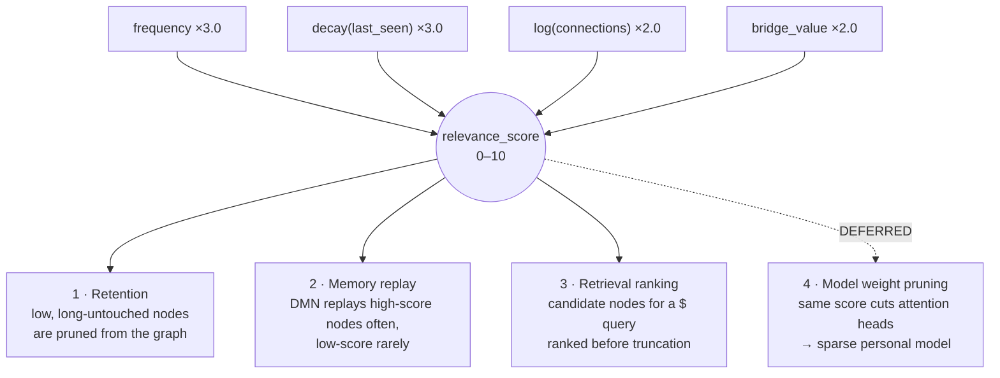
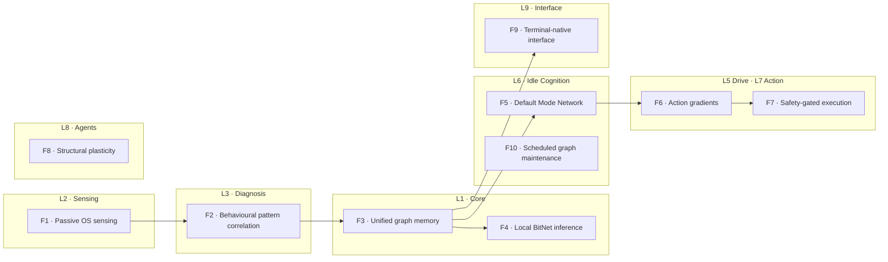
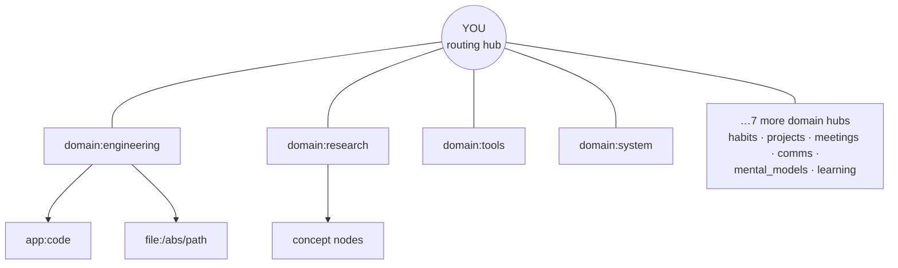

# PRD — NeuroPACA v4

| | |
| --- | --- |
| **Product** | NeuroPACA — Neuromorphic Personal Autonomous Computing Agent |
| **Status** | Research concept / prototype |
| **Owner** | Jatin Bhanot (Chitkara University, 2026) |
| **Derived from** | `neuropaca-v4.html`, `neuropaca-overview.html`, and the v4 class diagram (`1000071408.png`) |

---

## 1. One-line definition

> NeuroPACA is a local-first, always-on agent that watches how you work, builds a behavioural graph of your habits, and uses that graph to give grounded, personal answers from a local **BitNet b1.58 2B4T** model — with zero cloud dependency.
> *(A later phase adapts the model's weights to your domain too — deferred, see [`pruning.md`](pruning.md).)*

---

## 2. The problem

Most people adapt to their machine. **NeuroPACA flips it: your machine adapts to you.**

| Flat log storage | A behavioural graph |
| --- | --- |
| Grows forever | Raw data trains, then is purged |
| No relationships | Relationships are first-class |
| Standing privacy risk | Only extracted knowledge persists |
| Gets slower over time | Bounded by routing + score decay + pruning |
| Same generic answer for everyone | Queries traverse *your* meaning |

---

## 3. The thesis — one score, several jobs

Every node in the graph carries a `relevance_score` (0–10), a normalised composite of four usage signals:

```
score = normalize(
      frequency          * 3.0    # how often you use it
    + decay(last_seen)   * 3.0    # how recently
    + log(connections)   * 2.0    # how connected in the graph
    + bridge_value       * 2.0    # does it link different domains
)
```



**The deferred fourth job — model weight pruning.** The project's original and most ambitious idea is that the *same* score also decides which attention heads of the local model get cut, producing a sparse model shaped around your actual work. This is the riskiest part of the project and BitNet 2B4T already fits a laptop without it, so it is **deferred to the end of the roadmap**. Full design, rationale, and open questions: [`pruning.md`](pruning.md).

---

## 4. Scope

NeuroPACA is a Python daemon organised into **10 layers / 8 modules** that communicate **only** through an async `EventBus` — nothing calls anything else directly.

| Layer | Name | Legacy name |
| --- | --- | --- |
| L1 | Core | — |
| L2 | Sensing | X · Sensing |
| L3 | Diagnosis | Y · Diagnosis |
| L4 | Learning | Z · Learning |
| L5 | Drive | W · Action |
| L6 | Idle Cognition | — |
| L7 | Action | W · Action |
| L8 | Agents | — |
| L9 | Interface | V · Comms |
| L10 | Orchestration | — |

Single user, single machine, single graph. CPU-only inference. No GPU.

---

## 5. Target user

A developer who works long hours at a personal machine, lives in the terminal, and does not want their working context sent to a third-party API. NeuroPACA answers *about their machine and their work* — **it is not a general chatbot.**

---

## 6. Core features



### F1 · Passive OS sensing
Monitors CPU, RAM, disk, temperature, processes, network, and system logs every 60 s via `psutil` / `/proc` / shell hooks / editor extension APIs. **No inference in this layer** — just reads and publishes `MetricSnapshot`s to the EventBus. Does not touch screen contents or keystrokes.

### F2 · Behavioural pattern correlation
`SignalCorrelator` matches recent snapshots against a registry of `BasePattern`s and emits typed `Signal`s. Rule-based; the local LLM is only consulted for complex cases.

| Signal | Trigger |
| --- | --- |
| `HIGH_LOAD` | CPU > 90 % for 5 min |
| `FOCUS_SESSION` | high CPU + coding app > 20 min |
| `DISTRACTION` | app switching > 5× in 2 min |
| `IDLE` | no input > threshold |

### F3 · Unified graph memory
`GraphMemory` wraps a `networkx.MultiDiGraph` (B1 decision — parallel edges carry distinct `RelationType`s between the same pair; see `Architecture.md §3.2`).



- **10 master domain nodes** (Engineering, Research, Tools, System, Habits, Projects, Meetings, Comms, Mental Models, Learning) plus a central `YOU` routing hub.
- New data is classified into a domain first, then placed in the right cluster — the routing layer collapses an O(n) comparison.
- Edges strengthen by **Hebbian co-occurrence** (`weight += ~0.01` when events recur together).
- `relevance_score` decays when unused, spikes on heavy use.

### F4 · Local BitNet inference
`BitNetRuntime` runs **BitNet b1.58 2B4T** in-process via **llama.cpp** — weights ∈ {−1, 0, +1}, 1.58 bits/param, CPU-native, no GPU. ~0.4 GB of weights, **~1.4 GB resident** with runtime overhead (B0 spike; §9), **one inference at a time system-wide**. Used by L4 (extractive insight classification — D-11), L6 (idle thoughts), and L9 (`$` responses). **L3 does zero inference** (B3 decision). Personal weight pruning is deferred — see [`pruning.md`](pruning.md).

### F5 · Default Mode Network (idle cognition)
When CPU drops below ~5 % (you walked away), the DMN pulls the top-K graph nodes and uses the local model to autonomously generate "idle thoughts" — candidate fixes, alternative approaches, follow-up queries — cached to `idle_cache.db`. On return, the system surfaces them once. **Idle thoughts expire after 48 h.**

### F6 · Action gradients (pressure-based autonomy)
`PressureAccumulator` replaces manual approval with activation thresholds.

| Threshold | What crosses it | Result |
| --- | --- | --- |
| **Low** | 1 spike from Diagnosis | Safe action fires silently (e.g. clear a stale cache) |
| **High** | Synchronised spikes from Sensing + Diagnosis + Learning *simultaneously* | Dangerous action; if corroboration isn't met → terminal prompt instead |

Pressure decays ~50 %/min when signals stop arriving.

### F7 · Safety-gated action execution
Every effect runs behind a safety-check gate: **sandboxed execution, backup before any write, rollback available.** Dangerous actions (killing processes, running commands) always require terminal confirmation — no threshold removes that gate.

### F8 · Structural plasticity
The EventBus can `spawn_node()` and `kill_node()` dynamically. A CPU spike spawns a temporary cluster of sub-sensing nodes (e.g. thermal watchers); when they haven't fired for 14 days they undergo **apoptosis**. The architecture shapes itself around active projects rather than a fixed blueprint.

### F9 · Terminal-native interface
The only surface that talks to the human. Shell prefix grammar:

| Prefix | Meaning |
| --- | --- |
| `$` | **Ask** — natural language, graph context injected |
| `$?` | **Diagnose** — question using current project context + live snapshot |
| `$!` | **Emergency** — immediate autonomous action, skips L3 + L4 |
| `$$` | **Safe** — full backup + verify before any action, never during tests |

### F10 · Scheduled graph maintenance
During idle/sleep the DMN consolidates duplicate nodes, re-links orphans, recomputes `relevance_score`s, and purges raw sensor buffers past their TTL. **This is graph housekeeping, not model training** — the model is used as-is. Any weekly model adaptation belongs to the deferred pruning work ([`pruning.md`](pruning.md)).

---

## 7. Non-goals

| Not building | Why |
| --- | --- |
| Cloud sync, accounts, telemetry | Privacy is the product |
| GPU inference | CPU viability via BitNet is the premise |
| A general chatbot | Answers are grounded in your graph |
| Multi-user / fleet | Single user, single machine, single graph |
| Recording screen or keystrokes | Only cold system numbers |
| Runtime model training / fine-tuning | Out of scope for the core system; see `pruning.md` |

---

## 8. Privacy

| # | Guarantee |
| --- | --- |
| 1 | Zero cloud calls. Nothing leaves the machine. |
| 2 | No screen capture, no keystroke logging. |
| 3 | Raw sensor data is buffered briefly, then purged — only extracted graph knowledge persists. |
| 4 | Idle thoughts expire after 48 h. |
| 5 | Conversation history is RAM-only. |

---

## 9. Model footprint

Two models, each **lazy-loaded** and independently self-disabling (D-12):

| Model | Role | Quant | Resident | Throughput | Source |
| --- | --- | --- | --- | --- | --- |
| **BitNet b1.58 2B4T** | always-on loop — L4 extractive insight, L6 idle thoughts | GGUF `tq2_0` | ~1.37 GB after load, ~1.55 GB after 30 min | ~17 tok/s | B0 spike 2026-08-30 (D-11) |
| **Qwen2.5-3B-Instruct** | interactive only — L9 `$` / `$?` grounded sentence | GGUF Q4_K_M | **~3.25 GB** (`n_ctx=2048`, `n_batch=128`) | **~3.1–3.5 tok/s** | B5 validation 2026-09-01 (D-12) |

| Metric (2B4T) | Value | Source |
| --- | --- | --- |
| Of which weights | ~0.4 GB | — |
| Package temp | 66–72 °C (no thermal throttle) | B0 spike |
| A conventional 2B model in float32 | ≈ 8 GB | for comparison |

**Concurrent peak ≈ 4.7 GB** *(measured on the 16 GB target box, `scripts/validate_b5_real_model.py`, 2026-09-01 — the earlier ~3.4 GB was an unvalidated estimate)* — both models resident once a `$?` has been asked in a session that has also produced an L4 insight. That is **~29 % of the 16 GB target machine**, leaving ~11 GB for the daemon and a normal dev session. A single `_inference_lock` still serialises every call system-wide: the two models never *run* at once, they only *reside* at once. The 2B4T model is not loaded until a signal passes L4 gating; the Qwen model is not loaded until the first `$` / `$?` (`gc.collect()` runs first); an idle session pays neither tax. If `interactive_model_path` is unset the `$?` path falls back to the extractive template and only the 2B4T footprint applies. Further shrinking via personal pruning is deferred ([`pruning.md`](pruning.md)); a 1.5B interactive model is the documented fallback if the ~4.7 GB peak ever becomes a problem.

---

## 10. Competitive position

NeuroPACA isn't a competing agent runtime (Hermes Agent, OpenClaw). It's a **behavioural data layer** — passive OS-level sensing plus a personal graph — that agent frameworks could plug into. Its moat is starting from OS signals and running on a laptop CPU with complete privacy.

---

## 11. Risks

| # | Risk | Mitigation |
| --- | --- | --- |
| **R1** | Does BitNet b1.58 2B4T actually run within the RAM/latency budget on the target machine, with coherent output? | The B0 de-risking spike measures it before any module code is written. Everything above L2 depends on the answer. |
| **R2** | An autonomous action damages user data | Safety gate: sandbox, backup, rollback; dangerous actions need terminal confirmation regardless of pressure |
| **R3** | DMN competes for CPU with real work | Idle-only trigger (CPU < 5 %); aborts on activity |
| **R4** | Graph grows unbounded | Routing layer + score decay + `prune_low_score` + raw-buffer purge |
| **R5** | Domain classification of raw activity is brittle | Ship an editable `app_map` (process → domain); the graph self-corrects via co-occurrence; never classify in the polling loop |
| **R6** | ~~The reconstructed L7/L8 shapes are wrong~~ — **retired 2026-09-03.** Both layers are built: **L7 in B7** (D-14, PR #9) and **L8 in B8** (D-15/D-16), each against its own exit criteria. No re-export is pending — the source diagram is permanently truncated, so `Architecture.md §11b` is authoritative by ruling rather than provisional. The mitigation was carried out in full: safe actions first, `ApiCallAction` never built, and every dangerous action still behind the tier gate, the sandbox and a recorded confirmation. | Residual: the shapes came from a ruling, not the diagram. Any future full-width export is reconciled against §11b, not the reverse. |
| — | *Pruning-specific risks live in `pruning.md` §5, not here — that work is deferred.* | |

---

*Related: [Architecture.md](Architecture.md) · [rules.md](rules.md) · [phases.md](phases.md) · [design.md](design.md) · [memory.md](memory.md)*
