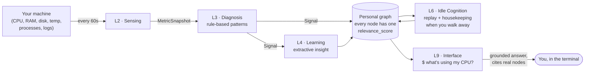
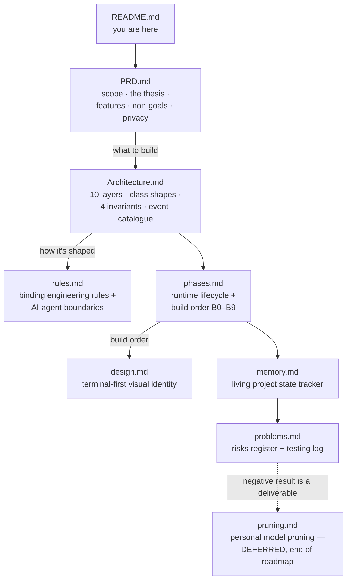

# NeuroPACA

### Neuromorphic Personal Autonomous Computing Agent

> A local AI that learns your machine, builds a behavioural graph of how you work, and gives grounded answers from a small local model — with **zero cloud dependency**.
> *(A later, deferred phase grows a sparse model around your actual work — see [`pruning.md`](pruning.md).)*

| | |
| --- | --- |
| **Status** | B5 · Interface (L9) built (`b5-interface-l9`). B0–B4 + B2.5 merged. See [`memory.md`](memory.md) for the live state. |
| **Version** | v4 |
| **Author** | Jatin Bhanot · Chitkara University · 2026 |
| **Runs on** | One laptop, CPU-only, single user, single graph. No GPU, no accounts, no telemetry. |
| **Goal** | A publishable research paper — benchmarks and rejected alternatives are deliverables. |

---

## What is NeuroPACA?

NeuroPACA passively watches **cold OS-level numbers** (CPU, RAM, disk, temperature, processes, system logs) every 60 seconds, turns them into named behavioural patterns, and stores them in a personal knowledge graph.



**One score, several jobs.** Every node carries one `relevance_score` (0–10) that governs **what the graph keeps**, **what it replays during idle time**, and **how it ranks context for your questions**. A later, deferred phase uses that same score to prune a local model toward your work ([`pruning.md`](pruning.md)).

**Privacy is the product.** Nothing leaves the machine. It does not record your screen or keystrokes — only cold system numbers. Raw sensor data is buffered briefly, then purged; only the extracted graph knowledge persists.

---

## Building

```bash
uv venv --python 3.12
uv pip install -e ".[dev]"     # ruff + mypy + pytest + pre-commit
pre-commit install

uv run ruff check . && uv run ruff format --check .
uv run mypy
uv run pytest -q
```

## Running it

```bash
neuropacad                         # the daemon (reads $NEUROPACA_CONFIG or ./neuropaca.toml)

neuropaca ask "what's using my CPU"   # $  — grounded answer from your graph
neuropaca diagnose "why is the disk full"  # $? — + a live system snapshot
neuropaca health                     # daemon + module health
neuropaca insights                   # surfaced insights (anomaly / distraction)

neuropaca "$! pkill -f webpack"      # $! — run a command (needs confirmation)
neuropaca "$$ systemctl --user restart x"  # $$ — same, state backed up first
neuropaca notifications              # what the action layer wants to tell you
neuropaca confirmations              # dangerous actions waiting on you
neuropaca confirm <id> [--deny]      # answer one
```

The CLI is a thin client over a Unix socket (`$XDG_RUNTIME_DIR/neuropaca.sock`).

**The action layer ships inert.** `action_dry_run = True` and only the `safe`
tier is enabled, so a fresh install describes what it would do and does nothing.
Turning it on does not remove the guard rails: a dangerous action pauses and
waits for `neuropaca confirm` in your terminal, silence past the timeout is a
refusal, commands run with no shell and no inherited environment, writes are
confined to `watch_paths` and backed up to quarantine first, and every attempt —
refusals included — is two lines in `data/actions.jsonl`.

| Path | What it holds |
| --- | --- |
| `src/neuropaca/` | One package per architectural layer (`core/`, `sensing/`, `diagnosis/`, `learning/`, …) |
| [`memory.md`](memory.md) | The current phase and next action — **always read this first** |
| `spikes/b0_bitnet/` | The B0 BitNet de-risking spike — throwaway code, never imported by the daemon |
| `data/` | gitignored — `graph.json`, `idle_cache.db`, `actions.jsonl`, logs |

---

## Source of truth

The concept documents this build is derived from:

| File | What it is |
| --- | --- |
| `1000071408.png` | The v4 class diagram — **the authoritative blueprint** |
| `neuropaca-v4.html` | The full concept: architecture, memory design, workflow, sparse-model reasoning |
| `neuropaca-overview.html` | Condensed overview + the BitNet/llama.cpp tech-fix note |

> **Precedence:** where a doc and a source conflict, the source wins. Where the diagram and the concept HTML conflict, the diagram wins. (Decision D-1.)

### The Markdown docs (this folder)



| Document | Purpose |
| --- | --- |
| [`PRD.md`](PRD.md) | Product scope, the "one score, several jobs" thesis, features, users, non-goals, privacy |
| [`Architecture.md`](Architecture.md) | The 10 layers, class shapes, the four critical invariants, event catalogue |
| [`rules.md`](rules.md) | Binding engineering rules and AI-agent boundaries |
| [`phases.md`](phases.md) | Build order — the Init → Sensing → Diagnosis → Learning → Action → Comms lifecycle |
| [`design.md`](design.md) | The terminal-first visual identity |
| [`memory.md`](memory.md) | Living project state tracker |
| [`problems.md`](problems.md) | Problems & risks register, plus the testing log |
| [`pruning.md`](pruning.md) | The deferred personal-model-pruning design (end-of-roadmap) |

---

*Local by construction. Zero cloud calls.*
