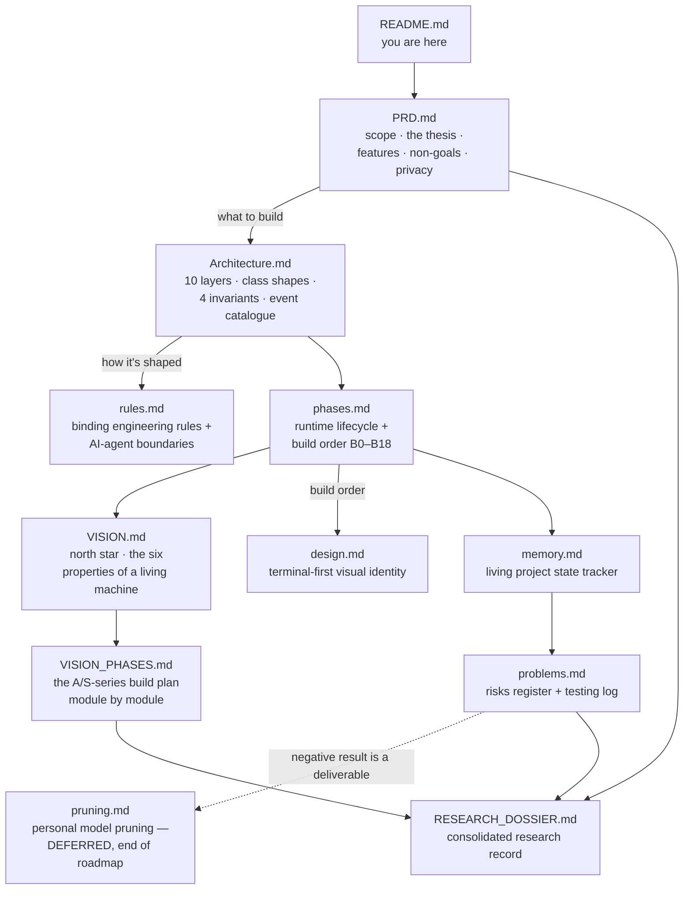

# NeuroPACA

### Neuromorphic Personal Autonomous Computing Agent

> A local-first, always-on agent that watches how you work, builds a **behavioural graph** of
> your habits, thinks about that graph while you are away, and — carefully, tier by tier — starts
> to act like a **personal secretary**. Zero cloud dependency. Nothing leaves the machine.

| | |
| --- | --- |
| **Status** | **Level 2 ("Remembering") reached, climbing toward Level 4 ("Useful").** B0–B18 (foundation → hardening → graph-defect fixes) are on `main`. A0–A3 (welcome-back moments, the tray, the mirror, the judgment gate) and S0–S4 (episodic memory, mail/projects/media/calendar/reading plugins, the generalised plugin contract) are all merged. Live state: [`memory.md`](memory.md); the full phased plan: [`VISION.md`](VISION.md) / [`VISION_PHASES.md`](VISION_PHASES.md). |
| **Version** | v4 |
| **Author** | Jatin Bhanot · Chitkara University · 2026 |
| **Runs on** | One laptop, CPU-only, single user, single graph. No GPU, no accounts, no telemetry. |
| **Goal** | A publishable research paper — the benchmarks **and** the rejected alternatives are deliverables. |
| **License** | [AGPL-3.0-only](LICENSE). Copyright &copy; 2026 Jatin Bhanot. Contributions accepted under the terms in [Contributing](#5-contributing). |

---

## Table of contents

1. [What NeuroPACA is, in plain words](#1-what-neuropaca-is-in-plain-words)
2. [The body-map — what's built vs. planned](#2-the-body-map--whats-built-vs-planned)
3. [How it actually works](#3-how-it-actually-works)
4. [Installing and running it](#4-installing-and-running-it)
5. [Contributing](#5-contributing)
6. [The documents](#6-the-documents)

---

## 1. What NeuroPACA is, in plain words

Most software makes you adapt to it. NeuroPACA flips that: it is a small daemon that sits on
your laptop, watches **cold system numbers** — which app has focus, how idle you are, CPU/RAM
load, which windows and websites you touch — and slowly builds a private, personal map of how
you actually work. It does this the way a nervous system does: senses feed a memory, the memory
reinforces itself the way synapses do ("fire together, wire together"), and while you're away it
consolidates and half-forms new thoughts about what it noticed, the way a brain does while you
sleep.

Today it can:

- **Notice** what you're doing right now (focus, idle, load, apps, websites, calendar events,
  reading list, projects, mail, media) and turn that into a graph of nodes and weighted edges.
- **Remember** across days — a bi-temporal episodic store, separate from the graph, that can
  answer "what was true then" rather than only "what's true now".
- **Wonder** while you're idle — a default-mode-network loop that consolidates the graph, prunes
  what's gone stale, and asks itself grounded questions about what it saw.
- **Speak**, carefully — a welcome-back line when you return from being away, an end-of-day
  "mirror" of what changed, and a briefing of what matters right now (open threads, mail that
  needs a reply, where you left a project, what's next in whatever you were watching/reading) —
  all gated by a Thompson-sampling judge that learns, per situation, whether a moment is welcome
  or an interruption, inside a daily nudge budget.
- **Act**, within a hard safety gate — a tiered action layer (notify / write a memory / write a
  file / run a command) that is audited, sandboxed, confined to an explicit path allowlist, and
  by default dry-run outside the safest tier.

What it does **not** do yet: predict what you're about to do before you do it, pre-warm anything
for you, or act autonomously without a human having first approved that class of action. Those
are the next phases (A4–A6, S5–S6) — see the table below.

**Privacy is the product, not a footnote.** Nothing leaves the machine unless you explicitly turn
on a plugin that reads local files (mail spool, `.ics` calendar, a reading-list file) — even then,
those plugins are pure local file readers, not network calls. CI runs the test suite inside a
network namespace with only loopback and asserts that both HTTP and raw TCP raise, so the "zero
egress" claim is proven, not asserted.

It is **not** a cloud assistant, a general chatbot, a screen recorder/keylogger, a multi-user
product, or a GPU project. Those are stated scope boundaries.

### The thesis behind the build — one score, several jobs

The research bet ([`RESEARCH_DOSSIER.md`](RESEARCH_DOSSIER.md) §18) is that a single composite
usage score can drive retention, idle-time replay, and retrieval ranking all at once:

```
relevance_score = normalize(
      frequency          * 3.0    # how often you use it
    + decay(last_seen)   * 3.0    # how recently
    + log(connections)   * 2.0    # how connected in the graph
    + bridge_value       * 2.0    # does it link different domains
)
```

That number decides which nodes get pruned when they go stale, which nodes the idle loop replays
most, and which nodes are ranked highest when something needs to be retrieved. Five candidate
research claims (A–E) are tracked in the dossier; claim **A** (the score above) and claim **C**
(pressure from multiple corroborating signals beats a single threshold, measured at 167× fewer
false triggers in simulation) are built and measured. Claim **B** (shrinking a local model around
your usage) is deliberately deferred — see [`pruning.md`](pruning.md).

---

## 2. The body-map — what's built vs. planned

If you compare the whole project to a human body, this is how the parts line up. This is an
honest accounting, not a pitch: some rows are fully built and hardened, some are half-built and
invisible today, and some genuinely don't exist yet.

| Human body part | Job in the body | NeuroPaca equivalent | Built or planned? |
| --- | --- | --- | --- |
| **Eyes / ears** (senses) | notice what's happening right now | Focus/idle/load sensors, app & site tracking (L1/L2), calendar + reading-list plugins (S4) | ✅ Built |
| **Hippocampus** | lay down today's experience as episodic memory | The bi-temporal event stream (S0) alongside the graph | ✅ Built — can answer "what was true last Tuesday", not just "what's true now" |
| **Synapses** (cortex) | "neurons that fire together, wire together" | Hebbian graph edges — `reinforce_cooccurrence`, saturating weight + half-life decay | ✅ Built (V-1 rework fixed clique over-wiring) |
| **Sleep / dreaming** | consolidate the day, forget the noise, half-form new ideas | Idle-cycle decay, relevance scoring, dead-hub pruning, the default-mode-network loop | ⚠️ Half built — decay and consolidation work, but "wondering while idle" mostly stays invisible unless it earns a welcome-back moment |
| **Prefrontal cortex** | what's relevant right now, out of everything I know? | Attention layer — Personalized PageRank from "current context" | ❌ Not built yet — the briefing today ranks by recency + Jaccard overlap + submodular selection, a lighter stand-in for the planned PPR attention layer |
| **Instinct / gut feeling** | predict what you'll do next before you do it | Prediction faculty (Hawkes / marked point processes) — A4 | ❌ Not built (next phase after this README was written) |
| **Judgment / impulse control** | should I say something, and is now the right moment? | `Guardian` (A3) — Beta-Bernoulli Thompson-sampling gate per (moment kind × focus × hour × recent dismissals), with a daily nudge budget | ✅ Built and live — every proposed moment (welcome-back, mirror, briefing) now routes through it before it can become a notification |
| **Mouth / vocal cords** | say it out loud, in words | Desktop notifications, composed by `MomentComposer`/`MirrorComposer`/`BriefingComposer` | ✅ Built — grounded, extractive text (never generated prose that could be wrong), but still rare: it only speaks when the Guardian judges the moment worth the interruption budget |
| **Hands** | act in the world | Effector tier — tiered `SafetyGate`, sandboxed, path-confined, safe-tier only live | ⚠️ Built, deliberately restrained (only "safe" writes run outside dry-run) |
| **Autonomic nervous system** | keep vital signs running without conscious thought | systemd daemon, soak harness, unclean-shutdown/`KillMode` fixes, the Wayland-sensor watchdog | ✅ Built (and repeatedly hardened — B9, B15/B16) |
| **Immune system / DNA markers** | verify identity, catch what's foreign or broken | SPDX + `gen-ref:` provenance stamps, SSH-signed commits | ✅ Built |
| **Object recognition** ("that's the same face") | recognize the same thing across different views | `AppIdentity.resolve()` — collapsing duplicate app nodes from Wayland ids vs. process names | ✅ Built (B17) |
| **Correspondence, memory of relationships** | remember open threads with people | Mail plugin (S1) — thread state, overdue-reply detection, per-person context | ✅ Built, opt-in (`mail_enabled`, off by default) |
| **Sense of "where did I leave off"** | pick up a task exactly where you dropped it | Projects plugin (S2) — read-only git sensing, left-off summaries | ✅ Built, opt-in (`project_enabled`) |
| **Long-term interest tracking** | remember what you were reading/watching | Media & reading-list plugins (S3/S4) — MPRIS sensing, continuity summaries | ✅ Built, opt-in |
| **A generalized nervous pathway for new senses** | let new domains plug in without rewiring the brain | `PluginHost` + `Plugin` protocol (S4) — one contract for mail/projects/media/calendar/reading | ✅ Built — two new plugins (calendar, reading) were added with zero core-code changes, proving the contract |
| **Learning from praise and correction** | judgment that improves from your reactions | The reaction-trained ranker (S5) | ❌ Not built yet |
| **Earned trust to act alone** | do things for you, once you've trusted it | Tier-by-tier autonomous action (A5) | ❌ Not built — action layer exists but stays in the safe tier, dry-run elsewhere |
| **Speech** | talk back, out loud | Local voice in/out (A6, stretch goal) | ❌ Not built |

---

## 3. How it actually works

```mermaid
flowchart LR
    OS["Your machine<br/>(CPU, RAM, disk, temp,<br/>processes, logs, idle, focus,<br/>mail spool, .ics, git repos, media)"] -->|every 60s / on event| SENSE[Sensing<br/>L2 core sensors +<br/>S1-S4 plugins via PluginHost]
    SENSE -->|MetricSnapshot| DIAG[Diagnosis<br/>rule-based patterns,<br/>no inference in this path]
    DIAG -->|Signal| GRAPH[(Behavioural graph<br/>every node has one<br/>relevance_score)]
    SENSE -->|EpisodeRecord| EPISODES[(Episodic store<br/>bi-temporal, S0)]
    DIAG -->|Signal| LEARN[Learning<br/>extractive insight]
    LEARN --> GRAPH
    GRAPH --> IDLE[Idle Cognition<br/>default-mode network:<br/>replay + consolidate + prune]
    IDLE --> GRAPH
    EPISODES --> BRIEF[Briefing / Mirror /<br/>Welcome-back composers<br/>A0-A2, S0]
    GRAPH --> BRIEF
    BRIEF -->|MOMENT_PROPOSED| GUARD[Guardian<br/>A3 - Thompson-sampling<br/>judgment gate, daily budget]
    GUARD -->|MOMENT_DELIVERED| NOTIFY[Desktop notification]
    DIAG -->|Signal| DRIVE[Drive<br/>pressure accumulates,<br/>decays by half every 60s]
    LEARN -->|Insight| DRIVE
    DRIVE -->|threshold crossed| ACT[Action<br/>tiered SafetyGate,<br/>audit log]
    DRIVE -->|threshold crossed| AGENT[Agents<br/>ephemeral diagnostic<br/>sub-cluster, reaped at 14d]
    AGENT -->|ACTION_PROPOSAL| ACT
    AGENT --> GRAPH
    ACT --> GRAPH
```



- **Everything routes through one event bus.** No module ever calls another module directly —
  `SignalCorrelator` produces `SIGNAL_CORRELATED`, composers produce `MOMENT_PROPOSED`, the
  `Guardian` produces `MOMENT_DELIVERED`. This is a hard architectural invariant (see
  [Contributing](#5-contributing)), enforced because it's what let five different domains
  (mail, projects, media, calendar, reading) plug into the same pipeline without touching each
  other's code.
- **Extractive before generative, always.** Every sentence NeuroPACA says is built from a
  template filled with real graph/episode data — never free-form generated prose — because a
  wrong factual claim about your own life is a release blocker, not a quality nit.
- **The judgment gate decides *if* and *when*, not *what*.** Three composers each propose moments
  independently (A0's welcome-back, A2's end-of-day mirror, S0's briefing); the `Guardian` is the
  only thing that turns a proposal into an actual notification, learning per-situation (are you
  mid-focus? just back from idle? how many times have you dismissed something today?) whether
  it's welcome.
- **The action layer ships inert by default.** `action_dry_run = true` and only the `safe` tier
  is enabled out of the box — a fresh install describes what it *would* do and does nothing.
  Higher tiers require an explicit human confirmation over the internal event bus; silence past
  the timeout is always a refusal. Commands run with no shell and no inherited environment,
  writes are confined to `watch_paths` and backed up to quarantine first, and every attempt —
  refusals included — is logged to `data/actions.jsonl`.
- **There is no terminal/chat control surface right now.** An interactive shell and a read-only
  project-guide CLI (`tell`/`overview`) were both built and then withdrawn by deliberate decision
  — see [rules.md](rules.md) and `RESEARCH_DOSSIER.md §4.1` — in favour of a future voice
  interface (A6) that doesn't exist yet. Until then, the only human-facing surfaces are: desktop
  notifications, the tray icon (a read-only status display — focused / idle / thinking / noticed
  something), and the HTML graph viewer.

---

## 4. Installing and running it

### Prerequisites

| Need | Why |
| --- | --- |
| **Linux** | Developed and soaked on Pop!\_OS (Wayland/COSMIC). macOS/Windows: the daemon runs but the Wayland `ActivityCollector` self-disables. |
| **Python 3.12** | `requires-python = ">=3.12"`. |
| **[uv](https://docs.astral.sh/uv/)** | The only supported dependency manager (`uv.lock` is committed; CI runs `uv sync --locked`). |
| **~1.5 GB free RAM** | Only to *run the daemon with inference* — idle daemon is ~40 MB, BitNet (the always-on "loop" model) adds ~1.4 GB. Running the **test suite** needs none of this. |
| A C toolchain + `libwayland-dev` | Only for the optional `llama` / `activity` extras. Not needed for tests, lint, or type-checking. |

### Clone and set up

```bash
git clone https://github.com/bhanot-99/NeuroPACA.git
cd NeuroPACA

uv venv --python 3.12
uv pip install -e ".[dev]"      # ruff + mypy + pytest + pre-commit
pre-commit install
```

### Verify your checkout (this is all CI runs)

```bash
uv run ruff check .             # bare, no --fix — that is what CI runs
uv run ruff format --check .
uv run mypy
uv run pytest -q                # ~1,000+ default tests, no model or network needed
```

Optional heavier suites:

```bash
uv run pytest -m stress         # peak-throttle load / latency
uv run pytest tests/integration # touches real psutil / filesystem
```

If all of that passes, you have a working development environment. **You do not need the models
or the daemon to contribute to most of the codebase.**

### Running the daemon (optional — needs the models)

The daemon runs inference in-process via `llama.cpp`, so you need the `llama` extra and one GGUF
model file — the always-on "loop" model idle cognition and learning use.

```bash
uv pip install -e ".[dev,llama,activity]"   # activity = real Wayland idle/focus sensing

# Fetch the model into ./models/ (gitignored).
mkdir -p models
uv pip install huggingface-hub
huggingface-cli download microsoft/BitNet-b1.58-2B-4T-gguf --include "*.gguf" --local-dir models
```

`neuropaca.toml` expects the file at this exact path — rename/symlink to match, or edit the config:

```toml
model_path = "models/bitnet-2b4t-tq2_0.gguf"
```

The official BitNet repo ships `ggml-model-i2_s.gguf` (the BitNet-native quant); symlink it to
`bitnet-2b4t-tq2_0.gguf` or point `model_path` at it. The B0 spike notes
([`spikes/b0_bitnet/README.md`](spikes/b0_bitnet/README.md)) cover which quant to use if your
`llama.cpp` build exposes the BitNet kernels.

**Also edit `watch_paths`** in `neuropaca.toml` — it is hardcoded to the author's checkout
(`/home/bhanot/NeuroPaca`). It is both the filesystem-sensing scope and the safe-tier write
allowlist, so point it at *your* repo path.

Then:

```bash
neuropacad                       # the daemon (reads $NEUROPACA_CONFIG, else ./neuropaca.toml)
```

### Turning on the optional plugins

Every domain plugin (mail, projects, media, calendar, reading list) is **off by default** and
reads only local files — no network calls. Turn them on in your `neuropaca.toml`:

```toml
mail_enabled = true
mail_spool_dir = "/path/to/your/maildir"

project_enabled = true          # read-only git sensing on watch_paths

media_enabled = true            # MPRIS — whatever's playing locally

calendar_enabled = true
calendar_ics_path = "/path/to/your/calendar.ics"

reading_enabled = true
reading_list_path = "/path/to/your/reading-list.txt"
```

Each one only ever *adds* nodes/episodes; none of them make outbound network calls. Mail is the
one domain that could in principle need a remote fetch — today it only reads a local maildir
spool (see [`plugins/mail/fetcher.py`](plugins/mail/fetcher.py)).

### Start the daemon automatically (recommended)

One script installs `neuropacad` as a systemd `--user` service so it starts on
every login, and — with lingering — at boot, before you log in:

```bash
scripts/install-user-service.sh            # install + enable + start + enable-linger
scripts/install-user-service.sh --uninstall
```

It only touches `~/.config/systemd/user/` and your own `systemd --user` session
— nothing system-wide, no root. Logs: `journalctl --user -u neuropacad -f`. The
unit's ordering is load-bearing (it must start *after* the Wayland compositor
imports the session environment) — see the header of
[`scripts/systemd/neuropacad.service`](scripts/systemd/neuropacad.service).

### Using it day to day

There is no chat window and no CLI to talk to it. Once the daemon is running:

- **The tray icon** (`scripts/neuropaca_tray.py`, also installable as a user service) shows a
  read-only status — focused / idle / thinking / noticed something — read from the daemon's own
  periodic health dump. One click opens the graph view; another forces a refresh.
- **Desktop notifications** arrive on their own, gated by the Guardian: a welcome-back line when
  you return from being away, an end-of-day mirror of what changed, and briefings pulled from
  whatever plugins you've turned on (an overdue mail thread, where you left a project, what's
  next in your reading list). Every line is built from real graph/episode data — never generated
  prose.
- **The behavioural graph** can be inspected any time:

  ```bash
  python scripts/neuropaca_graph.py            # writes data/graph_view.html and opens it
  python scripts/neuropaca_graph.py --no-open  # just write it
  ```

  One self-contained HTML page (zero egress): node colour is `node_type`, node size is
  `relevance_score`, edge thickness is `weight`. Click a node for a detail panel explaining what
  the system learned from it and why; drag the scrubber to replay the window.

**The action layer ships inert.** A fresh install has `action_dry_run = true` and only the `safe`
tier enabled — it will log what it *would* do without doing it, until you deliberately turn that
off.

---

## 5. Contributing

**Read [`memory.md`](memory.md) first — always.** It is the living state tracker: the current
phase, the next action, and what is mid-flight. Then read [`rules.md`](rules.md); it is binding on
every human and AI agent touching this repo.

### The four invariants (violating one blocks merge — [`rules.md`](rules.md) §0)

1. **Services are held, not inherited.** `EventBus`, `GraphMemory`, `BitNetRuntime` are singletons.
   Modules receive them as references and never subclass them.
2. **`GraphMemory` uses `asyncio.Lock`, never `threading.Lock`** in loop-resident code.
3. **Never call `BitNetRuntime.infer()` from a coroutine.** Use `infer_async()`.
4. **`SignalCorrelator` produces `SIGNAL_CORRELATED`, consumers never call each other** —
   everything routes through the `EventBus`.

**Plus: no module imports another module.** If you want a direct call, you want a new event.
This is also how S1–S4's plugins were kept from touching each other's code — see `PluginHost` /
`sensing/plugin_host.py`.

### Workflow

- Branch off `main`. Keep commits scoped; the history is part of the research record.
- Every change needs tests. The suite must pass **with no network** (`NEUROPACA_OFFLINE=1`).
- Run the full local gate before pushing: `ruff check .` → `ruff format --check .` → `mypy` →
  `pytest -q`. Note `ruff check` is **bare, no `--fix`** — that is what CI enforces.
- New runtime dependencies are added **per phase, on approval** ([`rules.md`](rules.md) §9). Don't
  add one in a feature PR without raising it first.
- Anything under `src/neuropaca/` is the running daemon's code (the venv is an editable install).
  `plugins/` holds the domain plugins built against the S4 `Plugin` protocol. Tooling and viewers
  that must be safe to run *during a soak* go in `scripts/`, importing nothing from the package.
- Open a PR against `main`. CI (`.github/workflows/ci.yml`) runs the quality gate plus the
  network-namespace egress assertion.

### Where to contribute

The highest-value gap is the **evaluation harness** ([`RESEARCH_DOSSIER.md`](RESEARCH_DOSSIER.md)
§18.3): a synthetic activity generator, a question set with known answers, baseline retrieval
methods (recency-only, frequency-only, degree-only, semantic), an ablation runner that drops each
score term in turn, and `--research-mode` event tracing kept out of the shipped daemon. Claim A
cannot be published without it.

The next phases in the plan ([`VISION_PHASES.md`](VISION_PHASES.md)) that are not yet started:

- **A4 · Anticipation** — Hawkes-process prediction of your next app/task, used to have things
  ready before you ask.
- **S5 · Judgment learns** — a ranker trained on your reactions to briefing items, generalising
  the Guardian's per-moment learning to per-item ranking.
- **A5 · Earned action** — offers becoming one-click actions, and — only after a per-action-type
  track record — autonomous ones within the safe tier.
- **A6 · Voice (stretch)** — local speech in and out, the planned replacement for the withdrawn
  terminal control surface.

### Repository map

| Path | What it holds |
| --- | --- |
| `src/neuropaca/` | One package per architectural layer — `core/`, `sensing/`, `diagnosis/`, `learning/`, `drive/` (includes `guardian.py`), `idle/`, `action/`, `agents/`, `interface/` (briefing, mirror, moments, notifier), `orchestration/` |
| `plugins/` | S1–S4 domain plugins built against the `Plugin` protocol — `mail/`, `calendar/`, `reading/` (projects and media live under `src/neuropaca/sensing/` as the two already-migrated `BaseModule` wrappers) |
| `tests/` | Unit tests, plus `stress/` and `integration/` (both marker-gated) |
| `scripts/` | Per-phase validation harnesses (`validate_b*.py`), the 7-day soak harness (`soak_*.py`/`soak_*.sh` + tray widget), the presence tray (`neuropaca_tray.py`), the graph viewer, `systemd/` unit templates, logrotate config |
| `spikes/` | Throwaway de-risking spikes (`b0_bitnet/`, `b2_5_activity/`, `b7_positive_control/`) — **never** imported by the daemon |
| `models/` | gitignored — the one GGUF file (BitNet, the loop model) |
| `data/` | gitignored — `graph.json`, `graph_view.html`, `actions.jsonl`, the episodic store, idle cache, logs, soak state |

---

## 6. The documents

The concept documents this build is derived from:

| File | What it is |
| --- | --- |
| `1000071408.png` | The v4 class diagram — **the authoritative blueprint** |
| `neuropaca-v4.html` | The full concept: architecture, memory design, workflow, sparse-model reasoning |
| `neuropaca-overview.html` | Condensed overview + the BitNet/llama.cpp tech-fix note |

> **Precedence:** where a doc and a source conflict, the source wins. Where the diagram and the
> concept HTML conflict, the diagram wins. (Decision D-1.)

The Markdown record:



| Document | Purpose |
| --- | --- |
| [`PRD.md`](PRD.md) | Product scope, the "one score, several jobs" thesis, features, users, non-goals, privacy |
| [`Architecture.md`](Architecture.md) | The 10 layers, class shapes, the four critical invariants, event catalogue |
| [`rules.md`](rules.md) | Binding engineering rules and AI-agent boundaries |
| [`phases.md`](phases.md) | Build order — the B0–B18 lifecycle, with exit criteria |
| [`VISION.md`](VISION.md) | The north star — the "living machine" framing, the six properties, the ladder of aliveness, the math behind attention/prediction/judgment |
| [`VISION_PHASES.md`](VISION_PHASES.md) | The A-series (Aliveness) and S-series (Secretary) build plan, module by module, with exit criteria |
| [`design.md`](design.md) | The terminal-first visual identity |
| [`memory.md`](memory.md) | Living project state tracker — **read first, update last** |
| [`problems.md`](problems.md) | Problems & risks register, plus the testing log |
| [`pruning.md`](pruning.md) | The deferred personal-model-pruning design (end-of-roadmap) |
| [`RESEARCH_DOSSIER.md`](RESEARCH_DOSSIER.md) | The consolidated research record — claims, method, every measured number |

---

## License

AGPL-3.0-only. Copyright (c) 2026 Jatin Bhanot <bhanot1054@gmail.com>. See [LICENSE](LICENSE).

---

*Local by construction. Zero cloud calls.*
