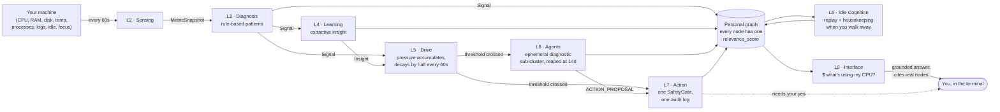
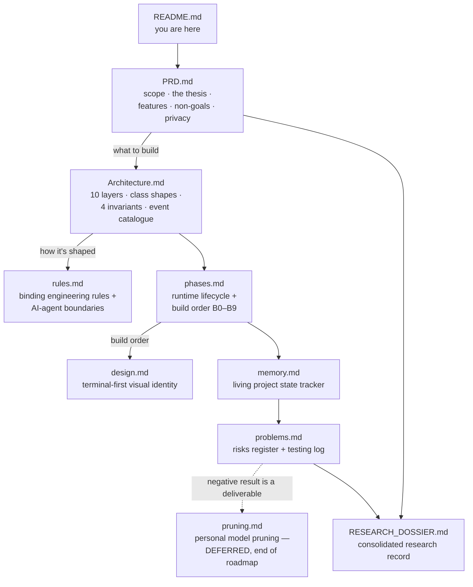

# NeuroPACA

### Neuromorphic Personal Autonomous Computing Agent

> A local-first, always-on agent that watches how you work, builds a **behavioural graph** of your habits, and answers grounded questions about your machine from a small **local** model — with **zero cloud dependency**.
> *(A later, deferred phase grows a sparse model around your actual work — see [`pruning.md`](pruning.md).)*

| | |
| --- | --- |
| **Status** | **B9 · Hardening** — B0–B8 (incl. B2.5) merged to `main`; all ten layers L1–L10 exist; 6 of 7 B9 exit criteria met; the daemon runs under a hardened systemd unit. The **7-day soak** (`neuropaca-b9-soak.service`) is the last thing outstanding. Live state: [`memory.md`](memory.md). |
| **Version** | v4 |
| **Author** | Jatin Bhanot · Chitkara University · 2026 |
| **Runs on** | One laptop, CPU-only, single user, single graph. No GPU, no accounts, no telemetry. |
| **Goal** | A publishable research paper — the benchmarks **and** the rejected alternatives are deliverables. |
| **License** | Proprietary — research prototype. Contributions accepted under the terms in [Contributing](#4-contributing). |

---

## 1. Why this project exists (the research)

Most people adapt to their machine. **NeuroPACA flips it: the machine adapts to you.** It is a
research prototype whose purpose is to produce a paper, not a product. The build *is* the
experiment; every phase has written exit criteria and every criterion names the test or script
that proves it.

### What we are trying to prove

The dossier ([`RESEARCH_DOSSIER.md`](RESEARCH_DOSSIER.md) §18) tracks five candidate claims. The
first paper is framed around **A**, with **C** as a second result and **E** as the lessons section.

| # | Claim, in plain English | Risk | Status |
| --- | --- | --- | --- |
| **A** | **One "how much do I use this" score** can decide, at once, *what the system keeps*, *what it replays during idle time*, and *how it ranks context for your questions*. | Medium | ✅ built (B0–B9); needs ablations |
| **C** | Building **pressure from several independent signals** before acting causes far fewer wrong autonomous actions than a simple threshold. | Low | ✅ built & measured (500 spikes → 167× threshold), provable in simulation |
| **D** | Passive computer-usage sensing is a useful **data layer** other agents could plug into. | Positioning | ✅ demonstrated by construction |
| **B** | Watching your computer can tell us enough to **shrink a local model toward your actual work** without hurting quality much. | High | ⏸ deferred (phase D1) — see [`pruning.md`](pruning.md) |
| **E** | An honest write-up of **what broke** building a self-shrinking CPU-only agent. | Low | ✅ material collected throughout ([`RESEARCH_DOSSIER.md`](RESEARCH_DOSSIER.md) §15) |

### The thesis — one score, several jobs

Every node in the graph carries one `relevance_score` (0–10), a normalised composite of four usage
signals:

```
score = normalize(
      frequency          * 3.0    # how often you use it
    + decay(last_seen)   * 3.0    # how recently
    + log(connections)   * 2.0    # how connected in the graph
    + bridge_value       * 2.0    # does it link different domains
)
```

That single number governs **retention** (low, long-untouched nodes are pruned), **memory replay**
(the idle-time loop replays high-score nodes often, low-score rarely), and **retrieval ranking**
(candidate nodes for a `$` query are ranked before truncation). The deferred fourth job uses the
*same* score to cut attention heads from the local model.

### Honest limitations (why this is still a prototype)

- **One user, one machine.** Behaviour from one developer on one Pop!\_OS laptop cannot establish
  generality. Closing this needs a synthetic activity generator + multi-machine replication — the
  top item in the evaluation plan ([`RESEARCH_DOSSIER.md`](RESEARCH_DOSSIER.md) §18.3).
- **Privacy vs. reproducibility.** A system that never sends data out cannot ship a shared
  benchmark dataset. Planned answer: a synthetic activity generator + a public question set with
  known answers.
- The `eval/` infrastructure (ablation runner, baselines, question set) is **not built yet**. This
  is where new contributors are most useful — see [Where to contribute](#where-to-contribute).

---

## 2. What NeuroPACA does

It passively watches **cold OS-level numbers** (CPU, RAM, disk, temperature, processes, system
logs, Wayland idle/focus events) every 60 seconds, turns them into **named behavioural patterns**
with a rule-based correlator (no inference in that path, by design), and stores them in a personal
knowledge graph. Insights it surfaces, and — behind a hard safety gate — actions it can take, all
come from that graph. The terminal client is a **read-only project guide**: predefined commands
that report daemon state (`health`, `insights`, …) or explain the codebase itself
(`neuropaca tell <path>`, `neuropaca overview`).



**Privacy is the product.** Nothing leaves the machine — CI *affirmatively proves* it by running
the suite inside a network namespace with only loopback and asserting that HTTP and raw TCP both
raise. It does not record your screen or keystrokes, only cold system counters and app
identifiers. Raw sensor data is buffered briefly, then purged; only the extracted graph knowledge
persists.

**It is not** a cloud assistant, a general chatbot, a screen recorder/keylogger, a multi-user
product, or a GPU project. Those are stated scope boundaries, not omissions.

---

## 3. Getting started

### Prerequisites

| Need | Why |
| --- | --- |
| **Linux** | Developed and soaked on Pop!\_OS (Wayland). macOS/Windows: the daemon runs but the Wayland `ActivityCollector` self-disables. |
| **Python 3.12** | `requires-python = ">=3.12"`. |
| **[uv](https://docs.astral.sh/uv/)** | The only supported dependency manager (`uv.lock` is committed; CI runs `uv sync --locked`). |
| **~5 GB free RAM** | Only to *run the daemon with inference* — idle daemon is ~40 MB, BitNet adds ~1.4 GB, Qwen adds ~3.25 GB the first time you run `neuropaca tell … --explain`. Running the **test suite** needs none of this. |
| A C toolchain + `libwayland-dev` | Only for the optional `llama` / `activity` extras. Not needed for tests, lint, or type-checking. |

### Clone and set up

```bash
git clone https://github.com/bhanot-99/NeuroPACA.git
cd NeuroPACA

uv venv --python 3.12
uv pip install -e ".[dev]"      # ruff + mypy + pytest + pre-commit
pre-commit install
```

### Verify your checkout (this is all CI runs)

```bash
uv run ruff check .             # bare, no --fix — that is what CI runs
uv run ruff format --check .
uv run mypy
uv run pytest -q                # ~423 default tests, no model or network needed
```

Optional heavier suites:

```bash
uv run pytest -m stress         # peak-throttle load / latency
uv run pytest tests/integration # touches real psutil / filesystem
```

If all of that passes, you have a working development environment. **You do not need the models or
the daemon to contribute to most of the codebase.**

### Running the daemon (optional — needs the models)

The daemon runs inference in-process via `llama.cpp`, so you need the `llama` extra and two GGUF
model files.

```bash
uv pip install -e ".[dev,llama,activity]"   # activity = real Wayland idle/focus sensing

# Fetch the two models into ./models/ (gitignored).
mkdir -p models
uv pip install huggingface-hub
huggingface-cli download microsoft/BitNet-b1.58-2B-4T-gguf --include "*.gguf" --local-dir models
huggingface-cli download Qwen/Qwen2.5-3B-Instruct-GGUF   --include "qwen2.5-3b-instruct-q4_k_m.gguf" --local-dir models
```

`neuropaca.toml` expects the files at these exact paths — rename/symlink to match, or edit the
config:

```toml
model_path             = "models/bitnet-2b4t-tq2_0.gguf"
interactive_model_path  = "models/qwen2.5-3b-instruct-q4_k_m.gguf"
```

The official BitNet repo ships `ggml-model-i2_s.gguf` (the BitNet-native quant); symlink it to
`bitnet-2b4t-tq2_0.gguf` or point `model_path` at it. The B0 spike notes
([`spikes/b0_bitnet/README.md`](spikes/b0_bitnet/README.md)) cover which quant to use if your
`llama.cpp` build exposes the BitNet kernels.

**Also edit `watch_paths`** in `neuropaca.toml` — it is hardcoded to the author's checkout
(`/home/bhanot/NeuroPaca`). It is both the filesystem-sensing scope and the L7 write allowlist, so
point it at *your* repo path.

Then:

```bash
neuropacad                       # the daemon (reads $NEUROPACA_CONFIG, else ./neuropaca.toml)
```

### Start the daemon automatically (recommended)

One script installs `neuropacad` as a systemd `--user` service so it starts on
every login, and — with lingering — at boot, before you log in:

```bash
scripts/install-user-service.sh            # install + enable + start + enable-linger
scripts/install-user-service.sh --uninstall
```

It only touches `~/.config/systemd/user/` and your own `systemd --user` session
— nothing system-wide, no root. Logs: `journalctl --user -u neuropacad -f`. The
unit's ordering is load-bearing (it must start *after* the Wayland compositor
imports the session environment) — see the header of
[`scripts/systemd/neuropacad.service`](scripts/systemd/neuropacad.service).

### Using the CLI

The CLI is a thin client over a Unix socket
(`--socket PATH` > `$NEUROPACA_SOCKET` > `$XDG_RUNTIME_DIR/neuropaca.sock`).

```bash
neuropaca                                     # no args → the command menu (below)
neuropaca help                                # the full guide

neuropaca overview                            # what NeuroPACA is + the L1-L10 layer map
neuropaca tell src/neuropaca/drive/pressure.py    # what a file or folder does
neuropaca tell drive/pressure.py --explain    # + a plain-words model paraphrase (needs the daemon)

neuropaca health                             # daemon + module health
neuropaca insights                           # surfaced insights (anomaly / distraction)
neuropaca notifications                       # what the action layer wants to tell you
neuropaca confirmations                       # dangerous actions waiting on you
neuropaca confirm <id> [--deny]               # answer one
neuropaca run "pkill -f webpack"              # hand a command to the action layer (needs confirmation)
neuropaca run --backup "systemctl --user restart x"   # same, daemon state backed up first

neuropaca doctor                              # offline diagnosis, no daemon needed
neuropaca export <path> [--force]             # dump the graph out of data/
neuropaca panic [--yes]                       # kill the daemon and wipe all state
```

`tell` accepts a file or a folder, and is forgiving about the path: `root/…`,
`src/neuropaca/…`, a bare `layer.py`, or a directory all resolve. It reads the
target's module docstring and its top-level classes/functions — deterministic,
and it works with no daemon. `--explain` adds one optional step: the daemon's
interactive model paraphrases that summary in plain words, clearly flagged,
*after* the facts.

#### The command menu

Run `neuropaca` with **no arguments** to drop into a `neuropaca>` prompt. It
accepts the same predefined verbs, unquoted — nothing else. A line whose first
word is not a verb is a short error, never a free-text question.

```
neuropaca> tell src/neuropaca/interface/layer.py
neuropaca> overview
neuropaca> health
neuropaca> run "pkill -f webpack"
neuropaca> help        quit
```

Each line is translated to the exact `neuropaca` argv and run through the same
path (`src/neuropaca/interface/repl.py`) — the client stays thin.

**The action layer ships inert.** `action_dry_run = True` and only the `safe` tier is enabled, so a
fresh install describes what it *would* do and does nothing. Even turned on: a dangerous action
pauses for `neuropaca confirm` in your terminal, silence past the timeout is a refusal, commands
run with no shell and no inherited environment, writes are confined to `watch_paths` and backed up
to quarantine first, and every attempt — refusals included — is two lines in `data/actions.jsonl`.

### Inspecting the behavioural graph

```bash
python scripts/neuropaca_graph.py            # writes data/graph_view.html and opens it
python scripts/neuropaca_graph.py --no-open  # just write it
```

One self-contained HTML page (zero egress): node colour is `node_type`, node size is
`relevance_score`, edge thickness is `weight`. Drag the scrubber to replay the window.

---

## 4. Contributing

**Read [`memory.md`](memory.md) first — always.** It is the living state tracker: the current
phase, the next action, and what is mid-flight. Then read [`rules.md`](rules.md); it is binding on
every human and AI agent touching this repo.

### The four invariants (violating one blocks merge — [`rules.md`](rules.md) §0)

1. **Services are held, not inherited.** `EventBus`, `GraphMemory`, `BitNetRuntime` are singletons.
   Modules receive them as references and never subclass them.
2. **`GraphMemory` uses `asyncio.Lock`, never `threading.Lock`** in loop-resident code.
3. **Never call `BitNetRuntime.infer()` from a coroutine.** Use `infer_async()`.
4. **`SignalCorrelator` produces `SIGNAL_CORRELATED`; consumers never call each other** —
   everything routes through the `EventBus`.

**Plus: no module imports another module.** If you want a direct call, you want a new event.

### Workflow

- Branch off `main`. Keep commits scoped; the history is part of the research record.
- Every change needs tests. The suite must pass **with no network** (`NEUROPACA_OFFLINE=1`).
- Run the full local gate before pushing: `ruff check .` → `ruff format --check .` → `mypy` →
  `pytest -q`. Note `ruff check` is **bare, no `--fix`** — that is what CI enforces.
- New runtime dependencies are added **per phase, on approval** ([`rules.md`](rules.md) §9). Don't
  add one in a feature PR without raising it first.
- Anything under `src/neuropaca/` is the running daemon's code (the venv is an editable install).
  Tooling and viewers that must be safe to run *during a soak* go in `scripts/`, importing nothing
  from the package.
- Open a PR against `main`. CI (`.github/workflows/ci.yml`) runs the quality gate plus the
  network-namespace egress assertion.

### Where to contribute

The highest-value gap is the **evaluation harness** ([`RESEARCH_DOSSIER.md`](RESEARCH_DOSSIER.md)
§18.3): a synthetic activity generator, a question set with known answers, baseline retrieval
methods (recency-only, frequency-only, degree-only, semantic), an ablation runner that drops each
score term in turn, and `--research-mode` event tracing kept out of the shipped daemon. Claim A
cannot be published without it.

### Repository map

| Path | What it holds |
| --- | --- |
| `src/neuropaca/` | One package per architectural layer — `core/`, `sensing/`, `diagnosis/`, `learning/`, `drive/`, `idle/`, `action/`, `agents/`, `interface/`, `orchestration/` |
| `tests/` | Unit tests, plus `stress/` and `integration/` (both marker-gated) |
| `scripts/` | Per-phase validation harnesses (`validate_b*.py`), soak runners, the B9 soak tray widget, the graph viewer, `systemd/` unit templates, logrotate config |
| `spikes/` | Throwaway de-risking spikes (`b0_bitnet/`, `b2_5_activity/`, `b7_positive_control/`) — **never** imported by the daemon |
| `models/` | gitignored — the two GGUF files |
| `data/` | gitignored — `graph.json`, `graph_view.html`, `actions.jsonl`, `idle_cache.db`, logs, soak state |

---

## 5. The documents

The concept documents this build is derived from:

| File | What it is |
| --- | --- |
| `1000071408.png` | The v4 class diagram — **the authoritative blueprint** |
| `neuropaca-v4.html` | The full concept: architecture, memory design, workflow, sparse-model reasoning |
| `neuropaca-overview.html` | Condensed overview + the BitNet/llama.cpp tech-fix note |

> **Precedence:** where a doc and a source conflict, the source wins. Where the diagram and the
> concept HTML conflict, the diagram wins. (Decision D-1.)

The Markdown record:



| Document | Purpose |
| --- | --- |
| [`PRD.md`](PRD.md) | Product scope, the "one score, several jobs" thesis, features, users, non-goals, privacy |
| [`Architecture.md`](Architecture.md) | The 10 layers, class shapes, the four critical invariants, event catalogue |
| [`rules.md`](rules.md) | Binding engineering rules and AI-agent boundaries |
| [`phases.md`](phases.md) | Build order — the Init → Sensing → Diagnosis → Learning → Action → Comms lifecycle, with exit criteria |
| [`design.md`](design.md) | The terminal-first visual identity |
| [`memory.md`](memory.md) | Living project state tracker — **read first, update last** |
| [`problems.md`](problems.md) | Problems & risks register, plus the testing log |
| [`pruning.md`](pruning.md) | The deferred personal-model-pruning design (end-of-roadmap) |
| [`RESEARCH_DOSSIER.md`](RESEARCH_DOSSIER.md) | The consolidated research record — claims, method, every measured number |

---

*Local by construction. Zero cloud calls.*
