# NeuroPACA — Full Research Dossier

**Neuromorphic Personal Autonomous Computing Agent**

| | |
| --- | --- |
| **Author** | Jatin Bhanot · Chitkara University · 2026 |
| **Version** | v4 |
| **Dossier date** | 2026-09-05 |
| **Status** | B9 · Hardening — B0–B9 built; 6 of 7 B9 exit criteria met; 7-day soak running (5.8 % accrued) |
| **Code size** | 10,909 lines of source · 9,435 lines of tests · 446 collected tests · 91 commits |
| **Runs on** | One laptop. CPU only. Single user. No GPU, no accounts, no cloud, no telemetry. |
| **Research goal** | A publishable paper — the benchmarks *and* the rejected alternatives are deliverables. |

> **How to read this document.** Every section opens with a plain-English paragraph ("what this is, in normal words") and then goes technical. Diagrams are Mermaid — they render on GitHub, in Obsidian, and in VS Code. Every number in this file was measured on the target machine and is traceable to a script in `scripts/` or a test in `tests/`.

---

## Table of contents

1. [What this project is](#1-what-this-project-is)
2. [Why we are building it](#2-why-we-are-building-it)
3. [The core idea — one score, several jobs](#3-the-core-idea--one-score-several-jobs)
4. [Features at a glance](#4-features-at-a-glance)
5. [Why this is valuable as high-level research](#5-why-this-is-valuable-as-high-level-research)
6. [System architecture — the ten layers](#6-system-architecture--the-ten-layers)
7. [The four invariants that hold it together](#7-the-four-invariants-that-hold-it-together)
8. [Data model — what the graph actually stores](#8-data-model--what-the-graph-actually-stores)
9. [The model stack — how a laptop runs two LLMs](#9-the-model-stack--how-a-laptop-runs-two-llms)
10. [Method — how we built it, phase by phase](#10-method--how-we-built-it-phase-by-phase)
11. [Results — every measured number](#11-results--every-measured-number)
12. [Testing methodology](#12-testing-methodology)
13. [Performance engineering — the five optimisations that mattered](#13-performance-engineering--the-five-optimisations-that-mattered)
14. [Safety and privacy engineering](#14-safety-and-privacy-engineering)
15. [Approaches we tried and rejected](#15-approaches-we-tried-and-rejected)
16. [Open problems and honest limitations](#16-open-problems-and-honest-limitations)
17. [The deferred experiment — personal model pruning](#17-the-deferred-experiment--personal-model-pruning)
18. [Research claims and publication plan](#18-research-claims-and-publication-plan)
19. [Reproducing everything](#19-reproducing-everything)
20. [Glossary](#20-glossary)

---

## 1. What this project is

**In plain words.** NeuroPACA is a small program that sits quietly on your laptop, watches boring numbers about your computer — how busy the CPU is, how full the disk is, which app you have open — and slowly builds a map of *how you actually work*. It surfaces the odd insight from that map, and — behind a hard safety gate — can act on it. It never sends anything to the internet. The terminal you drive it from is a set of predefined commands, including one (`neuropaca tell`) that explains its own codebase.

**Technically.** NeuroPACA is a Python `asyncio` daemon organised into **ten architectural layers / eight runtime modules** that communicate **only** through an async `EventBus`. It:

- polls cold OS-level telemetry every 60 seconds (`psutil`, `/proc`, `inotify` via `watchdog`, Wayland `ext-idle-notify-v1` and `zcosmic-toplevel-info-v1`);
- converts raw telemetry into **named behavioural patterns** with a rule-based correlator (no inference in that path, by design);
- stores those patterns in a **personal knowledge graph** (`networkx.MultiDiGraph`) where every node carries one `relevance_score` in the range 0–10;
- runs a **local quantised language model** in-process via `llama.cpp` to extract insights, generate idle-time thoughts, and answer grounded questions;
- accumulates **pressure** from independent signal sources and, only when several agree, opens a **safety-gated** action path that can never execute a dangerous effect without a recorded human confirmation.

### What it is not

| Not this | Why |
| --- | --- |
| A cloud assistant | Zero egress. CI **affirmatively proves** it — the egress test runs in a network namespace with only loopback and asserts that HTTP and raw TCP both raise. |
| A general chatbot | Its focus is *your machine and your work*. The terminal is command-only (B12) — no free-text question at all; `neuropaca tell` explains the codebase deterministically from its own docstrings. |
| A screen recorder or keylogger | It reads aggregate system counters and application identifiers. Window-title text is read transiently for a focus event and **never persisted**. |
| A multi-user / fleet product | Single user, single machine, single graph. That is a stated scope boundary, and also a stated research limitation (§16). |
| A GPU project | CPU-only inference is the *premise*, not a compromise. |

### The system in one picture


---

## 2. Why we are building it

### 2.1 The problem, stated plainly

Most software makes **you** adapt to **it**. You learn where the settings are, you learn which process is safe to kill, you learn that the fan noise at 3 pm means the bundler is stuck again. None of that knowledge is written down anywhere, and none of it transfers.

The obvious fix — "log everything and let an LLM read the logs" — fails for four separate reasons:

| Flat log storage | A behavioural graph |
| --- | --- |
| Grows forever | Raw data trains, then is purged |
| No relationships between events | Relationships are first-class edges |
| A standing privacy liability | Only *extracted* knowledge persists |
| Gets slower as it grows | Bounded by routing + score decay + pruning |
| Same generic answer for everyone | Queries traverse *your* meaning |

### 2.2 The three convictions behind the design

1. **Privacy is the product, not a feature.** A system that watches how you work is only acceptable if it is *structurally* incapable of leaking. That is an architectural claim, so it is tested architecturally (§14).
2. **Behaviour is a better index than text.** Traditional retrieval ranks by semantic similarity. NeuroPACA ranks by *how much you actually use a thing* — a signal that a search engine has no access to and that costs nothing to compute.
3. **Autonomy needs a gradient, not a switch.** Software that acts on your machine should not have a boolean "allowed / not allowed". It should accumulate evidence, and only cross a line when several *independent* observers agree. That is claim **C** in §18, and it is the cheapest result in the whole project to prove.

### 2.3 The biological metaphor — used carefully

The "neuromorphic" name is earned by four concrete mechanisms, not by vibes:

| Brain concept | NeuroPACA mechanism | Where |
| --- | --- | --- |
| **Hebbian learning** ("fire together, wire together") | Edge weights increase by ~0.01 when two nodes co-occur in an event | `GraphMemory.reinforce_cooccurrence` |
| **Default Mode Network** (the brain's idle-time replay) | When CPU < 5 %, the DMN replays top-K nodes, consolidates duplicates, re-links orphans, generates "idle thoughts" | `idle/dmn.py` |
| **Apoptosis** (programmed cell death) | Ephemeral diagnostic nodes are reaped after 14 days of no activity | `agents/supervisor.py` |
| **Structural plasticity** | The graph spawns and kills sub-clusters at runtime; the architecture reshapes itself around active work | `spawn_node()` / `kill_node()` |

> **A deliberate honesty note.** We do *not* claim this is how a brain works. These are engineering analogies that gave us useful bounded mechanisms. Where the analogy would have overclaimed — see the Lottery Ticket framing in §15 — we cut it.

---

## 3. The core idea — one score, several jobs

**In plain words.** Everything the system remembers gets a single number from 0 to 10 that means "how much does this matter to this person right now". That one number then decides three completely different things: what to throw away, what to think about while you're away, and what to mention when you ask a question. Reusing one number for three jobs is the central bet of the project.

### 3.1 The formula

```
relevance_score = normalize(
      frequency            × 3.0    # how often you touch it
    + decay(last_seen)     × 3.0    # how recently
    + log(connections)     × 2.0    # how connected it is in the graph
    + bridge_value         × 2.0    # does it link different domains together
)
```

- `frequency` — the node's `access_count`.
- `decay(last_seen)` — exponential recency decay; a node untouched for weeks sinks.
- `log(connections)` — degree, log-damped so a hub does not dominate.
- `bridge_value` — 0.0 / 0.5 / 1.0 depending on how many distinct `domain:*` hubs the node can reach. A file used by both `engineering` and `research` is structurally more valuable than one used by neither.

Weights are `3 / 3 / 2 / 2` — recency and frequency are deliberately equal and dominant; structural terms are secondary. This is a design choice, not a fitted parameter, and it is one of the ablations §18 calls for.

### 3.2 The four jobs

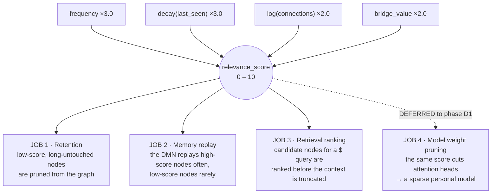

| Job | What it decides | Status |
| --- | --- | --- |
| **1 · Retention** | `prune_low_score()` — what the graph forgets | ✅ built (B1, B6) |
| **2 · Replay** | Which nodes the Default Mode Network thinks about during idle time | ✅ built (B6) |
| **3 · Ranking** | Which nodes get into the LLM prompt before the character budget truncates | ✅ built (B5) |
| **4 · Weight pruning** | Which attention heads of the local model get cut | ⏸ **deferred** to phase D1 — see §17 |

**Why job 4 is deferred and not deleted.** It was originally the *point* of the project — the fix for "the model is too big for a laptop". BitNet b1.58 2B4T then turned out to fit a laptop anyway (~1.4 GB measured). That made pruning an optimisation rather than a requirement, and it is by far the riskiest piece, so it moved to the end of the roadmap where a negative result costs nothing structural. Full design in `pruning.md`; summary in §17.

---

## 4. Features at a glance

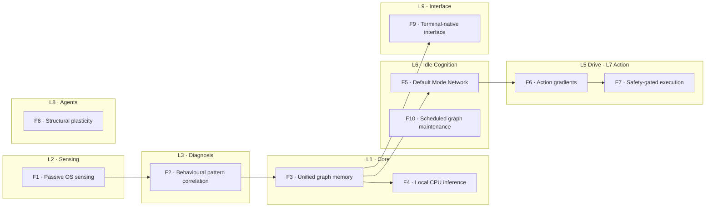

| # | Feature | What it does, plainly | Key technical detail |
| --- | --- | --- | --- |
| **F1** | Passive OS sensing | Reads system numbers every 60 s | `psutil` + `watchdog` + Wayland protocols; **no inference in this layer**; publishes `MetricSnapshot` to the bus |
| **F2** | Pattern correlation | Turns raw numbers into named situations | Rule-based `SignalCorrelator` over bounded deques; the LLM is never consulted here |
| **F3** | Unified graph memory | Remembers things and how they relate | `networkx.MultiDiGraph`, 11 routing hubs, Hebbian edge strengthening, atomic saves |
| **F4** | Local CPU inference | Runs an LLM without a GPU or an account | Two lazily-loaded GGUF models behind **one** system-wide `_inference_lock` |
| **F5** | Default Mode Network | Thinks while you're away | Triggered on real idle events; cancelled within one tick when you return; wall-clock and inference budgets |
| **F6** | Action gradients | Builds up evidence before acting | Pressure accumulator, exponential decay half-life 60 s, low/high thresholds, hysteresis latch |
| **F7** | Safety-gated execution | Cannot damage your machine | One `SafetyGate`, sandbox with `env={}`, backup-to-quarantine, JSONL audit, terminal confirmation |
| **F8** | Structural plasticity | Grows temporary diagnostic structure, then cleans up | Bounded agent tasks, ephemeral node cap, apoptosis at 14 days |
| **F9** | Terminal-native interface | The only human surface | Unix socket + JSONL, thin CLI, a **read-only command set** (B12): `tell` / `overview` / `health` / `run` / … |
| **F10** | Scheduled maintenance | Keeps the graph healthy | Consolidate duplicates, re-link orphans, recompute scores, purge raw buffers |

### 4.1 The terminal — a read-only project guide (B12)

The `neuropaca` terminal is command-only. Two kinds of command:

| Command | What it does |
| --- | --- |
| `neuropaca tell <path>` | what a file or folder does — its module docstring + top-level classes/functions + which layer, read straight from source (`interface/describe.py`, `ast` only). Deterministic, offline. |
| `neuropaca tell <path> --explain` | the above, then the interactive model paraphrases that summary in plain words — flagged, shown *after* the facts |
| `neuropaca overview` | what NeuroPACA is, what it watches, the L1-L10 layer map |
| `health` · `insights` · `notifications` | daemon + module state |
| `confirmations` · `confirm <id> [--deny]` | the L7 dangerous-action handshake |
| `run "<cmd>"` · `run --backup "<cmd>"` | hand a command to L7 (`$!` / `$$` are the internal wire enum); a dangerous action still needs `confirm` |
| `doctor` · `export` · `panic` | offline verbs (B9) |

```bash
neuropacad                                       # the daemon
neuropaca overview                               # what it is + the layer map
neuropaca tell src/neuropaca/drive/pressure.py   # what a file does
neuropaca tell drive/pressure.py --explain       # + a plain-words paraphrase
neuropaca health                                 # daemon + per-module health
neuropaca run "pkill -f webpack"                  # → L7, requires confirmation
neuropaca confirmations                          # what is waiting on you
neuropaca doctor                                 # offline diagnostic, no daemon needed
```

#### Rejected alternative — free-text terminal Q&A (`$` / `$?` / `chat`, B5/B11), withdrawn B12

The original interface fronted the behavioural graph and the repo docs with a
natural-language question:

- **`$` / `$?` (`ask` / `diagnose`)** — retrieval over the graph
  (`search_by_label` → `find_related` → rank), then the interactive model wrote
  one sentence behind a GBNF grammar and a hard `parse_answer` grounding gate.
- **`chat` (B11)** — retrieval over the repo's Markdown (`KnowledgeIndex`, a
  stopword-filtered lexical match), then the model free-decoded a paragraph;
  grounding was **advisory** — an unmatched answer was flagged `⚠ general
  knowledge`, not withheld.

Both were pulled in B12. The reasons, recorded because the rejection is a
deliverable:

- **A 3B-Q4 model paraphrasing a retrieved doc chunk is not reproducible** and
  was sometimes wrong in ways a reader could not detect — unacceptable for a tool
  whose stated job is to be the *first* guide to the codebase.
- **`chat` grounding was a label, not a gate.** On a 30-question battery it
  reached 30/30 project recall but only ~70% off-topic rejection; the leaks
  retrieved a tangential chunk and cost only the missing flag. Good enough for a
  convenience, not for an authority.
- **`$` / `$?` answered about *your behaviour*, not *the project*** — a different
  need from "explain this file", and one the user no longer wanted on the
  terminal surface.
- **Deterministic docstring + `ast` extraction is 100% reproducible and always
  correct** by construction. `--explain` keeps an *optional* model paraphrase,
  clearly subordinate to the facts.

The behavioural graph, `GraphMemory.search_by_label` / `find_related`, and the
`KnowledgeIndex`-style lexical approach are all unchanged — only the terminal
verb that fronted them with a model is gone. The `$!` / `$$` action relay
survives as `neuropaca run` (`$!` / `$$` are now an internal L9→L7 wire enum).

---

## 5. Why this is valuable as high-level research

**In plain words.** Lots of people are building AI assistants. Almost nobody is building one that (a) gets its data from the operating system rather than from what you type at it, (b) runs entirely on a laptop CPU, and (c) writes down honestly what didn't work. Those three things together are the contribution.

### 5.1 The five contributions

| # | Contribution | Why it is not already done |
| --- | --- | --- |
| **1** | **A behavioural data layer, not another agent runtime** | Existing agent frameworks (Hermes, OpenClaw, LangGraph) start from *text the user typed*. NeuroPACA starts from *OS-level telemetry the user never typed*. It is a substrate those frameworks could consume. |
| **2** | **A single usage score reused for retention, replay, and ranking** | Retrieval systems rank by semantic similarity; caches evict by LRU; nobody has unified all three under one behaviourally-derived score and measured whether that unification costs anything. |
| **3** | **Corroboration-gated autonomy, measured** | "Require multiple signals before acting" is folklore. We turn it into a structural set test and show it is *impossible* — not merely unlikely — for one source to cross the high threshold, with 500 max-confidence spikes producing 167× the threshold and still firing only the low tier. |
| **4** | **A CPU-only, zero-egress agent that is proven zero-egress** | Privacy claims are usually documentation. Here they are a CI job in a network namespace that fails the build if an outbound connection succeeds. |
| **5** | **A published record of failure** | The Ollama dead-end, the coherence collapse at 2B, three soaks that measured nothing, a leak-slope statistic that lied. Negative results with numbers attached are rare and reusable. |

### 5.2 What makes the results credible

- **Every claim maps to an artefact.** Each build phase has written exit criteria, and each criterion names the test or script that proves it. No criterion is signed off by inspection.
- **Positive controls where soaks failed.** When 24-hour dogfooding soaks produced empty logs three times, we did not lower the bar — we built a positive control that drives synthetic episodes at *byte-identical* thresholds and proves the pipeline fires (`scripts/b7_positive_control.py`, `neuropaca.control.toml`).
- **Cross-phase agreement.** B4's soak recorded resident memory of **1477 MiB** for the loop model; B9's gate, a whole phase later on a different code path, measured **1476.1 MiB**. Two independent measurements agreeing to within a megabyte is a real signal that the number is the model, not the harness.
- **Bugs in the measurement tooling are logged as bugs.** `rss_trend()` reporting `+5600.7 MiB/day` from a one-time warm-up step is recorded as open problem **T6**, not quietly fixed and forgotten.

---

## 6. System architecture — the ten layers

**In plain words.** The program is split into ten parts. No part is allowed to call another part directly — they can only shout messages into a shared room, and whoever cares listens. That sounds slower, but it is the reason any one part can crash without taking the rest down, and the reason each part can be tested alone.

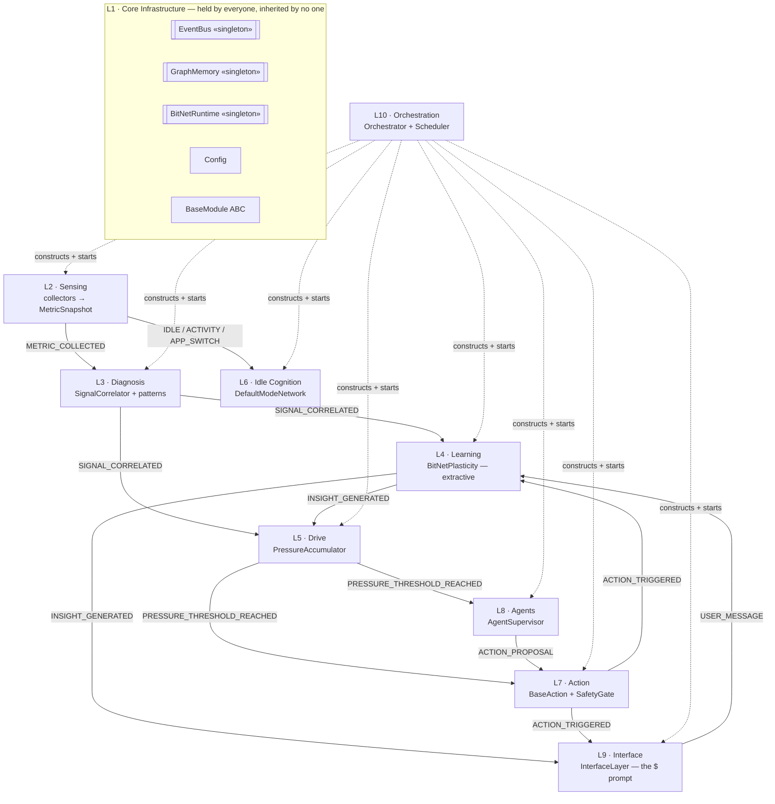

| Layer | Name | Primary classes | Source |
| --- | --- | --- | --- |
| **L1** | Core Infrastructure | `EventBus`, `GraphMemory`, `BitNetRuntime`, `Config`, `Node`/`Edge`, enums, `BaseModule`, `Clock` | `core/` |
| **L2** | Sensing | `BaseCollector`, `SystemMetricCollector`, `FileSystemCollector`, `ActivityCollector`, `MetricSnapshot` | `sensing/` |
| **L3** | Diagnosis | `SignalCorrelator`, `BasePattern`, `HighLoadPattern`, `IdlePattern`, `FocusSessionPattern`, `DistractionPattern`, `AppMap` | `diagnosis/` |
| **L4** | Learning | `BitNetPlasticity`, `Insight`, GBNF prompts | `learning/` |
| **L5** | Drive | `PressureAccumulator`, `PressureEntry` | `drive/` |
| **L6** | Idle Cognition | `DefaultModeNetwork` | `idle/` |
| **L7** | Action | `BaseAction`, `SafetyGate`, `Sandbox`, `Quarantine`, `ActionAudit`, `ConfirmationBroker`, `ActionExecutor` | `action/` |
| **L8** | Agents | `AgentSupervisor`, agent payloads | `agents/` |
| **L9** | Interface | `InterfaceLayer`, `Message`, CLI, offline verbs | `interface/` |
| **L10** | Orchestration | `NeuroPACAOrchestrator`, `Scheduler`, `build_modules` | `orchestration/` |

### 6.1 How one observation travels the whole system

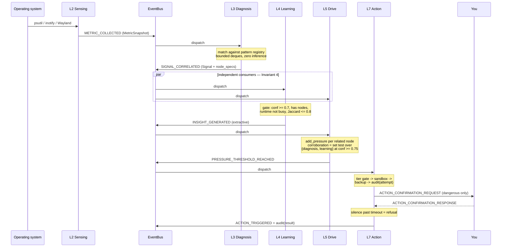

### 6.2 The routing hub design

**In plain words.** Instead of comparing new information against everything the system already knows (which gets slower and slower), it first decides "which of eleven boxes does this belong in", then only compares within that box.

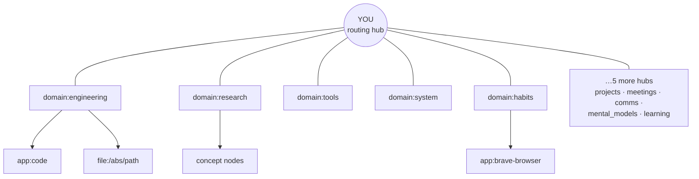

- **11 protected nodes**: `YOU` plus 10 `domain:*` hubs. They are hard-coded as a protected set — `prune()` and `prune_low_score()` skip them, always.
- **`find_related()` never traverses *through* a hub** (`traverse_hubs=False` by default). Without that rule, every node would be two hops from every other node and the sub-50 ms traversal target would be impossible.
- The routing layer collapses what would otherwise be an O(n) comparison against the whole graph.

---

## 7. The four invariants that hold it together

**In plain words.** Four rules that, if broken, cause bugs that are almost impossible to find later — silent deadlocks, frozen interfaces, tests that pass alone and fail together. They are written down so that violating one counts as a defect, not a style disagreement.

| # | Invariant | The trap it prevents |
| --- | --- | --- |
| **1** | **Services are held, not inherited.** `EventBus`, `GraphMemory`, `BitNetRuntime` are singletons; modules hold *references* and never subclass them. | Hidden god-objects; broken test isolation |
| **2** | **`GraphMemory` uses `asyncio.Lock`, never `threading.Lock`.** | Mixing the two silently deadlocks |
| **3** | **`BitNetRuntime.infer()` is blocking** — always wrapped in `run_in_executor()` via `infer_async()`. | The event loop freezes for whole seconds |
| **4** | **`SignalCorrelator` produces; `PressureAccumulator` and `BitNetPlasticity` consume — independently.** They never call each other. | Direct coupling; ordering bugs |

**The derived principle:** *no module imports another module*. Intelligence is emergent — no single component decides anything; behaviour arises from which modules happen to fire together.

This principle was tested hardest in **B8**, where the obvious design would have given the agent layer its own safety gate. It doesn't:

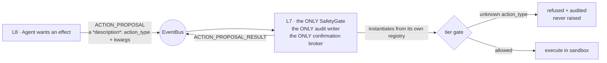

Two gates would have meant two audit writers and two confirmation brokers racing for the human's single answer. One gate, one log, one prompt.

---

## 8. Data model — what the graph actually stores

### 8.1 Node and edge shape

- **Graph type:** `networkx.MultiDiGraph` — parallel edges are required, because the same pair of nodes can be connected by *different* `RelationType`s simultaneously.
- **Identifiers:** every node id and node-reference field is a `str`. Only `Event.id` is a `UUID`.
- **Node id conventions carry meaning:**

| Prefix | Meaning | Lifetime |
| --- | --- | --- |
| `YOU`, `domain:*` | The 11 routing hubs | Permanent, protected from all pruning |
| `app:<id>` | An application you use | Score-decayed |
| `file:<abs path>` | A file in a watched path | Score-decayed |
| `insight:<uuid>` | An L4 extractive insight | 48 h TTL |
| `idle:<uuid12>` | An L6 idle thought | 48 h TTL |
| `ephemeral:<facet>:<uuid>` | An L8 diagnostic sub-cluster node | 14 d apoptosis |

> **A hard-won design constraint.** `GraphMemory` builds its networkx node data from the **fixed** `Node` field set, and serialisation round-trips only those same fields. An ad-hoc attribute is silently discarded at creation *and again on every save*. This is why apoptosis selects on the **node-id prefix**, not on an `is_ephemeral` attribute — with an attribute, one daemon restart would make every ephemeral node look permanent, the sweep would reap nothing, and the graph would grow without bound, silently. (Decision D-16(d-bis).)

### 8.2 The event catalogue

The bus is the entire API surface between layers. Key event types:

| Event | Publisher | Consumers |
| --- | --- | --- |
| `METRIC_COLLECTED` | L2 | L3 |
| `IDLE_DETECTED` / `ACTIVITY_DETECTED` | L2 activity | L6 |
| `APP_SWITCH` | L2 activity | L3 |
| `SIGNAL_CORRELATED` | L3 | L4 **and** L5, independently |
| `INSIGHT_GENERATED` | L4, L6 | L5 (filtered to `source == "learning"`), L9 |
| `PRESSURE_THRESHOLD_REACHED` | L5 | L7 **and** L8 |
| `ACTION_PROPOSAL` / `ACTION_PROPOSAL_RESULT` | L8 / L7 | L7 / L8 |
| `ACTION_CONFIRMATION_REQUEST` / `_RESPONSE` | L7 / L9 | L9 / L7 |
| `ACTION_TRIGGERED` | L7 | L9, L4 |
| `SYSTEM_HEALTH_REQUEST` / `_REPORT` | L9 / L10 | L10 / L9 |
| `AGENT_SPAWNED` / `AGENT_COMPLETED` | L8 | *(deliberately unsubscribed — observability contract for the validators)* |

**Backpressure is explicit:** `EventBus.event_queue` is an `asyncio.Queue(maxsize=1000)`. `publish()` is `put_nowait` + `except QueueFull` → drop, increment `_dropped_count`, log at ERROR. A publisher **never blocks**. This is provable behaviour, not hopeful behaviour — see the event-storm test in §12.

### 8.3 The pattern registry

| Pattern | Fires when | Attaches graph nodes? |
| --- | --- | --- |
| `HighLoadPattern` | CPU > 90 % sustained (5 samples) | ✅ from filesystem activity |
| `IdlePattern` | No input past the idle threshold | ❌ — carries no `node_specs` |
| `FocusSessionPattern` | A `domain:engineering` or `domain:research` app held ≥ 20 min without switching, mean CPU above idle | ✅ |
| `DistractionPattern` | More than 5 app switches in a trailing 2 min window (re-arm ≤ 2) | ❌ |

> **This table is also a finding.** Only the two patterns that attach nodes can drive pressure at all — `PressureAccumulator.add_pressure` loops over `related_node_ids`, and an empty list is a no-op. That structural fact is what made three 24-hour soaks produce empty logs (§11.7, §15.5).

---

## 9. The model stack — how a laptop runs two LLMs

**In plain words.** There are two AI models. A small always-on one does the background thinking. A bigger one wakes up only for `neuropaca tell … --explain`, and goes back to sleep. They are never allowed to run at the same time — that would fight over the CPU — but they can both be in memory at once, and we measured exactly how much memory that costs.

### 9.1 The two models

| Model | Role | Quantisation | Resident RAM | Throughput | Measured in |
| --- | --- | --- | --- | --- | --- |
| **BitNet b1.58 2B4T** | Always-on loop — L4 extractive insight, L6 idle thoughts | GGUF `tq2_0` | **1.37 GB** after load → **1.55 GB** after 30 min | **~17 tok/s** | B0 spike, 2026-08-30 |
| **Qwen2.5-3B-Instruct** | Interactive only — the L9 `tell --explain` paraphrase (B12) | GGUF `Q4_K_M` | **~3.25 GB** (`n_ctx=2048`, `n_batch=128`) | **~3.1–3.5 tok/s** | B5 validation, 2026-09-01 |

**BitNet b1.58** stores weights in {−1, 0, +1} — 1.58 bits per parameter. Matrix multiplication becomes addition and subtraction; there is no floating-point work at inference. That is what makes ~0.4 GB of weights and CPU-native execution possible. For comparison, a conventional 2B model in float32 is roughly **8 GB**.

### 9.2 The measured memory ladder

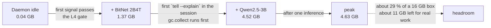

- Both models are **lazily loaded** and **independently self-disabling**. An idle session pays neither cost.
- A single `_inference_lock` serialises **every** call system-wide. The two models never *run* at once — they only *reside* at once.
- Package temperature under sustained load: **66–72 °C**, no thermal throttling observed.
- If `interactive_model_path` is unset, `tell --explain` shows only the deterministic block (B12) and only the 1.37 GB BitNet footprint applies.
- Documented fallback if 4.63 GB ever becomes a problem: a 1.5B interactive model.

### 9.3 The critical constraint — structured generation

**In plain words.** Small models make things up. Instead of asking politely for good output, we force the model to fill in a rigid form, and then check the answer against reality before believing it.

Every `BitNetRuntime` call runs against a task-specific **GBNF grammar**:

- `cited_nodes` is **locked to the node IDs present in the prompt** — the model literally cannot cite a node that does not exist.
- There is always an explicit `abstain` path.
- Input is distilled to **≤ 5 nodes**, temperature ≈ 0.
- A **hard post-generation validation gate** rejects any output that does not ground in a real node label.

L4's grammar, for instance, is:

```
{ "cited_node_id": <alias|null>, "insight_category": routine|anomaly|distraction }
```

The human-readable `summary` is then rendered from a **Python template**, never from model free text. This is the "extractive pivot" (Decision D-11), and §15.2 explains the measured failure that forced it.

---

## 10. Method — how we built it, phase by phase

**In plain words.** We built it in eleven numbered steps. Each step had written pass/fail conditions decided *before* the code was written, and a step was only declared done when a named test or script proved each condition. Where a condition could not be proven, that is recorded as unproven rather than assumed.

```mermaid
flowchart LR
    B0["B0 ✅<br/>de-risking spike"] --> B1["B1 ✅<br/>core L1"]
    B1 --> B2["B2 ✅<br/>sensing L2"]
    B2 --> B25["B2.5 ✅<br/>activity sensing"]
    B25 --> B3["B3 ✅<br/>diagnosis L3"]
    B3 --> B4["B4 ✅<br/>learning L4"]
    B4 --> B5["B5 ✅<br/>interface L9"]
    B5 --> B6["B6 ✅<br/>idle cognition L6"]
    B6 --> B7["B7 ✅<br/>drive + action L5/L7"]
    B7 --> B8["B8 ✅<br/>agents L8"]
    B8 --> B9["B9 🟡<br/>hardening L10"]
    B9 -.-> D1["D1 ⏸<br/>model pruning"]
```

### 10.1 The methodology rules

| Rule | Why |
| --- | --- |
| **Risk first.** The single most likely project-killer was tested in B0, before any module code existed. | If BitNet had not fit in RAM, every layer above L2 was wrong. Better to know in week one. |
| **Exit criteria are written before the phase starts** and live in `phases.md`. | Prevents the criterion from being quietly redefined to match whatever got built. |
| **Every criterion names its proof.** A test function or a script, not a paragraph. | "Reviewed and looks fine" is not evidence. |
| **Tests ship in the same change as the code.** | No "tests later" backlog. |
| **`memory.md` records what is *true*, not what was intended;** the completed log is append-only. | A project log that gets rewritten cannot be used as evidence. |
| **Blockers are ruled explicitly and numbered (D-1 … D-17).** | A future session — human or AI — should never re-litigate a settled decision. |
| **The source blueprint wins over the docs; the diagram wins over the prose.** (D-1) | Single source of truth under disagreement. |

### 10.2 Phase-by-phase summary

| Phase | What was built | Headline result |
| --- | --- | --- |
| **B0** | De-risking spike: does BitNet b1.58 2B4T fit and stay coherent? | RAM ✅ 1.39 GB · **coherence ❌ at every K** → forced the extractive pivot |
| **B1** | L1 core — `EventBus`, `GraphMemory`, `BitNetRuntime`, `Config`, `BaseModule`, `Clock`, minimal L10 | 10k-node load **294 ms**; `find_related` **0.09 ms** |
| **B2** | L2 sensing — `SystemMetricCollector`, `FileSystemCollector`, bounded ring buffer, collector isolation | Mean CPU **0.00 %** over 663 samples; buffer provably bounded |
| **B2.5** | Activity sensing on Wayland — idle via `ext-idle-notify-v1`, active window via `zcosmic-toplevel-info-v1`, `AppMap`, focus/distraction patterns, live `bridge_value` | 20k app-switch burst → exactly **1** distraction signal |
| **B3** | L3 diagnosis — `SignalCorrelator`, `HighLoadPattern`, `IdlePattern`, `upsert_node` | 43,200 snapshots (one month) in **~1 s**, ~20 µs each |
| **B4** | L4 learning — `BitNetPlasticity`, GBNF extractive pipeline, lazy model load, gating, Hebbian reinforcement | RSS **1477 MiB dead flat** over 1215 cycles |
| **B5** | L9 interface — Unix socket IPC, thin CLI, dual-model routing, health bridge, insight surfacing | CLI **0.72 ms** max vs a 100 ms budget (**166× margin**) |
| **B6** | L6 idle cognition — the Default Mode Network, consolidate / link-orphans / prune-stale, extractive idle thoughts | Cancel a mid-consolidate cycle in **0.1 ms**, zero corruption |
| **B7** | L5 drive + L7 action — pressure accumulator, safety gate, sandbox, quarantine, audit, confirmation broker | 500 max-confidence spikes → **167×** the high threshold, still only the low tier fires |
| **B8** | L8 agents — supervisor, ephemeral sub-clusters, apoptosis, `ACTION_PROPOSAL` decoupling | Cap of 12 held under **60 simultaneous** spawns |
| **B9** | L10 hardening — systemd unit, crash recovery, schema versioning, logrotate, offline verbs, CI egress test, 7-day soak | **6 of 7** criteria met; soak at 5.8 % and running |

---

## 11. Results — every measured number

All measurements are on the target box: **Pop!_OS / COSMIC (`cosmic-comp`), 15.75 GB RAM, CPU-only.**

### 11.1 B0 — the de-risking spike (2026-08-30)

**Question asked:** can a 2B ternary model run on this laptop, and is its output usable?

| Metric | Result | Verdict |
| --- | --- | --- |
| RSS after load | **1392 MB** | ✅ accepted |
| RSS after 30 min | **1557 MB** (drift 165 MB, bounded) | ✅ |
| Throughput | **~17 tok/s** | ✅ |
| Package temperature | **66–72 °C**, no throttle | ✅ |
| Citation accuracy @ K=1 | **0.69** (target 0.80) | ❌ |
| Citation accuracy @ K=3 | **0.28** | ❌ |
| Citation accuracy @ K=5 | **0.34** | ❌ |
| Citation accuracy @ K=8 | **0.25** | ❌ |
| Grounded rate | **0.00** | ❌ |
| Correct abstain rate | **0.00** | ❌ |

**The finding, stated plainly:** *free-text insight generation on a 2B model does not work.* Accuracy did not merely fall short — it **inverted with more context**, dropping from 0.69 at one node to 0.25 at eight. More evidence made the model *worse*.

**What we did about it (Decision D-11):** L4 never generates prose. The model's only job is to fill a constrained slot — *which* node, and *which* of three categories — and the sentence a human reads is rendered from a Python template. This is the single most consequential design change in the project, and it came from a measurement, not an opinion.

### 11.2 B1 — core infrastructure

| Criterion | Budget | Measured |
| --- | --- | --- |
| Load a 10,000-node graph | < 2 s | **294 ms** |
| `find_related(depth=2, traverse_hubs=False)` | < 50 ms | **0.09 ms** avg |
| 100 concurrent `add_node` + `update_node` | no corruption | ✅ serialised, all attrs intact |
| Atomic save survives an `os.replace` crash | must survive | ✅ |
| `prune()` never touches the 11 hubs | must hold | ✅ |
| Subscriber exception isolation | no recursion | ✅ → `SYSTEM_ERROR` event |

**60-minute RSS soak — conditional pass, and an honest one.**

```
min  0–4    noisy, 83–92 MiB                (allocator warm-up)
min  5–21   linear climb 92.1 → 115.0 MiB   (~+1.0 MiB/min)
min 21–60   DEAD FLAT at 115.00 MiB ± 0.01  (39 minutes)
```

- The script reported **FAIL** — 24.87 % peak-to-trough drift measured from minute 5.
- The script was measuring inside a one-time allocator warm-up ramp.
- **Steady-state drift (min 25 → 60) is 0.00 %.** A genuine leak does not plateau to ±0.01 MiB precision for 39 consecutive minutes.
- Attributed to pymalloc/glibc arena retention from the scheduler's per-minute `json.dumps` plus `recalculate_importance()` over 10k nodes.
- Tracked as open problem **T2** rather than closed by argument.

### 11.3 B2 — sensing

| Criterion | Budget | Measured |
| --- | --- | --- |
| Mean CPU over the soak | < 1 % | **0.00 %** — every one of 663 samples |
| RSS drift (min 30 → end) | < 5 % | **2.53 %** |
| Ring buffer bounded | must hold | ✅ `test_ring_buffer_is_bounded` |
| One collector dies, others survive | must hold | ✅ unit + live inotify-exhaustion integration test |
| Watchdog thread boundary | correct marshalling | ✅ live `Observer`, `call_soon_threadsafe` proven |
| Duration | 24 h | ⚠️ **11.05 h (46 %)** — machine slept overnight |

The 11-hour window was **accepted with the gap recorded** (open problem **T3**), not rounded up to a pass, and the missing duration was explicitly folded into the B9 7-day soak.

### 11.4 B3 / B2.5 — diagnosis and activity

| Test | Load | Result |
| --- | --- | --- |
| L3 throughput | 43,200 snapshots (one simulated month) | **~1 s total, ~20 µs/snapshot** vs a 20 s budget; window pinned at 31; `_baselines` = 1 entry; graph did not grow; heap drift **< 256 KB** |
| Activity storm | 20,000 `APP_SWITCH` events | Exactly **1** `DISTRACTION` signal; `_windows["activity"]` pinned at 901; heap flat; loop lag < 50 ms |
| `AppMap` classification | 100,000 `classify()` calls | Exact-match path **~15 ms total**; glob path **~1.1 µs/call**; realistic mix **~40 ms** |
| Bridge value at scale | 10k graph + 15k injected `domain:*` edges | `recalculate_importance()` max loop lag **< 50 ms** |
| Recorded fixtures | `trace_highload` / `trace_idle` / `trace_noise` | **1 / 1 / 0** signals — exact, deterministic replay |

### 11.5 B4 — learning

| Test | Result |
| --- | --- |
| Executor isolation | A 10-second blocking mock inference during a 10,000-event L3 storm → loop lag **~1.6 ms**, **0 drops**. Invariant 3 holds under load. |
| Gating storm | 1,000 signals → **> 50 % shed** by the confidence + `is_busy` + Jaccard mix; buffer clamps at 64; per-reason drop counters added |
| Hebbian reinforcement | `reinforce_cooccurrence` + a 50-citation insight → **+0.01 on existing edges only**, one lock, **~1.4 ms** |
| Real-model soak | **RSS 1477 MiB dead flat over 1215 cycles**, 1 insight generated |

### 11.6 B5 — interface

| Criterion | Budget | Measured |
| --- | --- | --- |
| CLI latency, 100 sequential `health` round-trips (fresh connection each) | < 100 ms | **min 0.48 / p50 0.54 / p95 0.62 / max 0.72 ms** — a **166× margin** |
| Grounded answer from the real model | must cite a real node | ✅ `"esbuild-service is using the most CPU right now."` · cited `["n1"]` · **confidence 0.94** · exact label substring match |
| Concurrent RSS | measure it | **0.04 → 1.37 → 4.52 → 4.63 GB** (base → BitNet → both → post-inference) |
| Qwen throughput | usable | **~3.1–3.5 tok/s** (a ~30-token answer ≈ 8 s) |
| Privacy canary | must be absent | ✅ canary absent from `graph.json` and the 21 KB log; IPC lines confirmed redacted on disk |

**A rejected optimisation, recorded:** the socket loop was *not* switched to length-prefixed `readexactly`. It would have broken JSONL framing to improve on a 166× margin. Recording the rejection is the point.

**Two validation-driven fixes:**

1. `_ANSWER_GRAMMAR_TEMPLATE`: `ws ::= [ \t\n]*` → `ws ::= " "?`. Given free whitespace, a weak model **looped on spaces and never closed the JSON**, burning its entire 96-token budget. Flexible whitespace bought nothing and cost coherence.
2. `interactive_model_context_tokens` 4096 → 2048 and interactive `n_batch` 512 → 128 — Qwen's 152k vocabulary makes the `n_batch=512` logits scratch buffer roughly 300 MB.

### 11.7 B6 — idle cognition

| Criterion | Measured |
| --- | --- |
| Returning to the keyboard cancels the cycle without corruption | **0.1 ms** to fully unwind a cycle running mid-consolidate over **12,000 duplicates / 22,011 nodes**; lock released; zero dangling edges; hubs intact; a second `consolidate()` finished the remaining **11,894** merges cleanly |
| A cycle never exceeds its budgets | `TimeoutError` at **10.00 s**; capped at **2** idle thoughts (the 3rd inference was cut); `_errors = 0`; daemon healthy |
| `consolidate()` shrinks a duplicate-heavy fixture | **500 merges in 2,510 ms** over ~10.5k nodes; `node_count` −500 exact; summed `access_count` and averaged `relevance_score` both correct; every duplicate edge rewired |

### 11.8 B7 — drive and action

| Exit criterion | Measured |
| --- | --- |
| A single signal never crosses the high threshold | **500 max-confidence L3 spikes → pressure 499.8 = 167× the high threshold, tiers fired `['low']` only.** Structural, not tuned: corroboration is a **set test** over `{diagnosis, learning}`, so one source cannot satisfy it at any magnitude. L3 + L4 together then opened it once. |
| Pressure decays below 1 % within 10 minutes | **0.0976 % of peak at ten half-lives**, against the exact theoretical 0.5¹⁰ = **0.0977 %** |
| Dangerous actions need a recorded confirmation | Full daemon over the real socket with dry-run **off** and both tiers enabled: **expiry → refused · explicit denial → refused · approval → ran.** Only the approved command executed. |
| Audit complete for every attempt | **6 lines, 3/3 attempt+result pairs.** An unwritable audit log **refuses the action**. |
| Dry-run review period with zero false positives | See §15.5 — three soaks logged nothing; met via a **positive control**: **60 attempts, 60/60 attempt+result pairs, 0 executed effects, 0 high-tier proposals** over ~4.5 h |

**Configuration under test** (`neuropaca.toml`, the shipped values):

```toml
pressure_low_threshold           = 1.0
pressure_high_threshold          = 3.0
pressure_decay_half_life_seconds = 60
pressure_decay_interval_seconds  = 10
action_dry_run                   = true
action_enabled_tiers             = ["safe"]
```

### 11.9 B8 — agents and structural plasticity

| Exit criterion | Measured |
| --- | --- |
| Ephemeral-node cap holds under a spawn storm | **60 spawns against a cap of 12 → 12 granted / 12 live in 0.5 ms**, and **60 *simultaneous* spawns → still 12**. The count-then-create pair is inside the module's own lock. |
| Apoptosis reaps past-TTL nodes and nothing else | At the **production 14-day constant**: 6 aged / 6 fresh → **6 reaped, 6 survive, edges 12 → 6, 0 dangling**, `app:webpack` untouched, node and edge counts exact. The marker survives save/reload (6/6). |
| `ACTION_PROPOSAL` routes through L7's single gate | Gate executed 1, node written, result `ok`. An unknown `action_type` **refused (`not proposable`) without reaching the gate**. 4 audit lines = attempt+result for both. |
| An agent never exceeds its wall-clock budget | A 5 s body under a **1 s** budget abandoned at **1.01 s**, outcome `'timeout'`, module health still ok, graph consistent |
| Over-cap spawns are refused, never queued | **60 crossings against a cap of 1 → 1 spawned, 59 refused**, 1 in flight, no second agent after the first released |

### 11.10 B9 — hardening (in progress)

**Six criteria met by the test suite:**

| # | Criterion | Proof |
| --- | --- | --- |
| 1 | `neuropaca doctor` produces a full report with the daemon **not running** — no socket, no daemon | 3 named tests |
| 2 | `neuropaca panic` SIGKILLs the daemon first (so nothing re-persists) then wipes `data/`; refuses without the typed word; refuses when the config will not load rather than guessing a directory | 3 named tests |
| 3 | CI **affirmatively** fails an outbound connection | `tests/integration/test_egress_blocked.py` (5 tests) inside a network namespace with loopback only + static import checks |
| 5 | An unreadable graph is quarantined and the daemon **boots anyway** on a fresh 11-hub graph, reporting itself **degraded** | 3 tests × 3 corruption shapes |
| 6 | `schema_version` is actually **read** — a newer-than-supported file is refused with a message, a v1 file still loads, a malformed record raises `GraphMemoryError` not `KeyError` | 3 named tests |
| 7 | The unit binds the L9 socket under `ProtectSystem=strict`; logrotate targets files the daemon actually writes | 2 tests + `systemd-analyze --user verify` |

**Criterion 4 — the 7-day soak — is the only one that cannot be met from a keyboard.**

Gate result (2026-09-03, 60-minute window): **PASSED.** RSS moved 42.7 → **1476.1 MiB** because going idle woke the DMN and lazily loaded BitNet. Cross-check: B4's independent soak recorded **1477 MiB** a whole phase earlier — **agreement within one megabyte.**

Live soak state at the time of writing:

```
Progress      5.8 %  (9 h 49 m of 7 d accrued runtime)
Wall clock    23 h 14 m since first start (2026-09-04 17:47 UTC)
Sessions      4  (3 ended unclean — ordinary power cycles)
Samples       431  (3 daemon restarts)
Memory        1467 MiB now, +1 MiB over 2 h 11 m (peak 1472)
Leak slope    +11.0 MiB/day   <- the number this soak exists to produce
Graph         17 nodes, 10 edges
Sensing       35 idle/active edges, 8 app switches
Drive         0 contributions, 0 low / 0 high crossings
Health        0 errors, 0 events dropped, 0 audit lines
```

**Why "accrued runtime" and not calendar time.** A box powered off overnight ages no process. Counting those hours would let a 3.5-day soak claim a 7-day result — which is precisely how the B2 soak reached 11 h of a 24 h window. An unclean shutdown leaves a session open; the next boot heals it from the last heartbeat, labels it `unclean`, and rounds runtime **down** rather than crediting hours the machine spent switched off. `systemd-inhibit --what=sleep:idle` wraps the driver for the same reason.

**Three things that only a real machine could have caught**, none of which any test suite could:

1. `neuropaca.toml` **did not exist.** The systemd unit pointed at a file nothing had ever created. `doctor` reported `config INVALID`; the daemon could not have started at all.
2. **The unit had never been installed**, so the `graphical-session.target` binding was verified only in the reasoning. Once installed, the daemon process has `WAYLAND_DISPLAY`, the socket binds under `ProtectSystem=strict`, and `activity ✓ idle✓ window✓` — the collector that was silent through three B7 soaks is alive.
3. `journalctl --user` returns **"No journal files were found"** — journald ships `Storage=auto` and `/var/log/journal` does not exist. The gate's collector and activity checks grepped exactly that, so they would have read zero activity from an empty journal and either refused a healthy soak or passed a week of zeros. Both checks now read `neuropaca health` over the socket instead: structured, authoritative, dependency-free.

### 11.11 Codebase metrics

| Metric | Value |
| --- | --- |
| Source lines (`src/neuropaca/`) | **10,909** |
| Test lines (`tests/`) | **9,435** |
| Test-to-source ratio | **0.86 : 1** |
| Tests collected | **446** (423 default · 14 stress · 13 integration, some deselected by marker) |
| Python modules in `src/` | 66 |
| Validation / soak scripts | 24 in `scripts/` |
| Git commits | **91** |
| Merged pull requests | 16 |
| Static analysis | `ruff check` + `ruff format --check` + `mypy` — all clean, enforced in CI |

---

## 12. Testing methodology

**In plain words.** There are four different kinds of test, each catching a kind of bug the others miss. Unit tests check logic. Stress tests check that things don't fall over under load. Integration tests check that real operating-system pieces actually work. Soaks check that nothing slowly rots over days.

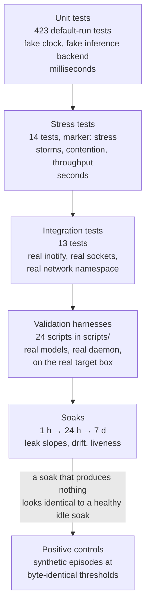

### 12.1 The four test tiers

| Tier | Count | What it catches | Determinism device |
| --- | --- | --- | --- |
| **Unit** | 423 | Logic errors, boundary conditions, invariant violations | `FakeClock` (no `sleep`), `FakeInferenceBackend` (schema-aware), `conftest.py` wipes every singleton `_instance` between tests |
| **Stress** | 14 (marker `stress`, excluded from the default run) | Backpressure failures, lock contention, loop stalls, heap growth | Deterministic ordering — e.g. the event storm starts dispatch **after** the burst so the drop count is exact |
| **Integration** | 13 | Thread-boundary bugs, real `inotify` exhaustion, real socket framing, actual egress | Live `watchdog.Observer`, live Unix sockets, a real network namespace |
| **Validation** | 24 scripts | Everything that only exists on the real box: real GGUF models, real Wayland, real systemd | Run by hand on the target box, results recorded in `memory.md` |

### 12.2 Recorded-fixture replay

Rather than asserting on live system behaviour (which is not reproducible), L3 correctness is proven by **replaying recorded traces**:

- `trace_highload.json` → must produce exactly **1** `HIGH_LOAD`
- `trace_idle.json` → must produce exactly **1** `IDLE`
- `trace_noise.json` → must produce exactly **0** signals
- Focus / distraction / calm traces for B2.5, replayed through the **real** correlator

Same for the fifth-pattern isolation test, premature-fire timing, and `relevance_score` preservation on upsert.

### 12.3 The positive-control pattern — our most reusable methodological result

**The problem, plainly.** We ran a 24-hour test three times to prove the action system behaves correctly. All three produced an empty log. **An empty log cannot tell you the difference between "the system is correct and the day was quiet" and "the system is broken."**

**The wrong fixes we considered and rejected:**

- Lower `HighLoadPattern`'s CPU threshold from 90 % to 50 % — that pattern keys off file-change activity, is hard-coded rather than configurable, and a lower bar risks tripping on ordinary background noise, working *against* the zero-false-positive bar we were trying to prove.
- Map the browser to `research` so focus sessions would fire — an inaccurate classification chosen to make a test pass. Rejected; the browser was mapped to `habits`, which is honest and which **does not** unblock the criterion, and that consequence was recorded.

**The fix we used.** A **positive control**: a throwaway daemon driven by bounded synthetic episodes at thresholds that are **byte-identical** to production (`neuropaca.control.toml`). It proves the L3 → L5 → L7 path fires. Result: 60 attempts, 60/60 attempt+result pairs, 0 executed effects, 0 high-tier proposals, every safe-tier proposal traceable to `L3 high_load: cpu 100% for 5 samples`.

**Why the logic is sound.** Zero high-tier proposals ⇒ nothing required a human verdict ⇒ the zero-false-positive rule holds *mechanically*, not by someone's judgement.

B8 then adopted the same pattern by default rather than attempting a soak that structurally could not fire.

### 12.4 The finalisation script that refuses to lie

`finalize_b7.sh` validates, and only on a pass records the result, commits, and merges. It uses `set -e` so any failure halts before the merge, and it **refuses to merge** on anything unverifiable:

- a window shorter than 24 h,
- an incomplete audit,
- any executed effect,
- **any high-tier proposal at all** — because a high-tier proposal is precisely the thing a human must judge, and an unattended script must fail rather than assert a verdict nobody gave.

### 12.5 CI

`.github/workflows/ci.yml` runs `ruff check .` (no `--fix`), `ruff format --check`, `mypy`, the default pytest run, and a dedicated **`egress-test`** job inside a network namespace with only loopback, which asserts that both HTTP and raw TCP raise. Static checks additionally forbid any outbound-client import and any non-`AF_UNIX` socket anywhere in the shipped package.

---

## 13. Performance engineering — the five optimisations that mattered

**In plain words.** Five specific slow or leaky things were found by measurement and fixed. Each one is listed with the before number, the after number, and the reason — because "we optimised it" without numbers is not a result.

### 13.1 T4 — the scheduler was freezing the event loop

| | |
| --- | --- |
| **Symptom** | With a 10,000-node graph, each scheduler tick stalled the event loop **320–370 ms** |
| **Found by** | `scripts/measure_loop_lag.py --big-graph` |
| **Root cause** | Three compounding mistakes: (a) `save()` built a ~7 MB `json.dumps(indent=2, sort_keys=True)` string **on the loop, under the lock** — and `indent` forces json's **pure-Python** encoder, ~200 ms per 10k nodes; (b) `recalculate_importance()` iterated all 10k nodes on the loop under the lock; (c) the save churn triggered a full-graph generation-2 GC (~25 ms). |
| **Fix** | (a) `recalculate_importance()` locks per **250-node chunk** with `await asyncio.sleep(0)` between; (b) `save()` stream-encodes per **500-object chunk** using per-object compact `json.dumps` (the **C** encoder), yields between chunks, and thread-offloads only the atomic file write; (c) `gc.collect()` + `gc.freeze()` after `load()`. |
| **Result** | **320–370 ms → ~26 ms per tick.** Measured loop-lag probe max: **~2 ms** against a 50 ms budget. |

### 13.2 T5 — concurrent saves collided

`save()` ran `_write_atomic` in a worker thread *outside* the lock, using a fixed temp filename `graph.json.tmp`. Two overlapping saves (a scheduler tick racing a shutdown) both wrote it; the first `os.replace` consumed it and the second raised `FileNotFoundError` out of `orchestrator.stop()`. **Fix:** `tempfile.mkstemp` per call, so overlapping saves are each independently atomic.

### 13.3 The pre-soak deep-clean audit (2026-09-04)

Every defect below was **reproduced before it was fixed**, and every optimisation is measured.

**Three liveness defects — each one silent:**

| Defect | Why it was dangerous |
| --- | --- |
| A **subscriber** raising `CancelledError` propagated out of the dispatch loop and ended it **permanently**. `is_running` kept reporting `True` while every module silently stopped receiving events; the queue backed up toward the 1000-event drop threshold; `stop()` then waited forever on a drain nobody served, so `Orchestrator.stop()` never reached its `graph.save()`. | A healthy-looking daemon that had stopped working entirely. Fixed by discriminating on `Task.cancelling()` — "always re-raise `CancelledError`" is about *our* cancellation; a handler's is a handler failure. |
| `EventBus.join()`/`stop()` waited on an **unbounded** `queue.join()`. With no live dispatch loop nothing can ever call `task_done()`. | A never-started bus, a post-stop publish, and a dead dispatch task all hung **indefinitely**. Now bounded and reported. |
| `GraphMemory.save()` cleared `_dirty` **before** streaming and never restored it on failure. | A cancelled or failed save left the graph *looking clean* with the work unwritten — **4,000 nodes** in the reproduction. The DMN hits this on the ordinary path: activity cancels an idle cycle exactly when its save is most likely in flight. |

**Two bounded leaks:**

- `InterfaceLayer._surfaced_ids` grew forever, retaining ids of INSIGHT nodes long since pruned at their 48 h TTL; `_pending_insights` grew unbounded when no CLI client ever drained it. Both bounded, newest kept.
- `_write_atomic` leaked the `mkstemp` file descriptor when `os.fdopen` raised — harmless once, **EMFILE after months of five-minute saves**.

**Three de-linearised graph jobs** (measured on 3,611 nodes, results unchanged):

| Operation | Before | After | Speed-up |
| --- | --- | --- | --- |
| `link_orphan_nodes()` | **8,413 ms** | **52 ms** | **161×** |
| `consolidate()` | 246 ms | 16 ms | 15× |
| `DMN._top_nodes()` @ 10k | 34 ms | 9 ms | 3.7× |

All three rescanned the whole graph *per mutation*. Candidates now come from **one snapshot per sweep** and are re-validated under the lock, so the one-lock-per-mutation discipline is preserved and cancellation still lands cleanly between two mutations.

> `link_orphan_nodes()` alone exceeded the **entire 60-second DMN cycle budget** at scale. It would have made the 7-day soak meaningless.

**What the audit deliberately did *not* touch:** 9 unused enum members and 4 unreferenced but blueprint-public methods (removing public API requires human approval under `rules.md §9`), and the `PATTERN_DETECTED` / `MEMORY_UPDATED` / `AGENT_*` publishers, which have no daemon subscriber but are the B8 validators' observability contract. Restraint is recorded as explicitly as removal.

**Outcome:** 399 tests passing (up from 385), mypy clean, ruff clean.

---

## 14. Safety and privacy engineering

**In plain words.** The system can, in principle, run commands on your computer. So it was built assuming it will one day be wrong, and every path to an effect is fenced. It ships switched off.

### 14.1 The action path

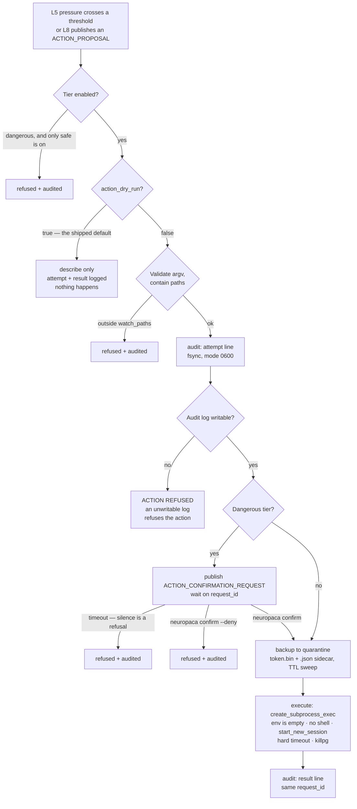

### 14.2 The safety properties, and why each exists

| Property | Implementation | The failure it prevents |
| --- | --- | --- |
| **Ships inert** | `action_dry_run = true`, `action_enabled_tiers = ["safe"]` | A fresh install describes what it would do and does nothing. The `dangerous` tier stays off until a completed soak has *earned* it. |
| **One gate only** | `SafetyGate.run` is the only path to `execute()` | No second code path can grow around the check |
| **No shell, no environment** | `create_subprocess_exec`, `env={}`, `start_new_session`, `killpg` on timeout | Shell injection; inherited credentials; orphaned process groups |
| **argv[0] is resolved explicitly** | `validate_argv` resolves it because `env={}` leaves no `PATH` | A subtle failure mode that only appears once you remove the environment |
| **Writes are contained** | Resolve-then-contain against `watch_paths` | Symlink escapes and `..` traversal |
| **Backup before write** | Quarantine `<token>.bin` + `.json` sidecar, TTL sweep | Unrecoverable overwrites |
| **Audit is complete** | Two JSONL lines (`attempt` + `result`) sharing a `request_id`, fsynced, mode 0600, refusals included | A missing line means a missing action |
| **An unwritable audit log refuses the action** | Checked before execution | Effects that cannot be reconstructed afterwards |
| **Silence is refusal** | Confirmation expiry = denial | An unattended machine drifting into a "yes" |
| **No outbound socket exists** | `ApiCallAction` was **never built** — only reserved config switches | You cannot misconfigure your way to egress if the class does not exist |
| **Agents hold no gate** | L8 publishes a description; L7 owns the only gate, audit writer, and broker | Two brokers racing for the human's single answer |

**A bug found during validation, and its regression tests.** An expired confirmation stayed visible in L9 forever, so the next `confirm` would answer a request nobody was waiting on. `ACTION_TRIGGERED` now carries the `confirmation_id` and L9 retires the prompt on it, with a timeout-based sweep behind that. Regression tests: `test_a_prompt_is_retired_when_l7_stops_waiting`, `test_a_prompt_older_than_the_timeout_is_never_offered`.

### 14.3 The five privacy guarantees, and how each is proven

| # | Guarantee | Proof |
| --- | --- | --- |
| 1 | **Zero cloud calls** | CI `egress-test` job runs in a network namespace with only loopback and asserts HTTP *and* raw TCP both raise; static checks forbid outbound-client imports and non-`AF_UNIX` sockets |
| 2 | **No screen capture, no keystroke logging** | Not implemented anywhere; window-title text is read transiently for a focus event and never persisted (`sensing/activity/window.py`) |
| 3 | **Raw sensor data is purged** | Bounded ring buffer (`snapshot_buffer_size = 720`); only extracted graph knowledge persists |
| 4 | **Idle thoughts expire after 48 h** | `prune_stale_nodes(ttl)` in the DMN |
| 5 | **Conversation history is RAM-only** | `test_conversation_history_is_ram_only_and_never_on_disk` scans every file under `tmp_path.rglob` |

Plus: **every IPC log line is redacted** — `test_ipc_payloads_are_redacted_in_logs`, and confirmed on real disk during B5 validation (`L9 <- {"op": "heal…<redacted 17 chars>`).

**A privacy finding worth stating.** Adding a browser to the app map only ever adds *app-level attendance* — a generic `app:<id>` node like any other. There is **no per-tab, per-site, or URL visibility**, by construction. This was confirmed while deciding how to classify the browser, and it is a property of the sensing design, not a policy.

---

## 15. Approaches we tried and rejected

**In plain words.** This is the section that makes it research rather than a build log. Every one of these was a real attempt that cost real time, and knowing they fail is worth as much as knowing what works.

### 15.1 Ollama for model pruning — architecturally impossible

- **The plan:** route pruning through Ollama at inference time, skipping attention heads per query.
- **Why it fails:** Ollama serves a **frozen** model. There is no "skip this head" parameter, and there never will be — that is what serving a model means.
- **The fix:** use **llama.cpp directly**, in-process. Build the cut-list from graph scores and apply it **once, at model load**. The smaller model then runs natively with no per-inference cost.
- **The consequence:** `BitNetRuntime` owns `model` + `tokenizer` directly. This is why the whole runtime layer looks the way it does.
- *Tracked as resolved problem T1.*

### 15.2 Free-text insight generation at 2B — measured failure

- **The plan:** feed the model graph context, let it write an insight sentence.
- **The measurement:** citation accuracy **0.69 / 0.28 / 0.34 / 0.25** at K = 1/3/5/8 against a 0.80 target. Grounded rate **0.00**. Correct abstain **0.00**.
- **The shape of the failure is the interesting part:** accuracy got *worse* with more context. More evidence made the model less able to use any of it.
- **The pivot (D-11):** strictly extractive. The model chooses a node id and a category from a locked enum; the sentence is a Python template. The model became a **decision gate**, not a writer.
- **This decision then propagated:** L6 idle thoughts went extractive too (D-13, `{subject, object, query_template}`), and L9's `$?` got a grammar plus a grounding gate plus a retry plus a template fallback (D-12).

### 15.3 A single model for everything — rejected on evidence

The always-on loop needs to be small (it is resident for a week). The interactive path needs to be coherent enough to answer a question. One model cannot be both at 1.4 GB. **Dual-model routing** (D-12): BitNet 2B4T for the loop, Qwen2.5-3B Q4 for the interactive path, both serialised by one `_inference_lock`, both lazily loaded. Measured cost: a 4.63 GB peak, ~29 % of the box.

### 15.4 Lowering the CPU threshold to make a soak fire — rejected

`HighLoadPattern`'s 90 % threshold could have been dropped to 50 % to make the soak produce data. Rejected because that pattern keys off file-change activity rather than app focus, the constant is hard-coded rather than configurable, and a lower bar risks tripping on ordinary background noise — working directly against the **zero-false-positive** bar the soak existed to prove. Lowering a threshold to make a test pass invalidates the test.

### 15.5 Trusting a soak that produced nothing — rejected three times

Three 24-hour dry-run soaks (2026-09-01 through 2026-09-03), one of them running 22 h 33 m, all logged **zero** action proposals.

- **First diagnosis (wrong):** the Wayland activity collector self-disables under `systemd --user` because `WAYLAND_DISPLAY` is missing.
- **Actual root cause (measured 2026-09-03):** `WAYLAND_DISPLAY` *is* in the manager environment; the daemon simply started **before the compositor imported it**. The unit now binds `graphical-session.target`.
- **The deeper structural cause:** `data/app_map.default.toml` had **no entry for any web browser**, and only `FocusSessionPattern` and `HighLoadPattern` attach graph nodes. `IdlePattern` and `DistractionPattern` fire but carry no `node_specs`, so `related_node_ids` is empty and both `BitNetPlasticity._handle` and `PressureAccumulator.add_pressure` skip them outright. On that machine, with that app map, a window with no sustained non-browser engineering focus and no >90 % CPU spike would **always** produce an empty log, regardless of duration.
- **The resolution:** the positive control (§12.3), and the B9 soak's **login popup** — every start raises a dialog showing progress, leak slope, sensing and drive counters, and any degraded module, with no timeout. *B7 burned three soaks before anyone noticed L5 had fired zero times. A dialog at every login makes a week of accumulating nothing impossible to miss past day two.*

### 15.6 The "Lottery Ticket Hypothesis" framing — rejected as an overclaim

LTH (Frankle & Carbin, 2019) is a specific claim about finding sparse subnetworks *before training* that then *train* to full accuracy. NeuroPACA does one-shot **post-hoc structured head removal guided by an external usage signal**. The honest name is **"usage-driven structured pruning of a personal language model."** LTH is cited as inspiration only — "most of a network is unused for any one task" — never as the method.

### 15.7 Weekly model retraining — cut from scope

The original concept had the system retrain weekly on your data. Cut (D-3) because it was never specified what it would train *on*, it is a large privacy and complexity surface, and the graph housekeeping the DMN performs is not training and should not be described as such. Any model adaptation now belongs to the deferred pruning work.

### 15.8 Optimisations rejected for lack of a problem

| Rejected | Why |
| --- | --- |
| Length-prefixed socket framing (`readexactly`) | Would break JSONL framing to improve on a **166×** latency margin |
| Dropping the 2B4T context window to save RAM | llama.cpp has no clean partial-context drop, and it would degrade L4 |
| An `is_ephemeral` node attribute | Ad-hoc attributes are discarded on save; apoptosis would silently stop working after one restart. Node-id prefixes persist. |
| Overloading `prune_stale_nodes()` with a second TTL | It is a whole-graph sweep on one global TTL, already owned by L6 at 48 h. Two layers would fight over one call. Apoptosis calls `delete_node()` directly instead. |

---

## 16. Open problems and honest limitations

### 16.1 Open technical problems

| # | Problem | Status |
| --- | --- | --- |
| **T2** | The B1 1-hour RSS soak drifts ~25 % before it plateaus. Not an unbounded leak — a bounded allocator warm-up (steady-state drift 0.00 %) — but the scripted 5 % check samples *inside* the ramp and reports FAIL on a healthy system. | 🟡 Open. Options: measure the back half only; `malloc_trim(0)` after `save()`; cap the arena. |
| **T3** | The B2 24-hour soak ran only 11 h — the machine slept. Partial-window numbers all pass. Residual risk (a leak slower than ~0.1 MiB/h, or late onset) is low. | 🟡 Open; **subsumed by the B9 7-day soak**. |
| **T6** | `scripts/b9_soak_state.py`'s `rss_trend()` reports a huge, misleading leak slope right after a daemon restart. It fits `(last − first) / span` over the longest daemon life; a one-time warm-up step divided by a short window extrapolates absurdly. Observed live: RSS jumped 43 → 1476 MiB in a single 60 s sample, then sat flat for 3+ hours — and the tool reported **`+5600.7 MiB/day`**, rendered verbatim in both the login popup and the tray widget. | 🔴 Open, found 2026-09-04, **not yet fixed**. |

### 16.2 Methodological limitations — stated, not hidden

| # | Limitation | Why it matters | Mitigation |
| --- | --- | --- | --- |
| **1.8** | **One user on one machine is not enough to prove anything.** | This is the single largest threat to the research claims. Behaviour patterns from one developer on one Pop!_OS laptop cannot establish generality. | 🔴 Unresolved. Requires synthetic activity generation plus multi-machine replication. It is the top item in the evaluation plan (§18). |
| **1.12** | **Privacy makes it hard to prove it works.** A system that never sends data out cannot produce a shared benchmark dataset. | Reproducibility conflicts with the core value proposition. | 🟡 Planned: a synthetic activity generator plus a public question set with known answers, so results are reproducible without real user data. |
| **1.10** | **Concurrency traps.** Async + threads + a shared graph + a blocking model is an inherently hazardous combination. | Four separate real bugs came from exactly here (T4, T5, and two of the three audit liveness defects). | 🟡 Mitigated by the four invariants, a dedicated stress tier, and reproduce-before-fix discipline — but the risk is structural. |
| **1.11** | **Too big for one person.** | Ten layers, two models, systemd integration, Wayland protocols, and a research paper. | 🟡 Managed by strict phase ordering and by deferring the riskiest work (pruning) to the end where a negative result costs nothing. |
| — | **The soak gate's check 5 is narrow.** It requires an idle transition or an app switch, and the window-switch handler returns early unless `app_id` actually changes. Someone working continuously in one application all hour produces neither, and the gate would fail a demonstrably healthy system. The passing run cleared it with roughly seven minutes to spare — closer than it should be. | Recorded rather than papered over. If re-run, widen it to accept the L2 snapshot buffer or the graph advancing. |
| — | **L7 and L8 shapes came from a ruling, not the blueprint.** The source class diagram is *permanently* truncated on the right; no full-width re-export exists or will. `Architecture.md §11b` is authoritative **by ruling** (D-15). | The mitigation was carried out in full: safe actions first, `ApiCallAction` never built, every dangerous action behind the tier gate, the sandbox, and a recorded confirmation. Any future export is reconciled *against* §11b, not the reverse. |

### 16.3 What is not yet in the repository

From `problems.md` §2.2 — the evaluation infrastructure the paper needs:

| # | Item | State |
| --- | --- | --- |
| 1 | `research.md` — the claims, how each is measured, target venues, the first-paper / second-paper line | to do |
| 2 | `eval/` — synthetic activity generator, question set with known answers, baseline retrieval methods, an ablation runner that prints a results table | to do |
| 3 | Event tracing + replay behind a `--research-mode` flag, kept out of the real daemon | to do |
| 4 | `docs/alternatives.md` — the running list of ideas tried and dropped (Ollama is entry 1) | to do |
| 5 | One line per build step in `phases.md`: "how we measure this worked, and against what baseline" | to do |

---

## 17. The deferred experiment — personal model pruning

**In plain words.** The original, most ambitious idea: use the same "how much do you use this" score to physically cut pieces out of the AI model, leaving a smaller model shaped around your actual work. It is parked at the end of the roadmap, because it turned out not to be necessary and it might not work at all.

### 17.1 The idea

| `relevance_score` | Action on that domain's attention heads |
| --- | --- |
| **≥ 7** | **Protect** |
| 4 – 7 | Keep, compressible |
| **≤ 3** | **Flag for removal** |

The result would be a sparse subnetwork shaped around the two or three domains you actually work in.

### 17.2 The bridge problem — the weakest piece in the entire project

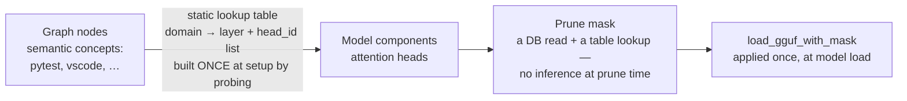

Graph nodes live in a semantic space; attention heads live in a parameter space. Bridging them requires `domain_to_heads`, a table built once at setup by probing the model with representative inputs per domain. **Nobody has shown that heads in a 2B model are topic-separable enough for this to work.**

### 17.3 Why deferred, not deleted

| # | Reason |
| --- | --- |
| 1 | **BitNet 2B4T already fits a laptop.** Pruning was the fix for "the model is too big." That problem no longer exists, so pruning became an optimisation rather than a requirement. |
| 2 | **It is the riskiest part of the project.** It may simply not work at 2B. |
| 3 | **Doing it last is the right order.** By then there will be weeks of real usage data to prune against, and the core system will have proven itself first. |
| 4 | **Nothing depends on it**, so a negative result costs nothing structural — and a documented negative result is itself a deliverable. |

### 17.4 The five questions that must be answered first

| # | Question |
| --- | --- |
| **Q1** | Are attention heads in a 2B model topic-separable enough that cutting a domain's heads removes that capability without hurting the rest? |
| **Q2** | How much can you cut before quality drops? Measure the curve at 5 / 10 / 20 / 30 % and find the knee. |
| **Q3** | What prompts build `domain_to_heads`? The graph holds behavioural nodes (`pytest`), not sentences. |
| **Q4** | Is a short recovery pass needed after pruning? "No retraining ever" may not hold. |
| **Q5** | Does BitNet's quantisation-aware machinery (straight-through estimator) make a recovery pass materially harder than a normal fine-tune? |

**If Q1/Q2 come back negative,** the paper reports it as a result — "behavioural scores did not predict prunable regions at 2B; here is the data" — and `relevance_score` keeps its three core jobs. The experiment starts as a throwaway spike in `experiments/pruning/`, promoted to `src/neuropaca/sparsity/` only if it shows promise, and **never imported by the daemon**.

---

## 18. Research claims and publication plan

### 18.1 The five candidate claims

| # | Claim, in plain English | Risk | Status |
| --- | --- | --- | --- |
| **A** | One "how much do I use this" score can decide what the system keeps, what it replays during idle, and how it ranks context for your questions | Medium | ✅ **built** (B0–B9); needs ablations |
| **C** | Building pressure from several **independent** signals before acting causes far fewer wrong autonomous actions than a simple threshold | **Low** | ✅ **built and measured**; testable entirely in simulation, no model needed |
| **D** | Passive computer-usage sensing is a useful **data layer** other agents could plug into | Positioning | ✅ demonstrated by construction |
| **B** | Watching your computer can tell us enough to **shrink a local model toward your actual work** without hurting quality much | **High** | ⏸ **deferred** (phase D1) |
| **E** | An honest write-up of **what broke** building a self-shrinking local agent on a CPU | Low | ✅ material collected throughout |

### 18.2 The plan

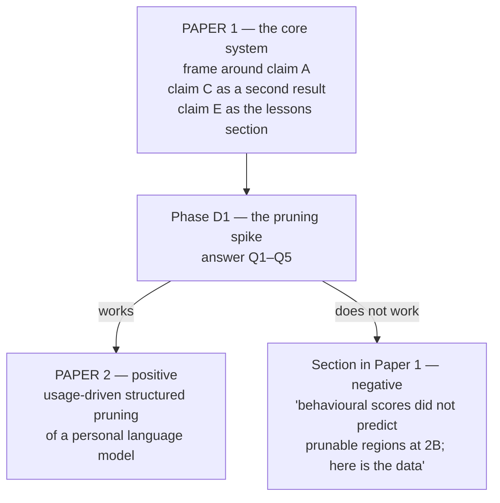

- **Claim C is the cheapest strong result in the project.** It needs no model, no user study, and no privacy compromise — it is provable in simulation. The 500-spike / 167×-threshold measurement is already most of the way there. It could stand as a clean small paper on its own.
- **Claim A is the centrepiece** and the one that most needs the missing `eval/` infrastructure: ablations that remove each score term and measure the cost to retrieval quality, replay usefulness, and retention behaviour.
- **Claim E is already written** — it is §15 of this document.

### 18.3 The evaluation that still has to be built

| Component | Purpose |
| --- | --- |
| **Synthetic activity generator** | Produce reproducible behaviour traces so results do not depend on one person's real week — this is the direct answer to limitations 1.8 and 1.12 |
| **Question set with known answers** | A ground truth for grounded-answer quality |
| **Baseline retrieval methods** | Recency-only, frequency-only, degree-only, and semantic-similarity baselines, so the composite score has something to beat |
| **Ablation runner** | Drop each of the four score terms in turn; print a results table |
| **`--research-mode` event tracing** | Full event trace and replay, kept strictly out of the shipped daemon |

---

## 19. Reproducing everything

### 19.1 Build and verify

```bash
uv venv --python 3.12
uv pip install -e ".[dev]"        # ruff + mypy + pytest + pre-commit
pre-commit install

uv run ruff check .               # note: bare, no --fix — that is what CI runs
uv run ruff format --check .
uv run mypy
uv run pytest -q                  # 423 default tests
uv run pytest -m stress           # 14 stress tests
uv run pytest tests/integration   # 13 integration tests
```

### 19.2 The validation harnesses

Each maps directly to an exit criterion in `phases.md`.

| Script | Proves |
| --- | --- |
| `scripts/validate_b5_real_model.py` | *(retired B12 with the `$?` grounded-sentence path it validated — dual-model RSS ladder now covered by the B12 `tell --explain` smoke test)* |
| `scripts/validate_b5_latency.py` | 100 socket round-trips → the 0.72 ms figure |
| `scripts/validate_b5_privacy.py` | Canary absent from disk; IPC log lines redacted |
| `scripts/validate_b6_cancel.py` | Mid-consolidate cancellation in 0.1 ms with zero corruption |
| `scripts/validate_b6_budgets.py` | Wall-clock and inference budgets both bite |
| `scripts/validate_b6_consolidate.py` | 500 merges, exact node-count delta, correct merge math |
| `scripts/validate_b7_pressure.py` | 500 spikes → 167× threshold, low tier only |
| `scripts/validate_b7_confirmation.py` | Expiry / denial / approval over the real socket |
| `scripts/validate_b7_dryrun.py` | Audit-log analysis, high-tier and safe-tier reported separately |
| `scripts/validate_b8_plasticity.py` | All five B8 exit criteria via synthetic pressure injection |
| `scripts/b7_positive_control.py` | The positive-control pattern at production-identical thresholds |

### 19.3 Soaks

```bash
scripts/soak_test_b1.py      # 1 h,  RSS on a 10k graph
scripts/soak_test_b2.py      # 24 h, telemetry CPU + RSS
scripts/soak_test_b2_5.py    # 2 h,  Wayland fd-leak (least-squares fd slope)
scripts/soak_test_b4.py      # 1 h,  real-model loop stability

scripts/b9_soak_gate.sh      # 1 h live gate — MUST pass before the 7-day soak
# then: neuropaca-b9-soak.service -> scripts/b9_soak_7day.sh
#       under systemd-inhibit --what=sleep:idle

scripts/b9_soak_state.py summary \
    --state   data/b9_soak/state.json \
    --samples data/b9_soak/samples.jsonl
```

### 19.4 Repository map

| Path | Contents |
| --- | --- |
| `src/neuropaca/` | One package per architectural layer — `core/`, `sensing/`, `diagnosis/`, `learning/`, `drive/`, `idle/`, `action/`, `agents/`, `interface/`, `orchestration/` |
| `tests/` | Unit tests, plus `stress/` (marker-gated) and `integration/` |
| `scripts/` | Validation harnesses, soak runners, the soak tray widget, `systemd/` unit templates, logrotate config |
| `spikes/` | Throwaway de-risking spikes (`b0_bitnet/`, `b2_5_activity/`, `b7_positive_control/`) — **never** imported by the daemon |
| `data/` | gitignored — `graph.json`, `actions.jsonl`, logs, soak state |
| `models/` | gitignored — the two GGUF files |

### 19.5 The document set

| Document | Purpose |
| --- | --- |
| `README.md` | Entry point and current status |
| `PRD.md` | Scope, the thesis, features, users, non-goals, privacy |
| `Architecture.md` | The 10 layers, class shapes, the four invariants, the event catalogue |
| `rules.md` | Binding engineering rules and AI-agent boundaries |
| `phases.md` | The runtime lifecycle and the build order B0–B9, with exit criteria |
| `design.md` | The terminal-first visual identity |
| `memory.md` | Living project state — **read first, update last** |
| `problems.md` | Risk register, the research-claims section, and the testing log |
| `pruning.md` | The deferred personal-model-pruning design |
| **`RESEARCH_DOSSIER.md`** | **This document — the consolidated research record** |

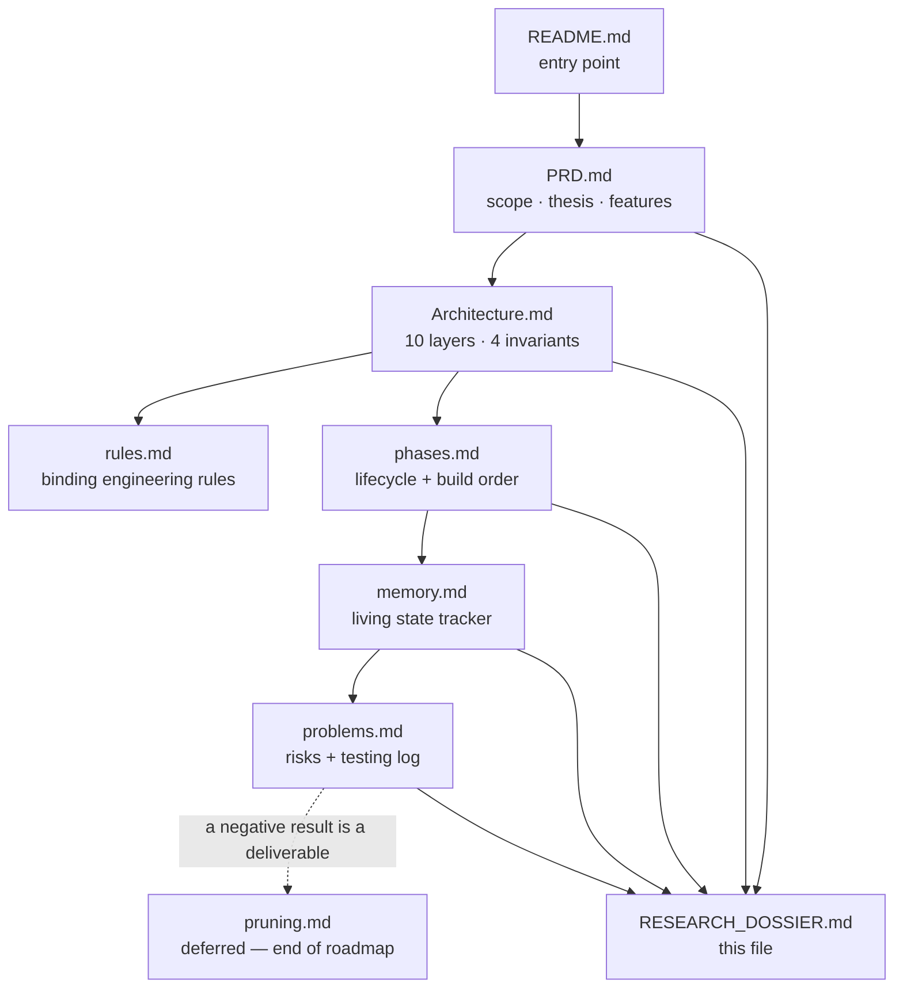

---

## 20. Glossary

| Term | Plain meaning |
| --- | --- |
| **Apoptosis** | Programmed cleanup — temporary graph nodes delete themselves after 14 days of no activity |
| **BitNet b1.58** | A model whose weights are only −1, 0, or +1 (1.58 bits each), so matrix multiplication becomes addition — which is why it runs on a CPU |
| **Bridge value** | How many different topic areas a node connects; a file used in both engineering and research scores higher |
| **Corroboration** | Requiring signals from more than one independent layer before the system is allowed to act |
| **DMN (Default Mode Network)** | The part that thinks while you are away from the keyboard — replaying, tidying, and generating follow-up questions |
| **EventBus** | The shared message room; the only way any two layers communicate |
| **Extractive** | The model *picks from* what it was given (a node id, a category) rather than writing new prose |
| **GBNF grammar** | A hard schema the model's output must follow — it makes certain kinds of hallucination physically impossible to emit |
| **Grounding gate** | A check after generation that throws away any answer not tied to a real node |
| **Hebbian reinforcement** | Two things seen together get a stronger connection ("fire together, wire together") |
| **Hub** | One of the 11 permanent routing nodes (`YOU` plus 10 domains) that the system files everything under |
| **Positive control** | A synthetic run that proves the pipeline *can* fire, used when a real-world test produces nothing |
| **Pressure** | Accumulated evidence that something needs attention; halves every 60 seconds when signals stop |
| **Quarantine** | The backup directory where a file's previous contents are stored before anything writes to it |
| **`relevance_score`** | The one 0–10 number that decides what is kept, replayed, and ranked |
| **Soak** | Running the system for hours or days to catch slow leaks and rot that a fast test cannot see |
| **Structured generation** | Forcing the model to fill in a form instead of writing freely |
| **Tier** | `safe` or `dangerous` — which class of action is permitted; `dangerous` ships off |

---

## Appendix A — decision log index

Seventeen numbered rulings, each recorded so no future session re-litigates it. Full text in `memory.md`.

| # | Decision, in one line |
| --- | --- |
| **D-1** | Source files beat docs; the class diagram beats the concept HTML |
| **D-2** | Inference is BitNet b1.58 2B4T via llama.cpp, in-process — not Ollama, not 7B |
| **D-3** | Attention-head pruning deferred to phase D1; weekly retraining cut from scope |
| **D-4** | Small-model coherence is handled by schema-first constrained generation |
| **D-5** | `MultiDiGraph`; string node ids; hubs never traversed through; bounded queue with explicit drops |
| **D-6** | Singletons stay; `grammar=` added to the inference signature now, so B4 needs no signature change |
| **D-7** | `psutil` + `watchdog` become runtime deps; `ActivityCollector` deferred out of B2 |
| **D-8** | Focus/Distraction patterns cut from B3 into a new B2.5; `upsert_node` added |
| **D-9** | Wayland idle via `ext-idle-notify-v1`; B2.5 split into a (idle) and b (window) |
| **D-10** | `APP_SWITCH` reaches L3 as a synthetic snapshot on an `"activity"` pseudo-collector, so patterns are unchanged |
| **D-11** | **The extractive pivot** — L4 never generates prose; 1.39 GB accepted; `llama-cpp-python` becomes an optional extra so CI runs without a C toolchain |
| **D-12** | Dual-model routing — BitNet for the loop, Qwen2.5-3B Q4 for interactive, one lock |
| **D-13** | No `idle_cache.db` — idle thoughts are graph nodes; L6 goes extractive too |
| **D-14** | Pressure subscribes exactly two events; corroboration is a **set test**; headless confirmation is a bus handshake |
| **D-15** | The truncated diagram is permanent; `Architecture.md §11b` is authoritative by ruling |
| **D-16** | L8 holds **no** gate — it publishes `ACTION_PROPOSAL`; apoptosis selects on the **node-id prefix**, not an attribute |
| **D-17** | The ten B9 blockers ruled together — `ReadWritePaths=%t`, quarantine-and-boot-degraded, `schema_version` actually read, affirmative egress CI |

---

## Appendix B — the numbers, in one table

| Measurement | Value | Phase |
| --- | --- | --- |
| BitNet 2B4T RSS after load | 1392 MB | B0 |
| BitNet 2B4T throughput | ~17 tok/s | B0 |
| BitNet 2B4T temperature | 66–72 °C | B0 |
| Citation accuracy @ K=1 / 3 / 5 / 8 | 0.69 / 0.28 / 0.34 / 0.25 (target 0.80) | B0 |
| Grounded rate, free-text | 0.00 | B0 |
| 10k-node graph load | 294 ms (budget 2 s) | B1 |
| `find_related(depth=2)` | 0.09 ms (budget 50 ms) | B1 |
| Steady-state RSS drift, min 25→60 | 0.00 % | B1 |
| Mean CPU over 663 samples | 0.00 % (budget 1 %) | B2 |
| RSS drift, min 30→end | 2.53 % (budget 5 %) | B2 |
| L3 throughput | 43,200 snapshots in ~1 s (~20 µs each) | B3 |
| L3 heap drift over 43k snapshots | < 256 KB | B3 |
| `AppMap.classify()` glob path | ~1.1 µs/call | B2.5 |
| 20k app-switch burst | exactly 1 distraction signal | B2.5 |
| Scheduler loop stall, before → after | 320–370 ms → ~26 ms | B4-prep |
| Loop-lag probe max | ~2 ms (budget 50 ms) | B4-prep |
| Event storm drop count | exactly 49,000 of 50,000 | B4-prep |
| Graph contention | 6,000 ops in ~0.2 s (budget 2 s) | B4-prep |
| L4 loop lag under a 10 s blocking inference | ~1.6 ms, 0 drops | B4 |
| Gating storm shed rate | > 50 % of 1,000 signals | B4 |
| Real-model loop RSS | 1477 MiB flat over 1215 cycles | B4 |
| CLI round-trip, max of 100 | 0.72 ms (budget 100 ms — 166× margin) | B5 |
| Grounded-answer confidence | 0.94, exact label match | B5 |
| Concurrent RSS peak | 4.63 GB (~29 % of 16 GB) | B5 |
| Qwen throughput | ~3.1–3.5 tok/s | B5 |
| DMN cancel, mid-consolidate over 22,011 nodes | 0.1 ms | B6 |
| DMN budget timeout | 10.00 s, capped at 2 idle thoughts | B6 |
| `consolidate()` | 500 merges in 2,510 ms | B6 |
| 500 max-confidence spikes | pressure 499.8 = 167× threshold, low tier only | B7 |
| Decay at 10 half-lives | 0.0976 % measured vs 0.0977 % theoretical | B7 |
| Confirmation cases | expiry / denial / approval → refused / refused / ran | B7 |
| Positive control | 60 attempts, 60/60 pairs, 0 effects, 0 high-tier | B7 |
| Ephemeral cap under 60 concurrent spawns | 12 / 12 held, 0.5 ms | B8 |
| Apoptosis at the 14 d constant | 6 reaped / 6 spared / 0 dangling | B8 |
| Agent wall-clock budget | 1 s budget bit at 1.01 s | B8 |
| Concurrency cap | 60 crossings → 1 spawned, 59 refused | B8 |
| `link_orphan_nodes()`, before → after | 8,413 ms → 52 ms (161×) | Audit |
| `consolidate()`, before → after | 246 ms → 16 ms (15×) | Audit |
| `DMN._top_nodes()` @10k, before → after | 34 ms → 9 ms (3.7×) | Audit |
| Gate RSS, idle → DMN wake | 42.7 → 1476.1 MiB | B9 |
| Cross-phase model RSS agreement | 1477 MiB (B4) vs 1476.1 MiB (B9) | B4 / B9 |
| 7-day soak progress at writing | 5.8 % — 9 h 49 m accrued, 431 samples | B9 |
| Soak leak slope at writing | +11.0 MiB/day | B9 |
| Soak errors / dropped events | 0 / 0 | B9 |

---

*NeuroPACA — local by construction, zero cloud calls.*
*Jatin Bhanot · Chitkara University · 2026 · [github.com/bhanot-99/NeuroPACA](https://github.com/bhanot-99/NeuroPACA)*
