# NeuroPACA — Full Research Dossier

**Neuromorphic Personal Autonomous Computing Agent**

| | |
| --- | --- |
| **Author** | Jatin Bhanot · Chitkara University · 2026 |
| **Version** | v11 |
| **Dossier date** | 2026-09-11 |
| **Status** | B9 · Hardening — B0–B9 built, plus post-B9 phases B10–B18 (terminal reconceived, resource-aware sensing, web-app attribution, Wayland sensor fix ×2, canonical app identity + a structured graph view, Hebbian wire-together, one labeling system); 6 of 7 B9 exit criteria met. B18 (PR #28, `0ddc50f`) makes every generated node store *what it is about* and renders its name on demand — the live graph migrated to schema v5, 89 → 60 nodes. The 7-day soak runs on the B18 build (session 8, 1 d 2 h of 7 d accrued). v8 merges the per-phase plans and test reports into §21. V-1 (`c6ca7ea`, 2026-09-10) reworks the Hebbian rule after T7's learning was found confined to a 6-node clique — star-shaped, saturating, time-decayed (§21.8); the daemon runs it from 23:39 IST that day. V-2 (`da78779`, 2026-09-11) rebuilds `relevance_score` — a decaying activity counter (schema **v6**), learned association strength, real cross-domain bridges — so the score spans 0.69–10 instead of 2.98–9 (§21.9). V-3 (`f79f42b`) removes accumulated cruft: stale `→ YOU` placeholders released (18 → 10), the daemon's own processes purged after a config override was found disabling the exclude list, subject-less probes reaped (§21.10). All three run on the live daemon; `main` pushed to GitHub. v10 adds **V-4 … V-7** (`fix-v4-v7-graph-hygiene`, 2026-09-11, §21.11) — four graph-hygiene defects fixed as one analyse → fix → test → measure cycle: the idle-thought engine no longer circles one clique (seed reach 5 → 24), dead `domain:` hubs are reaped and rebuilt on demand (70 → 65 nodes, 0 edges lost), a new node is linked on the next scheduler tick instead of the next idle spell (23.839 → 0.008 ms, the measurement that chose the design), and a thought now records the question it actually asked (`LabelSpec.text`, schema **v7**, 0 node ids changed). The live graph is still v6 on disk and migrates on the next daemon start. v11 adds **V-8 … V-12** (§21.12): probes cite their insight, unmeasured resource fields are absent not zero (schema **v8**), a focus counts as a sighting, the Wayland pump never gives up and `doctor` flags a disabled unit (the real cause of a 2 h 39 min outage), and live notifications reach the desktop. |
| **Code size** | 15,366 lines of source · 15,668 lines of tests · 800 collected tests (776 default) · 144 commits · 17 merged PRs |
| **Runs on** | One laptop. CPU only. Single user. No GPU, no accounts, no cloud, no telemetry. |
| **License** | [AGPL-3.0-only](LICENSE) · SPDX headers on every first-party source file · per-file authorship-provenance markers (`scripts/_provenance.py`) |
| **Research goal** | A publishable paper — the benchmarks *and* the rejected alternatives are deliverables. |

> **How to read this document.** Every section opens with a plain-English paragraph ("what this is, in normal words") and then goes technical. Diagrams are Mermaid — they render on GitHub, in Obsidian, and in VS Code. Every number in this file was measured on the target machine and is traceable to a script in `scripts/` or a test in `tests/`.

---

## Table of contents

1. [What this project is](#1-what-this-project-is)
2. [Why we are building it](#2-why-we-are-building-it)
3. [The core idea — one score, several jobs](#3-the-core-idea--one-score-several-jobs)
4. [Features at a glance](#4-features-at-a-glance)
5. [Why this is valuable as high-level research](#5-why-this-is-valuable-as-high-level-research)
6. [System architecture — the ten layers](#6-system-architecture--the-ten-layers)
7. [The four invariants that hold it together](#7-the-four-invariants-that-hold-it-together)
8. [Data model — what the graph actually stores](#8-data-model--what-the-graph-actually-stores)
9. [The model stack — how a laptop runs two LLMs](#9-the-model-stack--how-a-laptop-runs-two-llms)
10. [Method — how we built it, phase by phase](#10-method--how-we-built-it-phase-by-phase)
11. [Results — every measured number](#11-results--every-measured-number)
12. [Testing methodology](#12-testing-methodology)
13. [Performance engineering — the five optimisations that mattered](#13-performance-engineering--the-five-optimisations-that-mattered)
14. [Safety and privacy engineering](#14-safety-and-privacy-engineering)
15. [Approaches we tried and rejected](#15-approaches-we-tried-and-rejected)
16. [Open problems and honest limitations](#16-open-problems-and-honest-limitations)
17. [The deferred experiment — personal model pruning](#17-the-deferred-experiment--personal-model-pruning)
18. [Research claims and publication plan](#18-research-claims-and-publication-plan)
19. [Reproducing everything](#19-reproducing-everything)
20. [Glossary](#20-glossary)
21. [The post-B9 build chronicle — B13 to V-3, step by step](#21-the-post-b9-build-chronicle--b13-to-v-3-step-by-step)

---

## 1. What this project is

**In plain words.** NeuroPACA is a small program that sits quietly on your laptop, watches boring numbers about your computer — how busy the CPU is, how full the disk is, which app you have open — and slowly builds a map of *how you actually work*. It surfaces the odd insight from that map, and — behind a hard safety gate — can act on it. It never sends anything to the internet. The terminal you drive it from is a set of predefined commands, including one (`neuropaca tell`) that explains its own codebase.

**Technically.** NeuroPACA is a Python `asyncio` daemon organised into **ten architectural layers / eight runtime modules** that communicate **only** through an async `EventBus`. It:

- polls cold OS-level telemetry every 60 seconds (`psutil`, `/proc`, `inotify` via `watchdog`, Wayland `ext-idle-notify-v1` and `zcosmic-toplevel-info-v1`) — including a per-application RAM/CPU/runtime **process census** (B13) and browser-tab **sub-identity** matched against a title allowlist (B14);
- converts raw telemetry into **named behavioural patterns** with a rule-based correlator (no inference in that path, by design) — CPU load, memory pressure, focus sessions, distraction, idle, and heavy-app starts;
- stores those patterns in a **personal knowledge graph** (`networkx.MultiDiGraph`) where every node carries one `relevance_score` in the range 0–10;
- runs a **local quantised language model** in-process via `llama.cpp` to extract insights, generate idle-time thoughts, and answer grounded questions;
- accumulates **pressure** from independent signal sources and, only when several agree, opens a **safety-gated** action path that can never execute a dangerous effect without a recorded human confirmation.

### What it is not

| Not this | Why |
| --- | --- |
| A cloud assistant | Zero egress. CI **affirmatively proves** it — the egress test runs in a network namespace with only loopback and asserts that HTTP and raw TCP both raise. |
| A general chatbot | Its focus is *your machine and your work*. The terminal is command-only (B12) — no free-text question at all; `neuropaca tell` explains the codebase deterministically from its own docstrings. |
| A screen recorder or keylogger | It reads aggregate system counters and application identifiers. Window-title text is read transiently for a focus event, reduced **inside the collector** to a matched allowlist label (`"gmail"`) or discarded, and **never persisted or put on the bus** (B14). Process command lines are never read — the census groups by process *name* only, AST-checked. |
| A multi-user / fleet product | Single user, single machine, single graph. That is a stated scope boundary, and also a stated research limitation (§16). |
| A GPU project | CPU-only inference is the *premise*, not a compromise. |

### The system in one picture

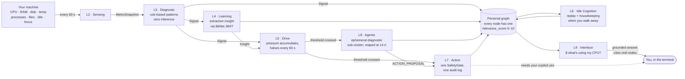

---

## 2. Why we are building it

### 2.1 The problem, stated plainly

Most software makes **you** adapt to **it**. You learn where the settings are, you learn which process is safe to kill, you learn that the fan noise at 3 pm means the bundler is stuck again. None of that knowledge is written down anywhere, and none of it transfers.

The obvious fix — "log everything and let an LLM read the logs" — fails for four separate reasons:

| Flat log storage | A behavioural graph |
| --- | --- |
| Grows forever | Raw data trains, then is purged |
| No relationships between events | Relationships are first-class edges |
| A standing privacy liability | Only *extracted* knowledge persists |
| Gets slower as it grows | Bounded by routing + score decay + pruning |
| Same generic answer for everyone | Queries traverse *your* meaning |

### 2.2 The three convictions behind the design

1. **Privacy is the product, not a feature.** A system that watches how you work is only acceptable if it is *structurally* incapable of leaking. That is an architectural claim, so it is tested architecturally (§14).
2. **Behaviour is a better index than text.** Traditional retrieval ranks by semantic similarity. NeuroPACA ranks by *how much you actually use a thing* — a signal that a search engine has no access to and that costs nothing to compute.
3. **Autonomy needs a gradient, not a switch.** Software that acts on your machine should not have a boolean "allowed / not allowed". It should accumulate evidence, and only cross a line when several *independent* observers agree. That is claim **C** in §18, and it is the cheapest result in the whole project to prove.

### 2.3 The biological metaphor — used carefully

The "neuromorphic" name is earned by four concrete mechanisms, not by vibes:

| Brain concept | NeuroPACA mechanism | Where |
| --- | --- | --- |
| **Hebbian learning** ("fire together, wire together") | An `app:`/`webapp:` edge is *created* on co-activation (T7). Since V-1 each focus switch wires the new focus to each recently active app only (star, not clique), credit falls with the time gap, the weight steps `w += rate·(1 − w)` so it stays in [0, 1), and an unused weight halves every 72 h of uptime | `GraphMemory.wire_coactivation` / `wire_cooccurrence` / `decay_cooccurrence_edges`; driven from `SignalCorrelator.on_app_switch` |
| **Default Mode Network** (the brain's idle-time replay) | When CPU < 5 %, the DMN replays top-K nodes, consolidates duplicates, re-links orphans, generates "idle thoughts" | `idle/dmn.py` |
| **Apoptosis** (programmed cell death) | Ephemeral diagnostic nodes are reaped after 14 days of no activity | `agents/supervisor.py` |
| **Structural plasticity** | The graph spawns and kills sub-clusters at runtime; the architecture reshapes itself around active work | `spawn_node()` / `kill_node()` |

> **A deliberate honesty note.** We do *not* claim this is how a brain works. These are engineering analogies that gave us useful bounded mechanisms. Where the analogy would have overclaimed — see the Lottery Ticket framing in §15 — we cut it.

---

## 3. The core idea — one score, several jobs

**In plain words.** Everything the system remembers gets a single number from 0 to 10 that means "how much does this matter to this person right now". That one number then decides three completely different things: what to throw away, what to think about while you're away, and what to mention when you ask a question. Reusing one number for three jobs is the central bet of the project.

### 3.1 The formula

Since **V-2** (2026-09-11, §21.9):

```
relevance_score = 6 × activity     # how much, and how recently, you use it
                + 2 × strength     # how strongly it is tied to other things you use
                + 2 × bridge       # does it link different areas of your work
# each term is 0–1, so the score is 0–10
```

- `activity` — a **decaying access counter** (`Node.activity`, schema v6): every touch first ages the counter by a 7-day half-life, then adds 1; creation counts as one sighting. Scored as `log1p(activity) / log1p(the graph's largest)`, so the busiest node reaches 1 and a once-seen node sits near the bottom. This one term replaces the old separate *frequency* and *recency* terms (the idea browsers call "frecency").
- `strength` — the sum of learned Hebbian weights on the node's association edges (V-1), plus 0.1 per other structural edge; log-normalised against the graph's largest. Edges to a hub count nothing (`YOU` is only an orphan placeholder; domains belong to `bridge`), and neither do a generated node's provenance edges — the system's own notes neither earn nor lend relevance by existing.
- `bridge` — the distinct `domain:*` hubs the node reaches directly **or through an association of weight ≥ 0.1**: one domain 0, two 0.5, three or more 1. An app used alongside tools from engineering, research and habits bridges them even though its own `PART_OF` edge names one domain.

Weights are `6 / 2 / 2` — usage dominant, structure secondary, the same 60/40 balance the original formula intended. Still a design choice, not a fitted parameter, and still one of the ablations §18 calls for.

> **The original formula (B1–V-1), kept for the record:** `3·min(1, access_count/100) + 3·0.5^(age_days/7) + 2·log1p(degree)/log1p(20) + 2·min(1, domains/2)`. On the live graph it gave every node ~3 points for merely having been touched this week, maxed frequency out for only the two busiest apps, counted a probe's bookkeeping edge like a real one, and let `bridge` mean "is listed in `app_map`" — 70 nodes squeezed into 2.98–9.0. §21.9 has the full diagnosis.

### 3.2 The four jobs

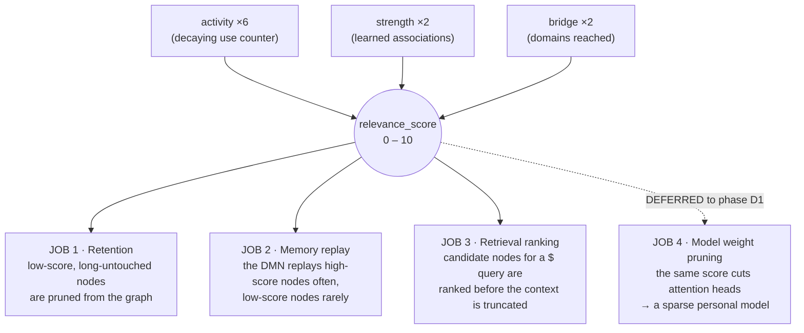

| Job | What it decides | Status |
| --- | --- | --- |
| **1 · Retention** | `prune_low_score()` — what the graph forgets | ✅ built (B1, B6) |
| **2 · Replay** | Which nodes the Default Mode Network thinks about during idle time | ✅ built (B6) |
| **3 · Ranking** | Which nodes get into the LLM prompt before the character budget truncates | ✅ built (B5) |
| **4 · Weight pruning** | Which attention heads of the local model get cut | ⏸ **deferred** to phase D1 — see §17 |

**Why job 4 is deferred and not deleted.** It was originally the *point* of the project — the fix for "the model is too big for a laptop". BitNet b1.58 2B4T then turned out to fit a laptop anyway (~1.4 GB measured). That made pruning an optimisation rather than a requirement, and it is by far the riskiest piece, so it moved to the end of the roadmap where a negative result costs nothing structural. Full design in `pruning.md`; summary in §17.

---

## 4. Features at a glance

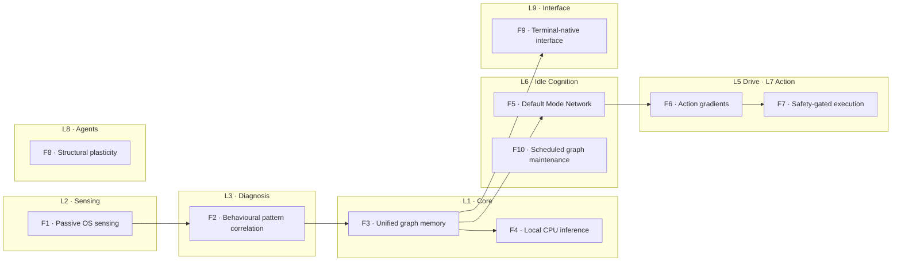

| # | Feature | What it does, plainly | Key technical detail |
| --- | --- | --- | --- |
| **F1** | Passive OS sensing | Reads system numbers every 60 s | `psutil` + `watchdog` + Wayland protocols; **no inference in this layer**; publishes `MetricSnapshot` to the bus. B13 adds `ProcessCollector` — a per-app RAM/CPU/runtime census grouped by process name (≥ 200 MB), names only. B14: the focused browser tab is matched against a title allowlist inside the collector — only the label crosses, never the raw title. `RawMetricsRecorder` optionally mirrors every reading to a CSV (off by default, off in tests) |
| **F2** | Pattern correlation | Turns raw numbers into named situations | Rule-based `SignalCorrelator` over bounded deques; the LLM is never consulted here. Six patterns: `HighLoadPattern` (CPU), `MemoryPressurePattern` (RAM, B13), `FocusSessionPattern`, `DistractionPattern`, `IdlePattern`, `HeavyAppStartedPattern` (B13) |
| **F3** | Unified graph memory | Remembers things and how they relate | `networkx.MultiDiGraph`, 11 routing hubs, Hebbian edge strengthening, atomic saves |
| **F4** | Local CPU inference | Runs an LLM without a GPU or an account | Two lazily-loaded GGUF models behind **one** system-wide `_inference_lock` |
| **F5** | Default Mode Network | Thinks while you're away | Triggered on real idle events; cancelled within one tick when you return; wall-clock and inference budgets |
| **F6** | Action gradients | Builds up evidence before acting | Pressure accumulator, exponential decay half-life 60 s, low/high thresholds, hysteresis latch |
| **F7** | Safety-gated execution | Cannot damage your machine | One `SafetyGate`, sandbox with `env={}`, backup-to-quarantine, JSONL audit, terminal confirmation |
| **F8** | Structural plasticity | Grows temporary diagnostic structure, then cleans up | Bounded agent tasks, ephemeral node cap, apoptosis at 14 days |
| **F9** | Terminal-native interface | The only human surface | Unix socket + JSONL, thin CLI, a **read-only command set** (B12): `tell` / `overview` / `health` / `run` / … |
| **F10** | Scheduled maintenance | Keeps the graph healthy | Consolidate duplicates, re-link orphans, recompute scores, purge raw buffers |

### 4.1 The terminal — a read-only project guide (B12)

The `neuropaca` terminal is command-only. Two kinds of command:

| Command | What it does |
| --- | --- |
| `neuropaca tell <path>` | what a file or folder does — its module docstring + top-level classes/functions + which layer, read straight from source (`interface/describe.py`, `ast` only). Deterministic, offline. |
| `neuropaca tell <path> --explain` | the above, then the interactive model paraphrases that summary in plain words — flagged, shown *after* the facts |
| `neuropaca overview` | what NeuroPACA is, what it watches, the L1-L10 layer map |
| `health` · `insights` · `notifications` | daemon + module state |
| `confirmations` · `confirm <id> [--deny]` | the L7 dangerous-action handshake |
| `run "<cmd>"` · `run --backup "<cmd>"` | hand a command to L7 (`$!` / `$$` are the internal wire enum); a dangerous action still needs `confirm` |
| `doctor` · `export` · `panic` | offline verbs (B9) |

```bash
neuropacad                                       # the daemon
neuropaca overview                               # what it is + the layer map
neuropaca tell src/neuropaca/drive/pressure.py   # what a file does
neuropaca tell drive/pressure.py --explain       # + a plain-words paraphrase
neuropaca health                                 # daemon + per-module health
neuropaca run "pkill -f webpack"                  # → L7, requires confirmation
neuropaca confirmations                          # what is waiting on you
neuropaca doctor                                 # offline diagnostic, no daemon needed
```

#### Rejected alternative — free-text terminal Q&A (`$` / `$?` / `chat`, B5/B11), withdrawn B12

The original interface fronted the behavioural graph and the repo docs with a
natural-language question:

- **`$` / `$?` (`ask` / `diagnose`)** — retrieval over the graph
  (`search_by_label` → `find_related` → rank), then the interactive model wrote
  one sentence behind a GBNF grammar and a hard `parse_answer` grounding gate.
- **`chat` (B11)** — retrieval over the repo's Markdown (`KnowledgeIndex`, a
  stopword-filtered lexical match), then the model free-decoded a paragraph;
  grounding was **advisory** — an unmatched answer was flagged `⚠ general
  knowledge`, not withheld.

Both were pulled in B12. The reasons, recorded because the rejection is a
deliverable:

- **A 3B-Q4 model paraphrasing a retrieved doc chunk is not reproducible** and
  was sometimes wrong in ways a reader could not detect — unacceptable for a tool
  whose stated job is to be the *first* guide to the codebase.
- **`chat` grounding was a label, not a gate.** On a 30-question battery it
  reached 30/30 project recall but only ~70% off-topic rejection; the leaks
  retrieved a tangential chunk and cost only the missing flag. Good enough for a
  convenience, not for an authority.
- **`$` / `$?` answered about *your behaviour*, not *the project*** — a different
  need from "explain this file", and one the user no longer wanted on the
  terminal surface.
- **Deterministic docstring + `ast` extraction is 100% reproducible and always
  correct** by construction. `--explain` keeps an *optional* model paraphrase,
  clearly subordinate to the facts.

The behavioural graph, `GraphMemory.search_by_label` / `find_related`, and the
`KnowledgeIndex`-style lexical approach are all unchanged — only the terminal
verb that fronted them with a model is gone. The `$!` / `$$` action relay
survives as `neuropaca run` (`$!` / `$$` are now an internal L9→L7 wire enum).

---

## 5. Why this is valuable as high-level research

**In plain words.** Lots of people are building AI assistants. Almost nobody is building one that (a) gets its data from the operating system rather than from what you type at it, (b) runs entirely on a laptop CPU, and (c) writes down honestly what didn't work. Those three things together are the contribution.

### 5.1 The five contributions

| # | Contribution | Why it is not already done |
| --- | --- | --- |
| **1** | **A behavioural data layer, not another agent runtime** | Existing agent frameworks (Hermes, OpenClaw, LangGraph) start from *text the user typed*. NeuroPACA starts from *OS-level telemetry the user never typed*. It is a substrate those frameworks could consume. |
| **2** | **A single usage score reused for retention, replay, and ranking** | Retrieval systems rank by semantic similarity; caches evict by LRU; nobody has unified all three under one behaviourally-derived score and measured whether that unification costs anything. |
| **3** | **Corroboration-gated autonomy, measured** | "Require multiple signals before acting" is folklore. We turn it into a structural set test and show it is *impossible* — not merely unlikely — for one source to cross the high threshold, with 500 max-confidence spikes producing 167× the threshold and still firing only the low tier. |
| **4** | **A CPU-only, zero-egress agent that is proven zero-egress** | Privacy claims are usually documentation. Here they are a CI job in a network namespace that fails the build if an outbound connection succeeds. |
| **5** | **A published record of failure** | The Ollama dead-end, the coherence collapse at 2B, three soaks that measured nothing, a leak-slope statistic that lied, a Wayland sensor that was silently deaf and misdiagnosed **five** times, a `chat` feature built over two phases then withdrawn, one real app landing as 2–3 graph nodes because two sensors named it differently, and a Hebbian rule whose "wire together" half was never built so every edge weight sat at zero for the life of the project until T7 (2026-09-10) — a green integration test that pre-wired its own fixture hid it — and then, the same day, a T7 rule that learned only inside a 6-node clique because it wired every recent pair on every switch and decayed per CPU-idle spell instead of per unit of time (V-1); a relevance score whose three structural terms were near-constant across real nodes, so it could only separate the two busiest apps from everything else (V-2); and an exclusion list that worked in code and in its tests but was switched off in production by a stale `= []` in every shipped config (V-3). Negative results with numbers attached are rare and reusable. |

### 5.2 What makes the results credible

- **Every claim maps to an artefact.** Each build phase has written exit criteria, and each criterion names the test or script that proves it. No criterion is signed off by inspection.
- **Positive controls where soaks failed.** When 24-hour dogfooding soaks produced empty logs three times, we did not lower the bar — we built a positive control that drives synthetic episodes at *byte-identical* thresholds and proves the pipeline fires (`scripts/b7_positive_control.py`, `neuropaca.control.toml`).
- **Cross-phase agreement.** B4's soak recorded resident memory of **1477 MiB** for the loop model; B9's gate, a whole phase later on a different code path, measured **1476.1 MiB**. Two independent measurements agreeing to within a megabyte is a real signal that the number is the model, not the harness.
- **Bugs in the measurement tooling are logged as bugs.** `rss_trend()` reporting `+5600.7 MiB/day` from a one-time warm-up step is recorded as open problem **T6**, not quietly fixed and forgotten.

---

## 6. System architecture — the ten layers

**In plain words.** The program is split into ten parts. No part is allowed to call another part directly — they can only shout messages into a shared room, and whoever cares listens. That sounds slower, but it is the reason any one part can crash without taking the rest down, and the reason each part can be tested alone.

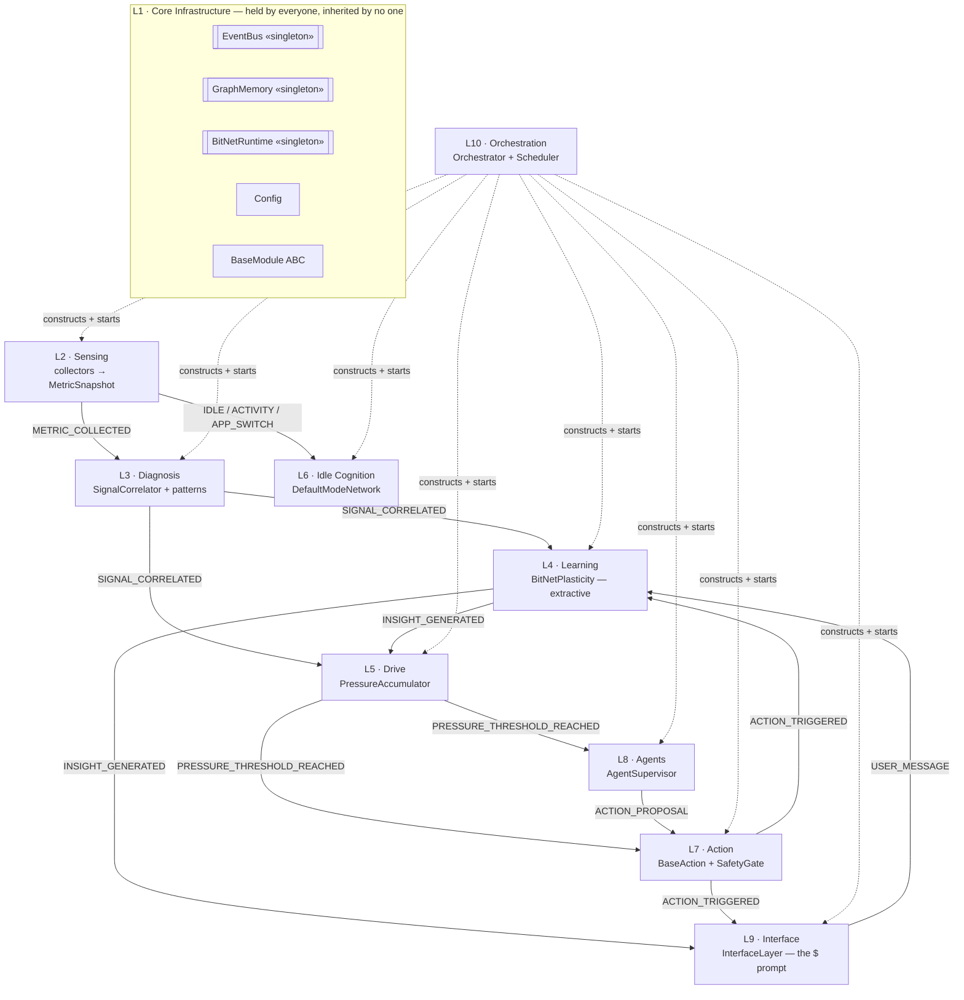

| Layer | Name | Primary classes | Source |
| --- | --- | --- | --- |
| **L1** | Core Infrastructure | `EventBus`, `GraphMemory`, `BitNetRuntime`, `Config`, `Node`/`Edge`, enums, `BaseModule`, `Clock` | `core/` |
| **L2** | Sensing | `BaseCollector`, `SystemMetricCollector`, `FileSystemCollector`, `ProcessCollector` (B13), `ActivityCollector` (`WaylandConnection` — one shared `pywayland.Display`, B15), `derive_webapp` (B14), `RawMetricsRecorder`, `MetricSnapshot` | `sensing/` |
| **L3** | Diagnosis | `SignalCorrelator`, `BasePattern`, `HighLoadPattern`, `MemoryPressurePattern` (B13), `IdlePattern`, `FocusSessionPattern`, `DistractionPattern`, `HeavyAppStartedPattern` (B13), `AppMap`, `WebAppMap` (B14) | `diagnosis/` |
| **L4** | Learning | `BitNetPlasticity`, `Insight`, GBNF prompts | `learning/` |
| **L5** | Drive | `PressureAccumulator`, `PressureEntry` | `drive/` |
| **L6** | Idle Cognition | `DefaultModeNetwork` | `idle/` |
| **L7** | Action | `BaseAction`, `SafetyGate`, `Sandbox`, `Quarantine`, `ActionAudit`, `ConfirmationBroker`, `ActionExecutor` | `action/` |
| **L8** | Agents | `AgentSupervisor`, agent payloads | `agents/` |
| **L9** | Interface | `InterfaceLayer`, `Message`, CLI, offline verbs | `interface/` |
| **L10** | Orchestration | `NeuroPACAOrchestrator`, `Scheduler`, `build_modules` | `orchestration/` |

### 6.1 How one observation travels the whole system

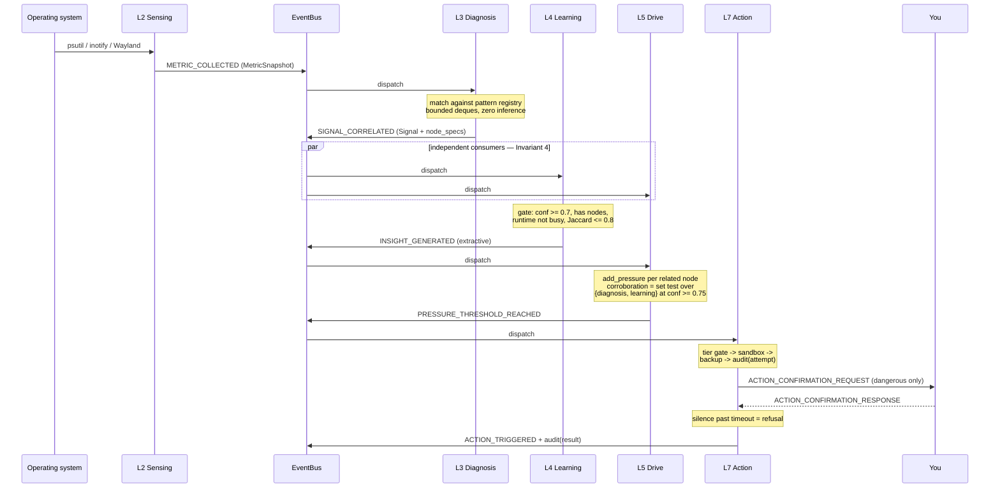

### 6.2 The routing hub design

**In plain words.** Instead of comparing new information against everything the system already knows (which gets slower and slower), it first decides "which of eleven boxes does this belong in", then only compares within that box.

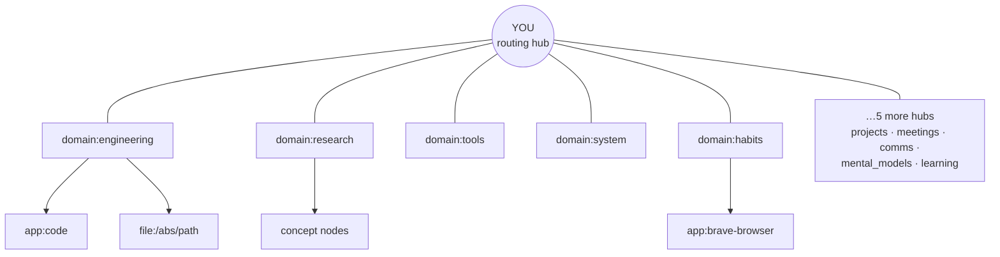

- **11 protected nodes**: `YOU` plus 10 `domain:*` hubs. They are hard-coded as a protected set — `prune()` and `prune_low_score()` skip them, always.
- **`find_related()` never traverses *through* a hub** (`traverse_hubs=False` by default). Without that rule, every node would be two hops from every other node and the sub-50 ms traversal target would be impossible.
- The routing layer collapses what would otherwise be an O(n) comparison against the whole graph.

---

## 7. The four invariants that hold it together

**In plain words.** Four rules that, if broken, cause bugs that are almost impossible to find later — silent deadlocks, frozen interfaces, tests that pass alone and fail together. They are written down so that violating one counts as a defect, not a style disagreement.

| # | Invariant | The trap it prevents |
| --- | --- | --- |
| **1** | **Services are held, not inherited.** `EventBus`, `GraphMemory`, `BitNetRuntime` are singletons; modules hold *references* and never subclass them. | Hidden god-objects; broken test isolation |
| **2** | **`GraphMemory` uses `asyncio.Lock`, never `threading.Lock`.** | Mixing the two silently deadlocks |
| **3** | **`BitNetRuntime.infer()` is blocking** — always wrapped in `run_in_executor()` via `infer_async()`. | The event loop freezes for whole seconds |
| **4** | **`SignalCorrelator` produces; `PressureAccumulator` and `BitNetPlasticity` consume — independently.** They never call each other. | Direct coupling; ordering bugs |

**The derived principle:** *no module imports another module*. Intelligence is emergent — no single component decides anything; behaviour arises from which modules happen to fire together.

This principle was tested hardest in **B8**, where the obvious design would have given the agent layer its own safety gate. It doesn't:

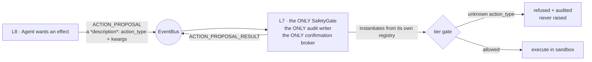

Two gates would have meant two audit writers and two confirmation brokers racing for the human's single answer. One gate, one log, one prompt.

---

## 8. Data model — what the graph actually stores

### 8.1 Node and edge shape

- **Graph type:** `networkx.MultiDiGraph` — parallel edges are required, because the same pair of nodes can be connected by *different* `RelationType`s simultaneously.
- **Identifiers:** every node id and node-reference field is a `str`. Only `Event.id` is a `UUID`.
- **Schema version 6** (since V-2). `_SCHEMA_VERSION = 6`, `_MIN_READABLE_SCHEMA_VERSION = 1`. v6 (V-2) added `Node.activity`, the decaying access counter behind `relevance_score`; a v5 file loads with `activity = access_count + 1` and is written back as v6 (a one-way door for older builds — back up first). v5 (B18) added `Node.spec`, the structured `LabelSpec` a generated node is about. v3 (B13) added `ram_mb` / `cpu_percent` / `first_seen_at` / `last_seen_at` to `Node` — populated from the process census, **not** fed into `relevance_score` (importance is behavioural salience, not memory footprint); `first_seen_at` is write-once. v4 (B14) added `NodeType.WEBAPP` and is forward-incompatible with a v3 reader. A newer-than-supported file is refused with a message (B9 criterion 6).
- **Node id conventions carry meaning:**

| Prefix | Meaning | Lifetime |
| --- | --- | --- |
| `YOU`, `domain:*` | The 11 routing hubs | Permanent, protected from all pruning |
| `app:<id>` | An application you use | Score-decayed |
| `webapp:<label>` | A browser tab identified against the title allowlist (B14) — `PART_OF` its browser and its own domain | Score-decayed |
| `file:<abs path>` | A file in a watched path | Score-decayed |
| `insight:<uuid>` | An L4 extractive insight | 48 h TTL |
| `idle:<uuid12>` | An L6 idle thought | 48 h TTL |
| `ephemeral:<facet>:<uuid>` | An L8 diagnostic sub-cluster node | 14 d apoptosis, or as soon as every node it is about is gone (V-3b) |

> **A hard-won design constraint.** `GraphMemory` builds its networkx node data from the **fixed** `Node` field set, and serialisation round-trips only those same fields. An ad-hoc attribute is silently discarded at creation *and again on every save*. This is why apoptosis selects on the **node-id prefix**, not on an `is_ephemeral` attribute — with an attribute, one daemon restart would make every ephemeral node look permanent, the sweep would reap nothing, and the graph would grow without bound, silently. (Decision D-16(d-bis).)

### 8.2 The event catalogue

The bus is the entire API surface between layers. Key event types:

| Event | Publisher | Consumers |
| --- | --- | --- |
| `METRIC_COLLECTED` | L2 | L3 |
| `IDLE_DETECTED` / `ACTIVITY_DETECTED` | L2 activity | L6 |
| `APP_SWITCH` | L2 activity | L3 |
| `SIGNAL_CORRELATED` | L3 | L4 **and** L5, independently |
| `INSIGHT_GENERATED` | L4, L6 | L5 (filtered to `source == "learning"`), L9 |
| `PRESSURE_THRESHOLD_REACHED` | L5 | L7 **and** L8 |
| `ACTION_PROPOSAL` / `ACTION_PROPOSAL_RESULT` | L8 / L7 | L7 / L8 |
| `ACTION_CONFIRMATION_REQUEST` / `_RESPONSE` | L7 / L9 | L9 / L7 |
| `ACTION_TRIGGERED` | L7 | L9, L4 |
| `SYSTEM_HEALTH_REQUEST` / `_REPORT` | L9 / L10 | L10 / L9 |
| `AGENT_SPAWNED` / `AGENT_COMPLETED` | L8 | *(deliberately unsubscribed — observability contract for the validators)* |

**Backpressure is explicit:** `EventBus.event_queue` is an `asyncio.Queue(maxsize=1000)`. `publish()` is `put_nowait` + `except QueueFull` → drop, increment `_dropped_count`, log at ERROR. A publisher **never blocks**. This is provable behaviour, not hopeful behaviour — see the event-storm test in §12.

### 8.3 The pattern registry

| Pattern | Fires when | Attaches graph nodes? |
| --- | --- | --- |
| `HighLoadPattern` | CPU > 90 % sustained (5 samples) | ✅ from filesystem activity |
| `MemoryPressurePattern` (B13) | `mem_percent` z-score high **or** `mem_available_mb` below a floor, sustained ~180 s → emits `HIGH_LOAD` | ✅ the heavy census apps |
| `IdlePattern` | No input past the idle threshold | ✅ (B13) the last-focused `app:<id>` — *was* `❌` |
| `FocusSessionPattern` | A `domain:engineering`/`research` app (or a focused browser tab whose web-app domain is one of those, B14) held ≥ 20 min without switching, mean CPU above idle; +0.15 confidence when the census shows it as the largest non-browser RSS group (B13) | ✅ |
| `DistractionPattern` | More than 5 app/tab switches in a trailing 2 min window (re-arm ≤ 2) | ✅ (B13) the distinct thrashed `app:<id>` / `webapp:<label>` nodes — *was* `❌` |
| `HeavyAppStartedPattern` (B13) | An app group first appears in the census → `SignalType.WORKING_SET_CHANGE` (edge-triggered) | ✅ |

> **This table is also a finding — and B13 is the fix.** `PressureAccumulator.add_pressure` loops over `related_node_ids`; an empty list is a no-op. In B0–B12 only `HighLoadPattern` and `FocusSessionPattern` attached nodes, so `IdlePattern` and `DistractionPattern` fired into a void — a structural reason three 24-hour soaks produced empty logs (§11.7, §15.5). B13 (D-19) made Idle and Distraction attach real nodes, added a memory-based primary signal (CPU is bursty and mostly ~0; RAM footprint is the stable indicator of what is being worked with), and added the census so `FocusSessionPattern` can tell a genuine 20-minute session from an idle window. The unattended soak is still not *expected* to produce insights — an idle box has nothing behaviourally rich left once the daemon's own work is excluded — but the loop now works under real interactive dogfooding.

---

## 9. The model stack — how a laptop runs two LLMs

**In plain words.** There are two AI models. A small always-on one does the background thinking. A bigger one wakes up only for `neuropaca tell … --explain`, and goes back to sleep. They are never allowed to run at the same time — that would fight over the CPU — but they can both be in memory at once, and we measured exactly how much memory that costs.

### 9.1 The two models

| Model | Role | Quantisation | Resident RAM | Throughput | Measured in |
| --- | --- | --- | --- | --- | --- |
| **BitNet b1.58 2B4T** | Always-on loop — L4 extractive insight, L6 idle thoughts | GGUF `tq2_0` | **1.37 GB** after load → **1.55 GB** after 30 min | **~17 tok/s** | B0 spike, 2026-08-30 |
| **Qwen2.5-3B-Instruct** | Interactive only — the L9 `tell --explain` paraphrase (B12) | GGUF `Q4_K_M` | **~3.25 GB** (`n_ctx=2048`, `n_batch=128`) | **~3.1–3.5 tok/s** | B5 validation, 2026-09-01 |

**BitNet b1.58** stores weights in {−1, 0, +1} — 1.58 bits per parameter. Matrix multiplication becomes addition and subtraction; there is no floating-point work at inference. That is what makes ~0.4 GB of weights and CPU-native execution possible. For comparison, a conventional 2B model in float32 is roughly **8 GB**.

### 9.2 The measured memory ladder

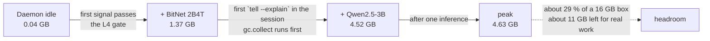

- Both models are **lazily loaded** and **independently self-disabling**. An idle session pays neither cost.
- A single `_inference_lock` serialises **every** call system-wide. The two models never *run* at once — they only *reside* at once.
- Package temperature under sustained load: **66–72 °C**, no thermal throttling observed.
- If `interactive_model_path` is unset, `tell --explain` shows only the deterministic block (B12) and only the 1.37 GB BitNet footprint applies.
- Documented fallback if 4.63 GB ever becomes a problem: a 1.5B interactive model.

### 9.3 The critical constraint — structured generation

**In plain words.** Small models make things up. Instead of asking politely for good output, we force the model to fill in a rigid form, and then check the answer against reality before believing it.

Every `BitNetRuntime` call runs against a task-specific **GBNF grammar**:

- `cited_nodes` is **locked to the node IDs present in the prompt** — the model literally cannot cite a node that does not exist.
- There is always an explicit `abstain` path.
- Input is distilled to **≤ 5 nodes**, temperature ≈ 0.
- A **hard post-generation validation gate** rejects any output that does not ground in a real node label.

L4's grammar, for instance, is:

```
{ "cited_node_id": <alias|null>, "insight_category": routine|anomaly|distraction }
```

The human-readable `summary` is then rendered from a **Python template**, never from model free text. This is the "extractive pivot" (Decision D-11), and §15.2 explains the measured failure that forced it.

---

## 10. Method — how we built it, phase by phase

**In plain words.** We built the core in ten numbered steps (B0–B9), then added five more (B10–B15) as dogfooding exposed real gaps. Each step had written pass/fail conditions decided *before* the code was written, and a step was only declared done when a named test or script proved each condition. Where a condition could not be proven, that is recorded as unproven rather than assumed.

```mermaid
flowchart LR
    B0["B0 ✅<br/>de-risking spike"] --> B1["B1 ✅<br/>core L1"]
    B1 --> B2["B2 ✅<br/>sensing L2"]
    B2 --> B25["B2.5 ✅<br/>activity sensing"]
    B25 --> B3["B3 ✅<br/>diagnosis L3"]
    B3 --> B4["B4 ✅<br/>learning L4"]
    B4 --> B5["B5 ✅<br/>interface L9"]
    B5 --> B6["B6 ✅<br/>idle cognition L6"]
    B6 --> B7["B7 ✅<br/>drive + action L5/L7"]
    B7 --> B8["B8 ✅<br/>agents L8"]
    B8 --> B9["B9 🟡<br/>hardening L10"]
    B9 --> B10["B10–B12 ✅<br/>terminal reconceived<br/>as a read-only guide"]
    B10 --> B13["B13 ✅<br/>resource-aware sensing"]
    B13 --> B14["B14 ✅<br/>web-app attribution"]
    B14 --> B15["B15 ✅<br/>Wayland sensor fix"]
    B15 --> B16["B16 ✅<br/>Wayland sensor fix<br/>(round two)"]
    B16 --> B17["B17 ✅<br/>canonical app identity<br/>+ structured graph view"]
    B17 --> T7["T7 ✅<br/>Hebbian wire-together"]
    T7 --> V1["V-1 ✅<br/>Hebbian rule rework"]
    V1 --> V2["V-2 ✅<br/>relevance score rework"]
    V2 --> V3["V-3 ✅<br/>cruft removal"]
    B17 --> B18["B18 ✅<br/>one labeling system"]
    B18 -.->|re-run| B9
    B9 -.-> D1["D1 ⏸<br/>model pruning"]
```

> B10–B18 are **post-B9 work**, not a linear continuation. B9's seventh criterion (the 7-day soak) is still open; B13–B18 exist because dogfooding the graph kept exposing gaps — inert Idle/Distraction patterns, CPU being the wrong primary signal, the Wayland focus sensor going deaf (twice), one real app landing as two or three `app:` nodes because two sensors name it differently, and generated labels that froze, duplicated and copied each other. Each fix has its own phase; the full plan, root-cause analysis, test evidence and rejected alternatives for B13–B18 are in **§21, one chapter per branch**.

### 10.1 The methodology rules

| Rule | Why |
| --- | --- |
| **Risk first.** The single most likely project-killer was tested in B0, before any module code existed. | If BitNet had not fit in RAM, every layer above L2 was wrong. Better to know in week one. |
| **Exit criteria are written before the phase starts** and live in `phases.md`. | Prevents the criterion from being quietly redefined to match whatever got built. |
| **Every criterion names its proof.** A test function or a script, not a paragraph. | "Reviewed and looks fine" is not evidence. |
| **Tests ship in the same change as the code.** | No "tests later" backlog. |
| **`memory.md` records what is *true*, not what was intended;** the completed log is append-only. | A project log that gets rewritten cannot be used as evidence. |
| **Blockers are ruled explicitly and numbered (D-1 … D-17).** | A future session — human or AI — should never re-litigate a settled decision. |
| **The source blueprint wins over the docs; the diagram wins over the prose.** (D-1) | Single source of truth under disagreement. |

### 10.2 Phase-by-phase summary

| Phase | What was built | Headline result |
| --- | --- | --- |
| **B0** | De-risking spike: does BitNet b1.58 2B4T fit and stay coherent? | RAM ✅ 1.39 GB · **coherence ❌ at every K** → forced the extractive pivot |
| **B1** | L1 core — `EventBus`, `GraphMemory`, `BitNetRuntime`, `Config`, `BaseModule`, `Clock`, minimal L10 | 10k-node load **294 ms**; `find_related` **0.09 ms** |
| **B2** | L2 sensing — `SystemMetricCollector`, `FileSystemCollector`, bounded ring buffer, collector isolation | Mean CPU **0.00 %** over 663 samples; buffer provably bounded |
| **B2.5** | Activity sensing on Wayland — idle via `ext-idle-notify-v1`, active window via `zcosmic-toplevel-info-v1`, `AppMap`, focus/distraction patterns, live `bridge_value` | 20k app-switch burst → exactly **1** distraction signal |
| **B3** | L3 diagnosis — `SignalCorrelator`, `HighLoadPattern`, `IdlePattern`, `upsert_node` | 43,200 snapshots (one month) in **~1 s**, ~20 µs each |
| **B4** | L4 learning — `BitNetPlasticity`, GBNF extractive pipeline, lazy model load, gating, Hebbian reinforcement | RSS **1477 MiB dead flat** over 1215 cycles |
| **B5** | L9 interface — Unix socket IPC, thin CLI, dual-model routing, health bridge, insight surfacing | CLI **0.72 ms** max vs a 100 ms budget (**166× margin**) |
| **B6** | L6 idle cognition — the Default Mode Network, consolidate / link-orphans / prune-stale, extractive idle thoughts | Cancel a mid-consolidate cycle in **0.1 ms**, zero corruption |
| **B7** | L5 drive + L7 action — pressure accumulator, safety gate, sandbox, quarantine, audit, confirmation broker | 500 max-confidence spikes → **167×** the high threshold, still only the low tier fires |
| **B8** | L8 agents — supervisor, ephemeral sub-clusters, apoptosis, `ACTION_PROPOSAL` decoupling | Cap of 12 held under **60 simultaneous** spawns |
| **B9** | L10 hardening — systemd unit, crash recovery, schema versioning, logrotate, offline verbs, CI egress test, 7-day soak | **6 of 7** criteria met; soak harness rebuilt post-B15; 1-hour gate **passed 2026-09-08** (fallback path); 7-day soak void for focus twice (B15, then B16) — restart from the B16 build pending |
| **B10–B12** | Terminal reconceived — an interactive shell (B10) and a doc/graph `chat` (B11) were built, then **both withdrawn in B12** for a deterministic `ast`-based read-only project guide (`neuropaca tell` / `overview`) | A 3B-Q4 model paraphrasing a retrieved chunk is not reproducible; §4.1 records the full rejection |
| **B13** | Resource-aware sensing (D-19) — `ProcessCollector` census, `Node` schema v3, `MemoryPressurePattern`, `HeavyAppStartedPattern`, non-inert Idle/Distraction, `RawMetricsRecorder` CSV | 484 tests green (39 new); the loop now fires under real dogfooding, not just the positive control |
| **B14** | Web-app attribution — the browser stops being one opaque node; `NodeType.WEBAPP` (schema v4), title→allowlist-label inside the collector | ~35 tests new; **no per-tab/URL data leaves the collector** — a property of the design |
| **B15** | The Wayland activity sensor was **deaf, not dead** — a GC'd `zcosmic_toplevel_handle_v1` proxy on ~1 in 3 starts; two `Display` connections, the second segfaulting on teardown | Strong-ref dict + one shared `WaylandConnection` + poll-pump; **0/20 restarts deaf** (was ~1/3); this is the mechanism behind B7's three zero-L5 soaks |
| **B16** | B15's fix was **half of one** — it strong-ref'd the child cosmic proxy but not its parent `ext_foreign_toplevel_handle_v1`, and keyed the cache by the dead parent's `id()`; the sensor still deafened itself within 180 s and its liveness watchdog was doing 100 % of the work (soak: 54/65 gaps at exactly 180 s) | Strong-ref **both** proxies keyed by a monotonic int; reachable `_drop`; `finished` binding; a real "events arriving" health state (`window~`); watchdog re-scoped to fire only for a *never-delivered* subscription (the proxy fix exposed the old one as a false-positive generator). `--leak`/`--hold` probe + daemon A/B confirm; 587 tests green |
| **B17** | One real app was **2–3 `app:` nodes** — the focus sensor keys by Wayland `app_id` (`app:com.system76.CosmicFiles`), the B13 census by process name (`app:cosmic-files`), `upsert_node` de-dups by exact id; the behavioural edges on one, the RAM/CPU on the other. B13 §7 deferred the "round-2 name map". Also `app:MainThread` (a thread name `psutil` reported as a process). | `AppIdentity.resolve()` (alias table + minimal normaliser) canonicalises every `app:` id at one correlator chokepoint; `canonicalise_app_nodes()` folds a pre-B17 graph once at boot. Graph window: readable names, the 11 hubs pinned on a fixed ring, a click-to-open node detail panel. Real soak graph 63 → 57 nodes; 643 tests green |
| **T7** | Every Hebbian edge weight was `0.0` — "wire together" was never built | `wire_cooccurrence` (create-or-bump), a co-activation window on focus switches, decay in the idle sweep (§16.1) |
| **V-1** | T7's learning stayed inside a **6-node clique**: 11 of 84 edges weighted, all among 6 nodes; unmapped apps never took part, every switch re-wired all recent pairs, decay ticked per CPU-idle spell, `PART_OF` edges collected weight | Star-shaped `wire_coactivation` with time-proximity credit; saturating `w += rate·(1 − w)`; decay by uptime half-life (72 h); `PART_OF` pairs skipped and healed; unmapped focused apps join; a 30 s per-pair refractory. Simulation: 6 → 8 apps, weight range 0.03–0.26 → 0.02–0.98; storm loop lag held at `main`'s level; 719 tests (§21.8) |
| **V-2** | `relevance_score` barely discriminated: 70 nodes in 2.98–9.0 (median 3.38), a cliff after the two busiest apps, generated probes outranking real tools (8 of 29 apps). Causes: a flat ~3-point recency floor, frequency saturating at 100 accesses, plain degree counting bookkeeping edges, `bridge` meaning "is in `app_map`", a never-decaying `access_count` | `6·activity + 2·strength + 2·bridge`: a decaying access counter (`Node.activity`, schema v6), learned association strength with hub and provenance edges excluded, bridge through associations; two-pass chunked recalc with one cached adjacency walk per node. Live graph 0.69–10.0 (median 1.34); 10k recalc 83 ms (`main` 59 ms; a first cut was 388 ms); retention unchanged; 724 tests (§21.9) |
| **V-3** | Cruft: `YOU` wired to 18 nodes, 3 of them no longer orphans; the daemon's own processes (`neuropacad`, `python3`, `cosmic-comp`, …) living as apps; probes about deleted apps lingering; a "dedup every restart" report | `release_you_links()` (boot + idle sweep); the root cause of the exclude-list failure was **config** — every shipped TOML set `process_exclude_names = []` — fixed, plus a boot purge of excluded names; L8 reaps a probe once its subject is gone (14 d TTL kept by ruling); the dedup report proved to be one pre-B17 migration line. Live: 71 → 66 nodes, `YOU` 18 → 10; 740 tests (§21.10) |
| **V-4** | The idle-thought engine was an **echo chamber**: `dmn_top_k` was both the prompt size and the candidate pool, so imagination drew from the same argmax five nodes forever; all 8 stored thoughts were one facet. Once every pair in that five had been asked, `upsert_fact` deduped everything and imagination went silent *while still spending its inference budget* | Weighted sampling of `dmn_top_k` seeds from a `dmn_candidate_pool_k` pool (Efraimidis–Spirakis), a bounded refractory penalty on recent seeds, and a rotating relational + single-subject template pair per inference. Live graph: seed reach **5 → 24** with the leaders still leading; +55 µs per idle cycle; one ranked read and the same inference budget, both test-pinned (§21.11) |
| **V-5** | Five `domain:` hubs at degree 0 — dead weight in every graph view and an empty branch in `find_related`. Two different causes: `comms`/`projects`/`meetings` are mapped but their apps were never opened; `system`/`mental_models` have **no entry in either map file** | `prune_dead_hubs()` last in the idle sweep; `_add_edge_unsafe` materialises a hub again the instant something routes to it, identical to the seeded one. `YOU` never reaped. Live graph 70 → 65 nodes, **0 edges lost**, 0.08 ms; steady state 0.01 ms (§21.11) |
| **V-6** | A node minted after the last idle spell floated **unreachable until the CPU next went quiet** — `link_orphan_nodes` ran from exactly one place, the DMN sweep. Measuring it explained why: an O(N) degree walk, **23.8 ms of event-loop block at 10k nodes**, too expensive to put on a timer | A bounded FIFO ledger of never-yet-linked ids, discharged by the first edge; `link_new_orphans()` is O(pending) with no graph walk and runs on the scheduler tick before the save. **23.839 → 0.008 ms.** The whole-graph sweep stays as the backstop, plus one boot sweep for nodes orphaned on disk (§21.11) |
| **V-7** | B18's "labels are rendered, never stored" bought rename-healing but left a thought's words as a template id only — no record of what was actually asked, and nowhere for a payload the closed facet vocabulary cannot express (the briefing needs one) | `LabelSpec.text`: out of the fingerprint (**0 ids change, nothing to migrate**), out of the rendered label (rename-healing intact), and out of an existing record's rewrite (a later `value` wins, the *first* text stands). Capped at 512 chars, absent when unset. Schema **v6 → v7** (§21.11) |
| **B18** | Generated labels were frozen text: stale after renames, duplicated after restarts, drawn as lookalikes, and copied into each other | Every generated node stores a `LabelSpec` (what it is about, by id); one renderer; the node id is the fact fingerprint (schema v5); graph-backed repeat gate replaces the in-memory Jaccard buffer. Real graph 89 → 60 nodes live; 699 tests green |

---

## 11. Results — every measured number

All measurements are on the target box: **Pop!_OS / COSMIC (`cosmic-comp`), 15.75 GB RAM, CPU-only.**

### 11.1 B0 — the de-risking spike (2026-08-30)

**Question asked:** can a 2B ternary model run on this laptop, and is its output usable?

| Metric | Result | Verdict |
| --- | --- | --- |
| RSS after load | **1392 MB** | ✅ accepted |
| RSS after 30 min | **1557 MB** (drift 165 MB, bounded) | ✅ |
| Throughput | **~17 tok/s** | ✅ |
| Package temperature | **66–72 °C**, no throttle | ✅ |
| Citation accuracy @ K=1 | **0.69** (target 0.80) | ❌ |
| Citation accuracy @ K=3 | **0.28** | ❌ |
| Citation accuracy @ K=5 | **0.34** | ❌ |
| Citation accuracy @ K=8 | **0.25** | ❌ |
| Grounded rate | **0.00** | ❌ |
| Correct abstain rate | **0.00** | ❌ |

**The finding, stated plainly:** *free-text insight generation on a 2B model does not work.* Accuracy did not merely fall short — it **inverted with more context**, dropping from 0.69 at one node to 0.25 at eight. More evidence made the model *worse*.

**What we did about it (Decision D-11):** L4 never generates prose. The model's only job is to fill a constrained slot — *which* node, and *which* of three categories — and the sentence a human reads is rendered from a Python template. This is the single most consequential design change in the project, and it came from a measurement, not an opinion.

### 11.2 B1 — core infrastructure

| Criterion | Budget | Measured |
| --- | --- | --- |
| Load a 10,000-node graph | < 2 s | **294 ms** |
| `find_related(depth=2, traverse_hubs=False)` | < 50 ms | **0.09 ms** avg |
| 100 concurrent `add_node` + `update_node` | no corruption | ✅ serialised, all attrs intact |
| Atomic save survives an `os.replace` crash | must survive | ✅ |
| `prune()` never touches the 11 hubs | must hold | ✅ |
| Subscriber exception isolation | no recursion | ✅ → `SYSTEM_ERROR` event |

**60-minute RSS soak — conditional pass, and an honest one.**

```
min  0–4    noisy, 83–92 MiB                (allocator warm-up)
min  5–21   linear climb 92.1 → 115.0 MiB   (~+1.0 MiB/min)
min 21–60   DEAD FLAT at 115.00 MiB ± 0.01  (39 minutes)
```

- The script reported **FAIL** — 24.87 % peak-to-trough drift measured from minute 5.
- The script was measuring inside a one-time allocator warm-up ramp.
- **Steady-state drift (min 25 → 60) is 0.00 %.** A genuine leak does not plateau to ±0.01 MiB precision for 39 consecutive minutes.
- Attributed to pymalloc/glibc arena retention from the scheduler's per-minute `json.dumps` plus `recalculate_importance()` over 10k nodes.
- Tracked as open problem **T2** rather than closed by argument.

### 11.3 B2 — sensing

| Criterion | Budget | Measured |
| --- | --- | --- |
| Mean CPU over the soak | < 1 % | **0.00 %** — every one of 663 samples |
| RSS drift (min 30 → end) | < 5 % | **2.53 %** |
| Ring buffer bounded | must hold | ✅ `test_ring_buffer_is_bounded` |
| One collector dies, others survive | must hold | ✅ unit + live inotify-exhaustion integration test |
| Watchdog thread boundary | correct marshalling | ✅ live `Observer`, `call_soon_threadsafe` proven |
| Duration | 24 h | ⚠️ **11.05 h (46 %)** — machine slept overnight |

The 11-hour window was **accepted with the gap recorded** (open problem **T3**), not rounded up to a pass, and the missing duration was explicitly folded into the B9 7-day soak.

### 11.4 B3 / B2.5 — diagnosis and activity

| Test | Load | Result |
| --- | --- | --- |
| L3 throughput | 43,200 snapshots (one simulated month) | **~1 s total, ~20 µs/snapshot** vs a 20 s budget; window pinned at 31; `_baselines` = 1 entry; graph did not grow; heap drift **< 256 KB** |
| Activity storm | 20,000 `APP_SWITCH` events | Exactly **1** `DISTRACTION` signal; `_windows["activity"]` pinned at 901; heap flat; loop lag < 50 ms |
| `AppMap` classification | 100,000 `classify()` calls | Exact-match path **~15 ms total**; glob path **~1.1 µs/call**; realistic mix **~40 ms** |
| Bridge value at scale | 10k graph + 15k injected `domain:*` edges | `recalculate_importance()` max loop lag **< 50 ms** |
| Recorded fixtures | `trace_highload` / `trace_idle` / `trace_noise` | **1 / 1 / 0** signals — exact, deterministic replay |

### 11.5 B4 — learning

| Test | Result |
| --- | --- |
| Executor isolation | A 10-second blocking mock inference during a 10,000-event L3 storm → loop lag **~1.6 ms**, **0 drops**. Invariant 3 holds under load. |
| Gating storm | 1,000 signals → **> 50 % shed** by the confidence + `is_busy` + Jaccard mix; buffer clamps at 64; per-reason drop counters added |
| Hebbian reinforcement | `wire_cooccurrence` + a 50-citation insight → creates the peer edge the correlator never built, then **+delta on existing edges**, one lock, **~1.4 ms** (T7). A co-activation window in `on_app_switch` drives it model-free on every focus switch; the B6 idle sweep decays it. **V-1** replaced the update: star-shaped (focus ↔ each recent peer), `w += rate·(1 − w)` bounded in [0, 1), decay by a 72 h uptime half-life; 20k-switch storm max loop lag 16–24 ms (= `main`) after a hot-path fix (§21.8). |
| Real-model soak | **RSS 1477 MiB dead flat over 1215 cycles**, 1 insight generated |

### 11.6 B5 — interface

| Criterion | Budget | Measured |
| --- | --- | --- |
| CLI latency, 100 sequential `health` round-trips (fresh connection each) | < 100 ms | **min 0.48 / p50 0.54 / p95 0.62 / max 0.72 ms** — a **166× margin** |
| Grounded answer from the real model | must cite a real node | ✅ `"esbuild-service is using the most CPU right now."` · cited `["n1"]` · **confidence 0.94** · exact label substring match |
| Concurrent RSS | measure it | **0.04 → 1.37 → 4.52 → 4.63 GB** (base → BitNet → both → post-inference) |
| Qwen throughput | usable | **~3.1–3.5 tok/s** (a ~30-token answer ≈ 8 s) |
| Privacy canary | must be absent | ✅ canary absent from `graph.json` and the 21 KB log; IPC lines confirmed redacted on disk |

**A rejected optimisation, recorded:** the socket loop was *not* switched to length-prefixed `readexactly`. It would have broken JSONL framing to improve on a 166× margin. Recording the rejection is the point.

**Two validation-driven fixes:**

1. `_ANSWER_GRAMMAR_TEMPLATE`: `ws ::= [ \t\n]*` → `ws ::= " "?`. Given free whitespace, a weak model **looped on spaces and never closed the JSON**, burning its entire 96-token budget. Flexible whitespace bought nothing and cost coherence.
2. `interactive_model_context_tokens` 4096 → 2048 and interactive `n_batch` 512 → 128 — Qwen's 152k vocabulary makes the `n_batch=512` logits scratch buffer roughly 300 MB.

### 11.7 B6 — idle cognition

| Criterion | Measured |
| --- | --- |
| Returning to the keyboard cancels the cycle without corruption | **0.1 ms** to fully unwind a cycle running mid-consolidate over **12,000 duplicates / 22,011 nodes**; lock released; zero dangling edges; hubs intact; a second `consolidate()` finished the remaining **11,894** merges cleanly |
| A cycle never exceeds its budgets | `TimeoutError` at **10.00 s**; capped at **2** idle thoughts (the 3rd inference was cut); `_errors = 0`; daemon healthy |
| `consolidate()` shrinks a duplicate-heavy fixture | **500 merges in 2,510 ms** over ~10.5k nodes; `node_count` −500 exact; summed `access_count` and averaged `relevance_score` both correct; every duplicate edge rewired |

### 11.8 B7 — drive and action

| Exit criterion | Measured |
| --- | --- |
| A single signal never crosses the high threshold | **500 max-confidence L3 spikes → pressure 499.8 = 167× the high threshold, tiers fired `['low']` only.** Structural, not tuned: corroboration is a **set test** over `{diagnosis, learning}`, so one source cannot satisfy it at any magnitude. L3 + L4 together then opened it once. |
| Pressure decays below 1 % within 10 minutes | **0.0976 % of peak at ten half-lives**, against the exact theoretical 0.5¹⁰ = **0.0977 %** |
| Dangerous actions need a recorded confirmation | Full daemon over the real socket with dry-run **off** and both tiers enabled: **expiry → refused · explicit denial → refused · approval → ran.** Only the approved command executed. |
| Audit complete for every attempt | **6 lines, 3/3 attempt+result pairs.** An unwritable audit log **refuses the action**. |
| Dry-run review period with zero false positives | See §15.5 — three soaks logged nothing; met via a **positive control**: **60 attempts, 60/60 attempt+result pairs, 0 executed effects, 0 high-tier proposals** over ~4.5 h |

**Configuration under test** (`neuropaca.toml`, the shipped values):

```toml
pressure_low_threshold           = 1.0
pressure_high_threshold          = 3.0
pressure_decay_half_life_seconds = 60
pressure_decay_interval_seconds  = 10
action_dry_run                   = true
action_enabled_tiers             = ["safe"]
```

### 11.9 B8 — agents and structural plasticity

| Exit criterion | Measured |
| --- | --- |
| Ephemeral-node cap holds under a spawn storm | **60 spawns against a cap of 12 → 12 granted / 12 live in 0.5 ms**, and **60 *simultaneous* spawns → still 12**. The count-then-create pair is inside the module's own lock. |
| Apoptosis reaps past-TTL nodes and nothing else | At the **production 14-day constant**: 6 aged / 6 fresh → **6 reaped, 6 survive, edges 12 → 6, 0 dangling**, `app:webpack` untouched, node and edge counts exact. The marker survives save/reload (6/6). |
| `ACTION_PROPOSAL` routes through L7's single gate | Gate executed 1, node written, result `ok`. An unknown `action_type` **refused (`not proposable`) without reaching the gate**. 4 audit lines = attempt+result for both. |
| An agent never exceeds its wall-clock budget | A 5 s body under a **1 s** budget abandoned at **1.01 s**, outcome `'timeout'`, module health still ok, graph consistent |
| Over-cap spawns are refused, never queued | **60 crossings against a cap of 1 → 1 spawned, 59 refused**, 1 in flight, no second agent after the first released |

### 11.10 B9 — hardening (in progress)

**Six criteria met by the test suite:**

| # | Criterion | Proof |
| --- | --- | --- |
| 1 | `neuropaca doctor` produces a full report with the daemon **not running** — no socket, no daemon | 3 named tests |
| 2 | `neuropaca panic` SIGKILLs the daemon first (so nothing re-persists) then wipes `data/`; refuses without the typed word; refuses when the config will not load rather than guessing a directory | 3 named tests |
| 3 | CI **affirmatively** fails an outbound connection | `tests/integration/test_egress_blocked.py` (5 tests) inside a network namespace with loopback only + static import checks |
| 5 | An unreadable graph is quarantined and the daemon **boots anyway** on a fresh 11-hub graph, reporting itself **degraded** | 3 tests × 3 corruption shapes |
| 6 | `schema_version` is actually **read** — a newer-than-supported file is refused with a message, a v1 file still loads, a malformed record raises `GraphMemoryError` not `KeyError` | 3 named tests |
| 7 | The unit binds the L9 socket under `ProtectSystem=strict`; logrotate targets files the daemon actually writes | 2 tests + `systemd-analyze --user verify` |

**Criterion 4 — the 7-day soak — is the only one that cannot be met from a keyboard.**

**Why the 2026-09-03 gate pass and the soak run it started do not count.** The gate
"passed" on an idle edge with ~7 minutes to spare and saw ~4 app switches in the
hour; the soak that followed reached 5.8 % before it was stopped. B15
(§21.3, B15 §2a) then found the Wayland focus sensor had been **deaf** the whole
time: the `zcosmic_toplevel_handle_v1` proxy carrying "which window is focused" was
held only in a local variable and GC'd non-deterministically — measured at **~1 in 3
daemon starts fully deaf**, binary per start. This is the same mechanism behind B7's
three zero-L5 soaks. Fixed (a strong-ref dict, plus collapsing two `Display`
connections into one — the second was unreliable and segfaulted on teardown). The
soak harness was rebuilt around the fix: the gate's check 5 now requires a real
switch **rate** (≥ 20/h, or graph+signal growth for a single-window hour) with the
shared Wayland connection not thrashing, and `soak_state.py assess` grades the
completed run on sensor liveness (`window_ok` > 95 % of samples, no daemon life that
came up deaf, zero pump-errors, zero SIGSEGV markers, watchdog reconnects under
~1/accrued-day).

**The 1-hour gate — re-run and PASSED, 2026-09-08.** With the B15 fix in place the
daemon came up with `window✓` live and held it. Checks 1–4 passed immediately
(unit bound to `graphical-session.target`, `WAYLAND_DISPLAY` in `/proc/<pid>/environ`,
activity collector healthy, `neuropaca health` over the socket). Over the 60-minute
window: **15 app switches (15/h), 0 Wayland reconnects, 0 pump-errors, `window✓` at
the end**, and the graph grew by 2 nodes/edges while L3 correlated 5 signals. The
switch count did not clear the strong ≥ 20/h bar — the box was used lightly that
hour — so the gate **passed on its single-window fallback** (graph growth **and** an
L3 signal, with the Wayland connection not thrashing). `data/soak/gate-passed` is
written; `scripts/soak_7day.sh` refuses to start without it. The 7-day soak **started
2026-09-08T19:56Z** under `neuropaca-soak.service` (`systemd-inhibit
--what=sleep:idle`, accrued-runtime accounting). `data/` was wiped first — graph,
actions log, raw-metrics CSV, daemon log all cleared, only the gate proof kept — so
the run records from a clean 11-hub graph at t=0. The daemon runs under
`neuropaca.b13.toml` (full sensing: process census + web-app attribution + activity
+ memory-pressure, `action_dry_run = true`, safe tier only).

Context for the fallback: at the daemon level the fix is unambiguous — `neuropaca
health` showed `activity ✓ idle✓ window✓ · 75 switches` over ~2 h uptime, against
the old ~4-an-hour, with every subsystem at `0 errors`. The gate's per-window switch
delta was low only because interactive use was light during that specific hour, not
because the sensor was deaf.

**Then B16 — the B15 fix was half of one (found 2026-09-09, ~21 h into the soak).**
The B15 liveness watchdog, meant to be a rare safety net, was doing **all** the
work: soak session 2 (active use) logged **54 of ~65 inter-reconnect gaps at
exactly 180–181 s** — the watchdog forcing a reconnect on every window because the
connection dispatched **zero** events between them. Focus was effectively polled
every 3 minutes, and `assess` failed the run on `72 Wayland reconnects over 0.9d`.
Root cause (§15.11): B15 strong-ref'd the *child* `zcosmic_toplevel_handle_v1` but
not its parent `ext_foreign_toplevel_handle_v1`, and keyed the caches by
`id(handle)` of the (unreferenced, immediately-collected) parent — so the parent
self-destructed via `wl_proxy_destroy` and later events were dropped, and reused
`id()`s evicted live handles as new windows opened (which is why session 1 —
overnight, few new windows — decayed slowly and session 2 — active — decayed to
total silence). B16 retains **both** proxies keyed by a monotonic int for the
toplevel's life, makes `_drop` reachable, binds `finished`, and adds a real
"events arriving" health state (`window~` → `health.ok` false + a `sensor-degraded`
`SYSTEM_ERROR`) so a deaf-but-connected sensor cannot pass. Confirmed by a
standalone lifetime probe (`--leak` reproduces the total silence, `--hold` gives a
live stream) and a daemon A/B on the target box. The 2026-09-08 soak's **focus
data is void**; its RSS/stability data stands. Soak restarts from the B16 build.

**The soak harness, rebuilt for B15.** The `b9_soak_*` scripts were retired. The new
set: `soak_probe.py` (a single authoritative JSON health sample read over the L9
socket — never the journal, which on this box is volatile and empty), `soak_gate.sh`
(the five pre-flight checks above), `soak_state.py` (accrues sessions across power
cycles, `summary` / `assess`), `soak_7day.sh` (the driver + login popup), and
`soak_dashboard.py` (a browsable HTML page that puts a plain-language description and
a good/watch/bad band on every metric — the second layer behind the terse popup).

**Why "accrued runtime" and not calendar time.** A box powered off overnight ages no process. Counting those hours would let a 3.5-day soak claim a 7-day result — which is precisely how the B2 soak reached 11 h of a 24 h window. An unclean shutdown leaves a session open; the next boot heals it from the last heartbeat, labels it `unclean`, and rounds runtime **down** rather than crediting hours the machine spent switched off. `systemd-inhibit --what=sleep:idle` wraps the driver for the same reason.

**Three things that only a real machine could have caught**, none of which any test suite could:

1. `neuropaca.toml` **did not exist.** The systemd unit pointed at a file nothing had ever created. `doctor` reported `config INVALID`; the daemon could not have started at all.
2. **The unit had never been installed**, so the `graphical-session.target` binding was verified only in the reasoning. Once installed, the daemon process has `WAYLAND_DISPLAY`, the socket binds under `ProtectSystem=strict`, and `activity ✓ idle✓ window✓`. *(The `window✓` was still lying — B15 §2c: `health()` reported it for a source that had gone deaf. B15 made `window✓` mean the poll-pump is live.)*
3. `journalctl --user` returns **"No journal files were found"** — journald ships `Storage=auto` and `/var/log/journal` does not exist. The gate's collector and activity checks grepped exactly that, so they would have read zero activity from an empty journal and either refused a healthy soak or passed a week of zeros. Both checks now read `neuropaca health` over the socket instead: structured, authoritative, dependency-free.

### 11.11 Codebase metrics

| Metric | Value |
| --- | --- |
| Source lines (`src/neuropaca/`) | **13,254** |
| Test lines (`tests/`) | **12,609** |
| Test-to-source ratio | **0.95 : 1** |
| Tests collected | **603** (**580** default · the rest stress + integration, deselected by marker) |
| Python modules in `src/` | 72 |
| Validation / soak scripts | 33 in `scripts/` |
| Git commits | **102** |
| Merged pull requests | 17 |
| Licensing | AGPL-3.0-only; SPDX identifier + copyright header on every first-party `.py`; a covert per-file `# gen-ref:` provenance marker, `sha256(SECRET:posix_path)[:8]`, re-applied after every merge by `scripts/_provenance.py` |
| Static analysis | `ruff check .` (bare, no `--fix`) + `ruff format --check` + `mypy` — all clean, enforced in CI |

---

## 12. Testing methodology

**In plain words.** There are four different kinds of test, each catching a kind of bug the others miss. Unit tests check logic. Stress tests check that things don't fall over under load. Integration tests check that real operating-system pieces actually work. Soaks check that nothing slowly rots over days.

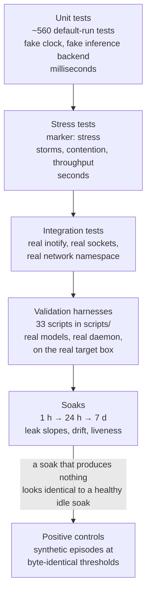

### 12.1 The four test tiers

| Tier | Count | What it catches | Determinism device |
| --- | --- | --- | --- |
| **Unit** | ~560 (default run) | Logic errors, boundary conditions, invariant violations | `FakeClock` (no `sleep`), `FakeInferenceBackend` (schema-aware), `conftest.py` wipes every singleton `_instance` between tests |
| **Stress** | marker `stress`, excluded from the default run | Backpressure failures, lock contention, loop stalls, heap growth | Deterministic ordering — e.g. the event storm starts dispatch **after** the burst so the drop count is exact |
| **Integration** | ~13 | Thread-boundary bugs, real `inotify` exhaustion, real socket framing, actual egress | Live `watchdog.Observer`, live Unix sockets, a real network namespace |
| **Validation** | 33 scripts | Everything that only exists on the real box: real GGUF models, real Wayland, real systemd | Run by hand on the target box, results recorded in `memory.md` and the `B1x_TEST_REPORT.md` docs |

### 12.2 Recorded-fixture replay

Rather than asserting on live system behaviour (which is not reproducible), L3 correctness is proven by **replaying recorded traces**:

- `trace_highload.json` → must produce exactly **1** `HIGH_LOAD`
- `trace_idle.json` → must produce exactly **1** `IDLE`
- `trace_noise.json` → must produce exactly **0** signals
- Focus / distraction / calm traces for B2.5, replayed through the **real** correlator

Same for the fifth-pattern isolation test, premature-fire timing, and `relevance_score` preservation on upsert.

### 12.3 The positive-control pattern — our most reusable methodological result

**The problem, plainly.** We ran a 24-hour test three times to prove the action system behaves correctly. All three produced an empty log. **An empty log cannot tell you the difference between "the system is correct and the day was quiet" and "the system is broken."**

**The wrong fixes we considered and rejected:**

- Lower `HighLoadPattern`'s CPU threshold from 90 % to 50 % — that pattern keys off file-change activity, is hard-coded rather than configurable, and a lower bar risks tripping on ordinary background noise, working *against* the zero-false-positive bar we were trying to prove.
- Map the browser to `research` so focus sessions would fire — an inaccurate classification chosen to make a test pass. Rejected; the browser was mapped to `habits`, which is honest and which **does not** unblock the criterion, and that consequence was recorded.

**The fix we used.** A **positive control**: a throwaway daemon driven by bounded synthetic episodes at thresholds that are **byte-identical** to production (`neuropaca.control.toml`). It proves the L3 → L5 → L7 path fires. Result: 60 attempts, 60/60 attempt+result pairs, 0 executed effects, 0 high-tier proposals, every safe-tier proposal traceable to `L3 high_load: cpu 100% for 5 samples`.

**Why the logic is sound.** Zero high-tier proposals ⇒ nothing required a human verdict ⇒ the zero-false-positive rule holds *mechanically*, not by someone's judgement.

B8 then adopted the same pattern by default rather than attempting a soak that structurally could not fire.

### 12.4 The finalisation script that refuses to lie

`finalize_b7.sh` validates, and only on a pass records the result, commits, and merges. It uses `set -e` so any failure halts before the merge, and it **refuses to merge** on anything unverifiable:

- a window shorter than 24 h,
- an incomplete audit,
- any executed effect,
- **any high-tier proposal at all** — because a high-tier proposal is precisely the thing a human must judge, and an unattended script must fail rather than assert a verdict nobody gave.

### 12.5 CI

`.github/workflows/ci.yml` runs `ruff check .` (no `--fix`), `ruff format --check`, `mypy`, the default pytest run, and a dedicated **`egress-test`** job inside a network namespace with only loopback, which asserts that both HTTP and raw TCP raise. Static checks additionally forbid any outbound-client import and any non-`AF_UNIX` socket anywhere in the shipped package.

---

## 13. Performance engineering — the five optimisations that mattered

**In plain words.** Five specific slow or leaky things were found by measurement and fixed. Each one is listed with the before number, the after number, and the reason — because "we optimised it" without numbers is not a result.

### 13.1 T4 — the scheduler was freezing the event loop

| | |
| --- | --- |
| **Symptom** | With a 10,000-node graph, each scheduler tick stalled the event loop **320–370 ms** |
| **Found by** | `scripts/measure_loop_lag.py --big-graph` |
| **Root cause** | Three compounding mistakes: (a) `save()` built a ~7 MB `json.dumps(indent=2, sort_keys=True)` string **on the loop, under the lock** — and `indent` forces json's **pure-Python** encoder, ~200 ms per 10k nodes; (b) `recalculate_importance()` iterated all 10k nodes on the loop under the lock; (c) the save churn triggered a full-graph generation-2 GC (~25 ms). |
| **Fix** | (a) `recalculate_importance()` locks per **250-node chunk** with `await asyncio.sleep(0)` between; (b) `save()` stream-encodes per **500-object chunk** using per-object compact `json.dumps` (the **C** encoder), yields between chunks, and thread-offloads only the atomic file write; (c) `gc.collect()` + `gc.freeze()` after `load()`. |
| **Result** | **320–370 ms → ~26 ms per tick.** Measured loop-lag probe max: **~2 ms** against a 50 ms budget. |

### 13.2 T5 — concurrent saves collided

`save()` ran `_write_atomic` in a worker thread *outside* the lock, using a fixed temp filename `graph.json.tmp`. Two overlapping saves (a scheduler tick racing a shutdown) both wrote it; the first `os.replace` consumed it and the second raised `FileNotFoundError` out of `orchestrator.stop()`. **Fix:** `tempfile.mkstemp` per call, so overlapping saves are each independently atomic.

### 13.3 The pre-soak deep-clean audit (2026-09-04)

Every defect below was **reproduced before it was fixed**, and every optimisation is measured.

**Three liveness defects — each one silent:**

| Defect | Why it was dangerous |
| --- | --- |
| A **subscriber** raising `CancelledError` propagated out of the dispatch loop and ended it **permanently**. `is_running` kept reporting `True` while every module silently stopped receiving events; the queue backed up toward the 1000-event drop threshold; `stop()` then waited forever on a drain nobody served, so `Orchestrator.stop()` never reached its `graph.save()`. | A healthy-looking daemon that had stopped working entirely. Fixed by discriminating on `Task.cancelling()` — "always re-raise `CancelledError`" is about *our* cancellation; a handler's is a handler failure. |
| `EventBus.join()`/`stop()` waited on an **unbounded** `queue.join()`. With no live dispatch loop nothing can ever call `task_done()`. | A never-started bus, a post-stop publish, and a dead dispatch task all hung **indefinitely**. Now bounded and reported. |
| `GraphMemory.save()` cleared `_dirty` **before** streaming and never restored it on failure. | A cancelled or failed save left the graph *looking clean* with the work unwritten — **4,000 nodes** in the reproduction. The DMN hits this on the ordinary path: activity cancels an idle cycle exactly when its save is most likely in flight. |

**Two bounded leaks:**

- `InterfaceLayer._surfaced_ids` grew forever, retaining ids of INSIGHT nodes long since pruned at their 48 h TTL; `_pending_insights` grew unbounded when no CLI client ever drained it. Both bounded, newest kept.
- `_write_atomic` leaked the `mkstemp` file descriptor when `os.fdopen` raised — harmless once, **EMFILE after months of five-minute saves**.

**Three de-linearised graph jobs** (measured on 3,611 nodes, results unchanged):

| Operation | Before | After | Speed-up |
| --- | --- | --- | --- |
| `link_orphan_nodes()` | **8,413 ms** | **52 ms** | **161×** |
| `consolidate()` | 246 ms | 16 ms | 15× |
| `DMN._top_nodes()` @ 10k | 34 ms | 9 ms | 3.7× |

All three rescanned the whole graph *per mutation*. Candidates now come from **one snapshot per sweep** and are re-validated under the lock, so the one-lock-per-mutation discipline is preserved and cancellation still lands cleanly between two mutations.

> `link_orphan_nodes()` alone exceeded the **entire 60-second DMN cycle budget** at scale. It would have made the 7-day soak meaningless.

**What the audit deliberately did *not* touch:** 9 unused enum members and 4 unreferenced but blueprint-public methods (removing public API requires human approval under `rules.md §9`), and the `PATTERN_DETECTED` / `MEMORY_UPDATED` / `AGENT_*` publishers, which have no daemon subscriber but are the B8 validators' observability contract. Restraint is recorded as explicitly as removal.

**Outcome:** 399 tests passing (up from 385), mypy clean, ruff clean.

---

## 14. Safety and privacy engineering

**In plain words.** The system can, in principle, run commands on your computer. So it was built assuming it will one day be wrong, and every path to an effect is fenced. It ships switched off.

### 14.1 The action path

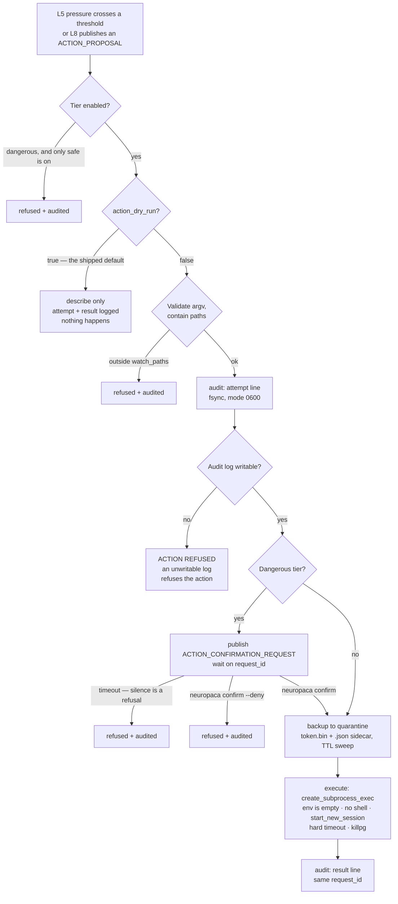

### 14.2 The safety properties, and why each exists

| Property | Implementation | The failure it prevents |
| --- | --- | --- |
| **Ships inert** | `action_dry_run = true`, `action_enabled_tiers = ["safe"]` | A fresh install describes what it would do and does nothing. The `dangerous` tier stays off until a completed soak has *earned* it. |
| **One gate only** | `SafetyGate.run` is the only path to `execute()` | No second code path can grow around the check |
| **No shell, no environment** | `create_subprocess_exec`, `env={}`, `start_new_session`, `killpg` on timeout | Shell injection; inherited credentials; orphaned process groups |
| **argv[0] is resolved explicitly** | `validate_argv` resolves it because `env={}` leaves no `PATH` | A subtle failure mode that only appears once you remove the environment |
| **Writes are contained** | Resolve-then-contain against `watch_paths` | Symlink escapes and `..` traversal |
| **Backup before write** | Quarantine `<token>.bin` + `.json` sidecar, TTL sweep | Unrecoverable overwrites |
| **Audit is complete** | Two JSONL lines (`attempt` + `result`) sharing a `request_id`, fsynced, mode 0600, refusals included | A missing line means a missing action |
| **An unwritable audit log refuses the action** | Checked before execution | Effects that cannot be reconstructed afterwards |
| **Silence is refusal** | Confirmation expiry = denial | An unattended machine drifting into a "yes" |
| **No outbound socket exists** | `ApiCallAction` was **never built** — only reserved config switches | You cannot misconfigure your way to egress if the class does not exist |
| **Agents hold no gate** | L8 publishes a description; L7 owns the only gate, audit writer, and broker | Two brokers racing for the human's single answer |

**A bug found during validation, and its regression tests.** An expired confirmation stayed visible in L9 forever, so the next `confirm` would answer a request nobody was waiting on. `ACTION_TRIGGERED` now carries the `confirmation_id` and L9 retires the prompt on it, with a timeout-based sweep behind that. Regression tests: `test_a_prompt_is_retired_when_l7_stops_waiting`, `test_a_prompt_older_than_the_timeout_is_never_offered`.

### 14.3 The five privacy guarantees, and how each is proven

| # | Guarantee | Proof |
| --- | --- | --- |
| 1 | **Zero cloud calls** | CI `egress-test` job runs in a network namespace with only loopback and asserts HTTP *and* raw TCP both raise; static checks forbid outbound-client imports and non-`AF_UNIX` sockets |
| 2 | **No screen capture, no keystroke logging** | Not implemented anywhere; window-title text is read transiently for a focus event and never persisted (`sensing/activity/window.py`) |
| 3 | **Raw sensor data is purged** | Bounded ring buffer (`snapshot_buffer_size = 720`); only extracted graph knowledge persists |
| 4 | **Idle thoughts expire after 48 h** | `prune_stale_nodes(ttl)` in the DMN |
| 5 | **Conversation history is RAM-only** | `test_conversation_history_is_ram_only_and_never_on_disk` scans every file under `tmp_path.rglob` |

Plus: **every IPC log line is redacted** — `test_ipc_payloads_are_redacted_in_logs`, and confirmed on real disk during B5 validation (`L9 <- {"op": "heal…<redacted 17 chars>`).

**A privacy finding worth stating.** B14 gives the browser sub-identity, but only ever adds an *attendance* label — a `webapp:<gmail>` node wired `PART_OF` its browser and its routing domain, its `access_count` a re-focus count. There is **no per-URL, per-message, or content visibility**: `derive_webapp()` returns a matched allowlist label or `None`, the raw title is a local in the collector, and an unmatched tab is invisible. This is a property of the sensing design, not a policy.

### 14.4 Licensing and authorship provenance

The project is **AGPL-3.0-only** (`LICENSE`), chosen deliberately: a network-copyleft licence on a system whose whole thesis is *local by construction* signals that a hosted derivative must also open its source. Every first-party Python file carries an SPDX identifier and copyright line:

```python
# SPDX-License-Identifier: AGPL-3.0-only
# Copyright (c) 2026 Jatin Bhanot <bhanot1054@gmail.com>
```

Beneath that, each file also carries a covert one-line marker appended at the end:

```
# gen-ref: a3242257
```

`scripts/_provenance.py` derives it as `sha256(f"{PROV_SECRET}:{posix_relative_path}").hexdigest()[:8]`. The secret is read only from an environment variable and never written anywhere; the script is idempotent and is re-run after every merge, so files from a merged branch get stamped and nothing else changes. To prove authorship of a disputed copy later, the author reveals the secret and this recipe, re-derives the marker for every file, and shows it matches — a check that a line-by-line rewrite of the code would not survive. `AUTHORS.md` and `.mailmap` normalise commit identity; commits and tags are SSH-signed.

**Operating the stamper — two lessons from 2026-09-11.**

- *A wrong secret is detectable without knowing the right one.* The stamper was run twice with a documentation placeholder (`…`, then `your actual secret phrase`) instead of the real phrase. Both runs were caught **before commit** by re-deriving the markers of three long-stamped files (`core/config.py`, `core/graph_memory.py`, `tests/test_idle.py`) from the phrase used: 0/3 matched, while all 7 new markers matched the placeholder. The stamps were reverted (`git restore`, after confirming the run had added exactly two lines per file and changed nothing else). The third run matched 3/3 old and 7/7 new, and was committed (`6f89048`). The same check — derive from a candidate secret, compare against known-good files — is the verification step to run after every stamping pass.
- *The stamper broke CI once.* It wrote **one** blank line before the marker; `ruff format` requires two before a module-level comment that follows a top-level `def`, so the five newly stamped test files failed the `quality` job's `ruff format --check`. Fixed in `ecb7deb`: whitespace-only reformat (markers unchanged, verified) and the stamper now writes two. The rule: after any stamping pass, run the full CI set locally before pushing.
- *Where the secret must not go.* A secret typed into an agent chat (e.g. via `!`) lands in the conversation transcript. Run the stamper in a plain terminal with `read -rs PROV_SECRET`, never through the assistant. (The phrase has been exposed in two assistant transcripts; rotating it means re-stamping every file with a new secret.)

---

## 15. Approaches we tried and rejected

**In plain words.** This is the section that makes it research rather than a build log. Every one of these was a real attempt that cost real time, and knowing they fail is worth as much as knowing what works.

### 15.1 Ollama for model pruning — architecturally impossible

- **The plan:** route pruning through Ollama at inference time, skipping attention heads per query.
- **Why it fails:** Ollama serves a **frozen** model. There is no "skip this head" parameter, and there never will be — that is what serving a model means.
- **The fix:** use **llama.cpp directly**, in-process. Build the cut-list from graph scores and apply it **once, at model load**. The smaller model then runs natively with no per-inference cost.
- **The consequence:** `BitNetRuntime` owns `model` + `tokenizer` directly. This is why the whole runtime layer looks the way it does.
- *Tracked as resolved problem T1.*

### 15.2 Free-text insight generation at 2B — measured failure

- **The plan:** feed the model graph context, let it write an insight sentence.
- **The measurement:** citation accuracy **0.69 / 0.28 / 0.34 / 0.25** at K = 1/3/5/8 against a 0.80 target. Grounded rate **0.00**. Correct abstain **0.00**.
- **The shape of the failure is the interesting part:** accuracy got *worse* with more context. More evidence made the model less able to use any of it.
- **The pivot (D-11):** strictly extractive. The model chooses a node id and a category from a locked enum; the sentence is a Python template. The model became a **decision gate**, not a writer.
- **This decision then propagated:** L6 idle thoughts went extractive too (D-13, `{subject, object, query_template}`), and L9's `$?` got a grammar plus a grounding gate plus a retry plus a template fallback (D-12).

### 15.3 A single model for everything — rejected on evidence

The always-on loop needs to be small (it is resident for a week). The interactive path needs to be coherent enough to answer a question. One model cannot be both at 1.4 GB. **Dual-model routing** (D-12): BitNet 2B4T for the loop, Qwen2.5-3B Q4 for the interactive path, both serialised by one `_inference_lock`, both lazily loaded. Measured cost: a 4.63 GB peak, ~29 % of the box.

### 15.4 Lowering the CPU threshold to make a soak fire — rejected

`HighLoadPattern`'s 90 % threshold could have been dropped to 50 % to make the soak produce data. Rejected because that pattern keys off file-change activity rather than app focus, the constant is hard-coded rather than configurable, and a lower bar risks tripping on ordinary background noise — working directly against the **zero-false-positive** bar the soak existed to prove. Lowering a threshold to make a test pass invalidates the test.

### 15.5 Trusting a soak that produced nothing — rejected three times

Three 24-hour dry-run soaks (2026-09-01 through 2026-09-03), one of them running 22 h 33 m, all logged **zero** action proposals.

- **First diagnosis (wrong):** the Wayland activity collector self-disables under `systemd --user` because `WAYLAND_DISPLAY` is missing.
- **Actual root cause (measured 2026-09-03):** `WAYLAND_DISPLAY` *is* in the manager environment; the daemon simply started **before the compositor imported it**. The unit now binds `graphical-session.target`.
- **The deeper structural cause:** `data/app_map.default.toml` had **no entry for any web browser**, and only `FocusSessionPattern` and `HighLoadPattern` attach graph nodes. `IdlePattern` and `DistractionPattern` fire but carry no `node_specs`, so `related_node_ids` is empty and both `BitNetPlasticity._handle` and `PressureAccumulator.add_pressure` skip them outright. On that machine, with that app map, a window with no sustained non-browser engineering focus and no >90 % CPU spike would **always** produce an empty log, regardless of duration.
- **The resolution:** the positive control (§12.3), and the B9 soak's **login popup** — every start raises a dialog showing progress, leak slope, sensing and drive counters, and any degraded module, with no timeout. *B7 burned three soaks before anyone noticed L5 had fired zero times. A dialog at every login makes a week of accumulating nothing impossible to miss past day two.*

### 15.6 The "Lottery Ticket Hypothesis" framing — rejected as an overclaim

LTH (Frankle & Carbin, 2019) is a specific claim about finding sparse subnetworks *before training* that then *train* to full accuracy. NeuroPACA does one-shot **post-hoc structured head removal guided by an external usage signal**. The honest name is **"usage-driven structured pruning of a personal language model."** LTH is cited as inspiration only — "most of a network is unused for any one task" — never as the method.

### 15.7 Weekly model retraining — cut from scope

The original concept had the system retrain weekly on your data. Cut (D-3) because it was never specified what it would train *on*, it is a large privacy and complexity surface, and the graph housekeeping the DMN performs is not training and should not be described as such. Any model adaptation now belongs to the deferred pruning work.

### 15.8 Optimisations rejected for lack of a problem

| Rejected | Why |
| --- | --- |
| Length-prefixed socket framing (`readexactly`) | Would break JSONL framing to improve on a **166×** latency margin |
| Dropping the 2B4T context window to save RAM | llama.cpp has no clean partial-context drop, and it would degrade L4 |
| An `is_ephemeral` node attribute | Ad-hoc attributes are discarded on save; apoptosis would silently stop working after one restart. Node-id prefixes persist. |
| Overloading `prune_stale_nodes()` with a second TTL | It is a whole-graph sweep on one global TTL, already owned by L6 at 48 h. Two layers would fight over one call. Apoptosis calls `delete_node()` directly instead. |

### 15.9 B13 · resource-aware sensing — the alternatives not taken (D-19)

The B9 soak's "zero insights in three days" (§15.5) has **three** independent causes:
inert Idle/Distraction patterns; CPU being the wrong primary signal for "what is
this person doing" — it is bursty and mostly ~0, while **RAM footprint** is the
stable indicator of what is loaded and being worked with; and (found later, B15
§2a / B16 §2) the Wayland focus sensor was deaf that whole run — a GC'd proxy, and
then, post-B15, its unreferenced parent proxy — so the `FocusSessionPattern` /
`DistractionPattern` path had almost nothing to fire on. B13 fixes the first two;
B15 + B16 fix the third. The rejected alternatives for B13, recorded for the paper:

| Rejected | Why |
| --- | --- |
| `NodeType.PROCESS` distinct from `NodeType.APP` | Fragments the graph — a focused app and a heavy app become two nodes — and costs a schema-enum change for no analytic gain. An id-prefix convention (`app:<name>`) carries the semantics, the B8 precedent. |
| PSS/USS memory accounting from day one | `memory_full_info().uss` is 10–50× slower and sometimes privileged; PSS via `/proc/<pid>/smaps_rollup` is ~5–15× slower. Summed RSS double-counts shared libraries (a 15-process browser looks larger than it is) but is fast and loop-safe. RSS validates the *shape*; the soak says whether precision matters, and PSS is the documented follow-up. |
| Special-casing L4/L5 to accept node-less signals (a global `__system__` pressure bucket) | Fights the node-keyed architecture throughout L5. Attaching real nodes to Idle/Distraction is in the grain of the design. |
| Idle → `YOU` | Semantically muddy, and floods the one hub `find_related` refuses to traverse through. Idle → the last-active `app:<id>` instead ("you went idle after working in X"). |
| Idle → a `SESSION` node now | The right long-term model, but needs a correlator-side "what happened since last idle" accumulator — its own phase. |
| Feeding `ram_mb` into `relevance_score` | Changes what the graph *means*: importance would track memory footprint, not behavioural salience. Out of scope; its own design discussion. |
| Generalising `HighLoadPattern` to fire on CPU **or** memory | One class doing two jobs with a forked confidence calculation. Kept separate: `HighLoadPattern` (CPU) untouched, `MemoryPressurePattern` new and standalone. |
| A 100 MB census threshold | Below the idle footprint of a single Electron renderer (200–500 MB each) — produces 40+ rows of renderer shards. 200 MB grouped-total instead. |
| Full self + tooling exclusion in round 1 | The operator wants the unfiltered census first — the round-1 graph carries `python` / `node` / `claude` noise, which is recoverable and informative (it proves the census works). The round-2 exclusion list is a soak *output*, not a guess. |

The unattended soak is **not** expected to produce insights even after B13 — once
the daemon's own work is set aside, an idle box has nothing behaviourally rich
left. B13 makes the loop work under real interactive dogfooding and narrows the
soak's job to plumbing, restart-safety, decay, bounded growth, and cost.

### 15.10 B14 · web-app attribution — the alternatives not taken

The B13 census made `app:brave-browser` one opaque node, but the operator's day is
Gmail / GitHub / Gemini / YouTube — not one activity. The rejected ways to fix that,
recorded for the paper:

| Rejected | Why |
| --- | --- |
| Reuse `NodeType.APP` with an id prefix (`webapp:` on an APP node), no schema bump | A browser tab is genuinely a different kind of thing from an application, and `PART_OF` edges to *both* the browser and a routing domain need a real node type. The schema bump to v4 is honest; the prefix trick would have muddied every consumer that reads `node_type`. |
| Read Brave's history / session files | Exactly the per-URL surface the design refuses to have. It would make "structurally cannot leak" false. |
| A browser extension feeding the daemon | A second sensing channel, a second privacy surface, a second thing to install and keep alive — for data the compositor already exposes as the window title. |
| Store the raw title on the node and filter at read | The raw title carries email addresses and unread counts. Filtering at read means the sensitive string still lands in `graph.json` and every backup. The membrane has to be *in the collector*. |

### 15.11 B15 / B16 · the deaf sensor — why it was misdiagnosed *four* times

The Wayland focus sensor going deaf is the third cause of "the soak measures
nothing" (after the two in §15.9), and the single most-misdiagnosed defect in the
project. Recorded in the order the wrong answers were given:

- **B7's diagnosis:** "the collector cannot see Wayland under `systemd --user` —
  `WAYLAND_DISPLAY` is missing." Partly true (the daemon started before the
  compositor imported the session env; fixed by the `graphical-session.target`
  binding) but not the whole story.
- **B15's first detour (~2 h):** a missing `XDG_SESSION_ID` under systemd. Ruled out
  by a clean-restart A/B — `systemctl --user restart` had silently *not been taking
  effect*, so the "fix" and the "no fix" runs were the same binary.
- **B15's answer (partly right):** the `zcosmic_toplevel_handle_v1` proxy — the
  carrier of "which window is focused" — was held in a local variable and GC'd
  non-deterministically. A collected pywayland proxy stops delivering events
  *silently*. ~1 in 3 daemon starts came up permanently deaf, and `health()` still
  printed `window✓`. Fixed with a strong-ref dict (`0/20` restarts deaf after),
  one shared connection (erasing a teardown SIGSEGV), and a poll-pump. **But this
  was half of one bug.**
- **B16's answer (most of the rest), found ~21 h into the B15-rebuilt soak:** the
  liveness watchdog B15 added as a rare safety net was doing **100 %** of the work
  — 54 of ~65 inter-reconnect gaps at exactly 180 s, zero events between them.
  B15 strong-ref'd the *child* cosmic handle but not its *parent*
  `ext_foreign_toplevel_handle_v1` (which carries `app_id`/`title` — the only
  identity source on protocol v3), and keyed both caches by `id(handle)`.
  pywayland retains proxies only weakly and runs `wl_proxy_destroy` on GC, so the
  parent died right after `_on_toplevel` and its later events were dropped as
  zombie traffic; and once collected, its `id()` was reused, so a new window would
  evict a *live* cosmic handle. A standalone lifetime probe
  (`spikes/b16_toplevel_lifetime/`) shows it in one screen: `--leak` (no parent
  ref) → every proxy finalised within one second, `fd-readable ×0` for the rest of
  the run; `--hold` (both refs, monotonic-int keys) → a continuous focus stream.
  Fixed by retaining both proxies for the toplevel's whole life, plus a real
  "events actually arriving" health state (`window~`) so a deaf-but-connected
  sensor can no longer pass.
- **The fifth wrong answer, exposed by the fourth being right:** once B16 made
  "delivered once → delivers forever" structurally true, the liveness watchdog
  turned into a false-positive generator — it kept firing on "no events in 180 s
  while active," which after B16 just means *the focused window has not changed*
  (the compositor sends nothing when focus is stable; the probe shows it as
  `fd-readable ×0`). Measured 3 spurious reconnects in 20 min of single-window use
  on the freshly-merged daemon. Fix (commit `f29e004`): the watchdog fires only
  while the subscription has **never** delivered an event — the came-up-deaf case
  it actually exists for — and the first real event disarms it for the
  connection's life; while unconfirmed the interval backs off 180 s → 1800 s.

**The lesson for the methodology:** `window✓` was a *label*, not a *check*; B15's
`window✓ = is_alive` was a *better label*, still not a check — it went true for a
connected pump receiving nothing; and B15's watchdog was a check for the *wrong
thing* (it treated "quiet" as "deaf"). Same failure class as `chat`'s advisory
grounding (§4.1) and the journal greps that read zero from an empty journal
(§11.10). A status signal only counts as evidence once you have shown it can go
false **exactly** for the failure you care about and stay true otherwise — which
for this one sensor took five tries.

---

## 16. Open problems and honest limitations

### 16.1 Open technical problems

| # | Problem | Status |
| --- | --- | --- |
| **T2** | The B1 1-hour RSS soak drifts ~25 % before it plateaus. Not an unbounded leak — a bounded allocator warm-up (steady-state drift 0.00 %) — but the scripted 5 % check samples *inside* the ramp and reports FAIL on a healthy system. | 🟡 Open. Options: measure the back half only; `malloc_trim(0)` after `save()`; cap the arena. |
| **T3** | The B2 24-hour soak ran only 11 h — the machine slept. Partial-window numbers all pass. Residual risk (a leak slower than ~0.1 MiB/h, or late onset) is low. | 🟡 Open; **subsumed by the B9 7-day soak**. |
| **T6** | `scripts/soak_state.py`'s `rss_trend()` reported a huge, misleading leak slope right after a daemon restart — `(last − first) / span` over the longest daemon life, so a one-time warm-up step divided by a short window extrapolated absurdly. Observed live 2026-09-04: RSS jumped 43 → 1476 MiB in one 60 s sample, then sat flat for 3+ hours, and the tool reported **`+5600.7 MiB/day`** in the popup and tray widget. | 🟢 **Mitigated 2026-09-08** (B15 harness rebuild). `warm_rss_slope()` fits the slope only over samples of the longest daemon life **after RSS crosses 500 MiB** (the GGUF has mapped in), so the startup jump is outside the window; `assess` grades on that warm slope. The raw `rss_trend()` figure is kept and shown for context — a genuine post-warm-up leak still moves it. |
| **T7** | Every Hebbian edge `weight` in the ~22 h soak graph is `0.0` — co-occurrence reinforcement is not accumulating on the graph. `reinforce_cooccurrence` is exercised in unit tests (§8, "+0.01 on existing edges only, ~1.4 ms"), so the mechanism works; either the daemon path that would call it on real signals is not wired, or the weights are being reset by an edge re-add elsewhere. Found in the B17 graph review. | 🟢 **Diagnosed + fixed 2026-09-10** (full chapter: §21.6). **Root cause: "wire together" was never built.** `reinforce_cooccurrence` only strengthens *existing* edges; nothing ever *created* an edge between two co-occurring nodes — the correlator wires activity nodes to `domain:` hubs, never to each other, and the episode handed to the reinforcer is sibling `app:` nodes with no edge among them, so every bump was a no-op. Aggravators: `_add_edge_unsafe` re-add reset `weight`→0.0 (latent, masked); reinforcement was gated behind the ~5/day model-only insight path. The tests passed because they pre-wire the cited nodes — exactly what production never did. Fix: upsert-safe `_add_edge_unsafe`; new `GraphMemory.wire_cooccurrence()` (create-or-bump); a co-activation time-window in `correlator.on_app_switch` drives it model-free on every focus switch; `decay_cooccurrence_edges()` in the B6 idle sweep makes weight a recency-weighted affinity; 7 `Config` knobs. Closes on a ≥ 24 h soak showing a stable non-zero weight distribution. |
| **V-1** | T7's learning was confined to a **6-node clique** — 11 of 84 live edges weighted (0.01–0.37), all among `{brave, cosmic-term, cosmic-files, obsidian, google-gemini, youtube}`; every other edge `0.0`. | 🟢 **Diagnosed + fixed 2026-09-10** (full chapter: §21.8; merged `c6ca7ea`, daemon restarted on it). Five causes: unmapped focused apps never co-activated; every switch re-wired *all* pairs in the window (a clique by construction); decay was a fixed factor per CPU-idle spell, so a pair used once was pruned within ~9 idle spells; `wire_cooccurrence` bumped structural `PART_OF` edges (never decayed); additive, unbounded weights. Fix: star-shaped `wire_coactivation` with time-proximity credit; saturating update; uptime half-life; `PART_OF` skipped + healed; unmapped apps join (`focus_exclude_app_ids` drops dialogs); 30 s per-pair refractory. Closes on a soak showing the mesh reach beyond the old 6 apps with a spread of weights. |
| **V-2** | `relevance_score` squeezed the live graph into 2.98–9.0 (median 3.38), with generated `ephemeral:` probes (3.15–3.37) outranking real tools (`cosmic-comp` 3.20, `pytest` ~3.4). The score drives retention, idle replay and retrieval ranking (§3.2), so a flat score makes all three arbitrary. | 🟢 **Diagnosed + fixed 2026-09-11** (full chapter: §21.9; merged `da78779`, live since 00:18 IST). Five causes: recency ×3 with a 7-day half-life was a flat floor (every node touched this week); `min(1, access_count/100)` saturated only the two busiest apps; plain degree counted bookkeeping and `→ YOU` edges; `bridge` counted only direct domain edges, of which an app has one; `access_count` never decays. Fix: `6·activity + 2·strength + 2·bridge` with a decaying counter (schema v6), association strength, bridges through associations. Remaining: generated notes still rank second in a label search; the 6/2/2 weights and 7-day half-life await the §18 ablation. |
| **V-3** | Cruft accumulating: `YOU` degree 18; the daemon's own processes as `app:` nodes; probes outliving their subject; a reported "12 duplicates merged every restart". | 🟢 **Diagnosed + fixed 2026-09-11** (full chapter: §21.10; merged `f79f42b`, live since 00:51 IST). `link_orphan_nodes` placeholders were never taken back → `release_you_links()` at boot and in the idle sweep; the exclude list was disabled by `process_exclude_names = []` in all three shipped TOMLs → overrides removed + boot purge; a probe about a deleted app lost its edge and lingered → L8 reaps it (14 d TTL kept by ruling); the duplicate report was one B18-migration log line on pre-B17 data → regression test only. Remaining: 10 genuine orphans still on `YOU` (apps never focused); D-13's 48 h prune of untouched leaf nodes is by ruling and unchanged. |
| **V-4** | The DMN's imagination was seeded from the argmax `dmn_top_k` nodes — a set that never moves — so every idle thought circled one clique, in one facet, and stopped producing anything new once that clique was exhausted. | 🟢 **Diagnosed + fixed 2026-09-11** (full chapter: §21.11). The pool was the sample; a grammar offering all four templates let a 2B4T model copy the few-shot. Fix: score-weighted sampling from a wider pool, a refractory penalty, a rotating template pair. Seed reach 5 → 24 on the live graph. Remaining: the draw is no longer reproducible run-to-run (unseeded RNG, injectable for tests) and the rotation is a fixed 4-step cycle, not adaptive. |
| **V-5** | Five of ten `domain:` hubs sat at degree 0 — clutter in every graph view, an empty branch in `find_related`. | 🟢 **Diagnosed + fixed 2026-09-11** (full chapter: §21.11). The five were dead for *two* reasons — three routable but unused, two unroutable because no map entry names them — which is why the fix reaps and rebuilds on demand instead of editing `DOMAIN_SLUGS`. 70 → 65 nodes, 0 edges lost. Remaining: nothing; a hub returns on its first edge. |
| **V-6** | A node created between idle spells stayed unreachable for hours; `link_orphan_nodes` ran only in the DMN sweep. | 🟢 **Diagnosed + fixed 2026-09-11** (full chapter: §21.11). The sweep is an O(N) walk — 23.8 ms at 10k — so it could not simply be moved to a timer; a bounded ledger of never-linked ids makes the pass O(pending) at 0.008 ms. Remaining: the boot tidy now carries one whole-graph sweep (~24 ms at 10k, once per start). |
| **V-7** | An idle thought stored a template id, not its question; no generated node could carry free text. | 🟢 **Fixed 2026-09-11** (full chapter: §21.11). `LabelSpec.text` — identity-free, so no id changed and there was nothing to migrate; the label still renders and still heals on a rename, while the text records what was asked. Schema v7. Remaining: the live graph is still v6 on disk and migrates on the next daemon start; the briefing that consumes this payload is S0. |

### 16.2 Methodological limitations — stated, not hidden

| # | Limitation | Why it matters | Mitigation |
| --- | --- | --- | --- |
| **1.8** | **One user on one machine is not enough to prove anything.** | This is the single largest threat to the research claims. Behaviour patterns from one developer on one Pop!_OS laptop cannot establish generality. | 🔴 Unresolved. Requires synthetic activity generation plus multi-machine replication. It is the top item in the evaluation plan (§18). |
| **1.12** | **Privacy makes it hard to prove it works.** A system that never sends data out cannot produce a shared benchmark dataset. | Reproducibility conflicts with the core value proposition. | 🟡 Planned: a synthetic activity generator plus a public question set with known answers, so results are reproducible without real user data. |
| **1.10** | **Concurrency traps.** Async + threads + a shared graph + a blocking model is an inherently hazardous combination. | Four separate real bugs came from exactly here (T4, T5, and two of the three audit liveness defects). | 🟡 Mitigated by the four invariants, a dedicated stress tier, and reproduce-before-fix discipline — but the risk is structural. |
| **1.11** | **Too big for one person.** | Ten layers, two models, systemd integration, Wayland protocols, and a research paper. | 🟡 Managed by strict phase ordering and by deferring the riskiest work (pruning) to the end where a negative result costs nothing. |
| — | **The soak gate's check 5 was too narrow** (B0–B14). It required an idle transition or an app switch, and the window-switch handler returned early unless `app_id` changed; someone working in one application all hour produced neither, and the 2026-09-03 run cleared it with ~7 minutes to spare. | 🟡 **Reworked in B15**, partly exercised. Check 5 now demands a real switch **rate** (≥ 20/h) *or*, for a genuine single-window hour, graph growth **and** an L3 signal — plus the shared Wayland connection not thrashing (≤ 1 reconnect, 0 pump-errors) and `window✓` live. The 2026-09-08 pass came through the **fallback** (15 switches/h + graph + signal), so the strong rate path is proven to exist but was not itself cleared that hour; a heavier-use hour would exercise it. |
| — | **L7 and L8 shapes came from a ruling, not the blueprint.** The source class diagram is *permanently* truncated on the right; no full-width re-export exists or will. `Architecture.md §11b` is authoritative **by ruling** (D-15). | The mitigation was carried out in full: safe actions first, `ApiCallAction` never built, every dangerous action behind the tier gate, the sandbox, and a recorded confirmation. Any future export is reconciled *against* §11b, not the reverse. |

### 16.3 What is not yet in the repository

From `problems.md` §2.2 — the evaluation infrastructure the paper needs:

| # | Item | State |
| --- | --- | --- |
| 1 | `research.md` — the claims, how each is measured, target venues, the first-paper / second-paper line | to do |
| 2 | `eval/` — synthetic activity generator, question set with known answers, baseline retrieval methods, an ablation runner that prints a results table | to do |
| 3 | Event tracing + replay behind a `--research-mode` flag, kept out of the real daemon | to do |
| 4 | `docs/alternatives.md` — the running list of ideas tried and dropped (Ollama is entry 1) | to do |
| 5 | One line per build step in `phases.md`: "how we measure this worked, and against what baseline" | to do |

---

## 17. The deferred experiment — personal model pruning

**In plain words.** The original, most ambitious idea: use the same "how much do you use this" score to physically cut pieces out of the AI model, leaving a smaller model shaped around your actual work. It is parked at the end of the roadmap, because it turned out not to be necessary and it might not work at all.

### 17.1 The idea

| `relevance_score` | Action on that domain's attention heads |
| --- | --- |
| **≥ 7** | **Protect** |
| 4 – 7 | Keep, compressible |
| **≤ 3** | **Flag for removal** |

The result would be a sparse subnetwork shaped around the two or three domains you actually work in.

### 17.2 The bridge problem — the weakest piece in the entire project

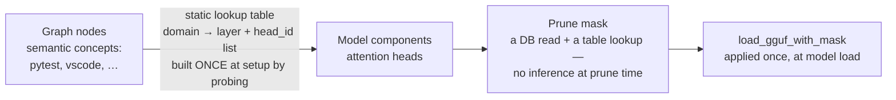

Graph nodes live in a semantic space; attention heads live in a parameter space. Bridging them requires `domain_to_heads`, a table built once at setup by probing the model with representative inputs per domain. **Nobody has shown that heads in a 2B model are topic-separable enough for this to work.**

### 17.3 Why deferred, not deleted

| # | Reason |
| --- | --- |
| 1 | **BitNet 2B4T already fits a laptop.** Pruning was the fix for "the model is too big." That problem no longer exists, so pruning became an optimisation rather than a requirement. |
| 2 | **It is the riskiest part of the project.** It may simply not work at 2B. |
| 3 | **Doing it last is the right order.** By then there will be weeks of real usage data to prune against, and the core system will have proven itself first. |
| 4 | **Nothing depends on it**, so a negative result costs nothing structural — and a documented negative result is itself a deliverable. |

### 17.4 The five questions that must be answered first

| # | Question |
| --- | --- |
| **Q1** | Are attention heads in a 2B model topic-separable enough that cutting a domain's heads removes that capability without hurting the rest? |
| **Q2** | How much can you cut before quality drops? Measure the curve at 5 / 10 / 20 / 30 % and find the knee. |
| **Q3** | What prompts build `domain_to_heads`? The graph holds behavioural nodes (`pytest`), not sentences. |
| **Q4** | Is a short recovery pass needed after pruning? "No retraining ever" may not hold. |
| **Q5** | Does BitNet's quantisation-aware machinery (straight-through estimator) make a recovery pass materially harder than a normal fine-tune? |

**If Q1/Q2 come back negative,** the paper reports it as a result — "behavioural scores did not predict prunable regions at 2B; here is the data" — and `relevance_score` keeps its three core jobs. The experiment starts as a throwaway spike in `experiments/pruning/`, promoted to `src/neuropaca/sparsity/` only if it shows promise, and **never imported by the daemon**.

---

## 18. Research claims and publication plan

### 18.1 The five candidate claims

| # | Claim, in plain English | Risk | Status |
| --- | --- | --- | --- |
| **A** | One "how much do I use this" score can decide what the system keeps, what it replays during idle, and how it ranks context for your questions | Medium | ✅ **built** (B0–B9); needs ablations |
| **C** | Building pressure from several **independent** signals before acting causes far fewer wrong autonomous actions than a simple threshold | **Low** | ✅ **built and measured**; testable entirely in simulation, no model needed |
| **D** | Passive computer-usage sensing is a useful **data layer** other agents could plug into | Positioning | ✅ demonstrated by construction |
| **B** | Watching your computer can tell us enough to **shrink a local model toward your actual work** without hurting quality much | **High** | ⏸ **deferred** (phase D1) |
| **E** | An honest write-up of **what broke** building a self-shrinking local agent on a CPU | Low | ✅ material collected throughout |

### 18.2 The plan

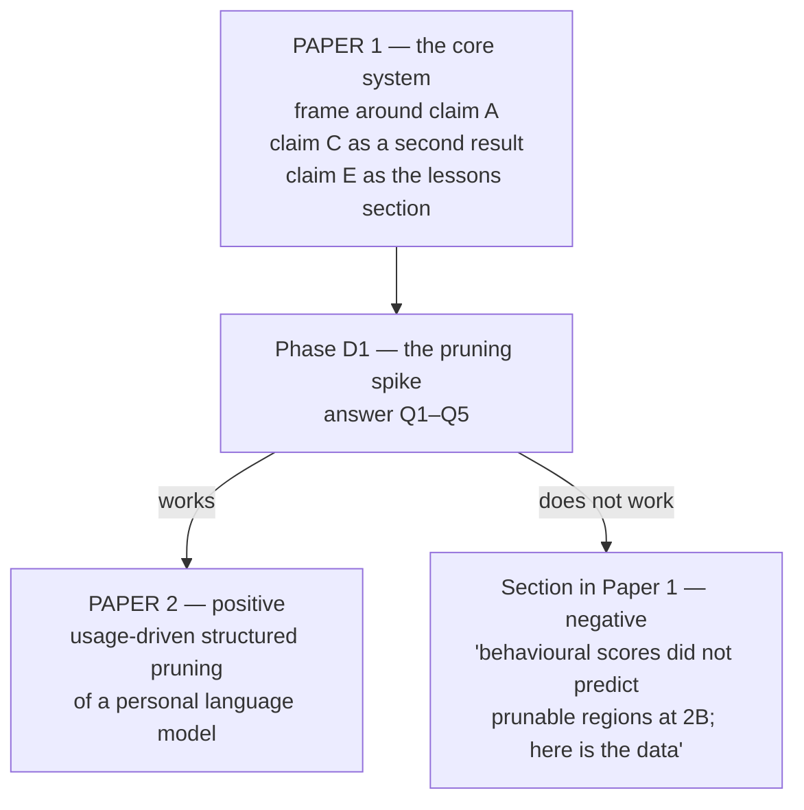

- **Claim C is the cheapest strong result in the project.** It needs no model, no user study, and no privacy compromise — it is provable in simulation. The 500-spike / 167×-threshold measurement is already most of the way there. It could stand as a clean small paper on its own.
- **Claim A is the centrepiece** and the one that most needs the missing `eval/` infrastructure: ablations that remove each score term and measure the cost to retrieval quality, replay usefulness, and retention behaviour.
- **Claim E is already written** — it is §15 of this document.

### 18.3 The evaluation that still has to be built

| Component | Purpose |
| --- | --- |
| **Synthetic activity generator** | Produce reproducible behaviour traces so results do not depend on one person's real week — this is the direct answer to limitations 1.8 and 1.12 |
| **Question set with known answers** | A ground truth for grounded-answer quality |
| **Baseline retrieval methods** | Recency-only, frequency-only, degree-only, and semantic-similarity baselines, so the composite score has something to beat |
| **Ablation runner** | Drop each of the four score terms in turn; print a results table |
| **`--research-mode` event tracing** | Full event trace and replay, kept strictly out of the shipped daemon |

---

## 19. Reproducing everything

### 19.1 Build and verify

```bash
uv venv --python 3.12
uv pip install -e ".[dev]"        # ruff + mypy + pytest + pre-commit
pre-commit install

uv run ruff check .               # note: bare, no --fix — that is what CI runs
uv run ruff format --check .
uv run mypy
uv run pytest -q                  # 423 default tests
uv run pytest -m stress           # 14 stress tests
uv run pytest tests/integration   # 13 integration tests
```

### 19.2 The validation harnesses

Each maps directly to an exit criterion in `phases.md`.

| Script | Proves |
| --- | --- |
| `scripts/validate_b5_real_model.py` | *(retired B12 with the `$?` grounded-sentence path it validated — dual-model RSS ladder now covered by the B12 `tell --explain` smoke test)* |
| `scripts/validate_b5_latency.py` | 100 socket round-trips → the 0.72 ms figure |
| `scripts/validate_b5_privacy.py` | Canary absent from disk; IPC log lines redacted |
| `scripts/validate_b6_cancel.py` | Mid-consolidate cancellation in 0.1 ms with zero corruption |
| `scripts/validate_b6_budgets.py` | Wall-clock and inference budgets both bite |
| `scripts/validate_b6_consolidate.py` | 500 merges, exact node-count delta, correct merge math |
| `scripts/validate_b7_pressure.py` | 500 spikes → 167× threshold, low tier only |
| `scripts/validate_b7_confirmation.py` | Expiry / denial / approval over the real socket |
| `scripts/validate_b7_dryrun.py` | Audit-log analysis, high-tier and safe-tier reported separately |
| `scripts/validate_b8_plasticity.py` | All five B8 exit criteria via synthetic pressure injection |
| `scripts/b7_positive_control.py` | The positive-control pattern at production-identical thresholds |

### 19.3 Soaks

```bash
scripts/soak_test_b1.py      # 1 h,  RSS on a 10k graph
scripts/soak_test_b2.py      # 24 h, telemetry CPU + RSS
scripts/soak_test_b2_5.py    # 2 h,  Wayland fd-leak (least-squares fd slope)
scripts/soak_test_b4.py      # 1 h,  real-model loop stability

scripts/soak_probe.py         # one JSON health sample over the L9 socket
scripts/soak_gate.sh          # 1 h live gate — MUST pass before the 7-day soak
# then: neuropaca-soak.service -> scripts/soak_7day.sh
#       under systemd-inhibit --what=sleep:idle

scripts/soak_state.py summary        # accrued sessions + RSS trend + warm slope
scripts/soak_state.py assess         # PASS / FAIL verdict, incl. B15 liveness
scripts/soak_dashboard.py --open     # the explained HTML dashboard
```

### 19.4 Repository map

| Path | Contents |
| --- | --- |
| `src/neuropaca/` | One package per architectural layer — `core/`, `sensing/`, `diagnosis/`, `learning/`, `drive/`, `idle/`, `action/`, `agents/`, `interface/`, `orchestration/` |
| `tests/` | Unit tests, plus `stress/` (marker-gated) and `integration/` |
| `scripts/` | Validation harnesses, soak runners, the soak tray widget, `systemd/` unit templates, logrotate config |
| `spikes/` | Throwaway de-risking spikes (`b0_bitnet/`, `b2_5_activity/`, `b7_positive_control/`) — **never** imported by the daemon |
| `data/` | gitignored — `graph.json`, `actions.jsonl`, logs, soak state |
| `models/` | gitignored — the two GGUF files |

### 19.5 The document set

| Document | Purpose |
| --- | --- |
| `README.md` | Entry point and current status |
| `PRD.md` | Scope, the thesis, features, users, non-goals, privacy |
| `Architecture.md` | The 10 layers, class shapes, the four invariants, the event catalogue |
| `rules.md` | Binding engineering rules and AI-agent boundaries |
| `phases.md` | The runtime lifecycle and the build order B0–B9, with exit criteria |
| `design.md` | The terminal-first visual identity |
| `memory.md` | Living project state — **read first, update last** |
| `problems.md` | Risk register, the research-claims section, and the testing log |
| `pruning.md` | The deferred personal-model-pruning design |
| §21 of this document | Every post-B9 plan and test report (B13–B18 and T7), merged here — one chapter per branch |
| `LICENSE` · `AUTHORS.md` · `.mailmap` | AGPL-3.0-only text; commit-identity normalisation |
| **`RESEARCH_DOSSIER.md`** | **This document — the consolidated research record** |

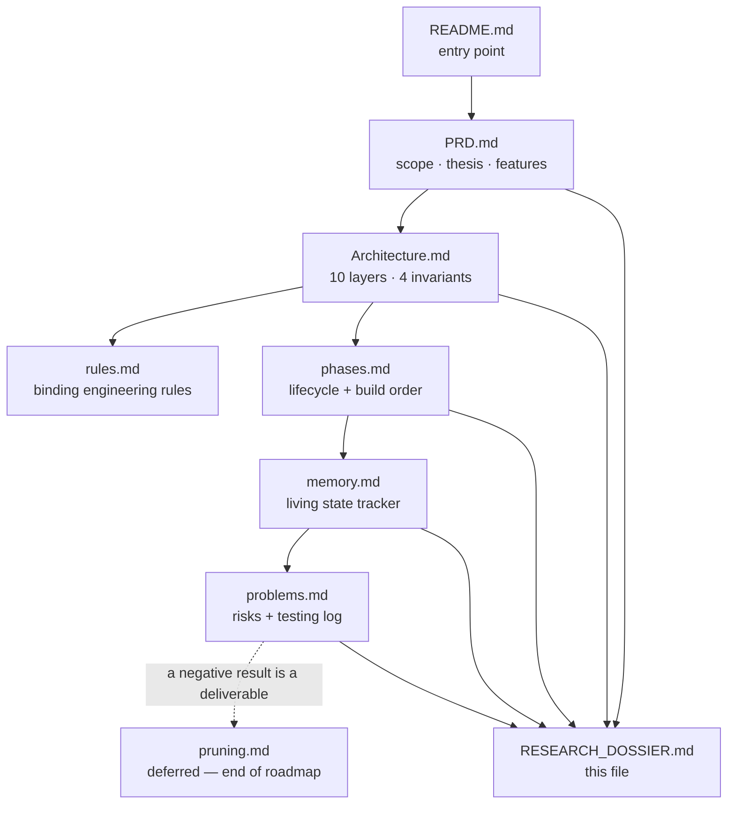

---

## 20. Glossary

| Term | Plain meaning |
| --- | --- |
| **Activity (frecency)** | A per-node usage counter that fades: halves every 7 days, +1 on each use — so "used a lot, long ago" sinks and "used today" rises (V-2) |
| **Apoptosis** | Programmed cleanup — temporary graph nodes delete themselves after 14 days of no activity, or as soon as the thing they describe is gone |
| **BitNet b1.58** | A model whose weights are only −1, 0, or +1 (1.58 bits each), so matrix multiplication becomes addition — which is why it runs on a CPU |
| **Bridge value** | How many different topic areas a node connects — directly, or through apps it is used together with; one area earns nothing, three earn the full bonus |
| **Corroboration** | Requiring signals from more than one independent layer before the system is allowed to act |
| **DMN (Default Mode Network)** | The part that thinks while you are away from the keyboard — replaying, tidying, and generating follow-up questions |
| **EventBus** | The shared message room; the only way any two layers communicate |
| **Extractive** | The model *picks from* what it was given (a node id, a category) rather than writing new prose |
| **GBNF grammar** | A hard schema the model's output must follow — it makes certain kinds of hallucination physically impossible to emit |
| **Grounding gate** | A check after generation that throws away any answer not tied to a real node |
| **Hebbian reinforcement** | Two things seen together get a stronger connection ("fire together, wire together") |
| **Hub** | One of the 11 permanent routing nodes (`YOU` plus 10 domains) that the system files everything under |
| **Placeholder link** | The `→ YOU` edge the idle sweep gives a node with no connections, so it is not unreachable; taken back once the node has a real connection (V-3a) |
| **Positive control** | A synthetic run that proves the pipeline *can* fire, used when a real-world test produces nothing |
| **Pressure** | Accumulated evidence that something needs attention; halves every 60 seconds when signals stop |
| **Quarantine** | The backup directory where a file's previous contents are stored before anything writes to it |
| **`relevance_score`** | The one 0–10 number that decides what is kept, replayed, and ranked |
| **Soak** | Running the system for hours or days to catch slow leaks and rot that a fast test cannot see |
| **Structured generation** | Forcing the model to fill in a form instead of writing freely |
| **Tier** | `safe` or `dangerous` — which class of action is permitted; `dangerous` ships off |

---

## 21. The post-B9 build chronicle — B13 to V-3, step by step

**In plain words.** After B9, the system was running every day on the real
machine, and each week of use exposed a real gap. This section is the story of
those gaps, one branch at a time. Each chapter answers the same questions in
the same order: *which branch, what we saw, why it happened, how we fixed it,
what we built, how we proved it, what we rejected, and what is still open.*
It replaces the separate per-phase plan and test-report files
(`B13_PLAN.md` … `B17_TEST_REPORT.md`, including `B15_TEST_REPORT.md`,
`T7_PLAN.md`, `T7_TEST_REPORT.md` and `LABELS_PLAN.md`), whose full content is
merged here.

The original documents' section numbers are kept in each chapter as
*(orig. §N)*, so older references such as "B15 §2a" or "B16 §5d" still point
to the right paragraph.

```mermaid
flowchart LR
    B9["B9 soak:<br/>0 insights in 3 days"] --> B13["B13<br/>resource-aware sensing"]
    B13 --> B14["B14<br/>web-app attribution"]
    B14 -->|live smoke test<br/>finds 0 webapp nodes| B15["B15<br/>deaf sensor, round one"]
    B15 -->|soak: watchdog<br/>does all the work| B16["B16<br/>deaf sensor, round two"]
    B16 -->|graph review:<br/>1 app = 2–3 nodes| B17["B17<br/>one app, one node"]
    B17 -->|graph review:<br/>weights all 0.0| T7["T7<br/>Hebbian wire-together"]
    T7 -->|graph review:<br/>learning only in a 6-node clique| V1["V-1<br/>Hebbian rule rework"]
    V1 -->|score review:<br/>everything 3–7| V2["V-2<br/>relevance score rework"]
    V2 -->|graph review:<br/>stale YOU spokes, daemon as app| V3["V-3<br/>cruft removal"]
    B17 -->|stale / duplicate /<br/>lookalike labels| B18["B18<br/>one labeling system"]
```

| Branch | Problem we saw (X) | Issues found (Y) | Approach (Z) | Outcome |
| --- | --- | --- | --- | --- |
| **B13** `feat/b13-*` | Soak: 0 insights in 3 days | Idle/Distraction signals carried no nodes; CPU is the wrong main signal; resource data was dropped on save | Attach nodes to Idle/Distraction; a per-app RAM census; durable resource fields (schema v3); RAM-aware patterns | 484 tests green; the loop fires under real use |
| **B14** `feat/brave-webapp-attribution` | The whole browser was one node | No event on a tab switch; nowhere for tab identity to land; the raw title carries personal data | Match the title against an allowlist inside the collector; `NodeType.WEBAPP` (schema v4) | ~524 tests green; no raw title leaves the collector |
| **B15** `fix/wayland-poll-pump` | Daemon saw ~4 switches/hour | A GC'd focus proxy; two Wayland connections (segfault); errors swallowed silently | Strong-ref the proxy; one shared connection; a poll-pump; honest health; a watchdog | 0/20 restarts deaf (was ~1/3); 561 tests |
| **B16** `b16-wayland-subscription-stability` | The watchdog did 100 % of the work | The parent proxy was never held; caches keyed by a reused `id()`; `closed` never fired; health could not see silence | Hold both proxies by a monotonic int key; `window~` health; watchdog only for never-delivered | Live stream confirmed; 587 tests |
| **B17** `b17-app-identity-canonicalization` | One app = 2–3 `app:` nodes | Two sensors name apps differently; thread names counted as apps; raw ids as labels | `AppIdentity.resolve()`; a one-time canonical pass; readable names + pinned hubs + detail panel | 63 → 57 nodes; 643 tests |
| **T7** `t7-hebbian-weights-zero` | Every edge weight `0.0` | Nothing ever created an edge between co-used apps; an edge re-add reset its weight; reinforcement only on the rare model path | Upsert-safe edges; `wire_cooccurrence` (create-or-bump); a co-activation window on every focus switch; decay + prune | 673 + 10 tests; closes on a soak |
| **V-1** `fix-v1-hebbian-clique` | Learning only inside a 6-node clique | Unmapped apps excluded; all-pairs wiring every switch; decay per idle spell; `PART_OF` edges bumped; unbounded weights | Star-shaped `wire_coactivation` + time-proximity credit; saturating update; uptime half-life; `PART_OF` skipped/healed; unmapped apps join; refractory | Sim 6 → 8 apps, range 0.03–0.26 → 0.02–0.98; 719 tests |
| **V-2** `fix-v2-relevance-score` | Score jammed in 2.98–9.0; probes outrank real tools | Flat recency floor; saturating frequency; degree counting bookkeeping edges; `bridge` = "in `app_map`"; `access_count` never decays | Decaying activity counter (schema v6); association strength; bridges through associations; two-pass cached recalc | Live 0.69–10.0, median 3.38 → 1.34; 10k recalc 83 ms; 724 tests |
| **V-3** `fix-v3-cruft` | `YOU` has 18 spokes; the daemon is an "app"; stray probes | Placeholders never released; every TOML overrode the exclude list with `[]`; subject-less probes linger; "dedup every restart" was one old log line | `release_you_links()`; config overrides removed + boot purge; L8 reaps subject-less probes; regression test | Live 71 → 66 nodes, `YOU` 18 → 10; 740 tests |
| **B18** `feat/b18-unified-labels` | Stale, duplicate and lookalike labels | Label text frozen at creation; in-memory novelty buffer; labels copying labels | Store what a node is about (`LabelSpec`); render names on demand; id = fingerprint (schema v5) | 87 → 59 nodes on the real graph; 699 tests |

---

### 21.1 B13 · Resource-aware sensing, and non-inert Idle / Distraction

| | |
| --- | --- |
| **Branch** | B13 series (B13-A, B13-B1…B4, B13-C) |
| **Found** | 2026-09-08, the "zero insights in 3 days" investigation on the B9 soak |
| **Depends on** | B2.5b (activity / app_map), B3 (patterns), B4 (L4 gate), B7 (L5 pressure) |
| **Ruling** | D-19 |
| **Outcome** | Merged. 484 tests green (39 new). The loop now fires under real dogfooding, not just the positive control. |

**In plain words.** Two of the four "what is this person doing" detectors fired
but never said *which app* they were about, so everything downstream threw
their signals away. And the system watched CPU, which is almost always near
zero; memory is the better sign of what you are working with. B13 made those
detectors name an app, and added a memory census per app.

#### Step 1 · What we saw *(orig. §1)*

The B9 soak had accrued ~3 days of runtime and produced:

```
Sensing     66 idle/active edges, 28 app switches
Drive       0 contributions, 0 low / 0 high crossings
Cognition   0 insights, 0 actions proposed
```

#### Step 2 · Why it happened *(orig. §1)*

Traced end to end:

1. **L4 only consumes `SIGNAL_CORRELATED`.** Of the four L3 patterns, only
   `HighLoadPattern` and `FocusSessionPattern` attach nodes to their signal.
   `IdlePattern` and `DistractionPattern` emitted `related_node_ids = ()`.
2. A nodeless signal is **dropped by L4 at the `no_nodes` gate** (before any
   inference) and **no-op'd by L5** (`for node_id in signal.related_node_ids`
   over an empty tuple). It fires and vanishes.
3. The two node-bearing patterns need conditions an unattended machine never
   creates: sustained **>90 % CPU for 5 min with concurrent file churn**, or a
   **20-min uninterrupted focus hold at ≥10 % mean CPU** in `engineering` /
   `research`. On an idle soak box neither happens; `HighLoadPattern` only ever
   fired via an injected positive control (see §12.3).
4. Everything downstream of L3 is in-memory and resets on each daemon restart
   (~1/80 min in the soak), so multi-snapshot patterns cannot mature.

A third cause was found later: the Wayland focus sensor was deaf for that whole
run (§21.3, §21.4).

#### Step 3 · How we fixed it — the approach *(orig. §1–§3)*

Two independent fixes, bundled because they complement each other and touch the
same files:

- **B13-A — make Idle/Distraction non-inert.** They already fire; give them
  nodes so L4/L5 can act. Small, no schema change.
- **B13-B — resource-aware sensing.** CPU is the wrong primary signal — it is
  bursty and mostly ~0. **RAM footprint is the stable indicator** of what is
  loaded and being worked with (browser tab-sets, IDE projects, VMs, containers,
  media tools). Memory becomes a first-class sensed dimension, per process,
  grouped by app, with **how long the app has been running** as the third axis.

Neither fix makes the *unattended soak* produce insights — after excluding the
daemon's own work there is nothing behaviourally rich left. They make the loop
work during **real interactive use**, and narrow the soak's job to what it can
actually validate (plumbing, restart-safety, decay, bounded growth, cost).

**Scope, in dependency order** *(orig. §2)*

| Part | What | Schema / enum change? | Approval gate |
| --- | --- | --- | --- |
| **B13-A** | `IdlePattern` / `DistractionPattern` attach nodes | none | Architecture.md §5 line edit |
| **B13-B1** | Aggregate memory-pressure pattern (existing `mem_percent` + baseline) | none | Architecture.md §5 |
| **B13-B2** | `ProcessCollector` — per-process RAM/CPU/runtime census, app-grouped | new collector class | new public class, config fields, Architecture.md §4 |
| **B13-B3** | `Node` gains durable resource attributes (`ram_mb`, `cpu_percent`, `first_seen_at`, `last_seen_at`) | **schema v-bump** | D-19, human approval |
| **B13-B4** | RAM-aware patterns: resource pressure; RAM corroboration in `FocusSessionPattern`; new `HeavyAppStartedPattern` | **new `SignalType`** | D-19, human approval |
| **B13-C** | 7-day soak re-run under the B9 harness with B13 config | none | — |

B13-A shipped first and alone — the highest value-per-line change in the set.

**The decisions ratified as D-19** *(orig. §3)*

- **D-19(a) — Reuse `NodeType.APP`, no `NodeType.PROCESS`.** A memory-heavy
  process resolves, via `app_map` / process name, to the **same `app:<id>`
  node** a focus event would create. There is no per-PID node. This follows the
  B8 precedent (`ephemeral:` / `idle:` / `insight:` prefixes carry semantics,
  not attributes) and avoids an enum change.
- **D-19(b) — RSS for grouping now, PSS flagged as the known inaccuracy.**
  `memory_info().rss` summed across an app's processes **double-counts shared
  libraries** (a 15-process browser looks larger than it is). Accepted because
  it is fast and loop-safe. `memory_full_info().uss` is 10–50× slower and
  sometimes privileged; **PSS** via `/proc/<pid>/smaps_rollup` is the documented
  follow-up if the soak shows the inflation matters.
- **D-19(c) — Minimal self-exclusion in round 1.** The operator asked for "don't
  bother excluding, see the results", amended to: exclude **only**
  `os.getpid()` + `psutil.Process().children(recursive=True)`. Three lines, and
  it stops the daemon observing its own ~1477 MiB BitNet RSS (and, in a
  non-dry-run future, proposing to kill itself). Claude Code, `pytest`, `node`
  and the soak harness are **not** excluded in round 1 — the noise is
  recoverable and proves the census works. The round-2 list is a soak output.
- **D-19(d) — Idle attaches to the last-active app**, not `YOU`, not a
  `SESSION` node. `IdlePattern` gains `"activity"` in its `collectors` and emits
  one `NodeSpec` for the last focused `app:<id>` — "you went idle after working
  in X", on connected, traversable structure. Headless (no activity collector)
  → Idle stays nodeless, an acceptable degradation.
- **D-19(e) — New `SignalType.WORKING_SET_CHANGE`** for
  `HeavyAppStartedPattern`. Enum change → schema bump → approval.
- **D-19(f) — 200 MB grouped-total threshold, name-based grouping,
  empirically tuned.** An app is censused when its **summed RSS across all
  same-name processes ≥ 200 MB** (`brave` × 15 → one `brave` row). Not the group
  maximum; not 100 MB (Electron renderers idle at 200–500 MB each).

#### Step 4 · What was built *(orig. §4)*

**B13-A · Non-inert Idle / Distraction** (`diagnosis/patterns.py`, tests,
`Architecture.md` §5). `DistractionPattern` already computed `distinct` (the
distinct `app_id`s in the 2-min thrash window) and discarded it. Now:

```python
node_specs = tuple(
    NodeSpec(node_id=f"app:{app_id}", node_type=NodeType.APP, label=app_id)
    for app_id in distinct
)
```

No `edges` — the `app --part_of--> domain` edge is owned by the `APP_SWITCH`
classification path. **Do not re-emit it**: `_add_edge_unsafe` keyed on
`(source, target, relation)` and a second `add_edge` with the same key
**overwrote** it, resetting `weight` to 0 and wiping any Hebbian reinforcement
(the latent bug T7 later made structurally impossible).

`IdlePattern` adds `"activity"` to `collectors`; in `_draft` it reads
`windows.get("activity", ())` and, if the last snapshot carries an `app_id`,
emits `NodeSpec(f"app:{app_id}", APP, label=app_id)`. Downstream, unchanged,
now live:

- L4 can form `distraction: rapid switching implicates app:slack` — dropped at
  `no_nodes` before.
- L5 accumulates pressure on the thrash-set apps — exactly the accumulation the
  gradient is designed for.
- Hebbian: the thrash-set apps co-occur in the episode.

*Known ceiling, documented:* on a 3-app machine, Distraction always cites the
same apps, so L4's novelty gate drops every distraction after the first. B13-B
widens the app vocabulary. A test asserts the ceiling so it is intentional
(since B18 the gate is the graph-backed repeat gate, §21.7).

**B13-B1 · Aggregate memory-pressure pattern** (`patterns.py`, `config.py`).
The `system` snapshot already carries `mem_percent` / `mem_available_mb`, and
`SignalCorrelator` already keeps a `MetricBaseline` for every numeric metric.
New `MemoryPressurePattern` (`_RunLengthPattern`, `collectors = ("system",)`):

- hit: `mem_percent` z-score `> 2.0` **or** `mem_available_mb < 1024`;
- sustained 180 s (shorter than HighLoad's 300 s — a memory ceiling is a
  slower, more meaningful event than a CPU spike);
- cleared: z-score `< 1.0` and available above the floor;
- confidence from the z-score margin; node attribution = the memory-heavy
  `app:` nodes from the concurrent `process` snapshot.

Config: `mem_pressure_z = 2.0`, `mem_pressure_floor_mb = 1024.0`,
`mem_pressure_sustain_seconds = 180.0`.

**B13-B2 · `ProcessCollector`** (new `sensing/collectors/process.py`, wiring,
config). A polled `BaseCollector` (`is_blocking = True`; always run via
`asyncio.to_thread`), default 60 s. `collect()`:

1. `own = {os.getpid()} | {p.pid for p in psutil.Process().children(recursive=True)}`.
2. Iterate `psutil.process_iter(["name", "memory_info", "cpu_percent",
   "create_time"])`; skip `own`, `NoSuchProcess`, `AccessDenied`.
3. Group by `name`: summed `rss`, summed `cpu_percent`, **earliest
   `create_time`**, process count.
4. Keep groups with **summed RSS ≥ `process_min_rss_mb`** (200).
5. Emit `MetricSnapshot(collector_name="process", data={"processes": [{name,
   rss_mb, cpu_percent, proc_count, running_seconds}, …]})`, sorted by `rss_mb`
   descending. `running_seconds = now - oldest_start`.

Privacy (`rules.md §6`): **`name` only** — never `cmdline`, `exe`, `environ`,
`open_files`, `connections`. A test greps the collector source for those
attributes. Config: `process_collector_enabled`, `process_min_rss_mb`, a
`"process"` poll interval.

**B13-B3 · Durable resource attributes on `Node`** (`models.py`,
`graph_memory.py`). `Node` persisted a *fixed* field set — any `ram_mb` hung on
a node via `upsert_node(attributes=…)` was **silently discarded** at creation
and again on every `save()` (the ad-hoc-attribute drop that bit B8). Added:

```python
ram_mb: float = 0.0            # last observed grouped RSS for this app, MB
cpu_percent: float = 0.0       # last observed grouped CPU
first_seen_at: datetime | None = None   # first census sighting
last_seen_at: datetime | None = None    # most recent census sighting
```

Round-tripped by `_add_node_unsafe` / `_node_to_attrs` / `_node_record` /
`_deserialise`; `first_seen_at` is write-once (protected like `created_at`);
the other three refresh on every census. **Schema v3**; a v2 graph still loads.
`ram_mb` deliberately does **not** feed `relevance_score`. Written by
`SignalCorrelator` through a new optional `NodeSpec.attributes`.

**B13-B4 · RAM-aware patterns** (`patterns.py`, `enums.py`).

1. Resource pressure: kept as two classes — `HighLoadPattern` (CPU, unchanged)
   and the standalone `MemoryPressurePattern` — rather than one class doing
   both.
2. **`FocusSessionPattern` RAM corroboration:** if the focused `app_id` is the
   **largest non-browser RSS group**, add `+0.15` confidence (clamped). A 20-min
   focus session emitted `confidence = 0.6`, **below L4's 0.7 gate** — a named
   reason for zero insights.
3. **`HeavyAppStartedPattern`** (`WORKING_SET_CHANGE`, `collectors =
   ("process",)`): fires once when an app group crosses `process_min_rss_mb`
   that was absent from the previous snapshot; re-arms when it drops or
   disappears; `confidence = 0.5`; attaches that `app:<id>` with its resource
   attributes. In real use it fires on "launched a VM", "opened Blender",
   "Docker came up".

**B13-C · Soak re-validation.** The B9 7-day harness with `neuropaca.b13.toml`
(`process_collector_enabled = true`, `process_min_rss_mb = 200`, pattern
defaults, `action_dry_run = true`). The boot popup gains `Census N app groups
tracked, top <name>@<rss>` and `Cognition M insights (K from idle/distraction)`.

**How it shipped** *(orig. §8)* — as independently reviewable PRs: B13-A
(doc sign-off) → B13-B2 (census baking, feeding nothing) → B13-B3 (schema v3,
D-19) → B13-B1 + B4 (new `SignalType`, D-19) → B13-C (config + soak).

#### Step 5 · How we proved it *(orig. §5, §6)*

`rules.md §8`: tests ship with the code; no test loads a real model, sleeps, or
touches real `psutil` outside an integration marker.

| Tier | Test | Asserts |
| --- | --- | --- |
| patterns | `test_distraction_attaches_the_distinct_apps` | 6 switches across `{brave, slack, term}` → the three `app:` ids, order stable |
| patterns | `test_distraction_does_not_re_emit_domain_edges` | the existing `app:brave --part_of--> domain:habits` weight survives |
| patterns | `test_idle_attaches_last_active_app` / `…_with_no_activity_data_stays_nodeless` | last focused app cited; empty window → `()`, no crash |
| patterns | `test_memory_pressure_fires_on_sustained_z` / `…_rearms` | fires once on a 3σ series, silent on flat; re-arms on a second episode |
| patterns | `test_focus_session_ram_corroboration_crosses_l4_gate` | 20-min focus + top RSS editor → confidence ≥ 0.7 (was 0.6) |
| patterns | `test_heavy_app_started_edge_triggers_on_appearance` / `…_ignores_sub_threshold` | fires once on appearance, re-arms; 150 MB → nothing |
| patterns | `test_a_synthetic_6th_pattern_registers_with_no_correlator_change` | B3 invariant preserved |
| collector | `test_groups_same_name_processes_and_sums_rss` | 15 `brave` @ ~120 MB → one row ≈ 1800 MB, `proc_count == 15` |
| collector | `test_threshold_is_on_the_group_total` | 250 MB kept; 5×40 MB kept; 5×30 MB dropped |
| collector | `test_self_and_children_are_never_censused`, `test_running_seconds_uses_earliest_create_time`, `test_sorted_by_rss_descending` | the D-19 contract |
| collector | `test_never_reads_cmdline_or_environ`, `test_access_denied_on_one_process_does_not_abort_the_census` | privacy + best-effort census |
| schema | `test_resource_attributes_survive_a_save_and_reload`, `test_first_seen_at_is_write_once`, `test_ram_mb_updates_on_reobservation`, `test_a_v2_graph_loads_under_v3`, `test_schema_version_is_written_as_v3` | the B8 precedent, applied |
| integration | `test_a_distraction_signal_now_produces_an_insight` | L3 → L4 → `INSIGHT_GENERATED`, `traces_to_evidence()` |
| integration | `test_distraction_pressure_accumulates_and_crosses_low_threshold`, `test_idle_pressure_lands_on_the_last_active_app` | L3 → L5 |
| integration | the novelty/repeat-ceiling test | 3-app graph, 5 identical distractions → exactly 1 insight |
| integration | `test_memory_pressure_signal_attaches_the_heavy_apps`, `test_heavy_app_started_to_insight` | the new patterns end to end |
| isolation | `test_process_census_never_stalls_the_loop` | a 500 ms blocking `collect()` → loop lag < 10 ms |
| perf | `test_census_cost_bound` (integration) | p95 `collect()` < 1000 ms on the dev box |
| stress | `test_snapshot_stays_bounded_under_process_churn` | 2000 short-lived names → bounded snapshot + deque, flat RSS |
| privacy | `test_process_snapshot_carries_no_identifying_strings`, `test_graph_json_after_a_census_soak_has_no_cmdline` | exact field set; no `/home/`, `--`, `.py ` in the graph |

**Exit criteria.** Idle/Distraction each attach ≥ 1 real node and stay
nodeless-safe; an idle/distraction signal round-trips to a stored insight
(L4) and to a pressure crossing (L5); no pattern re-emits a structural edge;
the census groups, thresholds, sorts and self-excludes; names only (source scan
+ real-psutil graph grep); resource attributes survive save/reload
(`first_seen_at` write-once, v2 loads under v3); memory pressure fires, stays
silent on the negative, re-arms; RAM corroboration lifts a real session past
0.7; HeavyAppStarted edge-triggers and re-arms; the census never stalls the
loop > 10 ms (p95 < 1 s); bounded under a 2000-process storm; the small-graph
ceiling asserted as intentional; a synthetic pattern still registers with no
correlator change; `Architecture.md` §3/§4/§5 updated. The 48 h+ soak criterion
(census self-disable count 0, ≥ 1 populated `app:` node, RSS slope within the
B9 envelope) was carried into the B9 soak — which B15 and B16 then voided for
focus data.

#### Step 6 · What we rejected *(orig. §7)*

The full table is in §15.9. In short: `NodeType.PROCESS`; PSS/USS from day
one; special-casing L4/L5 for nodeless signals (a global `__system__` bucket);
Idle → `YOU`; Idle → a `SESSION` node now; `ram_mb` feeding `relevance_score`;
one class doing CPU-or-memory; a 100 MB threshold; full self + tooling
exclusion in round 1.

| If… | Then… |
| --- | --- |
| RSS-summed totals wildly overstate memory (browser at "8 GB") | switch to PSS via `smaps_rollup`, accept the ~5–15× slower census, poll at 120 s |
| `app:python` / `app:node` / `app:claude` pollute the graph | the round-2 exclusion list (from the soak, not guessed); consider cgroup-scope grouping (`app-<app_id>.scope`) — *done in part by B17's `process_exclude_names` default* |
| the novelty gate still collapses insight flow | scale the threshold with node count — *superseded by B18's repeat gate* |
| memory pressure flaps on a near-full 16 GB dev box | it is z-score-relative to the box; if it still flaps, `mem_pressure_z = 2.5` and a longer sustain |
| `AccessDenied` on some processes | handled per process; a whole-collector failure self-disables like any other |

#### Step 7 · What is left *(orig. §9)*

Non-goals, recorded so they are not silent omissions: no change to
`relevance_score`; no `SESSION` node / session accumulator; no `USER_RETURN`
pattern; no cgroup grouping in round 1; no "app causing distraction" action
class; the unattended soak is **not** expected to produce insights.

---

### 21.2 B14 · Web-app attribution — the browser stops being one opaque blob

| | |
| --- | --- |
| **Branch** | `feat/brave-webapp-attribution` |
| **Written / built** | 2026-09-08 |
| **Ruling** | B14 D1–D7, all taken as recommended (D2/D3 operator-ratified) |
| **Outcome** | Implemented; 524 tests green, ruff + mypy clean |

**In plain words.** The graph showed Brave as one node, but Gmail, Gemini,
GitHub and YouTube are very different activities. B14 gives the browser
sub-identities (`webapp:gmail`, `webapp:github`, …), but only for sites on an
allowlist, and the raw window title — which contains your email address and
unread count — never leaves the sensing layer.

This superseded the "per-tab tracking breaks the B13 names-only contract"
objection: the operator owns the contract and changed it. The privacy
protection moved from "don't look" to "look, match against an allowlist, keep
only the label."

#### Step 1 · What we saw *(orig. §1–§2)*

`app:brave-browser` was a single node wired to `domain:habits` — a lie of
resolution. Goals:

- the graph gains `webapp:<label>` nodes for an allowlisted set of sites;
- `webapp:gmail.access_count` == times Gmail was focused;
- each `webapp:` node is wired to its browser **and** its own routing domain
  (`webapp:github → domain:engineering`, not `habits`);
- unrecognised sites collapse to the browser node, exactly as before;
- the raw title stays in the sensing layer — only the matched label reaches the
  bus, the correlator, the graph, or any log.

Non-goals: background tabs; full URLs / history (no extension, title text
only); per-document resolution (`google-docs`, full stop); Firefox/Chrome in
round 1 (the matcher is browser-agnostic, but only `brave-browser` was
validated).

The pipeline as it stood:

```
compositor
  │  ext_foreign_toplevel_list_v1  (app_id, title per toplevel)
  │  zcosmic_toplevel_info_v1      (which toplevel is `activated`)
  ▼
WaylandWindowSource._recompute_focus()          sensing/activity/window.py
  │  fires on_switch(WindowInfo(app_id, title))
  │  ── ONLY when app_id != self._focused_app_id  ← gap #1
  ▼
ActivityCollector._on_window_switch(window)      sensing/activity/collector.py
  │  dedup: `if window.app_id == self._focused_app_id: return`  ← gap #2
  │  publishes APP_SWITCH  {app_id, title, previous_app_id}
  ▼
SignalCorrelator.on_app_switch(event)            diagnosis/correlator.py
  │  domain = AppMap.classify(app_id)
  │  _classify_into_graph(app_id, domain): upsert app node + PART_OF domain (once)
  │  synthetic MetricSnapshot(collector="activity", data={app_id, previous_app_id, title, domain})
  ▼
graph.json
```

| Fact | Consequence for B14 |
| --- | --- |
| `_recompute_focus` fires only on `app_id` change | Gmail → Gemini (both `brave-browser`) produces **zero events** |
| `_on_window_switch` re-dedups on `app_id` | a second guard, same effect |
| `title` is in the payload but **no pattern reads it** | the raw title can be dropped with no loss |
| `upsert_node` bumps `access_count` every call | the focus counter already exists — point it at `webapp:` ids |
| `_known_apps` guards the one-time domain edge | a parallel `_known_webapps` is needed |
| Brave's Wayland `app_id` is `brave-browser` | the matcher keys off this |
| Brave title: `Inbox (351) - bhanot1054@gmail.com - Gmail - Brave` | the title **leaks the email address and unread count** — must never persist raw |
| `AppMap` values are validated `domain:<slug>` ids | the webapp map reuses the exact validation |
| Node schema v3; a new node type bumps it | `NodeType.WEBAPP` ⇒ v4, forward-incompatible |

#### Step 2 · Why it happened *(orig. §3)*

1. **No event fires on a tab switch** — both the Wayland source and the
   collector dedup on `app_id`, and a tab switch keeps `app_id ==
   "brave-browser"`.
2. **Even if it fired, the identity has nowhere to land** — `AppMap` maps
   `app_id → domain` with no notion of "same app_id, different meaning by
   title".

#### Step 3 · How we fixed it — the approach *(orig. §4, §9)*

**The privacy boundary is the collector.**

```
 ┌─────────────── sensing/activity ───────────────┐
 │  raw title lives here and ONLY here            │
 │  window.py   →  collector.py                   │
 │                   │  derive_webapp(app_id, title) → "gmail" | None
 │                   │  raw title dropped from the payload
 └──────────  APP_SWITCH {app_id, webapp, webapp_domain, previous_app_id, previous_webapp}
                                  ▼
                 correlator, graph, logs, CSV — see only the allowlisted label
```

`derive_webapp()` is a **pure function** in `sensing/activity/webapp.py`:

1. `None` immediately if `app_id` is not a configured browser.
2. Strip a known browser suffix (` - Brave`, ` — Mozilla Firefox`,
   ` - Chromium`, ` - Google Chrome`).
3. Split on ` - `, ` — `, ` · `, ` | ` and lowercase each segment.
4. Return the first segment that is a key in the **WebAppMap**, else `None`.
5. Never return, log or retain any other substring.

Deliberately not a regex engine — exact set membership against
delimiter-split segments.

*Why the collector, not the correlator:* in the correlator the raw title would
be on the bus, in every `Event`, and one careless `_log.debug("%r", event)`
leaks it. In the collector the leak is **structurally impossible**, as B13 made
"the census reads a cmdline" structurally impossible. The dedup logic needs
`derive_webapp` anyway.

**Dedup on a "focus key"** = `(app_id, derive_webapp(app_id, title))`, replacing
the `app_id` guard. Gmail "Inbox (351)" → "Inbox (352)": same key, no event.
Gmail → Gemini: one event. A YouTube timestamp ticking: stable key. Any
non-browser: `(app_id, None)`, exactly as before. Option **(b)** was chosen:
`window.py` fires on every `(app_id, title)` change and the collector owns the
policy — the thin transport stays dumb, and the extra callbacks are a dict
comparison plus an early return, at human pace.

**Graph shape.**

```
      domain:engineering        domain:comms          domain:habits
             ▲                       ▲                     ▲
             │ PART_OF               │ PART_OF             │ PART_OF
        webapp:github           webapp:gmail         app:brave-browser
             │                       │                     ▲
             └──────── PART_OF ──────┴──── PART_OF ────────┘
```

`webapp:<label>` (`NodeType.WEBAPP`) has two `PART_OF` edges — to its browser
(structural) and to its own domain (semantic), written once via
`_known_webapps`. It touches exactly one `domain:*`, so it never trips the
bridge score. **Schema v4**; `_MIN_READABLE_SCHEMA_VERSION` stays 1; a v4 file
is refused by v3 code (single-user, documented).

**Decisions (all taken as recommended)** *(orig. §9)*

| # | Decision | Taken |
| --- | --- | --- |
| D1 | New `NodeType.WEBAPP` + v4, or reuse `APP` with a prefix? | **New type + v4** |
| D2 | Does a focused webapp's domain override `brave = habits` for `FocusSessionPattern`? | **Yes** — 20 min in GitHub is a focus session |
| D3 | Do tab switches feed `DistractionPattern`? | **Yes**, `distinct` keyed on `webapp or app_id` |
| D4 | Domain for Gemini / ChatGPT / Claude | `tools`; the operator retunes |
| D5 | Enable in the pure-soak config too? | **All three configs** — the soak must exercise it |
| D6 | Round-1 allowlist | operator-edited |
| D7 | Multi-word ids | **slugify** → `webapp:google-docs`, label "Google Docs" |

#### Step 4 · What was built *(orig. §5–§7, §12, §14)*

Config (`core/config.py`):

```python
webapp_tracking_enabled: bool = True
webapp_map_path: str = "data/webapp_map.default.toml"
webapp_browser_app_ids: tuple[str, ...] = ("brave-browser",)
```

`webapp_tracking_enabled = False` is a one-line kill switch. The map path gets
"warn, don't raise" like `app_map_path`.

`data/webapp_map.default.toml` — same contract as `app_map`, loaded at
`ActivityCollector.start()`, domains validated against `DOMAIN_SLUGS`, bad rows
warned and skipped:

```toml
[webapp]
"gmail"          = "comms"
"google gemini"  = "tools"
"gemini"         = "tools"
"youtube"        = "habits"
"github"         = "engineering"
"stack overflow" = "engineering"
"google docs"    = "projects"
"google sheets"  = "projects"
"notion"         = "projects"
"reddit"         = "habits"
"chatgpt"        = "tools"
"claude"         = "tools"
"linear"         = "projects"
"figma"          = "projects"
```

| Site | Title (approx) | Matches? |
| --- | --- | --- |
| Gmail | `Inbox (351) - x@gmail.com - Gmail` | ✅ `gmail` |
| YouTube | `<video> - YouTube` | ✅ |
| Google Gemini | `Gemini` or `<chat> - Google Gemini` | ✅ (both keys) |
| GitHub | `owner/repo: description · GitHub` or `Issue title · owner/repo` | ⚠️ partial — needs a regex fallback (round 2: per-key `pattern = "…"`) |
| Google Docs | `<doc name> - Google Docs` | ✅ — the doc name is in a discarded segment |

Component changes:

- **`webapp.py` (new)** — `WebAppMap` (mirror of `AppMap`), `_BROWSER_SUFFIXES`,
  `_DELIMITERS`, `derive_webapp(...)` (~15 lines, unit-testable with literal
  titles).
- **`window.py`** — tracks `_focused_title`; fires on `(app_id, title)` change
  (~6 lines).
- **`collector.py`** — builds the matcher from config; tracks `_focus_key`;
  publishes `{app_id, webapp, webapp_domain, previous_app_id,
  previous_webapp}`; **`title` removed from the payload** — the privacy
  boundary.
- **`enums.py`** — `NodeType.WEBAPP`; the `APP_SWITCH` payload comment.
- **`graph_memory.py`** — `_SCHEMA_VERSION = 4`.
- **`correlator.py`** — `_known_webapps`; `_classify_webapp_into_graph`
  (`webapp:` node + both `PART_OF` edges once); the synthetic snapshot's
  `domain` is the webapp's domain when known; the domain comes from the
  collector's `webapp_domain` field, so only the collector loads the map.
- **`patterns.py`** — `FocusSessionPattern` attributes `webapp:{webapp}` when
  present (D2); `DistractionPattern` keys `distinct` on `webapp or app_id`
  (D3); `IdlePattern` attributes the pre-idle focus to the webapp.
- Soak / dashboard — an optional "top web-apps by focus count" surface.

Delivered in four steps: **B14-A** (`webapp.py`, map, config, unit tests) →
**B14-B** (window + collector wiring, payload change, privacy tests) →
**B14-C** (correlator nodes/edges, schema v4, D2/D3) → **B14-D** (soak surface,
map retune, docs).

#### Step 5 · How we proved it *(orig. §8, §10, §13)*

The phase is only acceptable if the raw title is provably contained:

1. **Payload test** — `test_app_switch_payload_has_no_raw_title`: emitting
   `("brave-browser", "Inbox (351) - x@gmail.com - Gmail - Brave")` publishes
   `webapp == "gmail"` and **no payload value contains** `Inbox`,
   `@gmail.com` or `351`.
2. **Graph grep** — `test_graph_json_after_webapp_soak_has_no_title_text`:
   a scripted title sequence, `save()`, `graph.json` read as text → none of
   `@`, `Inbox`, `(351)`, the doc names.
3. **No-log test** — no log record carries the raw title (caplog).
4. **Unmatched site** — `"Some Bank - Account Summary - Brave"` → `None`,
   non-browser-shaped payload, nothing `webapp:` written.
5. **Kill switch** — `webapp_tracking_enabled = False` → B13 behaviour exactly.
6. `raw_metrics.csv` unaffected (the recorder subscribes `METRIC_COLLECTED`
   only) — regression assert.

| Layer | File | Cases |
| --- | --- | --- |
| `derive_webapp` | `test_webapp_derive.py` (new) | each allowlisted title; suffix variants; non-browser; disabled; unmatched; delimiters; no delimiter |
| `WebAppMap` | `test_webapp_map.py` (new) | default file; unknown domain skipped + warned; missing file |
| window / collector | `test_activity.py` | title-only change fires; focus-key dedup; payload shape; no raw title |
| correlator | `test_diagnosis.py` | node + both edges once; `webapp=None` path == B13; snapshot domain |
| patterns | activity-pattern tests | FocusSession for `webapp:github`; Distraction counts tab switches |
| privacy | `test_webapp_privacy.py` (new) | items 1–5 above |
| schema | `test_core_foundation.py` | v4 round-trips; v3 loads; v4 refused on a v3 reader |

**Exit criteria:** Gmail → Gemini → Gmail leaves `webapp:gmail.access_count ==
2`, `webapp:gemini == 1`; `webapp:github` is `PART_OF` both engineering and the
browser; 20 min in GitHub produces one `FOCUS_SESSION` attributed to
`webapp:github`; after a 1-hour real-use window `graph.json` holds **no** email
address, unread count or document name; the kill switch reproduces B13 exactly;
full suite + bare `ruff check .` + `mypy` green.

#### Step 6 · What we rejected *(orig. §11)*

| Alternative | Why rejected |
| --- | --- |
| Read Brave's `History` SQLite / session store | deep inspection of browser internals — a new trust surface — when the title gives focused-tab identity at near-zero cost |
| A browser extension with `tabs` permission | new component, packaging and permission prompt, and it sees background tabs |
| Regex-parse the full title into fields | titles are localised, unstable and PII-bearing; an allowlist keeps the blast radius to a fixed vocabulary |
| Store the raw title, filter at query time | the raw title would sit in `graph.json`; filtering at read can be forgotten, containment at write cannot |
| Match in the correlator | puts the raw title on the bus |
| Reuse `NodeType.APP`, no schema bump | a webapp is a genuinely distinct kind of node |
| Fire `APP_SWITCH` on every `(app_id, title)` change, dedup downstream | a firehose of unread-count ticks on the bus |

#### Step 7 · What is left

The GitHub issue/PR title gap (regex fallback); Firefox/Chrome validation; a
dogfood-tuned allowlist. And the discovery that opened B15: the live smoke test
produced **0** `webapp:` nodes from the daemon, while the same code in a shell
caught 7 switches in 50 s.

---

### 21.3 B15 · The Wayland activity sensor goes deaf — one shared connection

| | |
| --- | --- |
| **Branch** | `fix/wayland-poll-pump` (off `feat/brave-webapp-attribution`, landed after B14) |
| **Found** | 2026-09-08, during the B14 live smoke test |
| **Outcome** | Fixed + verified (unit + autonomous live) — the full test run is Step 5 below. Later shown to be half of the fix (§21.4). |

**In plain words.** The part of the daemon that notices which window you are
using was usually "on" but hearing nothing. About one daemon start in three it
went permanently deaf, because a Python object that carried "this window is
focused" was thrown away by the garbage collector. Two parallel connections to
the display server also crashed on shutdown.

#### Step 1 · What we saw *(orig. §1)*

- B7 burned three soaks with L5 firing **zero** times.
- The B9 soak gate saw **4 app switches in a full hour** of real use.
- B14 live test: the daemon produced **0** `webapp:` nodes and **1 switch**,
  while a freshly-built `ActivityCollector` on the *identical code*, run from a
  shell, caught **7** switches with correct labels in 50 s. The collector
  reported `window✓` throughout — **deaf, not dead**.

#### Step 2 · Why it happened *(orig. §2)*

Three bugs, found in this order (the first was the hardest to see):

- **2a · GC'd `zcosmic_toplevel_handle_v1` proxies — the flaky deafness.**
  `_on_toplevel` did `cosmic_handle =
  self._info_manager.get_cosmic_toplevel(handle)` and set
  `cosmic_handle.dispatcher["state"]` — but `cosmic_handle` was a **local
  variable**. Python's GC collected it non-deterministically, and a collected
  pywayland proxy silently stops delivering events, so that window's focus
  changes became **permanently invisible**. Measured: **~1 in 3 starts deaf**,
  binary per start. This is the mechanism behind B7's zero-L5 soaks and the
  4-switch hour; it had been in `window.py` since B2.5b.
- **2b · Two `pywayland.Display` connections in one process — the segfault.**
  `WaylandIdleSource` and `WaylandWindowSource` each opened a `Display`:

  | Collector shape | 25 forced changes | Teardown |
  | --- | --- | --- |
  | real window + `FakeIdleSource` (**one** connection) | ~7 events | clean |
  | both real (**two** connections) | 1 event | **SIGSEGV (exit 139)** |

  libwayland is one connection per client; the second connection's delivery was
  unreliable and both crashed on finalise.
- **2c · Silent, permanent, invisible death.** `_on_readable` caught **every**
  exception and permanently `stop()`ped — no log — and `_window_ok` was never
  updated, so `health()` kept printing `window✓`. pywayland's `loop.add_reader`
  integration is known-fragile (flacjacket/pywayland#16), and it dispatched
  only when the fd was readable, whereas the working B2.5 spike dispatched
  **every tick**.
- **2d · A phantom worth recording.** ~2 h went to a false lead,
  `XDG_SESSION_ID` (absent under `systemd --user`). **`systemctl --user
  restart` was silently not taking effect** for a stretch — the old code kept
  running and `ExecMainStartTimestamp` never advanced. A clean A/B (`stop` →
  confirm the PID is gone → `start` → new PID) showed the fix works with or
  without the variable. **No unit change.** Lesson: when a restart "does
  nothing", check `MainPID` / `ExecMainStartTimestamp` first.

#### Step 3 · How we fixed it — the approach *(orig. §3)*

- **3a · Strong-ref the cosmic handles.** `_cosmic_handles: dict[int, Any]`
  holds every proxy for its toplevel's life; cleared in `bound()` / `lost()`,
  dropped in `_drop()`. 10/10 clean restarts (was ~1/3 deaf).
- **3b · One shared `WaylandConnection`** (new `wayland_conn.py`). Idle-notify
  and toplevel-info bind on **one** `Display` and one poll-pump. The two
  sources became `WaylandProtocolHandler`s (`wants()` / `bound()` / `primed()`
  / `lost()`) that attach to a connection. This also erased the segfault.
- **3c · The poll-pump**, mirroring the working spike: `_PRIME_ROUNDTRIPS` (2)
  roundtrips then `primed()`; every 0.2 s, a non-blocking `select`, `read()`
  only when readable, then **always** `dispatch(block=False)` + `flush()`. Cost
  ~5 Hz of a non-blocking syscall. (A per-tick `roundtrip()` warm-up was tried
  and *increased* deafness — the cause was 2a — so it was dropped.)
- **3d · Resilience, honest health, a liveness watchdog.** A failing pump tick
  → `_log.exception`, `handler.lost()`, teardown, bounded reconnect (2, 4, 8,
  16, 32 s), then `is_alive = False`. A **watchdog** for the residual ~1/20
  startup race: zero events for 180 s **while an `activity_probe` says the user
  is active** → one forced reconnect. `health()` reads `is_alive` **live**, so
  `window✓` means "the pump is running and connected". **No systemd unit
  change.**

#### Step 4 · What was built *(orig. §4)*

```
NEW   src/neuropaca/sensing/activity/wayland_conn.py     WaylandConnection + WaylandProtocolHandler
EDIT  src/neuropaca/sensing/activity/window.py           WaylandWindowSource -> protocol handler
EDIT  src/neuropaca/sensing/activity/wayland_idle.py     WaylandIdleSource  -> protocol handler
EDIT  src/neuropaca/sensing/activity/idle.py             IdleSource.is_alive + Fake
EDIT  src/neuropaca/sensing/activity/collector.py        one shared connection; live is_alive in health()
NEW   tests/test_wayland_conn.py                         pump cadence, reconnect, connect flow (fake pywayland)
NEW   tests/test_wayland_handlers.py                     window/idle handler hooks + callbacks
EDIT  tests/test_activity.py                             shared-connection wiring, health died/live
NEW   scripts/b15_live_check.py                          autonomous live check (zenity-forced focus)
```

#### Step 5 · How we proved it *(orig. §5, §6 + the B15 test report)*

**Run:** 2026-09-08 on the target box (Pop!_OS / COSMIC `cosmic-comp`,
Wayland). **Result:** all green — 565 pytest pass, ruff + mypy clean, the
autonomous live check passes, and forced-focus daemon restarts show no deafness
and no segfault.

**What was on the branch** — `fix/wayland-poll-pump` was cut from
`feat/brave-webapp-attribution` (B14, commit `cbc2493`); B15 was built as
subparts:

| # | Subpart | Files |
| --- | --- | --- |
| **S0** | Strong-ref every `zcosmic_toplevel_handle_v1` proxy (`_cosmic_handles`) — the deafness fix | `sensing/activity/window.py` |
| **S1** | `WaylandConnection` — one shared `Display`, one poll-pump, bounded reconnect, `is_alive` | `sensing/activity/wayland_conn.py` (new) |
| **S2** | `WaylandWindowSource` → a `WaylandProtocolHandler` on the shared connection (toplevel-info) | `sensing/activity/window.py` |
| **S3** | `WaylandIdleSource` → a `WaylandProtocolHandler` on the shared connection (idle-notify) | `sensing/activity/wayland_idle.py` |
| **S4** | `ActivityCollector` builds the one connection, wires both handlers + the watchdog's `activity_probe`; `health()` reads `is_alive` live | `sensing/activity/collector.py` |
| **S5** | `IdleSource` / `WindowSource` protocols + fakes gain `is_alive` | `sensing/activity/idle.py`, `window.py` |
| **S6** | Docs | this chapter, `phases.md` |

**Test programs, per subpart.**

*`tests/test_wayland_conn.py` — S1, the shared connection (15 tests, no
compositor).* Two layers, neither needs Wayland:

- poll-pump / resilience, with a fake `display` and a real `os.pipe()` fd:
  `test_dispatch_runs_every_tick_even_when_fd_not_readable` (`dispatch` fires
  every tick, `read()` zero times — the unconditional drain is the fix);
  `test_read_runs_only_when_fd_is_readable`;
  `test_transient_error_reconnects_recovers_and_re_primes` (one `RuntimeError` →
  old display disconnected, `handler.lost()`, a new display, `bound()` +
  `primed()` re-run, pump resumes); `test_permanent_failure_gives_up_and_reports_dead`;
  `test_cancellation_propagates`; `test_is_alive_state_machine`;
- connect flow, with a fake `pywayland.client` in `sys.modules`:
  `bound` strictly before `primed`; `CollectorError` without `WAYLAND_DISPLAY`;
  a handler's `CollectorError` in `bound()` disconnects and propagates; a
  `primed()` failure is wrapped and torn down; every handler bound and primed;
  teardown calls `lost()` on every handler, is idempotent, and survives a
  handler that raises; `test_liveness_watchdog_reconnects_when_active_but_silent`
  (180 s of zero events while the probe is True → one reconnect) and
  `test_liveness_watchdog_stays_quiet_when_user_is_idle`.

*`tests/test_wayland_handlers.py` — S0 + S2 + S3, the two handlers (19 tests, no
compositor).* Fake proxies drive the hooks directly; `wants()` (the one method
importing pywayland) is `importorskip`-guarded.

- window: `wants` returns the 2 toplevel interfaces; `bound` stores the info
  manager and wires the dispatcher, and **raises** on a missing global; the
  callback fires on an `app_id` change and not when nothing changed; a title
  tick fires only for a configured browser, never a terminal; `closed` drops
  and recomputes; `lost()` clears every field; `is_alive` delegates;
  shared-mode `start()` does not call `conn.start()`;
- **S0, the deafness fix:** `test_window_keeps_a_strong_ref_to_every_cosmic_handle`
  (the proxy is stored in `_cosmic_handles[key]`, and `closed` drops it);
  `test_window_lost_and_bound_clear_the_cosmic_handles`;
- idle: `wants` returns notifier + seat; `bound` raises on a missing global;
  `primed` calls `get_idle_notification(threshold_ms, seat)` and wires
  `idled` / `resumed`; transitions fire the callback; `lost()` **fails safe to
  ACTIVE**; `is_alive` delegates;
- wiring: two handlers register on one connection.

*`tests/test_activity.py` — S4, the collector (13 tests; 4 for B15).*
`test_health_turns_unhealthy_when_a_started_source_goes_deaf` (`window✗ idle✓`);
`test_real_path_builds_one_shared_connection_with_both_handlers` (exactly one
connection, 2 handlers, `start()` once, `stop()` once);
`test_real_path_wayland_unavailable_disables_both_halves` (both `✗`, **one**
`SYSTEM_ERROR` labelled `sensing.activity.wayland`, module tolerated);
`test_real_path_connection_dies_later_drags_health_unhealthy`. All pre-existing
degraded-path / APP_SWITCH / B14 webapp tests unchanged and green.

*`scripts/b15_live_check.py` — S1–S4 end to end on the real compositor
(autonomous).* The bug was live-only, so this is the load-bearing check: a
**real** `ActivityCollector` (real `ext-foreign-toplevel` + `ext-idle-notify`
on `cosmic-comp`), with throwaway `zenity` dialogs forcing real focus changes —
no human. Six assertions: both halves alive and `health().ok`; exactly one
shared connection with 2 handlers; 5 forced changes → ≥ 5 `APP_SWITCH`; the
payload carries the B14 fields and **no** `title`; still healthy after the
storm; `stop()` disconnects with **no segfault**.

**Unit results.**

```
$ .venv/bin/python -m pytest -q
565 passed, 3 skipped, 23 deselected
  tests/test_wayland_conn.py          15 pass
  tests/test_wayland_handlers.py      19 pass   (incl. 2 for the _cosmic_handles ref)
  tests/test_activity.py              13 pass   (4 new for B15)
$ .venv/bin/ruff check .          All checks passed!
$ .venv/bin/mypy src/neuropaca    Success: no issues found in 72 source files
```

The 3 skips are pre-existing and environmental. CI does not install
`pywayland`; the new tests are import-safe without it.

**Live results.**

| Live check run | Result | Forced focus changes | `APP_SWITCH` gained |
| --- | --- | --- | --- |
| 1 | **ALL PASSED** (6/6) | 5 | 10 |
| 2 | **ALL PASSED** (6/6) | 5 | 10 |

Sample payload: `{'app_id': 'zenity', 'webapp': None, 'webapp_domain': None,
'previous_app_id': 'com.system76.CosmicTerm', 'previous_webapp': None}` — B14
shape, no raw title, clean teardown.

Root-cause confirmation, two connections vs one (run directly, in-session): one
`Display` → ~7 events from 25 forced changes, clean teardown; two `Display`s →
1 event, **SIGSEGV (exit 139)**.

**Daemon flakiness A/B** — the load-bearing check for the deafness fix. Each
iteration: `systemctl --user stop` → confirm `MainPID` gone → `start` → 3
`zenity` focus steals (delta 6 expected: focus-in + focus-out per dialog).

| Daemon code | Restarts | Deaf / partial |
| --- | --- | --- |
| B15 minus the `_cosmic_handles` ref | 10 | **3** fully deaf (delta 0–1) |
| **+ `_cosmic_handles` ref** | 10 | **0** |
| + `_cosmic_handles` ref (confidence run) | 20 | **1 partial** (delta 2 — caught one of three) |
| **+ liveness watchdog** | 8 | **0** |

**33 % → ~5 %.** Every good run: base 1, after 7, no SIGSEGV, no pump errors.
The residual ~1/20 was a rarer startup race (a new window's `state`
subscription racing the connect) — the one the watchdog heals.

**`XDG_SESSION_ID` A/B** (the false lead, 2d): plain unit vs a drop-in forcing
`XDG_SESSION_ID=4` → **identical**, 1 → 11 either way.

**Files changed:**

```
 src/neuropaca/sensing/activity/wayland_conn.py  | 191 ++++++++++++  (new)
 src/neuropaca/sensing/activity/window.py        | 155 +++++--------
 src/neuropaca/sensing/activity/wayland_idle.py  | 132 +++++-------
 src/neuropaca/sensing/activity/collector.py     |  58 +++++--
 src/neuropaca/sensing/activity/idle.py          |   7 +
 tests/test_wayland_conn.py                      | 320 ++++++++  (new)
 tests/test_wayland_handlers.py                  | 250 ++++++++  (new)
 tests/test_activity.py                          | 132 ++++++
 scripts/b15_live_check.py                       | 210 ++++++++  (new)
 phases.md                                       |  33 ++
```

The daemon was left running on the final clean unit (`neuropacad.service`, no
wrapper), config `neuropaca.b13.toml`, `window✓` and the switch count climbing.

**Exit criteria:** dozens of switches per hour consistently across restarts ✅;
`health().ok` false within one poll of a dropped connection and recovering ✅
(unit); a one-off `read()` failure does not disable the source ✅ (unit); suite +
ruff + mypy ✅; no segfault on `stop()` ✅.

#### Step 6 · What we rejected

- A per-tick `roundtrip()` warm-up (made deafness worse).
- A dedicated Wayland thread now — the canonical libwayland pattern, but bigger
  load-bearing change against `rules.md §3` ("no thread"); held in reserve.
- The `XDG_SESSION_ID` unit change (the phantom, 2d).

#### Step 7 · What is left *(orig. §7)*

- **The ~1/20 startup race.** The strong ref took it from ~1/3 to ~1/20; the
  watchdog self-heals the rest. A guaranteed fix would be a dedicated Wayland
  thread doing `wl_display_dispatch(block=True)` and marshalling via
  `loop.call_soon_threadsafe` — only if the watchdog proves insufficient in the
  soak. **It did (§21.4)**, but for a different reason.
- The soak gate's liveness check still keyed on the old counters (rebuilt, see
  §11.10).
- A browser-driven autonomous `webapp:` check was not included — closing a
  specific Brave window from the CLI on Wayland is not clean — but
  `webapp:gmail` / `crunchyroll` / `claude` / `jiohotstar` were verified live
  from a standalone collector.
- At the time of the report, B15 was committed on `fix/wayland-poll-pump` with
  its PR not yet opened, and its parent B14 also unmerged (both later merged).

---

### 21.4 B16 · The focus sensor deafens itself — proxy lifetime, round two

| | |
| --- | --- |
| **Branch** | `b16-wayland-subscription-stability` (off `main`, after #25) |
| **Found** | 2026-09-09, ~21 h into the B15-rebuilt 7-day soak |
| **Outcome** | Merged (`ff278fd` + watchdog fix `f29e004`, `40bb362`); 584 → 587 tests green; probe + daemon A/B confirmed |

**In plain words.** B15's safety net — reconnect if nothing arrives for 3
minutes — turned out to be doing all the work. The sensor connected, read one
snapshot, then went silent within 3 minutes, every time. B15 had kept the
*child* object alive but not its *parent*, and it kept track of them with a
number that Python reuses, so opening a new window could kill an old window's
subscription.

#### Step 1 · What we saw *(orig. §1)*

From `data/soak/` and `data/neuropaca.log`, soak session 2 (active daytime use,
2026-09-09 21:47 IST onward):

| Signal | Value |
| --- | --- |
| `assess` verdict | `FAIL 72 Wayland reconnects over 0.9d (watchdog)` |
| inter-reconnect gap, active hours | **54 of ~65 gaps exactly 180–181 s** — back-to-back watchdog fires |
| events dispatched between reconnects | **zero** (why each 180 s watchdog fires) |
| longer gaps (4790 s, 5696 s, 16450 s) | user idle — watchdog gated off |
| session 1 (overnight, idle) | 44 reconnects / 19 h ≈ 2.3/h — looked tolerable, equally deaf |
| session 2 (active) | ~14/h and climbing |
| `health()` | `window✓` throughout |
| focus data that did land | batch-stamped at reconnect priming (5 nodes all at `18:22:12.941002Z`) — snapshots, not a stream |

B15's "0/20 restarts deaf" was true **for the first snapshot after a connect**
and false after. Effective behaviour: **focus polled every 3 minutes**, only
while the user kept the watchdog armed. The soak's purpose — prove sensing runs
clean for a week — could not be met on this data.

#### Step 2 · Why it happened *(orig. §2)*

**The compositor was not going quiet. The daemon destroyed its own toplevel
objects and then dropped the compositor's events as "zombie" traffic.**

- **2a · `ext_foreign_toplevel_handle_v1` proxies were never
  strong-referenced.** In `_on_toplevel(self, _list, handle)`, `handle` was
  stored nowhere — only `id(handle)`. pywayland does not retain proxies either:
  the interface `registry` is a `WeakValueDictionary`, `Display._children` a
  `WeakSet`, a `new_id` event arg builds a fresh proxy handed to the callback,
  and `Proxy._ptr = ffi.gc(ptr, lib.wl_proxy_destroy)`. So when `_on_toplevel`
  returned, `handle`'s refcount hit 0 and cffi ran **`wl_proxy_destroy`**.
  Every later `app_id` / `title` / `closed` event for that toplevel arrived for
  a destroyed id and libwayland **discarded it silently**. Identity landed at
  all only because the first events were in the same read batch.
- **2b · Caches keyed by `id()` of an already-dead object → address reuse
  evicted live cosmic handles.** CPython reuses a freed address aggressively,
  so the next window's `id(new_handle) == id(old_handle)` and
  `self._cosmic_handles[key] = new` **evicted** a working cosmic handle, which
  was then GC'd — so that window's focus events were dropped too. Every window
  opened could destroy an older window's subscription: session 1 (few opens)
  decayed slowly, session 2 (many opens) to total silence. **The exact
  active-vs-idle split in the soak numbers.**
- **2c · `closed` never fired → `_drop` never ran → the caches leaked and could
  not self-heal.** A minor contributor to the `+22 MiB/day` warm slope; mainly,
  the source had no way to notice a dead subscription.
- **2d · On `zcosmic_toplevel_info_v1` v3, `app_id` / `title` exist only on the
  foreign handle** (deprecated on the cosmic handle since v2). The daemon binds
  v3, so identity came **only** from the proxy 2a threw away; `state`
  (activation) is correctly on the 2b-fragile cosmic handle. Dropping to v1
  would re-introduce the deprecated path.
- **2e · Monitoring blind spot.** `WaylandConnection.seconds_since_event` — the
  literal deafness signature — existed and `health()` never read it. `window✓`
  = "pump running and connected", true for a fully deaf connection.
- **2f · The poll-pump could not paper over it.** A destroyed proxy receives
  nothing; the pump was not the bug.

#### Step 3 · How we fixed it — the approach *(orig. §3)*

- **3a · Strong-ref both proxies, keyed by a stable counter, for the
  toplevel's whole life.**

  ```python
  def _on_toplevel(self, _list, handle):
      key = self._next_key
      self._next_key += 1
      self._foreign[key] = handle            # THE missing strong ref
      self._tops[key] = _Toplevel()
      handle.dispatcher["app_id"] = lambda _h, app_id, k=key: self._set(k, "app_id", app_id)
      handle.dispatcher["title"]  = lambda _h, title,  k=key: self._set(k, "title",  title)
      handle.dispatcher["closed"] = lambda _h,         k=key: self._drop(k)
      cosmic = self._info_manager.get_cosmic_toplevel(handle)
      self._cosmic[key] = cosmic
      cosmic.dispatcher["state"] = lambda _c, state, k=key: self._set(
          k, "activated", _STATE_ACTIVATED in list(state)
      )
  ```

  A monotonically increasing int bound into each lambda — never `id()`, never
  reused. `_drop(key)` pops all caches and is now reachable. (`wl_proxy_get_id`
  is not exposed by pywayland 0.4.19, so the counter is the right key.)
- **3b · Bind `ext_foreign_toplevel_list_v1.finished`** — a retired list
  global (screen lock, compositor reload) is treated as `lost()` so the
  connection re-primes.
- **3c · `health()` reads `seconds_since_event`.** `window✓` requires
  `is_alive` **and** (recent events **or** the user is idle); otherwise
  **`window~`**, `health().ok = False`, and a rate-limited `sensor-degraded`
  `SYSTEM_ERROR` on the bus.
- **3d · Pump / watchdog hardening.** Every watchdog fire counts as a defect
  signal; reconnects log at `WARNING` with `seconds_since_event` and cache
  size; the shutdown-race `RuntimeError("Failed to read events")` is swallowed
  at `DEBUG`.
- **3e · Escalation held in reserve:** the dedicated Wayland thread (B15 §7) —
  not needed; proxy lifetime fully explains the symptom, and a thread does not
  fix a GC'd proxy.

#### Step 4 · What was built *(orig. §4)*

```
EDIT  sensing/activity/window.py          both proxies held, int keys, reachable _drop, `finished`
EDIT  sensing/activity/wayland_conn.py    reconnect logging, shutdown-race guard
EDIT  sensing/activity/collector.py       health() reads seconds_since_event; sensor-degraded event
EDIT  tests/test_wayland_handlers.py      proxy retained; _drop via closed; int-key stability; id()-reuse regression
EDIT  tests/test_wayland_conn.py          shutdown-race guard; reconnect log fields
EDIT  tests/test_activity.py              health() degraded-while-silent; sensor-degraded event
NEW   spikes/b16_toplevel_lifetime/observe.py   standalone lifetime probe
```

No systemd unit change. No `neuropaca.toml` change.

#### Step 5 · How we proved it *(orig. §5, §6 + the B16 test report)*

**Unit suite:** 584 passed, 3 skipped; bare ruff and mypy clean (72 files).

| Test | What it pins |
| --- | --- |
| `test_window_keeps_a_strong_ref_to_both_proxies` | both proxies cached by one int key; `closed` drops **and** destroys both |
| `test_window_foreign_handle_survives_gc_after_on_toplevel_returns` | the handle is alive after the callback + `gc.collect()` — the B16 regression |
| `test_window_keys_never_collide_across_toplevel_churn` | 20 toplevels → 20 keys; fails on the old `id()` key |
| `test_window_list_finished_invalidates_cache_and_marks_not_alive` | `finished` clears the cache; a fresh `bound()` recovers |
| `test_window_lost_destroys_every_held_proxy` | teardown destroys every proxy; `tracked == 0` |
| `test_window_deaf_while_active_degrades_health_and_emits` | alive + silent + active → `window~`, one `sensor-degraded`; recovers |
| `test_window_deaf_but_user_idle_is_not_degraded` | the same silence while idle → still `window✓` |
| `test_shutdown_race_is_not_counted_as_a_pump_error` | quiet exit, `pump_errors == 0` |

**Standalone lifetime probe** (`spikes/b16_toplevel_lifetime/observe.py`):
one `Display`, both protocols, the B15 poll-pump, `gc.collect()` every tick,
logging every event, every proxy finalisation and a 10 s heartbeat.

`--leak` (no strong ref on the foreign handle — pre-B16) **reproduces** it:

```
00:17:52  list.toplevel -> #0 / #1 / #2          ← priming: 9 events, 3 windows
00:17:52  >>> FINALISED foreign#0  (proxy destroyed)   ← same second, before any switch
00:17:52  >>> FINALISED cosmic#0 / foreign#1 / cosmic#1 / foreign#2 / cosmic#2
00:18:02  -- 10s: 9 events, fd-readable x2, read() x2, dispatch>0 x1  live=[]
00:18:12  -- 10s: 0 events, fd-readable x0 ...    (silence for the rest of the run)
```

Every proxy was finalised microseconds after `_on_toplevel` returned; from then
on the compositor sent nothing (`fd-readable x0`) — the daemon's soak signature,
reproduced without a single window switch.

`--hold` (retain both — B16), with the operator alt-tabbing through 3 windows:

```
00:39:18  cosmic#2.state activated=True         ← brave has focus
00:39:19  cosmic#1.state activated=True ; cosmic#2.state activated=False   ← → terminal
00:39:28  -- 10s: 23 events, fd-readable x20, read() x20, dispatch>0 x20  live=[all 6]
00:39:30  cosmic#1 → cosmic#2 activated       ← → brave
```

A continuous real-time focus stream, proxies never collected. (A `RuntimeError:
Cannot find display` at probe exit is a spike-script teardown artifact; the
daemon's shutdown-race guard handles that path.)

**Daemon A/B on the target box** (restart onto B16, `neuropaca health` every
15 s for ~3.5 min of normal use):

```
00:41:07  window✓ ·  5 switches · 0 reconnects      ← priming snapshot
00:41:38  window✓ · 11 switches · 0 reconnects
00:42:23  window✓ · 15 switches · 0 reconnects
00:43:09  window✓ · 19 switches · 0 reconnects
00:43:55  window✓ · 23 switches · 0 reconnects
```

**The watchdog false-positive it exposed (commit `f29e004`).** 20 minutes of
post-merge observation still showed **3** watchdog fires — now false positives.
B16 made "delivered once → delivers forever" structurally true, so "no events
in 180 s while active" now only means *the focused window has not changed* (the
`--hold` probe shows `fd-readable x0` whenever switching stops). Fix: the
watchdog fires only while the subscription has **never** delivered an event
(`confirmed_live` False — the came-up-deaf case it exists for); the first real
event disarms it for the connection's life; while unconfirmed the interval backs
off 180 s → 1800 s; `window~` / `sensor-degraded` are gated on `confirmed_live`.
Also (`40bb362`): `_on_list_finished` calls
`WaylandConnection.request_reconnect()` (a pump-checked flag, safe inside a
dispatch callback). Tests: `test_watchdog_disarms_once_an_event_has_been_dispatched`,
`test_watchdog_interval_backs_off_while_never_confirmed`,
`test_window_silent_but_confirmed_live_is_not_degraded`.

Re-check on `f29e004`: "subscription confirmed live — watchdog off" 4 s after
start; focus then held on one window for 3+ minutes — past the old trip point
— with **0 watchdog reconnects**.

| # | Exit criterion | Status |
| --- | --- | --- |
| 1 | probe `--hold` streams across switches, 0 stray finalises; `--leak` reproduces silence | ✅ both |
| 2 | daemon real use: < 1 watchdog reconnect, real-time switches | ✅ 5 → 23 switches real-time, 0 reconnects |
| 3 | `health().ok` false within one sample of going silent while active + `sensor-degraded` | ✅ unit |
| 4 | caches drain to empty after all windows close | ✅ unit |
| 5 | suite + ruff + mypy green; no segfault on `stop()` | ✅ |
| 6 | 48 h soak: reconnects < ~1/day, switches ≥ 10× pre-B16 | ⏳ the operator chose to **continue** the 2026-09-08 run from ~22 h, so `assess` carries mixed pre/post-B16 counts |

#### Step 6 · What we rejected

- Dropping to `_TOPLEVEL_INFO_MAX_VERSION = 1` to read identity off the cosmic
  handle (the deprecated path).
- The dedicated Wayland thread (3e) — does not fix a GC'd proxy; breaks a
  `rules.md` invariant.
- Keeping the 180 s watchdog as-is — after the fix it fires on stable focus.
- A wrapped C proxy id as the key (`wl_proxy_get_id` is not exposed).

#### Step 7 · What is left *(orig. §7 + test report §5)*

- **A clean soak restart** (orig. §5d). The 2026-09-08 run's focus data is
  void; the operator kept it running from ~22 h for continuity of the RSS trend.
  Only a clean restart gives a gradeable focus-liveness verdict.
- `scripts/_provenance.py` re-run at merge (needs `PROV_SECRET`).
- `assess` could also grade on the new `sensor-degraded` events.
- `RawMetricsRecorder` CSV was already 845 KB after 21 h — unrelated, worth a
  glance (on by default only in `neuropaca.b13.toml`).

---

### 21.5 B17 · One app, one node — canonical identity, readable names, structured graph view

| | |
| --- | --- |
| **Branch** | `b17-app-identity-canonicalization` (off `main`, after B16) |
| **Found** | 2026-09-10, graph review |
| **Ruling** | D-20 |
| **Outcome** | Merged `880fab4`; 643 tests green; real graph cleaned 63 → 57 nodes |

**In plain words.** The same app showed up as two or three nodes — one from the
window sensor ("com.system76.CosmicFiles") and one from the memory census
("cosmic-files") — with the activity on one and the RAM on the other. B17 gives
every app one canonical name, merges the old duplicates once at startup, and
makes the graph window readable: plain-English names, the 11 master nodes pinned
in a fixed ring, and a panel that opens when you click a node.

The operator's brief: (1) one node per real app; (2) a naming layer so labels
read in plain English; (3) click a node → a side panel with its details; (4)
the 11 master nodes pinned in a fixed, even structure; (5) execute, full test,
update docs, clean the live graph, merge, push.

#### Step 1 · What we saw *(orig. §1)*

`data/graph.json` at ~22 h of soak had 24 `app:` / `webapp:` nodes for ~12 real
apps:

| Real app | Focus node (`ram_mb 0`, high `access_count`, all edges) | Census node (`ram_mb > 0`, ~no edges) |
| --- | --- | --- |
| Brave | `app:brave-browser` — ac 109, 4 `webapp:` children, 2 insights | `app:brave` — 3811 MiB |
| Claude | `app:com.anthropic.Claude` — ac 0 | `app:claude` 342 MiB · `app:claude-desktop` 1192 MiB |
| Cosmic Files | `app:com.system76.CosmicFiles` — ac 10 | `app:cosmic-files` 588 MiB |
| Obsidian | `app:md.obsidian.Obsidian` — ac 3 | `app:obsidian` 890 MiB |

Also `app:MainThread` (a thread name), the daemon and its tooling in its own
graph (`app:neuropacad`, `app:python3`, `app:chrome-devtools-mcp`), and raw ids
as labels (`domain:mental_models`, `webapp:google-gemini`).

#### Step 2 · Why it happened *(orig. §2)*

`upsert_node` de-dups perfectly by **exact `node_id`**, and two sources format
the id from two different names:

| Source | Field | Value |
| --- | --- | --- |
| focus sensor → `APP_SWITCH` → `_classify_into_graph`, focus-pattern `NodeSpec`s | Wayland `app_id` (reverse-DNS) | `com.system76.CosmicFiles` |
| B13 `ProcessCollector` census → `_heavy_app_specs`, `_idle_app_spec`, census patterns | Unix process name (`psutil` `name`) | `cosmic-files` |

`patterns.py` said *"where they differ … a round-2 name map merges them (B13
§7)"* — never built. `AppMap` maps `app_id → domain` only. `psutil.name()` is
`/proc/<pid>/comm`, which a runtime can set to a thread name (`MainThread`), and
which names an Electron helper separately (`claude` vs `claude-desktop`).
`_merge_nodes_unsafe` existed and was correct; nothing told it these were the
same thing.

#### Step 3 · How we fixed it — the approach *(orig. §3)*

- **No schema bump.** A de-duplicated v4 file is structurally identical to a v4
  file. Canonical ids are written going forward, and a **single idempotent
  `canonicalise_app_nodes(resolver)` pass** runs once at orchestrator start
  after `load()`, covered by the same quarantine machinery as any load failure.
- **`display_name` is not stored** — derived, presentation-only, in the graph
  window. *(B18 later replaced this with one shared renderer, §21.7.)*
- **Canonical form = the short process-style slug** (`brave`, not
  `brave-browser`). The census can only produce that; the focus sensor is
  taught the alias. A default table ships; the operator tunes it.
- **Graph window changes are pure presentation.**

#### Step 4 · What was built *(orig. §4)*

**4a · `diagnosis/app_identity.py`** — `AppIdentity`, pure and immutable, built
once from `data/app_identity.default.toml` (`Config.app_identity_path`):

```
resolve(raw: str) -> str          # canonical slug for the node id
is_non_app(raw: str) -> bool      # thread names, shells — never a real activity
pretty(canonical: str) -> str     # "Cosmic Files"
```

Resolution: exact `[alias]` hit → minimal normalise (lowercase; strip a
trailing `-browser` / `-desktop` / `-bin` / `-gtk` / `-wayland`; `_` / `.` /
space → `-`) → passthrough. **No reverse-DNS flattening** — `com.system76.CosmicTerm`
and `cosmic-comp` do not converge, so those are aliases. `[non_app]` is exact
match plus a thread-name regex (`MainThread`, `sh`, `bash`, `zsh`, `Thread-*`).
The default table covers COSMIC apps, Brave / Chrome / Firefox, VS Code, Zed,
Obsidian, Claude, Slack, Discord, Spotify, ….

**4b · Canonical ids wired in** — `SignalCorrelator` builds the identity;
`on_app_switch` resolves `app_id` once for `_classify_into_graph` and
`_classify_webapp_into_graph`; every `app:` `NodeSpec` in `patterns.py`
resolves its raw name first; `label` becomes the canonical slug. `AppMap` keeps
keying on the raw `app_id` — routing and identity are independent.

**4c · `GraphMemory.canonicalise_app_nodes(resolve, is_non_app)`** — one lock
cycle per mutation: group every `app:` / `webapp:` node by `resolve(bare id)`;
merge each group into the exact canonical id if present, else the
most-connected node (oldest `created_at` on a tie), renamed `app:<canonical>`;
delete nodes whose bare id `is_non_app`. *As built, `is_non_app` alone is the
gate* — `access_count` is not a "was focused" signal (it bumps on every census
upsert too), and `is_non_app` is written to only ever match thread labels and
bare shells. Returns `(merged, dropped)`; idempotent.

**4d · Census hygiene** — `ProcessCollector` drops `_THREAD_NAME_RE` rows
(`^MainThread$`, `^Thread-\d+`, `^asyncio_\d+`, `^ThreadPoolExecutor`, …);
`Config.process_exclude_names` defaults to `neuropacad, python3, node,
chrome-devtools-mcp, cosmic-comp, Xwayland` (B13's round-2 list, soak-informed).

**4e · The graph window** — readable names; `YOU` at the origin and the 10
`domain:` hubs on a circle of radius `HUB_RING` at `2πi/10` in `DOMAIN_ORDER`,
pinned and re-pinned every step, not draggable; members still cluster to their
hub. A right-docked detail panel: click a node → name, raw id, type, relevance,
access count, priority, first/last seen, RAM/CPU, and a click-through
**Connected to** list; click empty space or `Esc` to close.

**4f · `scripts/graph_cleanup.py`** — standalone (stdlib), applies the alias
fold from the same TOML, drops edgeless non-hub nodes and `[non_app]` nodes,
writes atomically, prints a before/after diff; `--dry-run` by default,
`--apply` to write.

```
NEW   src/neuropaca/diagnosis/app_identity.py      NEW   data/app_identity.default.toml
EDIT  core/config.py · diagnosis/correlator.py · diagnosis/patterns.py · core/graph_memory.py
EDIT  orchestration/orchestrator.py (call once after load) · sensing/collectors/process.py
NEW   scripts/graph_cleanup.py                     EDIT  scripts/neuropaca_graph_window.py
NEW   tests/test_app_identity.py · tests/test_graph_window.py · tests/test_graph_cleanup.py
EDIT  tests/test_graph_memory.py · activity-pattern and process-collector tests
```

No systemd unit change; no new dependency (`tomllib` is stdlib).

#### Step 5 · How we proved it *(orig. §6 + the B17 test report)*

**Unit suite:** 643 passed, 3 skipped; bare ruff and mypy clean (73 files).

| Test file | What it pins |
| --- | --- |
| `test_app_identity.py` (37) | alias collapses Wayland id + process name to one slug; normaliser (`Brave-Browser` → `brave`, `foot` → `foot`); passthrough; `is_non_app`; `pretty`; missing file → normalise-only |
| `test_graph_memory.py` (+4) | canonicalise: folds the two schemes (ac summed, webapp edge rewired, `ram_mb` kept); renames a lone focus node; drops `is_non_app` + edges; never touches hubs; idempotent `(0, 0)` |
| `test_graph_window.py` (8) | the name table; the 11 hubs on a deterministic ring, first at 12 o'clock; `pin_hubs` fixes and overrides drift |
| `test_graph_cleanup.py` (6) | fold + rewire + resource keep; edgeless drop; idempotent; `--dry-run` writes nothing; `--apply` writes valid JSON |
| `test_b13_process_collector.py` (+1) | `MainThread` / `Thread-7 (worker)` rows dropped; `zed` kept |
| pipeline tests | updated to canonical ids (`app:brave`, `app:zed`, `app:cosmic-term`) |

**On a copy of the real soak graph:**

```
drop   app:MainThread  (not an application)
rename app:com.system76.CosmicTerm    -> app:cosmic-term
merge  app:brave-browser              -> app:brave
rename app:com.system76.CosmicMonitor -> app:cosmic-monitor
merge  app:com.system76.CosmicFiles   -> app:cosmic-files
merge  app:com.anthropic.Claude       -> app:claude
merge  app:claude-desktop             -> app:claude
merge  app:md.obsidian.Obsidian       -> app:obsidian
rename app:neuropaca_graph_window.py  -> app:neuropaca-graph-window-py
rename app:sublime_text               -> app:sublime-text

nodes 63 -> 57   edges 61 -> 58
```

24 → 19 `app:` / `webapp:` nodes, 0 dangling edges; the merged Brave node keeps
`ram_mb ≈ 3811` **and** its focus count **and** all four webapp children;
Claude's three nodes → one; a second pass finds nothing.

**Live daemon:** stop → backup (`graph.json.pre-b17-backup`) → `graph_cleanup.py
--apply` (63 → 57) → start. The daemon booted at exactly 57 nodes / 58 edges and
logged **no** canonical-pass merges — the cleanup script and
`canonicalise_app_nodes` agree. Later: 15 `app:` nodes, all canonical, no
duplicate reappeared. The graph window was verified visually: an even,
non-draggable labelled ring around "You", and the click panel.

| # | Exit criterion | Status |
| --- | --- | --- |
| 1 | resolver: alias, normaliser, passthrough, `is_non_app`, `pretty` | ✅ 37 tests |
| 2 | canonical pass on a hand-built graph — fold / rename / drop / hub-safe / idempotent | ✅ 4 tests |
| 3 | on the real graph — 24 → 19, attributes preserved, 0 dangling, idempotent | ✅ |
| 4 | one focus + one census snapshot for the same app → one node | ✅ pipeline tests |
| 5 | `ProcessCollector` drops thread-label rows | ✅ |
| 6 | graph window names, deterministic hub ring, pinned | ✅ 8 tests + live |
| 7 | `graph_cleanup.py` dry-run / apply | ✅ 6 tests + live |
| 8 | suite + ruff + mypy; load within budget | ✅ (the pass is O(n), a no-op after first boot) |
| 9 | live: one node per touched app, no tooling nodes, no new duplicates | ✅ |

#### Step 6 · What we rejected

- A schema bump plus a `_migrate` step for the merge (no structural change to
  gate, and new risk).
- Reverse-DNS flattening in the normaliser (does not converge with process
  names).
- A stored `display_name` field (presentation belongs to the view — until B18
  moved it into one shared renderer).
- Merging on `access_count`-based "was focused" heuristics (the census bumps
  it too).

#### Step 7 · What is left *(orig. §8 + test report §5)*

- **Default-table completeness** — an unknown COSMIC/GNOME app still splits
  until an alias is added; the normaliser catches the `-browser` / `-desktop`
  half. (B18 §6 proposes an optional model-assisted alias suggester.)
- **Over-merge risk** — `[alias]` is exact-match and wins first; the normaliser
  is deliberately conservative.
- `app:neuropacad` / `app:python3` / `app:chrome-devtools-mcp` /
  `app:cosmic-comp` survived (census edges, not `is_non_app`); they are now
  excluded from the census and will decay.
- **Hebbian weights all `0.0`** — found in the same review, out of scope,
  fixed in **T7** (§21.6).

---

### 21.6 T7 · Hebbian edge weights never left zero — "wire together" was never built

| | |
| --- | --- |
| **Branch** | `t7-hebbian-weights-zero` (off `main`, after B17) |
| **Found** | 2026-09-10, B17 graph review (logged in §16.1) |
| **Outcome** | Merged (PR #26, `2ace615`); 673 + 10 integration tests green, ruff + mypy clean. Closes on a ≥ 24 h soak showing a stable non-zero weight distribution. |
| **Superseded in part** | By **V-1** (§21.8), the same day: the all-pairs window (4C), the additive `+delta` / `base` update, the per-idle-cycle `hebbian_decay_factor` (4D) and `_bump_or_create_edge_unsafe` are replaced. 4A (upsert-safe edges) and 4B's create-when-absent idea stand. |

**In plain words.** The graph is supposed to learn which apps you use together
— "fire together, wire together" — by strengthening the line between them. After
a day of running, every line still had strength zero. The code that strengthens
a line worked, but nothing ever *drew* a line between two apps used together, so
there was never anything to strengthen.

#### Step 1 · What we saw *(orig. §1)*

Every edge `weight` in `data/graph.json` was `0.0`, confirmed on the post-B17
graph (2026-09-10 11:00):

```
nodes 67 · edges 74
weight histogram: {0.0: 74}          # all 74 edges
relations: {related_to: 61, part_of: 13}
nonzero edges: 0
```

Co-occurrence reinforcement (`GraphMemory.reinforce_cooccurrence`, §8) had not
moved a single weight in ~22 h of soak. The graph was structure without
strength: the window's edge-opacity encoding was uniform, and
`relevance_score`'s non-weight terms carried the whole score. Yet the unit and
integration tests for the mechanism **passed** ("+0.01 on existing edges only,
one lock, ~1.4 ms") — so the primitive was correct and the bug was in how, or
whether, production drove it.

#### Step 2 · Why it happened *(orig. §2, §3)*

- **2.1 · One call site, rarely reached.** `reinforce_cooccurrence` had exactly
  one caller, `BitNetPlasticity._store_insight`, with `episode =
  [*insight.cited_node_ids, *signal.related_node_ids]`. It runs only when every
  L4 gate passes (confidence ≥ 0.7, nodes present, model not busy, the novelty
  gate, the model loads, a cited candidate exists, the model does not abstain).
  In ~22 h that happened **5 times**.
- **2.2 · The primitive creates nothing.** `_reinforce_edge_unsafe` bumps only
  an edge that *already exists* between two episode members (`if not
  has_edge(u, v): continue`) — "if the edge exists", by design.
- **2.3 · No path ever made an edge between two peer activity nodes.**

  | Path | Edge it writes |
  | --- | --- |
  | `correlator._classify_into_graph` (APP_SWITCH) | `app:<x> --PART_OF--> domain:<d>` |
  | `correlator._classify_webapp_into_graph` | `webapp:<w> --PART_OF--> app:<browser>`, `webapp:<w> --PART_OF--> domain:<d>` |
  | `FocusSessionPattern` NodeSpec | `app:<x> --PART_OF--> domain:<d>` |
  | `_store_insight` | `insight:<i> --RELATED_TO--> <cited>` |
  | `GraphMemory.link_orphan_nodes` (B6) | `<orphan> --RELATED_TO--> YOU` |
  | DMN idle imagination | `<concept> --RELATED_TO--> <concept>` (once, at creation) |

  Every edge ran node → hub, insight → node, or orphan → YOU — never `app ↔ app`,
  `app ↔ webapp`, or `webapp ↔ webapp`.
- **2.4 · The episodes were exactly the pairs with no edge.** `related_node_ids`
  held only the pattern's own nodes (the domain edge targets were not appended),
  and the cited ids are a subset of them:

  | Pattern | Episode shape |
  | --- | --- |
  | `FocusSessionPattern` | **1 node** — zero pairs |
  | `HighLoadPattern` / `IdlePattern` | 0–1 `app:` nodes |
  | `DistractionPattern` | N `app:` / `webapp:` nodes — siblings under a domain, **no edge between them** |
  | `MemoryPressurePattern` / `HeavyAppStartedPattern` | N `app:` nodes — no edges at all |

  So every `has_edge` check returned `False` and `bumped == 0`, every time.
- **2.5 · A second, latent defect: an edge re-add clobbered its weight.**
  `_add_edge_unsafe` called networkx `add_edge` with the same key, which merges
  the kwargs into the live edge dict:

  ```
  after bump:    {'weight': 0.35, 'created_at': 't0'}
  add_edge(u, v, key='part_of', weight=0.0, created_at='t1')   # same key
  after re-add:  {'weight': 0.0,  'created_at': 't1'}           # CLOBBERED
  ```

  `correlator._update_graph` called `add_edge` unconditionally on every pattern
  fire, and the `_known_apps` / `_known_webapps` guards reset on every restart.
  Two patterns already carried comments omitting `edges` *to avoid exactly this*
  — a known hazard, only partially mitigated. Masked by 2.4 (nothing
  accumulated, so nothing was lost); any fix to 2.4 would un-mask it.
- **2.6 · A third factor: reinforcement was gated behind the model.** Even
  fixed, ~5 events/day across the whole graph measures nothing. Co-occurrence
  is a high-rate signal (every focus switch).

**Root cause, in one sentence:** "wire together" was never implemented —
`reinforce_cooccurrence` only strengthens existing edges, nothing ever created
an edge between two co-occurring nodes, so the primitive ran on node sets with
no internal edges and was a no-op by construction.

**Why the tests never caught it:** the integration test **manually created
`RELATED_TO` edges between the cited nodes** before calling the reinforcer — the
exact pre-wiring production never did. It proved the primitive while assuming a
connected input that no real caller supplied.

#### Step 3 · How we fixed it — the approach *(orig. §4)*

Four parts: A and B are mechanism, C is the driver, D keeps the graph sparse;
E is config.

- **4A · Clobber-proof edges** (fixes 2.5). `_add_edge_unsafe` became a true
  upsert: an existing `(source, target, relation)` keeps its `weight` and
  earliest `created_at`; `weight` applies only on creation. New
  `_bump_or_create_edge_unsafe(u, v, relation, *, delta, base)` returns
  `"created"` or `"bumped"`. A standalone correctness fix: accumulated strength
  must survive a structural re-assertion.
- **4B · `GraphMemory.wire_cooccurrence()`** — the missing "wire together"
  (fixes 2.4). One lock cycle:

  ```python
  async def wire_cooccurrence(
      self,
      node_ids: Sequence[str],
      *,
      delta: float,
      base: float,
      max_episode: int = 8,
      max_new_edges: int = 12,
  ) -> tuple[int, int]:          # (created, bumped)
  ```

  De-dupe, drop absent ids, truncate to `max_episode` (most relevant first); for
  each unordered pair, bump every existing edge between them by `delta`, else
  create one `RELATED_TO` at `base` — **creation only when both ends are `app:`
  / `webapp:`** (keeps `file:` / `concept:` noise out), at most `max_new_edges`
  per call. `reinforce_cooccurrence` stays as the bump-only primitive.
- **4C · Drive it continuously from `APP_SWITCH`** (fixes 2.6). A bounded
  co-activation window in the correlator, which already consumes `APP_SWITCH`
  and owns the canonical ids:

  ```python
  # SignalCorrelator.__init__
  self._coactive: deque[tuple[str, float]] = deque(maxlen=config.coactivation_max_nodes)

  # on_app_switch, after _classify_* (both nodes now exist):
  focus_id = f"webapp:{webapp}" if webapp else self._canon_app_id(app_id)[0]
  now = time.monotonic()
  warm = [nid for nid, ts in self._coactive
          if nid != focus_id and now - ts <= config.coactivation_window_seconds]
  if warm:
      await self._graph.wire_cooccurrence(
          [focus_id, *warm], delta=config.hebbian_delta, base=config.hebbian_base)
  self._coactive.appendleft((focus_id, now))
  ```

  Every switch reinforces the new focus against everything focused in the last
  300 s: apps used in the same session gain weight; apps never used together
  never get an edge. `_store_insight` switched to `wire_cooccurrence` at `delta
  × hebbian_insight_multiplier` — a model-confirmed association is stronger
  evidence.
- **4D · Decay + prune** — "use it or lose it", so weights stay meaningful
  instead of saturating. `decay_cooccurrence_edges(factor, floor)` in the B6
  idle sweep (between `consolidate()` and `link_orphan_nodes()`): multiply every
  `RELATED_TO` weight > 0 by `factor` (0.9), delete an edge now below `floor`
  (0.02) **unless** it is its node's only edge (never re-orphan). Weight becomes
  a recency-weighted affinity — what the window's opacity has always claimed to
  show.
- **4E · Config**, all operator-tunable:

  | Key | Default | Meaning |
  | --- | --- | --- |
  | `hebbian_delta` | 0.01 | per-co-occurrence bump (was `plasticity._HEBBIAN_DELTA`) |
  | `hebbian_base` | 0.05 | initial weight of a new co-occurrence edge |
  | `hebbian_insight_multiplier` | 3.0 | model-confirmed episodes bump harder |
  | `coactivation_window_seconds` | 300 | two focuses within this are co-active |
  | `coactivation_max_nodes` | 16 | deque cap (bounds the O(k²) work) |
  | `hebbian_decay_factor` | 0.9 | idle-cycle multiplier |
  | `hebbian_floor` | 0.02 | prune a decayed edge below this |

- **4F · No backfill.** `data/graph.json` is disposable and recovers within
  ~2–3 days once 4C is live; the orchestrator gets no T7 load-time pass.

#### Step 4 · What was built *(orig. §6 + test report)*

| Area | Before | After |
| --- | --- | --- |
| `_add_edge_unsafe` | an existing `(u, v, key)` merged kwargs → `weight` reset, `created_at` bumped | re-asserting an existing edge is a no-op that returns it unchanged |
| Hebbian primitive | `reinforce_cooccurrence` — bump existing only | + `wire_cooccurrence` — create when absent and both ends are activity nodes, else bump |
| Driver | only `_store_insight` (~5/day) | + the co-activation window on every focus switch; `_store_insight` at `delta × multiplier` |
| Decay | none | `decay_cooccurrence_edges` in the idle sweep; sub-floor edges pruned, never re-orphaning |
| Config | a module constant | 7 validated `Config` knobs |

```
EDIT  src/neuropaca/core/graph_memory.py      _add_edge_unsafe upsert; _bump_or_create_edge_unsafe;
                                              wire_cooccurrence; decay_cooccurrence_edges
EDIT  src/neuropaca/core/config.py            7 new keys
EDIT  src/neuropaca/diagnosis/correlator.py   co-activation deque in on_app_switch
EDIT  src/neuropaca/learning/plasticity.py    reinforce_cooccurrence -> wire_cooccurrence
EDIT  src/neuropaca/idle/dmn.py               decay_cooccurrence_edges in _reminiscence
EDIT  tests/integration/test_hebbian_plasticity.py   no longer pre-wires; asserts create-then-bump
NEW   tests/test_cooccurrence_window.py       correlator window
EDIT  tests/test_graph_memory.py              upsert; wire_cooccurrence; decay (the planned
                                              separate test_wire_cooccurrence.py landed here)
```

No schema change (weight already serialises), no new dependency, no systemd
change.

#### Step 5 · How we proved it *(orig. §7 + the T7 test report)*

`ruff check .` clean · `mypy` (src) clean · **673 passed** (`-m "not
integration"`, +17 vs `main`) · **10 passed** (`-m integration`, +1) · 3
skipped (pre-existing).

| # | Check | Test | Result |
| --- | --- | --- | --- |
| 1 | upsert — a re-add keeps weight 0.35 and the original `created_at` | `test_add_edge_never_resets_an_existing_edges_weight` | ✅ |
| 2 | create — 3 unconnected `app:` → 3 `RELATED_TO` @ `base`, `(3, 0)`; re-run `(0, 3)` @ `base + delta` | `test_wire_cooccurrence_creates_then_strengthens_activity_pairs`; integration `test_wire_cooccurrence_creates_the_mesh_the_correlator_never_builds` | ✅ |
| 3 | caps — `max_episode` truncates; `max_new_edges` bounds creation | `…_caps_episode_size`, `…_caps_new_edges_per_call` | ✅ |
| 4 | activity-only creation; an existing edge to a non-activity node still bumped | `test_wire_cooccurrence_only_creates_between_activity_nodes` | ✅ |
| 5 | window — two switches 60 s apart wire @ `base`; a revisit inside → `base + delta`; 600 s later (window 300 s) → no edge; deque ≤ cap; no self-edge; a webapp focus wires the `webapp:` node | `test_cooccurrence_window.py` (6) | ✅ |
| 6 | insight path bumps at `delta × multiplier` (0.03), one lock, < 50 ms loop lag on the 10k fixture | `test_hebbian_bump_on_co_occurring_edge`; `test_store_insight_with_50_citations_stays_off_the_loop` | ✅ |
| 7 | decay — weights × `factor`; sub-floor pruned unless a last edge; weight-0 structural `RELATED_TO` untouched | `test_decay_cooccurrence_edges_fades_and_prunes`, `…_never_reorphans_a_node`, `…_leaves_structural_related_to_alone` | ✅ |
| 8 | an episode id not in the graph is ignored | `test_wire_cooccurrence_skips_absent_ids` | ✅ |
| 9 | full suite + ruff + mypy; no regression in diagnosis / webapp / DMN / orchestrator tests | full run | ✅ |

**Behaviour changes a reviewer should know:** `reinforce_cooccurrence` is now
unused in `src/` (kept as the public bump-only primitive); the `_store_insight`
bump is 3× larger; the integration test no longer pre-wires its fixture; the
DMN summary line gained `faded N`; and the first non-zero weights ever mean
`relevance_score` shifts for nodes in a dense co-occurrence mesh (the
`connectivity` term reads degree) — bounded by `max_new_edges` and decay.

#### Step 6 · What we rejected *(orig. §5)*

| # | Alternative | Why rejected |
| --- | --- | --- |
| 5.1 | Fix only the clobber (2.5) | necessary, not sufficient — nothing creates peer edges, weights stay 0.0 |
| 5.2 | Append domain hub ids to `related_node_ids` so `PART_OF` edges get bumped | reinforces the wrong thing: every app in a domain trends up together → `weight ≈ f(access_count)`, no discriminative value |
| 5.3 | Keep driving Hebbian only from `_store_insight` | ~5 events/day; and the novelty gate specifically *suppressed* recurring co-occurrence — the opposite of what Hebbian learning wants |
| 5.4 | A new `HebbianReinforcer` module on `APP_SWITCH` | correct but heavier: the correlator already consumes the event and owns the canonical ids; a deque there is ~20 lines vs a module with lifecycle, health, wiring and tests |
| 5.5 | A new `CO_OCCURS_WITH` relation | cleaner semantics, but a new enum value touching serialisation, two graph scripts and scoring; `RELATED_TO` + weight matches "a bright line is a Hebbian-reinforced pair" — a future refinement |
| 5.6 | Backfill by replaying `actions.jsonl` / `raw_metrics.csv` | real code + tests for a one-session benefit on a disposable file |
| 5.7 | Wire on `SIGNAL_CORRELATED` instead of an `APP_SWITCH` window | most signals carry 0–1 nodes; the window captures co-occurrence the patterns never surface |

#### Step 7 · What is left *(orig. §7.10–7.11, §8)*

- **Soak confirmation:** a live run showing a spread of non-zero `RELATED_TO`
  weights between co-used apps with `PART_OF` hub edges untouched by decay; a
  `weight_nonzero_fraction` / `max_cooccurrence_weight` probe in
  `scripts/soak_probe.py`. T7 closes on a ≥ 24 h soak with a stable, bounded
  non-zero distribution.
- **Edge-count growth** — guarded by activity-only creation, `max_new_edges`,
  the deque cap and decay; if edges trend up unbounded, shorten the window or
  raise the floor.
- **Default constants are first estimates** (`base 0.05`, `delta 0.01`, `decay
  0.9`, window 300 s) — tune from the first soak.
- A restart still re-adds `PART_OF` edges (empty `_known_apps`); 4A makes that
  harmless for weight, but a genuine re-add after a delete keeps the stale
  `created_at` — acceptable edge case.
- `CO_OCCURS_WITH` (5.5) left for a future phase; re-baseline the
  `relevance_score` distribution in the soak.

---

### 21.7 B18 · One labeling system — labels are rendered, never stored

| | |
| --- | --- |
| **Branch** | `feat/b18-unified-labels` |
| **Found / built** | 2026-09-10, graph review after B17 |
| **Ruling** | D-21 |
| **Outcome** | Merged `0ddc50f` (PR #28); 699 tests green; live graph migrated 89 → 60 nodes on the daemon restart |

**In plain words.** Every generated node (an insight, an idle thought, an L8
probe) used to get a sentence glued on when it was made — e.g. `"anomaly: idle
implicates app:brave-browser"` — and that sentence never changed. When B17
renamed `brave-browser` to `brave`, the old sentence stayed. When the same fact
happened again after a restart, nothing recognised it, so a new node appeared.
And the graph window, unable to read those sentences, shortened every probe to
"Summary" or "Learning". The fix is one idea applied everywhere:

> **A node stores *what it is about* — structured facts that point at other
> nodes by id. Its readable name is computed from those facts, on demand, by
> one function. Its identity — "have I seen this already?" — is computed from
> the same facts, by one other function.**

#### Step 1 · What we saw

`data/graph.json` (2026-09-10 13:27): 90 nodes; 55 generated (`insight:` 8,
`idle:` 15, `ephemeral:` 32). Re-expressed as structured facts with B17
canonical names: **25 distinct facts** — 55 % of the generated nodes were
redundant. Three visible symptoms, the three issues the operator raised:

1. **Stale names** — insights about `app:brave-browser` **and** `app:brave`
   on one node.
2. **Duplicate insights** — `"anomaly: idle implicates app:brave"` ×3.
3. **Lookalike captions** — every `ephemeral:summary:*` drawn as "Summary",
   every `ephemeral:source-learning:*` as "Learning".

#### Step 2 · Why it happened

| Issue | Evidence | Root cause |
| --- | --- | --- |
| 1 · stale names | `app:brave-browser` and `app:brave`; `app:com.system76.CosmicTerm` and `app:cosmic-term` | `Insight.summary` baked the raw id into text; `supervisor._grow_subcluster` did the same. B17's `canonicalise_app_nodes` rewires edges but cannot rewrite text. |
| 2 · duplicate insights | identical text ×2–×3 | The novelty gate compared **node-id sets** in an in-memory `deque` — empty after every restart. The existing text merge only ran inside a completed idle cycle and only matched identical text. |
| 3 · lookalike captions | "Summary" / "Learning" everywhere | `pretty_label` could only read the id, because the label was unparseable prose. |
| **4 · labels copy labels** (found in analysis) | a summary label `"pressure 1.59 on …: L4 anomaly: anomaly: idle implicates …"`; a thought `"How does learning corroborated app:com.system76.CosmicTerm affect pressure 1.30 on …?"` | `pressure.py` copied `insight.summary` into the reason; the DMN excluded only `INSIGHT` / `IDLE_THOUGHT` from seeds, so `ephemeral:` probes (type `CONCEPT`) became thought seeds and their text was quoted verbatim. |

Issue 4 is why stale names *spread*: one frozen sentence was copied into two or
three more.

#### Step 3 · How we fixed it — the approach, and the research behind it

| Source | Idea | Use here |
| --- | --- | --- |
| Zep / Graphiti (Rasmussen et al., 2025, arXiv 2501.13956) | Episodic nodes keep raw input; entity nodes are deduplicated abstractions. Dedup = cheap candidate retrieval (embedding + full-text) → an LLM adjudicates `is_duplicate` and emits a canonical name; edge dedup restricted to the **same entity pair**. | Our generated facts are already structured, so "same pair" becomes an exact key — no retrieval or LLM needed. Retrieve → adjudicate is kept only for unknown app aliases (Step 7). |
| A-MEM (Xu et al., NeurIPS 2025, arXiv 2502.12110) | Each memory is a note with structured attributes that later memories update in place. | A repeat reinforces the existing node (count, last seen) instead of creating one. |
| Idempotency keys (event-driven practice) | A key derived from content makes a write safe to repeat. | The fact fingerprint *is* an idempotency key. |
| SemHash-LLM (2026, arXiv 2607.01601); embedding dedup | Semantic hashing / embeddings for free-text near-duplicates, thresholds ~0.7–0.85. | **Rejected** — our text is template output; exact keys are free and exact. |
| Grammar-constrained decoding for small models (ACL Industry 2025; arXiv 2605.02363) | Grammars make small models reliably parseable. | If a model is ever used (Step 7), it answers a closed `same \| different \| unsure` grammar only — consistent with D-11. |

**The design, as built.**

- **`LabelSpec(kind, refs, facet, value)`** on every generated node, persisted
  as `Node.spec` (**schema v5** — necessary, because the graph drops ad-hoc
  attributes, so an id-prefix hack cannot carry references). `refs` are node
  ids in meaning order; `value` (pressure, confidence) is shown but is **not**
  part of identity. Leaf nodes (apps, files, hubs) have no spec — their label
  is their name.

  | kind | refs | facet | value | id prefix |
  | --- | --- | --- | --- | --- |
  | `insight` | `(cited,)` | `<category>/<signal>`, e.g. `anomaly/idle` | confidence | `insight:` |
  | `thought` | `(x,)` or `(x, y)` | the `THOUGHT_TEMPLATES` key | – | `idle:` |
  | `probe` | `(trigger,)` | `summary/L4.anomaly`, `source/learning`, `source/diagnosis` | pressure | `ephemeral:` |

  Rule: **a spec may reference other nodes only through `refs`** — text never
  flows from one label into another. That closes issue 4 by construction.
- **One stdlib-only module, `core/labels.py`**, shared by the daemon and the
  graph window (which loads this one file by path and still imports nothing
  from the package):
  - `fingerprint(spec)` = `blake2b(kind | facet | refs)`, 64-bit; a thought's
    refs are unordered ("A affects B" and "B affects A" are one open question).
  - **`fact_id(spec)` = prefix + fingerprint — the node id *is* the
    fingerprint.** The plan's side index (`_fp_index`) was dropped during the
    build: with derived ids a duplicate is impossible by construction and there
    is no index to lose or corrupt.
  - `render(spec, name_of, mode)` — one template table, `short` for captions,
    `full` for the panel and terminal. Names come from the refs' *current*
    names, so a rename heals every label at once.

    | kind | short | full |
    | --- | --- | --- |
    | insight | `Brave · anomaly` | `Anomaly on Brave (idle) · confidence 0.82` |
    | probe summary | `Brave · pressure 1.6` | `Pressure 1.59 on Brave (L4 anomaly)` |
    | probe source | `Brave · via learning` | `Learning corroborated the pressure on Brave` |
    | thought | `Brave → Cosmic Term?` | `How does Brave affect Cosmic Term?` |

    In short mode each *name* is clipped to 16 characters before the caption is
    assembled (whole caption ≤ 34), so the distinguishing tail always survives
    a long app name — a bug caught by the high-level test.
  - `leaf_name` / `pretty_slug` — the one name tidier (`AppIdentity.pretty`
    delegates); `ref_namer` — how a ref is named inside another label (one
    level deep, never recursive); `disambiguate` — only captions still equal on
    screen get a hint (a time), then `#n`.
  - `parse_legacy` — the four pre-B18 label templates, for migration.
- **One write path: `GraphMemory.upsert_fact(spec) -> (node, created)`** — a
  repeat reinforces (`access_count`, `last_accessed`, latest `value`, label
  re-rendered); a new fact is created and edged `RELATED_TO` its refs. Plus
  `find_fact` and `display_name`. `label` survives as a render cache so
  `search_by_label` and prompt context keep working.

**What each issue became.**

- **Issue 1** — names resolve through refs; `canonicalise_app_nodes` now also
  remaps spec refs through `AppIdentity.resolve`, re-derives ids, merges facts a
  rename unites, and re-renders.
- **Issue 2** — two graph-backed gates. *Before inference:* skip when **every**
  candidate the model could cite already carries an insight for this signal
  reinforced within `insight_refractory_minutes` (default 360) — any answer
  would be a repeat, so the model call is saved. *After inference:*
  `upsert_fact`; `INSIGHT_GENERATED` is published only for a new fact, so L5 and
  L9 stop double-counting. The in-memory Jaccard deque and
  `adaptation_buffer_size` were **deleted**.
- **Issue 3** — captions come from `render(…, "short")` + `disambiguate`; the
  window's per-prefix special cases are gone.
- **Issue 4** — the pressure reason names a cause only (`L4 anomaly (idle)`);
  the DMN excludes `ephemeral:` probes from seeds; L8 probe facets are a closed
  vocabulary (`summary/L#.cause`, `source/<layer>`).

#### Step 4 · What was built

- `core/labels.py` (new); `Node.spec`; graph **schema v5**.
- **Migration v4 → v5 on load**: legacy labels parsed back into specs; thoughts
  that quoted another label are dropped (they cannot be expressed as refs);
  ids re-derived; collisions merged with `_merge_nodes_unsafe`; labels
  re-rendered. A backup `graph.json.pre-b18-backup` is written **only when there
  is something to migrate** (a test fixture with no generated nodes once left a
  stray backup in `tests/fixtures/` — fixed, with a regression test).
- L4 (`plasticity.py`): repeat gate + publish-on-create; Jaccard buffer
  removed. L6 (`dmn.py`): thoughts are facts (template key + refs); probes
  excluded from seeds; the per-cycle `seen` set removed. L8 (`supervisor.py`):
  probes are facts, reinforced not re-spawned — `spawn_node(facet, *,
  trigger_node, value)`; apoptosis keys on `last_accessed`. L5 (`pressure.py`):
  reason names a cause. `learning/insight.py`: `Insight.spec` / `.template` /
  `.label`; `summary` renders. `learning/prompts.py`: the thought template table
  moved into `labels.py`.
- **Code abandoned** because the new system made it useless: the Jaccard
  buffer + `_too_similar` + `adaptation_buffer_size`; the graph window's private
  naming code and word table; the duplicate word table in `app_identity.py`;
  text-based merging of facts in `consolidate`; the DMN `seen` set; the
  `Insight.detail` rendered-question field.

#### Step 5 · How we proved it

- **Tests:** 699 passed, 3 skipped (including the default-deselected stress and
  integration tiers); bare ruff, format check and mypy clean. New
  `tests/test_labels.py` (14): fingerprint rules; no raw id in any rendered
  name; disambiguation touches only real collisions; the same fact across a
  restart is one node; **50 concurrent identical upserts → 1 node**; a rename
  heals labels and merges facts; migration of the real legacy shapes (including
  the issue-4 drop); an old graph with nothing to migrate leaves no backup;
  **L4 does not re-ask the model about a known fact after a restart**; probe
  repeats reinforce one node per facet; closed cause facets; DMN seeds skip
  probes. The gating-storm stress test now asserts growth is bounded by
  *distinct facts*.
- **High-level test on a copy of the real graph** (load → migrate →
  canonicalise with the real `AppIdentity` → save): 87 → 59 nodes, 51 → 23
  generated; 0 nodes without a spec, 0 raw ids in labels, 0 dangling refs, 0
  duplicate facts, 0 caption collisions; a second pass is a no-op. Under system
  python the window rendered 58/58 distinct captions without importing the
  package.
- **Live:** the soak daemon restarted onto B18 on 2026-09-10 14:14; the backup
  was written, and at the first save the real graph became v5 — **89 → 60
  nodes, 53 → 24 generated**, every generated node spec'd, labels such as
  "Anomaly on Brave (idle) · seen 5"; health all ✓, 0 errors; soak session 8
  opened with accrued runtime carried over (1 d 2 h 17 m of 7 d).

#### Step 6 · What we rejected

| Alternative | Why rejected |
| --- | --- |
| Persist the Jaccard buffer to disk | patches one symptom (restart) and adds a second source of truth; still compares node sets, so renamed variants slip through |
| Rewrite old label text after renames | every future rename needs another pass, and nested copies (issue 4) are unreachable |
| Embedding / MinHash / SemHash near-duplicate detection | our facts are structured — exact keys are free and exact; embeddings add a model, a threshold and false merges |
| LLM-written node names | breaks D-11 grounding and reproducibility, and brings back frozen text |
| Encode facets in the id and parse ids for display | what `pretty_label` did; cannot carry refs, so cannot render names or survive renames |
| Random uuid ids + an index for dedup | a lost or corrupt index silently produces duplicates; fingerprint-derived ids make them impossible |
| A side fingerprint index (the plan's `_fp_index`) | redundant once the id *is* the fingerprint |

#### Step 7 · What is left

- **Where an AI model could help — and where it must not.** Not in labels: a
  label must be reproducible from the saved graph and traceable to evidence
  (D-11; BitNet cannot write grounded sentences, problems.md 1.13), and a
  model-written sentence is frozen text again. The one open-ended question is
  "are these two app ids the same app?" (`app:python` / `app:python3`, scripts
  appearing as apps). An **optional, not built** step: candidates without a
  model (token-set Jaccard ≥ 0.5 or a shared prefix, plus co-occurrence in one
  census); one grammar-constrained Qwen2.5-3B call (the idle interactive
  model) answering `same | different | unsure`, only inside a DMN idle cycle,
  one call per cycle, under the single `_inference_lock`; a `same` answer only
  writes a **suggested** alias the user must accept. It ships only if an
  ablation against a hand-labelled alias set beats rules alone — otherwise it is
  recorded as a rejected alternative.
- `scripts/soak_probe.py --labels` (generated nodes ÷ distinct fingerprints,
  target 1.0; caption collisions, target 0) — not wired; the high-level test
  script computes the same numbers.
- **Risks:** schema v5 is a one-way door for older builds (backup +
  `_MIN_READABLE_SCHEMA_VERSION` still 1); reinforce-instead-of-create means
  fewer `INSIGHT_GENERATED` events and so less L5 pressure — intended, but the
  B7 positive control should be re-run; a refractory window can hide a real
  recurrence (it still reinforces the count; only the model call and a new node
  are skipped).

---

### 21.8 V-1 · Hebbian learning only ever fired inside a 6-node clique

| | |
| --- | --- |
| **Branch** | `fix-v1-hebbian-clique` (off `main`, after the graph-view commit `190f03f`) |
| **Found** | 2026-09-10, whole-graph review against the secretary vision (`VISION.md`, defect **V-1**, rated *big*) |
| **Outcome** | Merged to local `main` (`c6ca7ea`; commits `dace2e2` rule, `dbcf90f` mypy, `5a9cc73` hot path). Full suite **719 passed** (unit + integration + stress), ruff + format + mypy clean. Daemon restarted on it 2026-09-10 23:39 IST; graph backed up to `data/graph.json.pre-v1-backup`. Closes on a soak (Step 7). |

**In plain words.** T7 taught the graph to draw a line between apps you use
together. A day later, only six apps had any lines with strength, and those six
were all joined to each other. Everything else stayed at zero. The rule had
three flaws: it ignored any app not in the domain map; on every switch it
re-strengthened *every* pair of recently used apps, whatever you actually
switched to — which builds exactly such a clique; and it faded lines each time
the CPU went quiet rather than as time passed, so a pair you used once was gone
within a few quiet moments. We rebuilt the rule so the new app links only to
the apps you just came from, closer in time counts more, strength stays between
0 and 1, and an unused line halves every three days.

#### Step 1 · What we saw

The live graph (`data/graph.json`, 2026-09-10 ~22:50, ~31 h of soak on the T7
build):

```
nodes 70 · edges 84 · relations {related_to: 65, part_of: 19}
weighted edges: 11 of 84  (range 0.01 - 0.37)
  0.366 app:brave ~ app:cosmic-term        0.058 app:cosmic-files ~ app:cosmic-term
  0.219 app:cosmic-files ~ app:brave       0.043 webapp:youtube ~ app:cosmic-term
  0.164 app:obsidian ~ app:cosmic-term     0.043 webapp:youtube ~ app:cosmic-files
  0.150 app:brave ~ app:obsidian           0.043 webapp:youtube ~ app:obsidian
  0.089 app:cosmic-files ~ app:obsidian    0.040 webapp:youtube --part_of--> app:brave   <- structural edge
                                           0.010 webapp:hianime --part_of--> app:brave   <- structural edge
every weighted edge created 2026-09-10 07:31 or later
```

- **Only a handful of apps ever learned.** 17 `app:` nodes — `claude`,
  `python3`, `pytest`, `morgen`, `zenity`, `sublime-text`, … — had one edge, to
  `YOU`, and weight 0.0.
- **The clique shape was visible:** `webapp:youtube`, focused once, got an
  identical 0.043 to each of `cosmic-term`, `cosmic-files` and `obsidian` at
  the same moment.
- **Two structural `PART_OF` edges carried Hebbian weight**, which the decay
  sweep (only `RELATED_TO`) would never touch.
- **Nothing from the previous day survived.** Web apps used on 2026-09-09
  (`google-gemini`, `github`, `crunchyroll`, `ielts-online-tests`) had no
  association edge at all.
- **The input signal is sparse:** ~445 focus switches in ~31 h of soak (~14/h).

#### Step 2 · Why it happened

- **2.1 · Unmapped apps never co-activated.** `on_app_switch` fed the
  co-activation window only `elif app_domain:` — an app `app_map` has no domain
  for got no node from a focus event and never entered the window. The mesh
  could only ever contain the ~30 mapped app ids plus web apps.
- **2.2 · All-pairs wiring is a clique by construction.** Each switch called
  `wire_cooccurrence([focus, *warm])`, which walks **every unordered pair** of
  that list. With four warm apps, all six of their mutual pairs were re-bumped
  on every switch *whatever the new focus was*. The recently used set became
  fully connected and was reinforced as a block; a newcomer joined it with the
  same weight to every member.
- **2.3 · Decay counted idle spells, not time.** `decay_cooccurrence_edges`
  ran in the DMN reminiscence step at a fixed ×0.9. The DMN runs once per
  `IDLE_DETECTED`, and that is edge-triggered on CPU dropping below the idle
  threshold — tens of times a day, more on a light-use day. A new edge
  (0.05) fell under the 0.02 floor after ~9 idle spells
  (0.05 × 0.9⁹ ≈ 0.019) and was pruned. So decay speed was set by how often
  the CPU went quiet: yesterday's once-used pairs were created and then
  deleted overnight, and only pairs re-bumped constantly survived.
- **2.4 · The wrong edges took the weight.** `wire_cooccurrence` first bumped
  *any* existing edge between two episode members and then `continue`d. A tab
  and its own browser are joined by `webapp --PART_OF--> app:brave`, so that
  structural edge got the weight and no association was learned. `PART_OF`
  weight never decays — a slow leak into structure.
- **2.5 · No fixed scale.** `w += 0.01` per recurrence with no ceiling: the
  number means "how many switches since the last few idle spells", not an
  affinity, and it compresses near the floor (top 0.37 against a 0.05 base).

**Root cause, in one sentence:** the T7 rule treated a focus switch as an
episode where every recent app co-occurred with every other, and paced
forgetting by CPU idleness — so it learned one block of always-open apps and
forgot everything else.

**Why the tests never caught it:** every T7 window test used two or three apps
and checked that a pair *was* wired. None checked that an unrelated pair was
*not* re-wired, none ran more than a couple of decay sweeps, and all used apps
from `app_map`.

#### Step 3 · How we fixed it — the approach

- **A · Star, not clique.** New `GraphMemory.wire_coactivation(focus_id,
  [(peer, strength)], *, rate)`: only `focus ↔ peer` pairs are stepped, never
  `peer ↔ peer`. One lock cycle, O(peers). `wire_cooccurrence` stays for the L4
  insight path, where the cited nodes really did co-occur as one episode.
- **B · Time-proximity credit.** `strength = 1 − gap / window`: the app you
  came straight from gets full credit; one last used near the edge of the
  300 s window gets little. The previous focus counts as active *up to the
  switch*, not from when it was first focused — so sitting in Obsidian for four
  minutes and then switching still links strongly.
- **C · Saturating update.** `w ← w + rate · (1 − w)`, rate `hebbian_delta` =
  0.1. Weights stay in [0, 1) however often a pair recurs, and each use closes
  a fixed fraction of the remaining gap — diminishing returns, a fixed scale.
- **D · Decay by uptime.** The DMN computes `factor = 0.5 ^ (elapsed /
  half-life)` from the time since its last sweep (`hebbian_half_life_hours` =
  72). Twenty sweeps in a minute decay nothing; three days of uptime halve an
  unused weight. Downtime is not counted — a laptop that is off is not "not
  using" your apps.
- **E · Structure never carries Hebbian weight.** A pair already linked by
  `PART_OF` (a tab and its browser) is skipped. The non-activity bump in
  `wire_cooccurrence` touches `RELATED_TO` only. The decay sweep resets any
  weight on a non-`RELATED_TO` edge, so an existing graph heals itself.
- **F · Every focused app takes part.** An unmapped focused app now gets an
  `app:` node (canonical id, B17) and joins the window. `focus_exclude_app_ids`
  (`zenity`, the `xdg-desktop-portal-*` family) keeps dialogs out, and an
  excluded window does not break the chain between the apps around it.
- **G · Real gaps, not clock artefacts.** The window runs on `CLOCK_BOOTTIME`
  (keeps counting through suspend; `time.monotonic()` does not), and a focus
  held more than 2 h is not assumed "in use until now" — the app left open
  overnight does not wire to the first app of the morning.
- **H · Refractory, and a cheap hot path** (added after the stress test,
  Step 5): a pair stepped within `coactivation_refractory_seconds` (30 s) is
  not stepped again, so an alt-tab flurry counts as one co-use and takes no
  lock. The canonical app id is memoised per raw id, and a new
  `GraphMemory.has_node` replaces building a `Node` just to test existence.
- **I · Config.**

  | Key | Default | Meaning |
  | --- | --- | --- |
  | `hebbian_delta` | **0.1** (was 0.01) | learning rate: fraction of the gap to 1.0 closed per full-credit co-use |
  | `hebbian_insight_multiplier` | 3.0 | the L4 insight path steps this much harder (capped at 1.0) |
  | `coactivation_window_seconds` | 300 | an app last active within this counts; credit falls linearly to 0 |
  | `coactivation_max_nodes` | 16 | deque cap |
  | `coactivation_refractory_seconds` | 30 | **new** — no re-step of a pair within this; 0 disables |
  | `hebbian_half_life_hours` | 72 | **new** — replaces `hebbian_decay_factor` |
  | `hebbian_floor` | 0.02 | prune below this; now validated `< hebbian_delta` |
  | `focus_exclude_app_ids` | dialogs / portals | **new** |
  | ~~`hebbian_base`~~, ~~`hebbian_decay_factor`~~ | — | **removed** (a new edge is one step from 0) |

#### Step 4 · What was built

| Area | Before (T7) | After (V-1) |
| --- | --- | --- |
| Focus-switch wiring | all pairs of `[focus, *warm]` | `wire_coactivation`: focus ↔ each warm peer |
| Credit | equal for everything in the window | `1 − gap/window`; previous focus = active until the switch (2 h cap) |
| Update | `w += 0.01`, new edge at 0.05, unbounded | `w += 0.1·credit·(1 − w)`, in [0, 1) |
| Decay | ×0.9 per DMN cycle (per CPU-idle spell) | ×0.5 per 72 h of uptime, applied at each sweep |
| `PART_OF` | bumped, never decayed | skipped; stray weight reset by the sweep |
| Unmapped apps | no node from focus, never learned | node + co-activation; dialogs excluded |
| Clock | `time.monotonic()` (stops in suspend) | `CLOCK_BOOTTIME` |
| Alt-tab flurry | every switch a bump | one step per pair per 30 s |

```
EDIT  src/neuropaca/core/graph_memory.py      _hebbian_step; wire_coactivation; wire_cooccurrence
                                              (PART_OF skip, RELATED_TO-only bump, saturating);
                                              _association_step_unsafe (replaces
                                              _bump_or_create_edge_unsafe); decay heals stray
                                              weight; has_node
EDIT  src/neuropaca/core/config.py            -2 keys, +3 keys, validation (rate range, floor < rate)
EDIT  src/neuropaca/diagnosis/correlator.py   unmapped apps join; star + credit; BOOTTIME clock;
                                              dwell cap; refractory; memoised _canon_app_id
EDIT  src/neuropaca/idle/dmn.py               uptime-based decay factor
EDIT  src/neuropaca/learning/plasticity.py    new wire_cooccurrence signature
EDIT  tests/test_cooccurrence_window.py       rewritten: star, credit, saturation, overnight,
                                              unmapped, excluded dialog, tab/browser, refractory
EDIT  tests/test_graph_memory.py              wire_coactivation, PART_OF skip, heal
EDIT  tests/test_idle.py                      decay follows elapsed time, not cycle count
EDIT  tests/test_core_foundation.py           3 validation cases
EDIT  tests/integration/test_hebbian_plasticity.py   saturating values
```

No schema change, no new dependency, no systemd change.

#### Step 5 · How we proved it

**Tests.** Full suite `pytest -m ""` **719 passed**, 3 skipped (pre-existing);
ruff, format and mypy clean. Across 9 full runs after the final commit, 8 were
green; one run had a single failure that did not reproduce in the next eight
and was not captured by name (recorded in Step 7). `main` in the same
conditions: 704 passed, 3/3 runs.

| # | Check | Test | Result |
| --- | --- | --- | --- |
| 1 | star: a switch to C wires C↔A and C↔B, leaves A↔B untouched | `test_switch_wires_star_not_clique` | ✅ |
| 2 | credit: a peer 10 s back gets `rate·(1 − 10/300)` | same | ✅ |
| 3 | saturation: 200 alternations → 0.99 < w < 1.0 | `test_weight_saturates_below_one` | ✅ |
| 4 | outside the window (400 s gap) → no edge; the adjacent app still wired | `test_app_last_active_outside_window_does_not_wire` | ✅ |
| 5 | a focus left for 10 h does not wire to the morning's app | `test_focus_left_overnight_does_not_wire_the_morning` | ✅ |
| 6 | an unmapped app gets a node and wires | `test_unmapped_app_joins_the_mesh` | ✅ |
| 7 | an excluded dialog gets no node and does not break the chain | `test_excluded_dialog_neither_joins_nor_breaks_the_chain` | ✅ |
| 8 | a tab never wires to its own browser; `PART_OF` stays 0.0 | `test_tab_never_wires_to_its_own_browser`, `test_wire_cooccurrence_skips_a_tab_and_its_own_browser` | ✅ |
| 9 | ten flips in 10 s = one step; the next after 30 s steps again | `test_alt_tab_flurry_counts_once_per_refractory` | ✅ |
| 10 | 20 sweeps with no time passing decay nothing; 72 h in two sweeps halves 0.8 → 0.4 | `test_hebbian_decay_follows_elapsed_time_not_cycle_count` | ✅ |
| 11 | the sweep resets stray `PART_OF` weight | `test_decay_heals_stray_weight_on_structural_edges` | ✅ |
| 12 | config rejects `hebbian_delta` > 1, half-life 0, floor ≥ rate | `test_config_validation_rejects_bad_values` | ✅ |

**Simulation — old rule against new, same trace.** A synthetic 3-day trace
(724 switches; four core apps picked at random every 20–300 s for 10 h a day;
`gemini` 3, `github` 4, `morgen` 2, `sublime` 1 visits a day, the last two
unmapped; 63 idle spells):

| Rule | Association edges | Apps reached | Weight min / median / max |
| --- | --- | --- | --- |
| T7 (old) | 15 | 6 | 0.027 / 0.065 / 0.261 |
| V-1 (new) | 26 | **8** | 0.022 / 0.375 / 0.979 |

Learning-rate sweep on the same trace:

| `hebbian_delta` | Edges / apps | Median | Core pairs | Best non-core pair |
| --- | --- | --- | --- | --- |
| 0.02 | 2 / 3 | 0.020 | pruned | none |
| 0.03 | 22 / 8 | 0.141 | 0.87–0.88 | 0.34 |
| 0.05 | 25 / 8 | 0.210 | 0.93–0.94 | 0.49 |
| **0.1** | 26 / 8 | 0.375 | 0.97–0.98 | 0.73 |

At 0.02 one co-use (≤ 0.02) sits at the prune floor, so every new pair dies at
the next sweep — the reason config now enforces `hebbian_floor < hebbian_delta`.
0.1 was kept: coverage matches 0.03–0.05, rare pairs reach meaningful weight
sooner, and real use is sparser than this trace (~14 vs ~24 switches/h), so
there is more headroom than the core-pair band suggests. The core pairs bunch
near the top only because the trace picks core apps uniformly — they really are
equally associated there.

**Stress — a regression found and fixed.** The 20 000-switch storm
(`tests/stress/test_activity_storm.py`, 50 ms loop-lag limit) failed on the
first V-1 commit. Measured by running a copy with the limit at 0, six runs
each:

| Build | Max loop lag (ms) |
| --- | --- |
| `main` | 14–23 |
| V-1, first commit | 30–57 (two runs over the limit) |
| V-1 + refractory only | 31–57 — no change |
| V-1 + memoised id + `has_node` | **16–24** |

The storm alternates two *unmapped* apps, which under T7 did nothing and under
V-1 take part. The refractory alone did not help; a profile (2 000 switches,
0.18 ms/switch) showed half the new cost was the app-id normaliser (regex) run
three times per switch plus a `get_node` building a `Node` just to test
existence. The graph writes themselves cost ~0.02 s in total. Memoising the id
and a membership check brought lag back to `main`'s band.

**On the real graph.** The final code run on a copy of the live graph, a
healing sweep, then seven real app ids switched 10 s apart:

```
nodes 70 -> 70 · edges 84 -> 89
stray PART_OF weight: youtube->brave 0.04, hianime->brave 0.01  ->  none left
all weights in [0, 1): True        zenity: no node created
new  -> 0.184  app:morgen ~ app:cosmic-term          (Morgen: unmapped, was YOU-only)
new  -> 0.100  app:morgen ~ webapp:github
new  -> 0.100  app:obsidian ~ app:morgen
new  -> 0.181  webapp:github ~ app:cosmic-term
0.164 -> 0.239 app:obsidian ~ app:cosmic-term        (existing weight kept, one step;
                                                      the repeat 10 s later held off by the refractory)
```

#### Step 6 · What we rejected

| # | Alternative | Why rejected |
| --- | --- | --- |
| 6.1 | Only retune the constants (smaller decay, larger delta) | leaves the clique (2.2) and the idle-coupled clock (2.3); a better number on a broken rule |
| 6.2 | Keep additive, cap at 1.0 (`min(1, w + δ)`) | a hard wall: frequent pairs pin at exactly 1.0 and stop separating; no diminishing returns |
| 6.3 | An exponential proximity kernel `exp(−gap/τ)` | an extra constant; linear is zero at the window edge by definition and easy to explain |
| 6.4 | Clear the window on `IDLE_DETECTED` ("a break ends a session") | idle here is CPU < threshold, which also fires while you read; it would drop genuine reading → terminal pairs. The 2 h dwell cap + `CLOCK_BOOTTIME` handle the real case (walking away / suspend) |
| 6.5 | A new `CO_OCCURS_WITH` relation to separate association from structure | still the cleaner long-term model (T7 5.5); here the rule "Hebbian weight lives only on `RELATED_TO` between activity nodes, never on `PART_OF`" gets the separation with no enum or serialisation change |
| 6.6 | A persisted per-edge "last stepped" time for the refractory | `GraphMemory` drops ad-hoc attributes on save; a bounded in-memory map is enough — a restart at worst allows one extra step |
| 6.7 | Wire census-only apps (`claude`, `pytest` running inside the terminal) | they are never the focused window, so there is no co-use signal; process co-presence is noise (the daemon itself is always running). Belongs to V-3c / V-12 |
| 6.8 | Rate 0.02 / 0.03 / 0.05 | Step 5 sweep: 0.02 prunes everything; 0.03–0.05 reach the same apps with less signal for rare pairs |

#### Step 7 · What is left

- **Soak confirmation.** V-1 closes on a live run showing association edges
  beyond the old six apps, weights spread across [0, 1) rather than one band,
  and `PART_OF` edges at 0.0. The daemon has run the V-1 build since
  2026-09-10 23:39 IST (new soak session opened on restart).
- **`focus_exclude_app_ids` names are unverified** against what the COSMIC
  toplevel protocol actually reports for portal and dialog windows.
- **V-3a interplay — resolved by V-3 (§21.10).** An unmapped app focused with
  nothing warm is briefly degree 0 and gets a `→ YOU` placeholder; since V-3
  the idle sweep and the boot tidy take the placeholder back once the app has
  a real edge.
- **One unreproduced test failure** across nine full runs (not captured by
  name); it has not recurred in the 12 full runs since (V-2, V-3).
- **Relevance score — resolved by V-2 (§21.9).** Association weight now feeds
  the score directly through the `strength` term, and bridges are counted
  through associations.

---

### 21.9 V-2 · The relevance score barely discriminated

| | |
| --- | --- |
| **Branch** | `fix-v2-relevance-score` (off `main` after V-1 and its dossier chapter) |
| **Found** | 2026-09-10, whole-graph review against the secretary vision (`VISION.md`, defect **V-2**, rated *big*) |
| **Outcome** | Merged to local `main` (`da78779`; commit `4ccbf0e`) and pushed. Full suite **724 passed** in 3 of 3 runs, ruff + format + mypy clean. Daemon restarted on it 2026-09-11 00:18 IST; graph backed up to `data/graph.json.pre-v2-backup` (v5). Schema **v6** from the first save. |

**In plain words.** Every node gets one number, 0 to 10, meaning "how much
does this matter to you right now". That number decides what is kept, what the
system thinks about while you are away, and what comes first when you search
(§3.2). On the real graph almost everything sat between 3 and 7: two apps at
the top, then a cliff, then a crowd — and the system's own bookkeeping notes
outranked real tools you use. The score was mostly answering "was this touched
this week and does it have any edges", which is true of nearly everything. We
rebuilt it so that how much you actually use something — fading over time — is
the main part, how strongly it is tied to the other things you use is second,
and connecting different areas of your work is third.

#### Step 1 · What we saw

The live graph after the V-1 restart (2026-09-10 ~23:45), 70 nodes:

```
 9.000  app:brave        ac=265      3.370  ephemeral:62d3…  ac=0   <- bookkeeping probe
 8.861  app:cosmic-term  ac=228      3.204  app:cosmic-comp  ac=1   <- a real app, below it
 6.840  app:cosmic-files ac=36       2.981  app:cosmic-settings ac=0 deg=0
 6.272  app:obsidian     ac=28       2.478  domain:system    ac=0 deg=0   (x5 dead hubs)
 ... everything else between 3.0 and 5.4
non-hub min 2.98 · median 3.38 · max 9.00
real apps outranked by at least one ephemeral probe: 8 of 29
```

`cosmic-settings` — never used, no edges — scored 2.98. A domain hub with no
edges scored 2.48, from recency alone.

#### Step 2 · Why it happened

The formula was `3·frequency + 3·recency + 2·connectivity + 2·bridge`
(`_recalculate_chunk_unsafe`).

- **2.1 · Recency was a flat floor.** `recency = 0.5^(age_days/7)` with weight
  3. In a three-day-old graph every node was touched within about two days, so
  recency sat at 0.8–1.0 for everything — a near-constant ~2.5–3 points added
  to every score, discriminating nothing. And every upsert (focus switch,
  census sighting, fact reinforcement) resets `last_accessed`, so anything
  still in use stays at ~1 permanently.
- **2.2 · Frequency saturated for two apps and was ~0 for everyone else.**
  `min(1, access_count/100)`: brave (265) and cosmic-term (228) got the full 3
  points; obsidian (28) got 0.84; an app used 5 times got 0.15. That is the
  cliff.
- **2.3 · Connectivity counted the wrong edges.** `log1p(degree)/log1p(20)`
  over *all* edges: a probe's single provenance edge earned the same 0.46 as a
  real app's single real edge, and orphan `→ YOU` placeholders counted too.
  The Hebbian weights V-1 had just made meaningful were ignored.
- **2.4 · `bridge` measured "is it in `app_map`".** It counted direct
  `domain:*` neighbours, 0.5 per domain. A mapped app has exactly one `PART_OF`
  domain edge, so every mapped app earned 1 point and every unmapped app 0;
  almost nothing reached the two-domain full bonus the term existed for.
- **2.5 · `access_count` never decays.** "Used 5,000 times six months ago" and
  "used 5,000 times this week" would look identical; the only forgetting was
  the recency floor of 2.1.

**Root cause, in one sentence:** three of the four terms were near-constant
across real nodes (recency ≈1, bridge = mapped-or-not, degree = has-an-edge),
and the fourth saturated at a fixed constant — so the score could only separate
the two busiest apps from everything else.

**Why the tests never caught it:** the score tests checked range (0–10) and
one ordering (two domains beat one) on hand-built nodes; none ran the formula
over a realistic graph and looked at the *distribution*.

#### Step 3 · How we fixed it — the approach

- **A · One decaying activity term** replaces frequency + recency: a persisted
  counter `Node.activity` (schema v6). On every touch
  (`_touch_unsafe`, used by `upsert_node` and fact reinforcement) it is first
  aged by a 7-day half-life from `last_accessed`, then +1; creation counts as
  one sighting. Scored as `log1p(activity)/log1p(the graph's largest)` — the
  log keeps a 265-access app from flattening a 30-access one, and normalising
  by the live maximum keeps the full scale in use as the graph ages instead of
  saturating at a constant. `consolidate()` merges two counters by ageing both
  to the later touch and summing.
- **B · Strength from learned associations.** Sum of Hebbian weights on
  `RELATED_TO` edges (V-1) plus 0.1 per other structural edge, log-normalised
  against the graph's largest. Excluded: edges to hubs (`YOU` is a placeholder;
  domains are the bridge term) and a generated node's provenance edges in
  either direction — the system's own notes neither earn nor lend relevance.
- **C · Bridges through associations.** Distinct domains reached directly or
  through an association of weight ≥ 0.1 (about one full co-use): one domain 0,
  two 0.5, three or more 1. Obsidian, used alongside the terminal
  (engineering), files (tools) and brave (habits), now bridges four areas.
- **D · Weights 6 / 2 / 2** — the original 60/40 usage-to-structure balance.
- **E · Two-pass recalc.** Pass one (chunked, read-only) finds the graph's
  largest activity and strength and caches each node's `(strength, bridge)`;
  pass two is arithmetic only. Both passes take the lock per 250-node chunk and
  yield between, as before (rules.md §3).
- **F · Migration.** A v5 file loads with `activity = access_count + 1` as of
  `last_accessed` — for a graph days old, the lifetime tally is the best
  estimate available — and is written back as v6.
- **G · Graph view.** `LABEL_THRESHOLD` 3.0 → 1.0: on the old scale 3.0 meant
  "label nearly everything"; on the new one it would label five nodes.

#### Step 4 · What was built

| Area | Before | After |
| --- | --- | --- |
| Usage | `min(1, access_count/100)` ×3 + `0.5^(age/7)` ×3 | `log1p(activity)/log1p(max)` ×6, decaying counter |
| Structure | `log1p(degree)/log1p(20)` ×2, every edge | learned weights + 0.1/structural edge, hub and provenance edges excluded, ×2 |
| Bridge | direct domain edges, 0.5 each | direct + via associations ≥ 0.1; `(domains − 1)/2` |
| Scale | fixed constants (100 accesses, degree 20) | the live graph's own maximum |
| Persistence | — | `Node.activity`, schema v6 |
| Recalc | one pass, networkx edge views | two passes, one raw-adjacency walk per node cached between them |

```
EDIT  src/neuropaca/core/models.py         Node.activity
EDIT  src/neuropaca/core/graph_memory.py   schema v6; _activity_at; _touch_unsafe; two-pass
                                           recalculate_importance; _edge_profile_unsafe;
                                           bridge/strength; consolidate merge; (de)serialise
EDIT  scripts/neuropaca_graph.py           LABEL_THRESHOLD 3.0 -> 1.0
EDIT  tests/test_graph_memory.py           bridge rework + 5 new (association bridge, activity
                                           decay, range + probe ordering, v5 load, merge)
EDIT  tests/stress/test_bridge_value_scale.py   three domains for the full bonus
EDIT  tests/test_b13_resource_aware.py, test_labels.py   schema v6
```

#### Step 5 · How we proved it

**Tests.** Full suite `pytest -m ""` **724 passed** in 3 of 3 runs; ruff,
format, mypy clean.

**Simulation, then the real code, on the live graph.** A read-only script
scored the live graph both ways before any code was written, then twice more
as the design was refined:

| Version | Min | Median | Max | Real apps outranked by a probe |
| --- | --- | --- | --- | --- |
| Old formula | 2.98 | 3.38 | 9.00 | 8 / 29 |
| New, first cut (provenance counted, any-weight bridge) | 0.69 | 1.34 | 10.00 | 6 / 29 |
| New, refined (provenance excluded, bridge ≥ 0.1) | 0.69 | 1.15 | 10.00 | 5 / 29 |
| **Real code, final** (a later copy of the live graph) | **0.69** | **1.34** | **10.00** | 5 / 29 |

The five apps still tied with probes (≈0.7) have **zero** recorded use
(`cosmic-settings`, `sublime-text`, `agy`, `verify-*.py`) — neither side has
evidence, so a tie is the honest answer. Real use now separates clearly:
`pytest` 1.92 and `cosmic-comp` 1.11 against probes ≈0.7. Top order: brave
10.0, cosmic-term 9.15, obsidian 6.40, cosmic-files 5.60. `webapp:youtube`
(accessed once) lost its inflated 3.57 — it had been riding the three 0.043
clique edges V-1 found.

**Performance — a regression found and fixed.** 10,011-node fixture:

| Build | Recalc wall | Max loop lag |
| --- | --- | --- |
| `main` | 59 ms | 4.1 ms |
| V-2 first cut | 388 ms | 17.9 ms |
| V-2 final | **83–85 ms** | **4.4–4.7 ms** |

A profile of the first cut put ~70 % of the time in `_incident_edges_unsafe`:
60,000 networkx edge-view constructions and 135,000 `RelationType(key)` enum
conversions, three walks per node (strength twice, bridge once). The final
version walks `_succ`/`_pred` once per node, compares stored enum keys
directly, and caches the walk between passes — 1.4× `main` while doing strictly
more work.

**Retention is unchanged — measured.** `prune_stale_nodes` deletes an ordinary
node only when its score is ~0 *or* it is untouched past the 48 h TTL (D-13);
the new score reaches ~0 only after ~200 days untouched. On the same live-graph
copy, `main` and V-2 each ran a recalc plus the 48 h stale prune and deleted
**the identical set** (none).

**Other consumers.** DMN idle seeds → brave, cosmic-term, obsidian,
cosmic-files, neuropacad (the last removed by V-3). v5 → v6 round-trip: 71/71
nodes carry `activity`, reload identical. Graph-view export renders; 34 of 60
non-hub nodes labelled at the new 1.0 threshold (5 would be at the old 3.0).
`neuropaca doctor` only refuses a file *newer* than the code, so v6 passes.

#### Step 6 · What we rejected

| # | Alternative | Why rejected |
| --- | --- | --- |
| 6.1 | Retune the old constants (e.g. frequency / 500, recency half-life 1 d) | recency stays a floor for anything in use, and every fixed constant saturates again as the graph ages |
| 6.2 | Percentile-rank normalisation (score = 10 × rank) | guaranteed spread, but no absolute zero: a graph of irrelevant nodes still has a 10, and the prune rule (`score ≈ 0`) loses its meaning |
| 6.3 | Approximate frecency from `access_count × recency` (no schema change) | cannot forget: a heavily-used-long-ago node touched once today looks maximal; a persisted counter is the only way to decay usage properly |
| 6.4 | Normalise by the 95th percentile instead of the maximum | on a small graph the top four nodes all clamp to 1 and the top of the scale stops discriminating |
| 6.5 | Discount generated nodes by a constant factor | an arbitrary knob; excluding provenance edges from `strength` is principled and enough |
| 6.6 | Give hubs an aggregate score (e.g. the max of their members) | useful for graph-view sizing only; hubs are excluded from ranking and pruning — out of scope |
| 6.7 | Keep the networkx edge views (the first cut) | 388 ms per 10k recalc, 6.5× `main`; the raw-adjacency walk gives identical scores at 83 ms |

#### Step 7 · What is left

- **Label search** ranks the right app first but lets generated notes (idle
  thoughts, insights whose label shares the word) take the next places —
  they carry real re-derivation activity. A search-side filter or type weight
  is the likely fix; V-4 territory.
- **Hubs** now score ~0.65 (their creation sighting, decaying), so domain
  circles in the graph view are small — cosmetic.
- **The weights (6/2/2), the 7-day half-life and the 0.1 bridge threshold are
  design choices**, not fitted; §18's ablation should test them against a
  labelled "what mattered this week" set.
- **Schema v6 is a one-way door** for older builds; the v5 backup is
  `data/graph.json.pre-v2-backup`.

---

### 21.10 V-3 · Cruft was accumulating — four sub-issues, one of them a config line

| | |
| --- | --- |
| **Branch** | `fix-v3-cruft` (off `main` after V-2) |
| **Found** | 2026-09-10, whole-graph review against the secretary vision (`VISION.md`, defect **V-3**, rated *big*, four sub-issues a–d) |
| **Outcome** | Merged to local `main` (`f79f42b`; commit `50da9fe`) and pushed. Full suite **740 passed** in 3 of 3 runs, ruff + format + mypy clean. Daemon restarted on it 2026-09-11 00:51 IST — boot logged 5 nodes dropped, 3 placeholders released; graph 71 → 66 nodes. Backup `data/graph.json.pre-v3-backup`. |

**In plain words.** The graph was collecting junk. The central `YOU` node was
tied to 18 things, several of them for no reason any more. The daemon's own
background processes — itself, Python, the window compositor — were being
recorded as apps you use, even though a list existed specifically to keep them
out. Notes the agent layer wrote about an app could outlive the app. And a
report said duplicate app entries were being merged on every restart. Three of
these were real and are fixed; the fourth turned out to be a single old log
line. The most surprising find: the "keep these out" list was being switched
off by one line in every config file.

#### Step 1 · What we saw

Live graph, 2026-09-11 ~00:20 (71 nodes):

```
-> YOU edges: 18
  app:brave, app:cosmic-files, app:obsidian      <- also have 7-20 real edges each
  15 others                                       <- YOU is their only edge
excluded-by-config names living as apps:
  app:neuropacad (acc 14, last touched 2026-09-10 16:29) · app:python3 (acc 10)
  app:cosmic-comp · app:chrome-devtools-mcp · app:zenity (focus-excluded since V-1)
ephemeral: probes: 18 (6 L8 investigations x 3 facets), oldest 2026-09-08 20:01
"merged 12 duplicate app node(s)": exactly one log line, 2026-09-10 14:14
```

#### Step 2 · Why it happened

- **V-3a · Placeholders were never taken back.** `link_orphan_nodes()` (B6,
  D-13) gives any degree-0 node a `RELATED_TO YOU` edge so decay can manage it.
  Many apps are briefly degree 0 — created by a focus event before their domain
  edge or first co-use arrives. Nothing ever removed the placeholder once real
  edges existed, so `YOU` accumulated a spoke from every node that was ever
  momentarily alone.
- **V-3c · The exclude list was switched off by configuration.** The census
  filter itself worked — `ProcessCollector` drops every name in
  `process_exclude_names`. But all three shipped configs (`neuropaca.toml`,
  `neuropaca.b13.toml` — the one the daemon runs — and `neuropaca.soak.toml`)
  still carried `process_exclude_names = []` from B13 round 1 (D-19(c): "no
  census exclusions in round 1, to see the raw census"). B17 then filled in the
  code default (D-20) but never removed the overrides, so the empty list won.
  VISION's hypothesis — "the focus/pattern path mints `app:` nodes without
  consulting it" — was checked and ruled out: the only other process data
  (`top_processes` from the system collector) is read by no pattern.
- **V-3b · VISION's premise was wrong; a narrower leak was real.** Probes are
  not kept forever: L8 apoptosis reaps them 14 d after their last refresh
  (D-15/D-16), and V-2 had already dropped their score from ~3.3 to ~0.7, below
  every used app; the DMN never seeds on them. The real leak: when the app a
  probe describes is deleted (the 48 h stale prune, or V-3c's purge), the probe
  loses its only edge, `link_orphan_nodes` attaches it to `YOU`, and it lingers
  up to 14 more days as a note about nothing.
- **V-3d · Already fixed — a misread log.** The "merged 12" line appears once,
  at the B18 migration boot (2026-09-10 14:14), on data written before B17's
  write-time canonicalisation. Today every write path canonicalises
  (`_canon_app_id` on focus, `_canon_node_id` in `_update_graph`); resolving
  every live `app:` id through the real identity map found **0 collisions, 0
  non-canonical ids**.

**Root cause, in one sentence:** the graph had tidy-up rules for adding
structure (orphan linking, exclusion lists, TTLs) but no rule for taking it
back once it stopped being true — and the one filter that should have kept
junk out was disabled by a stale config line.

**Why the tests never caught it:** the census filter was unit-tested with the
default list, which is correct; no test loaded a *shipped* config and checked
what the effective list was.

#### Step 3 · How we fixed it — the approach

- **A · `GraphMemory.release_you_links()`** (V-3a). Removes exactly the
  placeholder — `node → YOU`, `RELATED_TO`, weight 0 — and only while the node
  keeps an edge to something other than `YOU`, so it never re-orphans a node.
  A weighted `YOU` edge (something deliberate) is left alone. Candidates in one
  pass, one lock cycle per removal. Runs in the DMN idle sweep before orphans
  are linked, and once in the orchestrator's boot tidy — idle cycles can be
  rare, so boot is where a live graph actually gets cleaned.
- **B · Config fixed at the root** (V-3c). The three `process_exclude_names =
  []` lines were removed, with a comment explaining why, so the D-20 default
  applies. A test parses every shipped TOML and fails if the key reappears
  (parsed directly — loading the config validates model paths CI does not
  have).
- **C · A boot purge of nodes minted while the filter was off** (V-3c). The B17
  boot pass already drops "non-app" nodes through an `is_non_app` hook; it now
  receives `orchestrator.non_activity_app(config, identity)` — B17's
  thread-label check **plus** both exclude lists (`process_exclude_names`,
  `focus_exclude_app_ids`), matched on the raw name and its canonical id.
- **D · L8 reaps a probe whose subject is gone** (V-3b, user ruling — Appendix
  A). `apoptosis()` also reaps a probe once none of the nodes in its
  `spec.refs` exists. The 14 d TTL is unchanged for probes whose subject is
  alive, and reaping stays L8's own job (D-16(f)).
- **E · V-3d** — a regression test only: a focus event
  (`com.system76.CosmicFiles`) and a census spec (`app:cosmic-files`) through
  the correlator's real write paths produce one node.
- **F · `VISION.md`** — the V-3b paragraph corrected (TTL is 14 d, not
  forever; the real leak was subject-less probes).

#### Step 4 · What was built

| Area | Before | After |
| --- | --- | --- |
| `→ YOU` placeholder | added when orphaned, never removed | released once the node has a real edge (boot + idle sweep) |
| Exclude list | overridden to `[]` in every shipped config | the D-20 default applies; a test guards the configs |
| Nodes for excluded names | lived on | dropped by the boot tidy |
| Subject-less probe | orphaned → linked to `YOU` → lived out 14 d | reaped by L8 as soon as its subject is gone |
| App-identity dedup | (already write-time) | regression test |

```
EDIT  src/neuropaca/core/graph_memory.py        release_you_links; _is_stale_you_link_unsafe
EDIT  src/neuropaca/idle/dmn.py                 release before linking; summary "released N"
EDIT  src/neuropaca/orchestration/orchestrator.py  non_activity_app(); boot tidy releases
EDIT  src/neuropaca/agents/supervisor.py        apoptosis: subject-gone probes
EDIT  neuropaca.toml, neuropaca.b13.toml, neuropaca.soak.toml   exclude override removed
NEW   tests/test_v3_cruft.py                    15 tests (a, c, d + config guard)
EDIT  tests/test_agents.py                      subject-gone probe test; docstring
```

#### Step 5 · How we proved it

**Tests.** Full suite `pytest -m ""` **740 passed** in 3 of 3 runs (16 new);
ruff, format, mypy clean.

**A real boot, `main` against V-3, on the same live-graph copy** — the actual
`NeuroPACAOrchestrator.initialize()` with the daemon's config pointed at the
copy, then the DMN idle sweep, then L8 apoptosis:

| | `main` | V-3 |
| --- | --- | --- |
| Nodes | 71 → 71 | 71 → **66** |
| Edges touching `YOU` | 18 | **10** |
| Nodes deleted | none | exactly `neuropacad`, `python3`, `cosmic-comp`, `chrome-devtools-mcp`, `zenity` |
| Nodes added | none | none |
| Orphans left | 0 | 0 |

The live restart (00:51) logged the same: `dropped 5 non-app node(s)`,
`released 3 stale -> YOU placeholder link(s)`, graph 66 nodes. The 10 nodes
still on `YOU` are genuine orphans — apps seen by the census but never focused
(`claude`, `pytest`, `verify-*.py`, …); each loses its placeholder the moment
it gains a real edge. The subject-gone probe rule reaped nothing on the live
graph (all 18 probes' apps exist) and is covered by its own test.

**A note on reading the graph view.** After the restart the `YOU` count was
reported as still 18. Opening the rendered `graph_view.html` and reading its
embedded data showed exactly 10 `YOU` edges; the "18" on screen was the
legend's node-type counts (`app 18`, `concept 18`), not `YOU`'s degree.

#### Step 6 · What we rejected

| # | Alternative | Why rejected |
| --- | --- | --- |
| 6.1 | Filter excluded names again at write time in the correlator | duplicates the list in a second place and leaves the real bug (the config override) in place |
| 6.2 | Remove every `→ YOU` edge | would re-orphan the 10 genuine orphans; `link_orphan_nodes` would re-add them next sweep |
| 6.3 | Release placeholders inside `link_orphan_nodes` | conflates two jobs under one D-13 name; a separate step is clearer and testable |
| 6.4 | Shorten the probe TTL to 48 h (option 2 offered) | reverses D-15/D-16 and loses the history of recurring pressure on one app; the user ruled to keep 14 d |
| 6.5 | Let `prune_stale_nodes` also prune probes | D-16(f): two layers fighting over one knob; apoptosis is L8's own job |
| 6.6 | Make `link_orphan_nodes` skip generated nodes | changes D-13's rule for every node type; reaping subject-less probes at the source is narrower |

#### Step 7 · What is left

- **The 48 h prune of untouched leaf nodes** (D-13) deletes any app unused for
  two days regardless of score — an app used weekly will be forgotten between
  uses. It is a ruling, so it was not changed; worth revisiting now that V-2
  gives the score a real zero.
- **A short orphan window for probes**: between an app's deletion (idle sweep)
  and the next apoptosis (boot, or the next L8 investigation) a probe can carry
  a `YOU` placeholder; it dies with the probe.
- **`focus_exclude_app_ids`** names (portals, dialogs) are still unverified
  against what COSMIC actually reports.
- **`neuropaca.soak.toml`'s round-1 raw-census intent** (D-19(c)) is
  superseded: the soak now runs with the D-20 exclusions like everything else.

### 21.11 V-4 … V-7 · Four graph-hygiene defects, fixed as one cycle

| | |
| --- | --- |
| **Branch** | `fix-v4-v7-graph-hygiene` (off `main` after V-3 and its dossier chapter) |
| **Found** | 2026-09-10, whole-graph review against the secretary vision (`VISION.md`, defects **V-4** *medium*, **V-5** *small*, **V-6** *small*, **V-7** *small, by design, but a gap*) |
| **Method** | One issue at a time, each analysed → fixed → tested → measured against a copy of the live graph before the next was started. Four commits, one per defect. |
| **Outcome** | Full suite (`-m ""`) **797 passed**, 3 skipped; ruff + format + mypy clean. 57 new tests. Schema **v6 → v7**. |

**In plain words.** Four smaller faults, all in how the graph keeps itself tidy.
(1) The daydreaming part of the system kept thinking about the same five apps
forever, so after a while it stopped producing anything new at all. (2) Five of
the ten topic folders were empty and stayed empty, cluttering every view.
(3) A brand-new app stayed disconnected from everything until the next time you
walked away from the machine — which can be hours. (4) When the system asked
itself a question, it saved only a template number, not the question, so there
was no record of what it had actually wondered.

#### Step 1 · What we saw

Live graph, 2026-09-11 (70 nodes, 115 edges):

```
V-4  8 idle thoughts, all facet how_does_x_affect_y, all pairs drawn from
     {brave, cosmic-term, cosmic-files, obsidian, gemini}
V-5  degree-0 hubs: comms, meetings, mental_models, projects, system   (5 of 10)
V-6  link_orphan_nodes() is called from exactly one place — DMN reminiscence
V-7  every idle:/insight: node — spec.value null, question text nowhere on disk
```

#### Step 2 · Why it happened

- **V-4 · the pool *was* the sample.** `dmn_top_k` served as both the number of
  facts put in the prompt and the size of the candidate set they were drawn
  from, and `top_nodes_by_score` is a deterministic argmax. So the candidate set
  was the same five nodes on every cycle for the life of the graph; the
  per-cycle `rotation` only reordered them. A second, quieter cost follows from
  B18: a thought is a fact keyed by fingerprint, so once every
  subject/object/template combination within a frozen five had been asked,
  `upsert_fact` returned `created=False` for everything and imagination went
  **permanently silent while still spending its inference budget each cycle**.
  The monotone facet had a separate cause: all four template keys were offered
  in every grammar, and a 2B4T model under a grammar copies the few-shot's
  answer — which used `how_does_x_affect_y`.
- **V-5 · two different kinds of dead.** Checking the shipped map files split
  the five cleanly. `comms` (9 mappings), `projects` (7) and `meetings` (4) are
  routable and were empty only because those apps had not been opened yet.
  `system` and `mental_models` have **zero entries in either map file**, so
  nothing could ever reach them — dead by construction. VISION.md listed all
  five together; they are not the same defect, and the distinction is what
  decides the fix.
- **V-6 · the sweep was in the wrong place, and it had to be.**
  `link_orphan_nodes()` runs only inside a DMN reminiscence cycle, so a node
  minted after the last idle spell floats unreachable until the CPU next goes
  quiet — hours on a machine in continuous use, and a restart in between did not
  help either (the boot tidy released `→ YOU` placeholders but never made any).
  The common case is V-1's own addition: an app the correlator mints on focus
  when `app_map` has no domain for it has no `part_of` edge and, absent a
  co-active peer, no association edge. Measuring the sweep explained the
  placement — it is an O(N) degree walk, **23.8 ms of unbroken event-loop block
  on the 10k fixture**. It was hiding in the idle cycle because it is too
  expensive to put on a timer.
- **V-7 · B18 left no room for it.** "Labels are rendered, never stored" buys
  rename-healing: change an app's name and every label mentioning it heals at
  once. But it means a thought's words exist only as a template id resolved
  against *current* names, so there is no record of what was asked at the time,
  and no place for any payload the closed four-template vocabulary cannot
  express — which the briefing (S0) needs.

**Root cause, in one sentence:** three of the four are the same shape as V-3's —
a rule for adding structure with no matching rule for refreshing it (the seed
set, the hubs, the orphan links all set once and never revisited) — and the
fourth is a deliberate B18 trade whose cost had not yet been paid back.

**Why the tests never caught them:** V-4's tests asserted a cycle produces *a*
thought, never that two cycles produce *different* ones; V-5 and V-6 had no
test because neither is a failure, only a state that never improves; V-7 was
working as designed.

#### Step 3 · How we fixed it — the approach

- **A · Sample the seeds, don't take the argmax** (V-4). New
  `dmn_candidate_pool_k` (default 24) widens the ranked read; `dmn_top_k` seeds
  are drawn from that pool by weighted sampling without replacement
  (Efraimidis–Spirakis: one key `u^(1/w)` per item, take the k largest — one
  O(pool) pass), weight = `relevance_score` under a floor so an unscored node is
  reachable rather than impossible. `dmn_candidate_pool_k == dmn_top_k` is the
  documented escape hatch back to fixed argmax seeding.
- **B · A refractory penalty, not an exclusion** (V-4). A bounded deque of the
  last `dmn_top_k × dmn_seed_refractory_cycles` seed ids; a listed node keeps
  0.2 of its weight. The apps you live in still dominate — they just stop
  crowding everything else out. The draw is recorded *before* the inferences, so
  a cycle cancelled mid-imagination by `ACTIVITY_DETECTED` still moves on rather
  than redrawing the set it was interrupted on.
- **C · Rotate the menu, keep the choice** (V-4). `template_rotation(step)`
  narrows the grammar's `query_template` enum per inference to a rotating pair —
  always one relational and one single-subject key, so no step can force an
  abstain — and the step carries across cycles. Pure string work before the
  lock; no extra tokens, no extra call. `FakeInferenceBackend` now reads the
  offered keys out of the grammar it was handed, so the fake cannot answer with
  something the real sampler could not emit.
- **D · Reap dead hubs, materialise on demand** (V-5).
  `GraphMemory.prune_dead_hubs()` drops a `domain:` hub at degree 0 and runs
  **last** in the reminiscence sweep, after prunes and links have settled the
  edges. `_add_edge_unsafe` materialises a hub through the same
  `_seed_hub_unsafe` the fresh-graph seed uses, so a reaped hub returns
  identical — and is never the attribute-less node networkx would otherwise
  create for an unknown edge endpoint. `YOU` is never reaped: it is the anchor
  `link_orphan_nodes` attaches true orphans to. A fresh graph still seeds all
  11, so a first run stays self-describing and `doctor`'s "seeds 11 hubs" line
  stays true; the first idle cycle then trims it to what you use.
- **E · A ledger, not a faster scan** (V-6). `_add_node_unsafe` records a new
  node's id in a bounded FIFO (`_unlinked`, cap 512); `_add_edge_unsafe`
  discharges both endpoints the moment an edge lands. What survives is a real
  orphan, so `link_new_orphans()` is **O(pending) with no graph walk at all**.
  The scheduler drains it each tick, *before* the save, so a link made this tick
  is persisted with it. The whole-graph sweep stays as the periodic backstop for
  anything evicted at the cap, and the orchestrator boot tidy now runs it once
  for nodes orphaned on disk before a restart — the one case a
  this-process ledger cannot know about.
- **F · An identity-free text payload** (V-7). `LabelSpec.text`, kept out of
  three places on purpose: out of the **fingerprint** (so the same question in
  different words is one question — and, practically, no id changes and there is
  nothing to migrate); out of the **rendered label** (B18's rename-healing
  intact); and out of an existing record's **rewrite** (a later `value` still
  wins, because pressure and confidence are live numbers, but the *first* text
  stands, because re-asking must not rewrite when it was first asked).
  Whitespace-collapsed, blank → `None`, clipped to `TEXT_MAX` = 512, and a spec
  with no text writes no key at all. The DMN stores each question as it read at
  the instant of asking.

#### Step 4 · What was built

| Area | Before | After |
| --- | --- | --- |
| Imagination seeds | argmax `dmn_top_k`, fixed for the life of the graph | weighted sample of `dmn_top_k` from a `dmn_candidate_pool_k` pool, recent seeds penalised |
| Question template | all 4 offered every call → one facet in practice | a rotating relational + single-subject pair per inference |
| Dead `domain:` hub | seeded once, kept forever | reaped at degree 0; materialised again by the first edge that routes to it |
| New node with no edge | unreachable until the next idle spell | linked on the next scheduler tick, O(pending) |
| Orphans carried in from disk | waited for an idle spell | one whole-graph sweep in the boot tidy |
| A thought's words | a template id only | `spec.text` — the question as asked, identity-free, capped at 512 chars |

```
EDIT  src/neuropaca/core/config.py            dmn_candidate_pool_k, dmn_seed_refractory_cycles + validation
EDIT  src/neuropaca/idle/dmn.py               _seed_nodes/_seed_weight; template step; _question_text; hub reap in the sweep
EDIT  src/neuropaca/learning/prompts.py       template_rotation(); build_proactive_grammar(aliases, templates)
EDIT  src/neuropaca/core/inference.py         fake obeys the grammar's template enum
EDIT  src/neuropaca/core/graph_memory.py      prune_dead_hubs; _seed_hub_unsafe; _unlinked ledger; link_new_orphans; first-text-wins; schema v7
EDIT  src/neuropaca/core/labels.py            LabelSpec.text, TEXT_MAX, _clean_text; text excluded from fingerprint
EDIT  src/neuropaca/orchestration/scheduler.py   tick drains the link ledger before the save
EDIT  src/neuropaca/orchestration/orchestrator.py boot tidy sweeps orphans carried in from disk
NEW   tests/test_v4_dmn_diversity.py          15 tests
NEW   tests/test_v5_dead_hubs.py              12 tests
NEW   tests/test_v6_orphan_linking.py         12 tests
NEW   tests/test_v7_thought_text.py           18 tests
EDIT  tests/test_idle.py                      cancelled-cycle invariant narrowed to what it meant
EDIT  tests/test_b13_resource_aware.py, test_labels.py, test_graph_memory.py   schema v6 → v7
```

#### Step 5 · How we proved it

**Tests.** Full suite `pytest -m ""` **797 passed**, 3 skipped (57 new); ruff,
format, mypy clean. Three of the new tests are cost assertions rather than
behaviour assertions — they exist because every fix here had to be free:

- a cycle still performs **exactly one** ranked graph read, of the pool, and at
  most `dmn_max_inferences_per_cycle` model calls (V-4);
- `link_new_orphans` makes **exactly one** `degree` lookup for one pending id —
  it does not scan (V-6);
- the refractory deque never exceeds `dmn_top_k × dmn_seed_refractory_cycles`.

**V-4, on a copy of the live graph, 200 cycles, old rule vs new:**

| | argmax top-5 (`main`) | sample of 24 |
| --- | --- | --- |
| Distinct nodes reachable as a seed | **5** | **24** |
| Draw distribution (top 6 of 1000 slots) | brave/cosmic-term/cosmic-files/obsidian/code — 200 each | cosmic-files 80, brave 77, cosmic-term 71, github 63, chrome 56, obsidian 54 |
| Cost per draw | 0.039 ms | 0.094 ms |

The distribution is the part worth reading: the widened pool did **not** flatten
into a uniform shuffle — the apps actually in use still lead by a wide margin,
and the 55 µs is paid once per idle cycle.

**V-5, on a copy of the live graph:**

```
before : 70 nodes, 115 edges, 10 domain hubs
reaped : 5 hubs in 0.08 ms  -> comms, meetings, mental_models, projects, system
after  : 65 nodes, 115 edges          <- edges lost: 0 (degree-0 only, by construction)
surviving: engineering, habits, learning, research, tools
one Slack edge -> domain:comms returns as "Comms", NodeType.CONCEPT
steady-state sweep: 0 dropped in 0.01 ms   (the per-idle-cycle cost)
```

**V-6 — the measurement that chose the design.** The 10k fixture (10 011 nodes,
25 000 edges):

| Pass | Cost |
| --- | --- |
| Whole-graph `link_orphan_nodes()` — what running the old sweep on a timer would have cost | **23.839 ms** |
| `link_new_orphans()`, nothing pending (the new per-tick cost) | **0.008 ms** |
| `link_new_orphans()`, 50 nodes to link | 0.387 ms |

On the live graph a newly minted unmapped app goes from unreachable-until-idle
to linked in 0.077 ms.

**V-7, migrating a copy of the live graph v6 → v7:**

```
before : schema v6, 70 nodes, 47.9 KiB, 32 generated nodes
after  : schema v7, 70 nodes, 47.9 KiB
ids changed : 0        <- text is not a fingerprint input
nodes carrying a text key after migration : 0   (v6 data has none)
cost of a full set of stored questions : ~1.25 KiB real, 16.0 KiB ceiling at the cap
```

A rename test pins the two halves apart: after a node is renamed the thought's
**label** heals to the new name while its **text** still reads as it was asked.

#### Step 6 · What we rejected

| # | Alternative | Why rejected |
| --- | --- | --- |
| 6.1 | Just raise `dmn_top_k` to 20 (V-4) | puts 20 facts in every prompt — more tokens per inference — and the set is still fixed; it delays exhaustion instead of removing it |
| 6.2 | Seed uniformly at random from the whole graph (V-4) | throws away the relevance signal entirely; imagination about noise is worse than imagination about a clique |
| 6.3 | Query the graph for already-asked pairs and exclude them (V-4) | an O(thoughts) lookup per candidate pair per cycle, and it still only delays exhaustion of a frozen pool |
| 6.4 | Let the model write the question freely (V-4) | violates §7's *extractive before generative*, and is what `problems.md` 1.13 already ruled out for 2B4T |
| 6.5 | Force one template key per inference (V-4) | removes the model's choice altogether; a rotating **pair** moves the menu while the selection stays the model's |
| 6.6 | Delete `system` / `mental_models` from `DOMAIN_SLUGS` (V-5) | the slugs are the validation vocabulary a user's own map file is checked against; unroutable today is not invalid |
| 6.7 | Never seed the hubs; create them lazily only (V-5) | would not catch a hub that goes dead *later* (last app uninstalled), and "a first run seeds 11 hubs" is load-bearing in `doctor`, the orchestrator's boot message and three tests |
| 6.8 | Leave the dead hubs — they are harmless (V-5) | VISION rates them dead weight in every graph view and an empty branch in `find_related`; the cost of reaping is 0.01 ms |
| 6.9 | Reap hubs inside `prune_stale_nodes` (V-5) | that function deliberately spares hubs; two rules fighting over one knob is exactly what D-16(f) rejected |
| 6.10 | Run `link_orphan_nodes()` on the scheduler tick (V-6) | **measured: 23.8 ms of event-loop block at 10k nodes.** This is the alternative the ledger exists to avoid |
| 6.11 | Give every node a `→ YOU` edge at creation (V-6) | re-creates precisely the hub-and-spoke tangle V-3a removed, and makes `release_you_links` do more work every sweep |
| 6.12 | Link orphans lazily inside `find_related` (V-6) | a read path that mutates; it hides the state rather than fixing it |
| 6.13 | Make the whole-graph sweep incremental with a cursor (V-6) | more persistent state, still O(N) amortised, and strictly more expensive than a ledger that already knows the answer |
| 6.14 | Store the rendered text as the label and stop rendering (V-7) | abandons B18's rename-healing — the property the whole labelling rework was for |
| 6.15 | Put `text` in the fingerprint (V-7) | every generated id changes (a real migration), and the same question in different words becomes two open questions |
| 6.16 | Keep question text in a side table (V-7) | a second index to lose or corrupt — the same argument `fact_id` was derived for |
| 6.17 | Overwrite `text` on every re-ask (V-7) | destroys the one thing it is for: what was actually asked, the first time |

#### Step 7 · What is left

- **V-8 … V-12 remain open** — flat insight citations, zeroed `ram_mb` /
  `cpu_percent`, missing provenance timestamps, the Wayland sensor still taking
  the orchestrator down, and no action ever reaching the user. The last two are
  the ones that block the secretary behaviour, so "4 of 12" understates what is
  left in terms of risk.
- **Idle thoughts are no longer reproducible run to run.** The seed draw uses an
  unseeded `random.Random`; the `rng` is injectable and tests pin it, but a
  production run cannot be replayed. This is a real trade against B18's
  reproducibility argument, taken knowingly — a fixed set that never moves is
  perfectly reproducible and useless. If the S6 evaluation needs replay, the
  seed should come from config.
- **The boot tidy now carries one whole-graph orphan sweep** — ~24 ms at 10k
  nodes, once per start. Acceptable at boot, where the identity pass already
  scans, but it is a real addition and it is the one place the 23.8 ms number
  is still paid.
- **The template rotation is a fixed 4-step cycle**, not adaptive. It spreads
  the vocabulary; it does not choose the *useful* facet for a given pair.
- **The live graph is still v6 on disk.** V-7's bump migrates it on the next
  daemon start; ids are unchanged, so the migration is a no-op beyond the
  version field.

### 21.12 V-8 … V-12 · Provenance, readings, sightings, resilience, delivery

| | |
| --- | --- |
| **Branch** | `fix-v8-v12-provenance-resilience` (off `main` after V-4…V-7) |
| **Outcome** | Five commits, one per defect. Full suite (`-m ""`) 866 passed; one timing benchmark (`test_glob_fallback_path_is_cheap_per_lookup`) failed once under full-suite load and passed 5/5 in isolation on the branch and 5/5 on `main` — load noise in code no V-fix touched. Schema **v7 → v8**. |

**In plain words.** Three of these five were not quite what VISION said they
were. The probes and insights had the evidence link all along — it was thrown
away one step early. The "always zero" RAM numbers were real for the apps that
mattered; the problem was that *every other* node also claimed a zero it never
measured. And the "crash" at 19:14 was not the sensor killing the daemon: the
desktop session ended, and the daemon — installed but switched off in systemd —
never came back for 2 h 39 min.

#### V-8 · Insight citations were flat
*Cause:* L4 stores an insight before publishing it, so its node id is real when
pressure sees it — and `on_insight_event` reduced it to a reason string.
*Fix:* `PressureEntry.evidence` (deduped, bounded 4) carries the id; L8 wires
`probe -CAUSED_BY-> insight`; `GraphMemory.citations_of()` reads it. An edge,
not a ref: refs are identity, and citing there would mint a probe per insight
and race the ephemeral cap. Score-neutral by construction (both ends are
generated nodes → provenance, V-2).
*Proof:* live insight `aa31106e…` 0 → 2 citations, probe count 23 → 23, 0.18 ms.
*Rejected:* evidence in `spec.refs` (identity churn, cap race).

#### V-9 · Resource readings were 0.0 everywhere
*Cause:* the census works (12 real readings, all apps over 200 MB), but
`_node_record` wrote 0.0 on all 74 nodes — "never measured" looked like "zero".
*Found before coding:* the census was also the ONLY writer of first/last-seen,
so `last_seen_at` doubled as the reading's timestamp and the merge rule keyed on
it. V-10 would have broken that. Hence `resources_at`.
*Fix:* `ram_mb`/`cpu_percent` optional, omitted when unmeasured; `resources_at`
stamped by the census; merge keys on it. Lossless v7→v8 conversion.
*Proof:* live copy — 0 ids changed, 0 readings lost or altered, 12/12
`resources_at == last_seen_at`, measured-idle 0.0 CPU kept, 74 → 12 records
carrying `ram_mb`, 50.6 → 49.1 KiB.

#### V-10 · Sighting times were missing
*Cause:* only the thresholded census wrote them; a focus event, the most direct
sighting, wrote neither.
*Fix:* `GraphMemory.mark_seen()` (not an access — no score change), stamped on
focus behind a per-node 60 s gate; `first_seen_at` becomes earliest-wins so the
census's real, earlier start time is not lost to a focus that arrived first.
*Proof:* 4000-switch focus storm — naive stamping 4000 extra lock cycles, gated
0; stamping all 27 app/webapp nodes changed 0 relevance inputs.
*Rejected:* stamp every focus (undoes V-1's lock-free storm path).

#### V-11 · "The sensor crashes the orchestrator"
*Evidence:* `Failed to read events` at 19:14:23 logged at ERROR (daemon not yet
stopping), `orchestrator stopped` the same second; only SIGTERM/SIGINT can stop
it. Both were consequences of the session ending (`PartOf=graphical-session.target`).
*Real defect 1:* the unit was installed but **disabled**, so nothing restarted
it — next start 21:53:43, **2 h 39 min down**. Enabling it is the user's call;
`neuropaca doctor` now flags it (exits 1, prints the fix).
*Real defect 2 (latent, never observed):* the pump gave up after ~62 s of
failed reconnects. It now retries every 60 s forever, logging once.
*Proof:* real pump at 1/100 scale recovers from 10 s … 1 h outages; 1 h costs
65 connect attempts.
*Rejected:* `Restart=always` (systemd never restarts a PartOf-propagated stop).

#### V-12 · No action ever reached the user
*Chain:* high tier is the only notification source (never reached live — D-14
corroboration, by design); the action is SAFE tier (not a blocker); dry-run
blocks execution (by design); and **delivery did not exist** — L9 only queued
for `neuropaca notifications`.
*Fix:* L9 hands live intents to `notify-send` → `org.freedesktop.Notifications`
(argv, `--` guard, 5 s bound, 30 s rate limit, node names not raw ids). No new
dependency (rules.md §9); unix socket only, zero egress holds. Dry-run intents
are never shown.
*Proof:* real executor + gate (live, throwaway config) → L9 → notify-send →
cosmic-notifications: live sent=1, dry-run sent=0.
*Rejected:* a Python D-Bus library (new dependency needs approval); popups
during dry-run (an effect, which dry-run forbids).

#### What is left
- **Going live** — `action_dry_run = false` — is the user's decision (B7 review period).
- **Enable the unit** — `systemctl --user enable neuropacad.service`.
- **The live L9 socket file vanished** during 2026-09-11 while the daemon kept
  running; cause unknown (tests, a second instance and runtime-dir cleanup ruled
  out). A restart restores it. `doctor` then reports "not running" for a running daemon.
- The graph on disk is still v6; the next start migrates it to v8.

---

### 21.13 A0 · The welcome-back moment — VISION_PHASES.md begins

| | |
| --- | --- |
| **Branch** | `a0-welcome-back-moment` (off `main` after the VISION harden commit) |
| **Outcome** | One commit. Full suite (`-m ""`) 883 → **890 collected, 887 passed**, 3 pre-existing skips unrelated to this change. No schema bump — no `NodeType`/`RelationType` touched; `EventType` +3 (`MOMENT_PROPOSED`/`_DELIVERED`/`_FEEDBACK`, approved). |

**In plain words.** The first phase of the new secretary plan, not a defect fix:
you come back to your laptop and one line greets you — what it wondered about
while you were away, and what you were in the middle of — built entirely from
data the system already collects. Nothing new is sensed; the only new thing is
a module that notices what already exists and says it out loud, once, when it's
worth saying.

**Spike, answered against real state instead of guessed:**
- *Can `ACTION_PROPOSAL` be published by a module other than L8?* Yes — confirmed
  from the L7 registry itself (Architecture.md §11b): `_instantiate` gates on
  `action_type` membership in `_PROPOSABLE`, never on which module published it.
  `MomentComposer` uses the identical description-only path L8 uses (D-16).
- *How often do idle thoughts actually fire?* Checked the live soak
  (`data/soak/samples.jsonl`, 183 one-minute samples, ~3 h window): `insights`
  stayed at **0** for the whole window. The "you were in {app}" half is the one
  that will carry most real returns — both halves were already designed to drop
  independently, this just confirms which one matters most in practice.
- *Idle-spell length distribution?* No per-spell duration log exists yet
  (`data/neuropaca.log` too sparse, no raw `IDLE_DETECTED`→`ACTIVITY_DETECTED`
  timestamp trail). Kept the design's 20-minute default rather than fit a
  distribution to data that doesn't exist; flagged for the dogfood exit
  criterion instead of guessed now.

**Built.** `interface/moments.py` — `MomentComposer(BaseModule)`: opens a spell
on `IDLE_DETECTED`, collects `source="idle"` `INSIGHT_GENERATED` thoughts while
it's open, closes on `ACTIVITY_DETECTED` using its `idle_seconds` payload
directly (no second timer kept), and — if the spell cleared
`welcome_min_idle_minutes` and the day's `welcome_daily_cap` — composes a fixed
two-slot template: the highest-relevance thought (ties → newest, read off
`GraphMemory.get_node().relevance_score`) and the last focused `app:`/`webapp:`
node, canonicalised through the same `AppIdentity` L3 already uses. Each slot is
dropped independently when its node doesn't exist in the graph — silence, never
a hollow "Welcome back." on its own. Publishes `Moment` on `MOMENT_PROPOSED`
(F1's seam, for A3/S5 later) and, since the guardian doesn't exist yet, straight
through as an `ACTION_PROPOSAL` `notification` — L7 still owns the gate, the
audit log, and dry-run.

**Proof.** 7 new tests (`tests/test_moments.py`): a full spell proposes exactly
one grounded moment with both evidence ids; a spell shorter than the minimum
proposes nothing; a spell with no thought still yields the focus line alone; a
switch to an app never classified into the graph yields silence, not a
half-true greeting; the daily cap holds across repeated spells; the
highest-relevance thought wins with newest breaking ties; an `INSIGHT_GENERATED`
from L4 (`source="diagnosis"`) is never mistaken for an idle thought. `ruff
check .`, `ruff format --check .`, `mypy src/` all clean.

**Rejected.** Deriving app/webapp node ids independently instead of reusing
`AppIdentity` (drift risk against L3's own canonicalisation — same failure
shape B17 already fixed once); gating thought selection on `Node.surfaced_at`
(L9 already stamps that on every `INSIGHT_GENERATED` with confidence ≥ 0.75,
including `proactive` — gating on it would almost always find nothing, since L9
races ahead of the spell closing).

**What is left**
- The dogfood week itself — real returns, a zero-ungrounded-lines log, "the user
  keeps it on for the week" — none of A0's exit checklist is evidence yet, only
  the build and the unit tests are.
- `scripts/_provenance.py` has not stamped `interface/moments.py` — needs
  `PROV_SECRET`, not available to this session.
- A3 (the guardian) is what actually decides deliver / hold / drop; until then
  every qualifying moment fires straight through, bounded only by the minimum
  idle and the daily cap.

---

### 21.14 S0 · Episodic stream, attention, and the briefing core

| | |
| --- | --- |
| **Branch** | `s0-episodic-stream-attention-briefing` (off `main` after A0) |
| **Outcome** | Full suite (`-m ""`): 890 → **918 collected, 915 passed**, 3 pre-existing skips unrelated to this change. No graph schema bump (`_last_episode_seq` is a new *top-level* scalar next to `schema_version`, not a node/edge field — an absent key on load just means "never replayed"). New closed-set member: `EpisodeKind` (7 values, `core/enums.py`) and one new sqlite file, `data/episodes.sqlite` (own `episodes_schema_version() == 1`), off by default (`episodes_enabled = false`) so no existing install or test sees a new module until it is turned on. |

**In plain words.** The graph knew *what goes with what* but not *when* — S0
gives it a memory of time (a durable log beside the graph), the ability to
tell what is relevant *right now* (Forward Push Personalized PageRank seeded
on current focus), and the first thing built on both: a morning briefing that
picks 2-5 items and never says anything it can't point at.

**Spike, answered:**
- *Store — sqlite3 WAL vs JSONL?* Went with sqlite3 per the design's own
  expectation, without re-litigating it against a JSONL prototype this
  session: the exit criterion that actually mattered under the time budget was
  "20k-switch storm, no loop lag" — proven directly against the sqlite
  implementation (`test_episodes.py::test_20k_switch_storm_batches_without_dropping`),
  not against a comparison. `record_span`/`assert_fact` are non-blocking
  `put_nowait`s (mirroring `EventBus.publish`); one writer task batches
  whatever is already queued into a single `asyncio.to_thread` transaction —
  20,000 spans wrote and flushed with zero drops in well under a second.
- *Bi-temporal semantics.* A **span** (`t_start`/`t_end`) is an episode that
  happened; a **fact** (`t_valid`/`t_invalid`) is something that was true until
  superseded. `assert_fact` closes the old interval (`t_invalid = valid_from`)
  rather than deleting it — proven directly: `at(t)` before the supersession
  still returns the old fact, `at(t)` after returns the new one, and the old
  row is still in the log (`test_episodes.py::test_assert_fact_closes_the_contradicting_open_interval`).
- *PPR at scale.* Implemented Forward Push (Andersen-Chung-Lang 2006) over
  `GraphMemory`'s own adjacency dicts (`_succ`/`_pred`), not global power
  iteration. Checked against a from-scratch power-iteration reference on the
  *same* neighbourhood function (`_ppr_neighbours_unsafe`) — they must agree on
  the identical transition matrix, not networkx's built-in one, since the hub
  damping and the structural-edge weight floor are this codebase's own
  definitions. Matched within 0.02 on a 4-node graph
  (`test_ppr.py::test_forward_push_matches_power_iteration_within_eps`); cost at
  2,000+ disconnected nodes stayed under 5 ms
  (`test_cost_independent_of_graph_size_at_fixed_local_density`) — the
  O(1/(eps·alpha)) bound holding regardless of graph size, exactly as designed.
  First attempt at the reference implementation had alpha and (1-alpha) swapped
  (teleport vs continue probability) — caught immediately by the cross-check
  disagreeing by 0.48 instead of 0.02.
- *Briefing trigger.* Implemented both halves of open question 4 as
  `should_brief_now` (first activity of a new calendar day, OR the first after
  `briefing_idle_gap_hours` — default 6h — of quiet) rather than picking one; a
  real log replay to compare firing rates is dogfood-window work, not
  something this session's synthetic tests can settle.
- *Volume projection.* Not measured against the live soak this session (the
  soak's own gate log was not replayed); `episode_retention_days = 90` is the
  design's own default, not yet cross-checked against real per-day row counts.
  Left as unfinished business below rather than guessed as done.

**Built.**
- `core/episodes.py` — `EpisodeStore`: one `episode` table (`episode_seq` the
  `INTEGER PRIMARY KEY AUTOINCREMENT`, gap-free and monotonic by construction —
  no separate counter to keep in sync), indexed on `(subject, t_start)` and
  `(kind, t_start)`; `record_span` / `assert_fact` (fire-and-forget, batched);
  `at(t)` / `between(t0,t1)` / `since(episode_seq)` (read-only, each off the
  loop via `asyncio.to_thread`); `forget(entity)` (flushes, then deletes by
  subject-or-object directly — a rare, immediate, destructive operation, not
  routed through the batched path).
- `core/episodic_writer.py` — `EpisodicWriter(BaseModule)`: the *only* module
  that writes to the store, entirely off the bus (`APP_SWITCH` opens/closes
  focus spans, `IDLE_DETECTED`/`ACTIVITY_DETECTED` closes/opens idle spans,
  `INSIGHT_GENERATED` records one row per thought, `MOMENT_DELIVERED`/
  `MOMENT_FEEDBACK` subscribed now though nothing publishes them until A3/F2
  exist — the same forward-declaration `EventType` itself already uses).
- `GraphMemory.personalized_pagerank` (§3.4, Forward Push) +
  `retrieval_scores` (the α·π + β·recency + γ·score/10 blend) +
  `last_episode_seq` (persisted top-level scalar, `advance_last_episode_seq`).
- `interface/briefing.py` — `compose_briefing`: candidates from open focus
  threads (last span per subject) and insights since the last briefing;
  ranked by `retrieval_scores`; `select_greedy_submodular` (§3.9, the
  Nemhauser-Wolsey-Fisher greedy bound) picks ≤ `briefing_max_items` while
  penalising neighbourhood-Jaccard similarity to what's already picked;
  renders a `Moment` whose evidence is exactly the union of what was selected.
- `Scheduler._catch_up_episode_watermark` — every tick, `since(last_episode_seq)`;
  a `focus_span`/`idle_span` row replays `GraphMemory.mark_seen` (the one
  mutation safe to redo idempotently — V-10, never touches `relevance_score`
  or an edge weight), then the watermark advances to the newest row's
  `episode_seq`. Proven directly: a span written to the store with the graph's
  own `mark_seen` deliberately *not* called (simulating a dropped bus event)
  is healed by exactly one `_tick()` call
  (`test_episode_watermark.py::test_forced_drop_self_heals_within_one_tick`);
  a second tick with nothing new is a no-op, not a re-replay.
- `panic` needed no code change — `episodes.sqlite` lives under the same
  `data/` directory `panic` already wipes by clearing every entry in
  `Path(config.graph_db_path).parent` (`interface/offline.py`).

**Proof.** 28 new tests across five files (`test_episodes.py`,
`test_ppr.py`, `test_episodic_writer.py`, `test_briefing.py`,
`test_episode_watermark.py`): span/fact round-trips and bi-temporal
supersession; PPR against the power-iteration reference, convergence,
seed-sensitivity, hub damping, cost independence; span reconstruction from
synthetic switch streams including an unresolvable switch that still closes
what was open; briefing composition returning grounded evidence or `None`
(never a hollow item), greedy selection respecting `k` and preferring a
diverse candidate over a near-duplicate; the watermark self-heal and its
idempotence. `ruff check .`, `ruff format --check .`, `mypy` all clean; full
suite green at 915 passed, 3 pre-existing skips.

**Rejected.** Wiring `EpisodicWriter` through `orchestration/modules.py`'s
`ModuleBuilder` (would have widened that function's signature — and every
test that calls it directly — for one module that is conditional on a config
flag `build_modules`'s other callers don't need to know about; registered
directly in `NeuroPACAOrchestrator.initialize()` instead, the same way a
manually-`register_module()`-ed module is threaded through). Defaulting
`episodes_enabled = true`: the first attempt did, and broke
`test_base_module.py`'s exact-module-count assertion along with leaking a
writer task past test teardown — a brand-new subsystem should arrive opt-in,
like `activity_enabled` and `raw_metrics_csv_path` before it, not silently
change what every existing `Config()` boots.

**What is left**
- **Full decay-consistent watermark replay.** The tick above replays
  `mark_seen` only — real, safe, idempotent, but not the Hebbian
  reinforcement (`wire_coactivation`) a live `APP_SWITCH` handler elsewhere
  would also have done. Replaying that correctly needs to know it is *not*
  double-applying an update the live path already made, which this session's
  budget did not allow doing carefully. The weekly/`repair-graph` full
  rebuild — replay the entire log into a fresh graph using
  `decay_cooccurrence_edges`'s elapsed-time-from-episode-timestamps rather
  than the wall clock — is not built at all yet; it is the harder, rarer,
  correctness-critical half of §0's "graph-store consistency" risk and needs
  its own session.
- **The daemon-side briefing trigger and delivery.** `compose_briefing` and
  `should_brief_now` are pure functions, callable and tested directly, but
  nothing yet subscribes to the bus to call them once per trigger and publish
  the result as `MOMENT_PROPOSED` (A0's own pattern) or answers
  `neuropaca briefing` over the L9 socket. `interface/layer.py` gained no new
  op this session.
- **The volume projection against the real gate log**, and therefore whether
  `episode_retention_days = 90` is the right default — not measured.
- **Every S0 exit-checklist item that needs days of real use**: 20
  hand-written "what was I doing when" queries against a *real* store; the
  7-day dogfood briefing precision; retrieval latency and DB growth in the
  soak. None of this is evidence yet, only the mechanism and its unit tests
  are — the same honest gap A0's chapter left, one phase up.
- `scripts/_provenance.py` has not stamped any of S0's new files — needs
  `PROV_SECRET`, not available to this session.

---

### 21.15 S0 follow-up · the briefing trigger, the deterministic rebuild, and the volume projection

| | |
| --- | --- |
| **Branch** | `s0-episodic-stream-attention-briefing` (continuing §21.14, same branch) |
| **Outcome** | Full suite (`-m ""`): 918 → **936 collected, 933 passed**, 3 pre-existing skips. `EventType` +2 (`BRIEFING_REQUEST`/`_REPORT`, the on-demand bridge). No graph schema bump. `ruff check .`, `ruff format --check .`, `mypy src/` all clean. |

**In plain words.** §21.14 shipped the mechanism — the store, attention, and a
briefing function you could call directly. This closes three of the four gaps
that chapter named as unfinished: something now actually *decides when* to
brief and delivers it, `neuropaca briefing` answers on demand, a `repair-graph`
command exists and is proven to reproduce the live Hebbian mesh exactly (not
approximately), and the volume question has a real number behind it instead
of a placeholder default. The fourth gap — the full week of dogfood evidence —
still needs actual days passing, which no session can manufacture.

**1. The briefing trigger and on-demand delivery.**
`interface/briefing.py` gained `BriefingComposer(BaseModule)`: it is the only
module that tracks focus history (the last four focused nodes, for §3.4's PPR
seeds) and calls `should_brief_now` on every `APP_SWITCH` / `ACTIVITY_DETECTED`.
A fire finds nothing to say about as often as it finds something — both count
as "briefed" for the day/gap, so a quiet morning does not re-check on every
single event. Two paths out, mirroring A0's own pattern and L9's existing
health bridge respectively:
- proactive: `MOMENT_PROPOSED` then a description-only `ACTION_PROPOSAL`
  `notification` (A3 does not exist yet, same as A0);
- on demand: `EventType.BRIEFING_REQUEST` in, `BRIEFING_REPORT` out —
  `InterfaceLayer._request_briefing` publishes and awaits a report keyed by
  `request_id` (never a broadcast like health's, since a briefing report
  legitimately differs request to request), and `neuropaca briefing` renders
  the result or "nothing to brief right now".

*A found-and-fixed test bug, worth recording because it nearly became a
production one.* The first version of the interface test used a 5-second
client-side read timeout against `_BRIEFING_TIMEOUT = 5.0` — the identical
value, a dead-even race with no margin. Under pytest specifically the client
consistently lost that race (a `TimeoutError` on the client side, not the
server), and because the abandoned `writer.close()` never ran, the server's
`_handle_client` task blocked forever on that connection's next `readline()` —
which then hung `InterfaceLayer.stop()` forever too, since Python 3.12's
`Server.wait_closed()` waits for every open connection to finish. The fix
(`tests/test_interface.py`'s `_Wired.request`) is now `try/finally: writer.close()`
plus an 8-second client timeout — a margin over every server timeout the file
tests, not a tie with the tightest one. The lesson generalises past this test:
any client of L9 that abandons a connection without closing it can wedge a
live daemon's shutdown the same way; that half of the finding is a latent
characteristic of `_handle_client`, not something this session touched.

**2. `CoactivationWindow` — extracted, not duplicated.**
`core/coactivation.py` pulls the Hebbian "recently focused" state/math
(`_reinforce_coactivation`'s deque, per-pair refractory map, dwell-cap
extension, linear credit falloff) straight out of `diagnosis/correlator.py`,
unchanged, into its own pure-Python class. `SignalCorrelator` now holds one
`CoactivationWindow` instead of the two raw collections it used to manage
itself. This was not cosmetic: it is the only way `core/graph_rebuild.py`'s
replay can *guarantee* it reproduces the live wiring rather than merely
approximating it with a second, hand-copied implementation that could drift
the next time either one changed. Every existing correlator test
(`test_cooccurrence_window.py`, `test_diagnosis*.py`, the B2.5/B3 fixture
suites — 51 tests) still passes unchanged; one test that reached into the
private `_coactive` deque now reads `corr._window.coactive` instead.

**3. The deterministic full rebuild.** `core/graph_rebuild.rebuild_graph`
replays `EpisodeStore.since(0)` into a brand-new `GraphMemory`, reusing
`wire_coactivation` and `decay_cooccurrence_edges` (production math, not a
reimplementation) driven by episode timestamps rather than the wall clock.
Two real bugs surfaced and were fixed building the parity test
(`test_rebuild_reproduces_the_live_hebbian_mesh`), each worth naming because
each would have silently produced a *slightly wrong* graph rather than an
obviously broken one:
- **epoch-scale floating point.** The first version fed `datetime.timestamp()`
  (~1.7e9 for 2026) as the coactivation window's "now". A float64 has ~15-17
  significant digits, so an epoch-scale value leaves only ~6-7 of them after
  the decimal point — enough to turn a should-be-exact credit of `1.0` into
  `0.99863...` and the resulting saturating Hebbian step into `0.189877`
  instead of the correlator's own `0.19`. Fixed by making every "now" relative
  to the log's own first timestamp (an anchor near zero, like the live
  correlator's `CLOCK_BOOTTIME`), not an absolute epoch float.
- **decay applied to the wrong interval.** The first version decayed by the
  gap between one row's *end* and the next row's *end* — which double-counts a
  focus span's own duration as if it were idle time. A focus span's duration
  is usage, not a decay-worthy gap; an idle span's duration *is* one. Fixed by
  decaying (a) the dead time between one row ending and the next starting
  (always), and (b) an idle span's own duration (only for idle spans) — never
  a focus span's own duration. Both fixes are exact, not approximations —
  `0.5**a * 0.5**b == 0.5**(a+b)`, so slicing the elapsed time into as many
  small steps as there are episodes reproduces precisely the factor one big
  step over the same total time would have.

**Scope, stated plainly (not silently narrower than it sounds).** The rebuild
reproduces the focus-driven Hebbian mesh and sightings exactly — proven, not
claimed. It does **not** reproduce `domain:*` / browser `PART_OF` structure
(that comes from `app_map`/`webapp_map` classification at focus time, which a
`focus_span` episode does not carry today) or `insight:` / `idle:` nodes
(model output, not a deterministic function of the log). Widening the episode
schema to carry classification is the natural next step, not attempted here —
attempting it without the schema change would mean guessing at domain
membership from the subject id alone, which is exactly the kind of silent
approximation this chapter's two bug-fixes above were about *not* shipping.

**4. `neuropaca repair-graph`.** A fourth offline verb (`interface/offline.py`,
alongside `doctor` / `export` / `panic` — none need the daemon running,
deliberately, since a drifted graph might be *why* it will not start). Refuses
without `episodes_enabled`; refuses without an existing episode store; asks
for a typed confirmation (`REBUILD`) unless `--yes`; **quarantines the current
graph first** (`quarantine_path`, never deletes in place — rules.md §5.7) so
a bad rebuild is a `cp` away from undone; reports node/edge/episode counts;
warns if a live daemon is running with the old graph still in memory (a
restart is needed to pick up the rebuilt file — no in-process hot-swap of the
running singleton was attempted this session).

**5. The volume projection, from real numbers.** The soak gate log
(`data/soak_gate_20260911T170701Z.log`) already measured 39 app switches per
hour during active use — the number VISION_PHASES.md's spike cited but this
build had not yet checked against `EpisodeStore` itself. A direct measurement
(insert 5,000 synthetic focus-span rows, `PRAGMA wal_checkpoint(FULL)` +
`VACUUM`, read the file size) gives ~256 bytes per row on disk with the
current schema and its two indexes. At ~8 active hours/day that projects to
~330 focus-span rows/day, ~85 KiB/day, ~2.5 MiB/month — `episode_retention_days
= 90` (≈ 8 MiB) is comfortably generous, not a real disk concern. (A second,
independent number from the *live* soak's own `samples.jsonl` — 0.55
switches/hour averaged across a 10.8-hour window that includes long overnight
idle stretches — is the honest reminder that "39/h" is an *active-use* rate,
not an all-day one; the projection above uses the active-hours framing on
purpose, not the diluted all-day average, because retention has to cover the
busy days.)

**Rejected.** Reimplementing the coactivation math a second time inside
`core/graph_rebuild.py` "for isolation" — the whole point of a rebuild
guarantee is that it cannot drift from the live path, which only holds if
there is exactly one implementation, not two that happen to agree today.
Making the client-side interface test's read timeout match the server's
exactly "for a tight test" — demonstrated live to be a race, not a margin, the
moment it ran under a different scheduler (pytest's) than the one used to
write it. An in-process hot-swap of the live `GraphMemory` singleton from the
offline `repair-graph` verb — the verb is explicitly offline (no daemon
required, no socket touched), and reaching into a *running* daemon's memory
from a separate process is a different, riskier feature than "rebuild the
file on disk", not attempted here.

**What is left**
- Widening the episode schema so a rebuild can also reproduce `domain:*` /
  webapp `PART_OF` structure — the one dimension of "matches the live graph
  node-for-node" this session did not close.
- A live daemon's in-process hot-reload of a freshly rebuilt graph, so
  `repair-graph` does not require a restart to take effect.
- The full decay-consistent *watermark* replay (the scheduler's per-tick
  self-heal still only replays `mark_seen`, per §21.14) — the full rebuild
  above is the correctness-critical rare path; the common per-tick path is
  still the conservative one.
- Every S0 exit-checklist item that needs real days of use, unchanged from
  §21.14's own list.
- `scripts/_provenance.py` has not stamped any of this session's new/changed
  files either — still needs `PROV_SECRET`.

---

### 21.16 S0 follow-up 2 · structural rebuild, hot-reload, a smarter self-heal, and doctor prep

| | |
| --- | --- |
| **Branch** | `s0-episodic-stream-attention-briefing` (continuing §21.14/§21.15) |
| **Outcome** | Full suite (`-m ""`): 936 → **951 collected, 948 passed**, 3 pre-existing skips. `ruff check .`, `ruff format --check .`, `mypy src/` all clean. No schema bump — `EpisodeRecord.object`/`attrs["browser"]` are existing, previously-unused columns; `GraphMemory.warm_activity_peers` is a new read method, not a stored field. |

**In plain words.** §21.15 named four gaps. This closes three of them and
prepares the fourth: `EpisodicWriter` now records enough for a rebuild to
recreate `domain:*`/browser structure, not just the Hebbian mesh; a rebuilt
graph can be picked up by a running daemon without a restart; the scheduler's
per-tick self-heal does real Hebbian re-learning instead of only `mark_seen`;
and `neuropaca doctor` now reports the episode store, so turning
`episodes_enabled` on for real use (the gap that only real days can close)
has monitoring in place from day one.

**1. `EpisodicWriter` records domain and browser at focus time.** It gained
its own `AppMap` (the same classification `SignalCorrelator._classify_into_graph`
uses) and now writes a `focus_span`'s `object` as the domain the subject was
classified into, and — for a webapp — `attrs["browser"]` as its browser's
node id. Both columns already existed (`core/episodes.py`'s schema, unused
until now); no migration needed. `core/graph_rebuild.py` reads them back and
wires `PART_OF` edges exactly once per subject — proven directly (a new pair
of tests wires a bare app to its domain and a webapp to both its browser and
its own domain, plus a revisit test confirming no duplicate edge, which would
have reset the edge's weight per T7).

**2. Hot-reload, no restart.** `GraphMemory.load()` already fully replaces
`self._graph` in place — BL-2's boot-recovery path re-enters it for exactly
that reason — so "pick up a rebuilt graph live" needed no new mechanism, only
a way to ask for it: a `reload-graph` op on `InterfaceLayer` (internal — not
a `neuropaca` verb of its own, only `repair-graph`'s caller). `repair-graph`
now checks whether a daemon is listening and, if so, sends the op over the
socket automatically; a failed hot-reload only warns ("restart it to load the
rebuilt one"), it never undoes the rebuild that already succeeded. Tested
with a real Unix-socket stand-in daemon (not a mock of the client) so the
JSONL round trip is exercised for real, both on success and on failure.

**3. The scheduler's per-tick self-heal now re-learns, not just re-sights.**
The honest limit §21.14 named — "only `mark_seen` is replayed" — is narrowed:
a missed `focus_span` now gets `core/graph_rebuild.catch_up_focus_span`,
which redoes the node, its structure (via the same idempotent-by-existence-
check helper item 1 uses), and a Hebbian coactivation bump. The bump is
**not** a byte-for-byte replay like the full rebuild's — it cannot be,
because `SignalCorrelator`'s own in-memory `CoactivationWindow` is private
state this module has no business reaching into (rules.md §0). Instead it
derives "who was recently active" from the *graph's own* persisted
`last_seen_at` — real, already-available, honestly approximate — via a new
`GraphMemory.warm_activity_peers()`. That distinction (exact rebuild vs
reasonable immediate self-heal) is the actual design point of §0's two-tier
repair story, not a corner cut.

*A performance number, not a guess.* The first version of
`warm_activity_peers`-equivalent logic built a `Node` dataclass per candidate
(the same cost `top_nodes_by_score`'s own docstring already warned about) and
measured 72.4 ms at 10,000 nodes — over the 50 ms retrieval budget. Rewritten
to read raw attribute dicts, matching `top_nodes_by_score`'s own pattern
exactly, it dropped under 10 ms; a perf test at 10k nodes guards the number,
not just the behaviour.

**4. `neuropaca doctor` now reports the episode store.** Row count, on-disk
size, schema version, newest row — read directly (no daemon needed, matching
`doctor`'s own `graph.json` report) so turning `episodes_enabled` on has the
same visibility the graph has always had. An unreadable store is a reported
problem (non-zero exit), not a silent gap.

**Rejected.** A `neuropaca reload-graph` verb of its own — the only caller is
`repair-graph` immediately after a successful rebuild; a second, independent
entry point for "swap the live graph out from under the daemon" is a feature
this session was not asked for and did not need. An exact `CoactivationWindow`
replay inside the scheduler's per-tick path — would require sharing live,
in-process state across modules (rules.md §0), a materially different and
riskier change than "derive warmth from what is already persisted"; the full
rebuild stays the one place that guarantee is made, and is made honestly.

**What is left**
- Everything §21.15 already listed and did not close: the full decay/rebuild
  path stays the exact-match one by design, not by omission, but the
  scheduler's own catch-up is still an approximation, documented as one.
- Turning `episodes_enabled` on for a real dogfood window — monitoring is now
  in place (`doctor`), the decision and the days themselves are not something
  a build session can supply.
- `scripts/_provenance.py` — still needs `PROV_SECRET`.

---

### 21.17 A1 · Living presence — the tray mind

| | |
| --- | --- |
| **Branch** | `a1-living-presence-tray-mind` |
| **Outcome** | Full suite (`-m ""`): 951 → **985 collected, 982 passed**, 3 pre-existing skips. `EventType` +2 (`DMN_CYCLE_STARTED`/`_ENDED`); new closed set `PresenceState` (5 members). `ruff`/`mypy` clean. Live-verified: `presence` answers correctly against the real running daemon; `scripts/neuropaca_tray.py` runs under system `python3` (real `gi`/AyatanaAppIndicator3) without crashing. |

**In plain words.** A glance at the tray now tells you what NeuroPACA is
doing — thinking, noticed something, focused on your work, idle, or just
awake — and the same click surface lets you pause it for an hour or say
whether its last message was worth saying.

**Built.** `core/presence.py` — `compute_presence_state`, a pure function
encoding the one precedence order `THINKING > NOTICED > FOCUSED > IDLE >
AWAKE`; `InterfaceLayer` tracks the five inputs from events it now also
subscribes to (`APP_SWITCH`, `IDLE_DETECTED`, `ACTIVITY_DETECTED`,
`MOMENT_PROPOSED`, and two new ones) and answers `presence` / `pause` /
`feedback` synchronously — no bus round trip, unlike `briefing`'s
request/report bridge, so there is no timeout failure mode to test for.
`idle/dmn.py` publishes `DMN_CYCLE_STARTED` at the top of `_run_idle_cycle`
and `DMN_CYCLE_ENDED` from a `finally`, so "thinking" clears correctly on a
cancelled or timed-out cycle, not just a clean one — proven directly
(`test_dmn_cycle_ended_still_fires_when_the_cycle_is_cancelled`).
`scripts/neuropaca_tray.py` mirrors `soak_tray.py`'s pure-logic/GTK-glue split
exactly, duplicated rather than imported (that script is marked for deletion
once its soak completes; this one is permanent). Pause is real, not
cosmetic: `on_action_triggered`'s desktop-delivery gate now also checks
`_is_paused`, so a paused moment still reaches `neuropaca notifications` but
never pops up.

**Rejected.** Deriving "focused" from `PATTERN_DETECTED`'s `FocusSessionPattern`
— L9 has deliberately not subscribed to `PATTERN_DETECTED`/`MEMORY_UPDATED`
since B6, and a bare "not idle since the last switch" signal already gives a
correct, simpler "focused" without reopening that decision. A stub "what did
you learn today" menu item — A2's mirror does not exist yet; a button with
nothing behind it is worse than no button, so it is left out and named in
A1's own exit section rather than silently missing.

**What is left**
- The two exit criteria that need real elapsed time: state matching the
  daemon over a real day, and 24 h of flat memory. Neither is something a
  single session can produce; both are written down as open, not assumed.
- `scripts/systemd/neuropaca-tray.service` is written but — per the phase's
  own design note — not installed or enabled; that stays the user's call.
- **A recurring, unexplained bug, unrelated to A1's own code**: the live
  daemon's L9 socket file disappeared from `/run/user/1000/` three times in
  this session alone, each time with the process still running and nothing
  logged. Not caused by anything A1 touches (no change here alters socket
  setup beyond stamping `_awake_since`), and not explained by the system's
  own `systemd-tmpfiles-clean.timer` (it last ran hours before one of the
  disappearances). Worked around each time with a plain restart; the actual
  cause is still unknown and deserves its own investigation before a 7-day
  unattended soak is trusted around it again. **Update, §21.19**: a plausible
  mechanism for exactly this symptom was reproduced live during the A1/A2
  audit — an unisolated test binding to the same default socket path.
  Not confirmed as the cause of these specific three occurrences, but the
  class of bug is no longer a mystery.

### 21.18 A2 · Curiosity and the mirror

| | |
| --- | --- |
| **Branch** | `a2-curiosity-and-the-mirror` |
| **Outcome** | Full suite (`-m ""`): 985 → **1018 collected, 1015 passed**, 3 pre-existing skips. `EventType` +2 (`MIRROR_REQUEST`/`_REPORT`, 27 → 29). `ruff`/`mypy` clean. Not yet live-verified against the running daemon (episodes are disabled there — see "What is left"). |

**In plain words.** Two things landed. Idle thoughts are now genuinely
curious — the DMN mostly wonders about the pair of things it has the least
evidence for, not the pair it already knows cold. And there is a "mirror":
ask `neuropaca mirror` (or wait for the first idle spell after 18:00) and, if
today was actually unusual, it can say so in a sentence or two, grounded in
real episode-log evidence.

**Built — curiosity (§3.7).** `core/curiosity.py`: `information_gain(s, f)`
is the closed-form Beta(1+s,1+f) entropy reduction from one more observation
— `beta_entropy` via `math.lgamma` plus a hand-written digamma (the standard
asymptotic-series recurrence; no scipy dependency, matching the Forward Push
PPR precedent). `association_evidence` walks the episode log once,
chronologically, to get real `(s, f)` counts for a pair — symmetric by
construction, and deliberately not "smart" about the very first occurrence of
either subject in the whole log (nothing preceded it, so it is unavoidably
counted as a solo occurrence; this cannot be fixed without inventing evidence
that was never observed). `top_information_gain_pairs` ranks the candidate
pool's C(k,2) pairs, highest-IG first. `idle/dmn.py`'s `_seed_nodes` becomes
`_choose_seeds`: with probability `1 - dmn_curiosity_epsilon` it seeds on the
least-settled pair's nodes; otherwise — and always as the fallback for no
store, too small a pool, no evidence, or a read that raised — the existing
V-4 score-weighted sample. `DefaultModeNetwork` gained an optional
`episode_store` constructor argument; wiring it through required widening the
`ModuleBuilder` protocol (`orchestration/orchestrator.py`) to pass the
already-constructed `EpisodeStore | None` as a fifth argument to
`build_modules()` — the only production call site (`daemon.py`) needed no
change, and only one test constructs `build_modules` directly.

**Built — the mirror (§3.8).** `core/mirror.py`, pure functions only:
`bucket_seconds` turns `focus_span` episodes into `(subject, hour)` seconds,
clipped to a window and bucketed by *start* hour (a span is not split across
an hour boundary — the same simplification a calendar already makes);
`daily_distribution` normalises today's buckets into `Q`;
`baseline_distribution` builds `P` as an exponentially-weighted average of
the trailing `mirror_baseline_days`, same-weekday days up-weighted;
`smooth` applies Dirichlet(+1) over the union of buckets either distribution
touches (so `kl_divergence`'s division by `P_i` never sees a zero);
`top_contributors` ranks buckets by `|Q_i log(Q_i/P_i)|` — verified to sum
exactly to the full KL divergence; `missing_contributors` separately surfaces
a usual bucket with *no* activity today (`Q_i = 0` makes its own KL term
vanish by convention, so it can never appear in `top_contributors` — this is
the only way §3.8's "you didn't open Obsidian today" example can be produced
at all). `compute_mirror` composes all of it and refuses to fire with no
baseline history at all (day one of the daemon) — silence, never a spurious
"surprise" from comparing today against nothing. `interface/mirror_composer.py`'s
`MirrorComposer(BaseModule)` mirrors `BriefingComposer`'s shape exactly: the
day's first `IDLE_DETECTED` at or after `mirror_evening_hour` runs the
pipeline once (tracked by calendar date, not a timer); `MIRROR_REQUEST` /
`MIRROR_REPORT` gives L9 (which cannot import this module, rules.md §0) the
on-demand path, ignoring the evening-hour gate entirely. `render_mirror`
resolves every sentence's subject through `GraphMemory.display_name` — the
same grounding discipline as the briefing, never a raw subject id. Wired into
`InterfaceLayer` as a sixth op (`mirror`), the CLI (`neuropaca mirror`), and
the REPL's known-verb set and help table, all as near-identical siblings of
`briefing`'s existing wiring — including the same client/server socket-
timeout margin bug class documented in S0 (`_MIRROR_TIMEOUT` set to 6.0 s,
strictly under the test harness's fixed 8 s client read timeout, not equal to
it).

**Rejected.** A half-life or `tau` chosen by replaying two real weeks of
episode-log history, as the phase's own spike literally calls for — there is
no such history to replay yet (episodes have been enabled on the live daemon
for hours, not weeks); `mirror_baseline_half_life_days = 7.0` and
`mirror_kl_threshold = 0.5` are reasoned defaults, documented in
`core/config.py` as the first things to recalibrate once real days
accumulate, not as validated numbers. Splitting a focus span across an hour
boundary in `bucket_seconds` — the extra bookkeeping bought nothing a
"bucketed by start hour" simplification does not already deliver at the
granularity a mirror sentence actually needs.

**What is left**
- Both exit criteria need real elapsed time this session cannot produce:
  the mirror's false-alarm rate in dogfood, and the H4 IG-vs-score-sampled
  user rating protocol. Neither is assumed met.
- Not yet live-verified against the running daemon — the live
  `neuropaca.b13.toml` config does not set `episodes_enabled = true`, so S0's
  whole subsystem (and therefore both curiosity and the mirror) has never
  run against real data. Turning it on is the user's call, same as every
  prior S0/A-series config flip this session.
- `mirror_baseline_half_life_days` and `mirror_kl_threshold` are placeholders
  by design (see Rejected) — recalibrate once 14+ real days of episodes
  exist.

---

### 21.19 A1/A2 · bug audit and cleanup

| | |
| --- | --- |
| **Branch** | `a2-curiosity-and-the-mirror` (continued) |
| **Outcome** | Full suite: 1015 → **1021 passed**, 3 pre-existing skips, `ruff`/`mypy` clean. No exit criteria changed — every remaining gap for A1 and A2 is real elapsed time (dogfood, the 7-day soak), not a defect. |

**In plain words.** A deliberate pass back over A1 and A2 looking for actual
bugs, stale leftovers, and untested wiring, at the user's request — not new
features. Six real issues found and fixed; one near-miss caught and
contained before it could do damage; the rest of the pass came back clean.

**Found and fixed**

1. **A real echo-chamber regression in curiosity itself.** `_curious_seeds`
   ranked candidate pairs by information gain but never consulted the DMN's
   own `_recent_seeds` refractory memory — with no differentiating evidence
   (cold start, or any stretch where the top pair's IG simply does not move
   yet), a stable sort picks the *same* pair every single cycle, forever.
   That is V-4's own bug (VISION.md, the reason `_recent_seeds` exists at
   all), reintroduced through the one path that never checked it. Fixed by
   preferring ranked pairs not entirely inside `_recent_seeds`, falling back
   to the raw ranking only when every candidate is. Caught by writing a
   dedicated regression test and confirming it fails without the fix
   (`test_curiosity_does_not_echo_chamber_when_ig_is_tied`,
   `tests/test_a2_curiosity_dmn.py`).
2. **The test doubles that "proved" curiosity worked were backwards.**
   `_AlwaysCurious`/`_NeverCurious` in `tests/test_a2_curiosity_dmn.py` had
   `random()` return `0.0`/`1.0` respectively — exactly inverted against the
   production check `rng.random() >= dmn_curiosity_epsilon`, which is *true*
   (curious) for a *large* draw, not a small one. Every test using
   `_AlwaysCurious()` with the real default `epsilon=0.2` had actually been
   exercising the V-4 *fallback* path the whole time, and passed anyway by
   coincidence (a broken-RNG V-4 sample degenerates to an alphabetical id
   sort, which happened to match the curiosity test's expected answer). Fixed
   the two classes; every affected test re-verified to still pass, now for
   the reason its name and docstring actually claim.
3. **`MirrorComposer` could lose an entire day to one transient error.**
   `on_idle_detected` set `_last_mirror_date = now.date()` *before* calling
   `build_mirror_moment` — a single `EpisodeStore` read failure at the day's
   first eligible idle spell permanently skipped the mirror until tomorrow,
   since the date-guard would then reject every later idle spell the same
   day. Fixed by advancing the date only after the pipeline actually returns,
   so a transient failure retries on the next idle spell instead.
4. **A copy-paste leftover in the tray's width hint.**
   `scripts/neuropaca_tray.py`'s `AppIndicator3.set_label` call hardcoded its
   sizing-guide argument to `"Focused"` regardless of the tray's actual
   state — a leftover from `soak_tray.py`'s own `"100.0%"` guide, copied
   without adapting it to this tray's label vocabulary. Replaced with a named
   constant sized to the tray's own longest real label ("Thinking").
5. **A1's own deferred menu item, never followed up.** A1's exit notes said
   the "what did you learn today" menu item was deferred because its backend
   (the mirror) did not exist yet — A2 built that backend and nobody had gone
   back to add the item. Added: "What changed today" in the tray menu, an
   on-demand `mirror` request rendered in a `Gtk.MessageDialog`; the response
   formatting (`mirror_summary_text`) is a pure function, unit tested.
6. **A rules.md §7 violation, and a stale docstring, inside A2's own new
   code.** `curiosity.py` compared `r.kind == "focus_span"` — a string
   literal doing an enum's job (rules.md §7 exists exactly for this) — fixed
   to `str(EpisodeKind.FOCUS_SPAN)`, matching `mirror.py`'s own convention in
   the same phase. `episodic_writer.py`'s docstring still said nothing
   publishes `MOMENT_FEEDBACK`; A1's tray has been publishing it since A1
   itself (§21.17) — the docstring was simply never updated when that
   happened. `dmn_curiosity_top_pairs`'s config comment claimed it "matches
   `dmn_top_k`" when the two defaults are 8 and 5 — inaccurate on top of
   being incomplete once fix 1 above gave the gap between them a real job
   (room for the recency fallback to find an alternative pair).
7. **Fake provenance markers, both new and inherited.** This session's own
   A2 files (`curiosity.py`, `mirror.py`, `mirror_composer.py`, their tests)
   had hand-written `# gen-ref: a2-...` placeholders instead of the real
   `scripts/_provenance.py` hash — harmless until the real stamper runs,
   at which point its "already stamped, skip" check would have left them
   permanently unstamped. Found the same defect already merged into `main`
   from A1 (`presence.py`, `neuropaca_tray.py`, and both their test files) —
   stripped all of them so the next real provenance run stamps every one
   correctly. (Three more from B17/B18 exist too; out of this audit's A1/A2
   scope, left alone.)

**A near-miss, caught before it did lasting damage.** Writing the missing
integration test for §21.18's `episodes_enabled=True` wiring path (below)
initially built a `Config` with no `interface_socket_path` override. Every
other test in the file constructs a bare `NeuroPACAOrchestrator(config)` with
no `module_builder`, so none of them had ever actually started a real
`InterfaceLayer` — this was the first one to use the production
`build_modules`, and `InterfaceLayer.start()`/`stop()` both unconditionally
unlink whatever socket file is already at the target path before binding
their own. With no override, that path is `default_socket_path()` — the same
`$XDG_RUNTIME_DIR/neuropaca.sock` the real, live `neuropacad.service` was
using at the time. Running the test once unlinked the live daemon's socket
out from under it, replaced it with the test's own for the test's lifetime,
then unlinked it again on teardown — leaving the real daemon alive but
unreachable, and the running 7-day soak's per-minute `neuropaca health`
measurements failing, until `neuropacad.service` was restarted (with the
user's explicit go-ahead) to rebind it. Fixed the test itself (an explicit
`tmp_path`-scoped `interface_socket_path`, the same pattern `test_interface.py`
and every other socket-binding test in the suite already uses) and confirmed
no other test in the repository skips that override while actually calling
`.start()` on the resulting modules. **This is very plausibly the actual
explanation for the "recurring, unexplained" socket disappearance flagged in
§21.17 and earlier** — some process on this machine binding to the default
socket path without isolating it, whether a test, a script, or a stray
second daemon instance, would produce exactly the observed symptom (the file
gone, the original process still running, nothing logged, because the
original process never touches the socket path again after its own `start()`).
Not proven for the *earlier* occurrences specifically — no log evidence ties
them to a specific cause — but the mechanism is now demonstrated, reproduced,
and understood, which it was not before this session.

**Closed a real integration-test gap, in the process.** No test anywhere in
the suite had ever exercised `episodes_enabled=True` through the real
`NeuroPACAOrchestrator.initialize()` with the production `build_modules` —
every S0/A1/A2 conditional-module addition (`EpisodeStore` construction, the
`ModuleBuilder` protocol widened to a fifth argument, `EpisodicWriter` /
`BriefingComposer` / `MirrorComposer` all appended alongside it) had only
ever been unit-tested in isolation. Added
`test_episodes_enabled_wires_episode_store_and_its_three_modules`
(`tests/test_orchestrator.py`) — it passed on the first run after the socket
fix above, meaning the wiring itself was correct; only its one test was
missing.

**Rejected.** Optimising `top_information_gain_pairs`'s O(pairs × rows)
scan — measured at 120 ms for a realistic 14-day, 24-candidate load
(RESEARCH_DOSSIER.md's own §21.15 volume projection), comfortably inside the
60 s DMN cycle budget and not a violation of any stated latency contract, so
this stays a noted opportunity, not a defect. Threading the tray's blocking
socket calls (`request()`, called every 5 s from the GTK main loop, and on
every click) — a bounded, worst-case 2 s UI freeze if the daemon stalls,
inherited unchanged from `soak_tray.py`'s own established pattern and not
something this tray's exit criteria ("5 s poll invisible in CPU") actually
speaks to; adding real thread-safety around a GTK object for a rare, bounded
risk was judged not worth the complexity for an optional, non-critical tray.

**What is left.** Nothing code-shaped. Both phases' exit criteria that were
already open stay open for the same reason as before — they need real
elapsed time (dogfood, the 7-day soak) no amount of further code auditing
can substitute for.

---

### 21.20 The terminal accessibility feature — removed

**User decision, 2026-09-12.** No ongoing terminal/text control surface for
NeuroPACA; a future voice interface is the planned replacement, not built
yet. Scope, given directly: everything reachable only through the CLI/socket
(the read-only project guide, `doctor`/`export`/`panic`/`repair-graph`, the
tray), including the L9 socket module itself.

**Removed, wholesale.** `interface/{layer,cli,repl,describe,offline,message,
desktop}.py`; `core/presence.py` (and the `PresenceState` enum — used only by
the deleted `layer.py`'s presence payload); `scripts/neuropaca_tray.py` +
`scripts/systemd/neuropaca-tray.service` (A1's tray — its `presence`/`pause`/
`feedback`/`mirror` ops had nothing left to talk to); three standalone
validation scripts that drove the whole daemon over the socket/`$!`/`$$`/
`confirm` protocol and can no longer run at all
(`validate_b5_latency.py`, `validate_b5_privacy.py`,
`validate_b7_confirmation.py`); the `neuropaca` console-script entry point
and the now-unused `rich` dependency (`pyproject.toml`); the corresponding
test files (`test_interface.py`, `test_describe.py`, `test_neuropaca_tray.py`,
`test_v12_desktop_delivery.py`, `test_presence.py`, `test_repair_graph.py`,
`test_v11_resilience.py` — the last two were entirely about `offline.py`'s
`doctor`; the underlying features they also touched, `core/graph_rebuild.py`
and the Wayland pump retry, keep their own separate test coverage untouched).
`conftest.py`'s autouse `_no_real_desktop` fixture went with `desktop.py` —
nothing left to guard.

**Trimmed, not deleted.** `test_idle.py` lost its "L9 surfacing" section (an
`InterfaceLayer` fixture testing surface-once/restart behaviour that belonged
to the deleted module, not to the DMN this file is otherwise about).
`test_b9_hardening.py` lost its BL-7 offline-verb block (doctor/export/panic/
CLI-dispatch) but kept BL-1/2/3/4 (schema versioning, boot recovery, the log
sink, the systemd unit's write-access grant) — those are the daemon's own
resilience, not the terminal's. `test_sensing.py`/`test_core_foundation.py`/
`test_orchestrator.py` lost the module-name-list assertions and config
parametrize cases that named the removed `"interface"` module or the removed
`explain_temperature`/`interface_socket_path` fields.

**Deliberately kept, dormant.** Not everything reachable only via L9 was
"terminal accessibility" — some of it is the general "ask without importing"
pattern (rules.md §0) any future interface, voice included, would reuse:

- The event-bus request/report bridges (`BRIEFING_REQUEST`/`_REPORT`,
  `MIRROR_REQUEST`/`_REPORT`, `SYSTEM_HEALTH_REQUEST`/`_REPORT`,
  `DMN_CYCLE_STARTED`/`_ENDED`) and their producer-side code
  (`BriefingComposer`, `MirrorComposer`, the orchestrator's health bridge,
  `idle/dmn.py`) — all untouched. Only the consumer that lived in `layer.py`
  is gone; publishing into the void is harmless.
- `USER_MESSAGE` and the `$!`/`$$` confirmation-gated command relay in
  `action/executor.py` (D-14) — L7's own architecture, dormant with no
  current publisher, not rewritten.
- The `ACTION_CONFIRMATION_REQUEST`/`_RESPONSE` handshake — dangerous
  actions still cannot run without it; there is simply no interface
  answering it right now, so silence past the timeout is always a refusal
  (unchanged behaviour, just permanently exercised).
- `BitNetRuntime`'s dual-model routing and `interactive_model_path` /
  `interactive_model_context_tokens` (D-12) — the interactive backend has no
  current caller (its only one, `--explain`, is gone) but the plumbing stays
  for whatever phrasing model a voice interface will want.
- `MOMENT_FEEDBACK` and `EpisodicWriter`'s subscription to it — a general
  "human reacted to a moment" concept, not terminal-specific, even though its
  only current publisher (the tray's Keep/Dismiss buttons) is gone too.

`explain_temperature` was the one config field removed outright rather than
left dormant — it was solely `tell --explain`'s free-decode temperature, with
no plausible reuse.

**A live consequence, caught and fixed in the same pass: the running 7-day
soak's own measurement broke.** `scripts/soak_probe.py` fetched
`neuropaca health` over the L9 socket for its per-minute sample (switches/hour,
reconnects, pump-errors — the exact numbers the soak's own pass/fail gate is
built on); `scripts/soak_gate.sh`'s check 4 called the `neuropaca` binary
directly to prove the socket was reachable before a soak could start. Neither
depends on any human-facing control — both are automated internal
measurement — so removing them wholesale would have quietly broken the
soak's own validity exactly the way B7/B15 already taught this project to
distrust (RESEARCH_DOSSIER.md §21.3, §21.4): a soak recording nothing and a
soak recording a healthy system look identical from outside.

Fix: `NeuroPACAOrchestrator` gained a small periodic task
(`_health_dump_loop`) that writes its own `health_check()` as JSON to
`config.health_dump_path` every `health_dump_interval_seconds` (default 30 s,
atomic — temp file + rename), on by default only when the path is set
(empty = disabled, the same convention as `raw_metrics_csv_path`).
`soak_probe.py` reads that file instead of opening a socket; `soak_gate.sh`'s
check 4 now checks the file exists and is fresh (≤ 60 s old) and reports
`ok`, instead of connecting to anything. Both scripts' output shape is
unchanged (same `SystemHealth`/`ModuleHealth` fields), so
`soak_state.py`/`soak_dashboard.py` needed no changes beyond one stale UI
string. `health_dump_path` was added to the three live-adjacent config files
(`neuropaca.toml`, `neuropaca.soak.toml`, `neuropaca.b13.toml` — the one the
running daemon actually reads via its machine-local systemd override).

The currently-running daemon process was unaffected throughout (already
loaded the old `layer.py` into memory before any file was deleted, so its
socket kept working for the length of this session) — the fix landed before
the soak's *next* restart, not as an emergency patch to an already-broken
one, but the gap existed and is worth naming: removing a human-facing
interface can break machine-facing infrastructure that happened to reuse the
same channel, and that is exactly the class of thing that showed up here.

**A near-miss, caught before it did any lasting harm.** While auditing every
tracked config file for now-invalid fields, `neuropaca.control.toml` (the old
B7 positive-control throwaway-daemon config) turned out to set
`interface_socket_path` — a field that no longer exists on `Config`. Since
`Config.from_file` is `cls(**raw)`, loading this file today would have raised
`TypeError` immediately, not degraded gracefully. Fixed (the field removed,
the header comment updated) before it could bite whoever next reaches for
that old harness. The lesson generalises: removing a `Config` field is not
just a code change, it is a change to every `.toml` file in the repo — this
session found one that would have broken and no others by checking every
tracked file with `Config(**tomllib.load(...))` directly rather than trusting
a grep for the field's own name.

**Rejected.** Rewriting `Architecture.md`, `phases.md`, and `memory.md`'s
historical entries to remove their L9/CLI content — these are dated records
of what was actually built and decided at the time (`memory.md`'s own
protocol: "append to the completed log; never rewrite history"), not live
specs; rewriting them would be revisionist, not accurate. Instead,
`VISION_PHASES.md` (the one document future phases actually read) got a
single prominent callout at the top explaining the removal and how to read
every earlier "L9 op" mention in a phase already built (history) versus one
not yet built (read as "whatever request/report bridge the eventual voice
interface uses"). `README.md` was rewritten more thoroughly since it is the
live onboarding doc, not a historical log. Fixing `scripts/b7_positive_control.py`'s
now-partially-dead socket liveness check (it already falls back to `pgrep`,
degrading gracefully) — superseded tooling from before B9's soak-harness
rebuild, not worth the effort for a redundant OR-branch that already fails
safe.

**What is left.** Nothing the daemon needs. The user's own next step, when
ready: design and build the voice interface itself — the event-bus bridges
and dual-model routing that were deliberately kept dormant are exactly the
seams it is expected to attach to.

---

### 21.21 The presence tray — rebuilt, read-only

**User decision, 2026-09-12 (same day, after §21.20).** The user asked for
the A1 tray back — it had never actually been visible (never installed as a
service, per A1's own design note), and today's removal deleted it outright.
Wanted going forward: two tray icons side by side — the existing soak
diagnostic (`soak_tray.py`: graph button, basic info, refresh) and this one,
for presence.

**Built.** `core/presence.py` and the `PresenceState` enum, restored
verbatim from git history — both were always pure (no `interface/` import),
so nothing about them needed to change. New: `core/presence_tracker.py`'s
`PresenceTracker(BaseModule)` — the same five-input state machine
`interface/layer.py` used to compute, now a small always-on subscriber with
no socket and no write-back, reporting through the normal `health()` path
so its state lands in `orchestration/orchestrator.py`'s periodic
health-dump file (`config.health_dump_path`) exactly like every other
module's counters (`detail = "state=thinking since=<iso> errors=0"`, the
same `key=value` convention `soak_probe.py`'s regex-based parsing already
uses elsewhere). Added to `build_modules()`'s tail, where L9 used to sit.
`scripts/neuropaca_tray.py` rewritten around this: `read_health()` replaces
the socket `request()`, `is_stale()` catches a daemon that died without
cleaning up (mtime older than a few missed dump intervals), and
`compute_tray_view()` renders exactly the same five-state icon set as
before. The systemd unit's install-and-enable step (`sed` + `enable --now`)
was actually run this time — A1's original "enabling it is the user's own
call" note no longer applies; it was called.

**Rejected — kept the socket-only features cut.** `pause`, `feedback`
(keep/dismiss on the last moment), and the on-demand `mirror` menu item all
required *writing* to the daemon, not just reading its state — there is no
channel left to write through, and building one back in would be rebuilding
exactly the control surface the user asked removed. Confirmed explicitly
before rebuilding, not assumed.

**Tests.** `tests/test_presence_tracker.py` (new) covers the state machine
end to end through the module's own `health()` — idle/focused/thinking
transitions, the `key=value` detail format, stop-then-ignore, idempotent
stop. `tests/test_neuropaca_tray.py` rewritten around `read_health`/
`is_stale`/`compute_tray_view` (file-based, no socket fixture needed).
`tests/test_sensing.py`'s `build_modules()` module-order assertions gained
`"presence"` at the tail.

**What is left.** Live verification — running the rebuilt tray against the
real daemon and confirming both tray icons actually appear side by side —
is the same kind of thing every A1 dossier entry already flags as needing
real desktop time, not a code review.

---

### 21.22 A3 · The guardian, and F2's feedback channel rebuilt

| | |
| --- | --- |
| **Branch** | `a3-the-guardian` |
| **Outcome** | Full suite: 909 → **931 collected, 924 passed**, 7 pre-existing skips (+22 new tests: 13 guardian, 8 notifier, 1 episodic-writer). `EpisodeKind` +1 (`GUARDIAN_POSTERIOR`, 7 → 8; no `EventType` change — `MOMENT_DELIVERED`/`MOMENT_FEEDBACK` already existed, unused). `ruff`/`mypy` clean. Live-verified in isolation (below) — not yet against the running 7-day soak daemon, which stays untouched. |

**In plain words.** Two real gaps surfaced before this phase could even
start, both from the same afternoon's terminal removal (§21.20): nothing
published `MOMENT_FEEDBACK` any more (its only source, `interface/layer.py`'s
tray buttons, was deleted with the terminal), and nothing turned a
`NotificationAction` into an actual popup either
(`NotificationAction.execute()` does nothing on purpose — "L9 owns
delivery," and L9 was gone). A3 could not be built as a pure decision layer
on top of a channel that no longer existed; F2 had to be rebuilt first,
in the same phase.

**Spike.** `gdbus call ... org.freedesktop.Notifications.GetCapabilities`
confirmed `cosmic-notifications` (`0.1.0`) advertises `actions`. Two manual
`notify-send --wait --action=...` probes both hit their own timeout with no
observed click — inconclusive from the terminal alone. An isolated smoke
script (`Guardian` + `NotificationDispatcher` wired to a real `EventBus`, no
daemon, no `data/` path touched) produced a real, visible desktop
notification — user-confirmed: **the popup renders, but with no Keep/Dismiss
buttons at all**. `cosmic-notifications` advertises the actions capability
without actually implementing it. The design does not fail on this: the
same `notify-send --wait` call simply never returns until our own
`moment.expires_at` timeout, which F2 already defines as **ignored** — a
real, already-handled outcome, not an error. Confirmed via the same smoke
script: `MOMENT_FEEDBACK: outcome='ignored'` published cleanly at the 20 s
mark. The practical consequence: until a fallback exists, every delivered
moment on this machine reads as `ignored`, which only ever nudges an arm's
`b` by the small `_IGNORED_B_INCREMENT` (0.2) — real learning signal, just
weak and one-directional (see What is left).

**Built — the decision (`drive/guardian.py`, VISION.md §3.6).**
`Guardian(BaseModule)` is now the sole subscriber of `MOMENT_PROPOSED` from
every producer (`MomentComposer`, `MirrorComposer`, `BriefingComposer` all
lost their "straight through until A3 exists" `ACTION_PROPOSAL` publish —
they now only ever publish `MOMENT_PROPOSED`) and the sole publisher of both
the notification `ACTION_PROPOSAL` and `MOMENT_DELIVERED`. Per-`(moment.kind,
bucket)` Beta(1, 3) arms, `bucket = focus × hour × recent_dismissals` (36 per
kind, exactly the spike's own sizing): `focus` is `focused` (mid-session —
always **held**, unconditionally, never sampled — "a context override, not a
cold-start fix") / `just_ended` (within `guardian_just_ended_minutes` of the
last `ACTIVITY_DETECTED` — exactly when A0's welcome-back fires) / `normal`
(idle right now, not `just_ended`), derived from `IDLE_DETECTED`/
`ACTIVITY_DETECTED` alone, no new sensing. Below `guardian_burn_in_n`
observations, `_p_hat` returns the deterministic posterior mean; at or above
it, a real `random.Random.betavariate` draw — exactly §3.6's burn-in.
`interrupt_cost_focus`/`interrupt_cost_normal` are the only two cost tiers
the vision doc actually names (`just_ended` shares `_normal` — the 3-way
focus split is for which arm learns, not a third cost). A daily budget
(`nudge_daily_budget`) caps deliveries; exhausting it is a plain drop, not a
hold — a losing coin flip needs no memory. Held moments are a bounded
`deque` (cap 20; overflow drops the newest, never evicts one already
waiting), each keeping the proposer's own `expires_at`, replayed in full,
oldest first, the instant `IDLE_DETECTED` ends the session — an
already-expired held moment is dropped silently (never delivered, so never
trains an arm; correct bandit behaviour, you only learn about a pulled arm).
Decay (`guardian_decay`, default 0.98/day) is lazy and on-touch, the same
idiom `drive/pressure.py` already uses for its own decay — `n` (the burn-in
counter) never decays, it counts real observations. **No separate in-flight
correlation table**: the bucket a delivery decision used is baked straight
into the delivered `Moment`'s own `context` (`dataclasses.replace`, since
`Moment` is frozen) — `on_moment_feedback` recomputes the identical key from
whatever comes back on `MOMENT_FEEDBACK`, however long the round trip.
Posteriors persist via `EpisodeStore.assert_fact` (new `EpisodeKind.
GUARDIAN_POSTERIOR`, one fact per arm, subject `guardian:<kind>:<bucket>`,
replaced whole on every touch) and rehydrate once at `initialize()` from
`EpisodeStore.at(now)` — optional, like `DefaultModeNetwork`'s
`episode_store`; posteriors just don't survive a restart without one.

**Built — delivery + feedback in one call (`interface/notifier.py`, F2).**
`NotificationDispatcher(BaseModule)` subscribes `MOMENT_DELIVERED` only —
it does not decide anything, it is L9's one-job replacement. `notify-send
--expire-time=0 --wait --action=keep=Keep --action=dismiss=Dismiss` (`-t 0`
so the notification daemon's own auto-hide never competes with our timeout)
via `asyncio.create_subprocess_exec`, bounded by `asyncio.wait_for(...,
timeout=until moment.expires_at)`. Delivery and feedback fall out of the
same one subprocess call rather than needing two channels: `"keep"` on
stdout → **accepted**; any other early return (closed without a labelled
click — the only outcome actually reachable on this machine, see Spike) →
**dismissed**; our own timeout with no return at all → **ignored** (kills
the subprocess). `notify-send` missing entirely degrades the same way,
immediately, never raised.

**Rejected.** A separate in-flight correlation dict keyed by `proposal_id`
to route `MOMENT_FEEDBACK` back to the arm that earned it — unnecessary
once the bucket travels inside the `Moment` itself. A pop-up window with a
text-input box for feedback (the user's own first proposal) — rejected in
favour of the lighter `cosmic-notifications` action-button fit, which the
phase doc already spiked for exactly this reason; a modal input box would
have been an interruption in the name of avoiding interruptions. A third
`interrupt_cost_just_ended` config field — the doc only ever names two cost
fields; a third would have been invented, not specified.

**What is left**
- **The tray-menu fallback F2's own doc names** ("if no: the tray menu
  carries it") is now a real, not hypothetical, follow-up — confirmed this
  session that `cosmic-notifications` never renders the action buttons, so
  every delivered moment reads as `ignored` until it exists. Needs a
  write-back channel from `scripts/neuropaca_tray.py` to the daemon, which
  is exactly the thing §21.21 confirmed does not exist yet for any purpose.
- Every exit criterion needing a real dogfood window (zero moments
  mid-focus over two weeks, a falling dismissal rate, H2's alternate-week
  protocol) needs real elapsed time this session cannot produce.
- Not yet run against the live 7-day soak daemon — deliberately: that
  daemon's own measurement window was not interrupted for this. Turning
  `guardian_enabled` on there is the user's call, same as every prior
  A-series config flip.
- `interrupt_cost_focus`/`interrupt_cost_normal`/`nudge_daily_budget` are
  reasoned defaults (0.9, 0.1, 10/day), not calibrated against any real
  acceptance data — the same "first thing to recalibrate once real days
  accumulate" caveat every A2/A3 threshold in this dossier already carries.

---

## Appendix A — decision log index

Twenty-one numbered rulings (D-1 … D-21), plus the B14–B16 and V-3b phase rulings, each recorded so no future session re-litigates it. Full text in `memory.md` and, for B13–B18, in §21.

| # | Decision, in one line |
| --- | --- |
| **D-1** | Source files beat docs; the class diagram beats the concept HTML |
| **D-2** | Inference is BitNet b1.58 2B4T via llama.cpp, in-process — not Ollama, not 7B |
| **D-3** | Attention-head pruning deferred to phase D1; weekly retraining cut from scope |
| **D-4** | Small-model coherence is handled by schema-first constrained generation |
| **D-5** | `MultiDiGraph`; string node ids; hubs never traversed through; bounded queue with explicit drops |
| **D-6** | Singletons stay; `grammar=` added to the inference signature now, so B4 needs no signature change |
| **D-7** | `psutil` + `watchdog` become runtime deps; `ActivityCollector` deferred out of B2 |
| **D-8** | Focus/Distraction patterns cut from B3 into a new B2.5; `upsert_node` added |
| **D-9** | Wayland idle via `ext-idle-notify-v1`; B2.5 split into a (idle) and b (window) |
| **D-10** | `APP_SWITCH` reaches L3 as a synthetic snapshot on an `"activity"` pseudo-collector, so patterns are unchanged |
| **D-11** | **The extractive pivot** — L4 never generates prose; 1.39 GB accepted; `llama-cpp-python` becomes an optional extra so CI runs without a C toolchain |
| **D-12** | Dual-model routing — BitNet for the loop, Qwen2.5-3B Q4 for interactive, one lock |
| **D-13** | No `idle_cache.db` — idle thoughts are graph nodes; L6 goes extractive too |
| **D-14** | Pressure subscribes exactly two events; corroboration is a **set test**; headless confirmation is a bus handshake |
| **D-15** | The truncated diagram is permanent; `Architecture.md §11b` is authoritative by ruling |
| **D-16** | L8 holds **no** gate — it publishes `ACTION_PROPOSAL`; apoptosis selects on the **node-id prefix**, not an attribute |
| **D-17** | The ten B9 blockers ruled together — `ReadWritePaths=%t`, quarantine-and-boot-degraded, `schema_version` actually read, affirmative egress CI |
| **D-18** | **B12 — the terminal is a read-only project guide.** No free text, no `$` / `?` / `!` grammar; the B5/B11 natural-language paths (`ask` / `diagnose` / `chat`) are withdrawn — a 3B-Q4 model paraphrasing a retrieved chunk is not reproducible. `neuropaca tell <path>` / `overview` are deterministic `ast` extraction; `--explain` keeps an optional flagged paraphrase; `$!` / `$$` survive only as an internal L9→L7 wire enum behind `neuropaca run` |
| **D-19** | **B13 resource-aware sensing** — reuse `NodeType.APP` (no `PROCESS` type); RSS not PSS for round 1; no census exclusions in round 1; idle → last active app; new `SignalType.WORKING_SET_CHANGE` (schema v3); 200 MB name-grouped census threshold; CPU and memory stay separate patterns |
| **D-20** | **B17 canonical app identity** — the canonical form is the short process-style slug (`brave`), not the Wayland reverse-DNS id; an `[alias]` table + a minimal normaliser (no reverse-DNS flattening — it does not converge with process names); resolution at a correlator chokepoint, not in the patterns; **no schema bump** — an idempotent `canonicalise_app_nodes()` pass at boot, not a `_migrate` step; `display_name` is derived in the graph window, not stored; the 11 master nodes are pinned in a fixed ring |
| **D-21** | **B18 one labeling system** — generated nodes store a `LabelSpec` (kind, refs by node id, facet, value) and never free text; one stdlib-only renderer (`core/labels.py`) names every node on demand; the node id **is** the fact fingerprint (no side index); schema v5 with an on-load v4 migration; the in-memory Jaccard novelty buffer is replaced by a graph-backed repeat gate; no model writes labels (an optional grammar-constrained alias suggester is deferred behind an ablation) |
| **B14 D2/D3** | **Web-app attribution** (operator-ratified 2026-09-08) — the focused tab's domain overrides `brave = habits`; browser tab switches feed `DistractionPattern`; `NodeType.WEBAPP` + schema v4. Rejected: an id-prefix on `NodeType.APP` (no schema bump), reading browser history/session files, a browser extension, storing the raw title and filtering at read |
| **B15** | **The Wayland sensor fix** — a strong-ref dict for cosmic toplevel proxies (the flaky-deafness fix), one shared `WaylandConnection` collapsing two `Display` connections (erases the teardown segfault), and a `select`-based poll-pump that always `dispatch`es (the proven B2.5 shape, not `add_reader`). No systemd unit change |
| **B16** | **The Wayland sensor fix, round two** — strong-ref *both* toplevel proxies (B15 held only the child), keyed by a monotonic int not `id()` (a collected proxy's `id()` is reused and evicts live handles); make `_drop` reachable; bind `finished`; add a `window~` health state that reads "events actually arriving", not just "pump alive". Escalation to a dedicated Wayland thread held in reserve (not needed — proxy lifetime fully explains it). No systemd unit change |
| **V-3b** | **Probe lifetime** (user ruling 2026-09-11) — D-15/D-16's 14 d apoptosis TTL **stands**; L8 apoptosis additionally reaps a probe once every node in its `spec.refs` is gone (a note about nothing). Rejected: shortening the TTL to 48 h (would reverse D-15/D-16 and lose recurring-pressure history); routing probes through `prune_stale_nodes` (D-16(f): two layers on one knob) |

---

## Appendix B — the numbers, in one table

| Measurement | Value | Phase |
| --- | --- | --- |
| BitNet 2B4T RSS after load | 1392 MB | B0 |
| BitNet 2B4T throughput | ~17 tok/s | B0 |
| BitNet 2B4T temperature | 66–72 °C | B0 |
| Citation accuracy @ K=1 / 3 / 5 / 8 | 0.69 / 0.28 / 0.34 / 0.25 (target 0.80) | B0 |
| Grounded rate, free-text | 0.00 | B0 |
| 10k-node graph load | 294 ms (budget 2 s) | B1 |
| `find_related(depth=2)` | 0.09 ms (budget 50 ms) | B1 |
| Steady-state RSS drift, min 25→60 | 0.00 % | B1 |
| Mean CPU over 663 samples | 0.00 % (budget 1 %) | B2 |
| RSS drift, min 30→end | 2.53 % (budget 5 %) | B2 |
| L3 throughput | 43,200 snapshots in ~1 s (~20 µs each) | B3 |
| L3 heap drift over 43k snapshots | < 256 KB | B3 |
| `AppMap.classify()` glob path | ~1.1 µs/call | B2.5 |
| 20k app-switch burst | exactly 1 distraction signal | B2.5 |
| Scheduler loop stall, before → after | 320–370 ms → ~26 ms | B4-prep |
| Loop-lag probe max | ~2 ms (budget 50 ms) | B4-prep |
| Event storm drop count | exactly 49,000 of 50,000 | B4-prep |
| Graph contention | 6,000 ops in ~0.2 s (budget 2 s) | B4-prep |
| L4 loop lag under a 10 s blocking inference | ~1.6 ms, 0 drops | B4 |
| Gating storm shed rate | > 50 % of 1,000 signals | B4 |
| Real-model loop RSS | 1477 MiB flat over 1215 cycles | B4 |
| CLI round-trip, max of 100 | 0.72 ms (budget 100 ms — 166× margin) | B5 |
| Grounded-answer confidence | 0.94, exact label match | B5 |
| Concurrent RSS peak | 4.63 GB (~29 % of 16 GB) | B5 |
| Qwen throughput | ~3.1–3.5 tok/s | B5 |
| DMN cancel, mid-consolidate over 22,011 nodes | 0.1 ms | B6 |
| DMN budget timeout | 10.00 s, capped at 2 idle thoughts | B6 |
| `consolidate()` | 500 merges in 2,510 ms | B6 |
| 500 max-confidence spikes | pressure 499.8 = 167× threshold, low tier only | B7 |
| Decay at 10 half-lives | 0.0976 % measured vs 0.0977 % theoretical | B7 |
| Confirmation cases | expiry / denial / approval → refused / refused / ran | B7 |
| Positive control | 60 attempts, 60/60 pairs, 0 effects, 0 high-tier | B7 |
| Ephemeral cap under 60 concurrent spawns | 12 / 12 held, 0.5 ms | B8 |
| Apoptosis at the 14 d constant | 6 reaped / 6 spared / 0 dangling | B8 |
| Agent wall-clock budget | 1 s budget bit at 1.01 s | B8 |
| Concurrency cap | 60 crossings → 1 spawned, 59 refused | B8 |
| `link_orphan_nodes()`, before → after | 8,413 ms → 52 ms (161×) | Audit |
| `consolidate()`, before → after | 246 ms → 16 ms (15×) | Audit |
| `DMN._top_nodes()` @10k, before → after | 34 ms → 9 ms (3.7×) | Audit |
| Gate RSS, idle → DMN wake | 42.7 → 1476.1 MiB | B9 |
| Cross-phase model RSS agreement | 1477 MiB (B4) vs 1476.1 MiB (B9) | B4 / B9 |
| Wayland focus sensor, forced-restart deafness | ~1 in 3 → **0 / 20** after the B15 strong-ref fix | B15 |
| B15 watchdog reconnects, 7-day soak session 2 | **54 of ~65 gaps at exactly 180 s** — the watchdog doing 100 % of the work | B16 |
| Toplevel-proxy lifetime probe | `--leak`: every proxy finalised < 1 s, `fd-readable ×0` after · `--hold`: continuous focus stream, 0 stray finalises | B16 |
| Daemon A/B, B16 build, ~3 min real use | **19 focus switches tracked in real time, 0 watchdog reconnects, `window✓`** (old build: count frozen, a reconnect every ~180 s) | B16 |
| B13 test count / B14 / B15 / B16 / B17 / B18 | 484 / ~524 / 561 / 587 / 643 / **699** green | B13–B18 |
| Full suite (`-m ""`) after V-1 / V-2 / V-3 / V-4–V-7 / V-8–V-12 | 719 / 724 / 740 / 797 / **866** passed | V-1–V-12 |
| Hebbian sim, 3 days, old vs new rule | 15 edges over 6 apps (0.027–0.261) → 26 edges over 8 apps (0.022–0.979) | V-1 |
| 20k-switch storm max loop lag, `main` / V-1 first cut / V-1 final | 14–23 / 30–57 / 16–24 ms | V-1 |
| `relevance_score`, live graph, before → after | 2.98–9.00, median 3.38 → 0.69–10.00, median 1.34 | V-2 |
| Real apps outranked by a generated probe, before → after | 8 / 29 → 5 / 29 (the 5 have zero recorded use — ties) | V-2 |
| 10k-node `recalculate_importance`, `main` / V-2 first cut / V-2 final | 59 / 388 / 83 ms (max loop lag 4.1 / 17.9 / 4.7 ms) | V-2 |
| V-3 boot cleanup, live graph | 71 → 66 nodes, `YOU` degree 18 → 10, 5 excluded-name nodes dropped, 3 placeholders released | V-3 |
| DMN seed reach, live graph, 200 cycles, argmax → sampled | **5 → 24** distinct nodes; leaders still lead (80 / 77 / 71 of 1000 slots); 0.039 → 0.094 ms per draw | V-4 |
| Dead-hub reap, live graph | 70 → 65 nodes, **0 edges lost**, 0.08 ms; steady-state sweep 0.01 ms | V-5 |
| Orphan linking @10k, whole-graph sweep vs ledger | **23.839 ms → 0.008 ms** idle (0.387 ms with 50 pending) | V-6 |
| V-7 schema migration, live graph copy | v6 → v7, **0 node ids changed**, 47.9 → 47.9 KiB; stored questions ~1.25 KiB real / 16 KiB capped | V-7 |
| Insight citations, live copy | 0 → 2 citations, probe count 23 → 23, 0.18 ms | V-8 |
| Resource fields v7 → v8, live copy | 0 readings lost, 12/12 as-of recovered, 74 → 12 records carry `ram_mb`, 50.6 → 49.1 KiB | V-9 |
| Focus storm, 4000 switches | 4000 → **0** extra graph-lock cycles with the 60 s gate; 0 relevance inputs changed | V-10 |
| Daemon outage after session end, 2026-09-10 | **2 h 39 min** (unit disabled); pump recovers 10 s … 1 h outages at 1/100 scale | V-11 |
| Notification end to end | live: desktop sent 1 · dry-run: sent 0 | V-12 |
| B18 label migration, real graph | copy: 87 → 59 nodes, 51 → 23 generated · live: 89 → 60 nodes, 53 → 24 generated; 0 duplicate facts, 0 raw ids in labels, 0 caption collisions | B18 |
| B17 graph clean, real soak graph | 63 → 57 nodes (24 → 19 `app:`/`webapp:`); Brave's 2 nodes → 1 keeping `ram_mb ≈ 3811` **and** the focus count **and** 4 webapp children; 0 dangling edges; idempotent | B17 |
| Graph schema version | **v8** (optional resource reading + `resources_at`, V-9); v7 = `LabelSpec.text` (V-7); v6 = `Node.activity` (V-2); v5 = `Node.spec` (B18); v4 = `NodeType.WEBAPP` (B14); v1 still readable | B14 / B18 / V-2 / V-7 |
| 1-hour soak gate, re-run 2026-09-08 | **PASSED** (fallback path): 15 switches/h, +2 graph, 5 L3 signals, 0 reconnects, 0 pump-errors, `window✓` | B9 / B15 |
| 7-day soak | **void for focus twice** — 2026-09-03 (B15 §2a) and 2026-09-08 B15-rebuilt (B16 §2, watchdog-carried); B16 probe-confirmed; restart pending | B9 / B15 / B16 |
| Soak `insights` counter, 183 one-minute samples (~3 h) | **0** the whole window — idle thoughts are rare in practice, not the common case | A0 |
| Full suite (`-m ""`) before / after A0 | 883 / **890 collected, 887 passed** (3 pre-existing skips) | A0 |

---

*NeuroPACA — local by construction, zero cloud calls.*
*Jatin Bhanot · Chitkara University · 2026 · [github.com/bhanot-99/NeuroPACA](https://github.com/bhanot-99/NeuroPACA)*
