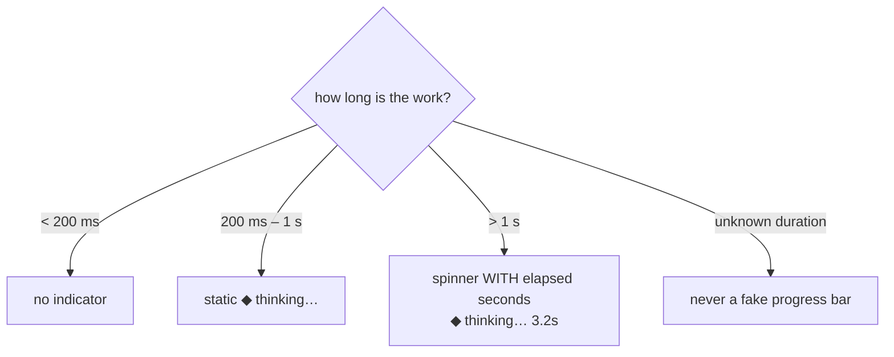

# design.md — Visual Identity

**Status:** Derived from `neuropaca-v4.html` (product) and `neuropaca-overview.html` (overview site).

Two related looks that share the accent language:

| Identity | Where | Look |
| --- | --- | --- |
| **Product** | the daemon's `rich` terminal output | dark, terminal-native |
| **Overview site** | documentation + public pages | lighter, glass cards |

---

## 1. Principles

| # | Principle | In practice |
| --- | --- | --- |
| 1 | **The terminal is the product.** | Anything that can't survive at monospace on a dark background isn't part of the system. |
| 2 | **Instrument, not dashboard.** | Dense, precise, calm. No big hero numbers, no gradients-as-decoration. |
| 3 | **Silence is the default.** | Good design here is measured by how rarely the user is interrupted. |
| 4 | **Colour carries meaning.** | Every hue maps to a semantic. `relevance_score` and pressure are always shown, never a bare assertion. |
| 5 | **Dark-first.** | The user works in a dark terminal at night. |

---

## 2. Typography

| Role | Family | Where |
| --- | --- | --- |
| Display | **Syne** (700, 800) | Page titles, section headers |
| Mono / body | **JetBrains Mono** (300–500) | The primary face — terminal, code, data, all CLI rendering |
| Editorial | **Instrument Serif** (italic) | Hero statements and pull quotes only |
| Overview site sans | Inter · Space Grotesk | The lighter overview/marketing pages only |

Terminal alignment comes from **column arithmetic, never glyph widths**. Box-drawing characters are safe; ligature-dependent layouts are not.

---

## 3. Colour

### 3.1 Product (dark) — from `neuropaca-v4.html`

| Token | Hex | Use |
| --- | --- | --- |
| `bg` | `#0f1117` | base plane |
| `bg2` | `#161b27` | panels |
| `bg3` | `#1e2535` | nested panels, table headers |
| `bg4` | `#252d3d` | hover, selection |
| `border` | `rgba(255,255,255,0.07)` | default dividers |
| `border2` | `rgba(255,255,255,0.13)` | emphasised edges |
| `text` | `#e8eaf0` | body, headings |
| `muted` | `#7a8099` | labels, metadata, captions |

### 3.2 Semantic accents

| Token | Hex | Means |
| --- | --- | --- |
| `accent` (blue) | `#6c8fff` | primary action, links, system identity |
| `accent2` (violet) | `#a78bfa` | insight, inference, model output |
| `accent3` (green) | `#34d399` | healthy, complete, protected, success |
| `accent4` (orange) | `#fb923c` | load, pressure building, caution |
| `accent5` (pink) | `#f472b6` | drive, anomaly, unusual pattern |
| `green` (terminal) | `#00ff88` | **reserved** — proof the daemon is alive (prompt / heartbeat) only |
| `red` | `#f87171` | error, danger, abstract/interface, prune |

> `#00ff88` is used for **exactly one thing**. Using it anywhere else destroys the signal.

### 3.3 Layer palette (from the class diagram)

| Layer | Hex |
| --- | --- |
| L1 Core | `#34d399` |
| L2 Sensing | `#6c8fff` |
| L3 Diagnosis | `#fb923c` |
| L4 Learning | `#a78bfa` |
| L5 Drive | `#f472b6` |
| L6 Idle Cognition | `#38bdf8` |
| L9 Interface | `#fbbf24` |
| L10 Orchestration | `#e879f9` |
| Abstract / interface | `#f87171` (square dot) |

### 3.4 State scales

**`relevance_score` (0–10)** — shown on graph nodes:

| Range | Label | Colour | Glyph |
| --- | --- | --- | --- |
| ≥ 7 | Protected — kept, replayed often | `accent3` | 🔒 |
| 4–7 | Keep | `accent` | ↔ |
| 0–3 | Prune candidate — graph cleanup | `red` | ✂️ |

**Pressure (0 → threshold):**

| Range | Colour |
| --- | --- |
| below 40 % | `muted` |
| 40–99 % | `accent4` |
| at/over threshold | `red` bold |

**Signal types:** `FOCUS_SESSION` green · `DISTRACTION` pink · `HIGH_LOAD` orange · `IDLE` muted.

### 3.5 Overview site (light) — from `neuropaca-overview.html`

`bg` `#eef2fb` · `text` `#1a1d2e` · `text2` `#4b5280` · `blue` `#4f6ef7` · `violet` `#8b5cf6` · `green` `#10b981` · `amber` `#f59e0b`. Glass cards, 20 px radius. **This palette is for documentation and the public site only — never product UI.**

---

## 4. Iconography

ASCII / Unicode only — must render in any terminal.

| Glyph | Means |
| --- | --- |
| `◆` | NeuroPACA speaking (the system's voice marker) |
| `$` | user input / prompt |
| `✓` | success, healthy, complete |
| `⚠` | warning, needs review |
| `✕` | error, failed |
| `🔒` | protected (score ≥ 7) |
| `✂️` | prune candidate (score ≤ 3) |
| `↔` | compressible (score 4–7) |
| `●` / `○` | live / stopped |
| `[DRY]` | an action that did **not** happen |

---

## 5. Voice & microcopy

| Rule | |
| --- | --- |
| **Specific over generic.** | "webpack has been at 94 % for 41 minutes" beats "high CPU detected." |
| **Cite the evidence.** | Every claim names the nodes or metrics behind it. |
| **Express uncertainty honestly.** | "Probably" is correct when confidence is 0.4. |
| **No anthropomorphic filler.** | No "Oops!", no apologies for existing, no exclamation marks. |
| **Say what will happen before it happens.** | Action prompts state the effect, the target, and whether it is reversible. |
| **Admit when there's nothing to say.** | "No patterns yet — I've been running 3 days." is the correct early answer. |

Example system response:

```
◆ webpack --watch has been at 94% CPU for 41 minutes.
  It starts when you save in ~/src/app — 3 sessions this week.
  based on   webpack · ~/src/app · focus_session
  confidence 0.82
```

> **Provenance is mandatory — a response without it is a bug.**

---

## 6. Progress & latency

CPU inference takes seconds. Design for it.



---

## 7. Shell prefixes

| Prefix | Meaning |
| --- | --- |
| `$` | ask — natural language, grounded in the behavioural graph |
| `$?` | diagnose — same as `$`, plus a live system snapshot |
| `$!` | emergency — immediate autonomous action |
| `$$` | safe — backup + verify before acting |

`ask` / `diagnose` answer **only** from the behavioural graph, behind a hard
grounding gate. A question *about NeuroPaca itself* — how the graph is stored,
what a layer does, where turns live — has nothing to match there. The `chat`
verb (B11) is that path: retrieval over the repo's own Markdown docs
(`interface/knowledge.py`, zero-inference lexical match) plus the graph plus a
live snapshot line, answered by the interactive model free-decoded. An answer
not backed by a doc or a graph node is **flagged** as general knowledge, never
suppressed. `neuropaca chat "…"` from a normal shell; a bare line is `chat` in
the interactive shell (below).

### 7.1 The interactive shell (B10 · `chat` added B11)

`$` and `!` are hostile to a real shell — `$` opens a variable, `!` opens
history expansion — so the prefixes above have to be quoted (`neuropaca "$! …"`).
Running `neuropaca` with **no arguments** in a terminal opens a `neuropaca>`
prompt where the line is read by us, not the shell, so the sigils are typed
bare. Every line is translated to the argv the console script already accepts
and run through the same code path (`interface/repl.py` → `cli._run_once`) — the
client stays thin. The one convenience beyond the sigils: a line that is not a
recognised verb and carries no sigil is sent as a `chat` question (B11), so you
can just type `how is the graph stored` and get an answer from the daemon.

| Typed in the shell | Runs |
| --- | --- |
| `how is the graph stored` | a bare line with no verb → `chat` |
| `chat "…"` | project-doc + general Q&A, explicitly |
| `$doctor`, `$health`, `$insights`, … | a `$` + verb → that verb |
| `!ask what's slow` | a `!` + verb, then free text |
| `?why is the disk full` | a leading `?` → `diagnose` |
| `$ …`, `$? …`, `$! …`, `$$ …` | the raw prefixes, unquoted |
| `help`, `quit` | the full guide (also `neuropaca help`) / leave |

---

*Related: [PRD.md](PRD.md) · [Architecture.md](Architecture.md) · [rules.md](rules.md) · [phases.md](phases.md) · [memory.md](memory.md)*
