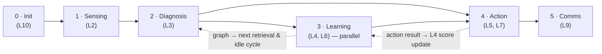
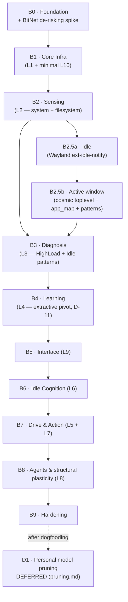

# phases.md — Build Roadmap

**Status:** Draft · Derived from the "Full System Workflow" in `neuropaca-v4.html` and the layer dependency chain in `Architecture.md`.

---

## The runtime lifecycle (what the finished system does)

| Phase | Layer | What happens |
| --- | --- | --- |
| **0 · Init** | L10 | Boot. Load the BitNet model via llama.cpp. Register the 8 modules. Start the EventBus. |
| **1 · Sensing** | L2 | Passive collection every 60 s — CPU, RAM, disk, temp, processes, network, logs. Published async; all modules subscribe. |
| **2 · Diagnosis** | L3 | Correlate signals, filter noise, threshold decisions. Local LLM only for complex cases. |
| **3 · Learning** *(parallel)* | L4, L6 | Update `relevance_score`s in the graph (Hebbian co-occurrence). The DMN replays nodes and consolidates the graph during idle. Raw sensor buffers purged past TTL. *(Model weight adaptation is deferred — `pruning.md`.)* |
| **4 · Action** | L5, L7 | Pressure accumulates; safe actions fire silently at low threshold, dangerous ones need synchronised spikes or a terminal prompt. Safety gate: sandbox, backup, rollback. |
| **5 · Comms** | L9 | Filter, notify only when needed, format `$` responses, tray icon, daily report. |

- **Feedback loop:** action result → L4 score update → graph → next retrieval and next idle cycle reflect the outcome.
- **Override channels:** `$` / `$?` / `$!` (skips L3+L4) / `$$` (full backup + verify).

---

## Build order

Each step produces a **runnable, demonstrable daemon**. Build against the dependency chain, not by layer number.

### Status at a glance

| Step | Scope | State |
| --- | --- | --- |
| B0 | Foundation + BitNet spike | ✅ done (`dda0fb0`); coherence FAILED → D-11 extractive pivot; RAM 1.39 GB accepted |
| B1 | Core infra (L1 + minimal L10) | ✅ merged (PR #1); 60-min soak conditional pass (T2) |
| B2 | Sensing (L2) | ✅ merged (PR #2); 24 h soak accepted on 11 h partial (T3) |
| B2.5a | Idle (Wayland) | ✅ done; live-verified on cosmic-comp |
| B2.5b | Active window + `app_map` + focus/distraction patterns | ✅ done (D-10); ⏳ active-window live-read on target box carried |
| B3 | Diagnosis (L3) | ✅ merged (PR #3); exit signed off |
| B4 | Learning (L4) | ✅ merged (PR #6); ⏳ full 1 h `soak_test_b4.py` on target box carried |
| B5 | Interface (L9) | ✅ done (`b5-interface-l9`) — unix-socket IPC + thin CLI + dual-model routing (D-12); all 3 exit criteria validated on the target box (real Qwen2.5-3B Q4: grounded, ~4.7 GB concurrent, ~3.1 tok/s) |
| B6 | Idle Cognition (L6) | ✅ merged (PR #8) — `DefaultModeNetwork` + `GraphMemory` consolidate/link-orphan/prune-stale + extractive proactive idle-thought grammar (`{subject, object, query_template}`) + L9 `proactive` surfacing; `core/context.py` shared serialiser (A8); all 3 exit criteria validated on the target box (D-13) |
| B7 | Drive & Action (L5 + L7) | 🟡 built (`b7-drive-action-l5-l7`, D-14) — `PressureAccumulator` (two sources, exact half-life decay, set-test corroboration) + `SafetyGate` / sandbox / quarantine / JSONL audit / headless confirmation handshake + Notification·MemoryWrite·FileWrite·RunCommand; `$!` / `$$` live. **Exit criteria 1–4 validated on the target box**; criterion 5 = the 24 h dry-run soak, running since 2026-09-01 16:48 IST. 288 pytest + 14 stress + 9 integration green |
| B8–B9 | Agents & structural plasticity → Hardening | ⬜ not started |
| D1 | Personal model pruning | ⏸ deferred to after B9 |

---

### B0 · Foundation
Repo skeleton per `Architecture.md §15`; `pyproject.toml`, `uv` lockfile, `ruff` + `mypy` + `pre-commit`, CI. `core/logging.py`, `core/errors.py`.

**De-risking spike (highest risk):** benchmark BitNet b1.58 2B4T via llama.cpp on the target machine — RSS after load, tokens/sec, thermal behaviour over 30 min. Then the coherence test (`problems.md` 1.13, `rules.md §4.1`), run as a **controlled ablation over context size** (K = 1 / 3 / 5 / 8 distilled nodes): ~20 synthetic `(signal + K nodes)` fixtures per K, through a GBNF-constrained schema with `cited_nodes` locked to that prompt's aliases, greedy. Report valid-parse rate, citation-accuracy(K) as a curve, and correct-abstain rate on deliberately weak inputs. Set `_build_context()`'s production K at the knee.

| If… | Then… |
| --- | --- |
| citation accuracy can't reach ~80 % at any K | 3B Q4 fallback for `$?` |
| it doesn't fit the RAM/latency budget | L4/L6/L9 all need a fallback |

### B1 · Core Infrastructure (L1 + minimal L10)
`Event`/`EventType`, `EventBus` (bounded queue, subscriber isolation → `SYSTEM_ERROR`), `Node`/`Edge`/enums, `GraphMemory` (CRUD, `find_related`, atomic save, `asyncio.Lock`, score recalculation, `consolidate`, `prune`), `Config` + validation, `BaseModule` ABC, `SystemHealth`, `InferenceBackend` protocol + `BitNetRuntime` skeleton + `FakeInferenceBackend`, `NeuroPACAOrchestrator`, `Scheduler`, `daemon.py`.

**Exit:** daemon starts, runs an idle event loop, holds a graph, `SIGTERM`s clean with a flat RSS over a 1 h soak. 10 k-node graph loads < 2 s, `find_related(depth=2)` < 50 ms. Concurrent writers serialise correctly.

### B2 · Sensing (L2)
`MetricSnapshot`, `BaseCollector`, `XMetricCollector` (one `asyncio.Task` per collector, ring buffer, per-collector failure isolation), `SystemMetricCollector`, `FileSystemCollector` (watchdog). `Clock` protocol + `FakeClock`. `build_modules()` factory + orchestrator wiring. `anomaly_score` is hardcoded `0.0` in L2 — all baselining is L3 (D-7, Architecture.md §4).

> **`ActivityCollector` + `get_idle_seconds()` + `IDLE_DETECTED` / `ACTIVITY_DETECTED` + `FocusSessionPattern` / `DistractionPattern` are DEFERRED to B2.5** (D-7, D-8, `problems.md` 1.7). The target machine is Wayland + COSMIC with no unified idle API — a dedicated spike, not a collector. B2 ships **system + filesystem collectors only**. B6's DMN will trigger on a synthetic **CPU < 5%** event from `SystemMetricCollector` instead of `IDLE_DETECTED`.

**Exit:** 24 h soak < 1 % mean CPU, RSS flat, buffer provably bounded, killing one collector leaves the others running.

### B2.5 · Process & Activity Sensing *(spike + build, inserted D-8, split D-9)*

**B2.5a · Idle (DONE 2026-08-31).** `IdleSource` protocol + `WaylandIdleSource` (`ext-idle-notify-v1` via pywayland, `loop.add_reader`, no thread) + `FakeIdleSource`; `ActivityCollector` (BaseModule) → real `IDLE_DETECTED` / `ACTIVITY_DETECTED`, superseding the D-7 CPU-derived stand-in; `top_processes` (names only) in `SystemMetricCollector`. `pywayland` is a `[activity]` optional extra, lazy-imported, self-disables when absent.
> **Exit:** `FakeIdleSource` drives the two edges (edge-triggered, degraded path self-disables + `SYSTEM_ERROR`, no crash); live-verified on cosmic-comp.

**B2.5b · Active window (DONE 2026-08-31).** Part 1: vendored `zcosmic_toplevel_info_v1` XML + `pywayland.scanner` dep chain; `WindowSource` + `EventType.APP_SWITCH`; `ActivityCollector` publishes it (live-verified). Parts 2-4 (D-10): `diagnosis/app_map.py` (`AppMap` — dict + glob, `data/app_map.default.toml`, loaded in `SignalCorrelator.initialize()`); `SignalCorrelator` subscribes `APP_SWITCH`, synthesises the `"activity"` pseudo-collector snapshot (classified `domain`), upserts `app:<id>` + `PART_OF` domain edge; `FocusSessionPattern` + `DistractionPattern` (pure, edge-triggered, window-shaped); `bridge_value` live in `GraphMemory._recalculate_chunk_unsafe`. 24 new tests + `test_b2_5_recorded_fixtures.py` (focus/distraction/calm traces).
> **Exit:** ✅ the two patterns fire on the recorded fixtures and stay silent on the negative; classification is dict + glob only, zero inference in the poll path; `BasePattern.evaluate` unchanged. ⏳ active-window live-read on the target box — carried from part 1's verified `APP_SWITCH{app_id:"brave-browser"}`; re-run `scripts/check_b2_5b_live.py` after merge.

### B3 · Diagnosis (L3)
`Signal` / `SignalDraft`, `BasePattern` (pure, synchronous, edge-triggered), `MetricBaseline` (rolling mean/stddev, confidence-scaling only), `SignalCorrelator` (per-collector `Dict[str, Deque[MetricSnapshot]]`, `_update_graph` via `upsert_node` before publish, publishes `SIGNAL_CORRELATED` + `MEMORY_UPDATED` + `PATTERN_DETECTED`), the **two** patterns `HighLoadPattern` (`cpu > 90` for ≥ 5 min) and `IdlePattern` (`cpu < 5` for ≥ `idle_threshold`), pattern contract suite. `GraphMemory.upsert_node` and `Config.correlation_window_seconds = 1800` land here (D-8). Absolute blueprint thresholds trigger; `MetricBaseline` only scales `confidence`. `FocusSession` / `Distraction` are **not** in B3 — see B2.5.

**Exit:** `HighLoadPattern` and `IdlePattern` each fire against a recorded fixture and stay silent against a negative fixture; a synthetic 5th pattern registers with zero changes to `SignalCorrelator`; **zero inference calls in L3**; the per-collector deques are provably bounded; `_update_graph` never resets an existing node's `relevance_score`.

### B4 · Learning (L4) *(D-11 — extractive pivot)*
Real `LlamaCppBackend` (lazy `import llama_cpp`, self-disables without the wheel / model — `[llama]` extra), `BitNetRuntime.load_model_async` (lazy, dedicated executor), `Insight` + `learning/prompts.py` (GBNF: `{cited_node_id: <alias|null>, insight_category: routine|anomaly|distraction}`), `BitNetPlasticity` (subscribe `SIGNAL_CORRELATED`; gate on `confidence < 0.7` / `is_busy` / no-nodes / **Jaccard > 0.8** vs the bounded `(Signal, Insight)` deque; one greedy grammar-constrained call; store as an `INSIGHT` node edged to its cited node; publish `INSIGHT_GENERATED`), `GraphMemory.reinforce_edge` for Hebbian `weight += 0.01` on existing co-occurrence edges (Scheduler keeps `recalculate_importance`).

> B0 (`dda0fb0`): 2B4T free-text FAILED at every K (grounded_rate 0.00) → the model only classifies + selects, never writes. RAM 1.39 GB accepted (16 GB host).

**Exit:**

| ✅/⏳ | Criterion |
| --- | --- |
| ✅ | backend loads lazily / self-disables cleanly |
| ✅ | no loop stall > 50 ms across a 10 s inference (`--infer-stress` + `test_l4_executor_isolation.py` — 10 s block + 10k-event L3 storm, max lag ~1.6 ms, real llama.cpp) |
| ✅ | every stored insight `traces_to_evidence()` |
| ✅ | `test_gating_storm.py` — 1 000 signals, >50 % shed via a real mix of confidence/is_busy/Jaccard, buffer clamps at 64 |
| ✅ | `test_hebbian_plasticity.py` — 50-citation `_store_insight`, +0.01 on existing edges only, one lock, ~1.4 ms |
| ✅ | `scripts/soak_test_b4.py` smoke: real model RSS **1477 MiB flat** over 1215 replay cycles, 1 insight (novelty collapses the rest) |
| ⏳ | the full 1 h `soak_test_b4.py` on the target box |

### B5 · Interface (L9) — *done `b5-interface-l9`, all exit criteria validated on the target box*
`Message` + `MessageRole` (B8), `InterfaceLayer` (`on_user_input`, `_build_context`, `_generate_response`, `send_to_user`, `on_insight_generated`), RAM-only history + on-disk-absence test, insight priority filter + daily cap (local-midnight reset via `Clock.now()`) + surface-once (`Node.surfaced_at`, graph schema v2), **unix-socket IPC** (`asyncio.start_unix_server`, JSONL, `$XDG_RUNTIME_DIR/neuropaca.sock`), thin **CLI** (`neuropaca ask|diagnose|health|insights`; daemon renamed `neuropacad`), `rich` renderers, shell prefixes `$`/`$?` (routed) · `$!`/`$$` (reserved → B7).

**A-blockers resolved:** A1 `GraphMemory.search_by_label` (O(N) substring + hub-slug, zero embeddings). A2/A3 `$?` GBNF answer schema + `parse_answer` grounding gate + `FakeInferenceBackend` schema-aware fake. A4 `rich` dep approved. A5 `$!`/`$$` reserved. A6 health bridge = `SYSTEM_HEALTH_REQUEST`/`SYSTEM_HEALTH_REPORT` (L9 never imports L10). B4 `max_context_tokens*4` char truncation. **D-12** dual-model routing (BitNet loop + Qwen2.5-3B Q4 interactive, one `_inference_lock`, ~3.4 GB peak — PRD §9).

**Exit:**

| ✅/⏳ | Criterion |
| --- | --- |
| ✅ | `$ what's using my CPU` returns an answer citing real node labels (`test_socket_query_answers_dollar_with_a_grounded_node_label`, `test_cli_end_to_end_against_a_live_socket`) |
| ✅ | `conversation_history` provably absent from every file on disk (`test_conversation_history_is_ram_only_and_never_on_disk` — scans `tmp_path.rglob`) |
| ✅ | every IPC log line `redact()`-ed (`test_ipc_payloads_are_redacted_in_logs`) |
| ✅ | `$!` / `$$` refused until B7; health bridge round-trips over the bus; surface-once survives a restart |
| ✅ | CLI < 100 ms for non-inference commands — **`scripts/validate_b5_latency.py` on the target box: 0.72 ms max over 100 `health` round-trips** |
| ✅ | real Qwen2.5-3B-Instruct Q4_K_M on the target box — **`scripts/validate_b5_real_model.py`: GBNF parse ✓, grounding gate ✓ (`"esbuild-service is using the most CPU right now."`, conf 0.94, exact label match), concurrent RSS 4.63 GB — ~29 % of the 16 GB box, ~3.1 tok/s.** The 3.5 GB figure was a bad estimate; PRD §9 corrected to the measured ~4.7 GB peak. |

**Validation-driven fixes:** `$?` grammar `ws ::= " "?` (a weak model looped on whitespace and never closed the JSON); `gc.collect()` before the interactive model load; `interactive_model_context_tokens` 4096→2048 + interactive `n_batch=128` (RAM).

### B6 · Idle Cognition (L6) — *built + target-box validated (`b6-idle-cognition-l6`, D-13); exit review → merge pending*
`DefaultModeNetwork` (`idle/dmn.py`, `BaseModule` `"idle"`, start order L4→**L6**→L9) — cancellable `idle_task` started on `IDLE_DETECTED`, cancelled within one tick on `ACTIVITY_DETECTED`; the whole cycle runs under `asyncio.timeout(dmn_cycle_wall_clock_seconds)`. **Reminiscence:** `GraphMemory.consolidate()` (duplicate = identical `node_type` ∧ case-fold `label`; older `created_at` survives, `access_count` sums, `relevance_score` averages, edges rewire, 11 hubs skipped — one `_lock` cycle per merge), `link_orphan_nodes()` (degree-0 → `RELATED_TO` `YOU`), `prune_stale_nodes(ttl)` (score→0 or past TTL; fresh nodes spared; the Scheduler keeps `recalculate_importance`). **Imagination:** top-K nodes by score → ≤ `dmn_max_inferences_per_cycle` **strictly extractive** calls to the loop model (`{subject, object|null, query_template}`, `learning/prompts.py`) → `IDLE_THOUGHT` node + `INSIGHT_GENERATED{category:"proactive"}`. 48 h TTL via `dmn_idle_thought_ttl_hours`. L9 surfaces `proactive` once through the B5 `surfaced_at` path. **D-13** resolves `problems.md` 1.13 for L6 (extractive, not the Qwen model), A8 (`core/context.py` shared serialiser).

**Exit:**

| ✅/⏳ | Criterion |
| --- | --- |
| ✅ | returning to the keyboard cancels the cycle with no partial corruption (`test_activity_cancels_..._without_corruption`, `test_stop_cancels_an_in_flight_cycle`). **Target box (`scripts/validate_b6_cancel.py`): 0.1 ms** to fully unwind a cycle running mid-consolidate (12 000 dups / 22 011 nodes), `_lock` released, zero dangling edges, hubs intact, second `consolidate()` finished the remaining 11 894 merges cleanly. |
| ✅ | a cycle never exceeds its wall-clock budget (`asyncio.timeout`) or its inference budget. **Target box (`scripts/validate_b6_budgets.py`): TimeoutError at 10.00 s, capped at 2 idle thoughts** (3rd inference cut), `_errors=0`, daemon healthy. Unit: `test_cycle_abandons_cleanly_..._budget`, `test_cycle_respects_the_inference_budget`. |
| ✅ | `consolidate()` shrinks a duplicate-heavy fixture (`test_consolidate_shrinks_a_duplicate_heavy_fixture`, `test_merge_math_keeps_oldest_created_at_and_rewires_edges`). **Target box (`scripts/validate_b6_consolidate.py`): 500 merges in 2 510 ms** over ~10.5k nodes, `node_count` −500 exact, summed `access_count` + averaged `relevance_score` correct, every duplicate edge rewired. |

### B7 · Drive & Action (L5 + L7)
`PressureEntry`, `PressureAccumulator` (two independent sources, `decay()` on a timer, low/high thresholds, `_publish_if_over_threshold`), `$ pressure` view. `BaseAction`, safety gate (sandbox, backup, rollback), JSONL audit, `NotificationAction`/`MemoryWriteAction`/`FileWriteAction`/`ApiCallAction` (disabled by default)/`RunCommandAction` (terminal confirmation), quarantine directory.

**Exit:** a single signal never crosses the high threshold; pressure decays to < 1 % within 10 min of the last contribution; dangerous actions cannot execute without a recorded confirmation; audit log complete for every attempt; a review period in dry-run with zero false positives before any tier goes live.

**Built (D-14).** `drive/pressure.py` (`PressureEntry` + `PressureAccumulator`: subscribes **only** `SIGNAL_CORRELATED` and `INSIGHT_GENERATED`; exponential decay on a `Clock`-driven timer *and* lazily on read; corroboration = a set test over `{diagnosis, learning}` at confidence ≥ 0.75 inside two half-lives; per-node threshold latch with hysteresis). `action/` — `base` (`BaseAction`, `ActionTier`, `ActionResult`), `gate` (`SafetyGate`, the only path to `execute()`), `sandbox` (path containment + `create_subprocess_exec`, `env={}`, own session, hard timeout), `confirm` (`ConfirmationBroker` — the headless handshake), `quarantine` (TTL backups), `audit` (JSONL, fsynced, 0600), `actions` (Notification·MemoryWrite·FileWrite·RunCommand), `executor` (`ActionExecutor`). L9: `$!` / `$$` un-reserved and relayed; new `notifications` / `confirmations` / `confirm` ops + CLI commands. Config: `pressure_threshold` split into low/high, plus decay, dry-run, tier, quarantine, api-switch, and confirmation-timeout fields. `build_modules` order is now L2→L3→L4→**L5→L7**→L6→L9.

**Deviations, deliberate:** (a) **no `ApiCallAction`** — the reserved switches exist, the class does not, so there is no code path to an outbound socket (`rules.md §5.5`, §6; `problems.md` 1.9 "leave the riskiest for last"). (b) **no autonomous dangerous action** — the high tier prompts (Architecture.md §7's own fallback) rather than acting. (c) **no `$ pressure` view** — it needs either a new event pair or L9→L5 coupling; pressure is surfaced in `neuropaca health` instead (`drive` module detail: tracked count, contributions, crossings, hottest node).

| If… | Then… |
| --- | --- |
| ✅ | a single signal never crosses the high threshold. Structural, not tuned: corroboration is a set test, so one source cannot satisfy it at any magnitude (`test_a_single_source_can_never_reach_the_high_tier`, `tests/stress/test_pressure_storm.py` at 5 000 signals). **Target box (`scripts/validate_b7_pressure.py`): 500 max-confidence L3 spikes → pressure 499.8 (167× the high threshold), tiers fired `['low']`**; L3+L4 then opened it once, sources `diagnosis+learning`. |
| ✅ | pressure decays to < 1 % within 10 min of the last contribution. **Target box: 0.0976 % of peak at ten half-lives, against the exact 0.5¹⁰ = 0.0977 %.** Unit: `test_decay_is_exactly_one_half_per_minute`, `test_pressure_falls_below_one_percent_within_ten_minutes`. |
| ✅ | dangerous actions cannot execute without a recorded confirmation. **Target box (`scripts/validate_b7_confirmation.py`, full daemon over the real socket, `action_dry_run=False` and both tiers enabled): expiry → refused; explicit denial → refused; approval → ran. Only the approved command executed.** Unit: expiry, denial, approval, unknown-id, and the "validation refuses before the human is asked" path. |
| ✅ | audit log complete for every attempt. Two lines (`attempt` + `result`) sharing a `request_id`, refusals included, and an **unwritable log refuses the action**. **Target box: 6 lines, 3/3 attempt+result pairs across the three cases.** |
| 🟡 | a review period in dry-run with zero false positives before any tier goes live. **Agreed as a 24 h dogfooding soak; started 2026-09-01 16:48 IST on the target box** under `neuropaca.soak.toml` (`action_dry_run = true` with **both** tiers enabled — everything proposed, nothing possible; real models, Wayland activity on, `watch_paths = [~/NeuroPaca]`). Acceptance: **zero false positives among high-tier proposals**, every safe-tier proposal traceable to its diagnosis spike, audit complete and effect-free. Analysed by `scripts/validate_b7_dryrun.py --require-hours 24`, which gates on window length and splits high- from safe-tier proposals for judgement. |

**Found and fixed during validation:** an expired confirmation stayed visible in L9 forever, so the next `confirm` answered a request nobody was waiting on. `ACTION_TRIGGERED` now carries the `confirmation_id` and L9 retires the prompt on it, with a timeout-based sweep behind that (regression tests: `test_a_prompt_is_retired_when_l7_stops_waiting`, `test_a_prompt_older_than_the_timeout_is_never_offered`).

### B8 · Agents & structural plasticity (L8)
`AgentSupervisor` (bounded tasks, `max_concurrent_agents`), `spawn_node()` / `kill_node()`, apoptosis after `idle_ttl = 14d`. Confirm the class shape against a full-width diagram re-export first.

### B9 · Hardening
systemd user unit, crash recovery, graph schema versioning, full `health_check()`, log rotation, 7-day soak, fault injection, egress test in CI, `neuropaca export` / `panic` / `doctor`.

---

## Deferred — after the rest of the project

### D1 · Personal model pruning
Everything in [`pruning.md`](pruning.md): the `domain_to_heads` probing spike, `relevance_score` → prune-mask generator, `load_gguf_with_mask` applied once at load, A/B quality harness (sparse vs base vs random-head-cut vs magnitude-pruned), one-command rollback. Starts as a throwaway spike in `experiments/pruning/`; promoted to `src/neuropaca/sparsity/` only if the spike shows promise. Never imported by the daemon. **Not started until B0–B9 are done and the core system has been dogfooded.**

---

## Cross-cutting

- Update `memory.md` at the end of every work session.
- Tests in the same change as the code.
- `ruff` + `mypy` clean before commit.
- No dependency added without approval.
- Nothing merged that violates `rules.md §0`.

---

*Related: [PRD.md](PRD.md) · [Architecture.md](Architecture.md) · [rules.md](rules.md) · [design.md](design.md) · [memory.md](memory.md)*
