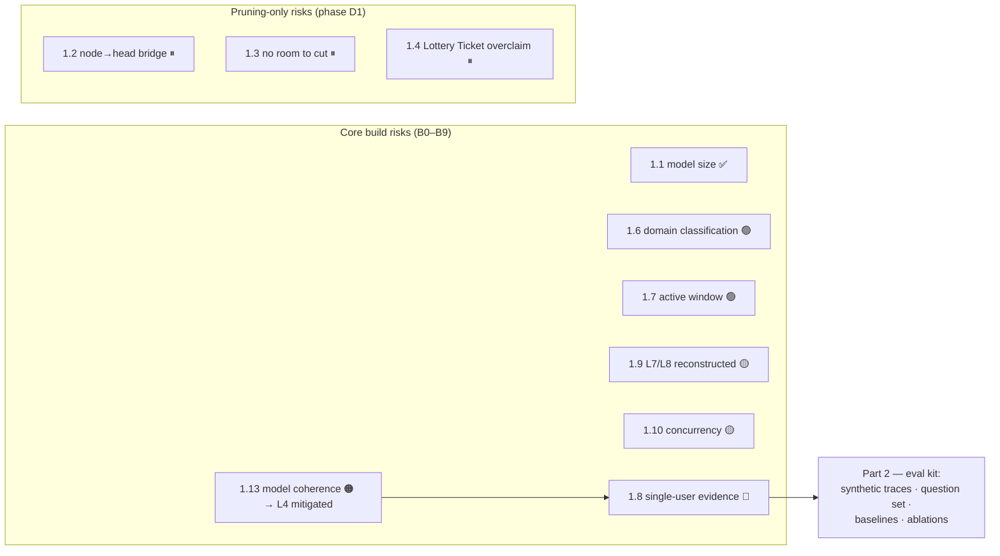

# problems.md — Problems & Risks Register

**Last updated:** 2026-08-29

This file holds three things:

| Part | Content |
| --- | --- |
| **1 · Design risks** | The hard problems we already know about, before writing code. Each in plain language, with why it matters and a concrete way to beat it. |
| **2 · Research framing** | Turning the build into a publishable project — the claim, the eval kit, what to add to the repo. |
| **3 · Testing log** | Problems found later, during build-step testing. |

**Legend:** 🔴 open · 🟡 in progress · 🟢 / ✅ resolved · 🟠 confirmed real · ⏸ deferred

---

## Part 1 — Design risks at a glance

| # | Risk (short) | Status | Applies to |
| --- | --- | --- | --- |
| 1.1 | The model we assumed (7B BitNet) doesn't exist at that size | ✅ resolved — B0 measured 2026-08-30 | core |
| 1.2 | The "graph node → model part" bridge is the weakest piece | ⏸ deferred | pruning only |
| 1.3 | A tiny model has almost no room to cut | ⏸ deferred | pruning only |
| 1.4 | Calling it a "Lottery Ticket" is a stretch | ⏸ deferred | pruning only |
| 1.5 | We never say what the weekly training trains on | ✅ resolved by removal 2026-08-29 | core |
| 1.6 | How do we sort activity into 10 topics? | 🟢 resolved (D-10, B2.5b) | core |
| 1.7 | Reading the active window is OS-specific and hard | 🟢 resolved (D-9 idle, D-10 window) | core |
| 1.8 | One user on one machine is not enough to prove anything | 🔴 open | core / research |
| 1.9 | The Action and Agents layers are guesses | 🟡 in progress | core |
| 1.10 | Concurrency traps | 🟡 in progress | core |
| 1.11 | Too big for one person / takes too long | 🟡 in progress | core |
| 1.12 | Privacy makes it hard to prove it works | 🟡 in progress | core / research |
| 1.13 | The small model loses the thread on graph context | 🟢 mitigated everywhere — L4 D-11, L9 D-12, L6 D-13 (all extractive / bounded) | core |



---

### 1.1 The model we assume doesn't exist at that size · ✅ resolved — B0 measured 2026-08-30

**B0 numbers (`dda0fb0`, `bitnet-2b4t-tq2_0.gguf`):** ~1.39 GB resident after load, ~1.55 GB after 30 min, ~17 tok/s on 16 threads, 66–72 °C. The docs' "~1.1 GB" was optimistic — corrected to ~1.4 GB in `PRD.md §9` / §F4 (D-11). Fits the 16 GB host with wide margin.

**Problem.** The docs assume a "BitNet b1.58 7B model, ~1.4 GB." The only real, released, usable BitNet b1.58 model is the **2B** one (BitNet b1.58 2B4T, ~1.1 GB). Bigger BitNet models were research numbers in a paper, not weights you can download and run. Tooling (`bitnet.cpp`, llama.cpp BitNet support) is also young and a bit fiddly.

**Why it matters.** Everything above the sensing layer depends on this model running well on a laptop CPU. If we plan around a model that doesn't exist, the whole plan is built on air.

**How to counter it.**
- ✅ Use **BitNet b1.58 2B4T** everywhere. It's real, it's small, it runs on CPU. Applied to `PRD.md` and `Architecture.md` on 2026-08-29 (~1.1 GB resident, ~0.4 GB weights).
- ✅ In the first spike (B0), actually download it, run it via llama.cpp, and measure — memory used, speed (tokens/sec), and whether the answers make sense.

---

### 1.2 The link between "graph node" and "model part" is the weakest piece · ⏸ deferred (pruning only)

> This and 1.3–1.5 apply **only** to the deferred personal-model-pruning work (`pruning.md`). They are not blockers for B0–B9.

**Problem.** The core idea is: a node's score decides which *attention heads* of the model get cut. The bridge is a table called `domain_to_heads` — "which parts of the model belong to Engineering vs Meetings vs Research." But in a small model, the parts are **not** cleanly split by topic. There is no clean "Meetings region" to cut. And to build that table you need example prompts per topic — which the graph doesn't have (it has `pytest`, `vscode`, not sentences).

**Why it matters.** This is the entire research claim. If we can't reliably say "these heads serve this topic," the pruning is basically random, and random head-cutting just makes the model worse everywhere.

**How to counter it.**
- When the deferred pruning phase (D1) starts, **do the cheap spike first**: 2B model, a hand-written table (3 topics, a few heads each), zero those heads, measure quality. A few days of work; tells us if the idea has legs before building the pipeline.
- If it works even a little: promote it, write it up.
- If it doesn't: it's already isolated as future work. The core system (claim A) stands on its own, and a documented negative result is a deliverable.

---

### 1.3 A tiny model has almost no room to cut · ⏸ deferred (pruning only)

**Problem.** BitNet is already extremely compressed (weights are just −1, 0, +1). Cutting another ~23% of a model this small, with "no quality loss" and "no retraining," is optimistic. Usually if you cut more than ~10–20% of a model's structure without any fix-up training, you can feel it.

**Why it matters.** The headline number ("~1.1 GB personal model, no measurable quality loss") might just not be achievable.

**How to counter it.**
- Don't promise a number. Measure a **curve**: cut 5%, 10%, 20%, 30% and plot quality at each point. Report where the knee is.
- Be willing to accept a small, honest quality drop in exchange for a smaller model — that's still a result.
- If needed, allow one short "recovery" pass after pruning. The rule "no retraining ever" is a nice-to-have, not a law.

---

### 1.4 Calling it a "Lottery Ticket" is a stretch · ⏸ deferred (pruning only)

**Problem.** The Lottery Ticket Hypothesis is a specific thing: find a sparse network *before training*, then *train it* to full accuracy. NeuroPACA does something different — it cuts an *already-trained* model in one shot using an outside signal. A reviewer will notice immediately.

**Why it matters.** Overclaiming a famous result is the fastest way to lose a reader's trust.

**How to counter it.**
- Call it what it is: **"usage-driven structured pruning of a personal language model."**
- Cite the Lottery Ticket paper as *inspiration* ("we borrow the intuition that most of a network is unused for any one task"), not as the method.
- This costs nothing and makes the paper stronger.

---

### 1.5 We never say what the weekly training actually trains on · ✅ resolved by removal 2026-08-29

**Problem.** The concept said "weekly, low learning rate, 1–2 epochs on buffered data." But the buffered data is rows of numbers, not text — you can't train a language model on that, and BitNet fine-tuning needs special machinery.

**Resolution.** Weekly model training is **cut from the core system**. "Passive sensing → graph → retrieval → grounded answers" is a complete story without it. If online model adaptation ever comes back, it belongs to the deferred pruning work (`pruning.md`), where the first question is "what text does it learn from?" (probably only the `$` conversations).

---

### 1.6 How do we sort activity into 10 topics? · 🟢 resolved (D-10, B2.5b)

**Problem.** The design says "classify every new observation into one of 10 domains first." With what? A lookup of `python → Engineering` is brittle (`python` could be Engineering, Research, or Learning). Asking the LLM to classify every 60-second reading breaks the rule "no model calls in the fast path."

**Why it matters.** Domain classification is the front door of the whole graph. If it's wrong or slow, everything downstream is wrong or slow.

**Resolution (2026-08-31, D-10).** `diagnosis/app_map.py` — `AppMap`, an **editable TOML rules file** (`data/app_map.default.toml`) read once at `SignalCorrelator.initialize()`. Lookup on every `APP_SWITCH` is exact `app_id` (O(1)) → exact `wm_class` (O(1)) → `path_glob` (O(k), `fnmatch`). A miss returns `None` — the activity is left unclassified, never guessed, never blocked. Zero inference in the poll path. Unknown domains / sections in the file are logged and skipped, never fatal. The graph still self-corrects over time via co-occurrence; `bridge_value` (a node's distinct `domain:*` reach) is live from here.

---

### 1.7 Reading the active window is OS-specific and harder than it looks · 🟢 resolved (D-9 idle, D-10 window)

**Problem.** Knowing "which app is focused right now" and "how long since the last keypress" is easy on some systems and genuinely hard on others (modern Linux desktops especially). The blueprint just says "platform-specific."

**Why it matters.** Two of the four behavioural patterns (`FOCUS_SESSION`, `DISTRACTION`) need the active window. Those are also the patterns that map to topics. No active window → half the behavioural vocabulary is gone.

**Resolution (2026-08-31, D-9 · spike `spikes/b2_5_activity/`).** The APIs on the target box (Wayland/COSMIC) are Wayland protocols, not D-Bus/X11:

| Capability | Solution | State |
| --- | --- | --- |
| Idle / "last keypress" | `ext-idle-notify-v1` (`ext_idle_notifier_v1 v2`, bundled in `pywayland`) — edge events `idled` / `resumed`, `loop.add_reader` on the compositor fd, no thread. `org.freedesktop.ScreenSaver` (cosmic-idle) has no idle-query method; XWayland `_NET_ACTIVE_WINDOW` → `0x0`. | DONE (B2.5a), live-verified |
| Active window | `zcosmic_toplevel_info_v1 v3` (`app_id` / `title` / `state=activated`), cosmic XML vendored + `pywayland.scanner` resolving the full dependency chain (`sensing/activity/_protocols/`). `WaylandWindowSource` → `APP_SWITCH`. L3 consumes it: `AppMap` classification + `FocusSessionPattern` / `DistractionPattern` (D-10), fixture-verified. | DONE (B2.5b), live-verified `app_id:"brave-browser"` |

---

### 1.8 One user on one machine is not enough to prove anything · 🔴

**Problem.** The whole system is designed for a single person on a single laptop, with private data that can't be shared. "Insight precision ≥ 40%" rated by the person who built it, on their own machine, is not evidence a reviewer accepts.

**Why it matters.** Without a way to measure and compare, it's a cool demo, not research.

**How to counter it.** Build a real **evaluation kit** as a deliverable (see Part 2):

| Deliverable | What it is |
| --- | --- |
| Synthetic activity generator | Fake but realistic sensor traces for scripted scenarios (deep-focus day, distracted day, disk-fills-up). Reproducible, shareable, no private data. |
| Question set + reference answers | A small set to score the assistant against. |
| Baselines to beat | the full uncut model, a randomly-cut model of the same size, a model cut by weight size, plain log search with no graph. |
| Ablations | turn each piece off one at a time and show the number drops. |
| External runs | if possible, 3–5 other people run it for a week for informal feedback. |

---

### 1.9 The Action and Agents layers are guesses · 🟡

**Problem.** The class diagram is cut off at the right edge. Layers L7 (Action) and L8 (Agents) have no boxes — we reconstructed them from two event names and a note. L7 is the layer that can *change files and run commands*.

**Why it matters.** You don't want to guess the design of the one part that can damage the user's system.

**How to counter it.**
- Get a **full-width re-export** of the diagram from the source before building L7 or L8.
- Until then, mark everything about L7/L8 in the docs as "reconstructed — verify" (already done in `Architecture.md §11b`).
- Build the safe parts of L7 first (notifications, memory writes). Leave file-writes and command-running for last, behind the strictest gate.

---

### 1.10 Concurrency traps · 🟡

**Problem.** The system is one process with one event loop, one shared graph, and background inference. Easy ways to break it: a graph method that calls another graph method while holding the lock (freezes forever); the idle "dreaming" job getting cancelled halfway and leaving the graph half-edited; any code touching the raw graph object from the wrong place.

**Why it matters.** These bugs don't show up in a quick test — they show up after hours of running, and they corrupt memory.

**How to counter it.**
- One writer, one lock, and the lock is only ever held for a single small graph operation — never around a whole loop.
- A test that **cancels the idle job at every possible pause point** and checks the graph is still valid.
- The raw graph object is private. Nothing outside `GraphMemory` may touch it — enforced at review.

---

### 1.11 Too big for one person / takes too long · 🟡

**Problem.** Nine build steps (B0–B9), several needing multi-day soak tests, plus production plumbing (systemd, log rotation) that adds nothing to the research — and then the deferred pruning phase (D1) on top.

**Why it matters.** Six to twelve months solo for the core system alone.

**How to counter it.**
- **Split the work in two.** "Core system" = build steps B0–B9 + the evaluation kit → this is the first paper. "Deferred" = phase D1 (pruning, `pruning.md`) → a follow-up, only if the core system proves useful.
- Don't let a 7-day soak test block a paper submission.
- When D1 eventually starts, do its cheap spike first (section 1.2) — fail fast if it's going to fail.

---

### 1.12 Privacy makes it hard to prove it works · 🟡

**Problem.** Zero data leaves the machine, raw data is deleted after use, personal prompts can't be shared. Good for the product — bad for letting anyone else check the results.

**Why it matters.** A result nobody can reproduce is a weak result.

**How to counter it.**
- A separate **research mode**: synthetic data + a full event trace written to a file, clearly walled off from the real always-on daemon.
- Share the synthetic traces and the harness so others can re-run the experiments even without your real data.

---

### 1.13 The small model loses the thread when you feed it graph context · 🟢 confirmed real (B0) — mitigated for L4 (D-11), L9 (D-12), and L6 (D-13)

*(This is separate from 1.2 — that one is about pruning the model's weights and is deferred. This one is about prompting the model with graph facts, and it affects L3, L4, L6, and L9 in the core build.)*

**B0 outcome (2026-08-30, `dda0fb0`).** The risk is real. The grammar-constrained ablation (`coherence-20260830T191626Z.json`, `tq2_0` quant, 20 fixtures per K) found:

| Metric | Result | Target |
| --- | --- | --- |
| citation_accuracy (K=1) | **0.69** | 0.80 |
| citation_accuracy (K≥3) | 0.25–0.34 | 0.80 |
| grounded_rate (every K) | **0.00** — the model's sentence never named a cited node | — |
| correct_abstain | **0.00** — it never declined a weak input | — |
| valid-parse | 0.75–1.0 — so the *grammar mechanism* works; the *free-text reasoning* does not | 1.0 |

**Mitigation — L4 (D-11): the extractive pivot.** Stop asking for a sentence. The insight grammar emits exactly `{"cited_node_id": <one of the K aliases | null>, "insight_category": "routine"|"anomaly"|"distraction"}`. The model does one classification + one selection, both enum-constrained — the two jobs it *can* do (valid-parse 0.95–1.0 at K≥3). The human-readable insight string is a **template** filled from the cited node's label + the signal type, never generated. `null` cited node = abstain = discard.

**L9 `$?` — RESOLVED (D-12, B5, 2026-09-01, validated on the target box).** Dual-model routing: **Qwen2.5-3B-Instruct Q4_K_M** serves the interactive `$` / `$?` path (`BitNetRuntime` gained an optional second backend, one `_inference_lock`); 2B4T stays on the always-on loop. `$?` runs behind a per-call GBNF grammar (`{insight, cited_nodes, confidence}`, `ws ::= " "?`) and a hard `parse_answer` grounding gate — ungrounded → extractive template. **`scripts/validate_b5_real_model.py` on the 16 GB target box:** Qwen wrote `"esbuild-service is using the most CPU right now."` (conf 0.94, grounded, exact label) — coherent where 2B4T parrots the few-shot. Cost: ~3.1 tok/s, +3.25 GB resident (~4.7 GB concurrent — PRD §9).

**Mitigation — L6 idle thoughts (D-13, B6).** Resolved by going fully extractive, same shape as D-11 — *not* the interactive Qwen model (L6 is background, on the always-on loop). The DMN's "imagination" asks the loop model for `{"subject": alias, "object": alias|null, "query_template": <closed enum>}`; the follow-up question is rendered from a Python template (`PROACTIVE_TEMPLATES`), never generated. A relational template without a distinct object is discarded. Stored as an `IDLE_THOUGHT` node, surfaced once by L9. The model only selects — the two jobs the B0 ablation showed it *can* do.

**Problem.** BitNet b1.58 2B4T is a 2-billion-parameter, 1.58-bit model. Feed it a loosely-connected set of graph nodes plus a raw signal and ask it to reason, and it drifts: generic answers, invented file paths, cites nodes that weren't in the prompt, or just rambles. Small quantised models are pattern-matchers, not analysts.

**Why it matters.** L4 insights, L6 idle thoughts, and L9 `$` answers all depend on the model doing something useful with graph context. If the output is generic or hallucinated, the whole "grounded answer" promise fails.

**How to counter it — one method: make the JSON schema *be* the task.**

Every call to `BitNetRuntime` is a **constrained generation against a task-specific GBNF grammar** (llama.cpp supports this). The grammar encodes the output shape, the legal citations, and an escape hatch. The model only fills in blanks you've already bounded. This one mechanism does four jobs at once:

| Gives you | How |
| --- | --- |
| Valid structure, always | grammar forbids malformed output — no attention wasted on formatting |
| **Zero hallucinated citations** | the `cited_nodes` field is an *enum of exactly the node aliases in the prompt* — the model cannot name one that isn't there |
| A safe "I don't know" | the schema allows `null` / `abstain` — small models hallucinate worst when forced to answer |
| Forced narrow framing | you cannot write a grammar for "analyse my system," so the schema *makes* the task small |

Applied:

1. **One prompt + one grammar per task**, in `learning/prompts.py`. Example (insight generation):
   ```
   Signal: HIGH_LOAD (conf 0.82)
   Facts:
     [n1] webpack   · APP  · score 8.1 · cpu_avg 94%
     [n2] ~/src/app · FILE · score 7.4
     [n3] focus_session · SESSION · score 6.0
   Write one sentence about this signal, grounded in the facts. If they don't support one, abstain.
   ```
   Grammar forces exactly (schema skeleton is a static template; only the `n1|n2|n3` enum is spliced in per call):
   ```json
   { "insight": "<one sentence>" | null,
     "cited_nodes": ["n1"|"n2"|"n3", ...],
     "confidence": 0.0-1.0 }
   ```
   `n1..n3` are **local aliases** (mapped back to real node IDs after parsing) — no GBNF escaping of `file:/abs/path` strings. The grammar string is assembled *before* `_inference_lock` is taken.
2. **Distilled input only.** `build_context_from_nodes()` emits one terse line per node (`alias · label · type · score · 1–2 attrs`). The model never sees a `MetricSnapshot` or a raw subgraph. Top-K ranked by score, deduped by domain; K comes from the B0 ablation (below), not a guess. The signal/question goes **last** in the prompt.
3. **Decoding.** Enums / `cited_nodes` / `confidence`: greedy (temp ≈ 0). Free-text `insight`: greedy in the background loop (L4's novelty check absorbs the repetition); ~0.4 allowed for interactive `$` / `$?` only.
4. **One hard validation gate** after generation: parse against the schema → every alias resolves to a node that was in the prompt → the free text contains a substring of at least one cited node's label. Fail → discard (background loop) or one tighter retry (`$?`).
5. **One synthetic few-shot example** inside the prompt, matching the grammar exactly. (Two examples usually just crowd the tiny context — measure.)

**Fallbacks, only if the B0 spike shows this isn't enough:**
- Micro-decompose `$?` queries into ≤ 2 sequential grammar-constrained prompts (never for the background loop — each step is another 3–7 s CPU inference and errors compound).
- Use a slightly bigger model for `$?` only — e.g. Qwen2.5-3B Q4 (~2 GB) for interactive queries, 2B4T for the always-on loop. Cheap swap: `BitNetRuntime` is backend-pluggable.

**What B0 must prove** (run as a controlled ablation over context size). ~20 synthetic `(signal + K nodes)` fixtures for each K ∈ {1, 3, 5, 8}, through the constrained schema, greedy. Measure per K: valid-parse rate (should be 100 % with the grammar), citation accuracy (are the cited nodes actually relevant), correct-abstain rate on deliberately weak inputs. Plot citation-accuracy(K); set production K at the knee. If accuracy can't reach ~80 % at *any* K → go to the 3B fallback for `$?`.

---

## Part 2 — Making this a research project, not just a build

The goal (per `memory.md`) is a publishable paper, where the benchmarks and the rejected ideas are themselves deliverables.

### 2.1 Pick the claim first

| # | Plain-English claim | Risk | Notes |
| --- | --- | --- | --- |
| **A** | One "how much do I use this" score can decide what the system keeps, what it replays during idle, and how it ranks context for your questions | Medium | The centrepiece of the core system (B0–B9). |
| **C** | Building up **pressure from several independent signals** before acting causes far fewer wrong autonomous actions than a simple threshold | Low risk | Can be tested entirely in simulation, no model needed. A clean small paper on its own. |
| **D** | Passive computer-usage sensing is a useful **data layer** other agents could plug into | Positioning | More of a vision contribution. |
| **B** | Watching your computer can tell us enough to **shrink a local model toward your actual work**, without hurting quality much | High risk, high reward | The **deferred** experiment (phase D1, `pruning.md`). Run after B0–B9. If it works → a second paper. If not → a documented negative result. |
| **E** | An honest write-up of **what broke** trying to build a self-shrinking local agent on a CPU | Low risk | The Ollama dead-end, the missing 7B model, heads not being topic-clean. Becomes the "lessons" section of any paper. |

**Recommended plan.** The first paper covers the core system: frame it around **A**, include **C** as a second result, use **E** as the lessons section. **B** is deferred — it becomes either a follow-up paper or a "future work + negative result" section, depending on how the D1 spike goes.

### 2.2 What to add to the repo

| # | Item | State |
| --- | --- | --- |
| 1 | `research.md` — the claims above, how each is measured, target venues, and the line between "first paper" and "deferred / second paper" | to do |
| 2 | `eval/` folder — synthetic activity generator, question set with answers, baseline retrieval methods, a script that runs the ablations and prints a results table | to do |
| 3 | Event tracing + replay behind a `--research-mode` flag, kept separate from the real daemon | to do |
| 4 | `docs/alternatives.md` — the running list of ideas tried and dropped, and why (Ollama pruning is entry 1) | to do |
| 5 | `phases.md` — add one line to every build step: "how we measure this step worked, and what we compare it against" | to do |
| 6 | Model size fixed in the docs — BitNet b1.58 2B4T, ~1.1 GB (B0: ~1.4 GB) | ✅ done 2026-08-29 |
| 7 | Pruning moved out of the core roadmap into `pruning.md` and phase D1 | ✅ done 2026-08-29 |

---

## Part 3 — Testing log

Problems found during build-step testing.

### Open problems

| # | Problem | Status |
| --- | --- | --- |
| T2 | **B1 1-hour RSS soak drifts ~25% before it plateaus.** `scripts/soak_test_b1.py` (10k-node graph, 60 s save interval) — RSS climbs linearly ~+1 MiB/min from minute 5 (92 MiB) to minute 21 (115 MiB), then is **dead flat at 115.00 MiB ±0.01 for the final 39 minutes**. Not an unbounded leak — a bounded allocator warm-up (pymalloc/glibc arena retention from the scheduler's per-minute ~3 MB `json.dumps` + `recalculate_importance()` over 10k nodes). Steady-state (min 25→60) drift is 0.00%. B1 exit criterion "flat RSS over a 1 h soak" is met at steady state; the scripted 5% check fails because it samples inside the ramp. | 🟡 open — B1 merged. Options: measure back-half drift only (raise `_WARMUP_MINUTE` past ~25); `malloc_trim(0)` after `save()`; stream the JSON write; cap the `to_thread` executor. Re-check during B9 hardening — **and re-run the B1 soak now that T4 landed**: the compact per-chunk encoder allocates ~1/3 the transient bytes of the old `indent=2, sort_keys=True` dump, so the warm-up ramp should be smaller. Details: `memory.md`, `scratchpad/soak_b1_60min.log`. |
| T3 | **B2 24 h telemetry soak only ran 11 h.** `scripts/soak_test_b2.py` (defaults, both collectors @ 60 s) stopped at t+663 min on overnight machine sleep — not a crash (clean log tail, RSS flat for the final hour). Partial-window numbers pass: mean CPU 0.00 % (< 1 %), RSS min-30→end drift 2.53 % (< 5 %), warm-up-plateau shape matching T2, no leak signature. B2 exit review **accepted** the 11 h window (2026-08-31). | 🟡 open — B2 exit accepted. The gap is duration only; residual risk (leak slower than ~0.1 MiB/h, or late-onset after 11 h) is low. Full 24 h re-run deferred to be **subsumed by the B9 7-day soak**; if run standalone, inhibit sleep (`systemd-inhibit --what=sleep:idle`). Details: `memory.md`, `spikes/soak_b2_24h.log`. |

### Deferred problems
*None.*

### Resolved problems

| # | Problem | Resolution |
| --- | --- | --- |
| T1 | The original design routed model pruning through **Ollama** at inference time. Impossible — Ollama serves a frozen model with no "skip this head" option. | ✅ Use **llama.cpp directly**. Build the cut-list from graph scores and apply it **once when the model loads**. The smaller model then runs normally, no slowdown. Recorded in `neuropaca-overview.html`; reflected in `Architecture.md §11`. |
| T5 | **`GraphMemory.save()` used a fixed temp filename — concurrent saves collided.** `save()` runs `_write_atomic` in a worker thread *outside* `_lock`, so two overlapping saves (a scheduler tick racing shutdown) both wrote `graph.json.tmp`; the first `os.replace` consumed it, the second raised `FileNotFoundError` → `GraphMemoryError` out of `orchestrator.stop()`. Surfaced by `tests/stress/test_loop_lag.py` (2026-08-31). | ✅ Fixed 2026-08-31 (`b4-prep-stress-suite`): each `_write_atomic` call now takes a unique temp via `tempfile.mkstemp(dir=parent, ...)`, so overlapping saves are each atomic. `test_save_is_atomic_when_replace_crashes` still green; stress suite green ×3. |
| T4 | **The scheduler stalled the event loop ~320–370 ms per tick with a 10k-node graph** (found by `scripts/measure_loop_lag.py --big-graph`, 2026-08-31). `GraphMemory.save()` built a ~7 MB `json.dumps(indent=2, sort_keys=True)` string **on the loop under `_lock`** (json's *pure-Python* encoder — ~200 ms/10k nodes); `recalculate_importance()` iterated all 10k nodes **on the loop under `_lock`**; save-churn triggered a gen-2 GC that rescanned the whole graph (~25 ms). Same root cause as T2. | ✅ Fixed 2026-08-31 (`b4-prep-stress-suite`, `graph_memory.py`): (a) `recalculate_importance()` — lock per 250-node chunk, `await asyncio.sleep(0)` between; (b) `save()` — stream-encode per 500-object chunk with per-object compact `json.dumps` (C encoder), yield between, thread-offload only the GIL-releasing atomic file write; (c) `gc.collect()` + `gc.freeze()` after `load()` (`gc.unfreeze()` in `_reset_for_tests`). Harness `scripts/benchmark_t4.py`, CI gate `tests/stress/test_t4_loop_budget.py`, `rules.md §3` updated. **Max loop lag 320–370 ms → ~26 ms** (recalculate ~3 ms, save ~25 ms); `measure_loop_lag.py --big-graph` now PASS (~33 ms). |

---

*Related: [phases.md](phases.md) · [memory.md](memory.md) · [rules.md](rules.md) · [PRD.md](PRD.md) · [Architecture.md](Architecture.md)*
