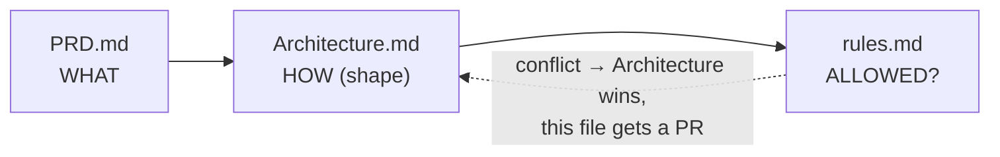
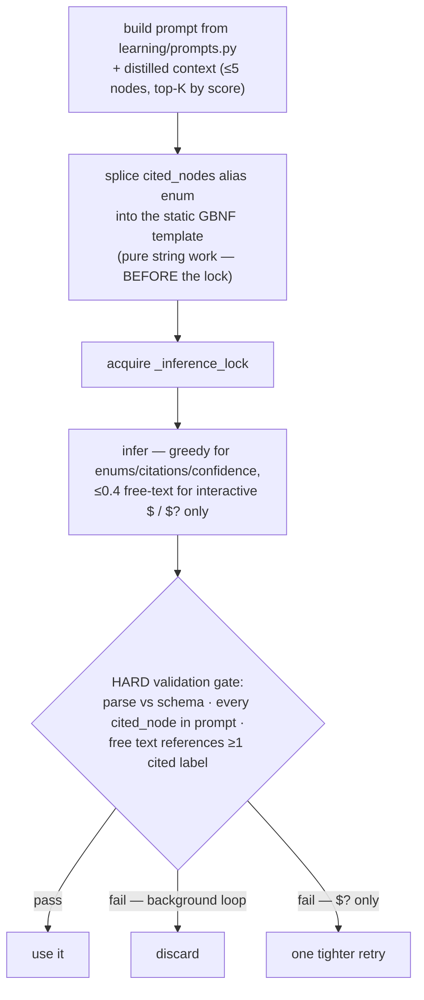
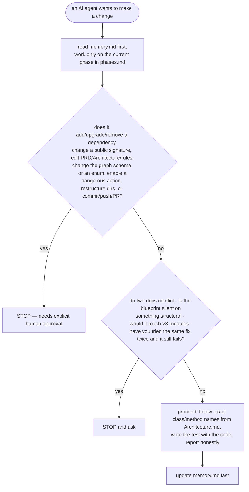

# rules.md — Engineering Rules & AI Boundaries

**Status:** Binding · **Applies to:** every human and every AI agent writing code in this repository.

> `PRD.md` says **what** to build, `Architecture.md` says **how** it's shaped, this file says **what is and isn't allowed**. When they conflict, `Architecture.md` wins and this file gets a PR.



---

## 0. The four invariants (from the blueprint)

**Violating any of these is a defect that blocks merge.**

| # | Invariant |
| --- | --- |
| 1 | **Services are held, not inherited.** `EventBus`, `GraphMemory`, `BitNetRuntime` are singletons. Modules receive them as references and never subclass them. |
| 2 | **`GraphMemory` uses `asyncio.Lock`, never `threading.Lock`** in loop-resident code. |
| 3 | **Never call `BitNetRuntime.infer()` from a coroutine.** Use `infer_async()` (which wraps it in `run_in_executor`). |
| 4 | **`SignalCorrelator` produces `SIGNAL_CORRELATED`; `PressureAccumulator` and `BitNetPlasticity` consume it — never calling each other.** Everything routes through the `EventBus`. |

**Plus:** no module imports another module. If you want a direct call, you want a new event.

---

## 1. Async

```python
# WRONG — blocks the loop for ~1 s
snapshot = self.collector.collect()
# RIGHT
snapshot = await asyncio.to_thread(self.collector.collect)

# WRONG — freezes the daemon for seconds
text = self.bitnet_runtime.infer(prompt, 256, 0.7)
# RIGHT
text = await self.bitnet_runtime.infer_async(prompt, 256)
```

- Every `await` on external work has a timeout.
- Never `await` while holding `GraphMemory._lock` except for the graph mutation itself — build the prompt before taking the lock.
- `asyncio.CancelledError` is always re-raised, never swallowed. The DMN idle cycle must be interruptible at every await point and leave the graph consistent when cancelled.
- Inference uses its own single-worker executor, distinct from the general pool.

## 2. EventBus

- Subscribe in `initialize()`, unsubscribe in `stop()`. Symmetric, always.
- Handlers are `async def`, return `None`, and never raise — wrap the body and publish `SYSTEM_ERROR` on failure.
- `publish()` is fire-and-forget. Never depend on a subscriber having finished.
- Payloads are typed dataclasses, not ad-hoc dicts.
- Every new event type is added to the catalogue in `Architecture.md §13`.

## 3. GraphMemory

- All access through the public API. Touching `graph_memory.graph` outside `graph_memory.py` is a review block.
- Every write acquires `_lock`. All writes serialise through the one lock.
- `save()` is atomic: temp file → `fsync` → `os.replace`.
- Node IDs are stable and deterministic (`file:/abs/path`, `app:code`, …) — never random for a re-derivable entity.
- Touching an entity that may already exist is `upsert_node()`, never `add_node()` (which overwrites `relevance_score` / `access_count` / `created_at`) and never a `get_node()`-then-`add_node()` check-then-act (racy — one lock per decision). Upsert both endpoints before `add_edge()`.
- `relevance_score` is recomputed on a schedule, never per-event.
- Growth is bounded by design: routing layer + score decay + `prune_low_score` + raw-data purge. A code path that can add nodes without bound is wrong.
- Every DMN graph job acquires, mutates, and releases the lock once per atomic call — never once around a whole batch loop.
- A whole-graph batch job (`recalculate_importance`, `save`, future DMN replay) processes the graph in bounded chunks: acquire `_lock`, do one chunk (~250–500 nodes), release, `await asyncio.sleep(0)`. Never `json.dumps` a large graph with `indent`/`sort_keys` on the loop — that is json's pure-Python encoder (~200 ms for 10k nodes); use per-object compact `dumps` (C encoder) across chunks and thread-offload only the GIL-releasing file I/O. After `load()`, `gc.freeze()` the graph so save-churn does not trigger a full-graph gen-2 rescan. (problems.md T4)

## 4. BitNetRuntime

- One inference at a time, system-wide. Do not optimise around `_inference_lock`.
- Every call has a token budget and a wall-clock timeout.
- Check `is_busy` before enqueueing optional work (DMN, proactive insights). Dropping optional inference is correct.
- **Model output is untrusted input.** Parse defensively — never `eval`, never execute, never pass it into a shell, never interpolate it into a file path.
- Prompts come from `learning/prompts.py`. Context is built **only** by `build_context_from_nodes()` — one serialiser, one format, everywhere.
- Every generated insight must cite `related_node_ids`, and its text must substantively reference the cited nodes' labels — citation without grounding is discarded, not stored.
- Backends implement the `InferenceBackend` protocol. Module code never imports a backend directly.
- Personal model pruning is deferred (`pruning.md`). If/when it is built, the mask is applied once at model load via llama.cpp — never per inference, never via Ollama.

### 4.1 Structured generation — the model is a decision gate, not a log parser

The model is 2B params at 1.58 bits. It loses coherence fast on open-ended prompts over graph context (`problems.md` 1.13). Every call obeys this:



| Rule | Detail |
| --- | --- |
| Task-specific GBNF grammar per call | One grammar per task, versioned alongside its prompt in `learning/prompts.py`. No free-form "analyse the system" prompts. |
| Citations constrained to prompt node IDs | The `cited_nodes` field is a grammar enum built from *this* call's nodes. Use **local aliases** (`n1`…`n5`) in the prompt and enum, not raw node IDs — no GBNF escaping; map aliases back after parsing. |
| Grammar compiled per call, before the lock | Keep the schema skeleton as a static template; splice in only the `cited_nodes` alias enum. Build the GBNF string, *then* acquire `_inference_lock`, *then* infer. |
| Every schema has an `abstain` path | `null` / `"insufficient evidence"`. Forcing an answer out of a small model is how you get hallucinations. |
| Distilled input only | `build_context_from_nodes()` emits one terse line per node (`alias · label · type · score · 1–2 attrs`) — never a raw `MetricSnapshot`, never a raw subgraph dump. Top-K ranked by `relevance_score`, deduped by domain; K is a config value set from the B0 ablation, not a guess. |
| Decoding | Enums / routing / `cited_nodes` / `confidence`: always greedy (temp ≈ 0). Free-text fields: greedy in the background loop (L4's novelty check absorbs repetition); ~0.4 permitted for interactive `$` / `$?` only. |
| Post-generation validation is a hard gate | parse against the schema → every `cited_node` exists in the prompt → the free text references at least one cited node's `label`. Fail → discard (background loop) or one tighter retry (`$?` only). |
| One synthetic few-shot example | Per prompt, matching the grammar exactly. Synthetic/fictional data only — prompts must stay shippable. |
| Fallbacks — only if the B0 spike shows constrained 2B4T isn't enough | micro-decompose `$?` into ≤ 2 sequential grammar-constrained prompts (never the background loop); or use a ~3B Q4 model for `$?` only (`BitNetRuntime` is backend-pluggable). |

## 5. Action layer safety

| # | Rule |
| --- | --- |
| 1 | Every action runs behind the safety gate: sandbox, backup before any write, rollback available. |
| 2 | Dangerous actions (`RunCommandAction`, killing processes, deletion) require terminal confirmation at execution time. **No pressure level and no config flag removes this.** |
| 3 | A single signal never fires a high-threshold action — those need synchronised Sensing + Diagnosis + Learning spikes. |
| 4 | Never build a shell command by interpolating model output or graph content. `subprocess.run([...], shell=False)`, always. |
| 5 | `ApiCallAction` is disabled by default with an empty allowlist — the only component permitted an outbound socket. |
| 6 | Every action attempt writes one JSONL line to `action_log_path` before and after. |
| 7 | No action deletes user data — move to quarantine with a TTL. |

## 6. Privacy

- Zero egress. Blocked DNS / blocked outbound must fail no test.
- No screen capture, no keystroke logging — cold system numbers only.
- `conversation_history` is RAM-only. Not disk, not graph, not logs.
- Raw sensor data trains then is purged; only extracted graph knowledge persists.
- Idle thoughts expire after 48 h.
- No telemetry, no analytics, no update check — absent, not opt-out.

## 7. Style & typing

- `ruff` for lint + format (config in `pyproject.toml`); `ruff --select=ASYNC` repo-wide.
- `mypy --strict` on `core/`; type hints on every public signature.
- Module class names match the blueprint exactly (`XMetricCollector`, `BitNetPlasticity`, `SignalCorrelator`, …).
- All prompt strings live in `learning/prompts.py`. An inline prompt is a defect.
- Comments explain *why*. No commented-out code. No `TODO` without an issue number.

## 8. Testing

- Every module class ships with tests in the same change. Untested code is not done.
- No test loads a real model — `FakeInferenceBackend` is deterministic.
- No test sleeps — use a fake clock.
- No test touches the real filesystem outside `tmp_path` or the real `psutil` outside an integration marker.
- Concentrate effort where a bug costs something: the safety gate, crash-mid-save, the event loop never stalling during inference, DMN cancellation-safety. No blocking coverage-percentage gate.
- Tests assert on behaviour and events, not internal call sequences.

## 9. AI-agent boundaries



**Always:** read `memory.md` first and update it last; work only on the current phase in `phases.md`; follow the exact class/method names from `Architecture.md`; write the test with the code; report honestly (a failing test is reported with its output).

**Never without explicit human approval:** add/upgrade/remove a dependency; change a public signature in `Architecture.md`; edit `PRD.md` / `Architecture.md` / `rules.md` silently; change the graph schema or any enum; enable a dangerous action or add to the API allowlist; restructure directories; delete or rewrite a test to make a build pass; commit, push, or open a PR.

**Never, under any circumstances:** invent an API not in `Architecture.md` or the code; report a test as passing without running it; write placeholder code that pretends to work; silently swallow an exception; present the reconstructed L7/L8 shapes as blueprint fact.

**Stop and ask when:** two documents conflict; the blueprint is silent on something structural; a change would touch more than 3 modules; you've attempted the same fix twice and it still fails.

---

*Related: [PRD.md](PRD.md) · [Architecture.md](Architecture.md) · [phases.md](phases.md) · [design.md](design.md) · [memory.md](memory.md)*
