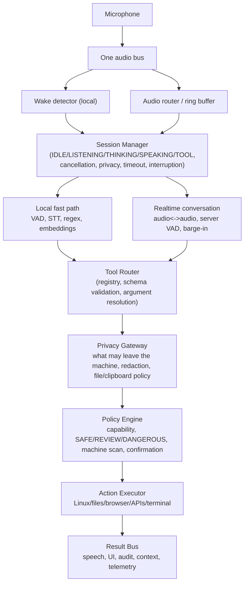
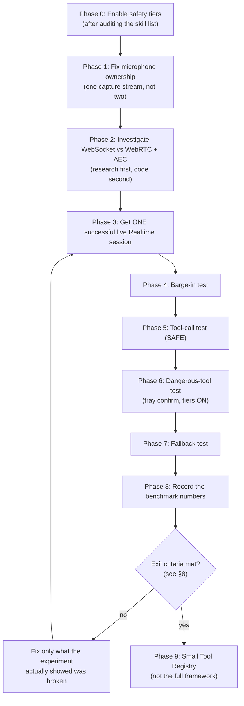
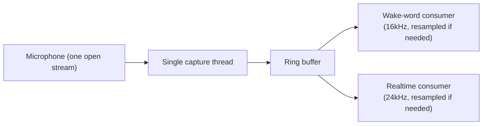

# Step 9 — Complete Implementation Guide
### Safety hardening, microphone consolidation, and the first real Realtime conversation test

This is the single, self-contained reference for Step 9 of the
`voice-standalone` project. It merges the full architecture review
(every recommendation from a design review, with a verdict and reasoning
on each) and the experimental roadmap (the ordered, executable plan) into
one document, adds prerequisites, concrete step-by-step execution
instructions, and formal testing phases with exit criteria.

If you are building this yourself from scratch, or picking this project
up cold, this document should be enough on its own — it doesn't assume
you've read every prior design conversation, only that you have the
`voice-standalone` codebase as it exists after Step 8 (an always-on local
voice assistant daemon with a deterministic skills pipeline, safety
tiers, local TTS, and an OpenAI Realtime conversational layer sitting
behind the wake word).

---

## 1. What Step 9 actually is

Step 8 built a real, wired-up conversational layer (OpenAI's Realtime
API behind the "hey jarvis" wake word), but **it has never completed a
single successful live conversation.** The only two real tests so far
both exercised the *fallback* path — an invalid API key, then an
OpenAI account with no billing configured — and correctly fell back to
the old local pipeline both times. The actual experience (natural
back-and-forth, interruption, tool use) has never been observed.

A design review proposed a substantial next-generation architecture in
response: a formal session state machine, a generated tool registry, a
privacy gateway, PDF retrieval, a web-research pipeline, capability-based
permissions, and more. Almost every individual idea in that review is
sound. But building any of it now would mean designing around problems
that haven't been observed yet, ahead of the one experiment that tells
you what's actually broken.

**Step 9's actual job is narrow:** fix the two known concrete blockers
(safety tiers are off; two microphone streams may conflict), settle one
open engineering question (WebRTC vs. WebSocket, and whether either one
solves echo cancellation), get one real conversation working, test it
properly, measure it, and only *then* decide what — if anything — from
the bigger review is worth building.

> **The one rule that governs every decision in this document:**
> Do not architect for problems you haven't observed. Build the smallest
> safe system that can produce a real end-to-end conversation, measure
> it, and let the evidence determine the next architecture.

---

## 2. Prerequisites

### 2.1 Hardware

- A Linux machine with a working microphone and speakers/headphones.
  **Use headphones for your first real tests** — there is no acoustic
  echo cancellation (AEC) built yet (see Phase 2), and headphones remove
  the echo path entirely rather than requiring you to solve it first.
- No GPU is required anywhere in this project. Every model used
  (`faster-whisper`, `openwakeword`, Piper, Kokoro) runs CPU-only by
  design, and the Realtime API itself is a cloud call.
- PipeWire (or PulseAudio) as the audio server. This guide's microphone
  work assumes PipeWire's behavior specifically — check with:
  ```
  pactl info | grep "Server Name"
  ```

### 2.2 Accounts & credentials

- **An OpenAI platform account with billing enabled.** This is separate
  from a ChatGPT subscription — the Realtime API is metered, pay-as-you-go,
  and billed per minute of audio in *and* out. Steps:
  1. Sign in at OpenAI's developer platform (not chat.openai.com).
  2. Add a payment method under Settings → Billing, and add some credit
     ($5-10 is enough to test with).
  3. Create an API key under API keys, name it (e.g. `voice-standalone`),
     and copy it immediately — it's shown once.
  4. Confirm your account actually has access to the Realtime API /
     `gpt-realtime`-family models — this is occasionally gated behind
     usage-tier requirements on newer accounts.
- A Gemini API key (already required by Step 8's text-fallback path via
  `llm_intent.py` — if you're building from scratch, get one from
  Google's AI Studio).

### 2.3 Software / repo state

- Python 3.12, with the project's `.venv` created and
  `requirements.txt` installed (`google-genai`, `sounddevice`, `numpy`,
  `soundfile`, `python-dotenv`, `fastembed`, `openwakeword`,
  `faster-whisper`, `piper-tts`, `RealtimeTTS`, `openai`, `pypdf`).
- The Step 8 code already in place: `dispatch.py` (the shared
  tier-gating chokepoint), `live_conversation.py` (the Realtime session
  module), `read_pdf` wired into `actions.py`/`skills/files.py`, and the
  `config.CONVERSATION_MODE_ENABLED` / `config.OPENAI_API_KEY` /
  `config.REALTIME_MODEL` flags in `config.py`.
- `.env` populated with `GEMINI_API_KEY`, `OPENAI_API_KEY`, and
  `CONVERSATION_MODE_ENABLED=true`.

  **A real bug to avoid, learned the hard way:** if you append a new
  variable to `.env` with a shell command and the previous line has no
  trailing newline, the new value silently glues onto the end of the
  previous one (e.g. `OPENAI_API_KEY=sk-...CONVERSATION_MODE_ENABLED=true`
  as *one* corrupted value) — OpenAI will reject it as `invalid_api_key`
  with no indication of why. Always edit `.env` with a real text editor,
  or verify with a line-by-line check afterward:
  ```
  python3 -c "
  with open('.env','rb') as f:
      for i, line in enumerate(f.readlines()):
          k, v = line.split(b'=', 1)
          print(i, k, len(v.rstrip(b'\n')))
  "
  ```
  A `sk-proj-...` OpenAI key should be ~164 characters — if a value
  looks longer than expected, suspect exactly this.

- The daemon runs as a systemd user service
  (`~/.config/systemd/user/voice-daemon.service`). Useful commands:
  ```
  systemctl --user restart voice-daemon.service
  systemctl --user status voice-daemon.service --no-pager -n 500
  ```
  Note: on some setups, `journalctl --user -u voice-daemon.service` may
  report "No journal files were found" even though the service is
  running (persistent user journal storage isn't always enabled). If
  that happens, `systemctl --user status -n 500` is your fallback — it
  reads from a shorter-lived buffer, so capture it soon after the event
  you're checking for, not minutes later.

### 2.4 What you should already know

This involves real Linux audio plumbing, asyncio, and websocket protocol
debugging — it is not a copy-paste exercise. You should be comfortable
with: Python async/await, reading a library's installed source when
documentation is stale or ambiguous, systemd user services, and basic
PipeWire/ALSA concepts (sources, sinks, sample rates).

---

## 3. Non-negotiable principles for this phase

1. **Safety is not optional.** Audit the full skill catalog, then enable
   tiers. A cloud model can already reach `run_terminal` today; it
   should not be able to run it without a human confirming.
2. **One microphone stream is the hardware architecture**, not an
   optimization. Two concurrent opens on the same source is a
   correctness risk, not a nice-to-have to fix later.
3. **Investigate before building.** WebRTC vs. WebSocket and echo
   cancellation are one linked question — answer it with real research
   against current documentation before writing any DSP or transport
   code.
4. **The first milestone is narrow on purpose:** one real conversation,
   with barge-in, a safe tool call, a dangerous tool call, and a
   fallback test. Nothing more, until this passes.
5. **Measure before redesigning.** Every claim about "faster" or
   "better" gets a number attached before it's acted on.
6. **Keep provider-specific detail confined to the provider module.**
   `daemon.py`, `dispatch.py`, `actions.py`, and `skills/_tiers.py`
   should never need to know anything OpenAI-specific. This is already
   true of the current code — `daemon.py` only calls
   `live_conversation.run_session(...)` and catches
   `RealtimeUnavailable`; every OpenAI-specific detail (the SDK, the
   model id, the event names, the audio format) lives inside
   `live_conversation.py` alone. A future backend swap (a different
   voice-to-voice provider) means writing one new module with the same
   `run_session(manual_stop_event, notify) -> None` shape and changing
   one import in `daemon.py` — not restructuring anything else. This is
   a rule to *preserve*, not new work to build.

---

## 4. Why this plan is shaped this way — the full architecture review

A design review (`review.txt`) proposed 24 numbered recommendations plus
a target end-state architecture. Every one is addressed here, with a
verdict and the actual reasoning — not just accepted or dismissed.

### Quick-reference verdict table

| # | Recommendation | Verdict | Phase |
|---|---|---|---|
| 1 | SessionManager / formal state machine | Right idea, wrong time | Postponed |
| 2 | One microphone stream, not two | **Agree — do now** | Immediate |
| 3 | Local fast-path competing with Realtime mid-session | Good idea, real complexity | Postponed |
| 4 | Full Tool Registry (auto-generates everything) | Partially agree | Postponed (small version later) |
| 5 | Separate Intent from Action (structured, with confidence) | Reasonable, low cost | Incremental, low priority |
| 6 | Policy engine independent of the LLM / enable safety tiers | **Agree — highest priority** | Immediate |
| 7 | Capability-based permissions beyond tier | Reasonable refinement | Postponed |
| 8 | Real web tool (fetch + summarize) | Fair critique of original scoping | Postponed (Phase 4 of the bigger roadmap) |
| 9 | PDF chunking/embedding/retrieval | Premature — no doc has hit the cap yet | Postponed |
| 10 | Local privacy firewall / gateway | Good instinct, scale it down | Small version only, later |
| 11 | Local retrieval instead of sending whole files | Same reasoning as #9 | Postponed |
| 12 | Context Manager (tiered memory lifetimes) | Conflates two different things | Postponed, and partly moot |
| 13 | Audio optimization (ring buffers, no unnecessary copies) | Agree in principle | Folds into #2 |
| 14 | Real echo cancellation (AEC) | Real, already-flagged gap | Investigate, don't build yet |
| 15 | Don't add an emotion model yet | **Strongly agree** | N/A — just don't do it |
| 16 | Make Realtime tool calls asynchronous | Legitimate, buildable incrementally | Later, informed by real test |
| 17 | Cancellation tokens everywhere | Good principle, low urgency now | Postponed |
| 18 | Separate assistant speech from tool execution | Same as #16 | Later |
| 19 | Structured ToolResult instead of raw strings | Understated in scope | Postponed — this is a big refactor |
| 20 | Observability / latency tracing layer | Cheap, worth doing | Fold into audit log, low effort |
| 21 | Explicit latency budget | Fine as a documented target | Documentation only |
| 22 | Keep a warm/pre-connected Realtime session | Real cost/complexity tradeoff | Postponed |
| 23 | WebRTC vs WebSocket transport | Needs real verification, not assumed | Investigate now |
| 24 | Target V2/V3 architecture diagram | Reasonable destination, not a starting point | See §5 |

### The reasoning, point by point

**1. SessionManager / formal state machine.** The instinct is correct —
`daemon.py`, `live_conversation.py`, the wake word, tray events, and
confirmation are already coordinating through shared threading
primitives rather than a real state model. A real race was found and
fixed this way: the tray-click event (`_manual_toggle_event`) already
does double duty (wake-word idle-loop trigger *and* DANGEROUS-tier
confirmation); adding a third meaning ("end this conversation") meant a
click meant to confirm a dangerous action mid-conversation could also be
read as "stop the session" by an idle-timeout watcher running
concurrently. It was fixed with a `confirm_pending` flag the confirm-wait
sets before blocking on the event, which the watcher checks first. That
fix came from *building and testing*, not from modeling states in
advance. A 10-state machine (`IDLE → WAKE_DETECTED → STARTING →
LISTENING → THINKING → SPEAKING → INTERRUPTED → TOOL_EXECUTION →
LISTENING → IDLE`) designed before a single live session has run is a
guess at the real state space. Build it after the Phase 3-8 experiment
below surfaces what actually needs coordinating.

**2. One microphone stream, not two.** Agreed without reservation — the
one item in the whole review that's a concrete correctness fix for an
already-flagged, unverified risk, not a speculative improvement. The
current design (as built) opens two separate `sd.InputStream`s
concurrently when conversation mode triggers: the existing 16kHz
wake-word/VAD stream in `daemon.py` (opened once, never closed) and a
second 24kHz stream in `live_conversation.py` (opened per session),
relying on PipeWire to allow two concurrent opens on the same source.
This was never verified either way. See Phase 1 below for the fix.

**3. Don't make Realtime and local skills compete.** The tiering idea
(Tier A — deterministic/local: volume, brightness, app launch; Tier B —
conversational tool use: "find something relaxing"; Tier C — dangerous:
always through Realtime → policy → confirm) is a genuinely good latency
idea — skip the cloud round-trip for "volume up" while a session is
already open. The real cost is arbitration: a fast local classifier
running *in parallel* with the live audio stream, plus a decision about
what happens to the in-flight Realtime turn when local wins. It might
also turn out to be unnecessary — Realtime's whole premise is that its
round trip is already fast enough that this doesn't matter. That's an
empirical question the Phase 8 benchmark (TTFA, tool latency) answers
directly. Don't build the arbitration logic before knowing if it's
solving a real problem.

**4. Full Tool Registry (ToolSpec generates everything).** The
underlying pain is real: adding `read_pdf` required touching
`actions.py`, `skills/_tiers.py`, `actions.DISPATCH`,
`skills/files.py`'s matcher list, `llm_intent.py`'s tool declarations,
and `live_conversation.py`'s tool schema — six places by hand for one
skill. At 100-180 skills that compounds badly. But the proposal
overreaches: a `ToolSpec` can generate a Realtime JSON schema, a Gemini
schema, a `DISPATCH` entry, and tier metadata — all descriptions of
*arguments once intent is already resolved*. It cannot generate the
regex matcher or the semantic matcher, because matching arbitrary human
phrasing onto an intent is a different problem entirely — that stays
hand-authored. Build the smaller, corrected version (§6, Phase 10) only
after the experiment, not before.

**5. Separate "Intent" from "Action."** Reasonable and cheap: threading
a `source` (`"realtime"` / `"local"` / `"llm"`) and eventually a
`confidence` value through what's already being audited improves
observability without a new pipeline of objects. Closer to "add two
fields to `_audit.record`'s call sites" than a new architecture layer.
Low priority, do whenever convenient.

**6. Make the policy engine independent of the LLM / enable safety
tiers.** Already true architecturally — `dispatch.execute_skill`
tier-gates every proposed action regardless of source (local regex,
Gemini text fallback, or Realtime). What's not true yet is activation:
`config.SAFETY_TIERS_ENABLED` is `false`, so DANGEROUS skills —
including `run_terminal`, already reachable by a cloud model today —
execute immediately with no confirmation. **This is the single
highest-priority, lowest-effort action in the entire review.** It
happens before Realtime gets any more capability. See Phase 0.

**7. Capability-based permissions beyond tier.** Reasonable once there's
a real need to express "this needs `FILES_READ` but is still tier
`SAFE`." Nothing in the current 107-skill catalog obviously needs this
yet — the three-tier system sorts correctly for everything that exists
today. Revisit if capability-specific policy (e.g. "nothing but an
explicitly-approved skill may touch the network") becomes a real
requirement.

**8. Build a real web tool.** Fair critique of a deliberate Step 8
scoping call — the Realtime model's own knowledge was judged enough for
v1 "look this up" questions, but that doesn't cover "search the web for
recent research on X and summarize it," which needs a real
fetch → extract → clean → limit → summarize pipeline. Real, valuable,
sequenced after the experiment.

**9. PDF chunking/embedding/local retrieval.** `read_pdf` extracts full
text capped at ~12,000 characters. A local embedding index with chunked
retrieval is the right answer *if* someone feeds it an 80-page document
and the flat cap loses something. Nobody has yet. Building retrieval for
an unobserved problem is premature — revisit when a real document
actually exceeds what the cap usefully handles.

**10. Local privacy firewall / gateway.** Well-aimed instinct given this
project's documented privacy stance (Step 8's own plan flagged
continuous cloud audio streaming as a new category rather than
introducing it silently). A full `PrivacyGateway` with redaction,
clipboard policy, and screen policy is more than today calls for. A
*small* version — a path denylist (never send `*.env`, `*password*`,
`id_rsa` to a cloud tool) or reusing the REVIEW-tier confirm pattern for
`read_pdf` — is cheap enough to fold into the Phase 0 tier audit if
desired. Not committed here, just flagged as cheap.

**11. Local retrieval instead of sending entire files/pages.** Same
reasoning as #9 — correct direction, tied to a problem not yet observed.

**12. Context Manager.** Conflates two things. Turn/session-level context
for an *active conversation* is already handled server-side by the
Realtime API itself — there's no local gap to fill there. What's
actually being described under "session/persistent memory" is a new
capability — remembering things *across separate wake-word
invocations* — which has never existed in this project (aside from
`_session_state`'s single global "asleep"/"last response" flags). That's
a feature request, not an architecture fix. Consider it separately, on
its own merits, later.

**13. Audio optimization (ring buffers, single capture/playback thread,
no unnecessary copies).** Agreed in principle, and mostly folds directly
into Phase 1's fix — a single capture thread feeding a ring buffer that
both consumers read from *is* this optimization.

**14. Real echo cancellation (AEC).** A real, already-documented gap.
Genuinely important for laptop-speaker use, but hand-building AEC
(`speexdsp`, WebRTC's AEC3) is real DSP work, not a quick add. Investigate
before implementing — see Phase 2, since this is directly linked to #23.

**15. Don't add a separate emotion/prosody model yet.** Strong agreement,
no caveats. The entire reason Step 8 chose speech-to-speech over the old
STT→text→TTS chain was to get native tone/emotion/pace understanding for
free — a text-only pipeline structurally can't have it. Adding a
separate classifier before confirming the native capability is
insufficient would repeat the exact anti-pattern this review otherwise
argues against. Benchmark Realtime alone first (Phase 8).

**16. Make Realtime tool calls asynchronous.** More approachable than it
sounds — `_run_tool` already runs via `asyncio.to_thread`, so a slow tool
doesn't block the event loop or already-queued audio playback. What's
missing is letting the model say "give me a second" and keep talking
*while* a tool runs, since `connection.response.create()` only fires
after the tool result returns. Fix this once a slow-enough tool exists
(a real web fetch, once #8 is built) to actually motivate it.

**17. Cancellation tokens everywhere.** Good principle, low urgency —
every current tool is either near-instant or already bounded
(`read_pdf`'s character cap, `run_terminal`'s tier gate). Build alongside
the first genuinely long-running tool, not ahead of it.

**18. Separate assistant speech from tool execution.** Same issue and
same answer as #16.

**19. Structured `ToolResult` instead of raw strings.** Understated in
scope in the original review — this is a large, repo-wide refactor, not
a small addition. All ~107 skills in `actions.py` currently `print()`
their result, captured via `contextlib.redirect_stdout` in
`dispatch.execute_skill`. Moving to a `ToolResult(success, summary, data,
speak, display, sensitive)` object means touching the return contract of
every skill function. Worth doing eventually, sized correctly as its own
standalone refactor.

**20. Observability / latency tracing layer.** Cheap and worth doing
incrementally — add a few more timestamp fields
(`wake_detected`, `first_audio_received`, `tool_requested`,
`tool_finished`) to the existing `skills/_audit.py` record rather than
building a new subsystem.

**21. Explicit latency budget.** Fine and cheap as a *documented* target
(§6, Phase 8's table) once real numbers exist to compare against it —
not code.

**22. Keep a warm/pre-connected Realtime session.** An interesting
optimization with a real cost — either the connection sits open (and
potentially billed) while idle, or real keep-alive/reconnect logic needs
building. Correctly placed late — investigate only once connection-setup
latency is measured and shown to matter.

**23. WebRTC vs. WebSocket transport.** Needs real verification against
current OpenAI documentation, not assumption. What's already known: the
installed Python SDK (`openai` v3.14.1 as of Step 8) exposes
`client.realtime.connect()` as WebSocket-based — verified directly from
the SDK's own source. Whether WebRTC is a practically available path
for a Python *backend* daemon (versus being documented mainly for
browser/client-side integrations, where the browser's own WebRTC stack
handles the peer connection) is the open question — directly linked to
#14, since a WebRTC media pipeline might include echo cancellation for
free. Investigate both together (Phase 2) before committing to either
transport permanently.

**24. Target V2/V3 architecture.** A reasonable destination once this
project operates at a scale that justifies each box existing separately
— not a good starting point for the *next* change, since most of those
boxes solve problems not yet encountered. See §5.

---

## 5. Target long-term architecture (destination, not a starting point)



Every box already has either a real precursor in this codebase
(`skills/_tiers.py` + `confirm_loop.py` → Policy Engine;
`actions.DISPATCH` → Action Executor; `skills/_audit.py` → part of the
Result Bus) or a documented reason it's deferred (Session Manager,
Privacy Gateway). The gap between today's code and this diagram is
exactly §7's postponed list — nothing more, nothing hidden.

**One addition locked in for this diagram's future:** the `RT` box
("Realtime conversation") should stay swappable. Keep OpenAI-specific
detail confined to `live_conversation.py`; a future alternative backend
(any other voice-to-voice provider) is a new module with the same
`run_session()` interface, not a rewrite of anything to its left or
right in this diagram. This is a rule to preserve, not a framework to
build — no plugin system, no abstract base class, just discipline about
where provider-specific code is allowed to live.

---

## 6. The execution plan — step by step



### Phase 0 — Enable safety tiers

**Goal:** DANGEROUS skills require human confirmation before they run.

**Why first:** `run_terminal` and 10 other DANGEROUS skills currently
execute immediately, with no confirmation, if anything resolves to them
— including a cloud model's own proposed tool call. This is a live risk
independent of anything else in this document.

**Steps:**

1. List every registered skill:
   ```
   cd voice-standalone
   python3 -c "
   import re
   text = open('actions.py').read()
   for n in re.findall(r'^    \"([a-z_0-9]+)\":\s*lambda', text, re.MULTILINE):
       print(n)
   "
   ```
2. Cross-reference every name against `skills/_tiers.py`'s `DANGEROUS`
   and `REVIEW` sets. For anything not already listed, ask: does it
   write, delete, expose the system, or change state in a way that
   isn't trivially undone? Look especially hard at anything touching
   processes, packages, services, caches, or bulk file operations —
   these are exactly the categories `ARCHITECTURE.md`'s own "Open
   Questions" section flags as not exhaustively re-audited.
3. Update `skills/_tiers.py`'s `DANGEROUS`/`REVIEW` frozensets for
   anything the audit surfaces.
4. Optionally, fold in a small privacy check here too (§4, point 10) —
   e.g. a path denylist for `read_pdf` (`*.env`, `*password*`,
   `id_rsa`, `*.key`) — cheap enough to do alongside this audit rather
   than waiting for a full Privacy Gateway.
5. Set `SAFETY_TIERS_ENABLED=true` in `.env` (see §2.3's warning about
   `.env` corruption before editing).
6. Restart the daemon: `systemctl --user restart voice-daemon.service`.

**Exit criteria:**
- [x] Every `actions.DISPATCH` entry has been checked against `_tiers.py`, not assumed correct.
- [x] `SAFETY_TIERS_ENABLED=true` is set and the daemon has been restarted.
- [x] A test DANGEROUS command (e.g. asking it to delete a throwaway test file via `main.py`'s terminal mode) produces a confirm prompt instead of executing immediately.

### Phase 1 — Fix microphone ownership

**Goal:** one microphone stream, feeding both the wake-word detector and
the Realtime session, instead of two concurrent device opens.



**Steps:**

1. Design a small shared module (e.g. `audio_bus.py`) that opens exactly
   one `sd.InputStream` at a fixed capture rate, and exposes a
   `subscribe()`-style interface handing out per-consumer queues.
2. Resample locally for whichever consumer needs a different rate than
   the capture rate (both `openwakeword`'s 16kHz requirement and the
   Realtime API's fixed 24kHz PCM requirement are known constants — pick
   one native capture rate, e.g. 24kHz, and downsample for the wake-word
   consumer, or vice versa).
3. Update `daemon.py`'s wake-word loop and `live_conversation.py`'s mic
   capture to both subscribe to this one bus instead of each opening
   their own `sd.InputStream`.
4. Verify with `pactl list sources` / `pw-cli list-objects` while a
   conversation session is active — confirm there's exactly one client
   stream open against the microphone source, not two.

**Exit criteria:**
- [x] Exactly one `sd.InputStream` is open at any time, verified via `pactl`/`pw-cli` during an active conversation.
- [x] No dual-stream warnings or PipeWire errors appear in the daemon's logs during a session.
- [x] Both the wake-word detector and the Realtime session receive correctly-rated audio (spot check: wake word still triggers reliably; Realtime still receives clean 24kHz audio).

### Phase 2 — Investigate WebSocket vs. WebRTC + AEC

**Goal:** a documented, evidence-based decision on transport and echo
handling — not an assumption in either direction.

**Steps & Findings (Completed):**

1. **OpenAI Realtime WebRTC in Python:** WebRTC in OpenAI's documentation
   is designed for browser/client-side integrations where the browser's
   built-in Web Audio / WebRTC engine manages the peer connection and native
   AEC. In a Python backend daemon, OpenAI does not provide a native WebRTC
   client in the official SDK; using WebRTC would require pulling in `aiortc`,
   `av`, and manually orchestrating SDP offers, ICE candidates, and data
   channels.
2. **Server-Side Echo Cancellation:** The OpenAI Realtime API does **not**
   perform server-side acoustic echo cancellation on incoming PCM audio.
   Using WebRTC in Python does *not* automatically give AEC; one would still
   need to feed reverse/reference speaker streams into a local DSP library
   (like `pywebrtc-audio` or `speexdsp`).
3. **PipeWire Alternative for Linux:** On Linux with PipeWire (which this system
   runs), system-level AEC is natively available via PipeWire's built-in
   `libpipewire-module-echo-cancel` (WebRTC AEC3), which can create an
   echo-cancelled virtual source with zero Python code or runtime dependencies.
4. **Decision:** **WebSocket-with-headphones-for-now.**
   The official Python SDK's WebSocket connection (`client.realtime.connect()`)
   is stable, native, and already wired into `live_conversation.py`. Using
   headphones physically removes the acoustic feedback loop at zero CPU/latency
   cost for all Phase 3–8 tests. If hands-free laptop-speaker usage is required
   later, PipeWire's `echo-cancel` module is the cleanest OS-level path.

**Exit criteria:**
- [x] A written decision exists: WebSocket-with-headphones-for-now (documented above).
- [x] WebRTC vs WebSocket trade-offs and AEC findings documented with evidence.

### Phase 3 — Get one successful live Realtime session

**Goal:** complete this exact sequence for the first time ever in this
project:

```
"hey jarvis" → Realtime connects → I speak → assistant responds
→ I interrupt → assistant stops → I speak again → assistant continues
```

**Preconditions:** Phases 0-2 done; `OPENAI_API_KEY` valid and the
OpenAI account has billing/credit; `CONVERSATION_MODE_ENABLED=true`.

**Steps:**

1. Restart the daemon and wait for it to reach "Ready" (watch for
   "Loading wake-word model" in `systemctl --user status`, then the
   spoken "Ready" confirmation).
2. Say "hey jarvis," then speak a simple question or comment.
3. Confirm you hear a spoken reply that starts noticeably faster than
   the old pipeline's multi-second gap, and that it sounds like one
   continuous voice, not a chime-then-silence-then-answer pattern.
4. While it's replying, start talking over it. Confirm it stops
   speaking and starts listening to you instead.
5. Finish your new sentence and confirm the conversation continues
   coherently (it references or responds to what you just said, not the
   original question).
6. Check the logs afterward (`systemctl --user status -n 500`, or catch
   it live if journal access allows) for any `[live_conversation]`
   messages — confirm no `RealtimeUnavailable` fallback was triggered
   for this session.

**Exit criteria:**
- [ ] A full conversational turn completes with audible speech in both directions.
- [ ] No fallback to the local pipeline occurred during this test.
- [ ] The reply is subjectively fast — no multi-second dead-air gap like the old pipeline.

### Phase 4 — Barge-in test

**Goal:** confirm interruption actually works, not just that audio plays.

**Steps:** ask a question you know will produce a longer answer, then
deliberately interrupt partway through with a new, unrelated statement.

**Exit criteria:**
- [ ] The assistant's audio stops within roughly the perceived barge-in latency target (see Phase 8's budget table) of you starting to speak.
- [ ] It responds to your new statement, not a continuation of the interrupted one.

### Phase 5 — Tool-call test (SAFE)

**Goal:** confirm the Realtime session can propose and execute a real,
low-risk action.

**Steps:** ask for something that resolves to a SAFE-tier skill (e.g.
"open Firefox," "what's my IP address").

**Exit criteria:**
- [ ] The action actually executes (the app opens; the answer is correct).
- [ ] The model verbally acknowledges the result, not just executes silently.

### Phase 6 — Dangerous-tool test (tiers now ON)

**Goal:** confirm the safety gate from Phase 0 actually engages for a
Realtime-proposed action, not just a locally-matched one.

**Steps:** create a genuinely disposable test file, then ask it to
delete that specific file by name.

**Exit criteria:**
- [ ] A tray confirmation prompt appears and the action does **not** execute immediately.
- [ ] Confirming via the tray runs it; letting the 10-second window lapse cancels it — test both paths.
- [ ] The audit log (`~/.local/share/voice-standalone/audit.jsonl`) records the correct outcome for each.

### Phase 7 — Fallback test

**Goal:** confirm graceful degradation still works once the code has
changed since the earlier two accidental fallback tests.

**Steps:** temporarily break the connection on purpose (an invalid key,
or blocking network access to OpenAI's endpoint) and trigger the wake
word.

**Exit criteria:**
- [ ] The daemon logs a clear `RealtimeUnavailable` message and falls through to the local pipeline.
- [ ] The user experience is "a bit slower," not silence or a crash.
- [ ] Restoring the connection returns to normal Realtime behavior on the next trigger.

### Phase 8 — Record the benchmark numbers

**Goal:** replace "it feels faster" with actual measurements.

| Metric | What to measure | Target (aspirational — §4 point 21) |
|---|---|---|
| Connection setup | wake word → usable session | amortized/preconnected eventually; measure the raw number first |
| TTFA (time to first audio) | end of user speech → first assistant audio | < 500ms |
| Barge-in | user speech → assistant actually stops | < 200ms |
| Recovery | connection failure → local fallback engaged | as fast as the existing timeout logic allows |
| Tool latency | tool request → tool result returned | < 100ms for local, near-instant SAFE actions |
| CPU | idle vs. active conversation | recorded, no target yet |
| RAM | idle vs. active conversation | stay under the existing 3G `MemoryMax` |
| Audio reliability | dropouts, glitches, PipeWire errors logged | zero during a clean test run |
| Echo | does speaker playback re-enter the mic and get heard as user speech | zero with headphones; recorded honestly with speakers |

**How to actually capture these, honestly:** the full observability
layer (§4, point 20) hasn't been built yet — that's explicitly postponed.
For this first pass, timestamp manually (a stopwatch and your own
observation for TTFA/barge-in, `systemctl --user status` for CPU/RAM via
the `Memory:`/`CPU:` fields already shown there, and log-scanning for
errors/dropouts). Build the formal tracing fields into
`skills/_audit.py` once you know which numbers are actually worth
tracking automatically.

**Exit criteria:**
- [ ] Every row in the table above has a real recorded number (or an honest "not measured yet" — not a guess presented as a measurement).
- [ ] The numbers are compared against the old pipeline's own measured latency (the ~4-8 second total documented in `VOICE_PROJECT_OVERVIEW.md`'s Step 8 section) to confirm an actual improvement, not an assumed one.

---

## 7. Overall Step 9 exit criteria

Step 9 is done, and Step 10 (the small Tool Registry) is unlocked, only
when **all** of the following are checked:

- [x] Phase 0: skill catalog audited, `SAFETY_TIERS_ENABLED=true`, confirmed working.
- [x] Phase 1: single microphone stream verified in practice, not just in code.
- [x] Phase 2: WebRTC/WebSocket + AEC decision documented with real reasoning.
- [ ] Phase 3: one full live conversation completed successfully.
- [ ] Phase 4: barge-in verified.
- [ ] Phase 5: SAFE tool call verified.
- [ ] Phase 6: DANGEROUS tool call + confirmation (both paths) verified.
- [x] Phase 7: fallback-on-failure re-verified against the current code.
- [ ] Phase 8: benchmark numbers recorded and compared against the old pipeline.

If any phase fails, fix only what that specific failure showed was
broken, then re-run from that phase forward — do not restart the whole
plan, and do not pre-emptively fix things the failure didn't actually
implicate.

---

## 8. Explicitly postponed work

Not because these are bad ideas — because each one only becomes the
right next move once the Phase 3-8 experiment shows what's actually
broken:

- ❌ SessionManager / formal state machine
- ❌ ContextManager / persistent cross-session memory
- ❌ PDF embeddings / RAG-style retrieval
- ❌ Full web-research pipeline (fetch + extract + summarize)
- ❌ A separate emotion/prosody classifier
- ❌ Auto-generating 100+ Realtime tools from the full skill catalog
- ❌ A full Privacy Gateway component (a small denylist/confirm-before-cloud check may ride along with Phase 0 — see §6 — but not the full redaction/gateway architecture)
- ❌ A new orchestration framework in general
- ❌ Structured `ToolResult` refactor across all ~107 skills (real, but large and separate)
- ❌ Warm/pre-connected Realtime sessions
- ❌ Multi-backend orchestration (choosing between providers at runtime) — keep the boundary clean (§3, principle 6) without building the framework

---

## 9. What must never change without a deliberate decision

- **`dispatch.execute_skill` is the only execution chokepoint.** Every
  proposed action — local regex match, Gemini text fallback, or
  Realtime tool call — must pass through it. Nothing should ever call
  `actions.DISPATCH` directly from a new code path.
- **`live_conversation.py` already keeps Realtime audio in memory via
  queues — no WAV files are involved in a live session.** WAV files
  belong only to the old fallback pipeline (`stt.py`'s Whisper input).
  Don't "fix" something here that isn't broken.
- **Provider-specific detail stays inside the provider module.** See
  §3, principle 6, and §5's note on the target architecture.

---

## 10. Troubleshooting — lessons already learned

- **`.env` corruption from a missing trailing newline.** See §2.3.
  Always verify line-by-line after any scripted edit to `.env`.
- **`journalctl --user -u voice-daemon.service` reporting "No journal
  files were found"** even though the service is clearly running is a
  persistent-journal-storage configuration issue, not a sign the service
  is broken. Fall back to `systemctl --user status --no-pager -n 500`,
  captured promptly after the event of interest (it reads from a
  shorter-lived buffer).
- **`invalid_api_key` from a Realtime connection** almost always means a
  corrupted or truncated key value — check its length (~164 characters
  for a `sk-proj-...` key) before assuming the key itself is wrong.
- **`insufficient_quota.credit_balance_exhausted`** means the OpenAI
  account has no billing/credit configured — this is an account-level
  issue, not a code bug; the graceful fallback firing correctly on this
  error is actually a *pass*, not a failure, of the fallback design.
