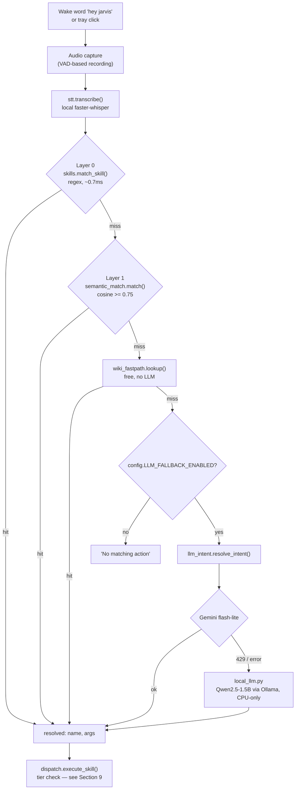
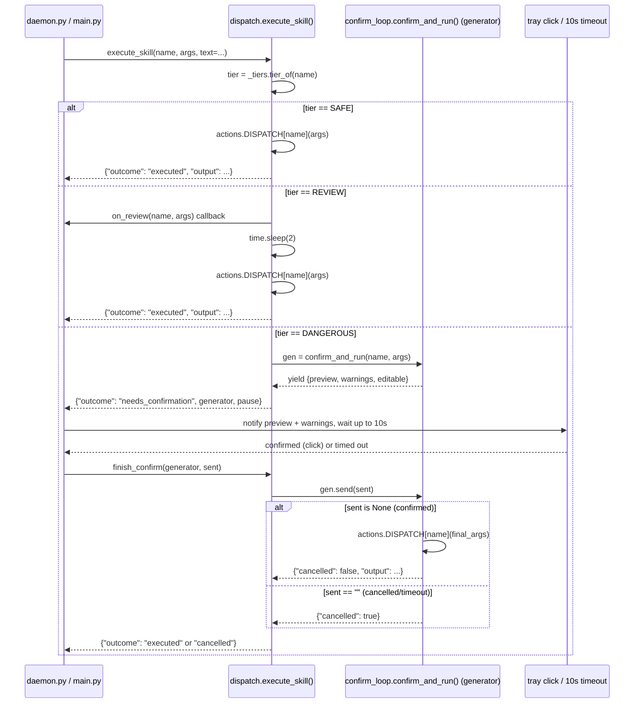
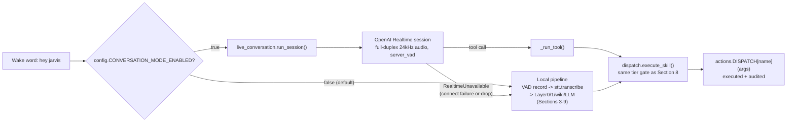

# voice-standalone — Project Overview

A single, unified account of what this project is, how it was actually
built (step by step, with what was tried and rejected along the way), what
it can't do yet, and how to run it. It replaces the need to cross-reference
`ARCHITECTURE.md`, `STEP7_BUILD_GUIDE.md`, and `STEP8_CONVERSATION_PLAN.txt`
separately — those three documents are the sources this file synthesizes,
and they remain in the repo as the detailed historical record; this file is
the narrative that ties them together.

## 1. What this is

`voice-standalone` is an always-on, local voice-command assistant for a
Linux desktop: wake word or a tray click starts listening, speech becomes
an action (open an app, search the web, change a system setting, run a
file operation, or hold a real conversation), and the assistant speaks a
response back. It was built outside NeuroPaca deliberately, to prove the
shape works standalone before any integration is considered.

Three design commitments run through every step below:

- **Skills first, LLM as fallback, never as the default.** A deterministic,
  regex-driven skill catalog resolves the overwhelming majority of commands
  in under a millisecond, with zero network dependency. An LLM (cloud, with
  a local fallback) is only consulted once every deterministic layer has
  already failed to resolve an utterance — the opposite of "send everything
  to an LLM and hope."
- **Never execute a best guess.** Anything that names a real thing (an app,
  a file) gets corrected against the actual list of real things before
  running, rather than acting on a plausible-sounding misheard string.
- **One execution chokepoint, tier-gated.** No matter which layer resolved
  a command — grammar match, semantic match, a cloud LLM, or (as of Step 8)
  a live conversational model — every single action passes through the same
  tier check (`SAFE` / `REVIEW` / `DANGEROUS`) before anything happens on
  the real system. A more capable front end never means a looser back end;
  this is the one property every step below was built to preserve.

## 2. Step 0 — the scaffold that proved the shape

The first working slice: `audio_capture.py` (push-to-talk recording),
`stt.py` (transcription, Gemini at the time), `llm_intent.py` (Gemini
function-calling over 5 hand-picked actions), `actions.py` (those 5
executors), and a flat `skills.py` with regex matchers for 4 of them. This
was never meant to be the final shape — it existed to prove that
"transcribe → resolve → execute" worked end to end before investing in a
real skill catalog on top of it.

## 3. Step 1 — the deterministic grammar layer (Layer 0)

`skills.py` became the `skills/` package, one file per category, and the
skill catalog was scaled from 5 to 48 hand-curated skills across categories
A (system/power control), B (app/window management), and the
account-free half of C1 (web search and general knowledge). The catalog
itself wasn't invented from scratch — 78 skill names came from the
archived `MycroftAI/mycroft-skills` collection and 36 from the live
OpenVoiceOS skill store, filtered down to what actually fits a Linux
desktop assistant with real system access (hardware-specific speaker
skills, IoT/smart-bulb control, and a literal WiFi-cracking skill were all
dropped).

Layer 0 is a linear regex/keyword scan, one matcher per skill, measured
live at **~0.71ms** for the full scan — the deliberately deterministic,
zero-ambiguity floor every other layer only gets consulted when this one
misses.

## 4. Step 2 — local semantic match (Layer 1)

A flat regex catalog doesn't survive paraphrasing — "turn the volume up"
matches, "crank up the sound" doesn't. Layer 1 exists to catch paraphrases
without paying for an LLM call on every utterance: the spoken sentence and
a handful of example phrases per skill are converted to vectors, and
similarity is a single matrix multiplication — milliseconds of local
arithmetic, no network.

The embedding model itself was benchmarked, not assumed:
`sentence-transformers`/all-MiniLM (the common default, torch-based) took
~15s to import+load even warm, ~52s cold — a real, previously-unknown
startup cost. `fastembed` (ONNX-based, no torch, model
`BAAI/bge-small-en-v1.5`) loads in ~1.3s warm with near-identical
per-utterance latency (~12ms), and is what actually shipped.

Thresholds were tuned against 58 independently-worded test cases
(`smoke_test_semantic.py`), not guessed: correct matches and
reject-worthy negatives turned out to *overlap* in the 0.71-0.75 score
range for this model, so no single threshold gets every case right. The
threshold was set to 0.75/0.55, deliberately prioritizing zero false
accepts (a wrong action silently executing — the dangerous failure mode)
over false rejects (safe — the utterance just falls through to the LLM).
Final measured result: 50/58 correct, 0 false accepts, 7 safe false
rejects, and one known, accepted low-harm collision (`get_time` vs.
`timezone_conversion` — a distinction even a general-purpose embedding
model struggles with).

Real bugs caught while tuning this, not left in: a blend formula
(`0.7×cosine + 0.3×token-overlap`) that penalized genuine paraphrases
(fixed to `max(cosine, blended)`), and a number-word extractor that
understood "two" but not "second" (an ordinal), which silently broke a
skill that had actually scored well above threshold.

## 5. Step 3 — the correction layer, generalized

Layer 0/1 resolve *which skill*; the correction layer resolves *which
real thing* an argument refers to, once accuracy matters more than speed.
`skills/_correction.py`'s `resolve_against_known()` implements one
reusable ensemble: an exact substring match first, else
`0.6×edit-distance-ratio + 0.4×token-overlap` against the real candidate
list, cutoff-gated — never a plain best-effort guess. `app_name` is
currently the only argument audited as worth this treatment (an
authoritative installed-apps list exists, and a wrong guess launches the
wrong app); `timezone_conversion`'s location argument was deliberately
excluded, since forcing a strict local match against a necessarily
incomplete place-name list would be a regression against the lenient
resolution the executor already gets for free downstream.

Two real ordering bugs were found and fixed here, both worth naming
because they're a real, general trap: `resolve_against_known()` originally
returned on the *first* substring hit found in candidate-list order rather
than the best one — "cosmic files" matched GNOME's `Files` (a coincidental
substring) instead of the intended `CosmicFiles`, and separately
"settings" matched a 48-character desktop ID containing the word
"settings" instead of the exact match `org.gnome.Settings`. The fix wasn't
just "check one direction" — it required collecting *all* substring hits
and picking the one with the shortest match key (the tightest, most
specific match), not whichever the list happened to enumerate first.

## 6. Step 4 — scaling the catalog, wave by wave

Categories D (media), E (files), F (dev tools), a minimal G (2 test
to-do skills, not the full 16-item catalog), J (assistant meta), and L
(maintenance) were added — roughly 55 more skills, 105 total. This step
was explicitly *closed by scope decision*, not full completion:
categories I (fun/personality) and K (network/connectivity) were skipped
outright per direct instruction, and Layer 1 (semantic match) was never
extended to these newer skills — they resolve via Layer 0 grammar only,
so a paraphrase that misses its regex falls straight to the LLM instead of
a fast local match, unlike the original 50.

Real safety-relevant decisions made while building this wave: `delete_file`
and `empty_trash` use `gio trash` (recoverable) rather than a raw unlink,
even ahead of the tier system existing; `install_updates`/`restart_service`
use `pkexec`, never raw `sudo`, so a voice command can never silently
escalate privileges or hang on a nonexistent terminal password prompt.

The tray icon and the two always-on `systemd --user` services
(`daemon.py`, `tray.py`) were built ahead of schedule at this point,
replacing `main.py`'s `input()`-gated push-to-talk as the real day-to-day
interface — `main.py` is now kept for manual/dev testing only, consistent
with a standing "no terminal control surfaces" preference for this
project. The tray and daemon talk over a simple FIFO
(`~/.local/share/voice-standalone/toggle.fifo`), two independent
processes rather than one process mixing GTK's main loop with the venv's
audio/LLM pipeline.

## 7. Step 5 — wake word and turn detection

`daemon.py` was rewritten around one continuous `sd.InputStream` feeding a
small idle/recording state machine, rather than opening a fresh stream per
command. The wake word is openwakeword's bundled `hey_jarvis` model; turn
detection (knowing you've stopped talking) is openwakeword's bundled
Silero VAD wrapper — a genuinely simpler mechanism than the LiveKit-style
semantic turn-detector originally scoped, documented as that substitution
rather than passed off as equivalent. A wake-word session stops
automatically after ~1.2s of continuous non-speech following detected
speech, or a 4s timeout if nothing is ever said, or a 20s safety cap
regardless. The manual tray-click path is fully independent and ignores
VAD entirely — a second click is always the stop signal, exactly as
precise as before wake word existed.

Verified live: 12+ seconds of real ambient room noise produced a max
wake-word score of 0.0 and max VAD score of 0.27, both comfortably below
their activation thresholds — no false positives on silence. A real,
unrelated critical bug was caught during this work: `gemini-2.5-flash`
(the STT/intent model since Step 0) returned a live 404, "no longer
available to new users" — this was blocking every single voice
interaction, wake-word-related or not, and got fixed by switching to the
model the API's own error message recommended.

## 8. Step 6 — safety tiers

The tier mechanism itself was built here; *activation* is a separate,
explicit decision that has never been flipped on (`config.SAFETY_TIERS_ENABLED`
defaults to `false`). Every skill is statically tagged at definition time —
`skills/_tiers.py`'s `tier_of(name)` — into `DANGEROUS` (the 11 skills
already carrying an individually-reasoned risk marker from earlier steps:
`shutdown`, `restart`, `force_quit`, `rename_file`, `move_file`,
`delete_file`, `empty_trash`, `kill_process`, `install_updates`,
`restart_service`, `run_terminal`), `REVIEW` (2 skills: `clear_app_cache`,
`extract_archive` — real but recoverable side effects), or `SAFE`
(everything else, the large majority — read-only, reversible, or a launch).

`skills/_machine_scan.py` is a second, independent tripwire: before a
DANGEROUS preview is even shown, the resolved command is checked against a
pattern list (`rm -rf`, `dd`, `mkfs`, a raw write to `/dev/sd*`, piping a
download into a shell, `sudo`/`pkexec`, `kill -9`, fork-bomb patterns,
recursive `chmod 777`) and flagged visibly if it hits.

`confirm_loop.py`'s `confirm_and_run(name, args)` is the actual gate for
DANGEROUS skills: a generator that pauses right before running anything,
yielding a preview and any machine-scan warnings; whatever's watching can
edit the value while it's paused, and on resume the loop re-reads from
that edited value, never the original guess. `main.py`'s terminal mode
gets the full version — real text editing via `input()`. `daemon.py`'s
tray-driven path gets a documented, deliberately lighter variant: no text
input exists on a tray icon, so it notifies with the preview and warnings
and waits up to 10 seconds for a second tray click as confirmation,
auto-cancelling on timeout. `skills/_audit.py` logs every resolved action
— text heard, skill, args, tier, outcome — to
`~/.local/share/voice-standalone/audit.jsonl`, unconditionally, regardless
of whether `SAFETY_TIERS_ENABLED` is on; this is observability, not a
gate, so it doesn't wait on the activation decision.

A real bug was caught while testing this mechanism, not before: `run_terminal`
used `subprocess.run(command, shell=True)` with no output capture, so the
child inherited the parent's real stdout file descriptor directly —
invisible to `contextlib.redirect_stdout`, which only intercepts
Python-level writes. This silently broke both the confirm-loop's own
"real output feeds back into the next step" contract and `repeat_last_response`
for any terminal command, quietly, since Step 4 — fixed by adding
`capture_output=True`.

## 9. Step 7 — spoken output (TTS)

The shipped engine is **Piper** (`en_IN-spicor`, NavGurukul AI Labs) for
English and **Kokoro** (`hf_alpha`) for Hindi, streamed via RealtimeTTS —
but this was the third English engine tried, not the first, and the
history matters because it explains real constraints still in force today.

**MeloTTS** (`EN_INDIA`) was the original English voice — a genuine
dedicated Indian-English speaker, 0.15-0.20s/sentence warm. It had a real
cold-start bug (a BERT text-frontend lazy-loading on the first *actual*
synthesis call, not construction, costing 5.8-22.7s — caught because the
daemon's "Ready" notification appeared instantly while its spoken
confirmation silently lagged up to 20s behind). That bug was fixed
properly, but the deciding flaw was different: `EN_INDIA` was MeloTTS's
*only* Indian-English voice, with no pitch/timbre control exposed —
when it didn't sound right, nothing could be tuned. It was removed
entirely once Piper's voice turned out to actually sound right, making
MeloTTS's whole engine redundant.

**Kokoro was also tried for English** (9 real male + 9 female American
voices) — genuinely good variety, zero Indian accent, which was the whole
point of the exploration. Kept for Hindi only, where it already has real
voices (`hf_alpha`/`hf_beta` female, `hm_omega`/`hm_psi` male, verified
directly against Kokoro's own voice list).

**Punjabi (AI4Bharat's IndicF5)** was built and benchmarked as a real
gap-filler — no mainstream TTS project has Punjabi support — but it's a
voice-cloning model, not a built-in-voice one, and its latency was
measured, not assumed: 14.4s (CUDA) / ~55s (CPU) per short phrase in
isolation, confirmed worse (96s) in a full-pipeline benchmark with every
other model also resident. Removed entirely rather than left disabled;
`tts.py` no longer imports `transformers`/`torchaudio` for it at all.

The engine that shipped, measured live: Piper cold-loads in ~1.1s and
synthesizes ~0.3s per sentence, CPU-only (zero GPU/VRAM use, which matters
on this machine's shared 4GB card). `clean_for_speech` strips
markdown/code/URLs/bullets and truncates long output to a spoken gist; both
engines run at a 0.95 speed multiplier for a calmer cadence.
Hinglish/code-switched speech and multi-language *input* matching (as
opposed to output) are both explicitly out of scope, by direct instruction,
not oversight.

**A serious infrastructure bug surfaced when Piper replaced MeloTTS**, worth
naming because it shaped how TTS is architected today: the daemon hung
intermittently and non-deterministically at startup — sometimes reaching
"Ready" in seconds, sometimes stuck 14+ minutes, sometimes burning CPU
with no error. Two distinct real causes were found: torch bundles its own
private `libgomp.so.1` separate from the system's, and constructing
Kokoro's engine alongside onnxruntime (openwakeword) in one process
reliably hung on a `torch.nn.LSTM` construction; separately, Python's
`subprocess` module uses `fork()+exec()`, and `fork()` in a
multi-threaded process is a documented hazard — if another thread
(onnxruntime's or numpy's own thread pools) held a lock at that instant,
the child inherits it permanently locked. This hit both `tts.py`'s own
spawns *and* `daemon.py`'s plain `notify-send` call, the latter being the
real, previously-camouflaged cause of the daemon hanging on its own first
notification. The fix is architectural, not a patch: `tts.py` now runs
**all synthesis in an isolated subprocess** (itself, invoked as a script)
rather than in the daemon's own process at all, via `os.posix_spawn`
(never `fork()`) with a hard timeout (25s for TTS, 10s for `notify-send`)
— a stuck call becomes "this one thing didn't happen," never "the daemon
never reaches Ready." The real, accepted cost: every `speak()` call now
pays its own process-spawn plus cold-load time rather than reusing a warm
in-process model — this is *why* the "Let me check" interim phrase exists,
and it's the same per-call cold-start cost that Step 8 (below) removes
entirely for a live conversation.

**The same day, the LLM fallback was actually turned on** (it had existed
since early steps but stayed off — Gemini's free-tier quota, 20
requests/day, turned "on" into "works for a few requests, then silently
stops," not a real fallback). `llm_intent.py` became a real cascade:
Gemini (`gemini-flash-lite-latest`, checked against the live model list,
not assumed) tries first and does double duty — picks a tool for a
command, or returns plain text for a genuine question, which now becomes a
real spoken answer via a new `answer_question` skill. On *any* Gemini
failure (a 429, a deprecated model, a network error), it falls through to
a fully local **Qwen2.5-1.5B** via Ollama, CPU-forced (to avoid VRAM
contention with Kokoro on the same 4GB card) — benchmarked directly
against Qwen2.5-3B first, which was dropped for being both slower and less
accurate with no measured upside. A 429 is remembered for the rest of the
day (`quota_tracker.py`) so later utterances skip straight to local instead
of re-paying a network round trip to fail again. A free Wikipedia
fast-path (`wiki_fastpath.py`) runs in front of this cascade entirely,
for narrow "what is X" phrasing — zero quota cost, since it isn't an LLM
call at all.

## 10. Step 8 — the OpenAI Realtime conversational layer (built this session)

**The problem this solves:** everything through Step 7 is a strictly
sequential, non-streaming pipeline — wake word, then a ~1.2s silence wait,
then ~1.1s local transcription, then skill resolution, then the action,
then a *separate*, freshly cold-started TTS call for the spoken
confirmation. Measured honestly, that's routinely 4-8 seconds of total
silence between finishing a sentence and hearing anything back, and every
turn requires re-saying the wake word — nothing like a real conversation.
Chaining STT → text LLM → TTS can be optimized, but it can't close that
gap structurally, because converting speech to text throws away tone,
pace, and emotion at the very first step; a text-only model downstream
never has access to any of it, no matter how fast each stage runs.

**The design, and why this shape specifically:** rather than replacing the
deterministic skills pipeline, a cloud audio-to-audio model (OpenAI's
Realtime API) sits *behind the existing wake word* as a new conversational
front end, with the entire existing skills/tiers/confirm-loop system kept
as the only thing that ever executes an action. The Realtime model
proposes tool calls; it never gets direct execution access, and
`run_terminal` — its most sensitive available tool — is gated by the exact
same `DANGEROUS`-tier `confirm_and_run` flow described in Section 8, not a
looser one. This is a genuinely new category of cloud dependency worth
naming honestly: every prior cloud call in this project (Gemini STT,
historically; Gemini intent resolution, currently) is one-shot and
per-utterance. Once conversation mode is on, continuous microphone audio
streams to OpenAI for the duration of an active session — gated behind the
wake word and behind a new flag that defaults off
(`config.CONVERSATION_MODE_ENABLED`), the same opt-in pattern as
`SAFETY_TIERS_ENABLED` and `LLM_FALLBACK_ENABLED` before it.

**What actually got built:**

- **`dispatch.py` (new).** `main.py` and `daemon.py` had independently
  duplicated the same tier-check-then-execute logic since Step 6 — both
  files' own docstrings already flagged this. Adding a third caller
  (Realtime tool calls) with its own copy would have made that worse, so
  the shared logic was factored into one function,
  `execute_skill(name, args, *, text, on_review=None)`, returning
  `{"outcome": "executed"|"needs_confirmation", ...}`, plus
  `finish_confirm()` to resume a paused DANGEROUS confirmation. All three
  callers (`main.py`, `daemon.py`, and the new `live_conversation.py`) now
  share this one chokepoint; each keeps its own UI (terminal print, tray
  notification, or a spoken tool response) around the result.
- **`live_conversation.py` (new).** Runs one conversation session per
  wake-word trigger via `client.realtime.connect(model="gpt-realtime")`
  (OpenAI's Python SDK, verified directly against the installed package's
  own source rather than assumed from memory — this surfaced real,
  current details like the event actually being named
  `response.output_audio.delta`, not the older `response.audio.delta`,
  and the API only supporting 24kHz PCM audio). Microphone audio streams
  continuously via `input_audio_buffer.append`; server-side VAD
  (`turn_detection: server_vad`) handles interruption natively — the model
  stops speaking the moment you start talking, with no separate client-side
  logic needed. Tool calls (`response.function_call_arguments.done`) are
  bridged through `dispatch.execute_skill` exactly as Section 9's diagram
  shows, and the result is sent back as a `function_call_output` so the
  model can react verbally. A session ends on an idle timeout (8s of
  silence on both sides), a tray click, or the model calling the existing
  `sleep_stop_listening` skill. The tool schema started as OpenAI-native
  plain dicts rather than reusing `llm_intent.py`'s Gemini
  `FunctionDeclaration` objects directly — those get converted internally
  into Gemini's own `Schema` pydantic type with uppercase type enums
  (`Type.STRING`), which isn't portable to OpenAI's JSON-schema shape
  without a real converter; duplicating six short tool definitions by hand
  was the simpler, more honest choice than building and maintaining that
  conversion layer for no real benefit.
- **A real race, found and fixed before it shipped:** the tray-click event
  (`_manual_toggle_event`) already does double duty elsewhere in this
  codebase (both the wake-word idle loop's manual trigger and DANGEROUS
  confirmation). Reusing it a third time, for "end this whole conversation,"
  meant a tray click meant to confirm a dangerous action mid-conversation
  could also be read as "stop the session" by an idle-timeout watcher
  running concurrently — ending the call right as the action was being
  approved. Fixed with a `confirm_pending` flag the confirm-wait sets before
  blocking on the event, which the session-idle watcher checks before
  treating a click as a stop signal.
- **`read_pdf` (new skill).** Finds a PDF by spoken name using the existing
  `find_file()` helper, extracts text via `pypdf`, and returns it (capped
  at ~12,000 characters) as real tool output the model can discuss —
  registered in `actions.DISPATCH`, in `skills/files.py`'s matcher list
  (as `_match_read_pdf`), and as a `FunctionDeclaration` in both the
  Realtime schema and `llm_intent.py`'s text-fallback tools, so it works
  through either path. A real regex bug was caught while testing this: an
  overly-permissive matcher pattern backtracked into treating the word
  "the" itself as the filename for phrasing like "read the pdf called X" —
  fixed by making the "called/named" clause required, not optional, in
  that branch of the pattern.
- **Graceful fallback, verified live, not just designed.** If the
  Realtime connection can't be established or drops mid-call, a specific
  `RealtimeUnavailable` exception is raised and caught in `daemon.py`,
  which falls through to the exact same single-shot pipeline described in
  Sections 3-9, unchanged. This was exercised for real during initial
  testing: an invalid API key produced a clean, logged fallback
  (`invalid_api_key`) rather than a crash or silence; once the key was
  corrected, a second real error (`insufficient_quota.credit_balance_exhausted`
  — no billing configured on the OpenAI account yet) triggered the same
  clean fallback again. As of this writing, a real Realtime session has
  still never successfully connected end-to-end; both failures exercised
  the fallback path, not the conversation path itself.

## 11. Known limitations and explicitly deferred work

This section is deliberately specific, not a vague disclaimer:

- **Safety tiers are built but never activated.** `SAFETY_TIERS_ENABLED`
  has been `false` for the entire life of this project; every skill,
  including the 11 `DANGEROUS`-tagged ones, currently executes immediately
  on a confident match. Turning it on is an explicit, still-pending
  decision, not a bug.
- **The tray can't edit a misheard command.** `daemon.py`'s DANGEROUS
  confirmation is confirm-or-cancel-by-click only — there's no text input
  on a tray icon. Full editable-preview confirmation only exists in
  `main.py`'s terminal mode.
- **Exact tier assignments haven't been re-audited past the original 13.**
  The 11 original `DANGEROUS` skills plus 2 `REVIEW` additions were each
  individually reasoned; the other ~90+ skills default to `SAFE` by
  omission, not by a fresh audit of each one — worth a second look before
  `SAFETY_TIERS_ENABLED` is ever flipped on for real.
- **Layer 1 (semantic match) only covers the original 50 skills**, not the
  ~55 added in Step 4. Paraphrases of newer skills that miss their exact
  Layer 0 regex fall straight to the LLM cascade instead of a fast local
  match.
- **Every ⚙️-tagged skill is unbuilt** — Spotify, calendar, email, Wolfram
  Alpha, weather, news, Telegram, VPN, and similar all need an external
  account/API setup that was never done. Categories I (fun/personality)
  and K (network/connectivity) were skipped entirely by explicit decision,
  not oversight.
- **Hinglish/code-switched speech and multi-language input matching are
  both explicitly out of scope**, by direct instruction — Step 7 is
  output-only (it can speak Hindi, it can't understand spoken Hindi
  commands).
- **Step 8's Realtime tool schema covers 6 skills, not the full catalog.**
  Exposing the other ~100 would need an auto-generation strategy from
  `actions.DISPATCH`/`_tiers`, deliberately not attempted yet.
- **No real web-fetch-and-summarize tool exists.** `google_search` and
  similar skills open a browser tab; they don't fetch and read back page
  content. The Realtime model's own general knowledge covers casual
  "look this up" questions for now.
- **Two concurrency risks in Step 8 are flagged, not solved:** opening a
  second `sounddevice` input stream at 24kHz for a Realtime session while
  the existing 16kHz wake-word stream stays open relies on PipeWire
  allowing two concurrent opens on the same source — plausible on this
  system's audio stack, not yet verified live. Separately, there's no
  acoustic echo cancellation: on a laptop with speakers instead of
  headphones, the model may hear its own voice played back through the
  speaker and misinterpret it as user speech or a false interruption. The
  first real end-to-end test should use headphones.
- **Step 8 has never actually connected to a live Realtime session.** Both
  real tests so far exercised the fallback path (an invalid key, then an
  account with no billing configured), not the conversation path itself —
  the actual audio-in/audio-out behavior, tool-calling round trip, and
  barge-in handling remain unverified against a real connection.
- **`main.py` has no Realtime conversation mode.** Step 8 is
  daemon/tray-triggered only, matching how the tray-first, terminal-second
  pattern was already established for earlier steps.

## 12. How to actually run this

Two systemd `--user` services carry this day to day, both tied to
`graphical-session.target` (needs the compositor's session — display,
D-Bus, audio — already up, not just the OS booting):

- `voice-daemon.service` — the always-on loop: wake word, VAD recording,
  resolution, execution, spoken + notified response. Runs from the
  project's own `.venv` (it needs `google-genai`, `sounddevice`,
  `faster-whisper`, `openai`, and the rest of `requirements.txt`).
- `voice-tray.service` — the tray icon, deliberately under system
  Python, not the project venv (GTK/AppIndicator bindings are a desktop
  dependency, not a project runtime one).

`main.py` remains for manual/dev testing only — a terminal, push-to-talk
loop with the one advantage of full text-editable DANGEROUS-tier
confirmation.

Every behavior-changing switch lives in `config.py`, reads from `.env`,
and defaults **off** — each one is an explicit, opt-in decision, not a
default that quietly changed itself:

| Flag | Default | What it actually changes |
|---|---|---|
| `LLM_FALLBACK_ENABLED` | `true` (turned on 2026-09-16) | Whether an utterance that misses Layer 0, Layer 1, and the Wikipedia fast-path gets a real LLM cascade (Gemini, then local Qwen2.5-1.5B) instead of just "no matching action." |
| `SAFETY_TIERS_ENABLED` | `false` | Whether `REVIEW`/`DANGEROUS` skills actually pause (review notice + 2s, or the full confirm-loop) — off means every skill, including the 11 DANGEROUS ones, runs immediately. The audit log runs regardless of this flag. |
| `CONVERSATION_MODE_ENABLED` | `false` | Whether a wake-word trigger opens a live OpenAI Realtime conversation session instead of the single-shot local pipeline. Needs `OPENAI_API_KEY` set and a funded OpenAI account (Realtime audio is billed per minute of audio in *and* out). |

Restart `voice-daemon.service` after changing any of these — they're read
once, at process start, from `.env` via `python-dotenv`.
