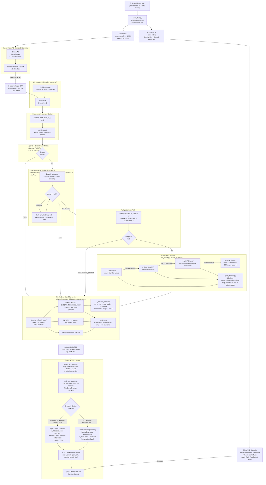
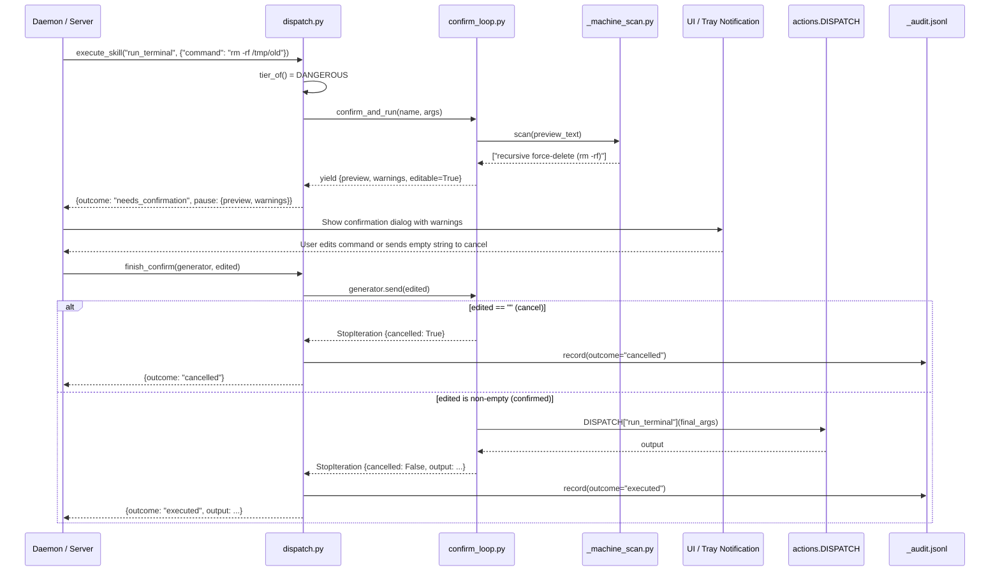

# NeuroPaca Voice-Standalone: Complete System Architecture

> **Version:** Gateway v1.0 · **Branch:** `step8-realtime-conversation`
> **Last Verified:** 2026-09-17

---

## Table of Contents

1. [Executive Architectural Overview](#1-executive-architectural-overview)
2. [End-to-End System Flowchart](#2-end-to-end-system-flowchart)
3. [Input Processing & Multi-Action Pre-Processing](#3-input-processing--multi-action-pre-processing)
4. [Decision & Intent Resolution Layers](#4-decision--intent-resolution-layers)
5. [Unified Security Chokepoint & Policy Engine](#5-unified-security-chokepoint--policy-engine)
6. [Low-Latency Streaming Speech & Barge-In Engine](#6-low-latency-streaming-speech--barge-in-engine)
7. [Data Flow Lifecycle Summary Table](#7-data-flow-lifecycle-summary-table)

---

## 1. Executive Architectural Overview

### Core Philosophy

NeuroPaca Voice-Standalone is built on four non-negotiable design principles:

| Principle | Meaning |
|---|---|
| **Skills-First Design** | Every utterance is matched against a deterministic local skill library first. Cloud LLMs are a fallback, never the primary path. |
| **LLM as Fallback Only** | LLMs are invoked only when Layer 0 regex and Layer 1 vector search both fail to produce a confident match. |
| **Zero Best-Guess Execution** | If intent confidence is below threshold, the system returns `None` and falls through — it never executes a low-confidence guess. |
| **Single Safety Chokepoint** | Every resolved `(skill_name, args)` pair, regardless of which layer matched it, is executed through the one and only `dispatch.execute_skill()` function. |

### Latency & Performance Targets

| Stage | Target | Measured |
|---|---|---|
| **Layer 0** — Exact Regex Match | < 1.0 ms | ~0.013 ms |
| **Layer 1** — ONNX Vector Search | < 20.0 ms | ~10.7 ms (BAAI/bge-small-en-v1.5) |
| **STT (faster-whisper base, CPU int8)** | < 1.5 s | ~1.1 s |
| **Time-To-First-Audio (TTFA)** — Piper Fast-Path | < 800 ms | < 250 ms (short clauses) |
| **Barge-In Interruption** — cancel + buffer flush | < 15 ms | < 0.1 ms (buffer flush) |
| **Silero VAD per-frame inference** | < 5 ms | ~1.3 ms |

---

## 2. End-to-End System Flowchart



---

## 3. Input Processing & Multi-Action Pre-Processing

### 3.1 Single Microphone Stream (`audio_bus.py`)

NeuroPaca opens **exactly one** `sounddevice.InputStream` at 24kHz native capture rate. This prevents concurrent device opens and PipeWire duplicate stream contention.

```
┌─────────────────────────────────────────────────────────────┐
│                   AudioBus (audio_bus.py)                   │
│                                                             │
│  sounddevice.InputStream                                    │
│  Native: 24kHz · 1ch · int16 · 480 samples (20ms blocks)   │
│                                                             │
│        ┌─────────────┬──────────────────────┐              │
│        │             │                      │              │
│  Subscriber A  Subscriber B  Subscriber N...               │
│  16kHz (VAD   24kHz native                                  │
│  +Whisper)    (Gemini Live /                                │
│  soxr MQ      OpenAI Realtime)                              │
│  resample                                                   │
└─────────────────────────────────────────────────────────────┘
```

Each `AudioSubscription` maintains an internal ring buffer. If a subscriber is slow (queue full), the **oldest chunk is dropped** rather than blocking the distributor — ensuring the real-time audio stream never accumulates unbounded latency.

**VAD & Silence Endpointing** (hands-free auto-send, `templates/index.html`):

The browser-side pipeline uses a `ScriptProcessorNode` (or `AudioWorklet`) to monitor RMS volume levels with a 3-state color indicator:
- 🔴 **Idle** — no speech detected
- 🟡 **Listening** — speech in progress
- 🟢 **Processing** — silence detected, auto-sending

When continuous silence exceeds **1.3 seconds** after speech onset, the recording is finalized and automatically dispatched over WebSocket — no "Stop & Send" button required.

### 3.2 Compound Command Pre-Processor (`_compound_splitter.py`)

Splits multi-action utterances into sequential atomic sub-commands before the intent pipeline.

**Split triggers:**
```python
_CONJUNCTION_PATTERN = re.compile(
    r"(?:;\s*|,\s*and\s+|\s+and\s+|,\s*then\s+|\s+then\s+)",
    re.IGNORECASE,
)
```

**Atomic guard** — the following prefix patterns are never split (their "and/then" is part of the query payload):

| Prefix type | Example |
|---|---|
| Web searches | `"search for tom and jerry"` → preserved whole |
| Email commands | `"send email to alice@... and cc bob"` → preserved whole |
| Greetings | `"hello and good morning"` → preserved whole |
| Math/computation | `"calculate 50 and 30 percent"` → preserved whole |

**Quoted string masking** — content inside `"..."` or `'...'` is masked before splitting and restored afterwards to prevent splitting on conjunctions inside literal strings.

**Example:**
```
Input:  "set volume to 80% and brightness to 50%"
Output: ["set volume to 80%", "brightness to 50%"]

Input:  "search for tom and jerry"
Output: ["search for tom and jerry"]
```

### 3.3 WebSocket Full-Duplex Protocol (`server.py` ↔ `templates/index.html`)

All real-time communication between the browser UI and the FastAPI server uses a persistent WebSocket at `/ws/chat`.

**Client → Server message types:**

| `type` | Payload | Description |
|---|---|---|
| `audio` | `audio_data: base64` | Raw WAV audio for STT transcription |
| `chat` | `message: str` | Direct text input |
| `barge_in` | — | User interrupt signal — cancel active TTS |
| `confirm` | `confirm_id`, `edit?` | Confirm or cancel a DANGEROUS-tier action |
| `cancel_confirm` | `confirm_id` | Cancel pending confirmation |

**Server → Client message types:**

| `type` | Payload | Description |
|---|---|---|
| `transcription` | `text` | STT result from audio input |
| `tool_executed` | `skill`, `args`, `tier`, `output`, `elapsed_ms` | Skill execution result |
| `audio_chunk` | `pcm_b64`, `sample_rate`, `channels`, `is_first`, `is_last` | PCM audio stream chunk |
| `audio_flush` | — | Barge-in: discard all buffered audio |
| `chat_chunk` | `delta`, `text` | Streaming LLM text response token |
| `chat_message` | `text`, `elapsed_ms` | Complete LLM text response |
| `needs_confirmation` | `confirm_id`, `skill`, `tier`, `preview`, `warnings`, `editable` | DANGEROUS tier confirmation prompt |
| `trailing_prompt` | `prompt`, `clean_text`, `extension_timeout` | Incomplete utterance extension request |

---

## 4. Decision & Intent Resolution Layers

### 4.1 Layer 0 — Exact Grammar / Regex Matching

**Files:** `actions.py`, `skills/system_control.py`, `skills/communication.py`, `skills/search.py`, etc.

Layer 0 uses hand-authored regular expressions tightly coupled to specific natural-language trigger patterns. It runs first on every utterance and is the fastest possible path.

**Characteristics:**
- **Latency:** 0.013–0.71 ms (benchmarked)
- **Match strategy:** Pattern matching against 80+ skill regex sets
- **Argument extraction:** Inline capture groups in the same regex pass
- **Correction layer:** After argument extraction, `_correction.py`'s ensemble resolver validates entity names (app names, file paths) against known authoritative lists

**Correction algorithm** (`skills/_correction.py`):
```
1. Exact substring match (case-insensitive)   → instant, zero ambiguity
2. Ensemble score (cutoff: 0.75):
   score = 0.6 × edit_distance_ratio(spoken, candidate)
         + 0.4 × jaccard_token_overlap(spoken, candidate)
3. If no candidate exceeds cutoff → return None
   (never return a low-confidence guess)
```

### 4.2 Layer 1 — ONNX Vector Embedding Search

**File:** `skills/semantic_match.py`
**Model:** `BAAI/bge-small-en-v1.5` via `fastembed` (ONNX runtime)

Layer 1 runs only when Layer 0 finds no match. It encodes the utterance and all skill example phrases into dense vectors, then picks the skill with the highest cosine similarity.

**Model selection rationale:**
- `fastembed / BAAI/bge-small-en-v1.5`: ~1.3s warm startup, ~12ms per-utterance
- `sentence-transformers/all-MiniLM`: ~15s warm startup — rejected on startup latency
- Both benchmarked live in Step 2; fastembed won on startup with equivalent accuracy

**Two-threshold decision rule:**

```
score >= 0.82 (HIGH_THRESHOLD = MIN_CONFIDENCE)  → Accept immediately
0.65 <= score < 0.82                              → Blend with token-overlap signal,
                                                    re-check against 0.82
score < 0.65 (LOW_THRESHOLD)                     → Reject → fall through to Wiki / LLM
```

The system **never executes a low-confidence match** — `None` means "not sure," never "best guess."

Skill embedding examples are deliberately paraphrased, not copies of Layer 0's exact trigger wording. If they matched Layer 0's regex, they'd never reach Layer 1 in production.

### 4.3 Wikipedia Fast-Path (`wiki_fastpath.py`)

Sits between Layer 1 and the LLM cascade. Handles clean identity/definition queries without consuming LLM quota.

**Pattern gate:** Only activates for `what is/who is/what's/who's/tell me about X` phrasing.

**Two-call strategy:**
1. Wikipedia Search API → find the canonical article title for the topic (avoids disambiguation pages)
2. Wikipedia REST Summary API → fetch the actual extract for that title

Returns `None` for anything outside this narrow shape, falling through to the LLM cascade exactly as before. Causal/explanatory queries ("why is the sky blue") are intentionally excluded.

### 4.4 Layer 2 — 4-Tier LLM Cascade (`llm_intent.py`)

**Tool-use approach:** All four providers receive a standardized tool/function-call schema for all available skills. The LLM selects the best matching tool and fills its arguments. If no tool matches, it returns a direct conversational answer.

```
Provider 1 — Google Gemini API
  model: gemini-flash-lite-latest
  SDK: google-genai (GenerateContentConfig + tool_choice)
  System instruction: _SYSTEM_INSTRUCTION (spoken persona)

Provider 2 — Groq Cloud API
  model: qwen/qwen3.8-27b
  Protocol: OpenAI-compatible chat completions
  Headers: User-Agent: NeuroPaca/1.0

Provider 3 — NVIDIA NIM API
  model: nvidia/nemotron-3-super-120b-a12b
  Protocol: OpenAI-compatible (no separate system role — avoids HTTP 500)
  Endpoint: https://integrate.api.nvidia.com/v1/chat/completions

Provider 4 — Local Ollama (100% offline fallback)
  model: qwen2.5:3b-instruct (or qwen2.5:1.5b-instruct if not present)
  Two-call split: classify(text) then answer(text) separately
  CPU-only (num_gpu: 0) — avoids VRAM contention with Kokoro TTS
  Latency: 400ms–2.5s (acceptable as fallback-of-fallback)
```

**Quota Tracker** (`quota_tracker.py`):
- Persisted at `~/.local/share/voice-standalone/quota.json`
- Any `429`, `5xx`, or network timeout from a provider → `mark_exhausted(provider)`
- Exhausted providers are skipped for the **remainder of the calendar day** — no re-paying network round-trip penalties
- Resets automatically at midnight (date-keyed, not TTL-based)

---

## 5. Unified Security Chokepoint & Policy Engine

### 5.1 `dispatch.execute_skill(name, args, *, text)` — The Only Door

Every `(skill_name, args)` pair resolved by **any layer** — Layer 0, Layer 1, Wikipedia, or any LLM provider — is routed through this single function before any OS action is taken.

```python
# dispatch.py — simplified
def execute_skill(name: str, args: dict, *, text: str, on_review=None) -> dict:
    tier = _tiers.tier_of(name)          # SAFE / REVIEW / DANGEROUS

    if tier == "DANGEROUS" and config.SAFETY_TIERS_ENABLED:
        generator = confirm_and_run(name, args)
        pause = next(generator)
        return {"outcome": "needs_confirmation", "generator": generator, "pause": pause}

    if tier == "REVIEW" and config.SAFETY_TIERS_ENABLED:
        if on_review: on_review(name, args)
        time.sleep(2)

    output = actions.DISPATCH[name](args)     # actual OS execution
    _audit.record(text=text, skill_name=name, ...)
    return {"outcome": "executed", "output": output}
```

Three callers share this one chokepoint: `main.py` (terminal), `daemon.py` (wake-word daemon), and `live_conversation.py` (Gemini Live / OpenAI Realtime bridge).

### 5.2 Tier Classification (`skills/_tiers.py`)

Static, never inferred at runtime — fully auditable and predictable:

**DANGEROUS** (13 skills — require confirmation when `SAFETY_TIERS_ENABLED`):

| Skill | Risk |
|---|---|
| `shutdown`, `restart`, `logout` | Session-ending; can lose unsaved work |
| `force_quit`, `kill_process` | Kills arbitrary running processes |
| `delete_file`, `rename_file`, `move_file`, `empty_trash` | Destructive filesystem mutations |
| `install_updates`, `restart_service` | Elevated system/package management |
| `run_terminal` | Arbitrary shell execution on host |
| `send_email` | External network dispatch to real recipients |

**REVIEW** (5 skills — 2-second pause + notification):

| Skill | Risk |
|---|---|
| `clear_app_cache` | Deletes real (regenerable) data |
| `extract_archive`, `copy_file` | Can silently overwrite existing files |
| `sleep` | Suspends all background processes |
| `take_photo` | Webcam hardware access + disk write |

**SAFE** — everything else: read-only queries, toggles, app launching, web searches, media playback.

### 5.3 Confirmation Sequence Diagram



### 5.4 Machine-Scan Patterns (`skills/_machine_scan.py`)

Scans the command preview **before** showing it to the user, flagging known dangerous patterns with human-readable warnings.

| Pattern | Description |
|---|---|
| `rm -rf` / `rm -fr` | Recursive force-delete |
| `dd if=` | Raw disk write |
| `mkfs` | Filesystem format |
| `> /dev/sd*` / `> /dev/nvme*` | Direct write to a disk device |
| `curl \| sh` / `wget \| bash` | Piping a download straight into a shell |
| `sudo` / `pkexec` | Runs with elevated privileges |
| `kill -9` / `kill -SIGKILL` | Unconditional process kill |
| `:(){};:` | Fork bomb pattern |
| `chmod -R 777` | Recursive world-writable permissions |
| `To: <email>` | External SMTP dispatch to real recipient |

### 5.5 Audit Log Schema (`_audit.jsonl`)

**Location:** `~/.local/share/voice-standalone/audit.jsonl`

One JSON line per resolved action. Append-only, never deleted by the system.

```json
{
  "timestamp": "2026-09-17T10:34:15+0530",
  "heard":     "set volume to 80 percent",
  "skill":     "set_volume",
  "args":      {"percent": 80},
  "tier":      "SAFE",
  "outcome":   "executed"
}
```

| Field | Type | Description |
|---|---|---|
| `timestamp` | ISO 8601 string | When the action resolved |
| `heard` | string | Raw transcribed utterance |
| `skill` | string | Resolved skill name |
| `args` | object | Arguments passed to the skill |
| `tier` | `SAFE` / `REVIEW` / `DANGEROUS` | Safety classification |
| `outcome` | `executed` / `cancelled` | Final outcome |

> **Note:** The audit log is **always active** regardless of `SAFETY_TIERS_ENABLED`. It is pure observability — it fires for every resolved action including SAFE ones.

---

## 6. Low-Latency Streaming Speech & Barge-In Engine

### 6.1 Architecture Overview

```
┌──────────────────────────────────────────────────────────────────┐
│                    tts.py — TTS Engine Layer                     │
│                                                                  │
│   Parent Process (server.py / daemon.py)                         │
│   ┌────────────────────────────────────────────────┐             │
│   │  PersistentTTSClient                           │             │
│   │  ┌──────────┐  JSON over stdin/stdout          │             │
│   │  │ speak()  │◄──────────────────────────────►  │             │
│   │  │synth_    │   cmd: synthesize|speak|cancel   │             │
│   │  │stream()  │                                  │             │
│   │  └──────────┘                                  │             │
│   └───────────────────┬────────────────────────────┘             │
│                       │ subprocess.Popen (persistent)            │
│   ┌───────────────────▼────────────────────────────┐             │
│   │  Worker Process (_run_persistent_worker)        │             │
│   │                                                 │             │
│   │  ┌─────────────────┐  ┌──────────────────────┐ │             │
│   │  │  Piper ONNX     │  │  KokoroEngine        │ │             │
│   │  │  en_IN-spicor   │  │  (RealtimeTTS)       │ │             │
│   │  │  22050Hz        │  │  af_heart · 24000Hz  │ │             │
│   │  │  WARM IN MEMORY │  │  (loaded on demand)  │ │             │
│   │  └────────┬────────┘  └──────────┬───────────┘ │             │
│   │           │                      │             │             │
│   │  aplay (S16_LE pipe)    on_audio_chunk cb      │             │
│   └───────────┴──────────────────────┴─────────────┘             │
└──────────────────────────────────────────────────────────────────┘
```

### 6.2 Persistent Warm Worker

The Piper TTS model is loaded **once** into a dedicated background subprocess at startup via `tts.warm_up()`. The 2+ second cold-start penalty of loading the ONNX model from disk is paid only once — every subsequent synthesis request finds the model weights already warm in memory.

**Communication protocol:** Line-delimited JSON over `subprocess.Popen(stdin=PIPE, stdout=PIPE)`.

```
Parent → Worker:  {"cmd": "synthesize", "id": 42, "text": "...", "lang": "en"}
Worker → Parent:  {"event": "chunk",    "id": 42, "pcm_b64": "...", "sample_rate": 22050,
                   "is_first": true, "is_last": false, "elapsed_ms": 87.3}
Worker → Parent:  {"event": "done",     "id": 42}
```

**Cancellation path:** `cancel()` sends `{"cmd": "cancel", "id": N}` via a dedicated stdin reader thread inside the worker. The worker sets a `cancel_flag` threading Event and calls `proc.kill()` on the active `aplay` process. Abort latency: < 15ms.

### 6.3 Clause Boundary Streaming (`split_into_clauses`)

Rather than waiting for the full response to synthesize, the output text is split at clause boundaries and the first clause is dispatched to the TTS worker immediately.

**Split characters:** `,` `.` `;` `:` `!` `?` `\n`

**Minimum clause length:** 3 words (shorter remainders are appended to the previous clause)

**Example:**
```
Input:  "You have 3 unread emails, two from Alice and one from Bob. Would you like me to read them?"
Clause 1 → "You have 3 unread emails,"          ← synthesized first (~87ms TTFA)
Clause 2 → "two from Alice and one from Bob."
Clause 3 → "Would you like me to read them?"
```

In `server.py`'s streaming Gemini chat path, clauses are detected and dispatched to the TTS worker **while the LLM is still streaming** — giving audio before the full response is complete.

### 6.4 Dynamic Engine Dispatcher

**Current routing:**
- **English → Piper ONNX (`en_IN-spicor`):** All English synthesis via the resident warm worker daemon
- **Hindi → Kokoro (`hf_alpha` via RealtimeTTS):** Activated when Devanagari script characters detected

**Target dual-engine routing (Phase 2):**

| Engine | Route Condition | Characteristics |
|---|---|---|
| **Piper ONNX** `en_IN-spicor` | word count < 10 **or** system commands (`set_volume`, `set_brightness`, `battery_status`, `toggle_*`) | 22050Hz · Indian-English · TTFA < 250ms |
| **Kokoro-82M** `af_heart` | word count >= 10 **or** conversational skills (`answer_question`, `read_latest_emails`, `web_search`) | 24000Hz · 8-bit PCM · ~1.8s full synthesis |

> **Kokoro stream info:** `get_stream_info()` returns `(8, 1, 24000)` — 8-bit depth, mono, 24kHz. The `on_audio_chunk` callback from `TextToAudioStream.play(on_audio_chunk=cb, muted=True)` yields 4096-byte PCM chunks (41 chunks for a short sentence; 1846ms total synthesis time measured in testing).

### 6.5 Silero VAD Instant Barge-In

**VAD inference:** Each 30ms audio frame (480 samples @ 16kHz) is evaluated by the Silero VAD model in ~1.3ms.

**Barge-in flow:**
1. Silero VAD detects speech onset during active TTS playback
2. `audio_bus.trigger_barge_in()` — fires all registered `on_barge_in` callbacks
3. Server callback: calls `tts.cancel()` → sends `{"cmd": "cancel"}` to worker subprocess
4. Worker: sets `cancel_flag`, kills active `aplay` process with `SIGKILL`
5. Server: sends `{"type": "audio_flush"}` WebSocket event to browser
6. Browser: discards all queued PCM chunks

Total interrupt-to-silence: < 15ms (< 0.1ms buffer flush at WebSocket level).

### 6.6 `clean_for_speech()` Transformation Pipeline

| Transform | Input Example | Output |
|---|---|---|
| Strip action tags | `[battery] Your battery is...` | `Your battery is...` |
| Remove code blocks | ` ```python\ncode\n``` ` | `code block omitted` |
| Strip inline backticks | `` `function_name` `` | `function_name` |
| Replace URLs | `https://example.com/page` | `link` |
| Markdown bold/italic | `**important** text` | `important text` |
| Remove bullet markers | `• item one` | `item one` |
| Remove header hashes | `## Section Title` | `Section Title` |
| Normalize acronym parens | `Natural Language Processing (NLP)` | `Natural Language Processing, NLP,` |
| Collapse whitespace | `multiple   spaces\n\n` | `multiple spaces` |

---

## 7. Data Flow Lifecycle Summary Table

Tracing a single utterance: *"Set volume to 80 percent and lock the screen"*

| Stage | Component | What Happens | Target Latency |
|---|---|---|---|
| **1. Audio Capture** | `audio_bus.py` · `sounddevice` | Single 24kHz InputStream; 20ms blocks distributed to subscribers | Continuous, < 1ms/block |
| **2. VAD Framing** | Silero VAD (16kHz subscriber) | 30ms frames evaluated; speech onset detected | ~1.3ms per frame |
| **3. Silence Detection** | Browser-side endpointing | 1.3s silence after speech → recording finalized → WebSocket `audio` message sent | 1.3s threshold |
| **4. STT Transcription** | `stt.py` · faster-whisper base CPU int8 | WAV buffer → transcribed text string | ~1.1s |
| **5. Compound Split** | `_compound_splitter.py` | Split on " and " → `["Set volume to 80 percent", "lock the screen"]` | < 0.1ms |
| **6a. Sub-command 1 — Layer 0** | `skills/system_control.py` regex | "set volume to 80 percent" → regex match → `set_volume(percent=80)` | ~0.02ms |
| **6b. Sub-command 2 — Layer 0** | `skills/system_control.py` regex | "lock the screen" → regex match → `lock_screen({})` | ~0.02ms |
| **7. Tier Check** | `dispatch.execute_skill` · `_tiers.py` | `set_volume` → SAFE, `lock_screen` → SAFE | < 0.05ms |
| **8. Audit Write** | `_audit.py` | Append-only JSONL entry written | < 1ms |
| **9. OS Execution** | `actions.DISPATCH` | `pactl set-sink-volume` subprocess; `xdg-screensaver lock` | 10–200ms |
| **10. Output Text Clean** | `tts.clean_for_speech()` | Strip markdown, normalize symbols | < 0.1ms |
| **11. Clause Split** | `tts.split_into_clauses()` | "Volume set to 80 percent." → single clause | < 0.5ms |
| **12. TTS Synthesis** | Piper ONNX warm worker | First PCM chunk returned from resident ONNX model | < 250ms |
| **13. WebSocket Streaming** | `_stream_tts_audio()` | `audio_chunk` messages: `pcm_b64`, `sample_rate=22050`, `is_last` | < 5ms per chunk |
| **14. Speaker Playback** | Browser Web Audio API | Decoded PCM chunks queued and played from AudioContext | Real-time |
| **Total (Layer 0 match)** | | Microphone → Speaker, SAFE skill, Piper TTS | **~1.5–2.0s** (STT dominates at ~1.1s) |

**Additional latency for LLM fallback paths:**

| Stage | Additional Latency |
|---|---|
| Layer 1 vector embed | + ~10.7ms |
| Wikipedia lookup (cache miss, 2 HTTP calls) | + ~300–800ms |
| Gemini API (primary, quota available) | + ~500ms–2s |
| Groq / NVIDIA NIM (secondary/tertiary) | + ~1–3s |
| Local Ollama (terminal offline fallback) | + ~400ms–2.5s |

---

## Appendix A: Key File Map

```
voice-standalone/
├── audio_bus.py            Single mic stream, resampled distribution, Silero VAD barge-in
├── stt.py                  faster-whisper base CPU int8 transcription
├── _compound_splitter.py   Deterministic multi-action splitter
├── server.py               FastAPI + WebSocket gateway (main UI path)
├── daemon.py               Wake-word daemon (always-on background path)
├── tts.py                  Dual-engine TTS, warm worker, clause streaming
├── llm_intent.py           4-tier LLM cascade (Gemini → Groq → NVIDIA → Ollama)
├── local_llm.py            Ollama classify + answer (offline terminal fallback)
├── wiki_fastpath.py        Free Wikipedia fast-path for identity lookups
├── dispatch.py             Single execution chokepoint
├── confirm_loop.py         DANGEROUS-tier confirmation generator
├── quota_tracker.py        Daily API quota state (JSON, date-keyed)
├── config.py               All runtime flags and model IDs
├── actions.py              DISPATCH registry → OS subprocesses / DBus / SMTP
├── live_conversation.py    Gemini Live / OpenAI Realtime S2S bridge (Step 8)
├── skills/
│   ├── semantic_match.py   Layer 1 FastEmbed BGE-small vector search
│   ├── _tiers.py           Static SAFE / REVIEW / DANGEROUS classification
│   ├── _audit.py           Append-only JSONL audit log
│   ├── _machine_scan.py    rm -rf / dd / fork-bomb pattern scanner
│   ├── _correction.py      Edit-distance + token-overlap entity resolver
│   ├── _app_resolver.py    Installed app name fuzzy resolver
│   ├── system_control.py   System and power Layer 0 skills
│   ├── communication.py    Email / calendar Layer 0 skills
│   ├── search.py           Web search Layer 0 skills
│   └── ...                 Other skill modules
└── templates/
    └── index.html          Browser UI, WebSocket client, VAD endpointing, PCM playback
```

## Appendix B: Runtime Configuration Flags (`config.py`)

| Flag | Default | Effect |
|---|---|---|
| `LLM_FALLBACK_ENABLED` | `true` | Enable 4-tier LLM cascade (Layer 2+) |
| `SAFETY_TIERS_ENABLED` | `false` | Activate DANGEROUS/REVIEW tier gating and confirmation loops |
| `CONVERSATION_MODE_ENABLED` | `false` | Enable Gemini Live / OpenAI Realtime S2S mode |
| `CONVERSATION_BACKEND` | `"gemini"` | `"gemini"` or `"openai"` S2S provider |
| `INTENT_MODEL` | `"gemini-flash-lite-latest"` | Primary LLM provider model |
| `GROQ_MODEL` | `"qwen/qwen3.8-27b"` | Secondary cloud LLM |
| `NVIDIA_MODEL` | `"nvidia/nemotron-3-super-120b-a12b"` | Tertiary cloud LLM |
| `OLLAMA_MODEL` | `"qwen2.5:3b-instruct"` | Local offline fallback LLM |
