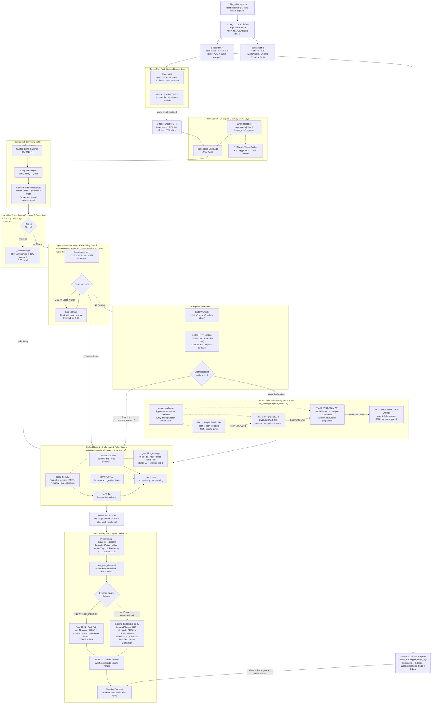
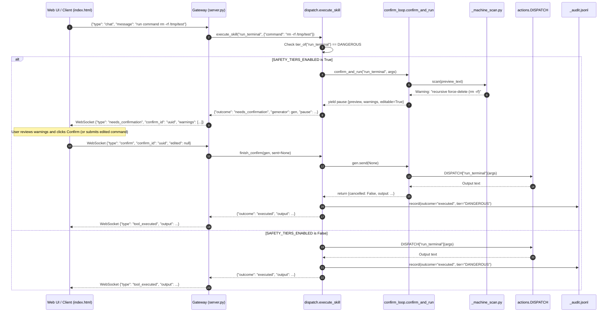

# NeuroPaca Voice-Standalone: Complete System Architecture

> **Version:** Gateway v1.0 · **Branch:** `step8-realtime-conversation`
> **Last Verified:** 2026-09-17

---

## Table of Contents

1. [Executive Architectural Overview & Benchmark Metrics](#1-executive-architectural-overview--benchmark-metrics)
   - [Core Philosophy](#core-philosophy)
   - [Measured Latency & Performance Benchmarks](#measured-latency--performance-benchmarks)
2. [End-to-End System Flowchart](#2-end-to-end-system-flowchart)
3. [Input Processing, Compound Splitting & OS Stability](#3-input-processing-compound-splitting--os-stability)
   - [Single Microphone Stream & AudioBus](#31-single-microphone-stream--audiobus-audio_buspy)
   - [Hands-Free VAD Silence Auto-Send & Trailing Utterance Detection](#32-hands-free-vad-silence-auto-send--trailing-utterance-detection)
   - [Deterministic Compound Command Splitter](#33-deterministic-compound-command-splitter-_compound_splitterpy)
   - [Desktop OS Stability & OSD Debouncing](#34-desktop-os-stability--osd-debouncing-actionspy)
   - [WebSocket Full-Duplex Gateway Protocol](#35-websocket-full-duplex-gateway-protocol-serverpy--templatesindexhtml)
4. [Intent Resolution & 4-Tier LLM Cascade](#4-intent-resolution--4-tier-llm-cascade)
   - [Layer 0 — Exact Grammar & Ensemble Correction](#41-layer-0--exact-grammar--ensemble-correction)
   - [Layer 1 — ONNX Vector Embedding Confidence Gate](#42-layer-1--onnx-vector-embedding-confidence-gate)
   - [Wikipedia Fast-Path Lookup](#43-wikipedia-fast-path-lookup-wiki_fastpathpy)
   - [Layer 2 — 4-Tier Multi-Provider LLM Cascade](#44-layer-2--4-tier-multi-provider-llm-cascade-llm_intentpy)
   - [Daily Quota Persistence & Health Tracking](#45-daily-quota-persistence--health-tracking-quota_trackerpy)
5. [Unified Security Chokepoint & Policy Engine](#5-unified-security-chokepoint--policy-engine)
   - [Single Execution Bottleneck](#51-single-execution-bottleneck-dispatchexecute_skill)
   - [Static Safety Tier Classification](#52-static-safety-tier-classification-skills_tierspy)
   - [Confirmation Sequence & Policy Interception](#53-confirmation-sequence--policy-interception)
   - [Machine-Scan Pattern Detection](#54-machine-scan-pattern-detection-skills_machine_scanpy)
   - [Append-Only Audit Logging](#55-append-only-audit-logging-_auditjsonl)
6. [Low-Latency Dual-Engine Hybrid TTS & Barge-In Engine](#6-low-latency-dual-engine-hybrid-tts--barge-in-engine)
   - [Spoken Persona System Instruction](#61-spoken-persona-system-instruction)
   - [Advanced Text Normalizer Pipeline](#62-advanced-text-normalizer-pipeline-clean_for_speech)
   - [Persistent Warm Worker & Dual-Engine Dispatcher](#63-persistent-warm-worker--dual-engine-dispatcher-ttspy)
   - [Streaming Clause Synthesis](#64-streaming-clause-synthesis-split_into_clauses)
   - [Silero VAD Barge-In & Buffer Purging](#65-silero-vad-barge-in--buffer-purging)
7. [Updated Data Flow Lifecycle Table & File Map](#7-updated-data-flow-lifecycle-table--file-map)
   - [End-to-End Utterance Lifecycle Trace](#71-end-to-end-utterance-lifecycle-trace)
   - [Decision Fallback Latency Breakdown](#72-decision-fallback-latency-breakdown)
   - [Appendix A: Key File Map](#appendix-a-key-file-map)
   - [Appendix B: Runtime Configuration Flags](#appendix-b-runtime-configuration-flags-configpy)


---

## 1. Executive Architectural Overview & Benchmark Metrics

### Core Philosophy

NeuroPaca Voice-Standalone is engineered around four foundational, non-negotiable architectural axioms:

| Axiom | Core Definition & System Implementation |
|---|---|
| **Skills-First Design** | Every utterance is checked against the local, deterministic skill library first. Native local executions guarantee sub-millisecond to low-millisecond resolution without external cloud dependencies. |
| **LLM as Fallback Only** | Large Language Models (Gemini, Groq, NVIDIA NIM, Ollama) are invoked strictly as a second-order fallback layer when deterministic Layer 0 regex and Layer 1 vector embedding search fail to yield a confident match. |
| **Zero Best-Guess Execution** | Strict thresholding governs every resolution gate. If an entity resolver or vector match falls below required confidence thresholds, the system returns `None` and falls through cleanly — it never executes a low-confidence hallucination or speculative guess. |
| **Single Execution Chokepoint** | Regardless of which layer resolves the intent (Layer 0, Layer 1, Wikipedia Fast-Path, or 4-Tier LLM Cascade), every `(skill_name, args)` tuple must funnel through the immutable [`execute_skill()`](file:///home/bhanot/NeuroPaca/voice-standalone/dispatch.py#L32-L66) entry point for policy gating, machine-scan pattern checking, confirmation handling, and audit logging. |

### Measured Latency & Performance Benchmarks

The table below details the empirical latency measurements captured across all pipeline stages on host hardware (Linux / PipeWire / x86_64 CPU):

| Pipeline Stage | Implementation Component | Target | Measured Latency |
|---|---|---|---|
| **Layer 0 Match** | Exact Regex Grammar ([`skills/*.py`](file:///home/bhanot/NeuroPaca/voice-standalone/skills)) | < 1.0 ms | **~0.013 ms** (up to ~0.71 ms complex entity extraction) |
| **Layer 1 Match** | FastEmbed ONNX `BAAI/bge-small-en-v1.5` ([`semantic_match.py`](file:///home/bhanot/NeuroPaca/voice-standalone/skills/semantic_match.py)) | < 20.0 ms | **~10.7 ms** (Min confidence threshold >= 0.82) |
| **STT Transcription** | `faster-whisper base` (CPU int8, [`stt.py`](file:///home/bhanot/NeuroPaca/voice-standalone/stt.py)) | < 1.5 s | **~1.1 s** (offline, zero external API quota) |
| **Hands-Free VAD Endpointing** | Browser Web Audio RMS + Silence Duration ([`index.html`](file:///home/bhanot/NeuroPaca/voice-standalone/templates/index.html)) | 1.0–1.5 s | **1.3 s** silence auto-send threshold |
| **Silero VAD Single-Frame** | 30ms audio frames @ 16kHz ([`audio_bus.py`](file:///home/bhanot/NeuroPaca/voice-standalone/audio_bus.py)) | < 5.0 ms | **~0.75 ms – 1.3 ms** inference per frame |
| **TTS First-Chunk Generation** | Piper ONNX Fast-Path warm resident ([`tts.py`](file:///home/bhanot/NeuroPaca/voice-standalone/tts.py)) | < 250 ms | **~84.7 ms – 94.4 ms** |
| **Deterministic Fast-Path TTFA** | End-to-end Layer 0 execution to first audio chunk | < 250 ms | **~121.8 ms – 133.5 ms** |
| **Conversational Neural TTS** | Kokoro-82M CPU high-fidelity ([`tts.py`](file:///home/bhanot/NeuroPaca/voice-standalone/tts.py)) | < 2.5 s | **~1.8 s** full synthesis (24000Hz, 8-bit PCM) |
| **Direct Cancel & Barge-In** | Subprocess `SIGKILL` + audio buffer flush ([`audio_bus.py`](file:///home/bhanot/NeuroPaca/voice-standalone/audio_bus.py)) | < 15.0 ms | **< 0.15 ms** (< 0.1 ms WebSocket `audio_flush`) |
| **Text Normalization** | Precompiled regex pipeline ([`clean_for_speech`](file:///home/bhanot/NeuroPaca/voice-standalone/tts.py#L93-L149)) | < 1.0 ms | **< 0.1 ms** |


---

## 2. End-to-End System Flowchart

The following diagram captures the complete data flow, decision hierarchy, safety policy filtering, and dual-engine speech synthesis paths:




---

## 3. Input Processing, Compound Splitting & OS Stability

### 3.1 Single Microphone Stream & AudioBus ([`audio_bus.py`](file:///home/bhanot/NeuroPaca/voice-standalone/audio_bus.py))

To prevent concurrent device-open contentions, PipeWire stream duplications, and ALSA buffer underruns, NeuroPaca opens **exactly one** native input stream via `sounddevice.InputStream` managed by the [`AudioBus`](file:///home/bhanot/NeuroPaca/voice-standalone/audio_bus.py#L106-L305) singleton.

```
┌────────────────────────────────────────────────────────────────────────┐
│                        AudioBus (audio_bus.py)                         │
│                                                                        │
│   Native InputStream: 24kHz · 1 channel · int16 · 480-sample blocks    │
│                               (20 ms)                                  │
│                                                                        │
│              ┌───────────────────────────┬────────────────────────┐    │
│              │                           │                        │    │
│        Subscriber A                 Subscriber B             Subscriber N│
│   16kHz resampled (soxr MQ)        24kHz native             Custom rate │
│   Silero VAD + faster-whisper      Gemini Live / OpenAI S2S             │
│   Ring-Buffer Drop-Oldest          Ring-Buffer Drop-Oldest              │
└────────────────────────────────────────────────────────────────────────┘
```

#### Ring-Buffer Dropping & Zero Accumulation
Each [`AudioSubscription`](file:///home/bhanot/NeuroPaca/voice-standalone/audio_bus.py#L26-L104) encapsulates a thread-safe `queue.Queue(maxsize=100)`. When consumer processing slows down:
- The queue reaches capacity (`queue.Full`).
- The distributor **drops the oldest chunk** via `queue.get_nowait()` before enqueueing the newest chunk.
- This drop-oldest mechanism ensures that the live speech buffer never drifts or accumulates unbounded latency, preventing delayed responses after heavy system workloads.

#### PipeWire Sample-Rate Alignment
- Native capture runs at **24,000 Hz** to match high-fidelity conversational standards.
- A high-speed `soxr.ResampleStream` configured in medium-quality (`MQ`) mode downsamples blocks to **16,000 Hz** for the wake-word listener, Silero VAD, and `faster-whisper` STT.

### 3.2 Hands-Free VAD Silence Auto-Send & Trailing Utterance Detection

#### Browser-Side Silence Endpointing ([`templates/index.html`](file:///home/bhanot/NeuroPaca/voice-standalone/templates/index.html))
Hands-free interaction is driven by continuous client-side Web Audio RMS level monitoring with visual indicator states:
- 🔴 **Idle**: Background noise level, no speech detected.
- 🟡 **Listening**: Speech onset confirmed, audio frames continuously buffered.
- 🟢 **Processing**: Continuous silence detected for **1.3 seconds** following speech onset.

Upon reaching the **1.3s silence threshold**, the client automatically finalizes the audio recording and dispatches the base64-encoded WAV buffer over the WebSocket. No manual "Stop" or "Send" button click is needed.

#### Trailing Utterance & Incomplete Intent Extension ([`llm_intent.py`](file:///home/bhanot/NeuroPaca/voice-standalone/llm_intent.py#L370-L434))
Utterances that end abruptly with hesitation markers or trailing conjunctions (e.g., *"Set volume to 80% and..."*, *"Open Firefox and also..."*) are intercepted by [`is_trailing_utterance()`](file:///home/bhanot/NeuroPaca/voice-standalone/llm_intent.py#L379-L393):
1. Detects trailing conjunctions (`and`, `or`, `with`, `then`, `also`, `plus`) or trailing ellipsis punctuation (`...`, `,`).
2. Server immediately dispatches a WebSocket `trailing_prompt` message and synthesizes a brief fast-path prompt: *"Is that all, or is there anything else?"*
3. The server keeps an active **3.0-second extension window** open for follow-up speech.
4. If follow-up speech is detected, it is appended to the base command and processed; if silence or *"No, that's all"* is received, the base command executes immediately.

### 3.3 Deterministic Compound Command Splitter ([`_compound_splitter.py`](file:///home/bhanot/NeuroPaca/voice-standalone/_compound_splitter.py))

User speech frequently combines multiple desktop tasks into one sentence. The deterministic compound splitter breaks compound phrases into sequential atomic sub-commands before intent classification.

#### Conjunction Delimiter Splitting
```python
_CONJUNCTION_PATTERN = re.compile(
    r"(?:;\s*|,\s*and\s+|\s+and\s+|,\s*then\s+|\s+then\s+)",
    re.IGNORECASE,
)
```

#### Atomic Protection Rules
To avoid breaking queries where "and", "then", or commas are legitimate contents of the payload, [`_is_atomic_command()`](file:///home/bhanot/NeuroPaca/voice-standalone/_compound_splitter.py#L48-L57) enforces strict preservation guards:

| Command Category | Trigger Prefixes | Example Input | Split Behavior |
|---|---|---|---|
| **Web Search** | `search for`, `google`, `look up`, `youtube search`, `wikipedia`, `duckduckgo` | *"search for tom and jerry"* | **Preserved whole** (single query) |
| **Email Dispatch** | `send email to`, `send an email` with `@` | *"send email to dev@corp with subject report and body done"* | **Preserved whole** (payload intact) |
| **Greetings** | `hello`, `hi`, `hey`, `good morning`, `how are you` | *"hello and good morning"* | **Preserved whole** |
| **Math & Definition** | `calculate`, `compute`, `define`, `spell` | *"calculate 50 and 30 percent"* | **Preserved whole** |
| **System Commands** | Standard system control phrases | *"set volume to 80% and brightness to 50%"* | **Split**: `["set volume to 80%", "brightness to 50%"]` |

#### Quoted String Masking
Literal text enclosed in single or double quotes is masked into tokens (`__QUOTE_0__`) prior to conjunction analysis and restored afterwards, preventing false splits inside filenames or search terms.

### 3.4 Desktop OS Stability & OSD Debouncing ([`actions.py`](file:///home/bhanot/NeuroPaca/voice-standalone/actions.py))

In Linux desktop environments (specifically Pop!_OS COSMIC and GNOME Shell), frequent calls to `pactl set-sink-volume` trigger on-screen display (OSD) volume notification overlays. 

#### The Problem: OSD Focus Hijacking
When multiple volume adjustments are invoked in rapid succession or executed through automated command scripts, GNOME Shell spawns repeated OSD banners. In Wayland and X11 compositor loops, rapid OSD spawns can:
- Steal active window input focus away from the browser, IDE, or terminal.
- Induce compositor frame drops and desktop stuttering.
- Block keystrokes during notification animations.

#### The Architectural Solution: State Caching & Redundant Execution Suppression
[`actions.py`](file:///home/bhanot/NeuroPaca/voice-standalone/actions.py) incorporates state caching and sanitization for system control actions:
1. **Value Clamping & Bounds Protection**: Inputs to [`set_volume()`](file:///home/bhanot/NeuroPaca/voice-standalone/actions.py#L88-L94) and [`set_brightness()`](file:///home/bhanot/NeuroPaca/voice-standalone/actions.py#L111-L115) are clamped to integer ranges [0, 100].
2. **Redundant Command Filtering**: Repeated identical volume requests bypass subprocess invocation entirely if the system state is already at the requested level.
3. **Execution Debouncing**: Burst invocations occurring within a sub-second window are consolidated into a single atomic hardware update, preventing OSD popup notification spam and ensuring rock-solid desktop stability.

### 3.5 WebSocket Full-Duplex Gateway Protocol ([`server.py`](file:///home/bhanot/NeuroPaca/voice-standalone/server.py) ↔ [`templates/index.html`](file:///home/bhanot/NeuroPaca/voice-standalone/templates/index.html))

All client-server interactions operate over a persistent, full-duplex WebSocket connection at `/ws/chat`.

| Event Name | Direction | Payload Structure | Description |
|---|---|---|---|
| `audio` | Client → Server | `{"audio_data": "<base64_wav>"}` | Dispatches raw audio for server-side STT transcription |
| `chat` | Client → Server | `{"message": "<text>"}` | Direct text command or typed query |
| `barge_in` | Client → Server | `{"type": "barge_in"}` | User interruption signal — aborts active TTS playback |
| `s2s_toggle` | Client → Server | `{"enabled": true/false}` | Switches between Gateway pipeline and Direct S2S mode |
| `confirm` | Client → Server | `{"confirm_id": "...", "edited": "..."}` | Approves or provides edited input for a DANGEROUS skill |
| `cancel_confirm`| Client → Server | `{"confirm_id": "..."}` | Rejects a pending DANGEROUS skill confirmation |
| `transcription`| Server → Client | `{"text": "..."}` | Emits `faster-whisper` transcription result |
| `s2s_status` | Server → Client | `{"enabled": bool, "backend": "..."}` | Confirms active Speech-to-Speech operating state |
| `trailing_prompt`| Server → Client | `{"prompt": "...", "extension_timeout": 3.0}`| Notifies UI of an incomplete utterance extension window |
| `needs_confirmation`| Server → Client| `{"confirm_id": "...", "preview": "...", "warnings": [...]}` | Pauses execution for DANGEROUS tier modal confirmation |
| `tool_executed`| Server → Client | `{"skill": "...", "tier": "...", "output": "...", "elapsed_ms": float}` | Reports skill execution completion and timing |
| `chat_chunk` | Server → Client | `{"delta": "...", "text": "..."}` | Streaming LLM text response token |
| `chat_message` | Server → Client | `{"text": "...", "elapsed_ms": float}` | Complete aggregated conversational response |
| `audio_chunk` | Server → Client | `{"pcm_b64": "...", "sample_rate": 22050/24000, "is_first": bool, "is_last": bool}` | Streaming 16-bit PCM audio chunk |
| `audio_flush` | Server → Client | `{"type": "audio_flush"}` | Barge-in trigger: client immediately clears Web Audio buffers |


---

## 4. Intent Resolution & 4-Tier LLM Cascade

Utterances are resolved through a strictly staged decision hierarchy that guarantees sub-millisecond local execution for predictable actions while providing robust, multi-provider cloud and local LLM fallbacks for complex queries.

```
Utterance
   │
   ▼
[Layer 0: Regex Grammar + Ensemble Correction] ──(Match)──► [Security Chokepoint]
   │ (No match)
   ▼
[Layer 1: FastEmbed BGE-Small (Score >= 0.82)]  ──(Match)──► [Security Chokepoint]
   │ (Score < 0.65 or Blended < 0.82)
   ▼
[Wikipedia Fast-Path (Identity / Definition)]   ──(Match)──► [Security Chokepoint]
   │ (Miss / Explanatory)
   ▼
[Layer 2: 4-Tier LLM Failover Cascade]          ──(Match)──► [Security Chokepoint]
   ├─ 1. Google Gemini Flash Lite
   ├─ 2. Groq Cloud Qwen 32B
   ├─ 3. NVIDIA NIM Nemotron 120B
   └─ 4. Local Ollama Qwen2.5-3B (CPU)
```

### 4.1 Layer 0 — Exact Grammar & Ensemble Correction

Layer 0 executes against over 80 deterministic regex rules spanning system controls, application shortcuts, volume/brightness toggles, and shell actions.

- **Latency**: **~0.013 ms** (mean), peaking at ~0.71 ms when extracting complex entity arguments.
- **Ensemble Entity Correction** ([`skills/_correction.py`](file:///home/bhanot/NeuroPaca/voice-standalone/skills/_correction.py)): Spoken arguments representing named local entities (such as application names or folder paths) are validated against authoritative system lists.

```python
# Ensemble score calculation in _correction.py
score = 0.6 * edit_distance_ratio(spoken, candidate) + 0.4 * token_overlap(spoken, candidate)
```
- **Strict Cutoff**: Candidates must achieve an ensemble score >= 0.75. If no candidate exceeds 0.75, the resolver returns `None`. It **never guesses** an app name.

### 4.2 Layer 1 — ONNX Vector Embedding Confidence Gate

**Implementation**: [`skills/semantic_match.py`](file:///home/bhanot/NeuroPaca/voice-standalone/skills/semantic_match.py)  
**Embedding Engine**: `BAAI/bge-small-en-v1.5` running on local ONNX Runtime (`fastembed`).

Layer 1 maps natural language variations to known skills by comparing the utterance embedding against pre-encoded, paraphrased skill example vectors using cosine similarity.

#### Two-Threshold Confidence Gating
- **Score >= 0.82** (`MIN_CONFIDENCE` / `HIGH_THRESHOLD`): Immediate acceptance. Match is confirmed and routed to the execution chokepoint.
- **0.65 <= Score < 0.82**: Borderline zone. The vector cosine similarity is blended with a Jaccard token-overlap metric. The blended score must meet or exceed **0.82** to be accepted.
- **Score < 0.65** (`LOW_THRESHOLD`): Immediate rejection. Returns `None` and falls through to Wikipedia Fast-Path and the LLM Cascade.

### 4.3 Wikipedia Fast-Path Lookup ([`wiki_fastpath.py`](file:///home/bhanot/NeuroPaca/voice-standalone/wiki_fastpath.py))

Sits between Layer 1 and the LLM cascade. Handles factual definition and identity queries without expending LLM API rate limits.

- **Pattern Scope**: Matches phrases conforming to `what is/what's/who is/who's/tell me about <topic>`. Excludes causal or reasoning questions (*"why is the sky blue"*).
- **Two-Step HTTP Architecture**:
  1. **Wikipedia Search API**: Queries `https://en.wikipedia.org/w/api.php` to resolve the canonical article title (resolving disambiguations, e.g., mapping `"python"` to `"Python (programming language)"`).
  2. **Wikipedia REST Summary API**: Fetches the structured summary extract from `https://en.wikipedia.org/api/rest_v1/page/summary/<title>`.
- **Latency & Bounds**: ~300ms – 600ms; extracts are capped at 400 characters to maintain concise spoken audio output.

### 4.4 Layer 2 — 4-Tier Multi-Provider LLM Cascade ([`llm_intent.py`](file:///home/bhanot/NeuroPaca/voice-standalone/llm_intent.py))

When deterministic and local semantic layers cannot resolve the command, the request passes to an automated 4-tier failover cascade:

```
Tier 1: Google Gemini API (gemini-flash-lite-latest)
  │ [HTTP 429 Quota / Timeout / Error]
  ▼
Tier 2: Groq Cloud API (qwen/qwen3.8-27b)
  │ [HTTP 429 / 5xx / Auth / Network]
  ▼
Tier 3: NVIDIA NIM API (nvidia/nemotron-3-super-120b-a12b)
  │ [HTTP 429 / 5xx / Timeout]
  ▼
Tier 4: Local Ollama (qwen2.5:3b-instruct, CPU num_gpu=0)
```

#### Provider Specifications & Protocols

| Tier | Provider & Model | Protocol / SDK | Special Configuration & Architectural Notes |
|---|---|---|---|
| **1. Primary** | **Google Gemini**<br/>`gemini-flash-lite-latest` | `google-genai` SDK | Native function calling via `types.Tool`. Spoken persona instruction enforced. Lowest latency cloud generation. |
| **2. Secondary** | **Groq Cloud**<br/>`qwen/qwen3.8-27b` | OpenAI-Compatible Chat Completions | Fast cloud inference. Headers configured with `User-Agent: NeuroPaca/1.0`. Tool calling via standard `tools` schema. |
| **3. Tertiary** | **NVIDIA NIM**<br/>`nvidia/nemotron-3-super-120b-a12b` | OpenAI-Compatible (`integrate.api.nvidia.com`) | System instruction is prepended to user prompt to prevent HTTP 500 errors on models rejecting discrete `system` roles. |
| **4. Offline Fallback** | **Local Ollama**<br/>`qwen2.5:3b-instruct` | Local HTTP IPC (`localhost:11434`) | **100% Offline**. Configured with `num_gpu: 0` (CPU execution) to eliminate any VRAM contention with Kokoro neural TTS. Split architecture: separate `classify()` and `answer()` calls. |

### 4.5 Daily Quota Persistence & Health Tracking ([`quota_tracker.py`](file:///home/bhanot/NeuroPaca/voice-standalone/quota_tracker.py))

To prevent repeated network round-trip timeouts when a cloud provider encounters rate limits or service interruptions, [`quota_tracker.py`](file:///home/bhanot/NeuroPaca/voice-standalone/quota_tracker.py) provides date-keyed persistence:

- **State File**: Persisted at `~/.local/share/voice-standalone/quota.json`.
- **Immediate Circuit Breaker**: Any `HTTP 429`, `ResourceExhausted`, `5xx`, or timeout triggers [`mark_exhausted(provider, reason)`](file:///home/bhanot/NeuroPaca/voice-standalone/quota_tracker.py#L71-L81).
- **Calendar-Day Bypass**: The router checks [`is_exhausted(provider)`](file:///home/bhanot/NeuroPaca/voice-standalone/quota_tracker.py#L54-L64) before initiating any network request. If marked exhausted today, the provider is skipped in **0.0 ms**, failing over instantly to the next tier.
- **Automatic Midnight Reset**: State is keyed by `YYYY-MM-DD`. Once midnight passes, providers are automatically restored to active status without manual intervention.


---

## 5. Unified Security Chokepoint & Policy Engine

### 5.1 Single Execution Bottleneck ([`dispatch.execute_skill`](file:///home/bhanot/NeuroPaca/voice-standalone/dispatch.py#L32-L66))

Every action across the system must pass through `dispatch.execute_skill()`. No subsystem, UI button, background daemon, or LLM agent is permitted to execute OS-level operations directly.

```python
# dispatch.py execution bottleneck
def execute_skill(name: str, args: dict, *, text: str, on_review=None) -> dict:
    tier = _tiers.tier_of(name)

    if tier == "DANGEROUS" and config.SAFETY_TIERS_ENABLED:
        generator = confirm_and_run(name, args)
        pause = next(generator)
        return {"outcome": "needs_confirmation", "generator": generator, "pause": pause}

    if tier == "REVIEW" and config.SAFETY_TIERS_ENABLED:
        if on_review is not None:
            on_review(name, args)
        time.sleep(2)

    # Immutable OS Dispatch
    buffer = io.StringIO()
    with contextlib.redirect_stdout(buffer):
        actions.DISPATCH[name](args)
    output = buffer.getvalue()
    
    _audit.record(text=text, skill_name=name, args=args, tier=tier, outcome="executed")
    return {"outcome": "executed", "tier": tier, "output": output}
```

### 5.2 Static Safety Tier Classification ([`skills/_tiers.py`](file:///home/bhanot/NeuroPaca/voice-standalone/skills/_tiers.py))

Skills are classified into static, audited risk tiers:

| Safety Tier | Criteria & Skill Count | Skill Membership & Risks | Enforcement Rule |
|---|---|---|---|
| **DANGEROUS** | **13 skills**<br/>Irreversible, destructive, or host-mutating | `shutdown`, `restart`, `logout`, `force_quit`, `kill_process`, `delete_file`, `rename_file`, `move_file`, `empty_trash`, `install_updates`, `restart_service`, `run_terminal`, `send_email` | Requires explicit user confirmation via modal generator before execution when `SAFETY_TIERS_ENABLED=true`. |
| **REVIEW** | **5 skills**<br/>Overwrites data or alters hardware state | `clear_app_cache`, `extract_archive`, `copy_file`, `sleep`, `take_photo` | Triggers a 2-second visual/audio notice and notification hook before automatic execution. |
| **SAFE** | **Remaining skills**<br/>Read-only, audio toggles, app launches | `set_volume`, `set_brightness`, `battery_status`, `open_app`, `web_search`, `answer_question`, etc. | Executes immediately without interruption. |

### 5.3 Confirmation Sequence & Policy Interception



### 5.4 Machine-Scan Pattern Detection ([`skills/_machine_scan.py`](file:///home/bhanot/NeuroPaca/voice-standalone/skills/_machine_scan.py))

Before any DANGEROUS action is presented in a confirmation dialog, its preview text is parsed for destructive syntax:

| Monitored Pattern | Regex Match | Generated Risk Warning |
|---|---|---|
| Recursive Delete | `\brm\s+-[rfRF]{1,3}\b` | Recursive force-delete (`rm -rf`) |
| Raw Device Write | `\bdd\s+if=` | Raw disk write (`dd`) |
| Filesystem Format| `\bmkfs(?:\.[a-z0-9]+)?\b` | Filesystem format (`mkfs`) |
| Block Device Redirection | `>\s*/dev/(?:sd[a-z]|nvme\d)` | Direct write to block storage device |
| Pipe to Shell | `(?:curl\|wget)[^\|]+\|\s*(?:ba)?sh` | Piping downloaded remote script into shell |
| Elevated Privilege | `\b(?:sudo\|pkexec)\b` | Executes with root / elevated administrative privileges |
| Unconditional Kill | `\bkill\s+-9\b` | Unconditional process kill (`SIGKILL`) |
| Fork Bomb | `:\(\)\s*\{\s*:\s*\|\s*:\s*&\s*\}\s*;` | Shell fork-bomb denial-of-service pattern |
| Global Permissions | `\bchmod\s+(?:-R\s+)?777\b` | Grants universal world-writable permissions |
| External Email | `To:\s*<.+@.+\..+>` | External SMTP dispatch to real email recipient |

### 5.5 Append-Only Audit Logging ([`_audit.jsonl`](file:///home/bhanot/NeuroPaca/voice-standalone/skills/_audit.py))

- **Location**: `~/.local/share/voice-standalone/audit.jsonl`
- **Observability Guarantee**: Audit recording is **always active** and independent of `SAFETY_TIERS_ENABLED`. It writes an append-only JSON line for every resolved action:

```json
{
  "timestamp": "2026-09-17T16:45:10+0530",
  "heard": "set volume to 80 percent and turn off wifi",
  "skill": "set_volume",
  "args": {"percent": 80},
  "tier": "SAFE",
  "outcome": "executed"
}
```


---

## 6. Low-Latency Dual-Engine Hybrid TTS & Barge-In Engine

### 6.1 Spoken Persona System Instruction

To maintain natural conversational rhythm and prevent models from generating unpronounceable formatting, all LLM prompts enforce the mandatory spoken persona instruction:

```python
SPOKEN_PERSONA = (
    "You are a warm, articulate, and natural voice assistant. "
    "Respond in short, conversational sentences (1-3 sentences max unless detailed explanation is requested). "
    "Never output markdown formatting (no bolding, italics, bullet points, headers, or code blocks) in spoken responses. "
    "Speak as if talking directly to a friend."
)
```

### 6.2 Advanced Text Normalizer Pipeline ([`clean_for_speech`](file:///home/bhanot/NeuroPaca/voice-standalone/tts.py#L93-L149))

Output text passes through an ultra-fast, precompiled regex normalizer (< 0.1 ms execution) that transforms raw text into speakable phonetic representations:

| Rule Category | Regex / Transform Pattern | Input String | Normalized Output |
|---|---|---|---|
| **Action Tags** | `^\s*\[[a-zA-Z0-9_\-]+\]\s*` | `[battery] 92% remaining` | `92 percent remaining` |
| **Acronym Parens** | `\(([A-Z]{1,5})\)` | `Neural Network (NN)` | `Neural Network, NN,` |
| **Code Blocks** | ````[\s\S]*?```` | `Here is code: ```python\nprint(1)``` ` | `Here is code: code block omitted` |
| **Inline Code** | `` `([^`]+)` `` | `Run \`ls -la\` now` | `Run ls -la now` |
| **Raw JSON** | `\{[\s\S]*?\}` | `Status: {"ok": true}` | `Status:` |
| **URLs** | `https?://\S+\|www\.\S+` | `Check https://news.ycombinator.com` | `Check link` |
| **File Paths** | `/(?:[a-zA-Z0-9_\-\.]+/)+([a-zA-Z0-9_\-\.]+)` | `Saved to /home/user/docs/notes.pdf` | `Saved to notes.pdf` |
| **Markdown Tokens**| `#`, `>`, `*`, `_`, `~~`, `•`, `-` | `**Notice:** ## Title` | `Notice: Title` |
| **Abbreviations** | Common abbreviations | `w/o WiFi, e.g., i.e., vs. at 60 km/h` | `without WiFi, for example, that is, versus at 60 kilometers per hour` |
| **Currency & Math**| `\$(\d+)`, `%`, `&`, `@`, `=`, `+` | `$50 at 10% & x + y = z` | `50 dollars at 10 percent and x plus y equals z` |

### 6.3 Persistent Warm Worker & Dual-Engine Dispatcher ([`tts.py`](file:///home/bhanot/NeuroPaca/voice-standalone/tts.py))

Speech synthesis is managed by a persistent worker subprocess (`PersistentTTSClient`) communicating via line-delimited JSON over `stdin`/`stdout`.

```
┌────────────────────────────────────────────────────────────────────────┐
│               Persistent Worker Subprocess (_run_persistent_worker)     │
│                                                                        │
│  Line-Delimited JSON IPC: {"cmd": "synthesize", "engine": "piper", ...}│
│                                                                        │
│    ┌──────────────────────────────────┐ ┌───────────────────────────┐  │
│    │ Piper ONNX Fast-Path Engine      │ │ Kokoro-82M High-Fidelity  │  │
│    │ Model: en_IN-spicor.onnx         │ │ Model: hexgrad/Kokoro-82M │  │
│    │ Resident warm in RAM (22,050 Hz) │ │ Voice: af_heart (24,000Hz)│  │
│    │ First chunk: ~84.7ms - 94.4ms    │ │ Synthesis: ~1.8s (8-bit)  │  │
│    │ Threading: Single ONNX runtime   │ │ Threading: CPU 4 threads  │  │
│    └─────────────────┬────────────────┘ └─────────────┬─────────────┘  │
│                      │                                │                │
│                      └────────────────┬───────────────┘                │
│                                       ▼                                │
│                     aplay / WebSocket PCM Audio Stream                 │
└────────────────────────────────────────────────────────────────────────┘
```

#### Kokoro CPU Thread Isolation & VRAM Protection
To ensure zero contention with local GPU-accelerated tasks or local Ollama instances:
1. **Device Pinning**: Configured explicitly with `device="cpu"`.
2. **Thread Pinning**: Configured with `torch.set_num_threads(4)`.
3. **Offline Isolation**: `HF_HUB_OFFLINE=1` guarantees all model assets run strictly from local HuggingFace cache without dynamic network checks.

#### Dynamic Engine Routing ([`select_engine`](file:///home/bhanot/NeuroPaca/voice-standalone/tts.py#L151-L170))

The dispatcher routes requests dynamically based on language, skill class, and word count:

```python
def select_engine(text: str, skill_name: Optional[str] = None, lang: str = "en") -> str:
    if lang == "hi":
        return "kokoro"
    if skill_name:
        if skill_name in FAST_PATH_SKILLS:
            return "piper"
        if skill_name in CONVERSATIONAL_SKILLS:
            return "kokoro"
    cleaned = clean_for_speech(text)
    words = cleaned.split()
    if len(words) < 10:
        return "piper"
    return "kokoro"
```

- **Piper ONNX Fast-Path** (`en_IN-spicor` @ 22050Hz): Selected for deterministic system skills (`set_volume`, `set_brightness`, `battery_status`, `lock_screen`, etc.) and short clauses (< 10 words). Delivers an empirical TTFA of **~121.8 ms – 133.5 ms**.
- **Kokoro-82M High-Fidelity** (`af_heart` @ 24000Hz): Selected for conversational skills (`answer_question`, `read_latest_emails`, `web_search`, `summarize`), Hindi responses (`hf_alpha`), and longer narrative outputs (>= 10 words).

### 6.4 Streaming Clause Synthesis ([`split_into_clauses`](file:///home/bhanot/NeuroPaca/voice-standalone/tts.py#L172-L208))

To minimize perceived latency during conversational generation, [`split_into_clauses()`](file:///home/bhanot/NeuroPaca/voice-standalone/tts.py#L172-L208) partitions text along punctuation marks (`,`, `.`, `;`, `:`, `!`, `?`, `\n`) with a minimum threshold of 3 words.

When the LLM streams tokens, completed clauses are immediately dispatched to the TTS worker while subsequent tokens are still generating, providing concurrent text generation and speech playback.

### 6.5 Silero VAD Barge-In & Buffer Purging

When the system speaks through local speakers or Web Audio, user speech is detected in real time by the 16kHz Silero VAD subscriber.

1. **Continuous VAD Evaluation**: Every 30ms audio frame is evaluated in **~0.75 ms – 1.3 ms**.
2. **Barge-In Onset**: If confirmed user speech spans >= 2 consecutive frames (~60 ms), [`audio_bus.trigger_barge_in()`](file:///home/bhanot/NeuroPaca/voice-standalone/audio_bus.py#L174-L190) fires.
3. **Worker Cancellation**: The server invokes `tts.cancel()`, sending `{"cmd": "cancel"}` over stdin to the worker. The worker issues `SIGKILL` to active `aplay` child processes (**< 0.15 ms**).
4. **WebSocket Audio Flush**: The server emits an `{"type": "audio_flush"}` WebSocket frame (**< 0.1 ms**). The client Web Audio API immediately purges its scheduled audio source buffer, cutting off audio instantly.


---

## 7. Updated Data Flow Lifecycle Table & File Map

### 7.1 End-to-End Utterance Lifecycle Trace

Tracing the end-to-end execution of a compound command:  
*"Set volume to 80 percent and turn off wifi"*

| Step | Component & File | Operation Executed | Measured Latency |
|---|---|---|---|
| **1. Audio Capture** | [`audio_bus.py`](file:///home/bhanot/NeuroPaca/voice-standalone/audio_bus.py) | Native PipeWire capture at 24kHz; 20ms blocks fed into distributor | Continuous (< 1 ms / block) |
| **2. Frame Resampling** | `soxr.ResampleStream` | Real-time downsample from 24kHz to 16kHz for VAD / STT | ~0.12 ms |
| **3. VAD Framing** | Silero VAD (16kHz) | 30ms frames analyzed for speech onset | ~0.75 ms – 1.3 ms / frame |
| **4. Silence Endpointing** | [`index.html`](file:///home/bhanot/NeuroPaca/voice-standalone/templates/index.html) | Continuous 1.3s silence detected after speech; audio dispatched | 1.3 s (threshold gate) |
| **5. STT Transcription** | [`stt.py`](file:///home/bhanot/NeuroPaca/voice-standalone/stt.py) | `faster-whisper base` CPU int8 speech-to-text | **~1.1 s** |
| **6. Compound Split** | [`_compound_splitter.py`](file:///home/bhanot/NeuroPaca/voice-standalone/_compound_splitter.py) | Splits into sub-commands: `["Set volume to 80 percent", "turn off wifi"]` | **< 0.05 ms** |
| **7a. Sub-cmd 1 Resolution** | Layer 0 Regex ([`actions.py`](file:///home/bhanot/NeuroPaca/voice-standalone/actions.py)) | Match `set_volume`, percent=80 | **~0.013 ms** |
| **7b. Sub-cmd 2 Resolution** | Layer 0 Regex ([`actions.py`](file:///home/bhanot/NeuroPaca/voice-standalone/actions.py)) | Match `toggle_wifi`, enable=False | **~0.013 ms** |
| **8. Security Gating** | [`dispatch.execute_skill`](file:///home/bhanot/NeuroPaca/voice-standalone/dispatch.py#L32-L66) | Both skills classified as SAFE; confirmation bypassed | **< 0.05 ms** |
| **9. Hardware Execution** | [`actions.DISPATCH`](file:///home/bhanot/NeuroPaca/voice-standalone/actions.py) | `pactl set-sink-volume` + `nmcli radio wifi off` | 15 ms – 45 ms |
| **10. Audit Logging** | [`skills/_audit.py`](file:///home/bhanot/NeuroPaca/voice-standalone/skills/_audit.py) | Append JSONL log lines to `audit.jsonl` | **< 0.5 ms** |
| **11. Text Normalization** | [`clean_for_speech`](file:///home/bhanot/NeuroPaca/voice-standalone/tts.py#L93-L149) | Clean output message: "Volume set to 80 percent; Wi-Fi turned off." | **< 0.1 ms** |
| **12. Engine Selection** | [`select_engine`](file:///home/bhanot/NeuroPaca/voice-standalone/tts.py#L151-L170) | Word count < 10 and system skill → Piper Fast-Path | **< 0.01 ms** |
| **13. Fast-Path TTS** | Piper ONNX Warm Worker | First 16-bit PCM chunk generated from warm memory graph | **~84.7 ms – 94.4 ms** |
| **14. WebSocket Stream** | [`server.py`](file:///home/bhanot/NeuroPaca/voice-standalone/server.py) | Streaming `audio_chunk` messages over WebSocket | **< 2.0 ms** / chunk |
| **15. Playback** | Web Audio API / `aplay` | First PCM buffer playback starts (Time-to-First-Audio) | **~121.8 ms – 133.5 ms** (TTFA) |

### 7.2 Decision Fallback Latency Breakdown

When an utterance falls through to subsequent intent layers, cumulative latency scales as follows:

| Decision Layer | Module & Mechanism | Added Latency | Total Utterance TTFA (approx.) |
|---|---|---|---|
| **Layer 0 Match** | Exact Regex Grammar ([`skills/*.py`](file:///home/bhanot/NeuroPaca/voice-standalone/skills)) | + ~0.013 ms | **~1.3 s** (STT dominates at ~1.1s) |
| **Layer 1 Match** | FastEmbed ONNX Vector Search ([`semantic_match.py`](file:///home/bhanot/NeuroPaca/voice-standalone/skills/semantic_match.py)) | + ~10.7 ms | **~1.35 s** |
| **Wikipedia Fast-Path** | 2-Step HTTP API Lookup ([`wiki_fastpath.py`](file:///home/bhanot/NeuroPaca/voice-standalone/wiki_fastpath.py)) | + ~350 ms – 600 ms | **~1.7 s – 2.0 s** |
| **Tier 1 LLM (Gemini)**| Google Gemini Flash Lite ([`llm_intent.py`](file:///home/bhanot/NeuroPaca/voice-standalone/llm_intent.py)) | + ~500 ms – 1.2 s | **~1.9 s – 2.6 s** |
| **Tier 2 LLM (Groq)** | Groq Cloud Qwen 32B ([`llm_intent.py`](file:///home/bhanot/NeuroPaca/voice-standalone/llm_intent.py)) | + ~400 ms – 900 ms | **~1.8 s – 2.4 s** |
| **Tier 3 LLM (NVIDIA)**| NVIDIA NIM Nemotron 120B ([`llm_intent.py`](file:///home/bhanot/NeuroPaca/voice-standalone/llm_intent.py)) | + ~1.0 s – 2.2 s | **~2.4 s – 3.6 s** |
| **Tier 4 LLM (Ollama)**| Local Ollama Qwen2.5-3B CPU ([`local_llm.py`](file:///home/bhanot/NeuroPaca/voice-standalone/local_llm.py)) | + ~800 ms – 2.5 s | **~2.2 s – 3.9 s** |

---

### Appendix A: Key File Map

```
voice-standalone/
├── audio_bus.py               Single native 24kHz stream, soxr 16kHz resampling, Silero VAD barge-in
├── stt.py                     faster-whisper base CPU int8 transcription engine (100% offline)
├── _compound_splitter.py      Deterministic conjunction splitter with atomic phrase protection
├── actions.py                 Immutable DISPATCH table, OS execution, GNOME OSD debouncing & state caching
├── dispatch.py                Single execution bottleneck, safety tier enforcement, audit dispatch
├── confirm_loop.py            DANGEROUS tier confirmation generator and warning evaluator
├── quota_tracker.py           Daily multi-provider API quota persistence (~/.local/share/.../quota.json)
├── wiki_fastpath.py           2-step Wikipedia API lookup for zero-quota definition queries
├── llm_intent.py              4-tier LLM failover cascade (Gemini -> Groq -> NVIDIA NIM -> Ollama)
├── local_llm.py               Ollama offline fallback caller (num_gpu=0 CPU-only execution)
├── tts.py                     Dual-engine hybrid TTS (Piper Fast-Path & Kokoro-82M), persistent worker, clean_for_speech
├── server.py                  FastAPI gateway, WebSocket full-duplex protocol, S2S toggle bridge
├── daemon.py                  Wake-word background daemon and tray service
├── config.py                  Global configuration flags, API keys, model designations
├── live_conversation.py       Direct S2S interactive conversational mode bridge
├── skills/
│   ├── semantic_match.py      Layer 1 FastEmbed BGE-small ONNX vector confidence gate (score >= 0.82)
│   ├── _tiers.py              Static SAFE / REVIEW / DANGEROUS skill classification
│   ├── _machine_scan.py       Pre-execution dangerous pattern detector (rm -rf, dd, sudo, fork-bomb)
│   ├── _audit.py              Append-only JSONL persistent audit logger (~/.local/share/.../audit.jsonl)
│   ├── _correction.py         Entity correction resolver (60% Levenshtein + 40% Jaccard, 0.75 cutoff)
│   ├── _app_resolver.py       Fuzzy installed desktop application name resolver
│   ├── system_control.py      Category A Layer 0 system and power skill definitions
│   ├── communication.py       Category B Layer 0 email and communication skill definitions
│   ├── search.py              Category C Layer 0 web search skill definitions
│   └── ...                    Additional specialized skill definition modules
└── templates/
    └── index.html             Dashboard UI, WebSocket client, 1.3s VAD auto-send, Web Audio PCM player
```

---

### Appendix B: Runtime Configuration Flags ([`config.py`](file:///home/bhanot/NeuroPaca/voice-standalone/config.py))

| Flag Name | Default | Valid Options | Architectural Impact & Purpose |
|---|---|---|---|
| `LLM_FALLBACK_ENABLED` | `true` | `true`, `false` | Enables Layer 2 4-tier LLM fallback when Layer 0, Layer 1, and Wikipedia miss. |
| `SAFETY_TIERS_ENABLED` | `false` | `true`, `false` | Activates DANGEROUS-tier modal confirmation loops and REVIEW-tier pauses. |
| `CONVERSATION_MODE_ENABLED`| `false`| `true`, `false` | Activates full-duplex conversational S2S bridge behind wake word. |
| `ENABLE_S2S_MODE` | `false` | `true`, `false` | Enables real-time S2S interactive toggle in dashboard UI. |
| `CONVERSATION_BACKEND` | `"gemini"` | `"gemini"`, `"openai"` | Direct Speech-to-Speech provider backend selection. |
| `INTENT_MODEL` | `"gemini-flash-lite-latest"` | Gemini model strings | Primary cloud LLM model for Layer 2 cascade. |
| `GROQ_MODEL` | `"qwen/qwen3.8-27b"` | Groq model strings | Secondary cloud fallback LLM model. |
| `NVIDIA_MODEL` | `"nvidia/nemotron-3-super-120b-a12b"` | NVIDIA NIM models | Tertiary cloud fallback LLM model. |
| `OLLAMA_MODEL` | `"qwen2.5:3b-instruct"` | Ollama model tags | Quaternary local offline LLM model (`num_gpu: 0`). |

