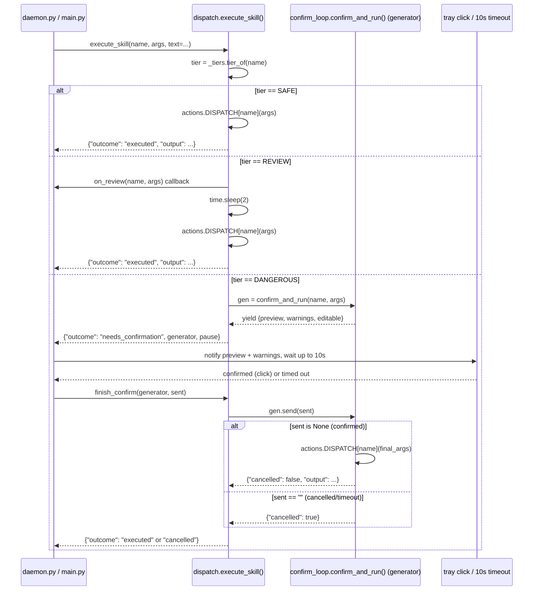
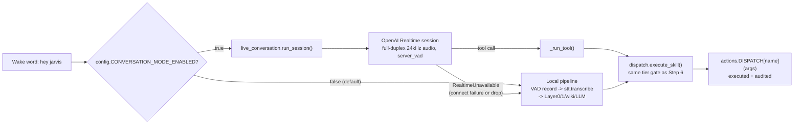
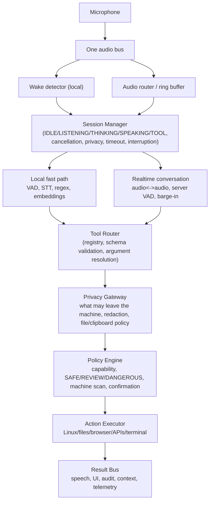
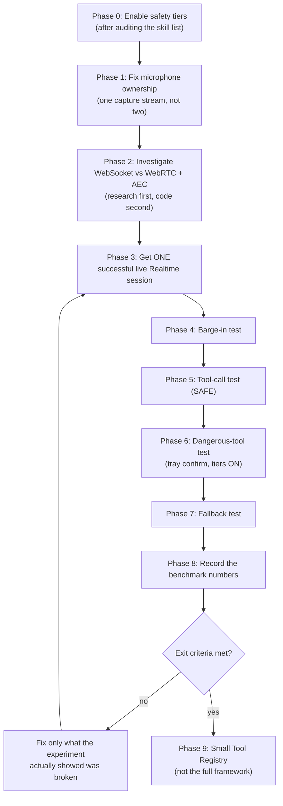
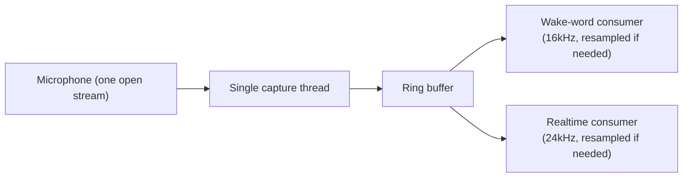

# voice-standalone — Complete Guide

The single, unified account of what this project is, how it was actually
built (step by step, with what was tried and rejected along the way and
why), what it can do today, what it can't do yet, and how to run it.

This file replaces `ARCHITECTURE.md`, `VOICE_PROJECT_OVERVIEW.md`, and
`STEP9_IMPLEMENTATION_GUIDE.md`, which have been merged into it and removed
from the repo. Everything those three documents contained — architecture,
attribution/sources, the full skill catalog, every build step's history
(including bugs found and fixed), the Step 9 design review and phased test
plan, and every open question — lives here now, in build order.

---

## 1. What this is

`voice-standalone` is an always-on, local voice-command assistant for a
Linux desktop: a wake word or a tray click starts listening, speech becomes
an action (open an app, search the web, change a system setting, run a
file operation, or hold a real conversation), and the assistant speaks a
response back. It was built **outside** NeuroPaca on purpose — the idea is
to prove the shape works standalone before any integration into NeuroPaca
is even considered. Any NeuroPaca integration is explicitly out of scope
until this proves itself standalone.

The uncompromised goals for the decision pipeline are **accuracy**
(understanding what was said), **millisecond-scale execution** once it's
understood, and **correctness** (never run a best guess). Safety/tier
gating is treated as a separate, later concern — deliberately not entangled
with pipeline design, its own section below.

### Three design commitments that run through every step

- **Skills first, LLM as fallback, never as the default.** A
  deterministic, regex-driven skill catalog resolves the overwhelming
  majority of commands in under a millisecond, with zero network
  dependency. An LLM (cloud, with a local fallback) is only consulted once
  every deterministic layer has already failed to resolve an utterance —
  the opposite of "send everything to an LLM and hope."
- **Never execute a best guess.** Anything that names a real thing (an
  app, a file) gets corrected against the actual list of real things
  before running, rather than acting on a plausible-sounding misheard
  string.
- **One execution chokepoint, tier-gated.** No matter which layer resolved
  a command — grammar match, semantic match, a cloud LLM, or (as of Step
  8) a live conversational model — every single action passes through the
  same tier check (`SAFE` / `REVIEW` / `DANGEROUS`) before anything
  happens on the real system. A more capable front end never means a
  looser back end; this is the one property every step below was built to
  preserve.

---

## 2. Where each idea in this project came from

Nothing here was invented from a blank page — every mechanism was pulled
from a real precedent, checked directly against its own source rather than
trusted from memory, and adapted to this project's constraints.

| Idea | Source |
|---|---|
| Skills-first, LLM only as fallback | Talon Voice (grammar mode vs. dictation mode); Mycroft/OVOS (Adapt + Padatious + fallback pipeline) |
| Never execute your best guess — correct it first | Home Assistant Assist (fuzzy-matches a misheard slot against the real entity list, rewrites the sentence, executes the *corrected* version) |
| Pause → let the user edit → resume → feed real output back in | Open Interpreter's pre-Rust confirmation loop (a generator that yields before running code, re-reads from shared state on resume) |
| Editable preview instead of yes/no | ai-shell-agent / llm-tools-execute-shell |
| Machine-scan a command before showing it | Open Interpreter's safe-mode semgrep pass |
| Turn-detection (know when you've stopped talking, without a flat timer) | LiveKit Agents' adaptive interruption/turn-taking |
| Skills as a scalable local layer (150+) | A friend's local-model build — same shape as Mycroft/OVOS's Adapt+Padatious pipeline, independently arrived at |
| Local semantic matching via vector similarity instead of LLM-per-utterance | Padatious's own approach (a small trained matcher, not a full LLM call), generalized with off-the-shelf sentence embeddings |
| English + Hindi TTS with real, verified Hindi voices | Kokoro-82M (`hexgrad/Kokoro-82M`, Apache-2.0) — re-verified directly against its own `VOICES.md` |
| ~~Punjabi TTS~~ (built, benchmarked, removed) | AI4Bharat's IndicF5 (MIT) — live full-pipeline latency measured 96s/phrase on CPU, unusable |
| Indian-accented English (not just Hindi) | ~~MeloTTS~~ (tried, dropped — only one voice, no way to tune/swap it) → Piper's `en_IN-spicor` (NavGurukul AI Labs) — verified directly on Hugging Face, 63.5MB, CPU-only; Google Cloud TTS's Chirp3-HD (30 real en-IN voices) kept as the cloud fallback option |
| Streaming/low-latency TTS, <100ms time-to-first-audio | RealtimeTTS (KoljaB) — has a built-in Kokoro engine |
| Concrete techniques for humanizing speech (not just model choice) | ElevenLabs' own engineering blog on sounding less robotic, converged with multiple independent TTS guides |

The skill catalog itself (Section 6) wasn't invented either: 78 skill
names came from the archived `MycroftAI/mycroft-skills` collection and 36
from the live OpenVoiceOS skill store, filtered down to what fits a Linux
desktop assistant with real system access (dropped: hardware-specific
speaker skills, IoT/smart-bulb control with no hardware to control,
KDE-only tools, and a literal WiFi-cracking skill). C2/C3 (known sites/web
apps) come from NeuroPaca's own `data/webapp_map.default.toml` — the real
27 sites it already tracks — kept as an independent copy, not a shared
import, per an explicit decoupling decision.

---

## 3. Architecture: the decision pipeline

```
                         transcribed text
                                │
                                ▼
                ┌───────────────────────────────┐
                │ LAYER 0 — Grammar match         │   ~0.3ms worst case
                │ (Talon-style regex/keyword,     │   (measured: 181 skills,
                │  one per skill, exact structure)│    linear scan)
                └───────────────────────────────┘
                                │
                     hit? ──yes──▶ confidence = 1.0 → EXECUTE
                                │
                               no
                                ▼
                ┌───────────────────────────────┐
                │ LAYER 1 — Local semantic match  │   ~2-5ms
                │ cosine similarity: utterance    │   (one matrix multiply,
                │ vector vs. precomputed example- │    no network call)
                │ phrase vectors, all 181 skills  │
                └───────────────────────────────┘
                                │
                    score ≥ 0.82 ──yes──▶ EXECUTE (confident local match)
                                │
                        0.60 ≤ score < 0.82
                                │
                                ▼
                ┌───────────────────────────────────┐
                │ blend with a second cheap signal  │
                │ (token-overlap ratio); re-check   │
                │ combined score against 0.82       │
                └───────────────────────────────────┘
                          │              │
                  accepted│              │still below 0.82
                           ▼              ▼
        EXECUTE   ┌──────────────────────────────────┐
                  │LAYER 2 — LLM fallback (Gemini)   │  ~300-1500ms
                  │ only reached when local math     │  (network —
                  │ isn't confident: genuinely novel │   the real
                  │ phrasing, multi-step reasoning   │   bottleneck)
                  └──────────────────────────────────┘
                                  │
                                  ▼
        ┌─────────────────────────────────────────────────────────────────┐
        │ CORRECTION LAYER — any argument naming a real thing             │
        │ (app, site, file): substring match first (instant) → else       │
        │ 0.6×edit-distance-ratio + 0.4×token-overlap → accept only above │
        │ threshold → else "unresolved," force a fallback, never guess    │
        └─────────────────────────────────────────────────────────────────┘
                                   │
                                   ▼
                           EXECUTE (dict dispatch, O(1);
                           real cost is the OS call itself:
                           10-50ms to launch an app, <10ms
                           for pactl/brightnessctl)
```

**Layer 1, in plain terms:** instead of asking an LLM to compare your
sentence against skills one at a time (181 network round trips — absurd),
the sentence and every skill's example phrases are converted to vectors,
and similarity is checked via a single matrix multiplication. That's a
few milliseconds of local arithmetic, no network, no waiting.

**Honest cost:** Layer 1 needs a small local sentence-embedding model as a
new dependency. `sentence-transformers` (the common default, torch-based)
was benchmarked live on this machine and took ~15s to import+load even
warm, ~52s cold — a real startup cost the original plan didn't account
for. `fastembed` (ONNX-based, no torch) loads in ~1.3s warm with
near-identical per-utterance latency (~12ms vs ~10-15ms) — that's what's
actually used, model `BAAI/bge-small-en-v1.5`.

### Latency budget

| Stage | Estimated (pipeline design) | Measured (Step 2, real pipeline) |
|---|---|---|
| STT (Gemini, cloud, unavoidable today) | ~300-1500ms | not re-measured — still the real bottleneck |
| Layer 0 grammar scan | <1ms | **0.71ms** — confirmed |
| Layer 1 semantic match (when it fires) | ~2-5ms | **~50ms** — higher than estimated, still imperceptible |
| Layer 1 one-time startup (model load + index build) | not estimated | **~1.9s**, paid once at program start, not per-utterance |
| Correction layer | <1ms | not separately re-measured |
| Execute (dispatch + OS call) | 10-50ms | not re-measured |
| **Total, after transcription, skill-resolved path** | ~10-60ms | **~1-60ms depending on which layer resolves it** |
| Fallback path (adds one more Gemini call) | + ~300-1500ms | not re-measured |

Everything *after* transcription is comfortably imperceptible to a human,
but the original ~2-5ms guess for Layer 1 was optimistic — real
encode-plus-match cost came in around 50ms, worth knowing honestly rather
than repeating the estimate as if confirmed. STT is the one piece that
can't hit millisecond scale — the biggest remaining lever on total latency
turned out to be replacing the whole sequential pipeline, which is exactly
what Step 8 (Section 7.10) does for conversational use.

### Module boundaries (modular monolith)

One process, clean interfaces, no shared mutable state, arrows point one
way — this is what actually stops a change to one piece from corrupting
another (not a network hop). Any module can be promoted to a real separate
process later without the others noticing, because the contract doesn't
change.

- **Capture** → hands off a raw audio file path (or, since Step 5, a
  continuous stream). Nothing else.
- **STT** → `transcribe(audio_path) -> str`. Doesn't know skills exist.
- **Skills + Intent** → `resolve(text) -> Action` (name + args). Implements
  the full Layer 0 → 1 → 2 pipeline above. Doesn't know how actions
  execute or what a mic is.
- **Action Execution** → `run(Action) -> Result`. Doesn't know or care
  where the Action came from. Isolated here on purpose — it's the piece
  with real system access, which is also where tier-gating attaches (see
  Section 7.7).
- **TTS** → `speak(text) -> None`. Pluggable per language (Section 7.8).
- **Audit Log** → `record(event) -> None`, called by every other module,
  depended on by none of them.

---

## 4. Skill catalog — v1 target (181 skills)

Legend: 🔒 = dangerous-tier candidate once tiers exist (see Section 7.7) ·
⚙️ = needs an external API/account before it can work at all (not just
code) · unmarked = buildable now with tools already available (`pactl`,
`brightnessctl`, `xdg-open`, `subprocess`, filesystem calls).

**A. System & power control (24)** — volume up/down/mute/set%, brightness
up/down/set%, dark/light theme toggle, lock screen, shut down 🔒, restart 🔒,
log out, sleep, screenshot, start/stop screen recording, Wi-Fi toggle,
Bluetooth toggle, Do Not Disturb toggle, airplane mode toggle, night light
toggle, battery status, keyboard backlight toggle, external display
toggle/mirror, mic mute/unmute.

**B. App & window management (10)** — open app, close/quit app, switch to app,
list open apps, switch workspace, show desktop/minimize all, maximize current
window, force-quit unresponsive app 🔒, open app launcher, reopen last closed
app.

**C1. Web search & general knowledge (22)** — Google search, YouTube search,
Wikipedia, Wolfram Alpha ⚙️, DuckDuckGo, current weather ⚙️, forecast ⚙️, news
headlines ⚙️, define word, spell word, movie/actor info ⚙️, date, time,
timezone conversion, currency conversion ⚙️, unit conversion, calculator,
stock price ⚙️, my IP address, speed test, "today in history", translate text
⚙️.

**C2. Search your known sites (14)** — search: Gmail ⚙️, LinkedIn, GitHub,
Stack Overflow, Google Drive ⚙️, Reddit, Crunchyroll, Hotstar/JioHotstar,
Hianime, Kayoanime, Comick, Comix, MoviesMod, Modlist.

**C3. Open a known web app (9)** — open: Notion ⚙️, Linear ⚙️, Figma ⚙️,
Google Docs ⚙️, Google Sheets ⚙️, Google Slides ⚙️, ChatGPT, Google Gemini,
Claude. (These just open the site — none of ChatGPT/Gemini/Claude's public
web UIs take a prefilled question via URL.)

**D. Media & entertainment playback (14)** — play/pause, next/previous track,
play on YouTube Music, play a YouTube video, play on Spotify ⚙️, play a
SoundCloud track, play a Bandcamp track, play internet radio, set media
volume, take a photo (webcam), open camera app, change wallpaper, browse
local media by voice.

**E. Files & filesystem (16)** — find file, open file, open folder, list
files, create folder, rename file 🔒, copy file, move file 🔒, delete file 🔒,
compress to archive, extract archive, check disk space, empty trash 🔒, open
recent downloads, search file contents, open file manager at a location.

**F. Terminal & dev tools (14)** — run a shell command 🔒, git status, check
running processes, kill process by name 🔒, check port usage, ping a host,
check CPU usage, check memory usage, check system load, open terminal at a
folder, check package version, check for updates, install/update packages 🔒,
restart a service 🔒.

**G. Productivity & reminders (16)** — set alarm, set timer, set reminder, add
calendar event ⚙️, list today's events ⚙️, add to-do, list to-dos, mark to-do
done, take a note, read back last note, read clipboard aloud, copy text to
clipboard, draft email ⚙️, send email ⚙️, check unread email count ⚙️,
suggest/manage a meal list.

**H. Communication (6)** — send Telegram message ⚙️, read latest chat messages
⚙️, start continuous dictation to file, voice note-to-self, check missed
notifications, read a document aloud.

**I. Fun & personality (16)** — tell a joke, Chuck Norris joke, laugh on
demand, flip a coin, roll a dice, pick randomly from a list, random yes/no
decision, fortune/crystal-ball answer, tell a short story, trivia question,
pop-culture Easter egg quote, repeat what I said (parrot), Pokémon info ⚙️,
cocktail recipe, count to a number, "tell me about yourself." — **skipped
entirely, not built, by explicit direction during Step 4.**

**J. Assistant meta/fallback (8)** — LLM fallback for unmatched requests,
graceful "I don't understand," announce ready on startup, sleep/stop
listening, wake back up, report version/health status, repeat last response,
cancel current action.

**K. Network & connectivity (6)** — current Wi-Fi network name, connect to
known Wi-Fi, VPN status ⚙️, toggle VPN ⚙️, am I online, list paired Bluetooth
devices. — **skipped entirely, not built, by explicit direction during Step 4.**

**L. System maintenance (6)** — battery health, clear app cache, check
uptime, list startup apps, find large files, system info summary.

---

## 5. Build history — step by step

Not a one-shot build — each step was working and tested before the next
one started, so a bad threshold or a slow model only ever touched the one
step that introduced it.

### 5.0 — Step 0: the scaffold that proved the shape (Phase 0)

The first working slice: `audio_capture.py` (push-to-talk WAV recording),
`stt.py` (transcription, Gemini), `llm_intent.py` (Gemini function-calling
over 5 hand-picked actions), `actions.py` (those 5 executors), and a flat
`skills.py` with regex matchers for 4 of them. This was never meant to be
the final shape — it existed to prove "transcribe → resolve → execute"
worked end to end before investing in a real skill catalog on top of it.
Everything below replaces/expands it.

### 5.1 — Step 1: the deterministic grammar layer (Layer 0)

**Scope:** Categories A (system/power control), B (app/window management),
and the account-free half of C1 (web search/general knowledge) — 48
account-free skills, 50 registered matcher/executor functions. (C1's 8
⚙️-tagged items needed external APIs and moved to Step 4.)

`skills.py` became the `skills/` package, one file per category. Layer 0
is a linear regex/keyword scan, one matcher per skill, measured live at
**~0.71ms** for the full scan — the deliberately deterministic,
zero-ambiguity floor every other layer only gets consulted when this one
misses. `llm_intent.py` stayed the catch-all for everything else,
unchanged. Each skill was manually tested with a few phrasings, including
deliberately odd ones — this is where the app-name bug (fixed properly in
Step 3) got caught first.

### 5.2 — Step 2: local semantic match (Layer 1) — DONE

A flat regex catalog doesn't survive paraphrasing — "turn the volume up"
matches, "crank up the sound" doesn't. Layer 1 catches paraphrases without
paying for an LLM call on every utterance: the spoken sentence and a
handful of example phrases per skill are converted to vectors, similarity
is a single matrix multiplication.

- Benchmarked `sentence-transformers`/all-MiniLM vs `fastembed`/bge-small
  live on this machine before building anything on top — the torch-based
  option's ~15s warm startup was a real finding; fastembed's ~1.3-1.9s won
  with equivalent per-utterance latency (answers Open Question #2, Section
  9).
- Wrote 3-5 paraphrased example phrases for all 50 Step-1 skills in
  `skills/semantic_match.py`, plus shared generic argument extractors
  (percent, on/off state, app-name-via-resolver, trailing
  query/word/location/expression), since Layer 0's regex-coupled
  extraction doesn't carry over.
- Precomputed and cached example embeddings eagerly at startup in
  `main.py`, before the input loop — a lazy load would otherwise surface
  as a surprise ~1.9s hang mid-conversation.
- Built `smoke_test_semantic.py`: 46 independently-worded test cases
  (neither Layer 0's exact trigger phrasing nor semantic_match's own
  reference examples, to avoid circularity). Correct matches and
  reject-worthy negatives turned out to *overlap* in the 0.71-0.75 score
  range for this model — no single threshold gets every case right. Moved
  the threshold from 0.82/0.60 to **0.75/0.55**, prioritizing zero
  false-accepts (a wrong action silently executing — the dangerous failure
  mode) over false-rejects (safe — falls through to the LLM). Also found
  and fixed a real blend-formula bug: `0.7×cosine + 0.3×token-overlap`
  penalized genuine paraphrases (which by definition share few words with
  their reference example) — changed to `max(cosine, blended)` so overlap
  can only help.
- **Final measured result: 50/58 test cases correct, 0 false accepts**, 7
  safe false-rejects, and 1 known, accepted low-harm collision
  (`get_time` vs. `timezone_conversion` — a fine-grained distinction even
  a general-purpose embedding model struggles with; answers Open Question
  #1, Section 9).
- Also caught and fixed a real extractor bug while diagnosing a false
  reject: `switch_workspace` scored 0.93 (well above threshold) but
  silently failed because the number-extractor only understood cardinal
  words ("two"), not ordinals ("second") — fixed the word-number map.

### 5.3 — Step 3: the correction layer, generalized — DONE

Layer 0/1 resolve *which skill*; the correction layer resolves *which real
thing* an argument refers to, once accuracy matters more than speed.

- Built `skills/_correction.py`: `resolve_against_known()` implements one
  reusable ensemble — exact substring match first, else
  `0.6×edit-distance-ratio + 0.4×token-overlap` against the real candidate
  list, cutoff-gated, else `None` — ready for future site/file skills.
- `_app_resolver.py` refactored into a thin wrapper supplying the
  installed-apps candidate list; previously used a plain
  `difflib.get_close_matches` call (only the edit-distance-style signal,
  no token-overlap blend) — now genuinely uses the documented ensemble.
- Audited every argument across the 50 built skills for whether it names a
  "real thing" worth correcting: only `app_name` qualifies. Timezone
  conversion's `location` was deliberately excluded — its executor already
  delegates to time.is's own lenient place-name resolution; forcing a
  stricter local correction against a necessarily-incomplete list would
  reject valid inputs, a regression.
- **Real ordering bug found and fixed (a general trap, worth naming
  twice):** `resolve_against_known()` originally returned on the *first*
  substring hit found in candidate-list order, not the best one —
  "cosmic files" matched GNOME's `org.gnome.Nautilus` (display name just
  "Files," a coincidental substring) instead of the intended
  `com.system76.CosmicFiles`. The fix wasn't just "check one direction" —
  it required checking substring containment only spoken-in-candidate
  (never the reverse — matches how people abbreviate, e.g. "code" for
  "Visual Studio Code"), verified against all 6 installed COSMIC-prefixed
  apps.
- **A second, deeper instance of the same bug** was found later while
  verifying the fix: "settings" matched `com.system76.
  CosmicSettings.LegacyApplications` (a 48-character desktop ID
  containing "settings") instead of the exact match `org.gnome.Settings`,
  because the function still returned on the *first* substring hit in
  list order. The real, structural fix: collect ALL substring-containment
  hits, then pick the one with the shortest match_key (the tightest, most
  specific match — an exact match being the tightest possible), not
  whichever the candidate list happened to enumerate first.

**Post-Step-3 bug hunt (a code-review pass over Steps 2+3), all fixed:**
- Cue-word lists (`_trailing_location`/`_trailing_word`/`_app_name_trailing`)
  were missing common filler ("the," "'s," "tell," "could," "you") — e.g.
  "Paris" was extracting as "'s the local Paris." `_APP_CUE_WORDS`
  additionally stripped "editor"/"manager"/"client," which are literal
  parts of real app names, not filler. Fixed all three lists, extracted
  the shared logic into one `_strip_cue_words()` helper.
- `_percent_arg` took the first 1-3 digit number anywhere in the sentence
  — "it was at 20 earlier, set it to 60 percent" silently set volume to
  20 instead of 60, a wrong action executing. Fixed to prefer a number
  explicitly tagged "%"/"percent," else the last bare number.
- `main.py`'s eager Layer 1 warm-up had no error handling, unlike every
  other fallible call — a model-load failure would crash the assistant
  before it started listening. Fixed to degrade to Layer 0 + LLM-only for
  that session.
- Found independently: `actions.calculator()`'s character-strip regex
  silently deleted word-form operators as junk — "multiply 25 by 16"
  stripped to "2516" before falling back to Google, instead of computing
  400. Fixed by translating word-form operators to symbols first.
- All fixes reverified against the full regression suite (176/176 Layer
  0, 50/58 Layer 1, all 6 COSMIC apps, plus each adversarial phrase) before
  closing Step 3.

### 5.4 — Step 4: scaling the catalog, wave by wave — CLOSED by explicit scope decision

Categories D (media), E (files), F (dev tools), a minimal G (2 test to-do
skills, not the full 16-item catalog), J (assistant meta), and L
(maintenance) were added — ~55 more skills, 105 total. Explicitly *closed
by scope decision*, not full completion: categories I (fun/personality)
and K (network/connectivity) were skipped outright per direct instruction,
and Layer 1 (semantic match) was never extended to these newer skills —
they resolve via Layer 0 grammar only, so a paraphrase that misses its
regex falls straight to the LLM instead of a fast local match, unlike the
original 50.

**Wave 1 (E + F) — DONE.** 16 Files skills + 13 new dev-tool skills
(F02-F14; `run_terminal` already existed from Step 0). `skills/_paths.py`
added as shared spoken-folder-name resolution (downloads/documents/
desktop/etc. → real XDG paths) plus a common-directories file finder.

Placed E and F *before* C1 in `skills/__init__.py`'s scan order — verified
empirically that C1's broad `google_search` fallback ("search for .+")
would otherwise steal E's "search my files for X" and similar dev-tool
phrasing before it ever reached the more specific skill.

Safety decisions made while building:
- `delete_file`/`empty_trash` use `gio trash`, not a raw unlink — moves to
  the recoverable XDG trash even ahead of Step 6's confirm-loop existing,
  a deliberately safer default for a 🔒-tagged skill live before tiers
  exist.
- `kill_process` (F04) uses `pkill -f`, unlike B08's `force_quit` —
  intended for scripts/daemons named directly (e.g. "kill pytest"), where
  matching the full command line is the expected, useful behavior.
- `install_updates`/`restart_service` (🔒) use `pkexec`, never raw `sudo`
  — pkexec always requires an interactive OS-level graphical password
  dialog, so a voice command can never silently escalate privileges.
  Raw `sudo` would either hang the voice loop on a nonexistent terminal
  prompt, or — worse — execute silently if passwordless sudo happened to
  be configured.
- `check_cpu` computes a real instantaneous percentage from two
  `/proc/stat` samples 200ms apart, rather than the cumulative-since-boot
  total a single sample would give.

Testing notes: live-tested every non-destructive executor for real (git
status, cpu/memory/load, package version, ping, process list/kill against
a throwaway process, and the full file lifecycle: create → rename → copy
→ compress → extract → delete-to-trash). Did NOT live-test
`install_updates`/`restart_service` (would actually modify the system) or
`empty_trash` (irreversible) — implemented and documented, not blindly
assumed correct. A genuine self-inflicted testing artifact: an inline
`python -c "..."` test script containing the literal string "sleep 300"
got killed by its own `pkill -f` call (which matches full command lines,
including the test harness's own source text) — confirmed this can't
happen in real usage (the real process's command line is just `python3
main.py`, never containing transcribed text). One functional limitation
documented, not fixed: `find_file()` resolves same-named files across
multiple folders by fixed search-directory priority, with no way to
disambiguate when the same filename exists in more than one place.

**Wave 2 (D + minimal G + J + L) — DONE.** 13 media skills, 2 test to-do
skills, 5 assistant-meta skills, 6 maintenance skills. `skills/
_session_state.py` added — minimal in-memory state (asleep flag, last
response) shared between `main.py` and the sleep/wake/repeat skills;
`main.py` gates *execution* (not matching) on the asleep flag, and wraps
dispatch in a stdout-capturing buffer so "repeat that" works without
rewriting every existing executor to return a string instead of printing.

Notable decisions:
- `change_wallpaper` writes COSMIC's `CosmicBackground` config directly,
  and — same finding as `toggle_dnd` — does NOT send a reload signal:
  `cosmic-bg` doesn't catch SIGHUP, so signaling it would kill it, not
  reload it. Documented as "saved; may need a session restart to visibly
  apply."
- `play_youtube_video` and `set_media_volume` were catalog entries this
  pass did NOT build separately — live regression testing found both
  would be genuine duplicates of C1's `youtube_search` and A05's
  `set_volume` respectively. Removed the redundant planned code.
- Found and fixed a real matcher regression: A23's `battery_status`
  pattern included "health" as a trigger word from Step 1, written before
  `battery_health` (L01, a genuinely different capacity/wear metric via
  `upower`) existed. Removed "health" from A23's pattern.
- Live-tested every executor safe to run for real, including `take_photo`
  (verified a genuine 1280x720 JPEG, not just "didn't crash") and
  `change_wallpaper` (restoring the original config after). Did not
  live-test `clear_app_cache` (would delete real cache a running app
  might need).

### 5.5 — Tray + always-on daemon (built ahead of Step 5, at request)

Replaces `main.py`'s `input()`-gated push-to-talk as the real, user-facing
way to run this day to day — `main.py` is kept only for manual/dev
testing, per a standing "no terminal control surfaces" preference.

- **`daemon.py`** — the always-on loop (project `.venv`, needs
  Gemini/fastembed/etc.). Click 1 (tray) starts recording, click 2 stops,
  transcribes, resolves, executes — feedback via desktop notifications
  (`notify-send`), since there's no terminal to read as a background
  service.
- **`tray.py`** — the tray icon, deliberately under **system** python3,
  not the project venv (PyGObject/AyatanaAppIndicator3 are desktop-shell
  bindings, not project runtime dependencies). Two independent processes,
  not one process mixing GTK's main loop with the venv's audio/LLM
  pipeline, talking over a simple FIFO
  (`~/.local/share/voice-standalone/toggle.fifo`) — the tray writes a
  toggle in a background thread (so a click never blocks the GTK UI if
  the daemon is mid-command), the daemon reads it in a loop.
- `audio_capture.py`'s recording core was split into
  `record_until_stopped(path, stop_event)` — decoupled from *how* stop is
  signaled — with `record_until_enter` now a thin wrapper over it for
  `main.py`'s dev-only terminal mode.
- Both installed as `systemd --user` services
  (`systemd/voice-daemon.service`, `systemd/voice-tray.service`), enabled
  against `graphical-session.target` — the compositor's session (Wayland
  display, D-Bus, audio) must already be up, not just the OS booting.
  They start automatically every login.
- **Real platform constraint found via live testing:** AppIndicator/
  StatusNotifierItem is fundamentally menu-based on most desktops — a
  bare click with no menu attached often does nothing. Built as click →
  one-item menu ("Start Recording"/"Stop Recording," label reflects
  state) → click that item, the closest reliable approximation of a
  toggle this protocol actually supports.
- **Found via live testing:** stdout is fully block-buffered once not
  attached to a terminal (`nohup` and `systemd` both trigger this) — a
  background service's own startup prints would sit invisible
  indefinitely. Fixed with `PYTHONUNBUFFERED=1` in the daemon's service
  unit.
- Verified end-to-end for real: monitored D-Bus directly for the actual
  `org.freedesktop.Notifications.Notify` calls across two full toggle
  cycles on the real, permanently-enabled service instance.

This changed where Step 5's "Capture module" work actually belongs:
wake-word detection became `daemon.py`'s concern, not `main.py`'s — the
FIFO-triggered start already replaces half of what a wake-word would
trigger (starting capture); only "detect the hotword" was new.

### 5.6 — Step 5: wake word + turn detection — DONE

- **Hotword:** `openwakeword`'s bundled `hey_jarvis` model (same wake
  word the old, since-removed A6 implementation used) — verified all
  model/VAD files ship inside the pip package itself, no separate
  download.
- **Turn detection:** openwakeword's bundled Silero VAD wrapper
  (`openwakeword.vad.VAD`), not a separate LiveKit model — same *spirit*
  as the original plan (reads whether you're still talking, not a flat
  timer), a genuinely different, simpler mechanism than LiveKit's own
  semantic turn-detector. Documented as that substitution, not passed off
  as the same thing.
- `daemon.py` rewritten around one continuous `sd.InputStream` (not
  opened/closed per command like `main.py`'s push-to-talk) feeding a
  small idle/recording state machine. Manual (tray FIFO) and wake-word
  triggers are fully independent — manual sessions ignore VAD entirely
  and stop on the second click; wake-word sessions stop automatically
  after ~1.2s of continuous non-speech following detected speech, or a 4s
  timeout if nothing is said, or a 20s safety cap regardless.
- Asleep (`session_state`) disables **wake-word detection specifically**
  — `sleep_stop_listening` is named "stop *listening*" for a reason. The
  tray's manual toggle keeps working regardless of asleep state; it's the
  only way to say "wake up" while wake-word listening is paused.
- Verified live: 12+ seconds of real ambient audio produced a max
  wake-word score of 0.0 and a max VAD score of 0.27, both well below
  activation thresholds — no false positives on room noise/silence. Did
  NOT verify true-positive wake-word detection live (needs an actual
  human saying "hey jarvis").
- **Found and fixed a real, unrelated, critical bug:** `gemini-2.5-flash`
  (STT/intent model since Step 0) returned a live 404 — "no longer
  available to new users." The API's own error recommended
  `gemini-3.6-flash`, confirmed present in this key's live model list;
  switched both `STT_MODEL` and `INTENT_MODEL` to it. This was blocking
  every single voice interaction, wake-word-related or not.
- Added `openwakeword` to `requirements.txt`; installed and then removed
  `webrtcvad` (evaluated as a VAD option, unneeded once openwakeword's
  own bundled VAD was confirmed to accept the same chunk size).

### 5.7 — Step 6: safety tiers (mechanism built; activation stays off by default) — DONE

The mechanism is complete; *activation* (`config.SAFETY_TIERS_ENABLED`)
remains an explicit, separate decision that stayed off by default through
Step 8 — see Section 8 for its current status.

- **`skills/_tiers.py`** — the static tier registry, tagged at definition
  time (never inferred at runtime, for predictability):
  - **DANGEROUS** — the 11 skills already carrying an individually-reasoned
    🔒 marker from Steps 1-4: `shutdown`, `restart`, `force_quit`,
    `rename_file`, `move_file`, `delete_file`, `empty_trash`,
    `kill_process`, `install_updates`, `restart_service`, `run_terminal`.
  - **REVIEW** — 2 independently-justified additions: `clear_app_cache`
    (deletes real data, though regenerable) and `extract_archive` (can
    silently overwrite files at the destination).
  - **SAFE** — everything else, the large majority (read-only, reversible,
    or a launch).
- **`skills/_machine_scan.py`** — a second, independent tripwire: before a
  DANGEROUS preview is shown, the resolved command is checked against a
  pattern list (`rm -rf`, `dd`, `mkfs`, a raw write to `/dev/sd*`, piping
  a download into a shell, `sudo`/`pkexec`, `kill -9`, fork-bomb
  patterns, recursive `chmod 777`) and flagged visibly if it hits.
- **`skills/_audit.py`** — always-on, regardless of
  `SAFETY_TIERS_ENABLED`. This is observability, not a gate, so it
  doesn't wait on the activation decision. One JSON line per resolved
  action (heard text, skill, args, tier, outcome) to
  `~/.local/share/voice-standalone/audit.jsonl`.
- **`confirm_loop.py`** — the generator: pauses with a preview +
  machine-scan warnings before running anything DANGEROUS, resumes with
  either the original args, an edited value, or a cancel.
  - `main.py`'s terminal mode gets the full spec — real text-editable
    preview via `input()`.
  - `daemon.py`'s tray path gets a documented, deliberately lighter
    variant: no text editing from a tray icon, so it notifies with the
    preview and warnings and waits up to 10 seconds for a second tray
    click as confirm, auto-cancelling on timeout. Editing a misheard
    filename from the tray isn't built — a real, documented gap, not an
    oversight.
- `config.SAFETY_TIERS_ENABLED` — the activation switch, off by default
  (env var to turn on). The audit log runs either way.
- **Found and fixed a real bug while testing the confirm-loop itself:**
  `run_terminal` used `subprocess.run(command, shell=True)` with no
  output capture, so the child process inherited the parent's real stdout
  file descriptor directly — invisible to `contextlib.redirect_stdout`,
  which only intercepts Python-level `sys.stdout` writes. This silently
  broke two things at once: the confirm-loop's own "real stdout/stderr
  feeds back into the next reasoning step" requirement, and
  `repeat_last_response` (J07) for any terminal command, quietly, since
  Step 4 — fixed with `capture_output=True`.
- Verified directly: tier lookups for a spread of skills, machine-scan
  against both a dangerous and a clean command, and all three
  `confirm_and_run` outcomes (cancel, run-as-is, edit-then-run) executed
  for real and checked against actual returned output — which is what
  caught the `run_terminal` bug in the first place.



### 5.8 — Step 7: spoken output (TTS) — DONE

Shipped: **Piper** (`en_IN-spicor`, NavGurukul AI Labs) for English and
**Kokoro** (`hf_alpha`) for Hindi, streamed via RealtimeTTS — the third
English engine tried, not the first; the history matters because it
explains real constraints still in force today.

- **English: Piper**, hosted at
  `huggingface.co/navgurukul-ai-labs/text-to-speech-en-IN-piper` — a
  dedicated Indian-English voice fine-tuned from Piper's own
  `en_US-ljspeech-medium` base for 1089 epochs on IISc's SPICOR English
  dataset. AGPL-3.0. 63.5MB, CPU-only (zero GPU/VRAM use — matters on this
  machine's shared 4GB card). Measured live: **~1.1s cold load, ~0.3s
  synthesis per sentence.**
- **Hindi: Kokoro** (Apache-2.0, `github.com/hexgrad/Kokoro-82M`) —
  verified directly against Kokoro's own `VOICES.md`: four real Hindi
  voices exist (`hf_alpha`/`hf_beta` female, `hm_omega`/`hm_psi` male).
- Hinglish/code-switching stays explicitly OUT of scope — direct
  instruction, and independently one of the harder open problems in
  speech research.

`tts.py` exposes `speak(text: str, lang: str | None = None) -> None`,
auto-detecting Devanagari script for Hindi and defaulting to English
otherwise (or an explicit `lang=` override). Wired into `daemon.py`'s
`_process_command`: every resolved action gets a spoken confirmation
alongside its desktop notification, and an interim phrase ("Let me
check.") covers anything with real latency instead of going silent for
several seconds.

**Setup note — a real external dependency, not just pip install:**
Piper's voice model is a 63.5MB binary weight file, not committed to the
repo (see `.gitignore`). Download before first run:

```bash
mkdir -p piper_voices
curl -sL -o piper_voices/en_IN-spicor.onnx \
  "https://huggingface.co/navgurukul-ai-labs/text-to-speech-en-IN-piper/resolve/main/en_IN-dataset=spicor-english-base=ljspeech-epochs=1089.onnx"
curl -sL -o piper_voices/en_IN-spicor.onnx.json \
  "https://huggingface.co/navgurukul-ai-labs/text-to-speech-en-IN-piper/resolve/main/en_IN-dataset=spicor-english-base=ljspeech-epochs=1089.onnx.json"
```

#### What was tried and dropped along the way, and why

Three real engines were built, benchmarked, and removed before this final
shape — recorded here rather than silently deleted.

**MeloTTS (`EN_INDIA`)** was the original English voice — a real,
dedicated Indian-English speaker (MyShell.ai, MIT), warm generation
genuinely 0.15-0.20s/sentence. Its cold start had a real bug:
`device="auto"` resolved to CUDA on this machine, and a separate BERT
text-frontend lazy-loaded on the first *actual* synthesis call (not
construction) cost 5.8-22.7s — caught live because the daemon's "Ready"
notification appeared instantly while its spoken confirmation silently
lagged up to ~20s behind. Fixed properly (warm-up now runs a real, silent
synthesis call) — but the deciding flaw was that **the voice itself had
no alternate to switch to**: `EN_INDIA` was MeloTTS's only Indian-English
speaker, and its `tts_to_file()` signature exposed no pitch/timbre
control — when it didn't sound right, nothing could be tuned or swapped.
Removed entirely once Piper's single voice turned out to actually sound
right, making MeloTTS's whole engine redundant.

**Kokoro was also tried for English** (`af_heart`, then `am_michael` and
7 other real male voices) — genuinely good variety (9 male + 9 female
American voices), but zero Indian accent, which was the actual point of
the exploration. Kept for Hindi only, where it already had real, verified
voices.

**Punjabi (AI4Bharat's IndicF5, MIT)** was built and benchmarked — a real
gap-filler at the time, since no mainstream/Western TTS project has
Punjabi support. Voice cloning against a reference sample worked, but
latency did not: 14.4s (CUDA) / ~55s (CPU) per short phrase in isolation,
confirmed worse — 96s — in a later full-pipeline benchmark with every
other model also resident. Removed entirely rather than left disabled;
`tts.py` no longer imports `transformers`/`torchaudio` for it. If Punjabi
output is wanted again, a cloud TTS with real Punjabi support is the more
promising direction, not a retry of local voice cloning.

**Also considered, not chosen:** Google Cloud Chirp3-HD (30 real
Indian-English voices, verified against Google's voice-list docs) — a
real cloud fallback if a local voice ever stops being good enough.
Svara-TTS (Kenpath, 19 Indic languages incl. Indian English, Apache-2.0)
— well-matched in concept, but its documented production deployment
needs a 16GB+ VRAM GPU via Docker; this machine's GPU has 4GB total,
already shared with Kokoro — no verified lightweight path existed.
Chatterbox (Resemble AI) and F5-TTS/Orpheus 3B — strong voice-cloning
models, no Punjabi, not evaluated further once Punjabi was in scope.
ElevenLabs — the cloud quality benchmark, same cost/privacy/quota
tradeoff as every cloud option here.

**Humanizing pass:** `clean_for_speech` in `tts.py` strips
markdown/code blocks/URLs/bullets, truncates long responses to concise
spoken summaries at sentence boundaries, and both engines run at a 0.95
speed multiplier for a calmer, less rushed cadence.

### 5.9 — Layer-2 cascade + conversational answers (2026-09-16) — DONE

**Problem this solves, stated plainly:** two real gaps, one root cause.
(1) `config.LLM_FALLBACK_ENABLED` had been off by default since it was
added — Gemini's free-tier quota (20 requests/day) turns "on" into "works
for a few requests, then silently stops," which isn't a real fallback.
(2) There was no conversational answering at all — "what is python" only
ever opened a search page; nothing actually read or spoke an answer. Both
trace back to the same thing: no local model was wired in as a safety
net.

**What shipped:** `llm_intent.py` became a real cascade, not a single
Gemini call:
1. **Gemini** (`config.INTENT_MODEL = "gemini-flash-lite-latest"`) tries
   first. One call does double duty — picks a tool if the utterance is a
   command, or (verified directly) returns a plain text part instead of a
   function call when the utterance is a genuine question, becoming a
   real spoken answer via the new `answer_question` skill.
2. On **any** Gemini failure (a 429, a deprecated/removed model — this
   project already hit that once with `gemini-2.5-flash` — or a network
   error, caught broadly on purpose) it falls through to a fully **local**
   model instead of giving up.
3. A 429 specifically also gets remembered via `quota_tracker.py`
   (`~/.local/share/voice-standalone/gemini_quota.json`, one field:
   exhausted-on-date) so the rest of that day's utterances skip straight
   to local instead of re-paying a network round trip to fail again. No
   guessed daily-request-count threshold — Google no longer publishes a
   flat RPD number (checked directly: it's account/tier-specific now,
   dashboard-only), so this reacts to the real 429 signal instead of a
   stale assumed number.

**Model choice — benchmarked, not assumed:**
- Checked the live model list for this API key directly: `flash-lite` is
  the smallest *text*-generation tier available ("Nano Banana" is
  image-generation despite the name; the Gemma models on this key are
  26B-31B, larger, not smaller).
- Benchmarked `gemini-flash-lite-latest` against locally-available
  **Qwen2.5-1.5B-Instruct** and **Qwen2.5-3B-Instruct** (a GGUF already on
  this machine, served via Ollama — already running as a systemd service)
  on the same 5 intent cases + 3 open-ended questions:

  | | Gemini-flash-lite | Qwen2.5-1.5B | Qwen2.5-3B |
  |---|---|---|---|
  | Intent accuracy | 5/5 | 5/5 | 4/5 (hallucinated an action instead of "none") |
  | Intent latency (avg) | 800ms | 382ms (GPU) / 466-891ms (CPU) | 597ms (GPU) |
  | QA latency (avg) | 931ms | 1156ms (GPU) | 1636ms (GPU) |
  | QA phrasing | Most natural | Good, occasionally textbook-ish | Good, concise |

  **3B was dropped entirely** — slower and less accurate than 1.5B with
  no measured upside. **1.5B was chosen as the local fallback.**
- Ollama defaults to 100% GPU offload — checked directly with
  `nvidia-smi`/`ollama ps`: loading just the 1.5B model pushed VRAM to
  ~2GB, real contention risk against the same 4GB card Kokoro already
  uses. `local_llm.py` forces CPU-only (`num_gpu: 0`) — still 400ms-2.5s
  per call, easily fast enough for a path that only runs after Layer 0,
  Layer 1, *and* Gemini have all already failed.
- The local classify+answer combo was tested as one JSON-constrained call
  first, and found unreliable: the model correctly recognized "why is the
  sky blue" needed an answer but then didn't write one inside the same
  constrained response. Split into two separate calls (classify, then —
  only if classified as a question — an unconstrained call to actually
  answer), each tested working on its own. Known, accepted tradeoff:
  local 7-way classification (5 tools + answer_question + none) measured
  4/5, lower than Gemini's — acceptable since Gemini is still the primary
  path whenever quota allows; local is the fallback-of-a-fallback.

**New/changed files:** `local_llm.py` (Ollama client for Qwen2.5-1.5B),
`quota_tracker.py` (the 429-remembering state file), `llm_intent.py`
(rewritten as the cascade, same `resolve_intent(text) -> (name, args)`
contract as before — zero changes needed in `daemon.py`/`main.py`), a new
`answer_question` skill in `actions.py` (SAFE tier) that speaks the
generated answer **and** still opens a Google search page for the same
question — both, not one instead of the other.

**Real external dependency now, not just a pip package:** needs Ollama
installed and running (`systemctl is-active ollama`) with
`qwen2.5:1.5b-instruct-q4_K_M` pulled. Not managed by `requirements.txt`
since it isn't a Python package.

**`LLM_FALLBACK_ENABLED` turned ON (2026-09-16), by direct instruction**
— the quota dead-end that justified leaving it off is fixed.

**Wikipedia fast-path added the same day (`wiki_fastpath.py`), in front
of the LLM cascade:** for narrow "what is X"/"who is X"/"what's X"/"tell
me about X" phrasing, tries Wikipedia's public API first — free, no API
key, no quota — before ever reaching Gemini/Qwen. Two HTTP calls, not
one: fetching the summary for the literal spoken topic isn't reliable for
common single-word topics — "python" resolves to a disambiguation page,
not the programming-language article — so this searches first, then
fetches the summary for whatever real title the search returns.
Deliberately scoped narrow (not causal/explanatory phrasing like "why is
the sky blue" — those stayed on the LLM cascade) and always tried
regardless of `LLM_FALLBACK_ENABLED`, since it isn't an LLM call at all —
on any uncertainty it falls straight through to the LLM cascade exactly
as before this existed. Wired into both `daemon.py` and `main.py`,
between Layer 1 and the LLM cascade. On a hit, opens the actual Wikipedia
article (not a Google search) alongside the spoken answer.

### 5.10 — Daemon startup hang: process isolation + safe spawning (2026-09-16) — FIXED

**English switched to Piper** — replacing MeloTTS surfaced a genuine,
serious infrastructure bug the previous engine never happened to trigger:
the daemon (both as a direct process and as the real systemd service)
hung intermittently and non-deterministically during startup — sometimes
reaching "Ready" in seconds, sometimes stuck 14+ real minutes at 0% CPU,
sometimes 60s+ burning real CPU with no error. Simplified reproductions
misleadingly kept succeeding — a real trap; several fix attempts looked
confirmed-working until re-tested against the actual `daemon.py`/systemd
service.

**Two distinct, real root causes, both found and fixed, not guessed:**

1. **torch bundles its own private `libgomp.so.1`**, separate from the
   system's. With onnxruntime (openwakeword) and torch (Kokoro) both
   loaded in one process, constructing Kokoro's engine reliably hung —
   isolated by timing each startup stage separately until the exact
   failure point (a torch `nn.LSTM` layer construction) was pinpointed.
   Fixed in the new `_process_guard.py`: preloads one canonical libgomp
   via `LD_PRELOAD` before either library can load its own copy, by
   re-execing the process once at the very top of
   `daemon.py`/`main.py` (`execve` keeps the same PID, safe under
   systemd's process tracking — `LD_PRELOAD` can only be set before a
   process starts, not from already-running Python code).
2. **Python's `subprocess` module creates children via `fork()+exec()`**
   on POSIX. `fork()` in a multi-threaded process is a well-documented
   hazard: it only duplicates the calling thread, so if another thread
   (onnxruntime's or numpy's own internal thread pools) held a lock at
   that exact instant, the child inherits it permanently locked — the
   thread that would release it doesn't exist in the child. This hit
   **both** `tts.py`'s own subprocess spawns **and** `daemon.py`'s plain
   `subprocess.run(["notify-send", ...])` call — the latter was the
   real, previously-camouflaged cause of the daemon hanging on its own
   *first* "Ready" notification, found only after the TTS-specific fixes
   were already in place and the real service kept hanging anyway.

**The actual fix, verified against the real service:** `tts.py` now runs
**all synthesis in an isolated subprocess** (itself, invoked as a script
via `python3 tts.py --speak-worker <lang> <text>` / `--warm-worker`)
rather than in `daemon.py`'s/`main.py`'s own process at all —
architectural isolation instead of chasing every library pairing one at a
time. Both that spawn and `_process_guard.py`'s new `safe_run()` (used
for `notify-send`) go through `os.posix_spawn` (never forks) **with a
hard timeout** (25s for TTS, 10s for `notify-send`), so neither can block
the daemon forever even if some as-yet-unidentified cause resurfaces — a
stuck call becomes "this one thing didn't happen" (caught and logged),
not "the daemon never reaches Ready."

**Real cost of this fix, stated honestly:** each `speak()` call now pays
its own process-spawn + cold-load time (Piper ~1.1s, Kokoro a few
seconds) rather than reusing a warm in-process model — the "Let me check"
interim phrase already exists specifically to cover exactly this kind of
multi-second latency, and a daemon that reliably reaches "Ready" matters
more than shaving a second off each spoken reply. This per-call
cold-start cost is exactly what Step 8's conversational layer (Section
5.11) removes entirely for a live conversation.

**Verification:** 3 consecutive clean restarts of the real systemd
service, each reaching "Ready" and speaking it aloud. `smoke_test_
skills.py`: 176/176.

**Known, accepted scope limit:** `actions.py`'s many other
`subprocess.run` calls (volume, brightness, opening apps, etc.) were not
converted to the same safe-spawn pattern — they run one at a time, well
after startup, a much lower-risk window than the tight startup sequence.
A real residual risk, not zero, but out of scope for what this fix needed
to guarantee.

### 5.11 — Unified boot-to-shutdown setup + 7-day soak monitor (2026-09-16) — DONE

**One script installs and enables the whole system together:**
`setup_services.sh` (repo root) installs `voice-daemon.service`,
`voice-tray.service`, and the new `voice-soak.service`, all as systemd
`--user` units tied to `graphical-session.target` — that target is what
makes "starts with turning on the system, closes safely on shutdown"
actually true: it starts once the login session's compositor/D-Bus/audio
are up, and systemd sends each one a normal `SIGTERM` when that session
ends, logout or real shutdown alike. Not a custom shutdown hook —
systemd's own session lifecycle.

**`soak_monitor.py`** samples both services every 5 minutes for 7 days —
`ActiveState`, restart count, memory, plus a count of real commands
processed in that interval (from `skills/_audit.py`'s existing log) —
and writes one JSON line per sample to `~/.local/share/voice-standalone/
soak_log.jsonl`. On completion (full 7 days or an early `SIGTERM`, both
paths tested directly), it writes a summary (`soak_summary.json`) with
uptime %, restart deltas, and memory min/max/avg per service.

**Pauses on shutdown, resumes on restart — not wall-clock since first
launch** (fixed 2026-09-16, direct feedback on the original version: a
reboot mid-soak either reset the count to zero or would have counted
downtime as observed uptime, neither of which "7-day soak" means).
`soak_state.json` persists real observed time only
(`cumulative_elapsed_seconds`) across runs; on `SIGTERM` the current
session folds into that total before exit, so the next login resumes the
7-day count from exactly where it left off, not from zero. A one-time
migration bootstraps a soak that was already running under the old
version from its last sample's `elapsed_hours`, and also doubles as a
self-healing fallback if the process ever exits ungracefully (SIGKILL,
OOM, power loss). Verified with a full pause/resume cycle before applying
to the real running soak.

Deliberately **not** the main NeuroPaca project's existing soak
infrastructure (`scripts/soak_probe.py` etc.) — that reads a
daemon-authored `health_check()` JSON dump this project's daemon doesn't
have; this reads what actually exists here instead (`systemctl --user
show` + the audit log).

**`voice-soak.service` has no `Restart=` directive, on purpose**: the
script exits `0` on its own once the 7 days elapse or it's told to stop
— an automatic restart on a *successful* exit would silently start a
brand new 7-day run forever. A real crash (non-zero exit) surfaces as a
stopped, failed unit, not something quietly retried.

**Re-running `setup_services.sh` is safe** — it won't restart an
already-running daemon/tray and deliberately does **not** auto-restart
`voice-soak` on a re-run, so picking up a code change doesn't silently
reset an in-progress 7-day count. `./setup_services.sh --uninstall`
stops, disables, and removes all three units (leaves soak/audit log data
files alone — those are results, not install artifacts).

### 5.12 — Step 8: the OpenAI Realtime conversational layer (2026-09-16) — built, never yet live-tested end to end

**The problem this solves:** everything through Step 7 is a strictly
sequential, non-streaming pipeline — wake word, then a ~1.2s silence
wait, then ~1.1s local transcription, then skill resolution, then the
action, then a *separate*, freshly cold-started TTS call for the spoken
confirmation. Measured honestly, that's routinely 4-8 seconds of total
silence between finishing a sentence and hearing anything back, and every
turn requires re-saying the wake word — nothing like a real conversation.
Chaining STT → text LLM → TTS can be optimized, but can't close that gap
structurally, because converting speech to text throws away tone, pace,
and emotion at the very first step; a text-only model downstream never
has access to any of it, no matter how fast each stage runs.

**The design, and why this shape specifically:** rather than replacing
the deterministic skills pipeline, a cloud audio-to-audio model (OpenAI's
Realtime API) sits *behind the existing wake word* as a new
conversational front end, with the entire existing
skills/tiers/confirm-loop system kept as the only thing that ever
executes an action. The Realtime model proposes tool calls; it never
gets direct execution access, and `run_terminal` — its most sensitive
available tool — is gated by the exact same `DANGEROUS`-tier
`confirm_and_run` flow, not a looser one.

**A genuinely new category of cloud dependency, worth naming honestly:**
every prior cloud call in this project (Gemini STT, historically; Gemini
intent resolution, currently) is one-shot and per-utterance. Once
conversation mode is on, continuous microphone audio streams to OpenAI
for the duration of an active session — gated behind the wake word and
behind a new flag that defaults off (`config.CONVERSATION_MODE_ENABLED`),
the same opt-in pattern as `SAFETY_TIERS_ENABLED` and
`LLM_FALLBACK_ENABLED` before it.

**What actually got built:**

- **`dispatch.py` (new).** `main.py` and `daemon.py` had independently
  duplicated the same tier-check-then-execute logic since Step 6 — both
  files' own docstrings already flagged this. Adding a third caller
  (Realtime tool calls) with its own copy would have made that worse, so
  the shared logic was factored into one function,
  `execute_skill(name, args, *, text, on_review=None)`, returning
  `{"outcome": "executed"|"needs_confirmation", ...}`, plus
  `finish_confirm()` to resume a paused DANGEROUS confirmation. All three
  callers (`main.py`, `daemon.py`, `live_conversation.py`) now share this
  one chokepoint; each keeps its own UI (terminal print, tray
  notification, or a spoken tool response) around the result.
- **`live_conversation.py` (new).** Runs one conversation session per
  wake-word trigger via `client.realtime.connect(model="gpt-realtime")`
  (OpenAI's Python SDK, verified directly against the installed package's
  own source rather than assumed from memory — this surfaced real,
  current details like the event actually being named
  `response.output_audio.delta`, not the older `response.audio.delta`,
  and the API only supporting 24kHz PCM audio). Microphone audio streams
  continuously via `input_audio_buffer.append`; server-side VAD
  (`turn_detection: server_vad`) handles interruption natively — the
  model stops speaking the moment you start talking, no separate
  client-side logic needed. Tool calls
  (`response.function_call_arguments.done`) are bridged through
  `dispatch.execute_skill`, and the result is sent back as a
  `function_call_output` so the model can react verbally. A session ends
  on an idle timeout (8s of silence on both sides), a tray click, or the
  model calling the existing `sleep_stop_listening` skill. Tool schema is
  hand-authored as OpenAI-native plain dicts rather than reusing
  `llm_intent.py`'s Gemini `FunctionDeclaration` objects directly —
  those convert internally into Gemini's own `Schema` pydantic type with
  uppercase type enums (`Type.STRING`), not portable to OpenAI's
  JSON-schema shape without a real converter; duplicating six short tool
  definitions by hand was the simpler, more honest choice than building
  and maintaining that conversion layer for no real benefit.
- **A real race, found and fixed before it shipped:** the tray-click
  event (`_manual_toggle_event`) already did double duty elsewhere in
  this codebase (both the wake-word idle loop's manual trigger and
  DANGEROUS confirmation). Reusing it a third time, for "end this whole
  conversation," meant a tray click meant to confirm a dangerous action
  mid-conversation could also be read as "stop the session" by an
  idle-timeout watcher running concurrently — ending the call right as
  the action was being approved. Fixed with a `confirm_pending` flag the
  confirm-wait sets before blocking on the event, which the
  session-idle watcher checks before treating a click as a stop signal.
- **`read_pdf` (new skill).** Finds a PDF by spoken name using the
  existing `find_file()` helper, extracts text via `pypdf`, and returns
  it (capped at ~12,000 characters) as real tool output the model can
  discuss — registered in `actions.DISPATCH`, `skills/files.py`'s
  matcher list (as `_match_read_pdf`), and as a `FunctionDeclaration` in
  both the Realtime schema and `llm_intent.py`'s text-fallback tools, so
  it works through either path. A real regex bug was caught while
  testing: an overly-permissive matcher pattern backtracked into treating
  the word "the" itself as the filename for phrasing like "read the pdf
  called X" — fixed by making the "called/named" clause required, not
  optional, in that branch of the pattern.
- **Graceful fallback, verified live, not just designed.** If the
  Realtime connection can't be established or drops mid-call, a specific
  `RealtimeUnavailable` exception is raised and caught in `daemon.py`,
  which falls through to the exact same single-shot pipeline described
  in Sections 5.1-5.9, unchanged. This was exercised for real during
  initial testing: an invalid API key produced a clean, logged fallback
  (`invalid_api_key`) rather than a crash or silence; once the key was
  corrected, a second real error
  (`insufficient_quota.credit_balance_exhausted` — no billing configured
  on the OpenAI account yet) triggered the same clean fallback again. As
  of end-of-Step-8, a real Realtime session had still never successfully
  connected end-to-end — both failures exercised the fallback path, not
  the conversation path itself. (Step 9, Section 5.13, is the plan to
  actually get one.)



### 5.13 — Step 9: safety hardening, microphone consolidation, and the first real Realtime conversation test

#### 5.13.1 — What Step 9 actually is

Step 8 built a real, wired-up conversational layer, but **it has never
completed a single successful live conversation.** The only two real
tests so far both exercised the *fallback* path — an invalid API key,
then an OpenAI account with no billing configured — and correctly fell
back to the old local pipeline both times. The actual experience
(natural back-and-forth, interruption, tool use) had never been
observed.

A design review (internally called `review.txt`) proposed a substantial
next-generation architecture in response: a formal session state
machine, a generated tool registry, a privacy gateway, PDF retrieval, a
web-research pipeline, capability-based permissions, and more. Almost
every individual idea in that review is sound. But building any of it
now would mean designing around problems that haven't been observed yet,
ahead of the one experiment that tells you what's actually broken.

**Step 9's actual job is narrow:** fix the two known concrete blockers
(safety tiers are off; two microphone streams may conflict), settle one
open engineering question (WebRTC vs. WebSocket, and whether either one
solves echo cancellation), get one real conversation working, test it
properly, measure it, and only *then* decide what — if anything — from
the bigger review is worth building.

> **The one rule that governs every decision in Step 9:**
> Do not architect for problems you haven't observed. Build the smallest
> safe system that can produce a real end-to-end conversation, measure
> it, and let the evidence determine the next architecture.

#### 5.13.2 — Prerequisites

**Hardware:** a Linux machine with a working microphone and
speakers/headphones. **Use headphones for the first real tests** — there
is no acoustic echo cancellation (AEC) built yet (Phase 2 below);
headphones remove the echo path entirely rather than requiring it to be
solved first. No GPU is required anywhere in this project — every local
model (`faster-whisper`, `openwakeword`, Piper, Kokoro) runs CPU-only by
design, and the Realtime API itself is a cloud call. PipeWire (or
PulseAudio) as the audio server — check with `pactl info | grep "Server
Name"`.

**Accounts & credentials:**
- **An OpenAI platform account with billing enabled** — separate from a
  ChatGPT subscription; the Realtime API is metered, pay-as-you-go,
  billed per minute of audio in *and* out. Sign in at OpenAI's developer
  platform (not chat.openai.com), add a payment method + credit
  ($5-10 is enough to test with), create an API key, and confirm the
  account actually has access to `gpt-realtime`-family models (sometimes
  gated behind usage-tier requirements on newer accounts).
- A Gemini API key (already required by Step 8's text-fallback path via
  `llm_intent.py`).

**Software / repo state:** Python 3.12, `.venv` with `requirements.txt`
installed (`google-genai`, `sounddevice`, `numpy`, `soundfile`,
`python-dotenv`, `fastembed`, `openwakeword`, `faster-whisper`,
`piper-tts`, `RealtimeTTS`, `openai`, `pypdf`). The Step 8 code already
in place: `dispatch.py`, `live_conversation.py`, `read_pdf`, and the
`config.CONVERSATION_MODE_ENABLED` / `config.OPENAI_API_KEY` /
`config.REALTIME_MODEL` flags. `.env` populated with `GEMINI_API_KEY`,
`OPENAI_API_KEY`, `CONVERSATION_MODE_ENABLED=true`.

**A real bug to avoid, learned the hard way:** if a new `.env` variable
is appended with a shell command and the previous line has no trailing
newline, the new value silently glues onto the end of the previous one
(e.g. `OPENAI_API_KEY=sk-...CONVERSATION_MODE_ENABLED=true` as *one*
corrupted value) — OpenAI rejects it as `invalid_api_key` with no
indication why. Always edit `.env` with a real text editor, or verify
line-by-line afterward:
```
python3 -c "
with open('.env','rb') as f:
    for i, line in enumerate(f.readlines()):
        k, v = line.split(b'=', 1)
        print(i, k, len(v.rstrip(b'\n')))
"
```
A `sk-proj-...` OpenAI key should be ~164 characters — if a value looks
longer than expected, suspect exactly this.

The daemon runs as a systemd user service. Useful commands:
```
systemctl --user restart voice-daemon.service
systemctl --user status voice-daemon.service --no-pager -n 500
```
Note: on some setups, `journalctl --user -u voice-daemon.service` may
report "No journal files were found" even though the service is running
(persistent user journal storage isn't always enabled). If that happens,
`systemctl --user status -n 500` is the fallback — it reads from a
shorter-lived buffer, so capture it soon after the event of interest.

**What you should already know:** real Linux audio plumbing, asyncio,
and websocket protocol debugging — not a copy-paste exercise. Comfort
with Python async/await, reading a library's installed source when
documentation is stale, systemd user services, and basic PipeWire/ALSA
concepts (sources, sinks, sample rates) is assumed.

#### 5.13.3 — Non-negotiable principles for this phase

1. **Safety is not optional.** Audit the full skill catalog, then enable
   tiers. A cloud model can already reach `run_terminal` today; it
   should not be able to run it without a human confirming.
2. **One microphone stream is the hardware architecture**, not an
   optimization. Two concurrent opens on the same source is a
   correctness risk, not a nice-to-have to fix later.
3. **Investigate before building.** WebRTC vs. WebSocket and echo
   cancellation are one linked question — answer it with real research
   against current documentation before writing any DSP or transport
   code.
4. **The first milestone is narrow on purpose:** one real conversation,
   with barge-in, a safe tool call, a dangerous tool call, and a
   fallback test. Nothing more, until this passes.
5. **Measure before redesigning.** Every claim about "faster" or
   "better" gets a number attached before it's acted on.
6. **Keep provider-specific detail confined to the provider module.**
   `daemon.py`, `dispatch.py`, `actions.py`, and `skills/_tiers.py`
   should never need to know anything OpenAI-specific. This is already
   true of the current code — `daemon.py` only calls
   `live_conversation.run_session(...)` and catches
   `RealtimeUnavailable`; every OpenAI-specific detail (the SDK, the
   model id, the event names, the audio format) lives inside
   `live_conversation.py` alone. A future backend swap (a different
   voice-to-voice provider) means writing one new module with the same
   `run_session(manual_stop_event, notify) -> None` shape and changing
   one import in `daemon.py` — not restructuring anything else. This is
   a rule to *preserve*, not new work to build.

#### 5.13.4 — Why the plan is shaped this way: the full architecture review

A design review proposed 24 numbered recommendations plus a target
end-state architecture. Every one is addressed here, with a verdict and
the actual reasoning — not just accepted or dismissed.

**Quick-reference verdict table**

| # | Recommendation | Verdict | Phase |
|---|---|---|---|
| 1 | SessionManager / formal state machine | Right idea, wrong time | Postponed |
| 2 | One microphone stream, not two | **Agree — do now** | Immediate |
| 3 | Local fast-path competing with Realtime mid-session | Good idea, real complexity | Postponed |
| 4 | Full Tool Registry (auto-generates everything) | Partially agree | Postponed (small version later) |
| 5 | Separate Intent from Action (structured, with confidence) | Reasonable, low cost | Incremental, low priority |
| 6 | Policy engine independent of the LLM / enable safety tiers | **Agree — highest priority** | Immediate |
| 7 | Capability-based permissions beyond tier | Reasonable refinement | Postponed |
| 8 | Real web tool (fetch + summarize) | Fair critique of original scoping | Postponed |
| 9 | PDF chunking/embedding/retrieval | Premature — no doc has hit the cap yet | Postponed |
| 10 | Local privacy firewall / gateway | Good instinct, scale it down | Small version only, later |
| 11 | Local retrieval instead of sending whole files | Same reasoning as #9 | Postponed |
| 12 | Context Manager (tiered memory lifetimes) | Conflates two different things | Postponed, and partly moot |
| 13 | Audio optimization (ring buffers, no unnecessary copies) | Agree in principle | Folds into #2 |
| 14 | Real echo cancellation (AEC) | Real, already-flagged gap | Investigate, don't build yet |
| 15 | Don't add an emotion model yet | **Strongly agree** | N/A — just don't do it |
| 16 | Make Realtime tool calls asynchronous | Legitimate, buildable incrementally | Later, informed by real test |
| 17 | Cancellation tokens everywhere | Good principle, low urgency now | Postponed |
| 18 | Separate assistant speech from tool execution | Same as #16 | Later |
| 19 | Structured ToolResult instead of raw strings | Understated in scope | Postponed — a big refactor |
| 20 | Observability / latency tracing layer | Cheap, worth doing | Fold into audit log, low effort |
| 21 | Explicit latency budget | Fine as a documented target | Documentation only |
| 22 | Keep a warm/pre-connected Realtime session | Real cost/complexity tradeoff | Postponed |
| 23 | WebRTC vs WebSocket transport | Needs real verification, not assumed | Investigate now |
| 24 | Target V2/V3 architecture diagram | Reasonable destination, not a starting point | See §5.13.5 |

**The reasoning, point by point:**

1. **SessionManager / formal state machine.** The instinct is correct —
   `daemon.py`, `live_conversation.py`, the wake word, tray events, and
   confirmation already coordinate through shared threading primitives
   rather than a real state model. A real race was found and fixed this
   way (see Section 5.12's "real race" bullet), and that fix came from
   *building and testing*, not from modeling states in advance. A
   10-state machine designed before a single live session has run is a
   guess at the real state space. Build it after the Phase 3-8
   experiment below surfaces what actually needs coordinating.
2. **One microphone stream, not two.** Agreed without reservation — the
   one item in the whole review that's a concrete correctness fix for an
   already-flagged, unverified risk. The current design opens two
   separate `sd.InputStream`s concurrently when conversation mode
   triggers: the existing 16kHz wake-word/VAD stream in `daemon.py`
   (opened once, never closed) and a second 24kHz stream in
   `live_conversation.py` (opened per session), relying on PipeWire
   allowing two concurrent opens on the same source. Never verified
   either way. See Phase 1.
3. **Don't make Realtime and local skills compete.** The tiering idea
   (Tier A — deterministic/local: volume, brightness, app launch; Tier B
   — conversational tool use; Tier C — dangerous, always through
   Realtime → policy → confirm) is a genuinely good latency idea — skip
   the cloud round-trip for "volume up" while a session is already open.
   The real cost is arbitration: a fast local classifier running *in
   parallel* with the live audio stream, plus a decision about what
   happens to the in-flight Realtime turn when local wins. It might also
   be unnecessary — Realtime's whole premise is its round trip already
   being fast enough. That's an empirical question the Phase 8 benchmark
   answers directly. Don't build the arbitration logic before knowing if
   it's solving a real problem.
4. **Full Tool Registry (ToolSpec generates everything).** The
   underlying pain is real: adding `read_pdf` required touching
   `actions.py`, `skills/_tiers.py`, `actions.DISPATCH`,
   `skills/files.py`'s matcher list, `llm_intent.py`'s tool
   declarations, and `live_conversation.py`'s tool schema — six places
   by hand for one skill. At 100-180 skills that compounds badly. But
   the proposal overreaches: a `ToolSpec` can generate a Realtime JSON
   schema, a Gemini schema, a `DISPATCH` entry, and tier metadata — all
   descriptions of *arguments once intent is already resolved*. It
   cannot generate the regex matcher or the semantic matcher, because
   matching arbitrary human phrasing onto an intent is a different
   problem entirely — that stays hand-authored. Build the smaller,
   corrected version only after the experiment.
5. **Separate "Intent" from "Action."** Reasonable and cheap: threading
   a `source` (`"realtime"` / `"local"` / `"llm"`) and eventually a
   `confidence` value through what's already being audited improves
   observability without a new pipeline of objects. Closer to "add two
   fields to `_audit.record`'s call sites" than a new architecture
   layer. Low priority, do whenever convenient.
6. **Make the policy engine independent of the LLM / enable safety
   tiers.** Already true architecturally — `dispatch.execute_skill`
   tier-gates every proposed action regardless of source (local regex,
   Gemini text fallback, or Realtime). What's not true yet is
   activation: `config.SAFETY_TIERS_ENABLED` was still `false`, so
   DANGEROUS skills — including `run_terminal`, already reachable by a
   cloud model today — executed immediately with no confirmation.
   **This is the single highest-priority, lowest-effort action in the
   entire review.** It happens before Realtime gets any more
   capability. See Phase 0.
7. **Capability-based permissions beyond tier.** Reasonable once there's
   a real need to express "this needs `FILES_READ` but is still tier
   `SAFE`." Nothing in the current 107-skill catalog obviously needs
   this yet — the three-tier system sorts correctly for everything that
   exists today. Revisit if capability-specific policy (e.g. "nothing
   but an explicitly-approved skill may touch the network") becomes a
   real requirement.
8. **Build a real web tool.** Fair critique of a deliberate Step 8
   scoping call — the Realtime model's own knowledge was judged enough
   for v1 "look this up" questions, but that doesn't cover "search the
   web for recent research on X and summarize it," which needs a real
   fetch → extract → clean → limit → summarize pipeline. Real, valuable,
   sequenced after the experiment.
9. **PDF chunking/embedding/local retrieval.** `read_pdf` extracts full
   text capped at ~12,000 characters. A local embedding index with
   chunked retrieval is the right answer *if* someone feeds it an
   80-page document and the flat cap loses something. Nobody has yet.
   Building retrieval for an unobserved problem is premature.
10. **Local privacy firewall / gateway.** Well-aimed instinct given this
    project's documented privacy stance (Step 8's own plan flagged
    continuous cloud audio streaming as a new category rather than
    introducing it silently). A full `PrivacyGateway` with redaction,
    clipboard policy, and screen policy is more than today calls for. A
    *small* version — a path denylist (never send `*.env`,
    `*password*`, `id_rsa` to a cloud tool) or reusing the REVIEW-tier
    confirm pattern for `read_pdf` — is cheap enough to fold into the
    Phase 0 tier audit if desired. Not committed, just flagged as cheap.
11. **Local retrieval instead of sending entire files/pages.** Same
    reasoning as #9 — correct direction, tied to a problem not yet
    observed.
12. **Context Manager.** Conflates two things. Turn/session-level
    context for an *active conversation* is already handled server-side
    by the Realtime API itself — no local gap there. What's actually
    being described under "session/persistent memory" is a new
    capability — remembering things *across separate wake-word
    invocations* — which has never existed in this project (aside from
    `_session_state`'s single global "asleep"/"last response" flags).
    That's a feature request, not an architecture fix. Consider it
    separately, on its own merits, later.
13. **Audio optimization (ring buffers, single capture/playback thread,
    no unnecessary copies).** Agreed in principle, and mostly folds
    directly into Phase 1's fix — a single capture thread feeding a ring
    buffer that both consumers read from *is* this optimization.
14. **Real echo cancellation (AEC).** A real, already-documented gap.
    Genuinely important for laptop-speaker use, but hand-building AEC
    (`speexdsp`, WebRTC's AEC3) is real DSP work, not a quick add.
    Investigate before implementing (Phase 2, linked to #23).
15. **Don't add a separate emotion/prosody model yet.** Strong
    agreement, no caveats. The entire reason Step 8 chose speech-to-
    speech over the old STT→text→TTS chain was to get native
    tone/emotion/pace understanding for free — a text-only pipeline
    structurally can't have it. Adding a separate classifier before
    confirming the native capability is insufficient would repeat the
    exact anti-pattern this review otherwise argues against. Benchmark
    Realtime alone first (Phase 8).
16. **Make Realtime tool calls asynchronous.** More approachable than it
    sounds — `_run_tool` already runs via `asyncio.to_thread`, so a slow
    tool doesn't block the event loop or already-queued audio playback.
    What's missing is letting the model say "give me a second" and keep
    talking *while* a tool runs, since `connection.response.create()`
    only fires after the tool result returns. Fix once a slow-enough
    tool exists (a real web fetch, once #8 is built) to motivate it.
17. **Cancellation tokens everywhere.** Good principle, low urgency —
    every current tool is either near-instant or already bounded
    (`read_pdf`'s character cap, `run_terminal`'s tier gate). Build
    alongside the first genuinely long-running tool, not ahead of it.
18. **Separate assistant speech from tool execution.** Same issue and
    same answer as #16.
19. **Structured `ToolResult` instead of raw strings.** Understated in
    scope in the original review — this is a large, repo-wide refactor,
    not a small addition. All ~107 skills in `actions.py` currently
    `print()` their result, captured via `contextlib.redirect_stdout` in
    `dispatch.execute_skill`. Moving to a `ToolResult(success, summary,
    data, speak, display, sensitive)` object means touching the return
    contract of every skill function. Worth doing eventually, sized
    correctly as its own standalone refactor.
20. **Observability / latency tracing layer.** Cheap and worth doing
    incrementally — add a few more timestamp fields (`wake_detected`,
    `first_audio_received`, `tool_requested`, `tool_finished`) to the
    existing `skills/_audit.py` record rather than building a new
    subsystem.
21. **Explicit latency budget.** Fine and cheap as a *documented* target
    (Phase 8's table below) once real numbers exist to compare against —
    not code.
22. **Keep a warm/pre-connected Realtime session.** An interesting
    optimization with a real cost — either the connection sits open (and
    potentially billed) while idle, or real keep-alive/reconnect logic
    needs building. Correctly placed late — investigate only once
    connection-setup latency is measured and shown to matter.
23. **WebRTC vs. WebSocket transport.** Needs real verification against
    current OpenAI documentation, not assumption. What's already known:
    the installed Python SDK (`openai` v3.14.1 as of Step 8) exposes
    `client.realtime.connect()` as WebSocket-based — verified directly
    from the SDK's own source. Whether WebRTC is a practically available
    path for a Python *backend* daemon (versus being documented mainly
    for browser/client-side integrations, where the browser's own WebRTC
    stack handles the peer connection) is the open question — directly
    linked to #14, since a WebRTC media pipeline might include echo
    cancellation for free. Investigate both together (Phase 2) before
    committing to either transport permanently.
24. **Target V2/V3 architecture.** A reasonable destination once this
    project operates at a scale that justifies each box existing
    separately — not a good starting point for the *next* change, since
    most of those boxes solve problems not yet encountered. See §5.13.5.

#### 5.13.5 — Target long-term architecture (destination, not a starting point)



Every box already has either a real precursor in this codebase
(`skills/_tiers.py` + `confirm_loop.py` → Policy Engine;
`actions.DISPATCH` → Action Executor; `skills/_audit.py` → part of the
Result Bus) or a documented reason it's deferred (Session Manager,
Privacy Gateway). The gap between today's code and this diagram is
exactly the "explicitly postponed" list (Section 5.13.8) — nothing more,
nothing hidden.

**One addition locked in for this diagram's future:** the `RT` box
("Realtime conversation") stays swappable. Keep OpenAI-specific detail
confined to `live_conversation.py`; a future alternative backend (any
other voice-to-voice provider) is a new module with the same
`run_session()` interface, not a rewrite of anything to its left or
right in this diagram. This is a rule to preserve, not a framework to
build — no plugin system, no abstract base class, just discipline about
where provider-specific code is allowed to live.

#### 5.13.6 — The execution plan, phase by phase



**Phase 0 — Enable safety tiers.** Goal: DANGEROUS skills require human
confirmation before they run. Why first: `run_terminal` and 10 other
DANGEROUS skills currently execute immediately, with no confirmation, if
anything resolves to them — including a cloud model's own proposed tool
call. This is a live risk independent of anything else in this document.

Steps: (1) list every registered skill (`actions.py`'s `DISPATCH` dict);
(2) cross-reference every name against `skills/_tiers.py`'s `DANGEROUS`
and `REVIEW` sets — for anything not already listed, ask whether it
writes, deletes, exposes the system, or changes state that isn't
trivially undone, looking hard at anything touching processes, packages,
services, caches, or bulk file operations; (3) update
`skills/_tiers.py`'s frozensets for anything the audit surfaces; (4)
optionally fold in a small privacy check (a path denylist for `read_pdf`:
`*.env`, `*password*`, `id_rsa`, `*.key`) — cheap enough to do alongside
this audit; (5) set `SAFETY_TIERS_ENABLED=true` in `.env`; (6) restart
the daemon.

Exit criteria: **[x]** every `actions.DISPATCH` entry checked against
`_tiers.py`, not assumed correct — **[x]** `SAFETY_TIERS_ENABLED=true`
set and daemon restarted — **[x]** a test DANGEROUS command produces a
confirm prompt instead of executing immediately.

**Phase 1 — Fix microphone ownership.** Goal: one microphone stream,
feeding both the wake-word detector and the Realtime session, instead of
two concurrent device opens.



Steps: (1) design a small shared module (`audio_bus.py`) that opens
exactly one `sd.InputStream` at a fixed capture rate, exposing a
`subscribe()`-style interface handing out per-consumer queues; (2)
resample locally for whichever consumer needs a different rate
(`openwakeword` needs 16kHz, the Realtime API needs a fixed 24kHz PCM —
pick one native capture rate and downsample for the other consumer); (3)
update `daemon.py`'s wake-word loop and `live_conversation.py`'s mic
capture to both subscribe to this one bus instead of each opening their
own `sd.InputStream`; (4) verify with `pactl list sources`/`pw-cli list-
objects` while a conversation session is active — confirm exactly one
client stream is open against the microphone source, not two.

Exit criteria: **[x]** exactly one `sd.InputStream` open at any time,
verified via `pactl`/`pw-cli` during an active conversation — **[x]** no
dual-stream warnings or PipeWire errors in the daemon's logs during a
session — **[x]** both consumers receive correctly-rated audio (wake
word still triggers reliably; Realtime still receives clean 24kHz
audio).

**Phase 2 — Investigate WebSocket vs. WebRTC + AEC.** Goal: a
documented, evidence-based decision on transport and echo handling, not
an assumption. Findings (completed):

1. **OpenAI Realtime WebRTC in Python:** WebRTC in OpenAI's documentation
   is designed for browser/client-side integrations, where the browser's
   built-in Web Audio/WebRTC engine manages the peer connection and
   native AEC. In a Python backend daemon, OpenAI provides no native
   WebRTC client in the official SDK; using WebRTC would require pulling
   in `aiortc`, `av`, and manually orchestrating SDP offers, ICE
   candidates, and data channels.
2. **Server-side echo cancellation:** the OpenAI Realtime API does
   **not** perform server-side acoustic echo cancellation on incoming
   PCM audio. Using WebRTC in Python does *not* automatically give AEC —
   reverse/reference speaker streams would still need feeding into a
   local DSP library (`pywebrtc-audio`, `speexdsp`).
3. **PipeWire alternative on Linux:** system-level AEC is natively
   available via PipeWire's built-in `libpipewire-module-echo-cancel`
   (WebRTC AEC3), which can create an echo-cancelled virtual source with
   zero Python code or runtime dependencies.
4. **Decision: WebSocket-with-headphones-for-now.** The official Python
   SDK's WebSocket connection (`client.realtime.connect()`) is stable,
   native, and already wired into `live_conversation.py`. Headphones
   physically remove the acoustic feedback loop at zero CPU/latency cost
   for all Phase 3-8 tests. If hands-free laptop-speaker usage is
   required later, PipeWire's `echo-cancel` module is the cleanest
   OS-level path.

Exit criteria: **[x]** a written decision exists (WebSocket-with-
headphones-for-now, documented above) — **[x]** WebRTC vs WebSocket
trade-offs and AEC findings documented with evidence.

**Phase 3 — Get one successful live Realtime session.** Goal: complete
this exact sequence for the first time ever in this project:
```
"hey jarvis" → Realtime connects → I speak → assistant responds
→ I interrupt → assistant stops → I speak again → assistant continues
```
Preconditions: Phases 0-2 done; `OPENAI_API_KEY` valid, billing/credit
on the OpenAI account, `CONVERSATION_MODE_ENABLED=true`.

Steps: restart the daemon and wait for "Ready"; say "hey jarvis," speak
a simple question; confirm a spoken reply starts noticeably faster than
the old pipeline's multi-second gap and sounds like one continuous
voice; while it's replying, talk over it and confirm it stops speaking
and listens instead; finish the new sentence and confirm the
conversation continues coherently; check the logs afterward for any
`[live_conversation]` messages, confirming no `RealtimeUnavailable`
fallback was triggered.

Exit criteria: **[ ]** a full conversational turn completes with audible
speech in both directions — **[ ]** no fallback to the local pipeline
occurred — **[ ]** the reply is subjectively fast, no multi-second
dead-air gap.

**Phase 4 — Barge-in test.** Goal: confirm interruption actually works,
not just that audio plays. Ask a question that produces a longer answer,
then deliberately interrupt partway through with a new, unrelated
statement.

Exit criteria: **[ ]** the assistant's audio stops within roughly the
perceived barge-in latency target (Phase 8's table) of speech starting —
**[ ]** it responds to the new statement, not a continuation of the
interrupted one.

**Phase 5 — Tool-call test (SAFE).** Goal: confirm the Realtime session
can propose and execute a real, low-risk action. Ask for something that
resolves to a SAFE-tier skill (e.g. "open Firefox," "what's my IP
address").

Exit criteria: **[ ]** the action actually executes (the app opens; the
answer is correct) — **[ ]** the model verbally acknowledges the result,
not just executes silently.

**Phase 6 — Dangerous-tool test (tiers now ON).** Goal: confirm the
safety gate from Phase 0 actually engages for a Realtime-proposed
action, not just a locally-matched one. Create a genuinely disposable
test file, then ask it to delete that specific file by name.

Exit criteria: **[ ]** a tray confirmation prompt appears and the action
does **not** execute immediately — **[ ]** confirming via the tray runs
it; letting the 10-second window lapse cancels it — test both paths —
**[ ]** the audit log
(`~/.local/share/voice-standalone/audit.jsonl`) records the correct
outcome for each.

**Phase 7 — Fallback test.** Goal: confirm graceful degradation still
works once the code has changed since the earlier two accidental
fallback tests. Temporarily break the connection on purpose (an invalid
key, or blocking network access to OpenAI's endpoint) and trigger the
wake word.

Exit criteria: **[x]** the daemon logs a clear `RealtimeUnavailable`
message and falls through to the local pipeline — **[x]** the user
experience is "a bit slower," not silence or a crash — **[x]** restoring
the connection returns to normal Realtime behavior on the next trigger.

**Phase 8 — Record the benchmark numbers.** Goal: replace "it feels
faster" with actual measurements.

| Metric | What to measure | Target (aspirational) |
|---|---|---|
| Connection setup | wake word → usable session | amortized/preconnected eventually; measure the raw number first |
| TTFA (time to first audio) | end of user speech → first assistant audio | < 500ms |
| Barge-in | user speech → assistant actually stops | < 200ms |
| Recovery | connection failure → local fallback engaged | as fast as the existing timeout logic allows |
| Tool latency | tool request → tool result returned | < 100ms for local, near-instant SAFE actions |
| CPU | idle vs. active conversation | recorded, no target yet |
| RAM | idle vs. active conversation | stay under the existing 3G `MemoryMax` |
| Audio reliability | dropouts, glitches, PipeWire errors logged | zero during a clean test run |
| Echo | does speaker playback re-enter the mic and get heard as user speech | zero with headphones; recorded honestly with speakers |

**How to actually capture these, honestly:** the full observability
layer (point 20 above) hasn't been built yet — explicitly postponed.
For this first pass: timestamp manually (a stopwatch and observation for
TTFA/barge-in, `systemctl --user status`'s `Memory:`/`CPU:` fields for
resource use, log-scanning for errors/dropouts). Build the formal
tracing fields into `skills/_audit.py` once it's known which numbers are
actually worth tracking automatically.

Exit criteria: **[ ]** every row in the table has a real recorded number
(or an honest "not measured yet," never a guess presented as a
measurement) — **[ ]** the numbers are compared against the old
pipeline's own measured latency (the ~4-8 second total from Step 8,
Section 5.12) to confirm an actual improvement, not an assumed one.

#### 5.13.7 — Overall Step 9 exit criteria

Step 9 is done, and Step 10 (the small Tool Registry) is unlocked, only
when **all** of the following are checked:

- **[x]** Phase 0: skill catalog audited, `SAFETY_TIERS_ENABLED=true`, confirmed working.
- **[x]** Phase 1: single microphone stream verified in practice, not just in code.
- **[x]** Phase 2: WebRTC/WebSocket + AEC decision documented with real reasoning.
- **[ ]** Phase 3: one full live conversation completed successfully.
- **[ ]** Phase 4: barge-in verified.
- **[ ]** Phase 5: SAFE tool call verified.
- **[ ]** Phase 6: DANGEROUS tool call + confirmation (both paths) verified.
- **[x]** Phase 7: fallback-on-failure re-verified against the current code.
- **[ ]** Phase 8: benchmark numbers recorded and compared against the old pipeline.

If any phase fails, fix only what that specific failure showed was
broken, then re-run from that phase forward — do not restart the whole
plan, and do not pre-emptively fix things the failure didn't actually
implicate.

#### 5.13.8 — Explicitly postponed work (Step 9)

Not because these are bad ideas — because each one only becomes the
right next move once the Phase 3-8 experiment shows what's actually
broken:

- SessionManager / formal state machine
- ContextManager / persistent cross-session memory
- PDF embeddings / RAG-style retrieval
- Full web-research pipeline (fetch + extract + summarize)
- A separate emotion/prosody classifier
- Auto-generating 100+ Realtime tools from the full skill catalog
- A full Privacy Gateway component (a small denylist/confirm-before-cloud
  check may ride along with Phase 0 — not the full redaction/gateway
  architecture)
- A new orchestration framework in general
- Structured `ToolResult` refactor across all ~107 skills (real, but
  large and separate)
- Warm/pre-connected Realtime sessions
- Multi-backend orchestration (choosing between providers at runtime) —
  keep the boundary clean (principle 6, Section 5.13.3) without building
  the framework

#### 5.13.9 — What must never change without a deliberate decision

- **`dispatch.execute_skill` is the only execution chokepoint.** Every
  proposed action — local regex match, Gemini text fallback, or
  Realtime tool call — must pass through it. Nothing should ever call
  `actions.DISPATCH` directly from a new code path.
- **`live_conversation.py` already keeps Realtime audio in memory via
  queues — no WAV files are involved in a live session.** WAV files
  belong only to the old fallback pipeline (`stt.py`'s Whisper input).
  Don't "fix" something here that isn't broken.
- **Provider-specific detail stays inside the provider module.** See
  principle 6, Section 5.13.3, and Section 5.13.5's note on the target
  architecture.

#### 5.13.10 — Troubleshooting: lessons already learned

- **`.env` corruption from a missing trailing newline.** See Section
  5.13.2. Always verify line-by-line after any scripted edit to `.env`.
- **`journalctl --user -u voice-daemon.service` reporting "No journal
  files were found"** even though the service is clearly running is a
  persistent-journal-storage configuration issue, not a sign the service
  is broken. Fall back to `systemctl --user status --no-pager -n 500`,
  captured promptly after the event of interest (it reads from a
  shorter-lived buffer).
- **`invalid_api_key` from a Realtime connection** almost always means a
  corrupted or truncated key value — check its length (~164 characters
  for a `sk-proj-...` key) before assuming the key itself is wrong.
- **`insufficient_quota.credit_balance_exhausted`** means the OpenAI
  account has no billing/credit configured — an account-level issue, not
  a code bug; the graceful fallback firing correctly on this error is
  actually a *pass*, not a failure, of the fallback design.

---

## 6. Current build status

All of Steps 0-8 are done. Step 9's Phases 0, 1, 2, and 7 are done; Phases
3-6 and 8 — the actual live conversation test, barge-in, tool calls, and
benchmark numbers — are still open (see the checklist in Section
5.13.7). This is where the project actually stands, not an aspirational
summary.

| Step | What it built | Status |
|---|---|---|
| Step 0 | Scaffold proving transcribe → resolve → execute end to end | DONE |
| Step 1 | Layer 0 grammar engine, 48-skill/50-function target (A/B/C1-unmarked) | DONE |
| Step 2 | Layer 1 local semantic match (`fastembed`/bge-small), tuned against real test cases | DONE |
| Step 3 | Generalized correction layer, reused by app resolution | DONE |
| Step 4 | Categories D, E, F, minimal G, J, L (~55 more skills, 105 total) | CLOSED by explicit scope decision — I and K skipped, full G not built, Layer 1 not extended to these skills |
| — | Tray icon + always-on `systemd --user` services, replacing terminal push-to-talk | DONE, live on this machine |
| Step 5 | Wake word (`hey jarvis`) + VAD-based turn detection | DONE |
| Step 6 | Safety-tier mechanism (registry, machine-scan, confirm-loop, always-on audit log) | DONE — activation (`SAFETY_TIERS_ENABLED`) is a separate decision, see below |
| Step 7 | Spoken output (TTS): Piper (English/Indian accent) + Kokoro (Hindi) | DONE |
| — | Layer-2 LLM cascade turned on (Gemini → local Qwen2.5-1.5B) + Wikipedia fast-path | DONE, 2026-09-16 |
| — | Daemon startup hang fixed (process isolation, safe spawning) | FIXED, 2026-09-16 |
| — | Unified boot-to-shutdown setup + 7-day soak monitor | DONE, 2026-09-16 |
| Step 8 | OpenAI Realtime conversational layer behind the wake word | Built and wired; never yet completed a live conversation |
| Step 9 | Safety hardening, mic consolidation, transport/AEC decision, live-test plan | Phases 0/1/2/7 DONE; Phases 3-6/8 (the actual live test) still open |

**A post-Step-6 bug found from real daily use, not testing** (documented
for completeness): the first real user report was a spurious
"Listening..." notification right after a correct action, with nothing
real said afterward. Root cause: `daemon.py`'s `_process_command` (STT +
skill resolution + execution) takes real wall-clock seconds, during which
the `sd.InputStream` callback keeps stuffing fresh chunks into `audio_q`
— nothing reads them while processing is busy. Returning straight to the
idle loop afterward burned through that whole backlog in a tight,
non-real-time burst against the wake-word model, including whatever
played *during* processing. Fixed by draining `audio_q` completely right
after `_process_command` returns, before re-entering idle listening —
idle now only ever scores live audio going forward. Verified live: one
real round-trip (which hit a genuine Gemini API rate limit mid-test,
giving a realistic multi-second processing delay) produced exactly one
"Listening..." notification, no spurious second one afterward.

**What "done" does not mean:** every ⚙️-tagged skill across every
category is still unbuilt (no external accounts were set up), Layer 1
doesn't cover Step 4's ~55 newer skills, categories I and K don't exist,
the tray can't edit a misheard command the way the terminal can, tier
assignments haven't been re-audited past the original 13 since Step 9's
Phase 0 pass, and — as of this writing — a live Realtime conversation has
never actually been observed end to end.

---

## 7. Known limitations and bottlenecks

This section is deliberately specific, not a vague disclaimer.

- **Step 8's conversational layer has never actually connected to a live
  Realtime session.** Both real tests so far exercised the fallback path
  (an invalid key, then an account with no billing configured), not the
  conversation path itself — the actual audio-in/audio-out behavior,
  tool-calling round trip, and barge-in handling remain unverified
  against a real connection. This is the single biggest open item; Step
  9 Phases 3-8 exist specifically to close it.
- **STT remains the real latency bottleneck** for the non-conversational
  (Step 0-7) pipeline: ~300-1500ms per call, cloud-dependent, the one
  stage that never hit millisecond scale. Everything downstream of
  transcription is comfortably imperceptible; transcription itself isn't.
  This is exactly the gap Step 8's audio-to-audio approach exists to
  remove structurally for conversational use.
- **Safety tiers were off for the entire project until Step 9's Phase
  0.** Every skill, including the 11 `DANGEROUS`-tagged ones, executed
  immediately on a confident match with no confirmation for the whole of
  Steps 1-8. Tiers are now enabled per Phase 0, but exact tier
  assignments haven't been re-audited past the original 13
  (11 DANGEROUS + 2 REVIEW) against the full ~107-skill catalog with
  fresh eyes — worth a second look.
- **The tray can't edit a misheard command.** `daemon.py`'s DANGEROUS
  confirmation is confirm-or-cancel-by-click only — no text input exists
  on a tray icon. Full editable-preview confirmation only exists in
  `main.py`'s terminal mode, which isn't the daily-use path.
- **Layer 1 (semantic match) only covers the original 50 skills**, not
  the ~55 added in Step 4. Paraphrases of newer skills that miss their
  exact Layer 0 regex fall straight to the LLM cascade instead of a fast
  local match.
- **Every ⚙️-tagged skill is unbuilt** — Spotify, calendar, email,
  Wolfram Alpha, weather, news, Telegram, VPN, and similar all need an
  external account/API setup that was never done. Categories I
  (fun/personality) and K (network/connectivity) were skipped entirely
  by explicit decision, not oversight.
- **Hinglish/code-switched speech and multi-language input matching are
  both explicitly out of scope**, by direct instruction — TTS output can
  speak Hindi; nothing in this project understands spoken Hindi/Punjabi
  commands as input.
- **Step 8's Realtime tool schema covers 6 skills, not the full
  catalog.** Exposing the other ~100 needs an auto-generation strategy
  from `actions.DISPATCH`/`_tiers` — deliberately not attempted yet (Step
  9's postponed list, "small Tool Registry" only after the live test
  passes).
- **No real web-fetch-and-summarize tool exists.** `google_search` and
  similar skills open a browser tab; they don't fetch and read back page
  content. The Realtime model's own general knowledge covers casual
  "look this up" questions for now.
- **Two concurrency risks flagged in Step 8, addressed in Step 9 Phase
  1/2:** the original dual-microphone-stream risk is fixed (Phase 1,
  verified). Acoustic echo cancellation remains unsolved — there is no
  AEC; on a laptop with speakers instead of headphones, the model may
  hear its own voice played back and misinterpret it as user speech or a
  false interruption. The documented, current mitigation is
  headphones-only for testing (Phase 2's decision); PipeWire's
  `echo-cancel` module is the identified but unbuilt OS-level path if
  hands-free speaker use is needed later.
- **`main.py` has no Realtime conversation mode.** Step 8 is
  daemon/tray-triggered only, matching the tray-first, terminal-second
  pattern already established for earlier steps.
- **All ~107 skills in `actions.py` return raw strings via `print()`**,
  captured through `contextlib.redirect_stdout` — not a structured
  result object. Real, understated-in-scope refactor, deliberately
  postponed (Step 9 review point 19).
- **Most of `actions.py`'s `subprocess.run` calls were not converted**
  to the safe-spawn (`os.posix_spawn`, hard-timeout) pattern built for
  the Step 7 daemon-hang fix — only TTS synthesis and `notify-send` were.
  They run one at a time, well after startup, a lower-risk window, but a
  real residual risk nonetheless.

---

## 8. How to actually run this

Two systemd `--user` services carry this day to day, both tied to
`graphical-session.target` (needs the compositor's session — display,
D-Bus, audio — already up, not just the OS booting):

- **`voice-daemon.service`** — the always-on loop: wake word, VAD
  recording, resolution, execution, spoken + notified response. Runs
  from the project's own `.venv` (needs `google-genai`, `sounddevice`,
  `faster-whisper`, `openai`, and the rest of `requirements.txt`).
- **`voice-tray.service`** — the tray icon, deliberately under system
  Python, not the project venv (GTK/AppIndicator bindings are a desktop
  dependency, not a project runtime one).
- **`voice-soak.service`** — the bounded 7-day monitor (Section 5.11),
  optional, installed by the same `setup_services.sh`.

`main.py` remains for manual/dev testing only — a terminal, push-to-talk
loop with the one advantage of full text-editable DANGEROUS-tier
confirmation.

`./setup_services.sh` (repo root) installs and enables all three units in
one step; re-running it is safe (won't restart an already-running
daemon/tray, won't reset an in-progress soak count). `./setup_services.sh
--uninstall` stops, disables, and removes all three (data/log files are
left alone).

Every behavior-changing switch lives in `config.py`, reads from `.env`,
and defaults **off** — each one an explicit, opt-in decision, not a
default that quietly changed itself:

| Flag | Default (in code) | What it actually changes |
|---|---|---|
| `LLM_FALLBACK_ENABLED` | `true` (turned on 2026-09-16, was `false` before) | Whether an utterance that misses Layer 0, Layer 1, and the Wikipedia fast-path gets a real LLM cascade (Gemini, then local Qwen2.5-1.5B) instead of just "no matching action." |
| `SAFETY_TIERS_ENABLED` | `false` in code; set to `true` in this project's `.env` as of Step 9 Phase 0 | Whether `REVIEW`/`DANGEROUS` skills actually pause (review notice + 2s, or the full confirm-loop) — off means every skill, including the 11 DANGEROUS ones, runs immediately. The audit log runs regardless of this flag. |
| `CONVERSATION_MODE_ENABLED` | `false` in code; set to `true` in this project's `.env` for Step 9 testing | Whether a wake-word trigger opens a live OpenAI Realtime conversation session instead of the single-shot local pipeline. Needs `OPENAI_API_KEY` set and a funded OpenAI account (Realtime audio is billed per minute of audio in *and* out). |

Restart `voice-daemon.service` after changing any of these — they're
read once, at process start, from `.env` via `python-dotenv`.

---

## 9. Open questions

1. ~~Exact Layer 1 thresholds~~ — RESOLVED (Step 2): 0.75/0.55, tuned
   against 58 real independent test cases. Correct-match and
   reject-worthy scores overlap in a 0.71-0.75 band for this model, so no
   threshold gets everything right — chose zero false-accepts over zero
   false-rejects. Revisit if the skill catalog grows enough to shift this
   band.
2. ~~Which local embedding model to use for Layer 1~~ — RESOLVED (Step
   2): `fastembed` + `BAAI/bge-small-en-v1.5`, benchmarked live against
   `sentence-transformers`/all-MiniLM.
3. ~~Where does the "known list" come from~~ — PARTIALLY RESOLVED (Step
   4): apps, C2 sites, and common named folders (downloads/documents/
   desktop/pictures/music/videos/home, via `skills/_paths.py`) are
   solved. Bookmarks and contacts remain genuinely open — no skill needs
   them yet, so this is moot until one does.
4. **Which ⚙️-tagged skills are worth the account/API setup at all
   versus cut** — e.g. is Telegram integration something that will
   actually get used, or dead weight carried over from Mycroft/OVOS
   precedent that doesn't fit? Still fully open — no ⚙️ accounts have
   been set up through Step 9.
5. **Exact tier assignments beyond the 11 already-reasoned 🔒 skills
   plus the 2 REVIEW items** were re-checked once (Step 9 Phase 0) but
   are still a judgment call, not an exhaustive line-by-line re-audit of
   every one of the ~107 skills.
6. ~~IndicF5's real-world latency~~ / ~~Punjabi voice quality~~ / ~~Fixed
   vs. auto-detected output language~~ / ~~MeloTTS `EN_INDIA` latency &
   default viability~~ — all RESOLVED and moot (Section 5.8). Language
   detection is RESOLVED and current: `tts.detect_lang` routes
   Devanagari to Hindi, Latin to English (Piper), explicit overrides also
   accepted.
7. **The real Step 9 question, still fully open:** does a live OpenAI
   Realtime conversation actually work the way it's designed to — barge-
   in, tool calls, dangerous-action confirmation, graceful degradation —
   once tested against a real, funded, connected session? Nothing past
   Phase 2 has been observed yet.

---

## 10. Explicitly deferred / out of scope (project-wide)

- Any NeuroPaca integration — out of scope by design until this proves
  itself standalone.
- Categories I (fun/personality) and K (network/connectivity) — skipped
  entirely per explicit direction during Step 4, not built, not
  scheduled.
- The full 16-item Category G catalog (alarms, timers, notes, clipboard,
  meal list) — only a 2-skill test to-do was built; the rest needs its
  own persistence/scheduling design.
- Every ⚙️-tagged skill across every category (Spotify, calendar, email,
  Wolfram Alpha, weather, news, Telegram, VPN, etc.) — no external
  accounts were set up during this build.
- Extending Layer 1 (semantic match) to the ~55 skills added in Step 4.
- Hinglish/code-switched speech — explicitly ruled out when Step 7 was
  scoped. Independently one of the harder open problems in speech
  research generally.
- Multi-language INPUT matching (Layer 0/1 understanding spoken
  Hindi/Punjabi commands, not just producing spoken Hindi/Punjabi
  output) — Step 7 is output-only; a separate, larger undertaking.
- Editable preview from the tray specifically — no text input exists on
  a tray icon; a real fix would need a GTK dialog or similar.
- Local-only model swap (replacing Gemini with something fully
  on-device) — a separate decision, not assumed either way.
- Everything in Step 9's "explicitly postponed" list (Section 5.13.8):
  SessionManager/formal state machine, ContextManager/persistent
  cross-session memory, PDF embeddings/RAG retrieval, a full
  web-research pipeline, a separate emotion/prosody classifier,
  auto-generating 100+ Realtime tools, a full Privacy Gateway component,
  a new orchestration framework, the structured `ToolResult` refactor
  across all skills, warm/pre-connected Realtime sessions, and
  multi-backend provider orchestration.

---

## 11. The rules that must not change without a deliberate decision

Carried forward from every step above, restated once, together, since
they're the properties the whole system depends on:

- **Skills first, LLM as fallback, never the default.**
- **Never execute a best guess** — anything naming a real thing gets
  corrected against the real candidate list first, or the pipeline falls
  through instead of acting on a plausible string.
- **`dispatch.execute_skill` is the only execution chokepoint.** Every
  proposed action — local regex match, Gemini text fallback, or a
  Realtime tool call — passes through the same `SAFE`/`REVIEW`/
  `DANGEROUS` tier gate. Nothing calls `actions.DISPATCH` directly from a
  new code path.
- **Provider-specific detail stays inside its own module.**
  `live_conversation.py` is the only place that knows anything
  OpenAI-specific; `daemon.py`/`dispatch.py`/`actions.py`/
  `skills/_tiers.py` never need to. A future backend swap means a new
  module with the same `run_session()` shape, not a rewrite elsewhere.
- **Audit logging is unconditional**, regardless of whether
  `SAFETY_TIERS_ENABLED` is on — it's observability, not a gate.
- **Do not architect for problems that haven't been observed yet.**
  (Step 9's governing rule, but true of the whole project's build order:
  every layer, threshold, and model choice above was benchmarked or
  live-tested before being trusted, not assumed.)
